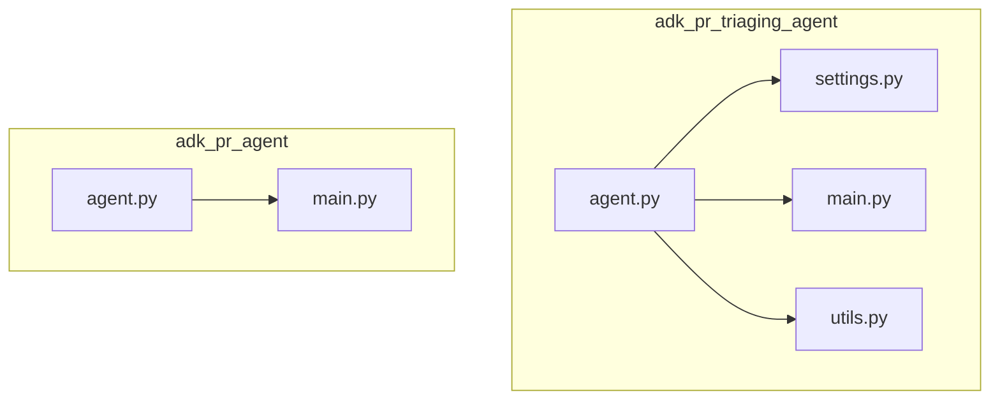
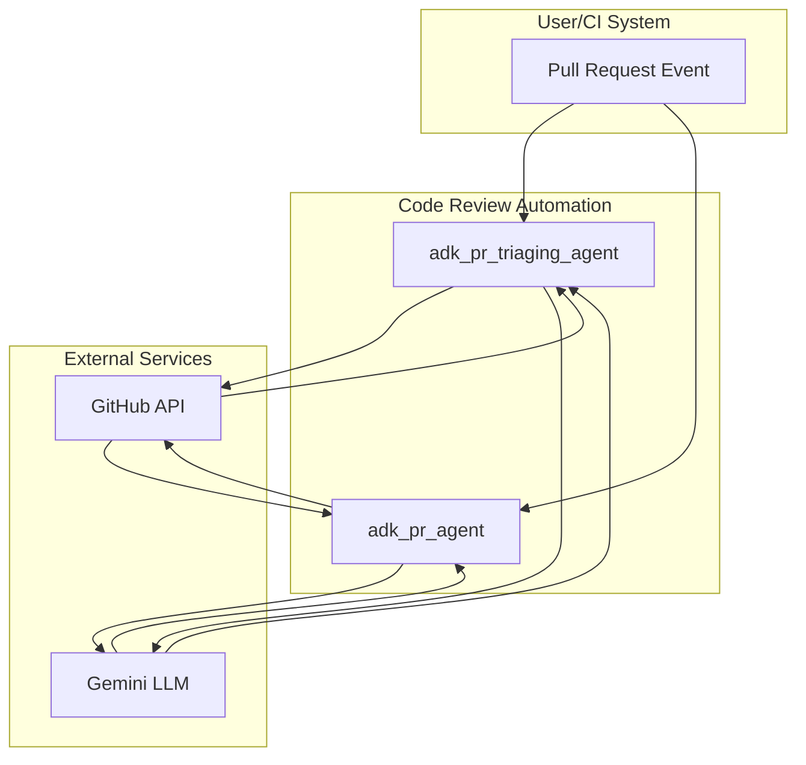
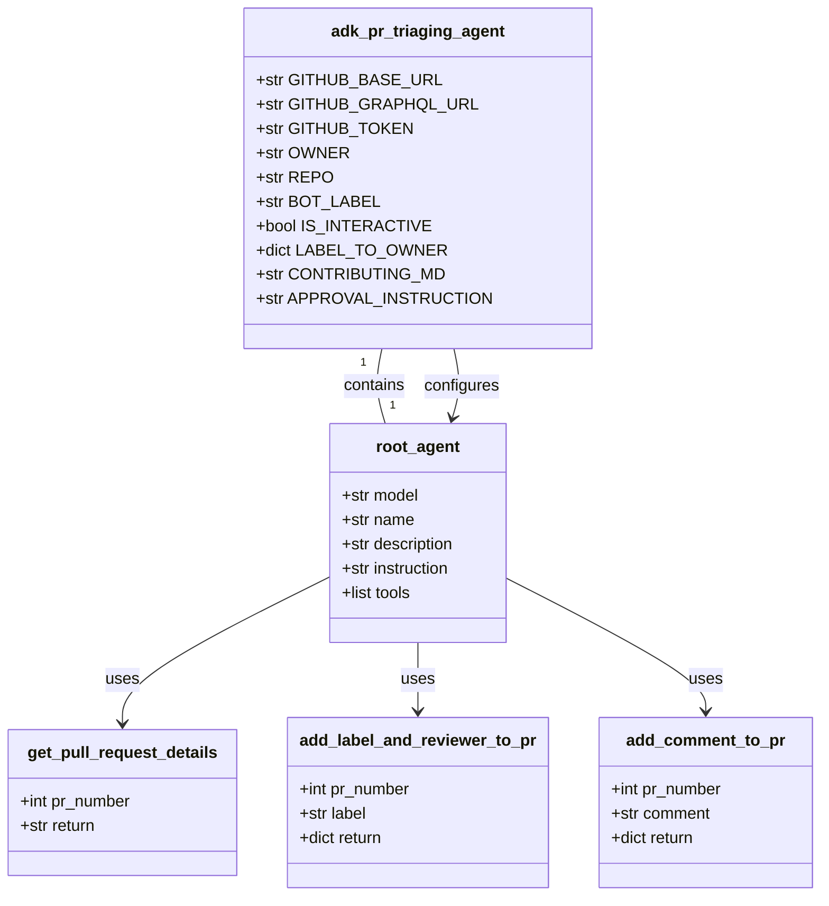
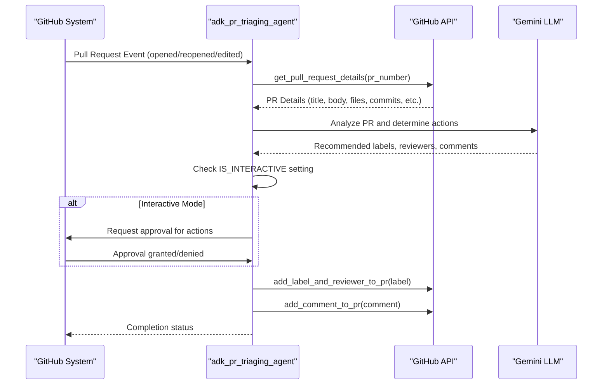
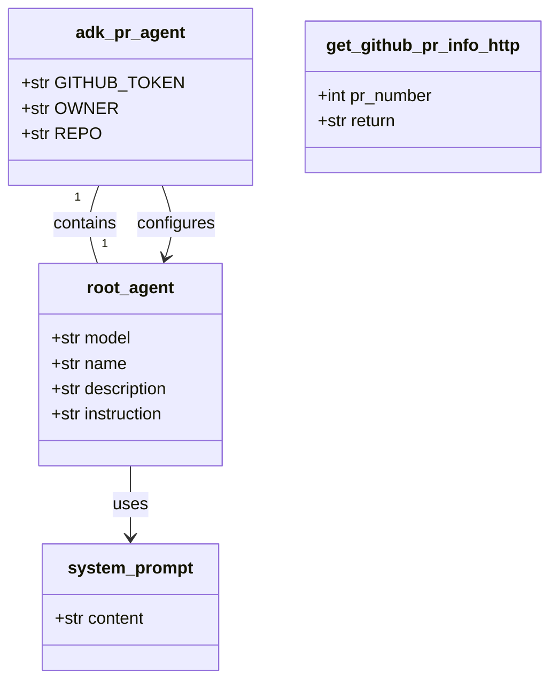
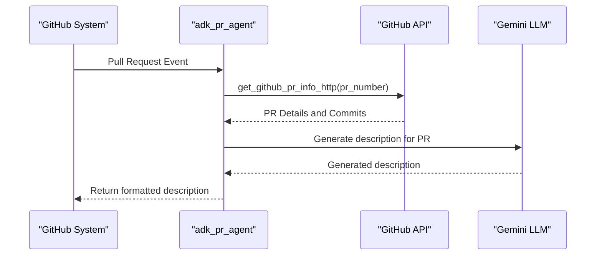
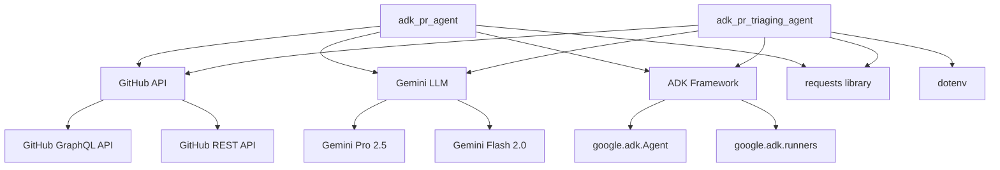

# Code Review Automation

<cite>
**Referenced Files in This Document**   
- [agent.py](file://contributing/samples/adk_pr_triaging_agent/agent.py)
- [settings.py](file://contributing/samples/adk_pr_triaging_agent/settings.py)
- [main.py](file://contributing/samples/adk_pr_triaging_agent/main.py)
- [utils.py](file://contributing/samples/adk_pr_triaging_agent/utils.py)
- [agent.py](file://contributing/samples/adk_pr_agent/agent.py)
- [main.py](file://contributing/samples/adk_pr_agent/main.py)
- [CONTRIBUTING.md](file://CONTRIBUTING.md)
</cite>

## Table of Contents
1. [Introduction](#introduction)
2. [Project Structure](#project-structure)
3. [Core Components](#core-components)
4. [Architecture Overview](#architecture-overview)
5. [Detailed Component Analysis](#detailed-component-analysis)
6. [Dependency Analysis](#dependency-analysis)
7. [Performance Considerations](#performance-considerations)
8. [Troubleshooting Guide](#troubleshooting-guide)
9. [Conclusion](#conclusion)

## Introduction
The Code Review Automation system in the ADK framework consists of two specialized agents: the adk_pr_triaging_agent and the adk_pr_agent. These agents work together to automate various aspects of the pull request review process, from initial triaging to generating descriptive summaries. The triaging agent analyzes incoming pull requests, applies appropriate labels, assigns reviewers based on predefined rules, and ensures compliance with contribution guidelines. The PR agent focuses on generating meaningful descriptions for pull requests based on their content and associated commits. Both agents leverage the ADK framework's capabilities to interact with GitHub's API, process pull request data, and provide actionable feedback to developers, streamlining the code review workflow and ensuring consistent quality across contributions.

## Project Structure
The code review automation functionality is implemented in two separate agent directories within the contributing/samples folder. Each agent follows a consistent structure with dedicated files for the agent logic, configuration settings, main execution script, and utility functions. This modular organization allows for independent development and deployment of each agent while maintaining a uniform pattern across the codebase.

**Diagram sources**
- [agent.py](file://contributing/samples/adk_pr_triaging_agent/agent.py)
- [settings.py](file://contributing/samples/adk_pr_triaging_agent/settings.py)
- [main.py](file://contributing/samples/adk_pr_triaging_agent/main.py)
- [utils.py](file://contributing/samples/adk_pr_triaging_agent/utils.py)
- [agent.py](file://contributing/samples/adk_pr_agent/agent.py)
- [main.py](file://contributing/samples/adk_pr_agent/main.py)

**Section sources**
- [agent.py](file://contributing/samples/adk_pr_triaging_agent/agent.py)
- [settings.py](file://contributing/samples/adk_pr_triaging_agent/settings.py)
- [main.py](file://contributing/samples/adk_pr_triaging_agent/main.py)
- [utils.py](file://contributing/samples/adk_pr_triaging_agent/utils.py)
- [agent.py](file://contributing/samples/adk_pr_agent/agent.py)
- [main.py](file://contributing/samples/adk_pr_agent/main.py)

## Core Components
The core components of the code review automation system include the triaging agent, which handles pull request classification and reviewer assignment, and the PR agent, which generates descriptive summaries for pull requests. Both agents utilize the ADK framework's Agent class to define their behavior, with specific instructions and tools tailored to their respective responsibilities. The triaging agent implements a comprehensive set of functions for interacting with GitHub's API, including retrieving pull request details, adding labels, assigning reviewers, and posting comments. The PR agent focuses on extracting information from pull requests and generating concise, standardized descriptions that follow conventional commit message patterns.

**Section sources**
- [agent.py](file://contributing/samples/adk_pr_triaging_agent/agent.py)
- [agent.py](file://contributing/samples/adk_pr_agent/agent.py)

## Architecture Overview
The code review automation system follows a modular architecture where each agent operates as an independent component with specific responsibilities. The agents interact with GitHub's API through utility functions and are configured through environment variables and settings files. The system supports both interactive and automated execution modes, allowing for local testing and production deployment through GitHub Actions workflows. The agents are designed to be stateless, processing each pull request independently based on the current state of the repository.

**Diagram sources**
- [agent.py](file://contributing/samples/adk_pr_triaging_agent/agent.py)
- [agent.py](file://contributing/samples/adk_pr_agent/agent.py)
- [main.py](file://contributing/samples/adk_pr_triaging_agent/main.py)
- [main.py](file://contributing/samples/adk_pr_agent/main.py)

## Detailed Component Analysis

### adk_pr_triaging_agent Analysis
The adk_pr_triaging_agent is responsible for analyzing incoming pull requests and performing initial triage operations. It examines the pull request content, files changed, and associated metadata to determine appropriate labels and assign reviewers based on predefined rules. The agent also checks for compliance with contribution guidelines and provides feedback to authors when necessary.

#### For Object-Oriented Components:

**Diagram sources**
- [agent.py](file://contributing/samples/adk_pr_triaging_agent/agent.py)
- [settings.py](file://contributing/samples/adk_pr_triaging_agent/settings.py)

#### For API/Service Components:

**Diagram sources**
- [agent.py](file://contributing/samples/adk_pr_triaging_agent/agent.py)
- [main.py](file://contributing/samples/adk_pr_triaging_agent/main.py)
- [utils.py](file://contributing/samples/adk_pr_triaging_agent/utils.py)

### adk_pr_agent Analysis
The adk_pr_agent focuses on generating descriptive summaries for pull requests based on their content and associated commits. It extracts information from the pull request and formats it into a standardized description that follows conventional commit message patterns.

#### For Object-Oriented Components:

**Diagram sources**
- [agent.py](file://contributing/samples/adk_pr_agent/agent.py)

#### For API/Service Components:

**Diagram sources**
- [agent.py](file://contributing/samples/adk_pr_agent/agent.py)
- [main.py](file://contributing/samples/adk_pr_agent/main.py)

## Dependency Analysis
The code review automation agents depend on several external services and internal components to function properly. The primary dependencies include the GitHub API for accessing pull request data and performing actions, the Gemini LLM for natural language processing and decision making, and the ADK framework for agent orchestration and tool integration. The agents also rely on utility functions for HTTP requests and configuration management.

**Diagram sources**
- [agent.py](file://contributing/samples/adk_pr_triaging_agent/agent.py)
- [settings.py](file://contributing/samples/adk_pr_triaging_agent/settings.py)
- [utils.py](file://contributing/samples/adk_pr_triaging_agent/utils.py)
- [agent.py](file://contributing/samples/adk_pr_agent/agent.py)

**Section sources**
- [agent.py](file://contributing/samples/adk_pr_triaging_agent/agent.py)
- [settings.py](file://contributing/samples/adk_pr_triaging_agent/settings.py)
- [utils.py](file://contributing/samples/adk_pr_triaging_agent/utils.py)
- [agent.py](file://contributing/samples/adk_pr_agent/agent.py)

## Performance Considerations
The code review automation agents are designed to handle pull request events efficiently while minimizing API usage and processing time. The agents implement several performance optimizations, including request batching for commit retrieval, response truncation to prevent token limit issues, and error handling to ensure robust operation. The system is designed to be stateless, allowing for horizontal scaling when deployed in production environments. For large repositories with high pull request volume, the agents can be deployed as part of a serverless architecture to handle spikes in activity without requiring dedicated infrastructure.

**Section sources**
- [agent.py](file://contributing/samples/adk_pr_triaging_agent/agent.py)
- [utils.py](file://contributing/samples/adk_pr_triaging_agent/utils.py)
- [agent.py](file://contributing/samples/adk_pr_agent/agent.py)

## Troubleshooting Guide
Common issues with the code review automation agents typically relate to authentication, API rate limits, or configuration errors. The most frequent problems include missing or invalid GitHub tokens, incorrect repository or owner settings, and network connectivity issues. The agents provide detailed error messages and logging to help diagnose these issues. For interactive mode, users should ensure that the GITHUB_TOKEN environment variable is set with appropriate permissions. For automated workflows, repository secrets must be properly configured in GitHub Actions. The agents also include safeguards against infinite loops and excessive API calls to prevent abuse of GitHub's rate limits.

**Section sources**
- [settings.py](file://contributing/samples/adk_pr_triaging_agent/settings.py)
- [utils.py](file://contributing/samples/adk_pr_triaging_agent/utils.py)
- [agent.py](file://contributing/samples/adk_pr_triaging_agent/agent.py)

## Conclusion
The Code Review Automation system implemented through the adk_pr_triaging_agent and adk_pr_agent provides a comprehensive solution for streamlining the pull request review process. By automating routine tasks such as labeling, reviewer assignment, and description generation, these agents free up developer time for more complex code review activities. The modular design allows for easy extension and customization to meet specific project requirements. The integration with GitHub's API and the ADK framework ensures reliable operation and seamless deployment in both interactive and automated environments. As the system evolves, additional features such as automated testing integration, security vulnerability detection, and more sophisticated code quality analysis could be incorporated to further enhance the code review process.