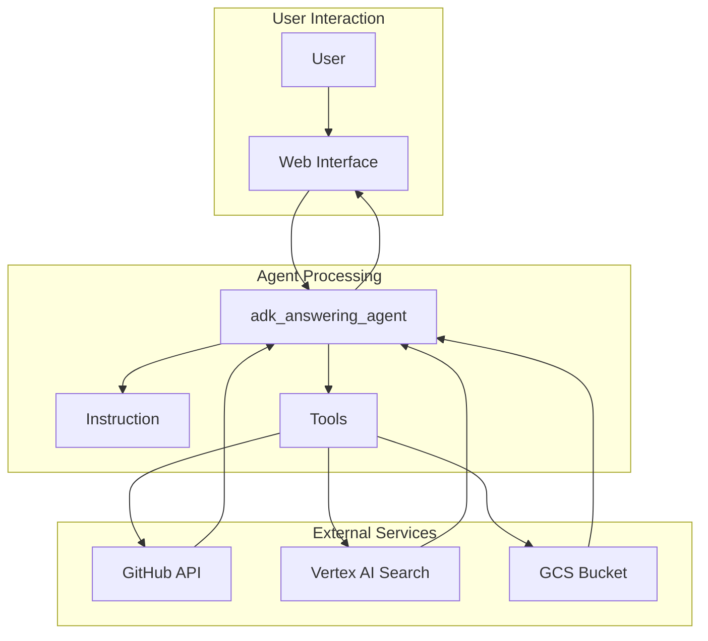
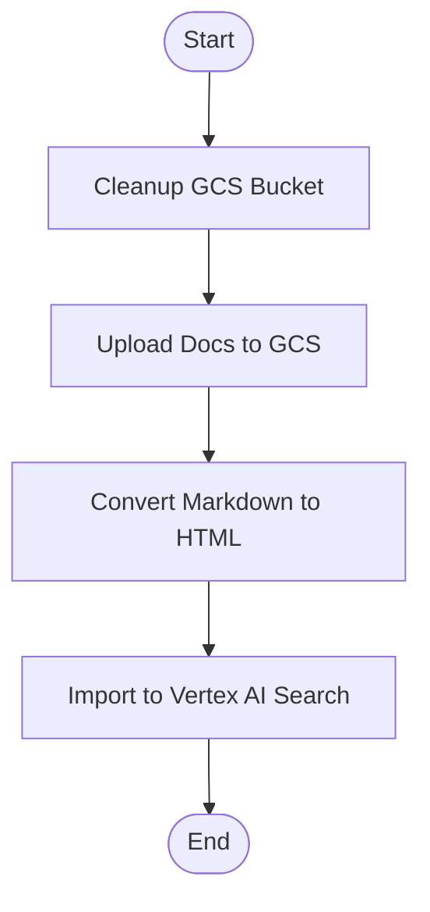
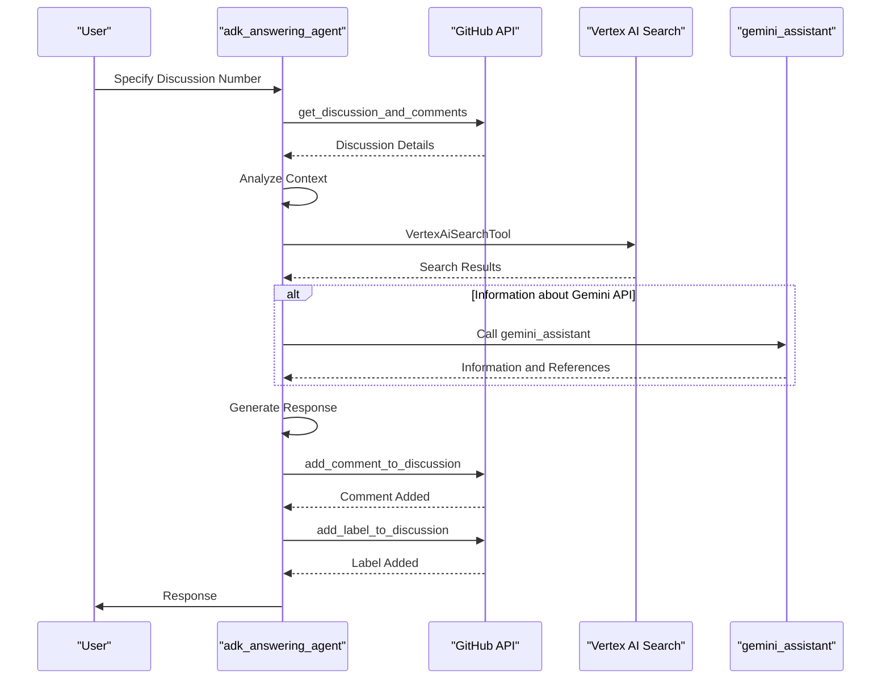
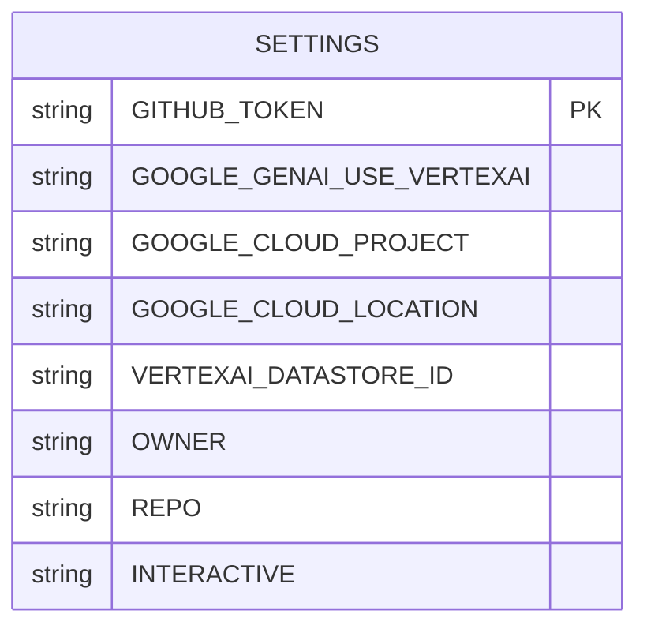
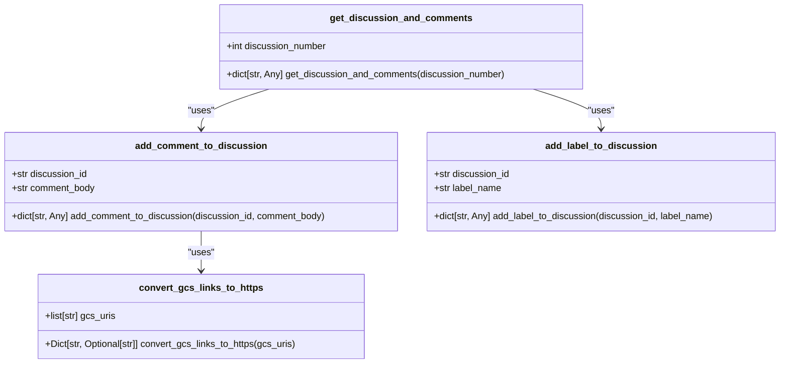

# Customer Support Automation

<cite>
**Referenced Files in This Document**   
- [agent.py](file://contributing/samples/adk_answering_agent/agent.py)
- [settings.py](file://contributing/samples/adk_answering_agent/settings.py)
- [tools.py](file://contributing/samples/adk_answering_agent/tools.py)
- [main.py](file://contributing/samples/adk_answering_agent/main.py)
- [upload_docs_to_vertex_ai_search.py](file://contributing/samples/adk_answering_agent/upload_docs_to_vertex_ai_search.py)
- [utils.py](file://contributing/samples/adk_answering_agent/utils.py)
- [answer_discussions.py](file://contributing/samples/adk_answering_agent/answer_discussions.py)
- [gemini_assistant/agent.py](file://contributing/samples/adk_answering_agent/gemini_assistant/agent.py)
- [src/google/adk/tools/vertex_ai_search_tool.py](file://src/google/adk/tools/vertex_ai_search_tool.py)
</cite>

## Table of Contents
1. [Introduction](#introduction)
2. [Architecture Overview](#architecture-overview)
3. [Document Upload Process](#document-upload-process)
4. [Query Handling and Response Generation Pipeline](#query-handling-and-response-generation-pipeline)
5. [Configuration Options in settings.py](#configuration-options-in-settingspy)
6. [Extended Functionality in tools.py](#extended-functionality-in-toolspy)
7. [Adapting the Agent for Different Knowledge Bases](#adapting-the-agent-for-different-knowledge-bases)
8. [Handling Complex Customer Queries](#handling-complex-customer-queries)
9. [Conversation Context Management](#conversation-context-management)
10. [Human-in-the-Loop Escalation](#human-in-the-loop-escalation)
11. [Performance Considerations](#performance-considerations)
12. [Conclusion](#conclusion)

## Introduction

The Customer Support Automation use case focuses on the adk_answering_agent implementation, which leverages Vertex AI Search to provide accurate responses to customer inquiries by retrieving relevant documentation. This agent is designed to assist in answering questions in GitHub discussions for the `google/adk-python` repository by using a large language model to analyze open discussions, retrieve information from a document store, generate responses, and post comments in GitHub discussions.

The agent operates in three distinct modes: interactive mode for local use, batch script mode for oncall use, and a fully automated GitHub Actions workflow (TBD). The interactive mode allows users to review recommendations in real-time before any changes are made to the repository's issues, while the batch script mode enables the oncall team to process multiple discussions in a single run.

**Section sources**
- [README.md](file://contributing/samples/adk_answering_agent/README.md#L1-L108)

## Architecture Overview

The architecture of the adk_answering_agent involves several components working together to provide accurate responses to customer inquiries. The agent uses the Vertex AI Search tool to retrieve relevant information from a document store, which is then used to generate responses. The agent can also call the gemini_assistant agent to provide information about the Gemini API.

The agent is configured with a set of tools, including the VertexAiSearchTool, AgentTool, get_discussion_and_comments, add_comment_to_discussion, add_label_to_discussion, and convert_gcs_links_to_https. These tools enable the agent to interact with GitHub discussions, retrieve information from the document store, and convert GCS links to HTTPS links.

**Diagram sources**
- [agent.py](file://contributing/samples/adk_answering_agent/agent.py#L15-L87)
- [settings.py](file://contributing/samples/adk_answering_agent/settings.py#L15-L46)
- [tools.py](file://contributing/samples/adk_answering_agent/tools.py#L1-L231)

## Document Upload Process

The document upload process involves uploading ADK-related documentation to a Vertex AI Search datastore to update the knowledge base. This process is handled by the `upload_docs_to_vertex_ai_search.py` script, which uploads the documentation from the local file system to a Google Cloud Storage (GCS) bucket and then imports it into the Vertex AI Search datastore.

The script first cleans up the GCS bucket by deleting all objects with a specified prefix. It then uploads the documentation from the local file system to the GCS bucket, converting Markdown files to HTML format for better compatibility with Vertex AI Search. Finally, it triggers a bulk import task from the GCS bucket to the Vertex AI Search datastore.

**Diagram sources**
- [upload_docs_to_vertex_ai_search.py](file://contributing/samples/adk_answering_agent/upload_docs_to_vertex_ai_search.py#L1-L223)

**Section sources**
- [upload_docs_to_vertex_ai_search.py](file://contributing/samples/adk_answering_agent/upload_docs_to_vertex_ai_search.py#L1-L223)

## Query Handling and Response Generation Pipeline

The query handling and response generation pipeline involves several steps to ensure accurate and relevant responses to customer inquiries. When a user specifies a discussion number, the agent follows a series of steps to retrieve and process the necessary information.

First, the agent uses the `get_discussion_and_comments` tool to fetch the details of the discussion, including the comments. It then focuses on the latest comment but references all comments if needed to understand the context. If the discussion is not closed, the latest comment is not from the agent or other agents, and the latest comment is asking a question or requesting information, the agent proceeds to the next step.

The agent uses the `VertexAiSearchTool` to find relevant information before answering. If the information is about the Gemini API, the agent calls the `gemini_assistant` agent to provide the information and references. If the agent can find relevant information, it uses the `add_comment_to_discussion` tool to add a comment to the discussion and adds the label specified in `BOT_RESPONSE_LABEL` to the discussion using the `add_label_to_discussion` tool.

**Diagram sources**
- [agent.py](file://contributing/samples/adk_answering_agent/agent.py#L48-L78)
- [tools.py](file://contributing/samples/adk_answering_agent/tools.py#L27-L231)

**Section sources**
- [agent.py](file://contributing/samples/adk_answering_agent/agent.py#L48-L78)
- [tools.py](file://contributing/samples/adk_answering_agent/tools.py#L27-L231)

## Configuration Options in settings.py

The `settings.py` file contains several configuration options that customize the behavior of the adk_answering_agent. These options include environment variables for GitHub and Google Cloud services, as well as settings for the agent's interaction mode.

The `GITHUB_TOKEN` environment variable is required for both interactive and workflow modes and provides the agent with the necessary permissions to interact with GitHub issues. The `GOOGLE_GENAI_USE_VERTEXAI` environment variable is required to use Google Vertex AI for authentication. The `GOOGLE_CLOUD_PROJECT` and `GOOGLE_CLOUD_LOCATION` environment variables specify the Google Cloud project ID and region, respectively.

The `VERTEXAI_DATASTORE_ID` environment variable is required and specifies the full Vertex AI datastore ID for the document store. The `OWNER` and `REPO` environment variables specify the GitHub organization or username and repository name, respectively. The `INTERACTIVE` environment variable controls the agent's interaction mode, with a value of `1` for interactive mode and `0` for automated workflow mode.

**Diagram sources**
- [settings.py](file://contributing/samples/adk_answering_agent/settings.py#L15-L46)

**Section sources**
- [settings.py](file://contributing/samples/adk_answering_agent/settings.py#L15-L46)

## Extended Functionality in tools.py

The `tools.py` file contains several functions that extend the functionality of the adk_answering_agent. These functions include `get_discussion_and_comments`, `add_comment_to_discussion`, `add_label_to_discussion`, and `convert_gcs_links_to_https`.

The `get_discussion_and_comments` function fetches a discussion and its comments using the GitHub GraphQL API. It takes the discussion number as an argument and returns a dictionary with the request status and the discussion details. The `add_comment_to_discussion` function adds a comment to a specific discussion using the GitHub GraphQL API. It takes the discussion ID and comment body as arguments and returns the status of the request and the new comment's details.

The `add_label_to_discussion` function adds a label to a specific discussion using the GitHub GraphQL API. It takes the discussion ID and label name as arguments and returns the status of the request and the label details. The `convert_gcs_links_to_https` function converts GCS files links into publicly accessible HTTPS links. It takes a list of GCS files links as an argument and returns a dictionary mapping the original GCS files links to the converted HTTPS links.

**Diagram sources**
- [tools.py](file://contributing/samples/adk_answering_agent/tools.py#L27-L231)

**Section sources**
- [tools.py](file://contributing/samples/adk_answering_agent/tools.py#L27-L231)

## Adapting the Agent for Different Knowledge Bases

Adapting the adk_answering_agent for different knowledge bases involves modifying the document upload process and updating the configuration options in `settings.py`. The document upload process can be customized to include different types of documentation, such as Markdown files, Python files, or other formats supported by Vertex AI Search.

To adapt the agent for a different knowledge base, the `ADK_DOCS_ROOT_PATH` and `ADK_PYTHON_ROOT_PATH` environment variables should be updated to point to the root directories of the new documentation. The `GCS_BUCKET_NAME` environment variable should be updated to specify the GCS bucket where the documentation will be stored. The `VERTEXAI_DATASTORE_ID` environment variable should be updated to specify the Vertex AI datastore ID for the new knowledge base.

Best practices for document preprocessing and indexing include converting Markdown files to HTML format for better compatibility with Vertex AI Search, ensuring that the documentation is well-organized and easy to navigate, and regularly updating the knowledge base to include the latest information.

**Section sources**
- [upload_docs_to_vertex_ai_search.py](file://contributing/samples/adk_answering_agent/upload_docs_to_vertex_ai_search.py#L1-L223)
- [settings.py](file://contributing/samples/adk_answering_agent/settings.py#L15-L46)

## Handling Complex Customer Queries

Handling complex customer queries involves using the `VertexAiSearchTool` to retrieve relevant information from the document store and the `gemini_assistant` agent to provide information about the Gemini API. The agent follows a series of steps to ensure accurate and relevant responses to complex queries.

When a user asks a complex question, the agent uses the `VertexAiSearchTool` to find relevant information before answering. If the information is about the Gemini API, the agent calls the `gemini_assistant` agent to provide the information and references. The agent can call the `gemini_assistant` agent with multiple queries to find all the relevant information.

The agent generates a response based on the information found in the document store and references the source document in the response. If the agent cannot find the answer or information in the document store, it responds with "I can't find the answer or information in the document store."

**Section sources**
- [agent.py](file://contributing/samples/adk_answering_agent/agent.py#L56-L78)
- [gemini_assistant/agent.py](file://contributing/samples/adk_answering_agent/gemini_assistant/agent.py#L82-L94)

## Conversation Context Management

Conversation context management involves maintaining the context of the conversation across multiple turns to ensure accurate and relevant responses. The agent uses the `get_discussion_and_comments` tool to fetch the details of the discussion, including the comments, and focuses on the latest comment but references all comments if needed to understand the context.

The agent creates a new session for each discussion to avoid interference and uses the `InMemoryRunner` to manage the session. The `InMemoryRunner` creates a session service that stores the session data in memory, allowing the agent to maintain the context of the conversation across multiple turns.

**Section sources**
- [answer_discussions.py](file://contributing/samples/adk_answering_agent/answer_discussions.py#L147-L149)
- [main.py](file://contributing/samples/adk_answering_agent/main.py#L39-L41)

## Human-in-the-Loop Escalation

Human-in-the-loop escalation involves asking for user approval or confirmation before posting a comment to a GitHub issue in interactive mode. The agent is instructed to ask for user approval or confirmation for adding the comment when `IS_INTERACTIVE` is set to `True`.

In non-interactive mode, the agent does not wait or ask for user approval or confirmation for adding the comment. This allows the agent to operate in a fully automated workflow without requiring human intervention.

**Section sources**
- [agent.py](file://contributing/samples/adk_answering_agent/agent.py#L29-L37)
- [settings.py](file://contributing/samples/adk_answering_agent/settings.py#L45)

## Performance Considerations

Performance considerations for the adk_answering_agent include latency optimization, cost management, and scalability for high-volume support scenarios. Latency optimization involves minimizing the time it takes for the agent to respond to customer inquiries by using efficient algorithms and data structures.

Cost management involves minimizing the cost of using the agent by optimizing the use of resources, such as reducing the number of API calls and using efficient data storage and retrieval methods. Scalability for high-volume support scenarios involves ensuring that the agent can handle a large number of customer inquiries simultaneously by using scalable infrastructure and load balancing.

**Section sources**
- [agent.py](file://contributing/samples/adk_answering_agent/agent.py#L1-L88)
- [tools.py](file://contributing/samples/adk_answering_agent/tools.py#L1-L231)
- [upload_docs_to_vertex_ai_search.py](file://contributing/samples/adk_answering_agent/upload_docs_to_vertex_ai_search.py#L1-L223)

## Conclusion

The adk_answering_agent implementation provides a comprehensive solution for customer support automation by leveraging Vertex AI Search to provide accurate responses to customer inquiries. The agent integrates with GitHub discussions to retrieve and process information, generate responses, and post comments. The document upload process, query handling, and response generation pipeline are designed to ensure accurate and relevant responses to customer inquiries.

The configuration options in `settings.py` and the extended functionality in `tools.py` provide flexibility and customization for different use cases. Adapting the agent for different knowledge bases, handling complex customer queries, managing conversation context, and implementing human-in-the-loop escalation are key features that enhance the agent's capabilities. Performance considerations such as latency optimization, cost management, and scalability ensure that the agent can handle high-volume support scenarios effectively.