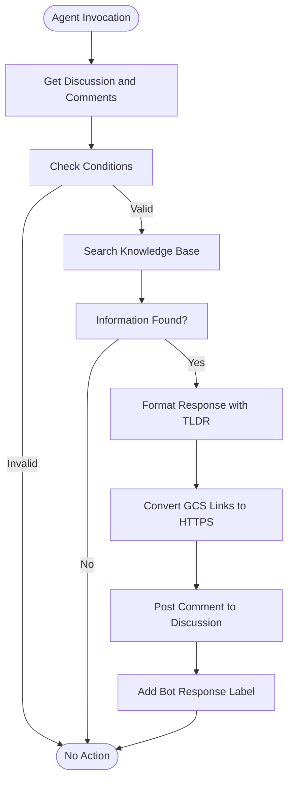
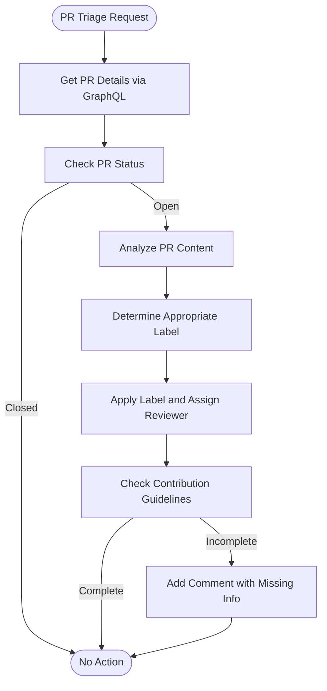

# Real-world Use Cases

<cite>
**Referenced Files in This Document**   
- [agent.py](file://contributing/samples/adk_answering_agent/agent.py)
- [settings.py](file://contributing/samples/adk_answering_agent/settings.py)
- [utils.py](file://contributing/samples/adk_answering_agent/utils.py)
- [main.py](file://contributing/samples/adk_answering_agent/main.py)
- [agent.py](file://contributing/samples/adk_pr_triaging_agent/agent.py)
- [settings.py](file://contributing/samples/adk_pr_triaging_agent/settings.py)
- [utils.py](file://contributing/samples/adk_pr_triaging_agent/utils.py)
- [main.py](file://contributing/samples/adk_pr_triaging_agent/main.py)
- [agent.py](file://contributing/samples/adk_issue_formatting_agent/agent.py)
- [settings.py](file://contributing/samples/adk_issue_formatting_agent/settings.py)
- [utils.py](file://contributing/samples/adk_issue_formatting_agent/utils.py)
</cite>

## Table of Contents
1. [Introduction](#introduction)
2. [Customer Support Agents](#customer-support-agents)
3. [PR Triage Systems](#pr-triage-systems)
4. [Issue Formatting Tools](#issue-formatting-tools)
5. [Workflow Automation Agents](#workflow-automation-agents)
6. [adk_answering_agent Architecture](#adk_answering_agent-architecture)
7. [adk_pr_triaging_agent Architecture](#adk_pr_triaging_agent-architecture)
8. [Tool Integrations and Configuration](#tool-integrations-and-configuration)
9. [Human-in-the-Loop Implementation](#human-in-the-loop-implementation)
10. [Session State Management](#session-state-management)
11. [External API Integration](#external-api-integration)
12. [Adapting to Organizational Requirements](#adapting-to-organizational-requirements)
13. [Handling Ambiguous Requests](#handling-ambiguous-requests)
14. [Conversation Context Management](#conversation-context-management)
15. [Response Accuracy Strategies](#response-accuracy-strategies)
16. [Performance Considerations](#performance-considerations)
17. [Production Deployment Best Practices](#production-deployment-best-practices)

## Introduction
The ADK framework enables the creation of sophisticated AI agents for automating complex workflows in software development and customer support. This document explores real-world applications of the framework, focusing on practical implementations that address common challenges in development teams and support operations. The documented use cases demonstrate how to leverage the ADK framework's capabilities to build intelligent agents that can triage issues, format content, and automate workflows while maintaining high accuracy and reliability.

**Section sources**
- [agent.py](file://contributing/samples/adk_answering_agent/agent.py#L1-L88)
- [agent.py](file://contributing/samples/adk_pr_triaging_agent/agent.py#L1-L320)

## Customer Support Agents
Customer support agents built with the ADK framework can automatically respond to user inquiries by retrieving relevant information from knowledge bases and engaging with users through structured workflows. The framework enables these agents to maintain context across conversations, verify information accuracy, and escalate complex issues to human agents when necessary. By integrating with external knowledge repositories and support ticketing systems, these agents can provide timely and accurate responses while reducing the workload on human support teams.

**Section sources**
- [agent.py](file://contributing/samples/adk_answering_agent/agent.py#L1-L88)
- [utils.py](file://contributing/samples/adk_answering_agent/utils.py#L1-L171)

## PR Triage Systems
PR triage systems automate the initial review process for pull requests by analyzing code changes, identifying relevant reviewers, and ensuring compliance with contribution guidelines. The ADK framework enables the creation of triage agents that can examine pull request details, including code diffs, commit messages, and CI/CD status, to make informed decisions about labeling and reviewer assignment. These systems help maintain code quality by ensuring that pull requests receive timely attention from the appropriate team members.

**Section sources**
- [agent.py](file://contributing/samples/adk_pr_triaging_agent/agent.py#L1-L320)
- [utils.py](file://contributing/samples/adk_pr_triaging_agent/utils.py#L1-L121)

## Issue Formatting Tools
Issue formatting tools ensure that bug reports and feature requests contain all necessary information by validating content against predefined templates. These tools can automatically detect missing information in issue descriptions and request additional details from submitters. By enforcing consistent formatting and completeness, these tools improve the efficiency of issue resolution and reduce back-and-forth communication between reporters and developers.

**Section sources**
- [agent.py](file://contributing/samples/adk_issue_formatting_agent/agent.py#L1-L242)
- [utils.py](file://contributing/samples/adk_issue_formatting_agent/utils.py#L1-L55)

## Workflow Automation Agents
Workflow automation agents coordinate complex processes by orchestrating multiple tasks and integrating with various systems. These agents can manage end-to-end workflows, from issue creation to resolution, by combining multiple capabilities such as natural language processing, API integration, and decision-making. The ADK framework provides the infrastructure needed to build robust automation agents that can handle exceptions, maintain state, and adapt to changing requirements.

**Section sources**
- [agent.py](file://contributing/samples/adk_answering_agent/agent.py#L1-L88)
- [agent.py](file://contributing/samples/adk_pr_triaging_agent/agent.py#L1-L320)

## adk_answering_agent Architecture
The adk_answering_agent is designed to respond to questions about the ADK repository by retrieving information from a document store and engaging with GitHub discussions. The agent's architecture follows a structured decision-making process that begins with retrieving discussion details and ends with posting a response. It uses the VertexAiSearchTool to find relevant information and can call other agents, such as the gemini_assistant, to obtain specialized knowledge. The agent's behavior is controlled by configuration settings that determine whether human approval is required before posting comments.

**Diagram sources**
- [agent.py](file://contributing/samples/adk_answering_agent/agent.py#L1-L88)
- [main.py](file://contributing/samples/adk_answering_agent/main.py#L1-L71)

**Section sources**
- [agent.py](file://contributing/samples/adk_answering_agent/agent.py#L1-L88)
- [main.py](file://contributing/samples/adk_answering_agent/main.py#L1-L71)

## adk_pr_triaging_agent Architecture
The adk_pr_triaging_agent automates the triage process for pull requests by analyzing their content and applying appropriate labels and reviewers. The agent's architecture is designed to handle the complexity of pull request evaluation by retrieving detailed information through GraphQL queries and examining code diffs. It uses a mapping of labels to owners to automatically assign reviewers and checks compliance with contribution guidelines before making recommendations. The agent's decision-making process is guided by explicit rules that determine appropriate labels based on the nature of the changes.

**Diagram sources**
- [agent.py](file://contributing/samples/adk_pr_triaging_agent/agent.py#L1-L320)
- [main.py](file://contributing/samples/adk_pr_triaging_agent/main.py#L1-L66)

**Section sources**
- [agent.py](file://contributing/samples/adk_pr_triaging_agent/agent.py#L1-L320)
- [main.py](file://contributing/samples/adk_pr_triaging_agent/main.py#L1-L66)

## Tool Integrations and Configuration
The ADK framework provides a comprehensive set of tools that can be integrated into agents to extend their capabilities. These tools include the VertexAiSearchTool for retrieving information from knowledge bases, GitHub API tools for interacting with repositories, and custom tools for specific workflows. Configuration is managed through settings files that define environment variables and control agent behavior. The framework's modular design allows for easy integration of new tools and seamless replacement of existing ones.

**Section sources**
- [settings.py](file://contributing/samples/adk_answering_agent/settings.py#L1-L46)
- [settings.py](file://contributing/samples/adk_pr_triaging_agent/settings.py#L1-L34)
- [agent.py](file://contributing/samples/adk_answering_agent/agent.py#L1-L88)

## Human-in-the-Loop Implementation
The human-in-the-loop feature allows agents to request approval from human operators before taking certain actions. This is implemented through configuration settings that control whether the agent should wait for user confirmation. When enabled, the agent will pause its workflow and await human input before proceeding with actions such as posting comments or applying labels. This feature provides a safety mechanism for critical operations while maintaining automation for routine tasks.

**Section sources**
- [settings.py](file://contributing/samples/adk_answering_agent/settings.py#L45-L46)
- [settings.py](file://contributing/samples/adk_pr_triaging_agent/settings.py#L33-L34)
- [agent.py](file://contributing/samples/adk_answering_agent/agent.py#L29-L37)

## Session State Management
Session state management in the ADK framework ensures that agents can maintain context across multiple interactions. The framework provides session services that store conversation history and relevant data, allowing agents to reference previous exchanges when generating responses. This capability is essential for handling complex workflows that span multiple steps and require continuity of information. The session state is managed through the Runner class, which coordinates the execution of agent workflows and maintains state information.

**Section sources**
- [main.py](file://contributing/samples/adk_answering_agent/main.py#L35-L41)
- [main.py](file://contributing/samples/adk_pr_triaging_agent/main.py#L31-L37)

## External API Integration
External API integration enables agents to interact with third-party services and retrieve real-time information. The ADK framework provides utilities for making HTTP requests to external APIs, handling authentication, and processing responses. These capabilities are used extensively in the sample agents to interact with GitHub's REST and GraphQL APIs. The framework's design allows for easy integration of additional APIs through custom tools that encapsulate the details of API interactions.

**Section sources**
- [utils.py](file://contributing/samples/adk_answering_agent/utils.py#L38-L45)
- [utils.py](file://contributing/samples/adk_pr_triaging_agent/utils.py#L36-L43)
- [utils.py](file://contributing/samples/adk_issue_formatting_agent/utils.py#L27-L34)

## Adapting to Organizational Requirements
The ADK framework can be adapted to meet specific organizational requirements by modifying configuration files and extending agent functionality. Custom ticketing systems can be integrated by creating new tools that interface with their APIs, while code review processes can be accommodated by adjusting the rules for PR triage. The framework's modular architecture makes it easy to customize agents for specific workflows without modifying core components.

**Section sources**
- [settings.py](file://contributing/samples/adk_pr_triaging_agent/settings.py#L1-L34)
- [agent.py](file://contributing/samples/adk_pr_triaging_agent/agent.py#L31-L42)

## Handling Ambiguous Requests
Agents built with the ADK framework handle ambiguous requests by following a structured decision-making process that includes context analysis and information verification. When faced with unclear requests, agents can use their tools to gather additional information before responding. The framework encourages conservative behavior by instructing agents not to respond when they cannot find sufficient information in the knowledge base, preventing the generation of potentially incorrect answers.

**Section sources**
- [agent.py](file://contributing/samples/adk_answering_agent/agent.py#L67-L68)
- [agent.py](file://contributing/samples/adk_issue_formatting_agent/agent.py#L157-L158)

## Conversation Context Management
Conversation context management is achieved through the combination of session state and explicit context handling in agent instructions. Agents are designed to focus on the latest comment while referencing previous exchanges when necessary to understand the full context. The framework provides tools for retrieving conversation history and incorporating it into the agent's decision-making process. This ensures that responses are relevant and consistent with the ongoing discussion.

**Section sources**
- [agent.py](file://contributing/samples/adk_answering_agent/agent.py#L50-L51)
- [agent.py](file://contributing/samples/adk_issue_formatting_agent/agent.py#L186-L187)

## Response Accuracy Strategies
The ADK framework employs several strategies to ensure response accuracy, including grounding responses in retrieved information, verifying citations, and avoiding speculation. Agents are instructed to base their responses on information found in the knowledge base and to refrain from inventing details. The framework also includes mechanisms for converting internal links to publicly accessible URLs, ensuring that references are valid and accessible to users.

**Section sources**
- [agent.py](file://contributing/samples/adk_answering_agent/agent.py#L64-L65)
- [utils.py](file://contributing/samples/adk_answering_agent/utils.py#L84-L148)

## Performance Considerations
Performance considerations for ADK agents include efficient API usage, response time optimization, and resource management. Agents are designed to minimize the number of API calls by retrieving all necessary information in a single request when possible. The framework supports asynchronous execution, allowing agents to handle multiple tasks concurrently. Configuration options enable fine-tuning of performance characteristics, such as timeout settings and retry policies.

**Section sources**
- [utils.py](file://contributing/samples/adk_answering_agent/utils.py#L40-L43)
- [utils.py](file://contributing/samples/adk_pr_triaging_agent/utils.py#L39-L41)

## Production Deployment Best Practices
Best practices for deploying ADK agents in production environments include thorough testing, monitoring, and gradual rollout. Agents should be tested with real-world scenarios to ensure they behave as expected before being deployed. Monitoring should be implemented to track agent performance and detect issues. The framework supports interactive mode for testing and validation, allowing human operators to review agent decisions before they are applied in production.

**Section sources**
- [settings.py](file://contributing/samples/adk_answering_agent/settings.py#L45-L46)
- [main.py](file://contributing/samples/adk_answering_agent/main.py#L57-L71)