# Specialized Agent Examples

<cite>
**Referenced Files in This Document**
- [adk_answering_agent/agent.py](file://contributing/samples/adk_answering_agent/agent.py)
- [adk_answering_agent/settings.py](file://contributing/samples/adk_answering_agent/settings.py)
- [adk_documentation/tools.py](file://contributing/samples/adk_documentation/tools.py)
- [adk_documentation/settings.py](file://contributing/samples/adk_documentation/settings.py)
- [adk_issue_formatting_agent/agent.py](file://contributing/samples/adk_issue_formatting_agent/agent.py)
- [adk_issue_formatting_agent/settings.py](file://contributing/samples/adk_issue_formatting_agent/settings.py)
- [adk_pr_triaging_agent/agent.py](file://contributing/samples/adk_pr_triaging_agent/agent.py)
- [adk_pr_triaging_agent/settings.py](file://contributing/samples/adk_pr_triaging_agent/settings.py)
- [adk_stale_agent/agent.py](file://contributing/samples/adk_stale_agent/agent.py)
- [adk_stale_agent/README.md](file://contributing/samples/adk_stale_agent/README.md)
- [jira_agent/agent.py](file://contributing/samples/jira_agent/agent.py)
- [adk_knowledge_agent/agent.py](file://contributing/samples/adk_knowledge_agent/agent.py)
- [spanner_rag_agent/agent.py](file://contributing/samples/spanner_rag_agent/agent.py)
- [adk_triaging_agent/agent.py](file://contributing/samples/adk_triaging_agent/agent.py)
</cite>

## Table of Contents
1. [Introduction](#introduction)
2. [Project Structure](#project-structure)
3. [Core Components](#core-components)
4. [Architecture Overview](#architecture-overview)
5. [Detailed Component Analysis](#detailed-component-analysis)
6. [Dependency Analysis](#dependency-analysis)
7. [Performance Considerations](#performance-considerations)
8. [Troubleshooting Guide](#troubleshooting-guide)
9. [Conclusion](#conclusion)

## Introduction
This document presents specialized agent examples for domain-specific use cases built on the ADK Python framework. It covers:
- Answering agents with Retrieval-Augmented Generation (RAG) integration
- Documentation agents for knowledge management
- Issue formatting agents for GitHub workflows
- Pull Request triaging agents for development processes
- JIRA integration patterns
- Knowledge base agents
- Stale issue detection systems
- RAG implementation examples with Spanner integration

Each section explains configuration patterns, tool selection strategies, and performance optimization techniques tailored to the specialized domains, along with integration details and data flow patterns.

## Project Structure
The specialized agents are organized as independent modules under the contributing/samples directory, each with:
- An agent module defining the root Agent configuration
- Settings modules for environment-driven configuration
- Tools modules for domain-specific operations
- Optional READMEs for deployment and setup guidance

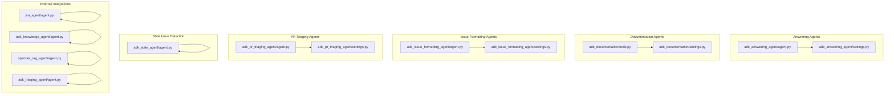

**Diagram sources**
- [adk_answering_agent/agent.py](file://contributing/samples/adk_answering_agent/agent.py#L40-L119)
- [adk_answering_agent/settings.py](file://contributing/samples/adk_answering_agent/settings.py#L21-L46)
- [adk_documentation/tools.py](file://contributing/samples/adk_documentation/tools.py#L33-L173)
- [adk_documentation/settings.py](file://contributing/samples/adk_documentation/settings.py#L21-L34)
- [adk_issue_formatting_agent/agent.py](file://contributing/samples/adk_issue_formatting_agent/agent.py#L134-L242)
- [adk_issue_formatting_agent/settings.py](file://contributing/samples/adk_issue_formatting_agent/settings.py#L21-L34)
- [adk_pr_triaging_agent/agent.py](file://contributing/samples/adk_pr_triaging_agent/agent.py#L222-L301)
- [adk_pr_triaging_agent/settings.py](file://contributing/samples/adk_pr_triaging_agent/settings.py#L21-L33)
- [adk_stale_agent/agent.py](file://contributing/samples/adk_stale_agent/agent.py#L586-L607)
- [jira_agent/agent.py](file://contributing/samples/jira_agent/agent.py#L19-L54)
- [adk_knowledge_agent/agent.py](file://contributing/samples/adk_knowledge_agent/agent.py#L61-L75)
- [spanner_rag_agent/agent.py](file://contributing/samples/spanner_rag_agent/agent.py#L99-L114)
- [adk_triaging_agent/agent.py](file://contributing/samples/adk_triaging_agent/agent.py#L249-L302)

**Section sources**
- [adk_answering_agent/agent.py](file://contributing/samples/adk_answering_agent/agent.py#L1-L119)
- [adk_documentation/tools.py](file://contributing/samples/adk_documentation/tools.py#L1-L818)
- [adk_issue_formatting_agent/agent.py](file://contributing/samples/adk_issue_formatting_agent/agent.py#L1-L242)
- [adk_pr_triaging_agent/agent.py](file://contributing/samples/adk_pr_triaging_agent/agent.py#L1-L301)
- [adk_stale_agent/agent.py](file://contributing/samples/adk_stale_agent/agent.py#L1-L607)
- [jira_agent/agent.py](file://contributing/samples/jira_agent/agent.py#L1-L54)
- [adk_knowledge_agent/agent.py](file://contributing/samples/adk_knowledge_agent/agent.py#L1-L75)
- [spanner_rag_agent/agent.py](file://contributing/samples/spanner_rag_agent/agent.py#L1-L114)
- [adk_triaging_agent/agent.py](file://contributing/samples/adk_triaging_agent/agent.py#L1-L302)

## Core Components
This section highlights the primary building blocks across specialized agents:
- Agent configuration: Each agent defines a root Agent with model, name, description, instruction, and tools.
- Tool selection: Domain-specific tools encapsulate external API interactions (GitHub, Vertex AI Search, Spanner, JIRA).
- Configuration management: Environment variables drive runtime behavior, including authentication and resource identifiers.
- Callbacks and post-processing: Some agents augment responses with citations or metadata.

Key patterns:
- RAG-enabled agents use Vertex AI Search tools to ground responses.
- GitHub agents leverage REST and GraphQL endpoints for issues, PRs, and comments.
- Stale detection agents combine GraphQL history reconstruction with LLM intent analysis.
- Spanner RAG agents integrate vector similarity search for product recommendations.

**Section sources**
- [adk_answering_agent/agent.py](file://contributing/samples/adk_answering_agent/agent.py#L40-L119)
- [adk_documentation/tools.py](file://contributing/samples/adk_documentation/tools.py#L33-L173)
- [adk_issue_formatting_agent/agent.py](file://contributing/samples/adk_issue_formatting_agent/agent.py#L134-L242)
- [adk_pr_triaging_agent/agent.py](file://contributing/samples/adk_pr_triaging_agent/agent.py#L222-L301)
- [adk_stale_agent/agent.py](file://contributing/samples/adk_stale_agent/agent.py#L586-L607)
- [jira_agent/agent.py](file://contributing/samples/jira_agent/agent.py#L19-L54)
- [adk_knowledge_agent/agent.py](file://contributing/samples/adk_knowledge_agent/agent.py#L61-L75)
- [spanner_rag_agent/agent.py](file://contributing/samples/spanner_rag_agent/agent.py#L99-L114)
- [adk_triaging_agent/agent.py](file://contributing/samples/adk_triaging_agent/agent.py#L249-L302)

## Architecture Overview
The agents follow a consistent architecture:
- Root Agent encapsulates the LLM configuration and toolset.
- Tools provide domain operations (e.g., GitHub API calls, Vertex AI Search, Spanner similarity search).
- Settings modules centralize environment-driven configuration.
- Optional callbacks enrich model outputs with citations or metadata.

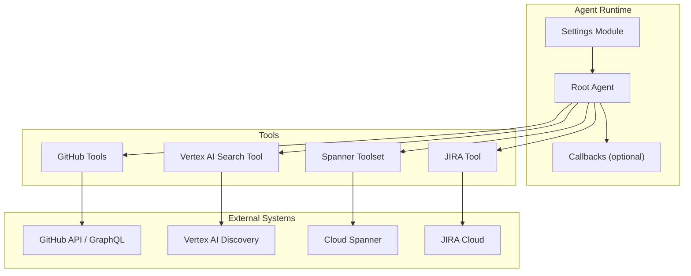

**Diagram sources**
- [adk_answering_agent/agent.py](file://contributing/samples/adk_answering_agent/agent.py#L40-L119)
- [adk_documentation/tools.py](file://contributing/samples/adk_documentation/tools.py#L33-L173)
- [adk_knowledge_agent/agent.py](file://contributing/samples/adk_knowledge_agent/agent.py#L61-L75)
- [spanner_rag_agent/agent.py](file://contributing/samples/spanner_rag_agent/agent.py#L99-L114)
- [jira_agent/agent.py](file://contributing/samples/jira_agent/agent.py#L19-L54)

## Detailed Component Analysis

### Answering Agent with RAG Integration
Purpose:
- Answer questions in GitHub discussions using a knowledge base and optionally consult a specialized assistant.

Key elements:
- Root Agent with Vertex AI Search tool and optional assistant tool.
- Instruction-driven decision flow for determining data source, analyzing context, deciding whether to respond, researching answers, and posting responses with labels and citations.
- Environment variables for GitHub token, Vertex AI datastore ID, and repository identity.

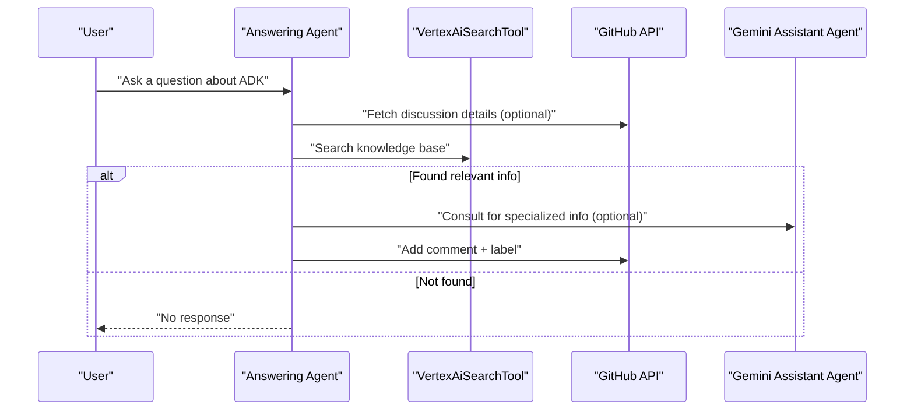

**Diagram sources**
- [adk_answering_agent/agent.py](file://contributing/samples/adk_answering_agent/agent.py#L44-L109)
- [adk_answering_agent/settings.py](file://contributing/samples/adk_answering_agent/settings.py#L21-L46)

Configuration patterns:
- Authentication: GitHub token via environment variable.
- Knowledge base: Vertex AI datastore ID via environment variable.
- Interactivity: Toggle approval instructions based on environment.

Tool selection strategy:
- Use Vertex AI Search for broad knowledge retrieval.
- Use the Gemini assistant agent for domain-specific queries requiring external expertise.

Performance optimization:
- Prefer direct discussion JSON input in workflows to avoid redundant API calls.
- Convert GCS links to HTTPS for valid citations.

**Section sources**
- [adk_answering_agent/agent.py](file://contributing/samples/adk_answering_agent/agent.py#L1-L119)
- [adk_answering_agent/settings.py](file://contributing/samples/adk_answering_agent/settings.py#L1-L46)

### Documentation Agent for Knowledge Management
Purpose:
- Manage documentation updates by analyzing releases, diffs, and local repositories, and proposing PRs.

Key elements:
- Tools for listing releases, comparing tags, cloning/pulling repos, reading files, searching locally, and creating PRs.
- Environment variables for repository owners/names, local paths, and tokens.

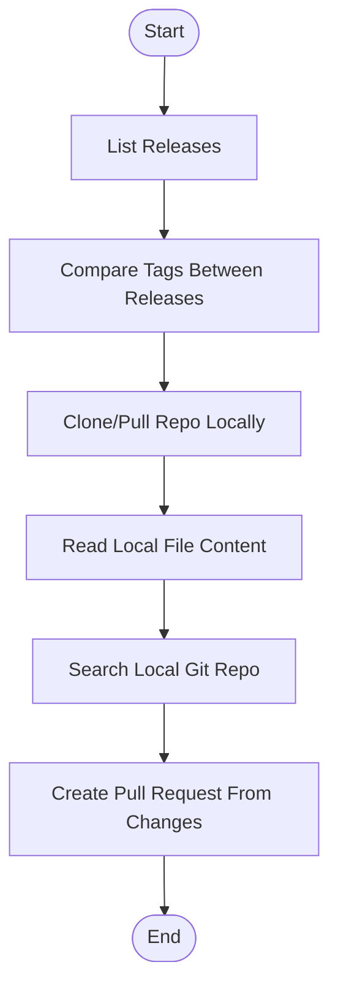

**Diagram sources**
- [adk_documentation/tools.py](file://contributing/samples/adk_documentation/tools.py#L33-L173)
- [adk_documentation/settings.py](file://contributing/samples/adk_documentation/settings.py#L21-L34)

Configuration patterns:
- GitHub token for API access.
- Local repository paths for large-scale diffs and reduced API limits.

Tool selection strategy:
- Use local git commands for large comparisons to bypass API limits.
- Use GitHub API for smaller diffs and summaries.

Performance optimization:
- Paginate releases and use local git for complete file lists.
- Filter by path prefixes to reduce processing overhead.

**Section sources**
- [adk_documentation/tools.py](file://contributing/samples/adk_documentation/tools.py#L1-L818)
- [adk_documentation/settings.py](file://contributing/samples/adk_documentation/settings.py#L1-L34)

### Issue Formatting Agent for GitHub Workflows
Purpose:
- Validate GitHub issues against templates and post targeted comments to request missing information.

Key elements:
- Templates loaded from repository issue templates.
- Tools for listing open issues, fetching issue details, adding comments, and listing comments.
- Instruction logic to determine applicability, analyze content, and post a single comment if incomplete.

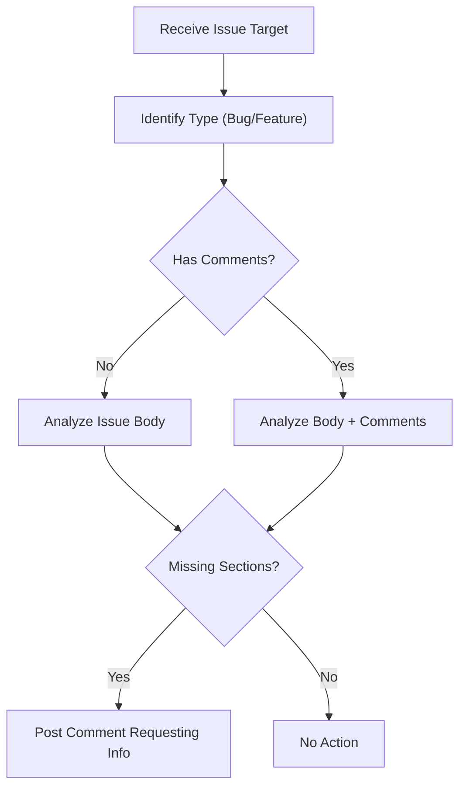

**Diagram sources**
- [adk_issue_formatting_agent/agent.py](file://contributing/samples/adk_issue_formatting_agent/agent.py#L134-L242)
- [adk_issue_formatting_agent/settings.py](file://contributing/samples/adk_issue_formatting_agent/settings.py#L21-L34)

Configuration patterns:
- GitHub token for API access.
- Repository owner/repo from environment.

Tool selection strategy:
- Use GitHub REST endpoints for CRUD operations on issues and comments.

Performance optimization:
- Limit per_page and sort by creation date to focus on recent issues.
- Post only one comment per invocation to avoid noise.

**Section sources**
- [adk_issue_formatting_agent/agent.py](file://contributing/samples/adk_issue_formatting_agent/agent.py#L1-L242)
- [adk_issue_formatting_agent/settings.py](file://contributing/samples/adk_issue_formatting_agent/settings.py#L1-L34)

### PR Triaging Agent for Development Processes
Purpose:
- Automatically triage pull requests by labeling, adding comments, and ensuring adherence to contribution guidelines.

Key elements:
- GraphQL query to fetch PR details, comments, commits, and status checks.
- Allowed labels and contribution guidelines embedded in instruction.
- Tools to add labels and comments to PRs.

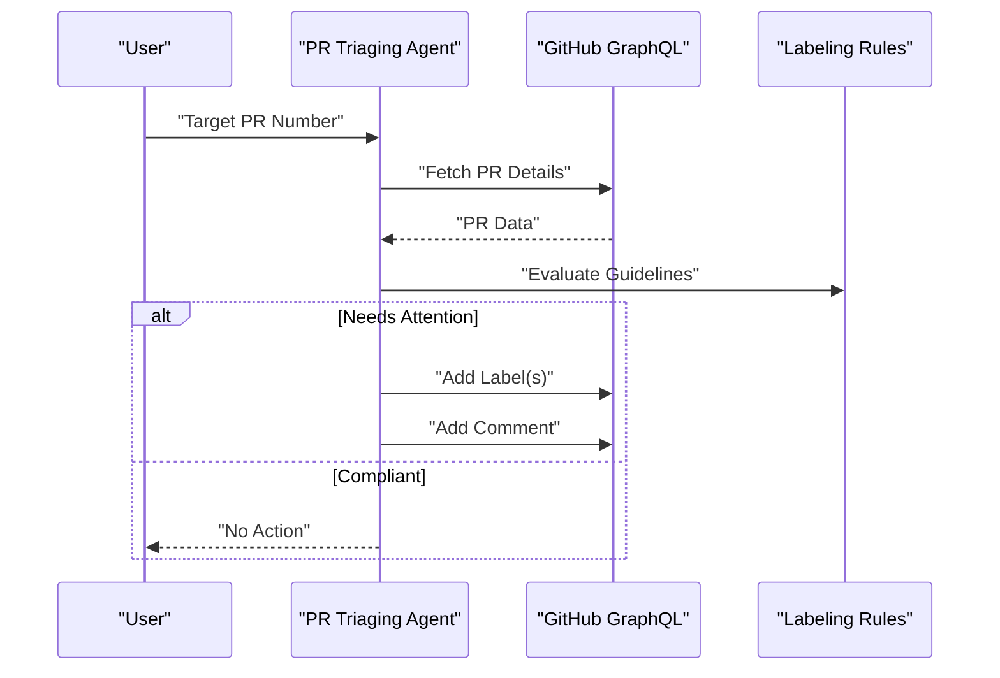

**Diagram sources**
- [adk_pr_triaging_agent/agent.py](file://contributing/samples/adk_pr_triaging_agent/agent.py#L222-L301)
- [adk_pr_triaging_agent/settings.py](file://contributing/samples/adk_pr_triaging_agent/settings.py#L21-L33)

Configuration patterns:
- GitHub token and GraphQL URL from environment.
- Allowed labels and contribution guidelines embedded in agent instruction.

Tool selection strategy:
- Use GraphQL for comprehensive PR insights.
- Use REST endpoints for labeling and commenting.

Performance optimization:
- Truncate diffs to manage token limits.
- Filter out merge commits to focus on meaningful changes.

**Section sources**
- [adk_pr_triaging_agent/agent.py](file://contributing/samples/adk_pr_triaging_agent/agent.py#L1-L301)
- [adk_pr_triaging_agent/settings.py](file://contributing/samples/adk_pr_triaging_agent/settings.py#L1-L33)

### Stale Issue Detection System
Purpose:
- Audit open issues using a unified history trace and LLM intent analysis to mark or close stale items.

Key elements:
- GraphQL query to reconstruct comments, edits, labels, and timeline events.
- Unified history timeline replay to determine the last actor and role.
- LLM analysis to distinguish between stale and active states.
- Tools to add/remove labels, post alerts, and close stale issues.

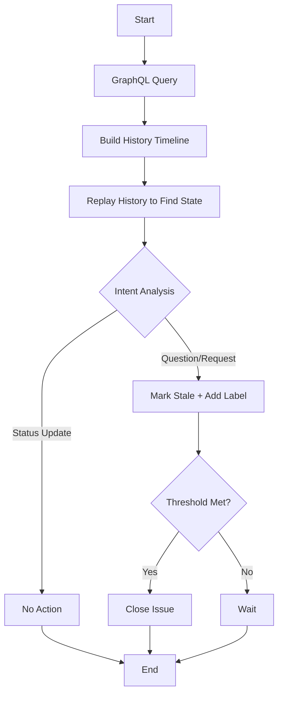

**Diagram sources**
- [adk_stale_agent/agent.py](file://contributing/samples/adk_stale_agent/agent.py#L124-L449)

Configuration patterns:
- GitHub token and model name from environment.
- Thresholds for stale and close windows.

Tool selection strategy:
- Single GraphQL request per issue to minimize API calls.
- Maintain a maintainers cache to avoid repeated lookups.

Performance optimization:
- Exponential backoff and retry logic for rate limits.
- Pre-filter issues via Search API to skip newly created items.

**Section sources**
- [adk_stale_agent/agent.py](file://contributing/samples/adk_stale_agent/agent.py#L1-L607)
- [adk_stale_agent/README.md](file://contributing/samples/adk_stale_agent/README.md#L1-L90)

### JIRA Integration Patterns
Purpose:
- Provide a JIRA connector agent capable of listing and filtering issues via a toolset.

Key elements:
- Root Agent configured with JIRA tools.
- Instruction outlines supported operations (GET/LIST) and output formatting.

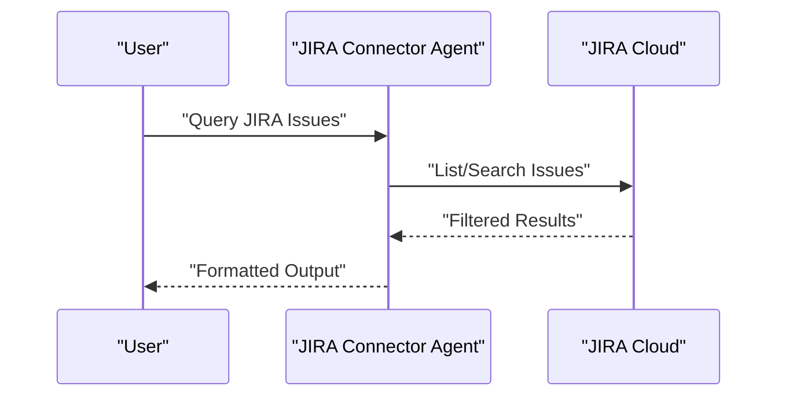

**Diagram sources**
- [jira_agent/agent.py](file://contributing/samples/jira_agent/agent.py#L19-L54)

Configuration patterns:
- Integration via Application Integration and Integration Connectors.
- Agent uses toolset methods to execute queries.

Tool selection strategy:
- Use provided JIRA tool methods for listing and filtering.

Performance optimization:
- Limit result sets and filter locally when needed.

**Section sources**
- [jira_agent/agent.py](file://contributing/samples/jira_agent/agent.py#L1-L54)

### Knowledge Base Agent
Purpose:
- Perform Vertex AI Search to retrieve ADK knowledge and documentation, with post-model callbacks to append citations.

Key elements:
- Vertex AI Search tool configured with a datastore ID.
- Callback to append grounding metadata as JSON citations.

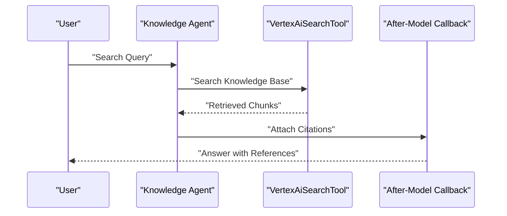

**Diagram sources**
- [adk_knowledge_agent/agent.py](file://contributing/samples/adk_knowledge_agent/agent.py#L61-L75)

Configuration patterns:
- Vertex AI datastore ID and model selection.
- Callback to enrich responses with citations.

Tool selection strategy:
- Vertex AI Search for semantic retrieval.

Performance optimization:
- Efficient grounding metadata extraction and JSON serialization.

**Section sources**
- [adk_knowledge_agent/agent.py](file://contributing/samples/adk_knowledge_agent/agent.py#L1-L75)

### RAG Implementation with Spanner Integration
Purpose:
- Answer product-specific recommendation questions using vector similarity search over Cloud Spanner.

Key elements:
- SpannerToolset configured with vector store settings.
- Credentials configuration supporting ADC, OAuth2, and service accounts.
- Tool filtering to restrict to similarity search.

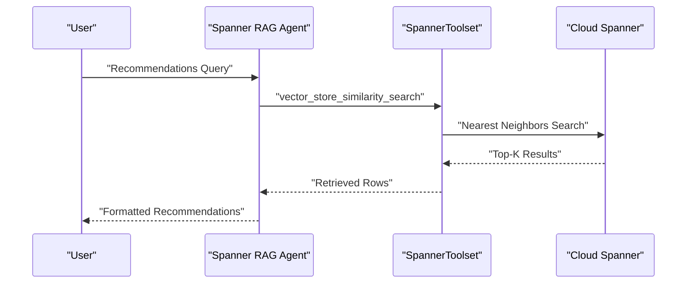

**Diagram sources**
- [spanner_rag_agent/agent.py](file://contributing/samples/spanner_rag_agent/agent.py#L99-L114)

Configuration patterns:
- Vector store settings for project/instance/database/table/columns/embedding length.
- Tool capabilities restricted to data read operations.
- Credentials type selection via environment variables.

Tool selection strategy:
- Use vector_store_similarity_search for product recommendations.
- Apply filters (e.g., inventory count) to refine results.

Performance optimization:
- Tune top_k and distance type for accuracy/performance balance.
- Use exact nearest neighbors for deterministic results.

**Section sources**
- [spanner_rag_agent/agent.py](file://contributing/samples/spanner_rag_agent/agent.py#L1-L114)

### Additional Triaging Agent (Issues)
Purpose:
- Assign component labels, owners, and issue types to untriaged GitHub issues.

Key elements:
- Label-to-owner mapping and label guidelines.
- Tools to list untriaged issues, add labels, assign owners, and change issue types.

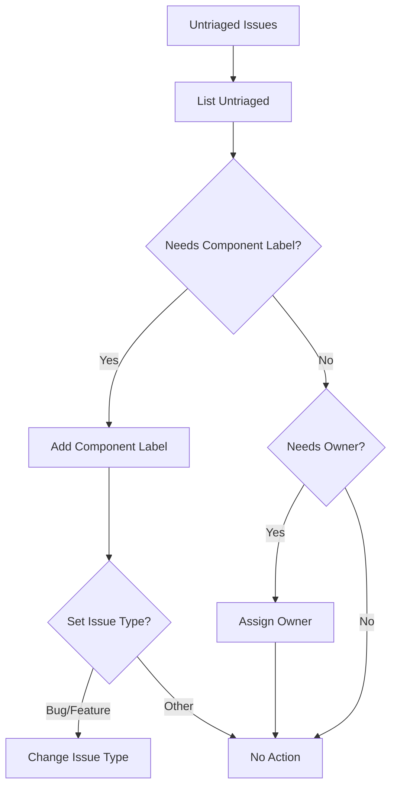

**Diagram sources**
- [adk_triaging_agent/agent.py](file://contributing/samples/adk_triaging_agent/agent.py#L249-L302)

Configuration patterns:
- GitHub token and repository settings from environment.
- Label guidelines embedded in instruction.

Tool selection strategy:
- Use REST endpoints for labeling, assignment, and type changes.

Performance optimization:
- Pre-filter issues via Search API to reduce unnecessary processing.

**Section sources**
- [adk_triaging_agent/agent.py](file://contributing/samples/adk_triaging_agent/agent.py#L1-L302)

## Dependency Analysis
The agents share common dependencies and patterns:
- All GitHub agents depend on environment variables for tokens and repository identities.
- RAG agents depend on Vertex AI Search tools and optional assistant agents.
- Stale detection agents rely on GraphQL for comprehensive history reconstruction.
- Spanner RAG agents depend on SpannerToolset and credentials configuration.
- JIRA agents depend on Integration Connectors and JIRA toolsets.

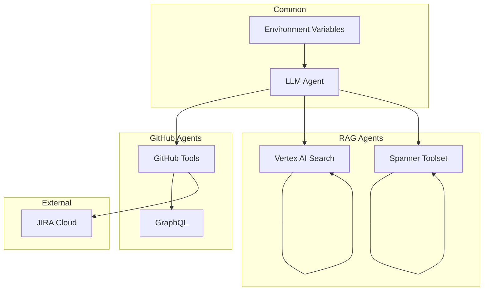

**Diagram sources**
- [adk_answering_agent/agent.py](file://contributing/samples/adk_answering_agent/agent.py#L40-L119)
- [adk_documentation/tools.py](file://contributing/samples/adk_documentation/tools.py#L33-L173)
- [adk_stale_agent/agent.py](file://contributing/samples/adk_stale_agent/agent.py#L124-L449)
- [spanner_rag_agent/agent.py](file://contributing/samples/spanner_rag_agent/agent.py#L99-L114)
- [jira_agent/agent.py](file://contributing/samples/jira_agent/agent.py#L19-L54)

**Section sources**
- [adk_answering_agent/agent.py](file://contributing/samples/adk_answering_agent/agent.py#L1-L119)
- [adk_documentation/tools.py](file://contributing/samples/adk_documentation/tools.py#L1-L818)
- [adk_stale_agent/agent.py](file://contributing/samples/adk_stale_agent/agent.py#L1-L607)
- [spanner_rag_agent/agent.py](file://contributing/samples/spanner_rag_agent/agent.py#L1-L114)
- [jira_agent/agent.py](file://contributing/samples/jira_agent/agent.py#L1-L54)

## Performance Considerations
- Minimize API calls:
  - Use GraphQL for comprehensive history in a single request.
  - Pre-filter issues via Search API to avoid processing new items.
- Control token usage:
  - Truncate diffs and limit comment counts.
  - Use callbacks to append citations rather than re-querying.
- Optimize RAG:
  - Configure top_k and distance metrics for Spanner similarity search.
  - Use exact nearest neighbors for deterministic results.
- Rate limiting:
  - Implement exponential backoff and retry logic for GitHub API.
- Reduce redundant work:
  - Pass direct JSON payloads in workflows to avoid extra API calls.
  - Cache maintainers list to avoid repeated lookups.

[No sources needed since this section provides general guidance]

## Troubleshooting Guide
Common issues and resolutions:
- Missing environment variables:
  - Ensure GITHUB_TOKEN, GOOGLE_CLOUD_PROJECT, and datastore IDs are set.
  - For JIRA, confirm Integration Connectors provisioning and ExecuteConnection setup.
- Authentication failures:
  - Verify ADC setup for Vertex AI and Spanner.
  - For OAuth2, ensure client ID/secret environment variables are configured.
- Rate limits:
  - Implement backoff and retry logic; monitor logs for throttling.
- Stale detection anomalies:
  - Confirm GraphQL query limits and label thresholds.
  - Validate that silent edit alerts are not spamming threads.

**Section sources**
- [adk_answering_agent/settings.py](file://contributing/samples/adk_answering_agent/settings.py#L24-L46)
- [adk_documentation/settings.py](file://contributing/samples/adk_documentation/settings.py#L23-L34)
- [adk_issue_formatting_agent/settings.py](file://contributing/samples/adk_issue_formatting_agent/settings.py#L23-L34)
- [adk_pr_triaging_agent/settings.py](file://contributing/samples/adk_pr_triaging_agent/settings.py#L24-L33)
- [jira_agent/agent.py](file://contributing/samples/jira_agent/agent.py#L19-L54)
- [adk_knowledge_agent/agent.py](file://contributing/samples/adk_knowledge_agent/agent.py#L61-L75)
- [spanner_rag_agent/agent.py](file://contributing/samples/spanner_rag_agent/agent.py#L32-L57)
- [adk_stale_agent/agent.py](file://contributing/samples/adk_stale_agent/agent.py#L58-L104)

## Conclusion
These specialized agents demonstrate robust patterns for domain-specific automation:
- RAG agents integrate knowledge bases via Vertex AI Search and optional assistant agents.
- Documentation agents streamline release analysis and PR generation.
- GitHub agents enforce standards for issues and PRs using REST and GraphQL.
- Stale detection agents elevate repository hygiene with contextual LLM analysis.
- Spanner RAG agents enable product recommendation systems with vector similarity search.
- JIRA integration agents connect enterprise systems via Integration Connectors.

Adopting the configuration patterns, tool selection strategies, and performance optimizations outlined here will help deploy reliable, scalable agents across diverse operational domains.