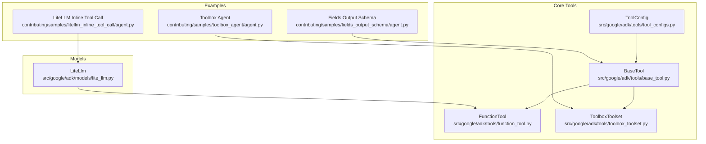
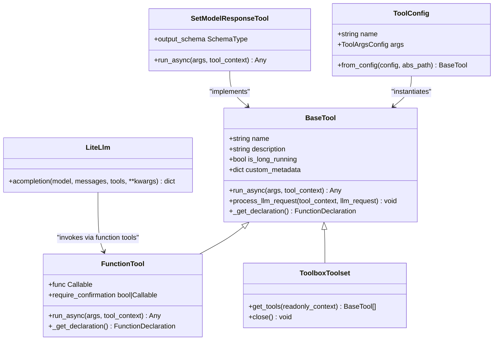
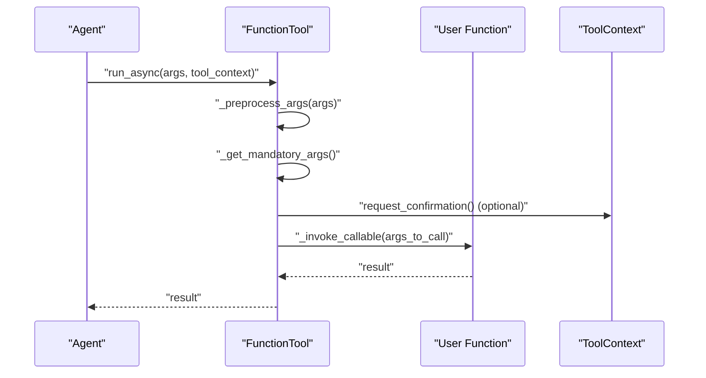
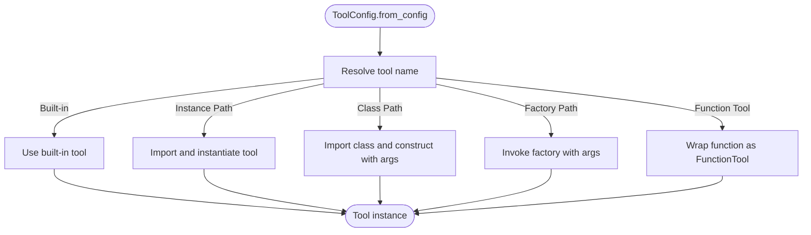
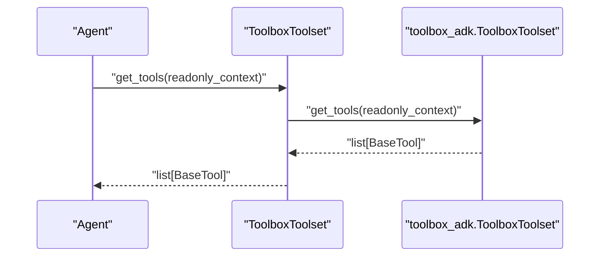
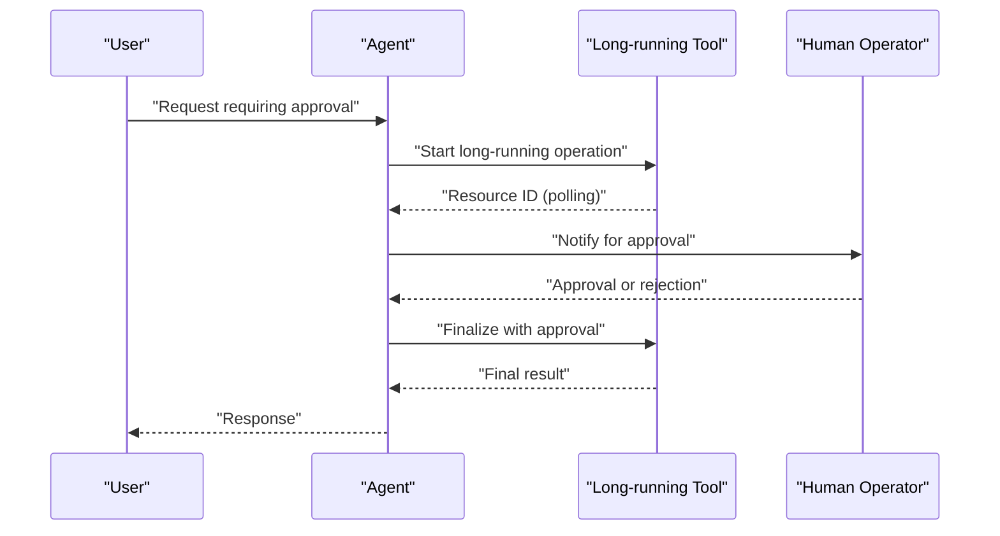
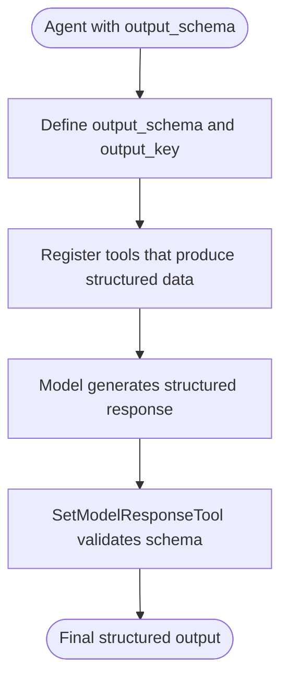
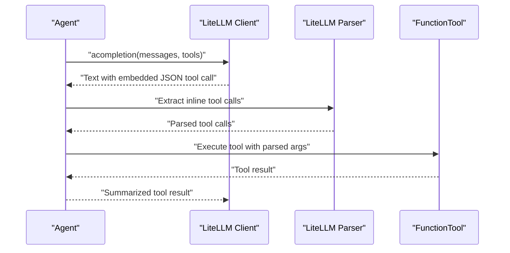
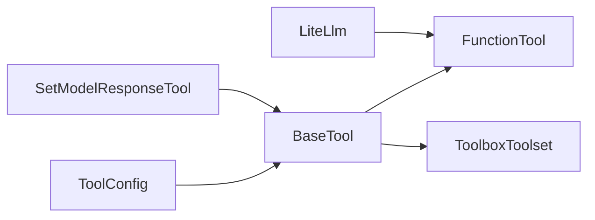

# Tool Development Examples

<cite>
**Referenced Files in This Document**
- [base_tool.py](file://src/google/adk/tools/base_tool.py)
- [function_tool.py](file://src/google/adk/tools/function_tool.py)
- [toolbox_toolset.py](file://src/google/adk/tools/toolbox_toolset.py)
- [tool_configs.py](file://src/google/adk/tools/tool_configs.py)
- [lite_llm.py](file://src/google/adk/models/lite_llm.py)
- [set_model_response_tool.py](file://src/google/adk/tools/set_model_response_tool.py)
- [agent.py](file://contributing/samples/fields_output_schema/agent.py)
- [agent.py](file://contributing/samples/litellm_inline_tool_call/agent.py)
- [agent.py](file://contributing/samples/toolbox_agent/agent.py)
- [test_base_toolset.py](file://tests/unittests/tools/test_base_toolset.py)
- [test_mcp_toolset_auth.py](file://tests/unittests/tools/mcp_tool/test_mcp_toolset_auth.py)
- [README.md](file://contributing/samples/mcp_toolset_auth/README.md)
- [agent.json](file://contributing/samples/a2a_human_in_loop/remote_a2a/human_in_loop/agent.json)
</cite>

## Table of Contents
1. [Introduction](#introduction)
2. [Project Structure](#project-structure)
3. [Core Components](#core-components)
4. [Architecture Overview](#architecture-overview)
5. [Detailed Component Analysis](#detailed-component-analysis)
6. [Dependency Analysis](#dependency-analysis)
7. [Performance Considerations](#performance-considerations)
8. [Troubleshooting Guide](#troubleshooting-guide)
9. [Conclusion](#conclusion)
10. [Appendices](#appendices)

## Introduction
This document provides comprehensive guidance for developing tools within the ADK framework. It covers configuration approaches for function-based tools, built-in tool integration, and toolbox implementations. It explains human-in-the-loop tool patterns, output schema handling, and structured tool responses. It also documents custom code execution patterns, field validation, and inline tool calling with LiteLLM. Best practices for parameter validation, error handling, and testing are included, along with security considerations for tool authentication and performance optimization strategies for composing, chaining, and reusing tools in complex agent workflows.

## Project Structure
The tool development ecosystem centers around a small set of core abstractions and several sample configurations demonstrating real-world usage patterns:
- Core tool abstractions: BaseTool, FunctionTool, ToolboxToolset, ToolConfigs
- Model integration: LiteLLM client and inline tool call parsing
- Output schema handling: SetModelResponseTool and examples
- Human-in-the-loop patterns: A2A human-in-the-loop agent manifest
- Authentication: MCP toolset authentication tests and sample
- Testing: Unit tests validating toolset behavior and authentication headers

**Diagram sources**
- [base_tool.py](file://src/google/adk/tools/base_tool.py#L47-L213)
- [function_tool.py](file://src/google/adk/tools/function_tool.py#L39-L292)
- [toolbox_toolset.py](file://src/google/adk/tools/toolbox_toolset.py#L35-L112)
- [tool_configs.py](file://src/google/adk/tools/tool_configs.py#L42-L130)
- [lite_llm.py](file://src/google/adk/models/lite_llm.py#L1044-L1739)
- [agent.py](file://contributing/samples/fields_output_schema/agent.py#L36-L60)
- [agent.py](file://contributing/samples/litellm_inline_tool_call/agent.py#L161-L175)
- [agent.py](file://contributing/samples/toolbox_agent/agent.py#L19-L30)

**Section sources**
- [base_tool.py](file://src/google/adk/tools/base_tool.py#L47-L213)
- [function_tool.py](file://src/google/adk/tools/function_tool.py#L39-L292)
- [toolbox_toolset.py](file://src/google/adk/tools/toolbox_toolset.py#L35-L112)
- [tool_configs.py](file://src/google/adk/tools/tool_configs.py#L42-L130)
- [lite_llm.py](file://src/google/adk/models/lite_llm.py#L1044-L1739)
- [agent.py](file://contributing/samples/fields_output_schema/agent.py#L36-L60)
- [agent.py](file://contributing/samples/litellm_inline_tool_call/agent.py#L161-L175)
- [agent.py](file://contributing/samples/toolbox_agent/agent.py#L19-L30)

## Core Components
- BaseTool: Defines the contract for all tools, including asynchronous execution, function declaration generation, and LLM request processing hooks.
- FunctionTool: Wraps user-defined functions, extracting metadata and generating function declarations, with automatic Pydantic model conversion and confirmation gating.
- ToolboxToolset: Integrates external toolsets via a toolbox SDK, delegating tool discovery and lifecycle to a third-party library.
- ToolConfig: Provides a flexible configuration mechanism for declaring tools by name, class, instance, factory function, or function tool.
- LiteLlm: Bridges external LLM clients and parses inline JSON tool calls from text responses.
- SetModelResponseTool: Enables structured output by allowing the model to set its final response according to a configured schema.

Key capabilities:
- Parameter validation and type coercion for function signatures
- Human-in-the-loop confirmation via tool context
- Structured output schema enforcement
- Inline tool call extraction from text for non-function-call-capable models
- Authentication headers for MCP-based toolsets

**Section sources**
- [base_tool.py](file://src/google/adk/tools/base_tool.py#L47-L213)
- [function_tool.py](file://src/google/adk/tools/function_tool.py#L39-L292)
- [toolbox_toolset.py](file://src/google/adk/tools/toolbox_toolset.py#L35-L112)
- [tool_configs.py](file://src/google/adk/tools/tool_configs.py#L42-L130)
- [lite_llm.py](file://src/google/adk/models/lite_llm.py#L1044-L1739)
- [set_model_response_tool.py](file://src/google/adk/tools/set_model_response_tool.py#L36-L69)

## Architecture Overview
The tool architecture separates concerns between tool definition, configuration, execution, and model integration:
- Tool definition: BaseTool and derived classes encapsulate behavior and metadata.
- Configuration: ToolConfig resolves tools from classes, instances, factories, or functions.
- Execution: FunctionTool orchestrates argument preprocessing, validation, confirmation, and invocation.
- Integration: LiteLlm bridges external clients and extracts inline tool calls.
- Output: SetModelResponseTool enforces structured responses aligned with output schemas.

**Diagram sources**
- [base_tool.py](file://src/google/adk/tools/base_tool.py#L47-L213)
- [function_tool.py](file://src/google/adk/tools/function_tool.py#L39-L292)
- [toolbox_toolset.py](file://src/google/adk/tools/toolbox_toolset.py#L35-L112)
- [tool_configs.py](file://src/google/adk/tools/tool_configs.py#L42-L130)
- [lite_llm.py](file://src/google/adk/models/lite_llm.py#L1044-L1739)
- [set_model_response_tool.py](file://src/google/adk/tools/set_model_response_tool.py#L36-L69)

## Detailed Component Analysis

### Function-Based Tools
FunctionTool wraps user-defined callables, automatically generating function declarations and handling argument preprocessing, validation, and confirmation. It supports both synchronous and asynchronous callables, and integrates with Pydantic models for robust type conversion.

**Diagram sources**
- [function_tool.py](file://src/google/adk/tools/function_tool.py#L159-L222)

Key behaviors:
- Automatic function declaration generation via function signature inspection
- Mandatory parameter detection and error reporting
- Confirmation gating via ToolContext
- Async/sync callable invocation

**Section sources**
- [function_tool.py](file://src/google/adk/tools/function_tool.py#L39-L292)

### Built-in Tool Integration
Built-in tools integrate seamlessly through ToolConfig, which supports:
- Direct references to built-in tool names
- Fully qualified paths to tool instances or classes
- Factory functions returning tools
- Direct function tool references

**Diagram sources**
- [tool_configs.py](file://src/google/adk/tools/tool_configs.py#L42-L130)

**Section sources**
- [tool_configs.py](file://src/google/adk/tools/tool_configs.py#L42-L130)

### Toolbox Implementations
ToolboxToolset delegates tool discovery and lifecycle to an external toolbox SDK. It supports optional filtering by toolset name or specific tool names, token getters, bound parameters, credentials, and additional headers.

**Diagram sources**
- [toolbox_toolset.py](file://src/google/adk/tools/toolbox_toolset.py#L103-L107)

**Section sources**
- [toolbox_toolset.py](file://src/google/adk/tools/toolbox_toolset.py#L35-L112)

### Human-in-the-Loop Tool Patterns
Human-in-the-loop workflows can be modeled using long-running tools and explicit confirmation flows. The A2A human-in-loop sample demonstrates capability manifests and long-running tool usage for approvals.

**Diagram sources**
- [agent.json](file://contributing/samples/a2a_human_in_loop/remote_a2a/human_in_loop/agent.json#L1-L29)

**Section sources**
- [agent.json](file://contributing/samples/a2a_human_in_loop/remote_a2a/human_in_loop/agent.json#L1-L29)

### Output Schema Handling and Structured Responses
Structured output can be enforced using SetModelResponseTool and output schema configuration. The fields output schema sample demonstrates configuring an output schema and tools that produce structured data.

**Diagram sources**
- [set_model_response_tool.py](file://src/google/adk/tools/set_model_response_tool.py#L36-L69)
- [agent.py](file://contributing/samples/fields_output_schema/agent.py#L36-L60)

**Section sources**
- [set_model_response_tool.py](file://src/google/adk/tools/set_model_response_tool.py#L36-L69)
- [agent.py](file://contributing/samples/fields_output_schema/agent.py#L36-L60)

### Custom Code Execution Patterns
FunctionTool supports both synchronous and asynchronous execution, enabling custom code execution patterns. It detects coroutine functions and invokes them accordingly, ensuring compatibility across different callable types.

Validation and conversion:
- Argument preprocessing converts JSON dictionaries to Pydantic models where expected
- Mandatory parameter detection ensures required inputs are present
- Type hints are used to guide conversion and validation

**Section sources**
- [function_tool.py](file://src/google/adk/tools/function_tool.py#L159-L238)

### Inline Tool Calling with LiteLLM
LiteLLM enables inline JSON tool calls from text responses. The sample demonstrates a custom client that injects inline tool calls and extracts them for processing.

**Diagram sources**
- [lite_llm.py](file://src/google/adk/models/lite_llm.py#L1088-L1128)
- [agent.py](file://contributing/samples/litellm_inline_tool_call/agent.py#L29-L83)

**Section sources**
- [lite_llm.py](file://src/google/adk/models/lite_llm.py#L1044-L1739)
- [agent.py](file://contributing/samples/litellm_inline_tool_call/agent.py#L161-L175)

### Tool Composition, Chaining, and Reusability
Tool composition and chaining are supported through:
- ToolConfig resolution of multiple tool types
- ToolboxToolset loading specific tools or toolsets
- FunctionTool reuse across agents and workflows
- Long-running tools enabling multi-step human-in-the-loop flows

Reusability patterns:
- Centralized tool definitions and configuration
- Shared toolsets via ToolboxToolset
- Consistent function signatures for FunctionTool

**Section sources**
- [tool_configs.py](file://src/google/adk/tools/tool_configs.py#L42-L130)
- [toolbox_toolset.py](file://src/google/adk/tools/toolbox_toolset.py#L35-L112)
- [function_tool.py](file://src/google/adk/tools/function_tool.py#L39-L292)

## Dependency Analysis
The tool system exhibits low coupling and high cohesion:
- BaseTool defines a stable interface for all tools
- FunctionTool depends on BaseTool and function introspection utilities
- ToolboxToolset depends on an external SDK and delegates tool discovery
- ToolConfig decouples tool instantiation from agent configuration
- LiteLLM parser depends on function declaration utilities for compatibility

**Diagram sources**
- [base_tool.py](file://src/google/adk/tools/base_tool.py#L47-L213)
- [function_tool.py](file://src/google/adk/tools/function_tool.py#L39-L292)
- [toolbox_toolset.py](file://src/google/adk/tools/toolbox_toolset.py#L35-L112)
- [tool_configs.py](file://src/google/adk/tools/tool_configs.py#L42-L130)
- [lite_llm.py](file://src/google/adk/models/lite_llm.py#L1044-L1739)
- [set_model_response_tool.py](file://src/google/adk/tools/set_model_response_tool.py#L36-L69)

**Section sources**
- [base_tool.py](file://src/google/adk/tools/base_tool.py#L47-L213)
- [function_tool.py](file://src/google/adk/tools/function_tool.py#L39-L292)
- [toolbox_toolset.py](file://src/google/adk/tools/toolbox_toolset.py#L35-L112)
- [tool_configs.py](file://src/google/adk/tools/tool_configs.py#L42-L130)
- [lite_llm.py](file://src/google/adk/models/lite_llm.py#L1044-L1739)
- [set_model_response_tool.py](file://src/google/adk/tools/set_model_response_tool.py#L36-L69)

## Performance Considerations
- Prefer FunctionTool for lightweight, synchronous operations to minimize overhead.
- Use ToolboxToolset for scalable tool discovery and lifecycle management.
- Enable structured output schemas to reduce post-processing and improve reliability.
- Cache tool declarations where appropriate to avoid repeated introspection.
- For long-running tools, leverage polling and human-in-the-loop patterns to avoid blocking the main agent loop.
- Optimize argument preprocessing by limiting unnecessary conversions and validations.

## Troubleshooting Guide
Common issues and resolutions:
- Missing mandatory parameters: FunctionTool reports missing inputs to enable model retries.
- Confirmation gating: Ensure ToolContext provides confirmation when require_confirmation is enabled.
- Authentication headers: Verify that MCP toolset authentication is properly configured and exchanged.
- Duplicate tool names: Use toolset prefixes to avoid conflicts when loading multiple toolsets.
- Inline tool call parsing: Validate that the model’s text responses contain well-formed JSON tool call blocks.

**Section sources**
- [function_tool.py](file://src/google/adk/tools/function_tool.py#L179-L190)
- [test_mcp_toolset_auth.py](file://tests/unittests/tools/mcp_tool/test_mcp_toolset_auth.py#L100-L218)
- [test_base_toolset.py](file://tests/unittests/tools/test_base_toolset.py#L367-L388)

## Conclusion
This guide outlined the tool development patterns and best practices within the ADK framework. By leveraging BaseTool abstractions, FunctionTool for function-based tools, ToolboxToolset for external tool integration, and ToolConfig for flexible configuration, developers can build robust, secure, and reusable tools. Human-in-the-loop workflows, structured output schemas, and inline tool calling with LiteLLM further enhance agent capabilities. Adhering to validation, error handling, and testing strategies ensures reliable tool behavior in production environments.

## Appendices
- Authentication sample overview: The MCP toolset authentication sample demonstrates a two-phase authentication flow for tool listing and tool calling, including credential exchange and header injection.

**Section sources**
- [README.md](file://contributing/samples/mcp_toolset_auth/README.md#L1-L48)