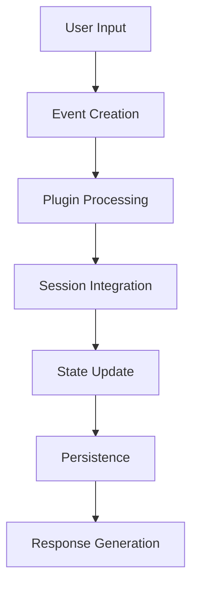
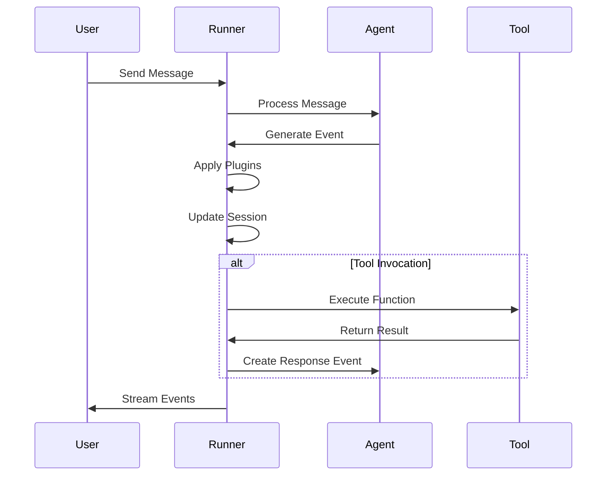
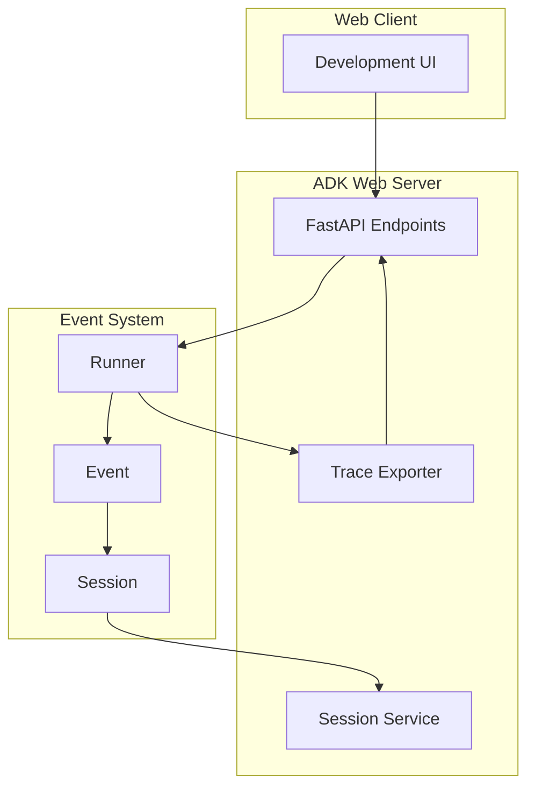

# Event System

<cite>
**Referenced Files in This Document**   
- [event.py](file://src/google/adk/events/event.py)
- [event_actions.py](file://src/google/adk/events/event_actions.py)
- [session.py](file://src/google/adk/sessions/session.py)
- [runners.py](file://src/google/adk/runners.py)
- [adk_web_server.py](file://src/google/adk/cli/adk_web_server.py)
- [fast_api.py](file://src/google/adk/cli/fast_api.py)
</cite>

## Table of Contents
1. [Introduction](#introduction)
2. [Event Class Implementation](#event-class-implementation)
3. [Event Lifecycle](#event-lifecycle)
4. [Event Processing and Agent Interaction](#event-processing-and-agent-interaction)
5. [Integration with Development UI](#integration-with-development-ui)
6. [Event Filtering and Persistence](#event-filtering-and-persistence)
7. [Security Considerations](#security-considerations)
8. [Performance and Scaling](#performance-and-scaling)
9. [Conclusion](#conclusion)

## Introduction
The Event System in the ADK framework provides a robust event-driven architecture that enables real-time communication between agents, tools, and external systems. This system facilitates asynchronous interactions through a well-defined event model that captures the state and actions within agent conversations. Events serve as the primary mechanism for tracking conversation history, function calls, state changes, and other interactions within the agent ecosystem. The event system is designed to support both synchronous and streaming contexts, making it suitable for a wide range of agent-based applications.

## Event Class Implementation

The Event class is the core component of the event system, representing individual interactions within a conversation between agents and users. It extends the LlmResponse class and includes comprehensive metadata for tracking the conversation flow.

### Event Type System and Structure
The Event class contains several key fields that define its type and behavior:

- **invocation_id**: A required identifier that links the event to a specific invocation within a session
- **author**: Indicates whether the event was generated by a "user" or by a specific agent
- **actions**: Contains EventActions that represent the actions taken by the agent
- **long_running_tool_ids**: Tracks IDs of long-running function calls
- **branch**: Represents the agent hierarchy in multi-agent conversations
- **id**: A unique identifier for the event, automatically generated if not provided
- **timestamp**: Records when the event occurred

The Event class automatically generates a unique ID using UUID4 if one is not provided during initialization. This ensures each event has a distinct identifier for tracking and reference purposes.

### Payload Structure and Metadata Fields
The payload structure of an Event includes both direct properties and computed fields:

- **Content**: Inherited from LlmResponse, contains the actual message content with parts that may include text, function calls, or function responses
- **Actions**: The EventActions object that encapsulates various actions taken during the event processing
- **Metadata**: Includes timestamp, ID, and branch information that provides context about the event's place in the conversation flow

The Event class also provides several utility methods for accessing specific types of content within the event:

- **get_function_calls()**: Returns all function calls contained in the event's content parts
- **get_function_responses()**: Returns all function responses contained in the event's content parts
- **has_trailing_code_execution_result()**: Determines if the event ends with a code execution result
- **is_final_response()**: Determines if the event represents a final response from an agent

**Section sources**
- [event.py](file://src/google/adk/events/event.py#L29-L139)

## Event Lifecycle

The event lifecycle in the ADK framework follows a well-defined sequence from creation to processing and storage. This lifecycle ensures consistent handling of events across different agent interactions and execution contexts.

### Event Creation and Initialization
Events are created during agent execution when a new interaction occurs. The lifecycle begins when a user sends a message or when an agent generates a response. The Runner class is responsible for creating new events and managing their lifecycle within a session.

When a new message is received, the system creates an Event object with the appropriate author (user or agent), content, and metadata. The event's invocation_id is set to link it to the current invocation context, and a unique ID is generated if one doesn't already exist.

### Event Processing Pipeline
The event processing pipeline involves several stages:

1. **Event Generation**: The agent generates a response that is converted into an Event object
2. **Plugin Processing**: The event passes through various plugin callbacks (before_run, on_event, after_run) that can modify or enhance the event
3. **Session Integration**: The processed event is appended to the session's event list
4. **State Management**: If the event contains state changes, the session state is updated accordingly
5. **Persistence**: The event is stored in the session service for future retrieval

The Runner class manages this pipeline through its _exec_with_plugin method, which wraps the execution with plugin callbacks and ensures proper event handling.

### Event Storage and Retrieval
Events are stored within the Session object as part of the events list. The Session class maintains a chronological list of all events in a conversation, allowing for complete conversation history tracking.

The BaseSessionService interface defines methods for managing sessions and their events:
- **create_session**: Creates a new session with an empty events list
- **get_session**: Retrieves a session with its events
- **append_event**: Adds a new event to a session's events list
- **list_sessions**: Lists all sessions (without event details)
- **delete_session**: Removes a session and all its events

When an event is appended to a session, the system also updates the session state if the event contains state_delta information. This ensures that the session's state reflects all changes made during the conversation.

**Diagram sources**
- [runners.py](file://src/google/adk/runners.py#L180-L250)
- [session.py](file://src/google/adk/sessions/session.py#L54)
- [base_session_service.py](file://src/google/adk/sessions/base_session_service.py#L94-L101)

**Section sources**
- [runners.py](file://src/google/adk/runners.py#L180-L356)
- [session.py](file://src/google/adk/sessions/session.py#L25-L59)
- [base_session_service.py](file://src/google/adk/sessions/base_session_service.py#L43-L110)

## Event Processing and Agent Interaction

Events play a crucial role in triggering agent responses and tool invocations within the ADK framework. The system uses events to coordinate interactions between multiple agents and tools, enabling complex workflows and multi-agent collaborations.

### Agent Response Triggering
When an event is processed, it can trigger responses from agents based on its content and metadata. The Runner class determines which agent should respond by analyzing the event history:

- If the last event is a function response, the system routes the response back to the agent that initiated the corresponding function call
- If no specific agent is indicated, the root agent handles the response
- For LLM-based agents that support agent transfer, the system can route responses to sub-agents based on the conversation context

The _find_agent_to_run method in the Runner class implements this routing logic, examining the event history to determine the appropriate agent for the next response.

### Tool Invocation Mechanism
Events trigger tool invocations when they contain function calls in their content parts. The system processes these function calls by:

1. Extracting function calls from the event using get_function_calls()
2. Identifying the appropriate tool based on the function name
3. Executing the tool with the provided arguments
4. Creating a function response event with the tool's output
5. Appending the response event to the session

The EventActions class plays a key role in this process by providing metadata about the actions taken during event processing, including state changes and artifact updates that may result from tool execution.

### Synchronous and Streaming Contexts
The event system supports both synchronous and streaming execution contexts:

- **Synchronous Context**: The run method in the Runner class provides a synchronous interface that yields events as they are generated, wrapping the asynchronous implementation in a thread
- **Streaming Context**: The run_live method supports live streaming scenarios, particularly for multi-agent conversations with real-time audio or video input

The system handles streaming contexts by using LiveRequestQueue to manage incoming requests and responses in real-time, allowing for continuous interaction without requiring complete messages before processing.

**Diagram sources**
- [runners.py](file://src/google/adk/runners.py#L180-L464)
- [event.py](file://src/google/adk/events/event.py#L110-L117)

**Section sources**
- [runners.py](file://src/google/adk/runners.py#L121-L464)
- [event.py](file://src/google/adk/events/event.py#L110-L117)

## Integration with Development UI

The event system integrates closely with the web-based development UI, providing real-time monitoring and debugging capabilities for agent interactions. This integration enables developers to observe and analyze event flows during agent execution.

### Real-time Monitoring
The ADK web server provides endpoints for real-time event monitoring through the FastAPI application. The AdkWebServer class exposes several endpoints that allow clients to:

- List available applications
- Create and manage sessions
- Retrieve session data with events
- Monitor trace information for specific events
- Access evaluation metrics and results

The web server uses OpenTelemetry for tracing, capturing detailed information about event processing that can be accessed through the /debug/trace endpoints. This allows developers to inspect the execution flow and identify performance bottlenecks.

### Debugging Capabilities
The development UI provides comprehensive debugging tools through the following features:

- **Event Graph Visualization**: The get_event_graph endpoint generates DOT format output that can be rendered as a visual graph of event relationships
- **Trace Inspection**: Developers can inspect detailed trace information for specific events, including timing data and attribute values
- **Session Analysis**: The system provides complete session data including all events, state information, and metadata
- **Performance Monitoring**: Built-in analysis of event durations and processing times helps identify slow operations

The view_session.py utility script demonstrates these debugging capabilities by providing a command-line interface to analyze session data, calculate event durations, and identify time-consuming operations.

### Web Server Architecture
The integration between the event system and the development UI is facilitated by the adk_web_server.py module, which creates a FastAPI application with the following components:

- **Session Management Endpoints**: CRUD operations for sessions and their events
- **Evaluation Endpoints**: Support for running and managing evaluations
- **Trace Endpoints**: Debugging endpoints for inspecting event processing traces
- **Static Asset Serving**: Web interface assets for the development UI

The server uses an InMemoryExporter to capture trace data and make it available for debugging purposes, while also supporting cloud tracing for production environments.

**Diagram sources**
- [adk_web_server.py](file://src/google/adk/cli/adk_web_server.py#L210-L800)
- [fast_api.py](file://src/google/adk/cli/fast_api.py#L56-L387)

**Section sources**
- [adk_web_server.py](file://src/google/adk/cli/adk_web_server.py#L210-L800)
- [fast_api.py](file://src/google/adk/cli/fast_api.py#L56-L387)

## Event Filtering and Persistence

The event system provides mechanisms for filtering events and configuring their persistence, allowing developers to control which events are stored and how they are retained.

### Event Filtering Mechanisms
While the core event system does not include explicit filtering APIs, filtering can be achieved through several mechanisms:

- **Session-level filtering**: When retrieving sessions, clients can request only recent events or events after a specific timestamp using the GetSessionConfig parameters
- **Plugin-based filtering**: Custom plugins can implement filtering logic in the on_event callback, choosing whether to include or exclude specific events
- **Client-side filtering**: Applications can filter events based on their properties (author, actions, content type) after retrieval

The ListSessionsResponse structure intentionally excludes event details to optimize performance, requiring explicit retrieval of individual sessions for full event data.

### Persistence Configuration
Event persistence is managed through the session service implementation, with several options available:

- **In-memory storage**: The default InMemorySessionService stores events in memory, suitable for development and testing
- **Database storage**: The DatabaseSessionService provides persistent storage using a database backend
- **Vertex AI storage**: The VertexAiSessionService integrates with Google Cloud's Vertex AI for scalable, managed storage

The choice of session service is configured when creating the AdkWebServer instance, allowing developers to select the appropriate persistence mechanism for their deployment scenario.

### Data Retention and Management
The system provides explicit methods for managing event data:

- **Session creation**: Events are automatically associated with a session and stored according to the session service configuration
- **Session deletion**: The delete_session method removes a session and all its events
- **Event lifecycle**: Events are immutable once created and appended to a session, ensuring data integrity

For evaluation scenarios, the system includes specialized managers (EvalSetsManager and EvalSetResultsManager) that handle persistence of evaluation data separately from regular session data.

**Section sources**
- [base_session_service.py](file://src/google/adk/sessions/base_session_service.py#L43-L110)
- [session.py](file://src/google/adk/sessions/session.py#L54)
- [runners.py](file://src/google/adk/runners.py#L304-L356)

## Security Considerations

The event system incorporates several security measures to validate events and prevent unauthorized event injection, ensuring the integrity of agent conversations.

### Event Validation
The system employs multiple layers of validation to ensure event integrity:

- **Pydantic model validation**: The Event and EventActions classes use Pydantic's validation features to enforce schema requirements and prevent invalid data
- **Extra field prohibition**: The model_config setting extra='forbid' prevents the inclusion of unexpected fields in events
- **Type checking**: The system uses type hints and runtime type checking to ensure data consistency

The Event class inherits from LlmResponse, leveraging its validation mechanisms while adding additional constraints specific to the ADK framework.

### Authentication and Authorization
The event system integrates with the framework's authentication mechanisms through the EventActions class:

- **AuthConfig requests**: The requested_auth_configs field allows tools to request specific authentication configurations
- **Credential management**: The system tracks authentication requirements and ensures proper credential handling
- **Access control**: The callback system can implement access control policies to prevent unauthorized actions

The AuthConfig class (referenced in EventActions) provides the structure for specifying authentication requirements, though its implementation details are in separate modules.

### Injection Prevention
The system includes safeguards against event injection and tampering:

- **Immutable events**: Once created and appended to a session, events cannot be modified
- **Session integrity**: The session service ensures that events are properly associated with valid sessions
- **Input validation**: All user inputs are validated before being converted to events
- **Plugin security**: The plugin system allows for security-focused plugins that can block or modify suspicious events

The system's architecture, with clear separation between event creation, processing, and storage, helps prevent unauthorized modifications to the event stream.

**Section sources**
- [event.py](file://src/google/adk/events/event.py#L29-L139)
- [event_actions.py](file://src/google/adk/events/event_actions.py#L27-L67)

## Performance and Scaling

The event system is designed to handle high-throughput scenarios and distributed deployments, with several features that support scaling and performance optimization.

### Throughput Optimization
The system employs several techniques to maximize event throughput:

- **Asynchronous processing**: The primary event processing interface (run_async) is asynchronous, allowing for non-blocking event handling
- **Streaming support**: The run_live method supports continuous streaming of events, reducing latency in real-time applications
- **Thread-based sync interface**: The synchronous run method uses a background thread to avoid blocking the main execution thread

The Runner class uses asyncio and proper task management to handle concurrent event processing efficiently, with timeout protection for cleanup operations.

### Distributed Deployment Considerations
For distributed deployments, the system supports several session service implementations:

- **In-memory service**: Suitable for single-instance deployments or testing
- **Database service**: Enables shared state across multiple instances using a database backend
- **Vertex AI service**: Provides managed, scalable storage for production deployments

The pluggable session service architecture allows developers to choose the appropriate storage backend based on their scalability requirements.

### Performance Monitoring
The system includes built-in performance monitoring capabilities:

- **Tracing integration**: OpenTelemetry integration provides detailed timing information for event processing
- **Duration tracking**: The view_session.py utility calculates event durations and identifies time-consuming operations
- **Metrics collection**: The evaluation system collects performance metrics for agent responses

The system's design minimizes unnecessary data transfer by separating session listing (without events) from session retrieval (with events), reducing network overhead in high-volume scenarios.

**Section sources**
- [runners.py](file://src/google/adk/runners.py#L180-L680)
- [adk_web_server.py](file://src/google/adk/cli/adk_web_server.py#L97-L158)

## Conclusion
The Event System in the ADK framework provides a comprehensive event-driven architecture that enables real-time, asynchronous communication between agents, tools, and external systems. By implementing a well-structured Event class with rich metadata and a clear lifecycle, the system supports complex agent interactions while maintaining data integrity and security. The integration with the development UI provides powerful monitoring and debugging capabilities, and the flexible persistence options accommodate various deployment scenarios from development to production. With support for both synchronous and streaming contexts, along with robust security measures and performance optimization features, the event system forms a solid foundation for building sophisticated agent-based applications.