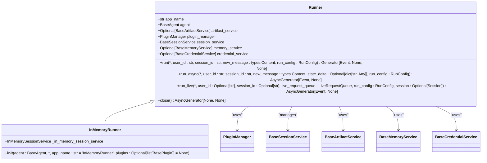
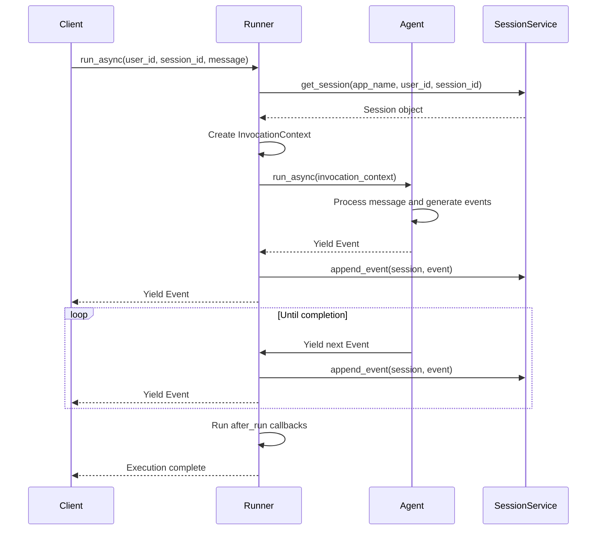
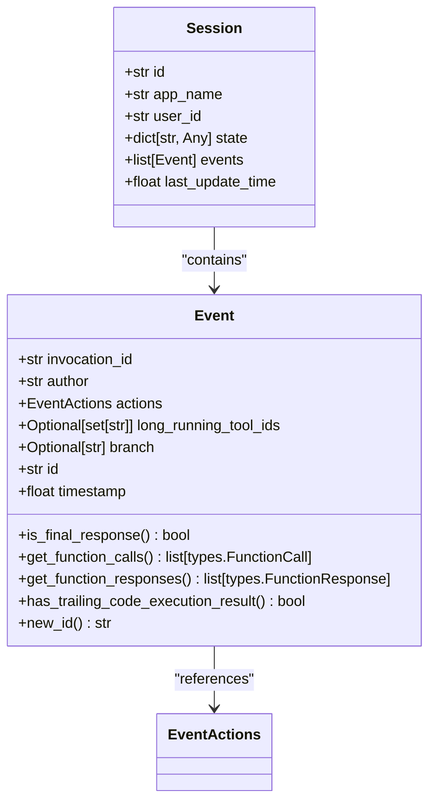
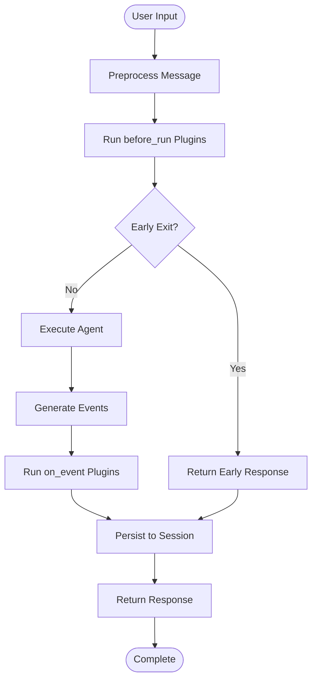
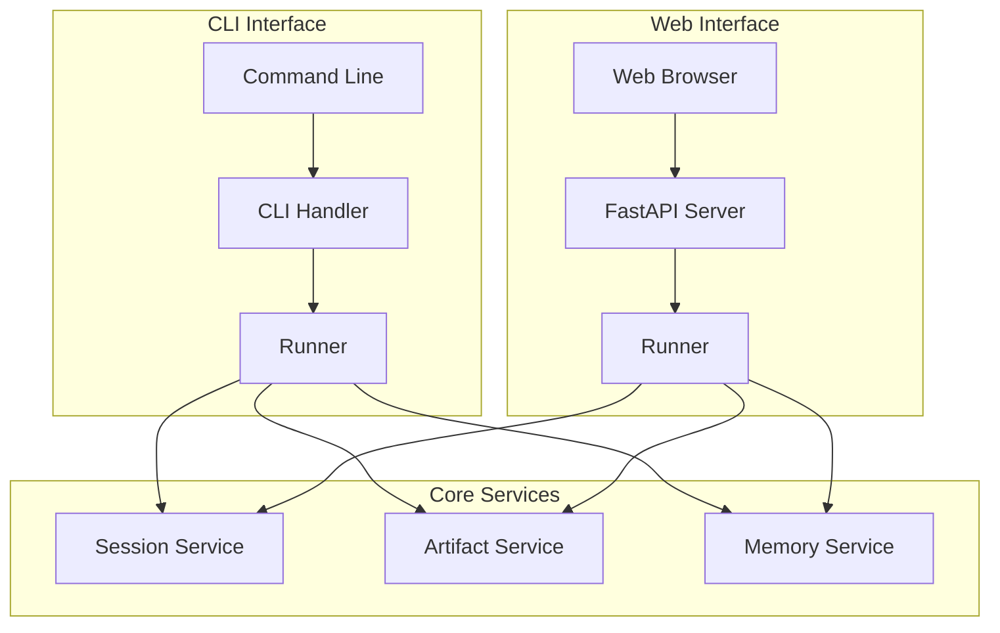
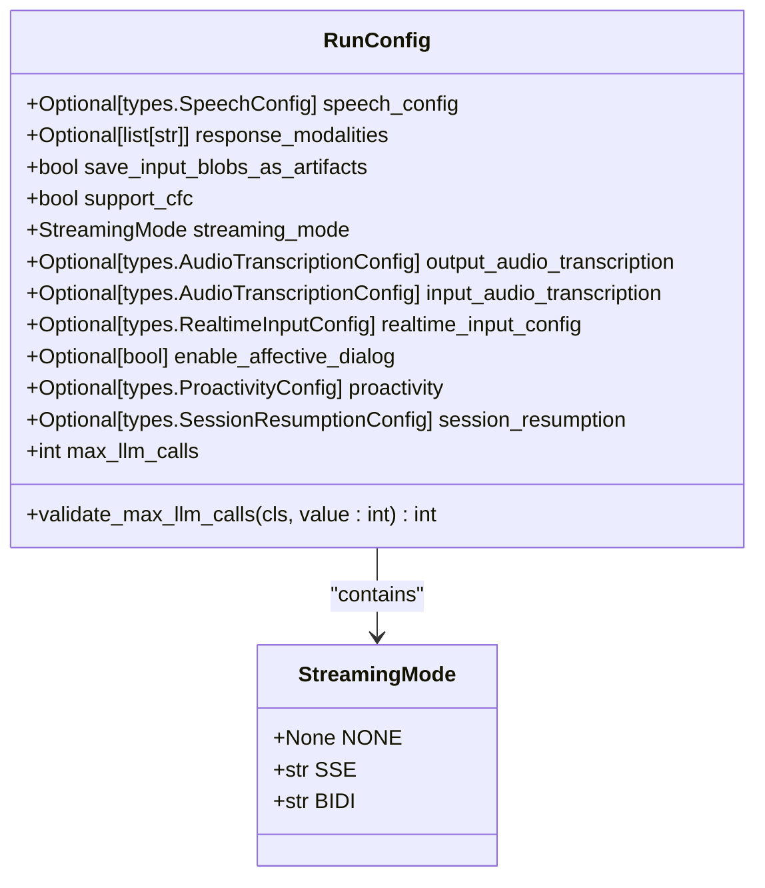

# Execution and Orchestration

<cite>
**Referenced Files in This Document**   
- [runners.py](file://src/google/adk/runners.py)
- [session.py](file://src/google/adk/sessions/session.py)
- [event.py](file://src/google/adk/events/event.py)
- [run_config.py](file://src/google/adk/agents/run_config.py)
- [cli.py](file://src/google/adk/cli/cli.py)
- [adk_web_server.py](file://src/google/adk/cli/adk_web_server.py)
- [live_request_queue.py](file://src/google/adk/agents/live_request_queue.py)
- [active_streaming_tool.py](file://src/google/adk/agents/active_streaming_tool.py)
</cite>

## Table of Contents
1. [Introduction](#introduction)
2. [Runner System Architecture](#runner-system-architecture)
3. [Execution Modes](#execution-modes)
4. [Session Management](#session-management)
5. [Event-Driven Architecture](#event-driven-architecture)
6. [CLI and Web UI Integration](#cli-and-web-ui-integration)
7. [Execution Configuration](#execution-configuration)
8. [Performance Considerations](#performance-considerations)
9. [Conclusion](#conclusion)

## Introduction

The Execution and Orchestration system in the ADK framework provides a robust runtime engine for managing agent lifecycles and coordinating execution flows. At its core, the Runner system serves as the central execution manager that handles agent invocation, session management, and event coordination. This documentation explores the implementation details of the execution engine, covering synchronous, asynchronous, and live streaming execution modes, session state management, event-driven interactions, and integration with development interfaces.

**Section sources**
- [runners.py](file://src/google/adk/runners.py#L59-L680)

## Runner System Architecture

The Runner class is the primary component responsible for executing agents within the ADK framework. It manages the complete lifecycle of agent execution, from initialization to termination, while coordinating interactions with various services such as session management, artifact storage, and credential handling.

The Runner system is designed with a modular architecture that separates concerns through well-defined interfaces. It maintains references to essential services including the session service for conversation history, artifact service for file management, memory service for context preservation, and credential service for authentication. The PluginManager enables extensibility by allowing custom plugins to intercept and modify execution flows.

**Diagram sources **
- [runners.py](file://src/google/adk/runners.py#L59-L680)

**Section sources**
- [runners.py](file://src/google/adk/runners.py#L59-L680)

## Execution Modes

The ADK framework supports multiple execution modes to accommodate different use cases and performance requirements. These modes provide flexibility in how agents process user inputs and generate responses.

### Synchronous Execution

The synchronous execution mode provides a simple interface for local testing and development purposes. Implemented through the `run()` method, this mode wraps asynchronous execution in a synchronous generator, allowing for straightforward integration in non-async contexts. The method creates a background thread to handle the asynchronous execution while yielding events to the caller in a blocking manner.

### Asynchronous Execution

The primary execution mode is asynchronous, exposed through the `run_async()` method. This approach leverages Python's async/await capabilities to efficiently handle I/O operations without blocking the event loop. The method processes user messages, manages session state, and coordinates agent execution through an asynchronous generator that yields events as they become available.

### Live Streaming Execution

For real-time interactive applications, the framework provides live streaming execution through the `run_live()` method. This experimental feature enables bidirectional streaming communication between clients and agents. The execution flow inspects agent tools for LiveRequestQueue parameters, automatically setting up streaming channels for real-time data exchange. This mode is particularly useful for voice-based interfaces and other applications requiring low-latency interaction.

**Diagram sources **
- [runners.py](file://src/google/adk/runners.py#L180-L249)
- [runners.py](file://src/google/adk/runners.py#L357-L464)

**Section sources**
- [runners.py](file://src/google/adk/runners.py#L121-L249)
- [runners.py](file://src/google/adk/runners.py#L357-L464)

## Session Management

Session management is a critical component of the execution system, responsible for maintaining conversation state across multiple interaction turns. The Session class represents a series of interactions between a user and agents, preserving the complete conversation history and application state.

### Session Structure

Each session contains essential metadata including a unique identifier, application name, user identifier, and a state dictionary for application-specific data. The core of the session is the events list, which stores the chronological sequence of interactions, including user inputs, agent responses, function calls, and other event types.

### State Preservation

The session state mechanism enables agents to maintain context across multiple invocations. The state dictionary can store arbitrary data that persists throughout the session lifecycle. When processing user messages, the runner can apply state deltas to update the session state, allowing agents to modify their behavior based on accumulated information.

### Session Services

The framework provides multiple session service implementations, including in-memory storage for development and testing, and persistent storage options for production environments. The BaseSessionService interface abstracts the storage mechanism, allowing applications to switch between implementations without modifying agent logic.

**Diagram sources **
- [session.py](file://src/google/adk/sessions/session.py#L25-L59)
- [event.py](file://src/google/adk/events/event.py#L29-L140)

**Section sources**
- [session.py](file://src/google/adk/sessions/session.py#L25-L59)
- [event.py](file://src/google/adk/events/event.py#L29-L140)

## Event-Driven Architecture

The ADK framework employs an event-driven architecture to enable real-time interaction patterns and facilitate extensibility through plugins. Events serve as the primary communication mechanism between components, carrying both content and metadata about interactions.

### Event Types and Structure

Events represent various interaction types including user messages, agent responses, function calls, and function responses. Each event includes metadata such as the author (user or agent name), invocation ID, timestamp, and optional actions. The EventActions class encapsulates additional behaviors such as state modifications and summarization controls.

### Event Processing Pipeline

The event processing pipeline begins when a user message is received and continues through agent processing until a response is generated. The pipeline includes several stages: message preprocessing, agent execution, event persistence, and post-processing. Plugins can intercept events at various points in the pipeline to modify behavior or add functionality.

### Plugin Integration

The event-driven architecture enables seamless integration of plugins through callback mechanisms. The PluginManager supports several callback types including before_run, on_user_message, on_event, and after_run. These callbacks allow plugins to modify execution behavior, transform content, or perform side effects without requiring changes to the core execution logic.

**Diagram sources **
- [runners.py](file://src/google/adk/runners.py#L251-L303)
- [event.py](file://src/google/adk/events/event.py#L29-L140)

**Section sources**
- [runners.py](file://src/google/adk/runners.py#L251-L303)
- [event.py](file://src/google/adk/events/event.py#L29-L140)

## CLI and Web UI Integration

The ADK framework provides multiple interfaces for agent execution and monitoring, including a command-line interface (CLI) and a web-based development UI. These interfaces leverage the same underlying execution engine while providing different user experiences.

### Command-Line Interface

The CLI provides a text-based interface for interacting with agents during development and testing. It supports both interactive mode, where users can engage in real-time conversations with agents, and batch mode, where predefined inputs are processed from a file. The CLI uses the Runner class to execute agents and displays events as they occur, providing immediate feedback.

### Web-Based Development UI

The web-based development UI offers a more comprehensive environment for agent development and debugging. Built on FastAPI, the web server exposes REST endpoints for session management, agent execution, and evaluation. The UI provides visualizations of conversation flows, access to session history, and tools for evaluating agent performance.

### Integration Architecture

Both interfaces share the same core execution components but differ in how they handle input/output. The CLI uses standard input/output streams, while the web UI employs HTTP endpoints and WebSocket connections for real-time updates. The AdkWebServer class orchestrates the web interface, managing runners, session services, and evaluation components.

**Diagram sources **
- [cli.py](file://src/google/adk/cli/cli.py#L39-L218)
- [adk_web_server.py](file://src/google/adk/cli/adk_web_server.py#L210-L800)

**Section sources**
- [cli.py](file://src/google/adk/cli/cli.py#L39-L218)
- [adk_web_server.py](file://src/google/adk/cli/adk_web_server.py#L210-L800)

## Execution Configuration

The execution engine supports extensive configuration options that allow developers to fine-tune agent behavior and performance characteristics. These configurations are managed through the RunConfig class, which provides parameters for various execution aspects.

### Configuration Parameters

The RunConfig class includes settings for streaming mode (none, SSE, or bidirectional), audio transcription, speech configuration, and proactivity. It also provides controls for input/output handling, such as whether to save input blobs as artifacts and whether to support Compositional Function Calling (CFC).

### Timeout and Retry Policies

While not explicitly detailed in the provided code, the framework's architecture supports timeout and retry mechanisms through the asynchronous execution model. The max_llm_calls parameter in RunConfig provides a safeguard against infinite loops by limiting the total number of LLM calls during a single execution.

### Concurrency Limits

The event-driven, asynchronous architecture naturally supports concurrent execution of multiple sessions. The Runner system can handle multiple concurrent invocations through Python's asyncio framework, allowing for high-throughput scenarios without requiring explicit thread management.

**Diagram sources **
- [run_config.py](file://src/google/adk/agents/run_config.py#L30-L110)

**Section sources**
- [run_config.py](file://src/google/adk/agents/run_config.py#L30-L110)

## Performance Considerations

The execution engine is designed with performance optimization in mind, particularly for high-throughput scenarios and streaming applications. Several architectural decisions contribute to efficient execution and low-latency responses.

### High-Throughput Optimization

The asynchronous architecture enables efficient handling of multiple concurrent requests without blocking. By leveraging Python's asyncio framework, the system can manage thousands of concurrent sessions with minimal overhead. The separation of concerns between the Runner, session services, and other components allows for independent scaling of different system parts.

### Streaming Latency Reduction

For streaming applications, the framework minimizes response latency through several mechanisms. The live execution mode establishes persistent connections that eliminate connection overhead for subsequent interactions. The event-driven architecture enables incremental response generation, allowing partial results to be delivered to clients as soon as they become available rather than waiting for complete processing.

### Resource Management

The system includes mechanisms for efficient resource management, including connection pooling, object reuse, and proper cleanup of resources. The close() method on the Runner class ensures that all toolsets are properly cleaned up, preventing resource leaks in long-running applications.

**Section sources**
- [runners.py](file://src/google/adk/runners.py#L637-L640)
- [runners.py](file://src/google/adk/runners.py#L620-L636)

## Conclusion

The Execution and Orchestration system in the ADK framework provides a comprehensive runtime environment for agent execution. The Runner system serves as the central component, managing agent lifecycles and coordinating execution flows across various modes including synchronous, asynchronous, and live streaming. Session management maintains conversation state across turns, while the event-driven architecture enables real-time interaction patterns and extensibility through plugins.

The integration between CLI and web-based development UI provides flexible options for agent execution and monitoring, while configurable parameters allow fine-tuning of execution behavior. The architecture is optimized for performance, supporting high-throughput scenarios and minimizing latency in streaming applications. This robust execution engine forms the foundation for building sophisticated agent-based applications with the ADK framework.