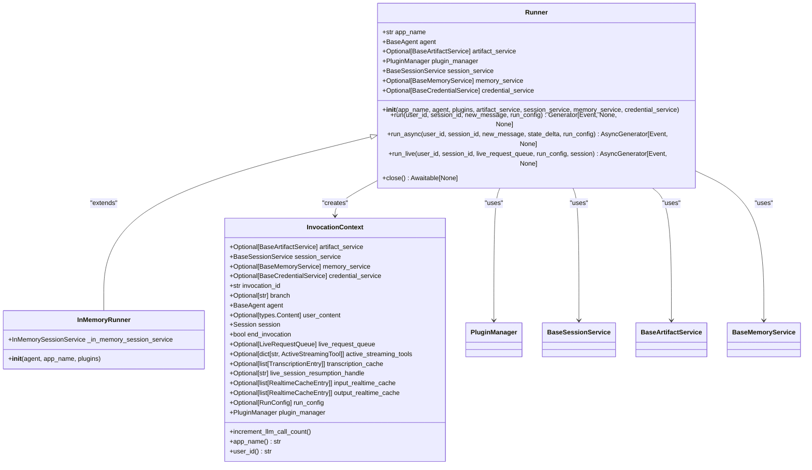
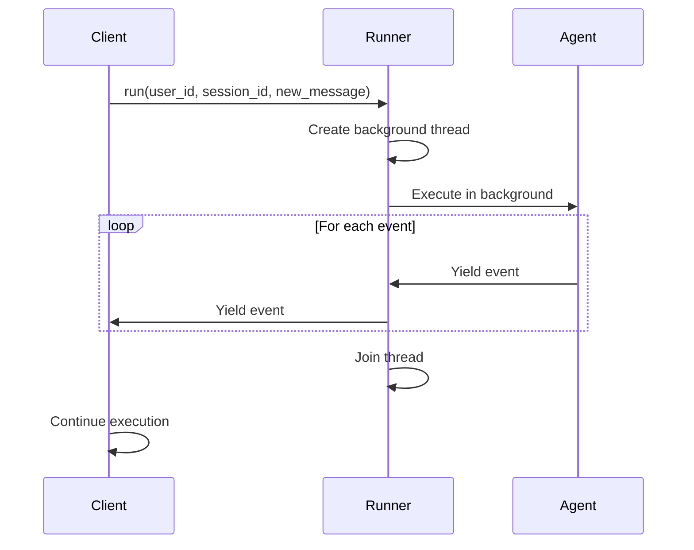
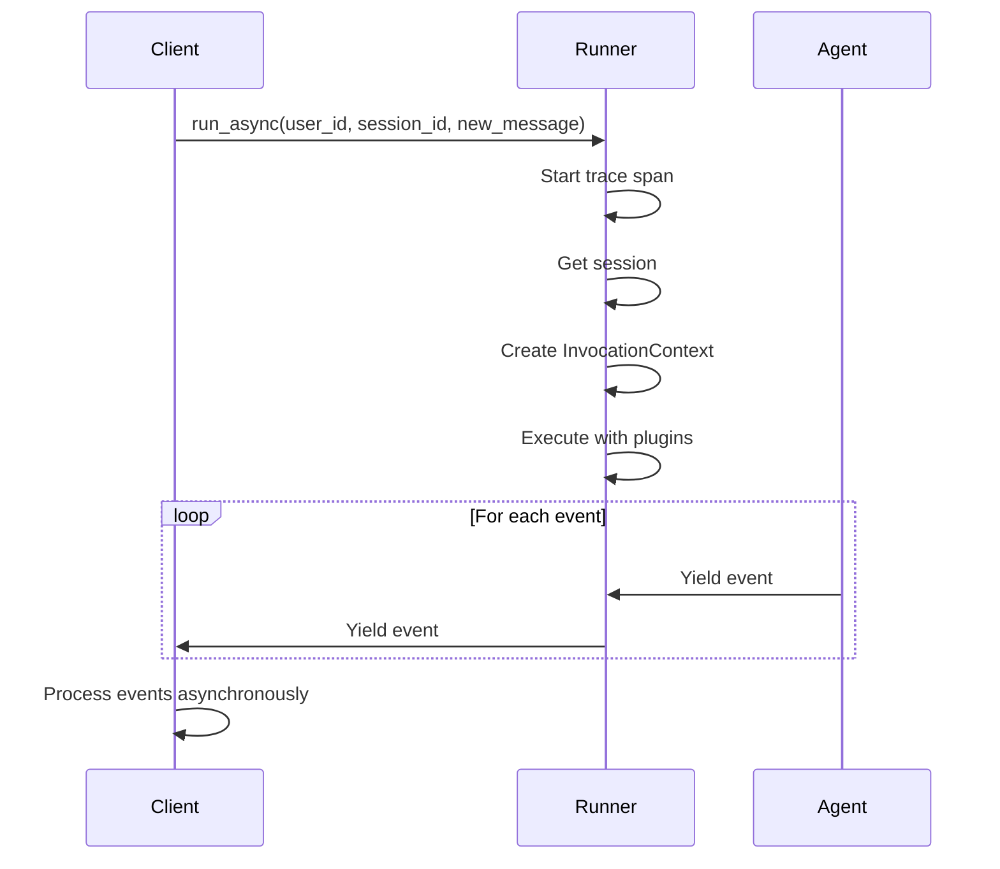
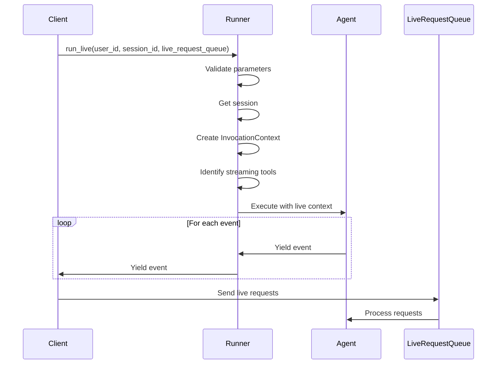
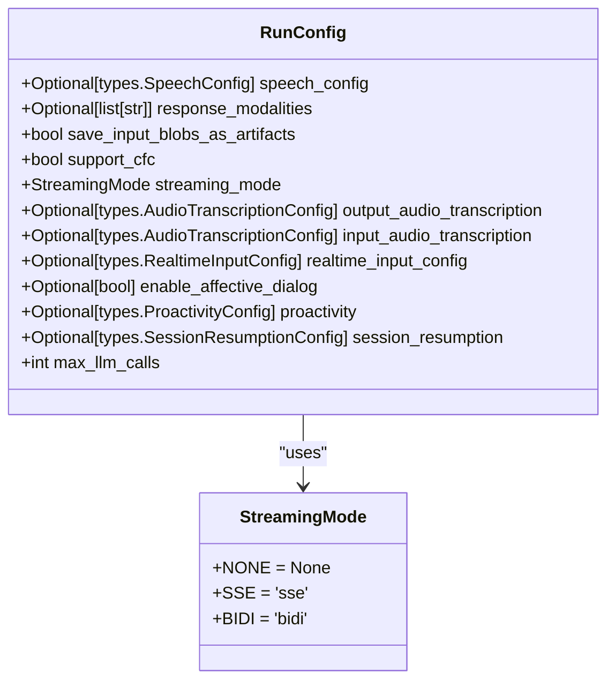
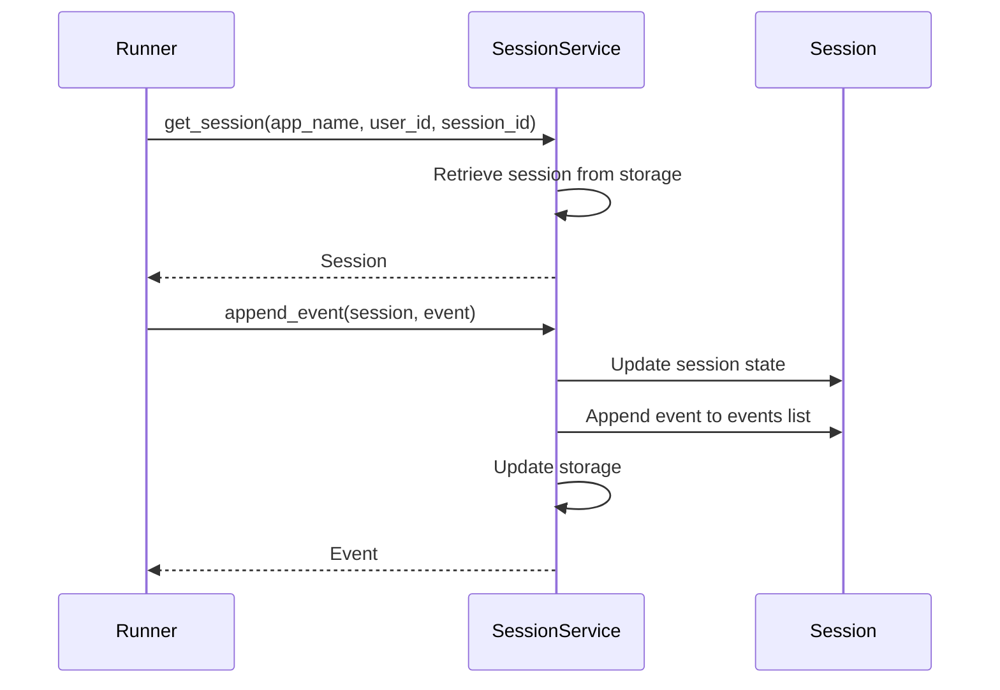
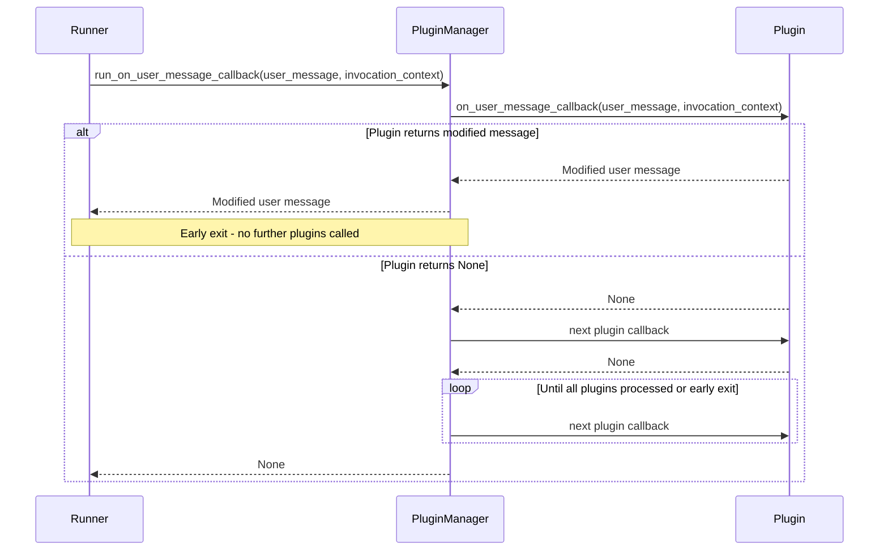
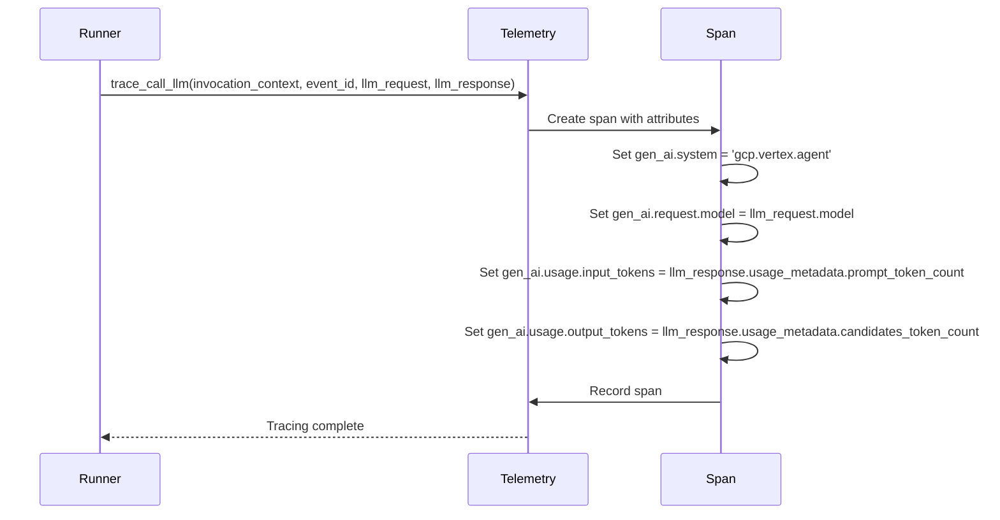
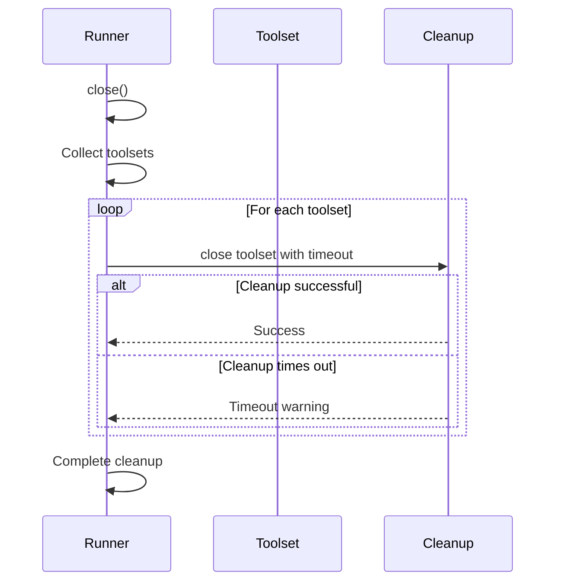

# Runner System

<cite>
**Referenced Files in This Document**   
- [runners.py](file://src/google/adk/runners.py)
- [run_config.py](file://src/google/adk/agents/run_config.py)
- [plugin_manager.py](file://src/google/adk/plugins/plugin_manager.py)
- [base_session_service.py](file://src/google/adk/sessions/base_session_service.py)
- [invocation_context.py](file://src/google/adk/agents/invocation_context.py)
- [telemetry.py](file://src/google/adk/telemetry.py)
- [demo_runner.py](file://contributing/samples/spec_kit_integration/demo_runner.py)
- [test_integrated_workflow.py](file://contributing/samples/spec_kit_integration/test_integrated_workflow.py)
</cite>

## Table of Contents
1. [Introduction](#introduction)
2. [Core Components](#core-components)
3. [Execution Modes](#execution-modes)
4. [Configuration Options](#configuration-options)
5. [Integration with System Components](#integration-with-system-components)
6. [Practical Examples](#practical-examples)
7. [Common Issues and Performance Optimization](#common-issues-and-performance-optimization)
8. [Extensibility](#extensibility)
9. [Conclusion](#conclusion)

## Introduction
The Runner System is the central execution engine within the Agent Development Kit (ADK) framework, responsible for orchestrating agent runs and managing their complete lifecycle from initialization to completion. As the core coordinator, the Runner provides a unified interface for executing agents, handling message processing, event generation, and interaction with various services such as session management, artifact storage, and memory. It serves as the primary mechanism through which agents interact with users and other system components, ensuring consistent and reliable execution across different deployment scenarios.

The Runner System supports multiple execution paradigms to accommodate various application requirements, including synchronous execution for simple blocking operations, asynchronous execution for non-blocking operations with future results, and live streaming execution for real-time partial responses. This flexibility allows developers to choose the most appropriate execution model based on their specific use case, whether it's a simple local development environment or a high-throughput production system on Cloud Run or Vertex AI.

**Section sources**
- [runners.py](file://src/google/adk/runners.py#L59-L90)

## Core Components

The Runner System is built around several key components that work together to provide a robust execution environment for agents. At its heart is the `Runner` class, which manages the execution of an agent within a session, handling message processing, event generation, and service interactions. The Runner is initialized with essential services including an artifact service for managing non-textual data, a session service for maintaining conversation state, a memory service for long-term recall, and a plugin manager for extending functionality.

The `InMemoryRunner` class provides a lightweight implementation for testing and development, using in-memory services for artifacts, sessions, and memory. This makes it ideal for local development and unit testing, allowing developers to quickly iterate on agent logic without the overhead of external dependencies. The Runner's architecture is designed to be modular and extensible, with clear separation of concerns between the execution engine and the various services it interacts with.

A critical component of the Runner System is the `InvocationContext`, which represents the data for a single invocation of an agent. This context maintains state throughout the execution lifecycle, including references to services, the current agent, session data, and configuration parameters. The InvocationContext also tracks execution metrics such as the number of LLM calls made, enforcing limits defined in the RunConfig to prevent infinite loops or excessive resource consumption.



**Diagram sources **
- [runners.py](file://src/google/adk/runners.py#L59-L679)
- [invocation_context.py](file://src/google/adk/agents/invocation_context.py#L92-L219)

**Section sources**
- [runners.py](file://src/google/adk/runners.py#L59-L679)
- [invocation_context.py](file://src/google/adk/agents/invocation_context.py#L92-L219)

## Execution Modes

The Runner System provides three distinct execution modes to accommodate different application requirements and deployment scenarios. Each mode offers unique characteristics and use cases, allowing developers to select the most appropriate approach for their specific needs.

### Synchronous Execution
Synchronous execution provides a blocking interface that runs the agent and yields events until completion. This mode is primarily intended for local testing and convenience purposes, offering a simple programming model for developers to quickly test agent behavior. The `run` method creates a background thread to handle the asynchronous execution, allowing the main thread to consume events in a synchronous manner. While convenient for development, this mode is not recommended for production use due to its blocking nature and potential resource consumption.



**Diagram sources **
- [runners.py](file://src/google/adk/runners.py#L121-L179)

### Asynchronous Execution
Asynchronous execution is the primary interface for production usage, providing a non-blocking approach that returns an asynchronous generator of events. The `run_async` method is the main entry point for running agents, handling the complete execution lifecycle from initialization to completion. This mode allows for efficient resource utilization and is well-suited for high-throughput environments where multiple agent executions need to be managed concurrently. The asynchronous nature enables better integration with modern web frameworks and event-driven architectures.



**Diagram sources **
- [runners.py](file://src/google/adk/runners.py#L180-L249)

### Live Streaming Execution
Live streaming execution is an experimental feature designed for real-time applications that require immediate feedback and partial responses. The `run_live` method enables bidirectional streaming of events, making it ideal for interactive applications such as voice assistants or real-time collaboration tools. This mode uses a `LiveRequestQueue` to receive live requests and supports streaming tools that can process data incrementally. The experimental nature of this feature means its API and behavior may change in future releases, but it provides powerful capabilities for applications requiring low-latency responses.



**Diagram sources **
- [runners.py](file://src/google/adk/runners.py#L357-L464)

**Section sources**
- [runners.py](file://src/google/adk/runners.py#L121-L464)

## Configuration Options

The Runner System provides extensive configuration options through the `RunConfig` class, allowing developers to fine-tune agent behavior and execution parameters. These configuration options enable customization of various aspects of agent execution, from streaming behavior to resource limits and advanced features.

### Streaming Configuration
The `StreamingMode` enum defines the streaming behavior for agent execution, with options for no streaming (`NONE`), server-sent events (`SSE`), and bidirectional streaming (`BIDI`). The `streaming_mode` parameter in `RunConfig` controls this behavior, allowing developers to select the appropriate streaming approach based on their application requirements. For live streaming applications, the `response_modalities` parameter specifies the output modalities, with audio being the default.



**Diagram sources **
- [run_config.py](file://src/google/adk/agents/run_config.py#L30-L110)

### Resource Management and Limits
The `RunConfig` class includes several parameters for managing resource consumption and preventing infinite loops. The `max_llm_calls` parameter sets a limit on the total number of LLM calls for a given run, helping to prevent excessive resource usage and potential infinite loops. This limit can be set to a positive number to enforce a bound, or to a value less than or equal to zero to allow unbounded calls (though this is not recommended for production use).

The `support_cfc` parameter enables Compositional Function Calling, an experimental feature that allows for more complex function call patterns. This feature is only applicable for SSE streaming mode and requires the LIVE API, as only the LIVE API supports CFC. When enabled, the runner automatically configures the agent to use the built-in code executor, ensuring compatibility with the CFC feature.

### Advanced Features
The `RunConfig` class also supports several advanced features for enhancing agent capabilities. The `enable_affective_dialog` parameter allows the model to detect emotions and adapt its responses accordingly, enabling more natural and empathetic interactions. The `proactivity` configuration allows the model to respond proactively to input and ignore irrelevant information, improving the efficiency of conversations.

For applications requiring session continuity, the `session_resumption` parameter configures the session resumption mechanism, currently supporting transparent session resumption mode. This feature is particularly useful for applications where users may disconnect and reconnect, allowing the agent to seamlessly continue the conversation from where it left off.

**Section sources**
- [run_config.py](file://src/google/adk/agents/run_config.py#L30-L110)

## Integration with System Components

The Runner System integrates seamlessly with various system components to provide a comprehensive execution environment for agents. These integrations enable rich functionality and ensure consistent behavior across different aspects of agent execution.

### Session Services
The Runner System relies heavily on session services to maintain conversation state and history. The `BaseSessionService` abstract class defines the interface for session management, with implementations like `InMemorySessionService` for development and `VertexAiSessionService` for production. The session service handles the creation, retrieval, and deletion of sessions, as well as the appending of events to sessions.

The integration between the Runner and session service is critical for maintaining conversation continuity. When a new message is received, the Runner retrieves the appropriate session and appends the user message as an event. During agent execution, generated events are also appended to the session, building a complete history of the interaction. This history is then used to provide context for subsequent agent calls, enabling coherent and context-aware responses.



**Diagram sources **
- [base_session_service.py](file://src/google/adk/sessions/base_session_service.py#L43-L110)
- [runners.py](file://src/google/adk/runners.py#L205-L210)

### Plugin Managers
The Runner System integrates with the plugin manager to provide extensibility and customization capabilities. The `PluginManager` class manages the registration and execution of plugins, allowing developers to inject custom behavior at various points in the execution lifecycle. Plugins can modify user messages, intercept events, and provide early exit conditions, enabling powerful customization without modifying the core Runner logic.

The integration follows an "early exit" strategy, where if any plugin callback returns a non-None value, the execution of subsequent plugins is halted, and the returned value is propagated up the call stack. This allows plugins to short-circuit operations like agent runs, tool calls, or model requests, providing fine-grained control over agent behavior.



**Diagram sources **
- [plugin_manager.py](file://src/google/adk/plugins/plugin_manager.py#L58-L300)
- [runners.py](file://src/google/adk/runners.py#L219-L223)

### Telemetry Systems
The Runner System integrates with telemetry systems to provide observability and monitoring capabilities. The `telemetry` module uses OpenTelemetry to trace various aspects of agent execution, including LLM calls, tool calls, and data transmission. This integration enables detailed monitoring of agent performance, resource usage, and execution flow, which is essential for debugging and optimization.

The telemetry system records information about LLM requests and responses, including model parameters, token usage, and finish reasons. It also traces tool calls, capturing the arguments and responses for each tool invocation. This comprehensive tracing enables developers to understand the complete execution flow of their agents and identify potential bottlenecks or issues.



**Diagram sources **
- [telemetry.py](file://src/google/adk/telemetry.py#L38-L289)
- [runners.py](file://src/google/adk/runners.py#L204-L205)

**Section sources**
- [base_session_service.py](file://src/google/adk/sessions/base_session_service.py#L43-L110)
- [plugin_manager.py](file://src/google/adk/plugins/plugin_manager.py#L58-L300)
- [telemetry.py](file://src/google/adk/telemetry.py#L38-L289)

## Practical Examples

The Runner System can be instantiated and configured for various deployment scenarios, from local development to cloud deployment on Cloud Run or Vertex AI. These practical examples demonstrate how to set up and use the Runner in different contexts.

### Local Development
For local development and testing, the `InMemoryRunner` provides a convenient way to execute agents without external dependencies. This runner uses in-memory implementations for all services, making it lightweight and self-contained. The following example shows how to set up a Runner with a root agent and execute a simple interaction:

```python
from google.adk.runners import InMemoryRunner
from google.genai import types

async def main():
    # Create a runner with the root agent
    runner = InMemoryRunner(root_agent)
    
    # Execute a simple interaction
    async for event in runner.run_async(
        user_id="test_user",
        session_id="test_session",
        new_message=types.Content(parts=[types.Part(text="Hello, how are you?")])
    ):
        if not event.partial and event.content:
            print(f"Response: {event.content.parts[0].text}")
```

This approach is ideal for rapid prototyping and unit testing, allowing developers to quickly iterate on agent logic without the overhead of external services.

### Cloud Run Deployment
When deploying to Cloud Run, the Runner can be configured to use cloud-based services for session management, artifact storage, and memory. This enables scalable and resilient deployments that can handle high traffic volumes. The configuration would typically involve setting up the Runner with appropriate service implementations that connect to Google Cloud services.

### Vertex AI Integration
For deployment on Vertex AI, the Runner can be integrated with Vertex AI Agent Engine to leverage managed infrastructure and advanced features. This integration allows for seamless scaling, monitoring, and management of agent deployments. The Runner can be configured to use Vertex AI-specific services for session management, memory, and artifact storage, ensuring optimal performance and reliability.

The following example from the Spec-Kit integration demonstrates a more complex workflow involving multiple phases of agent execution:

```python
# Hardware simulation project with RAG-enhanced workflow
response = await runner.run_async("/specify Create an ARM processor simulator with DML device models")
response = await runner.run_async("/plan Research Simics DML documentation and create implementation plan")
response = await runner.run_async("/tasks Include documentation research and code examples")
```

This example shows how the Runner can be used to orchestrate a multi-phase workflow, with each phase building on the results of the previous one. The integration with RAG tools and hardware simulation capabilities demonstrates the flexibility and power of the Runner System in complex scenarios.

**Section sources**
- [demo_runner.py](file://contributing/samples/spec_kit_integration/demo_runner.py#L1-L454)
- [test_integrated_workflow.py](file://contributing/samples/spec_kit_integration/test_integrated_workflow.py#L42-L176)

## Common Issues and Performance Optimization

When working with the Runner System, several common issues may arise, particularly in high-throughput environments or when dealing with long-running operations. Understanding these issues and applying appropriate optimization techniques is crucial for building reliable and efficient agent systems.

### Handling Long-Running Operations
Long-running operations can pose challenges for agent systems, potentially leading to timeouts, resource exhaustion, or poor user experience. The Runner System addresses this through several mechanisms. The `max_llm_calls` parameter in `RunConfig` helps prevent infinite loops by limiting the total number of LLM calls for a given run. Additionally, the `end_invocation` flag in `InvocationContext` can be set by plugins or tools to terminate an invocation early if certain conditions are met.

For operations that legitimately require extended execution time, implementing proper progress tracking and intermediate responses is essential. This can be achieved through the use of streaming execution modes, which allow the agent to provide partial responses while continuing to process the request. The live streaming execution mode is particularly well-suited for this, as it supports real-time feedback and incremental updates.

### Resource Cleanup
Proper resource cleanup is critical for maintaining system stability and preventing memory leaks. The Runner System provides a `close` method that should be called when the runner is no longer needed. This method triggers the cleanup of toolsets, ensuring that any resources held by tools are properly released.

The cleanup process uses task context management to ensure that cleanup operations are performed correctly, even in the presence of exceptions. Each toolset is closed with a timeout protection mechanism, preventing cleanup operations from hanging indefinitely. This is particularly important for tools that maintain external connections or hold system resources.



**Diagram sources **
- [runners.py](file://src/google/adk/runners.py#L637-L640)

### Performance Optimization for High-Throughput Environments
In high-throughput environments, optimizing the Runner System for performance is essential. Several strategies can be employed to improve performance and scalability:

1. **Connection Pooling**: Reuse connections to external services such as databases or APIs to reduce connection overhead.
2. **Caching**: Implement caching for frequently accessed data or expensive computations to reduce latency.
3. **Batching**: Group multiple operations together to reduce the number of round trips to external services.
4. **Asynchronous Processing**: Use asynchronous execution modes to maximize resource utilization and handle multiple requests concurrently.
5. **Resource Limits**: Configure appropriate resource limits to prevent any single agent from consuming excessive resources.

The use of asynchronous execution is particularly important for high-throughput environments, as it allows the system to handle multiple agent executions concurrently without blocking. This enables better utilization of system resources and improves overall throughput.

**Section sources**
- [runners.py](file://src/google/adk/runners.py#L637-L640)

## Extensibility

The Runner System is designed to be highly extensible, allowing developers to customize and enhance its functionality through custom plugins and middleware. This extensibility is a key feature that enables the system to adapt to diverse use cases and requirements.

### Custom Plugins
Custom plugins can be created by extending the `BasePlugin` class and implementing the desired callback methods. The plugin system supports a wide range of callback points, including `on_user_message_callback`, `before_run_callback`, `after_run_callback`, `on_event_callback`, and various tool and model callbacks. These callbacks allow plugins to modify user messages, intercept events, provide early exit conditions, and customize agent behavior at various points in the execution lifecycle.

The "early exit" strategy employed by the plugin system enables powerful customization capabilities. If a plugin callback returns a non-None value, the execution of subsequent plugins is halted, and the returned value is propagated up the call stack. This allows plugins to short-circuit operations like agent runs, tool calls, or model requests, providing fine-grained control over agent behavior.

### Middleware
Middleware can be implemented through the plugin system to provide cross-cutting concerns such as logging, authentication, rate limiting, and monitoring. The modular design of the Runner System makes it easy to add middleware components that can operate on all agent executions without modifying the core logic.

The integration with the telemetry system provides a foundation for monitoring and observability middleware, allowing developers to track agent performance, resource usage, and execution flow. This information can be used to identify bottlenecks, optimize performance, and ensure system reliability.

The extensibility of the Runner System enables developers to build sophisticated agent ecosystems that can adapt to changing requirements and integrate with diverse external systems. By leveraging the plugin system and middleware capabilities, developers can create highly customized and specialized agent behaviors while maintaining the core reliability and consistency of the Runner System.

**Section sources**
- [plugin_manager.py](file://src/google/adk/plugins/plugin_manager.py#L58-L300)

## Conclusion
The Runner System is the central execution engine of the ADK framework, providing a robust and flexible platform for orchestrating agent runs. Its support for multiple execution modes, comprehensive configuration options, and seamless integration with system components make it well-suited for a wide range of applications, from simple local development to complex production deployments on Cloud Run or Vertex AI.

The system's modular architecture, with clear separation of concerns between the execution engine and supporting services, enables easy customization and extension through plugins and middleware. This extensibility, combined with comprehensive telemetry and monitoring capabilities, provides developers with the tools they need to build, debug, and optimize sophisticated agent systems.

By understanding the core components, execution modes, and integration points of the Runner System, developers can effectively leverage its capabilities to create powerful and reliable agent applications. The practical examples and optimization guidance provided in this documentation serve as a foundation for building high-performance agent systems that can handle complex workflows and scale to meet demanding production requirements.