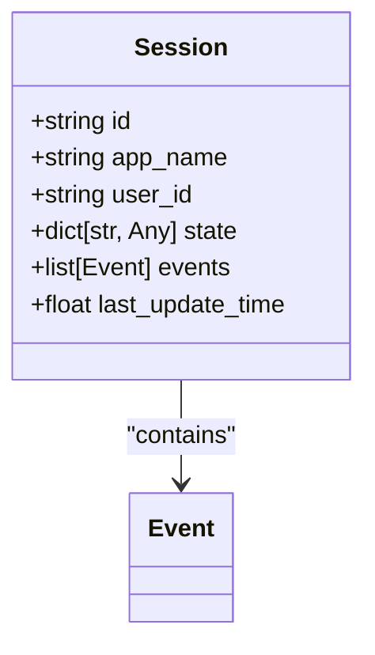
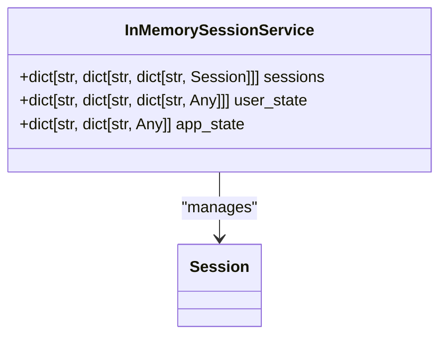
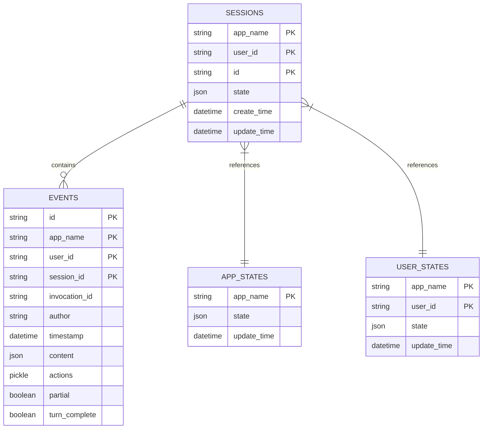
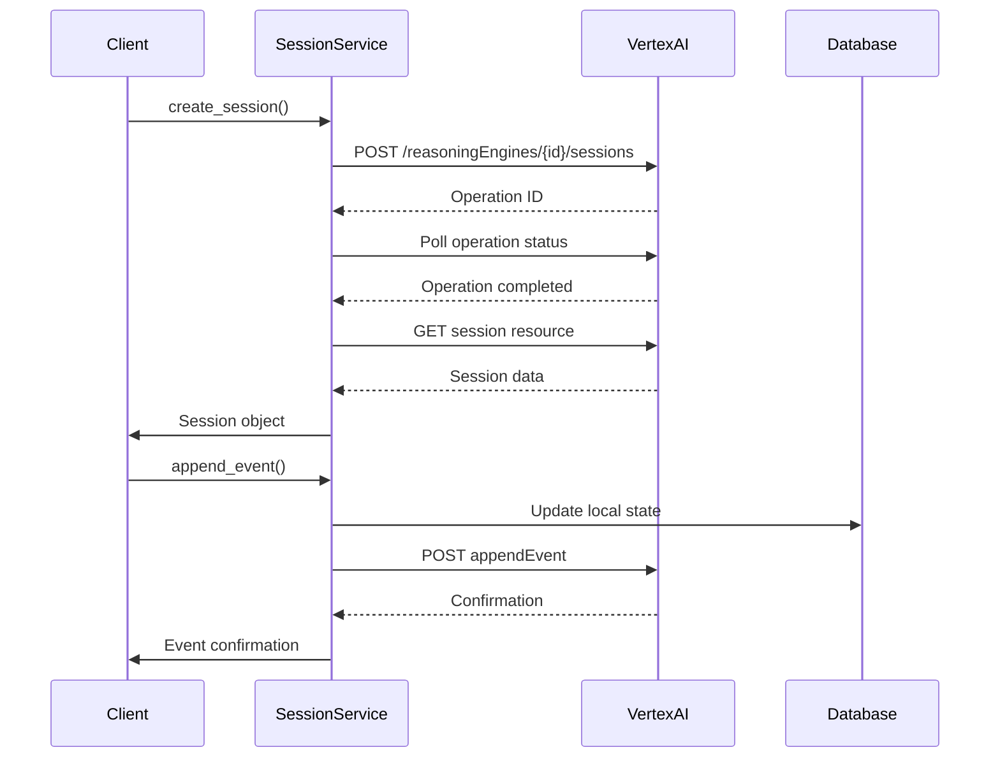
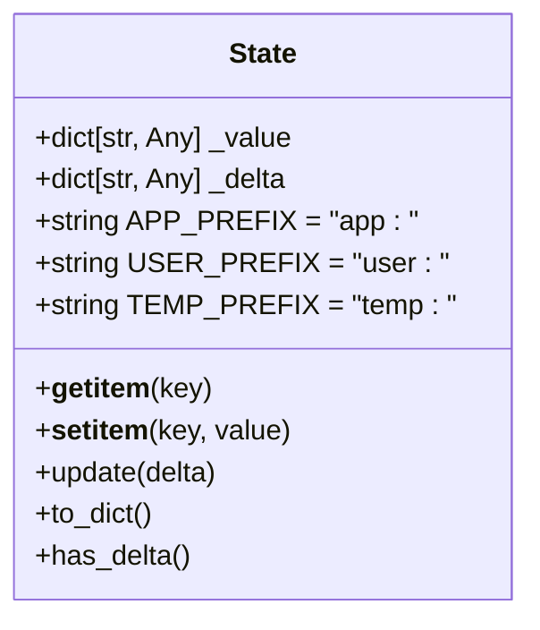
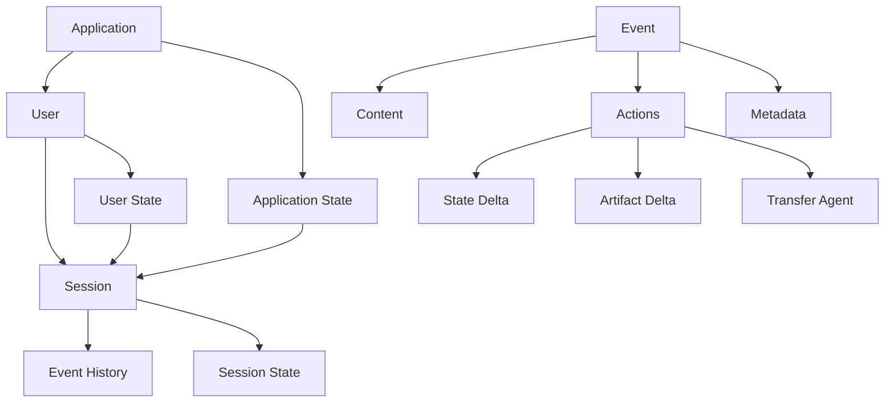

# Session Management

<cite>
**Referenced Files in This Document**   
- [session.py](file://src/google/adk/sessions/session.py)
- [base_session_service.py](file://src/google/adk/sessions/base_session_service.py)
- [in_memory_session_service.py](file://src/google/adk/sessions/in_memory_session_service.py)
- [database_session_service.py](file://src/google/adk/sessions/database_session_service.py)
- [vertex_ai_session_service.py](file://src/google/adk/sessions/vertex_ai_session_service.py)
- [state.py](file://src/google/adk/sessions/state.py)
- [test_session_service.py](file://tests/unittests/sessions/test_session_service.py)
- [test_vertex_ai_session_service.py](file://tests/unittests/sessions/test_vertex_ai_session_service.py)
- [agent.py](file://contributing/samples/session_state_agent/agent.py)
</cite>

## Table of Contents
1. [Introduction](#introduction)
2. [Core Components](#core-components)
3. [Session Class Implementation](#session-class-implementation)
4. [Session Service Implementations](#session-service-implementations)
5. [State Management System](#state-management-system)
6. [Practical Usage Examples](#practical-usage-examples)
7. [Data Model and Storage](#data-model-and-storage)
8. [Common Issues and Scaling Considerations](#common-issues-and-scaling-considerations)
9. [Configuration and Integration](#configuration-and-integration)
10. [Performance Optimization](#performance-optimization)

## Introduction
The Session Management system in the ADK Python framework provides a comprehensive solution for maintaining conversation state across agent interactions. This system enables multi-step dialogues by preserving context between turns, allowing agents to maintain continuity in conversations and build upon previous interactions. The session management infrastructure supports various deployment scenarios from development to enterprise production environments through multiple backend implementations. The system is designed to handle event history, state variables, metadata, and user-specific contexts while providing robust mechanisms for session persistence, retrieval, and manipulation.

## Core Components

The Session Management system consists of several core components that work together to maintain conversation state across agent interactions. The system is built around a pluggable architecture that allows different storage backends while maintaining a consistent interface. Key components include the Session class that represents a conversation series between users and agents, the BaseSessionService abstract class that defines the contract for session operations, and various concrete implementations for different storage requirements. The system also includes state management utilities that handle the merging of application-level, user-level, and session-level state variables. Event handling is integrated into the session lifecycle, allowing for the tracking of user inputs, model responses, function calls, and other interaction events throughout the conversation.

**Section sources**
- [session.py](file://src/google/adk/sessions/session.py#L25-L59)
- [base_session_service.py](file://src/google/adk/sessions/base_session_service.py#L43-L110)
- [state.py](file://src/google/adk/sessions/state.py#L18-L80)

## Session Class Implementation

The Session class serves as the central data structure for maintaining conversation state across agent interactions. It represents a series of interactions between a user and agents, storing essential information needed to preserve context between turns. The class is implemented as a Pydantic BaseModel with several key attributes: a unique identifier (id), application name (app_name), user identifier (user_id), state dictionary (state), event history (events), and last update timestamp (last_update_time). The state attribute stores session variables that persist across interactions, while the events list maintains the complete history of conversation events including user inputs, model responses, and function calls. The class uses camelCase naming convention through Pydantic's alias generator, ensuring compatibility with external systems. The implementation includes proper type hints and field definitions to ensure data integrity and provide clear documentation of the expected data structure.

**Diagram sources **
- [session.py](file://src/google/adk/sessions/session.py#L25-L59)
- [events/event.py](file://src/google/adk/events/event.py)

**Section sources**
- [session.py](file://src/google/adk/sessions/session.py#L25-L59)

## Session Service Implementations

The Session Management system provides three distinct implementations of the BaseSessionService interface, each designed for specific deployment scenarios and requirements. These implementations share a common interface while offering different persistence, scalability, and performance characteristics.

### In-Memory Session Service
The InMemorySessionService provides a lightweight implementation suitable for development and testing environments. It stores sessions in Python dictionaries organized by application name, user ID, and session ID, enabling fast access and manipulation. The service maintains separate state dictionaries for application-level, user-level, and session-level data, which are merged when sessions are retrieved. While offering excellent performance for single-process applications, this implementation is not suitable for production environments due to its lack of persistence across application restarts and inability to scale across multiple instances. The service includes deprecated synchronous methods alongside the primary asynchronous interface, facilitating migration from older codebases.

**Diagram sources **
- [in_memory_session_service.py](file://src/google/adk/sessions/in_memory_session_service.py#L35-L304)

### Database-Backed Session Service
The DatabaseSessionService provides persistent storage using SQLAlchemy with support for multiple database backends including PostgreSQL, MySQL, SQLite, and Spanner. This implementation uses a relational data model with tables for sessions, events, application states, and user states, connected through foreign key relationships. The service automatically creates database tables on initialization and supports various database-specific features such as JSONB columns in PostgreSQL and precise timestamp handling across different database systems. It includes custom type decorators like DynamicJSON and PreciseTimestamp to handle database-specific data types and ensure consistent behavior across different database engines. The implementation provides full CRUD operations for sessions and includes transaction management to ensure data consistency.

**Diagram sources **
- [database_session_service.py](file://src/google/adk/sessions/database_session_service.py#L141-L366)

### Vertex AI Integrated Session Service
The VertexAiSessionService integrates with Google's Vertex AI Agent Engine to provide enterprise-grade session management capabilities. This implementation connects to the Vertex AI Session Service via the GenAI API client, enabling cloud-based persistence and advanced features. It supports long-running operations (LRO) for session creation and implements retry logic with exponential backoff for handling transient failures. The service handles authentication and project configuration, supporting both explicit configuration and environment-based discovery. It includes special handling for Vertex AI Express mode and implements proper URL encoding for user IDs in list operations. The implementation converts between internal session representations and the Vertex AI API format, handling data type conversions and timestamp parsing.

**Diagram sources **
- [vertex_ai_session_service.py](file://src/google/adk/sessions/vertex_ai_session_service.py#L48-L338)

**Section sources**
- [in_memory_session_service.py](file://src/google/adk/sessions/in_memory_session_service.py#L35-L304)
- [database_session_service.py](file://src/google/adk/sessions/database_session_service.py#L369-L641)
- [vertex_ai_session_service.py](file://src/google/adk/sessions/vertex_ai_session_service.py#L48-L338)

## State Management System

The state management system in the Session Management framework provides a sophisticated mechanism for handling different levels of state persistence and scope. The State class implements a dictionary-like interface that maintains both current values and pending changes (delta), enabling transactional updates to session state. The system supports three distinct state prefixes that determine the scope and persistence of state variables: app: for application-level state shared across all users, user: for user-specific state that persists across sessions, and temp: for temporary state that is not persisted. When events are processed, the system automatically updates the appropriate state stores based on these prefixes, ensuring that application and user state changes are propagated to all relevant sessions. The state merging logic combines session state with application and user state when sessions are retrieved, providing a comprehensive view of the current context.

**Diagram sources **
- [state.py](file://src/google/adk/sessions/state.py#L18-L80)

**Section sources**
- [state.py](file://src/google/adk/sessions/state.py#L18-L80)
- [base_session_service.py](file://src/google/adk/sessions/base_session_service.py#L94-L110)
- [in_memory_session_service.py](file://src/google/adk/sessions/in_memory_session_service.py#L179-L200)

## Practical Usage Examples

The Session Management system can be used programmatically to create, retrieve, and update sessions in various scenarios. The following examples demonstrate common usage patterns:

### Creating and Managing Sessions
Sessions can be created using the create_session method, which accepts parameters for the application name, user ID, initial state, and optional session ID. The system automatically generates a unique session ID if none is provided. After creation, sessions can be retrieved using get_session with the same identifying parameters. The example from the session_state_agent demonstrates how state changes are tracked through the agent lifecycle callbacks, showing the progression of state from in-memory context to persistent storage.

### Event Management
Events can be appended to sessions using the append_event method, which processes the event and updates the session state according to any state_delta specified in the event actions. The system handles partial events differently, not storing them in the session history but still processing their state changes. Events contain rich metadata including author, timestamp, content, actions, and various flags indicating the event's status and properties.

### Session Configuration
The GetSessionConfig class allows for filtering events when retrieving sessions, supporting two main use cases: retrieving a specific number of recent events (num_recent_events) or retrieving events after a specific timestamp (after_timestamp). These filters can be combined to implement pagination or incremental updates in client applications.

**Section sources**
- [agent.py](file://contributing/samples/session_state_agent/agent.py#L34-L166)
- [test_session_service.py](file://tests/unittests/sessions/test_session_service.py#L53-L405)
- [test_vertex_ai_session_service.py](file://tests/unittests/sessions/test_vertex_ai_session_service.py#L286-L393)

## Data Model and Storage

The data model for session storage varies between implementations but maintains consistent logical structure. The in-memory implementation uses nested dictionaries organized by application, user, and session identifiers. The database implementation uses a normalized relational model with four main tables: sessions, events, app_states, and user_states. The sessions table stores the core session metadata with composite primary key (app_name, user_id, id) and JSON field for session state. The events table stores individual conversation events with foreign key references to sessions and includes fields for content, actions, and metadata. The app_states and user_states tables store shared state at the application and user levels respectively, enabling cross-session state persistence. The Vertex AI implementation maps these concepts to the Vertex AI Agent Engine API resources, using the reasoning engine ID as the application identifier and leveraging the cloud service's native storage mechanisms.

**Diagram sources **
- [database_session_service.py](file://src/google/adk/sessions/database_session_service.py#L141-L366)
- [in_memory_session_service.py](file://src/google/adk/sessions/in_memory_session_service.py#L45-L49)

## Common Issues and Scaling Considerations

Several common issues and scaling considerations arise when implementing session management in high-traffic applications. Session expiration is handled implicitly through the last_update_time timestamp, allowing applications to implement their own expiration policies based on inactivity. Concurrent access conflicts are mitigated through the use of database transactions in the database-backed implementation and careful state management in the in-memory version. For high-traffic applications, the choice of session backend becomes critical: the in-memory service is limited to single-instance deployments, while the database and Vertex AI implementations can scale horizontally. The database implementation should be configured with appropriate indexing on the composite primary keys and timestamp fields to ensure query performance. Connection pooling and database optimization are essential for handling high request volumes. The Vertex AI implementation benefits from Google's infrastructure scalability but may incur higher costs and introduce network latency. Applications should implement proper error handling for session operations, particularly for the database and cloud implementations which may encounter transient failures.

**Section sources**
- [database_session_service.py](file://src/google/adk/sessions/database_session_service.py#L566-L576)
- [vertex_ai_session_service.py](file://src/google/adk/sessions/vertex_ai_session_service.py#L310-L324)
- [in_memory_session_service.py](file://src/google/adk/sessions/in_memory_session_service.py#L247-L259)

## Configuration and Integration

The Session Management system can be configured and integrated with various components to meet specific application requirements. Session persistence policies are configured through the initialization parameters of each session service implementation: the database URL for DatabaseSessionService and the project, location, and agent engine ID for VertexAiSessionService. Custom session backends can be implemented by extending the BaseSessionService abstract class and providing implementations for the required methods. The system integrates with authentication systems through the user_id parameter, allowing for user-specific sessions when combined with authentication middleware. The state management system's prefix-based scoping enables integration with application-level configuration and user preferences systems. The service implementations are designed to work with the ADK's agent framework, automatically integrating with agent execution contexts and callback systems to maintain session continuity across agent invocations.

**Section sources**
- [vertex_ai_session_service.py](file://src/google/adk/sessions/vertex_ai_session_service.py#L54-L69)
- [database_session_service.py](file://src/google/adk/sessions/database_session_service.py#L372-L391)
- [base_session_service.py](file://src/google/adk/sessions/base_session_service.py#L43-L110)

## Performance Optimization

Several performance optimization techniques can be applied to the Session Management system. For the database implementation, connection pooling and prepared statements can significantly improve performance under load. Indexing strategies should be optimized for the most common query patterns, particularly on the composite primary keys and timestamp fields. The system's support for event filtering through GetSessionConfig enables lazy loading of event history, reducing data transfer and memory usage for sessions with extensive histories. For high-frequency update scenarios, batching multiple event appends can reduce database round-trips. The in-memory implementation provides the fastest access but should only be used in development or single-instance scenarios. Caching strategies can be implemented at the application level, storing frequently accessed session data in memory while still writing through to the persistent store. The Vertex AI implementation benefits from Google's global infrastructure but may require careful management of API quotas and rate limiting.

**Section sources**
- [database_session_service.py](file://src/google/adk/sessions/database_session_service.py#L372-L408)
- [base_session_service.py](file://src/google/adk/sessions/base_session_service.py#L71-L87)
- [in_memory_session_service.py](file://src/google/adk/sessions/in_memory_session_service.py#L114-L177)