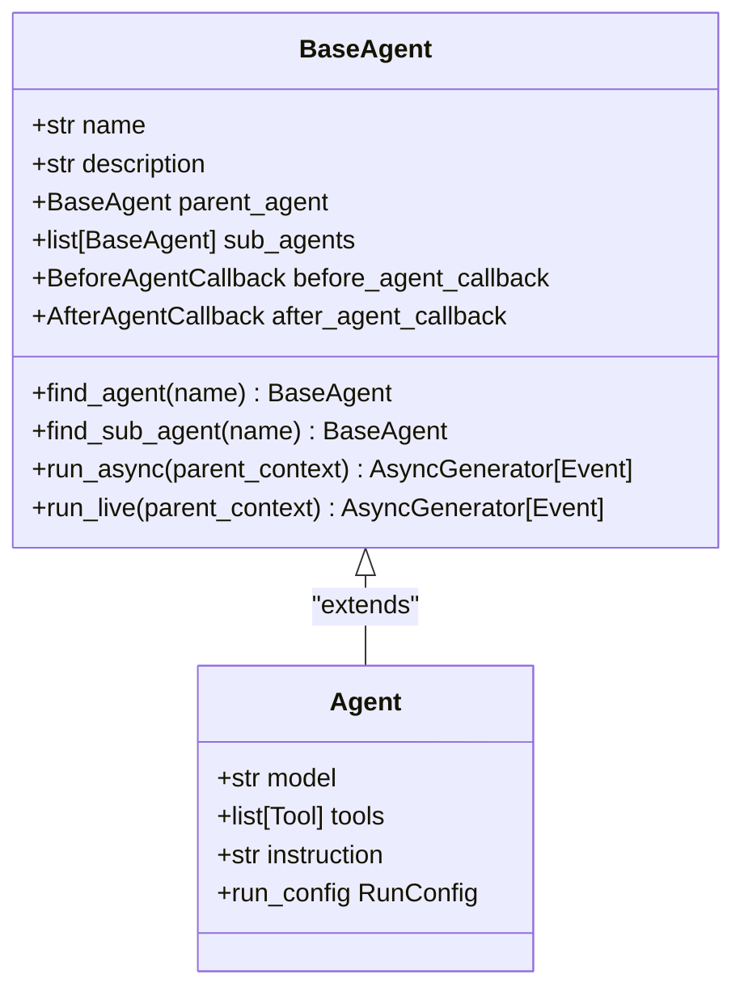
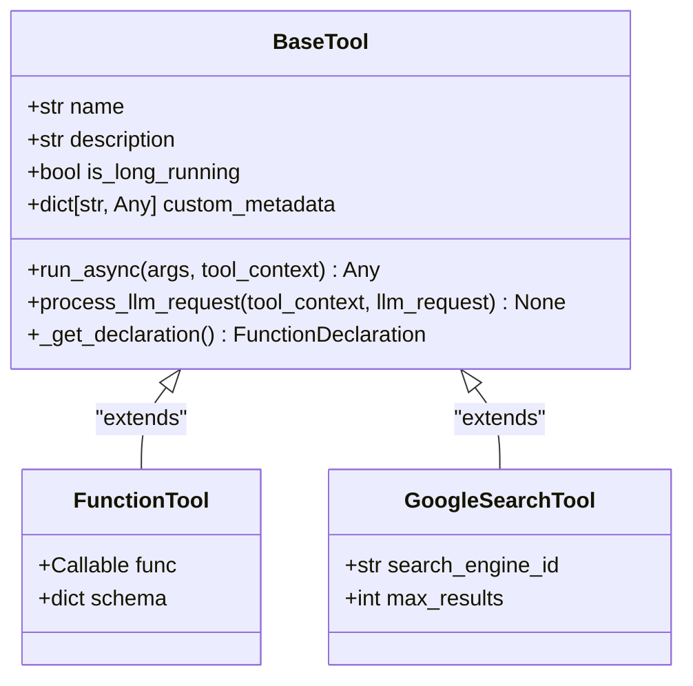
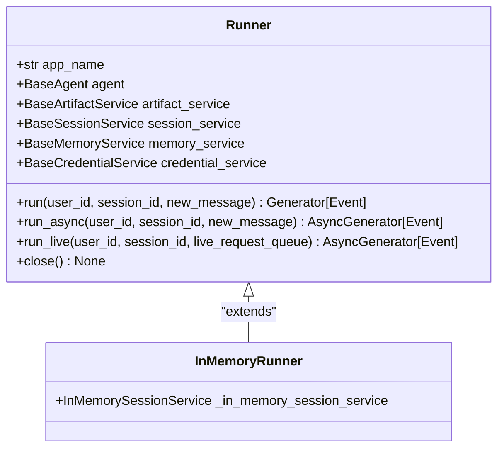

# Getting Started

<cite>
**Referenced Files in This Document**   
- [README.md](file://README.md)
- [INSTALL.md](file://INSTALL.md)
- [pyproject.toml](file://pyproject.toml)
- [src/google/adk/__init__.py](file://src/google/adk/__init__.py)
- [src/google/adk/cli/cli.py](file://src/google/adk/cli/cli.py)
- [src/google/adk/runners.py](file://src/google/adk/runners.py)
- [contributing/samples/hello_world/agent.py](file://contributing/samples/hello_world/agent.py)
- [contributing/samples/hello_world/main.py](file://contributing/samples/hello_world/main.py)
- [contributing/samples/core_basic_config/root_agent.yaml](file://contributing/samples/core_basic_config/root_agent.yaml)
- [src/google/adk/agents/base_agent.py](file://src/google/adk/agents/base_agent.py)
- [src/google/adk/tools/base_tool.py](file://src/google/adk/tools/base_tool.py)
- [src/google/adk/cli/adk_web_server.py](file://src/google/adk/cli/adk_web_server.py)
</cite>

## Table of Contents
1. [Introduction](#introduction)
2. [Installation](#installation)
3. [Project Initialization](#project-initialization)
4. [Creating Your First Agent](#creating-your-first-agent)
5. [Agent Configuration Methods](#agent-configuration-methods)
6. [Running Agents](#running-agents)
7. [Core Components](#core-components)
8. [Troubleshooting](#troubleshooting)
9. [Next Steps](#next-steps)

## Introduction

The Agent Development Kit (ADK) Python framework is a code-first toolkit designed for building, evaluating, and deploying sophisticated AI agents with flexibility and control. ADK enables developers to create AI-powered applications through a modular architecture that supports both code-based and configuration-driven agent development. The framework is optimized for Gemini and the Google ecosystem while remaining model-agnostic and deployment-agnostic, allowing integration with various LLM providers through LiteLLM.

ADK treats agent development as software development, making it easier to create, deploy, and orchestrate agentic architectures ranging from simple tasks to complex workflows. The framework supports rich tool ecosystems, modular multi-agent systems, and seamless deployment options including Cloud Run and Vertex AI Agent Engine.

This Getting Started guide will walk you through setting up the ADK environment, creating your first agent, and understanding the core components that make up the framework.

**Section sources**
- [README.md](file://README.md#L1-L158)

## Installation

ADK can be installed using pip, the Python package manager. The framework requires Python 3.9 or higher and provides both stable and development versions.

### Stable Release (Recommended)

For most users, the stable release from PyPI is recommended as it represents the most recent official release:

```bash
pip install google-adk
```

The stable version follows a weekly release cadence and is suitable for production use and general development.

### Development Version

For access to the latest features and bug fixes that haven't been included in an official release, you can install directly from the main branch on GitHub:

```bash
pip install git+https://github.com/google/adk-python.git@main
```

Note that the development version contains experimental changes and may include bugs not present in the stable release. Use it primarily for testing upcoming changes or accessing critical fixes.

### Alternative Installation with uv

For faster and more reliable dependency management, you can use `uv`, a modern Python package installer:

```bash
# Clone the repository
git clone https://github.com/google/adk-python.git
cd adk-python

# Create virtual environment
uv venv

# Activate virtual environment
source .venv/bin/activate  # On Windows: .venv\Scripts\activate

# Install in editable mode
uv pip install -e .
```

This installation method installs ADK in editable mode along with all required dependencies including Google GenAI SDK, LiteLLM for multi-provider LLM support, and FastAPI for web services.

**Section sources**
- [README.md](file://README.md#L57-L78)
- [INSTALL.md](file://INSTALL.md#L1-L110)

## Project Initialization

After installing ADK, you can initialize your agent development environment. The framework provides a comprehensive set of tools and services to manage agent execution, state, and artifacts.

When installing via the repository method, the setup creates a virtual environment and installs ADK with all its dependencies. The installation includes essential components such as:

- Google GenAI SDK for Gemini integration
- LiteLLM for multi-provider LLM support
- FastAPI for web services and development UI
- Various Google Cloud client libraries for database and storage services
- Testing and development tools

The `pyproject.toml` file defines all dependencies and optional feature groups, allowing for flexible installation based on your specific needs. For development with additional tools, you can install with optional dependencies:

```bash
uv pip install -e ".[dev,test]"
```

This installs development tools like flit, mypy, pylint, and testing frameworks that support code quality and comprehensive testing.

**Section sources**
- [pyproject.toml](file://pyproject.toml#L1-L202)
- [INSTALL.md](file://INSTALL.md#L35-L46)

## Creating Your First Agent

Let's create a basic "Hello World" agent to demonstrate the core concepts of ADK. This agent will be able to roll dice and check prime numbers, showcasing both tool usage and agent capabilities.

### Code-Based Configuration

Create a new Python file called `hello_world_agent.py` and add the following code:

```python
from google.adk import Agent
import random

def roll_die(sides: int) -> int:
    """Roll a die and return the result."""
    return random.randint(1, sides)

def check_prime(nums: list[int]) -> str:
    """Check if numbers in a list are prime."""
    primes = [num for num in nums if num > 1 and all(num % i != 0 for i in range(2, int(num**0.5) + 1))]
    return f"{', '.join(map(str, primes))} are prime numbers." if primes else "No prime numbers found."

root_agent = Agent(
    model='gemini-2.0-flash',
    name='hello_world_agent',
    description='Agent that can roll dice and check prime numbers',
    instruction="""
    You are an assistant that can roll dice and answer questions about prime numbers.
    When asked to roll a die, call the roll_die tool with the number of sides.
    When checking prime numbers, call the check_prime tool with a list of integers.
    """,
    tools=[roll_die, check_prime]
)
```

This code defines an agent with two custom tools: `roll_die` for simulating dice rolls and `check_prime` for identifying prime numbers in a list. The agent is configured with a model, name, description, instructions, and the tools it can use.

**Section sources**
- [contributing/samples/hello_world/agent.py](file://contributing/samples/hello_world/agent.py#L15-L109)

## Agent Configuration Methods

ADK supports multiple approaches to agent configuration, allowing you to choose the method that best fits your development workflow.

### YAML Configuration

In addition to code-based configuration, ADK supports YAML-based agent definition. This approach is useful for non-programmers or when you want to separate agent configuration from code.

Create a file called `root_agent.yaml` with the following content:

```yaml
# yaml-language-server: $schema=https://raw.githubusercontent.com/google/adk-python/refs/heads/main/src/google/adk/agents/config_schemas/AgentConfig.json
name: assistant_agent
model: gemini-2.5-flash
description: A helper agent that can answer users' questions.
instruction: |
  You are an agent to help answer users' various questions.

  1. If the user's intention is not clear, ask clarifying questions to better understand their needs.
  2. Once the intention is clear, provide accurate and helpful answers to the user's questions.
```

This YAML configuration defines a simple assistant agent with a name, model specification, description, and instruction set. The schema reference at the top enables IDE support with auto-completion and validation.

The YAML configuration approach allows for easy modification of agent parameters without changing code, making it ideal for experimentation and configuration management.

**Section sources**
- [contributing/samples/core_basic_config/root_agent.yaml](file://contributing/samples/core_basic_config/root_agent.yaml#L1-L10)

## Running Agents

ADK provides multiple ways to execute agents, including command-line interface (CLI) commands and a web-based development UI.

### Using the ADK CLI

Once you have defined your agent, you can run it using the ADK CLI command `adk run`. First, organize your agent code in a directory structure:

```
my_agent/
├── agent.py
└── __init__.py
```

Then execute the agent:

```bash
adk run ./my_agent
```

This command launches an interactive CLI where you can converse with your agent. The CLI provides a simple interface for testing agent behavior and debugging issues.

For agents defined in YAML, you can run them directly from their configuration directory:

```bash
adk run ./contributing/samples/core_basic_config
```

### Web-Based Development UI

ADK includes a built-in development UI that provides a more sophisticated interface for testing and debugging agents. The UI offers features such as:

- Message history visualization
- Tool call inspection
- State management
- Session persistence
- Evaluation metrics

To launch the web UI, ensure your agent directory contains the necessary components and run:

```bash
adk run --web ./my_agent
```

The development UI connects to a FastAPI server that serves the web assets and provides API endpoints for agent interaction. This interface is particularly useful for demonstrating agent capabilities and conducting thorough testing.

**Section sources**
- [src/google/adk/cli/cli.py](file://src/google/adk/cli/cli.py#L1-L218)
- [src/google/adk/cli/adk_web_server.py](file://src/google/adk/cli/adk_web_server.py#L1-L800)

## Core Components

Understanding the core components of ADK is essential for effective agent development. The framework is built around three primary concepts: agents, tools, and runners.

### Agents

Agents are the central entities in ADK, responsible for processing user input and generating responses. The base agent class provides the foundation for all agent types:



**Diagram sources**
- [src/google/adk/agents/base_agent.py](file://src/google/adk/agents/base_agent.py#L71-L612)
- [src/google/adk/__init__.py](file://src/google/adk/__init__.py#L16-L20)

### Tools

Tools extend agent capabilities by providing access to external functions and services. Each tool is defined with a name, description, and implementation:



**Diagram sources**
- [src/google/adk/tools/base_tool.py](file://src/google/adk/tools/base_tool.py#L47-L213)

### Runners

Runners manage the execution of agents within sessions, handling message processing, event generation, and interaction with services:



**Diagram sources**
- [src/google/adk/runners.py](file://src/google/adk/runners.py#L59-L680)

## Troubleshooting

When setting up and running ADK, you may encounter common issues. Here are solutions to the most frequent problems:

### Environment Variable Configuration

Many ADK features require proper environment variable setup. Common variables include:

- `GITHUB_TOKEN`: For GitHub integration
- `IFLOW_API_KEY`: For iFlow LLM integration
- Google Cloud authentication credentials

Add these to your shell configuration file:

```bash
export GITHUB_TOKEN=your_github_token_here
export IFLOW_API_KEY=your_iflow_api_key_here
```

Then reload your shell configuration with `source ~/.bashrc`.

### Authentication Setup

For Google Cloud services, ensure proper authentication:

```bash
gcloud auth application-default login
```

This command sets up Application Default Credentials for Google Cloud APIs.

### Dependency Resolution Issues

If you encounter dependency conflicts, try using `uv` for cleaner dependency resolution:

```bash
uv pip install -e .
```

For development dependencies:

```bash
uv pip install -e ".[dev,test]"
```

### Platform-Specific Considerations

On Windows, ensure you use the correct path separators and activation commands:

```bash
# Windows activation
.venv\Scripts\activate

# Windows pip install
python -m pip install google-adk
```

Common installation issues include permission errors, Python version mismatches, and missing build tools. Ensure you have Python 3.9 or higher and appropriate permissions for the installation directory.

**Section sources**
- [setup_env.sh](file://setup_env.sh#L190-L195)
- [INSTALL.md](file://INSTALL.md#L86-L98)

## Next Steps

After completing this Getting Started guide, you're ready to explore more advanced ADK features:

1. **Explore Samples**: Examine the comprehensive samples in the `contributing/samples/` directory to understand various agent patterns and configurations.

2. **Create Custom Agents**: Develop agents for specific use cases such as customer support, data analysis, or workflow automation.

3. **Integrate with Services**: Connect your agents to various LLM providers via LiteLLM or integrate with Google Cloud services.

4. **Implement Multi-Agent Systems**: Design complex applications by composing multiple specialized agents into flexible hierarchies.

5. **Deploy to Production**: Containerize your agents for deployment on Cloud Run or scale with Vertex AI Agent Engine.

6. **Evaluate Agent Performance**: Use the built-in evaluation framework to test and improve your agent's capabilities.

The ADK framework provides extensive documentation and examples to support your agent development journey. Visit the official documentation for detailed guides on building, evaluating, and deploying agents.