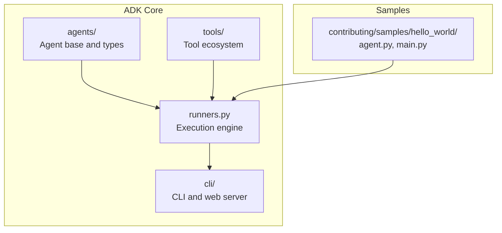
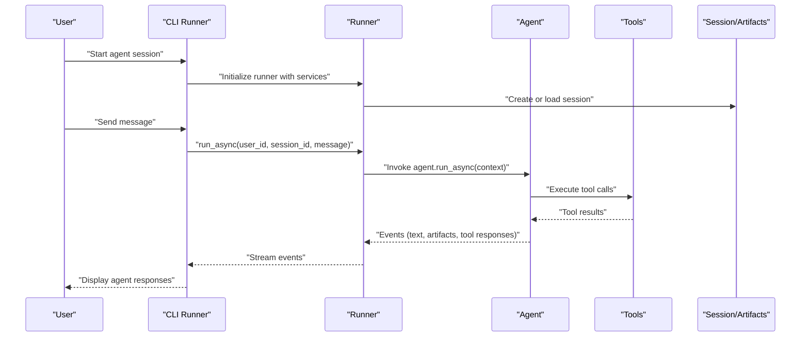
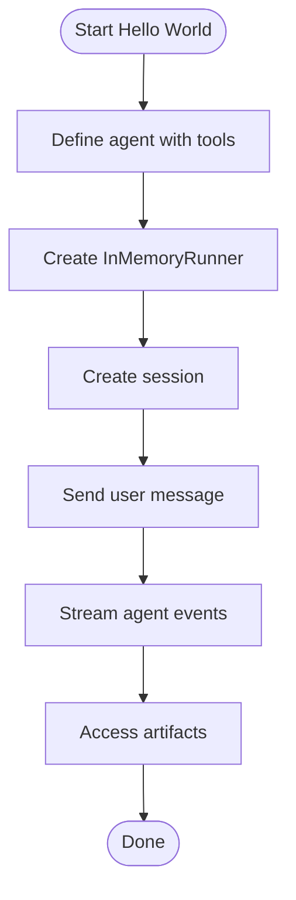
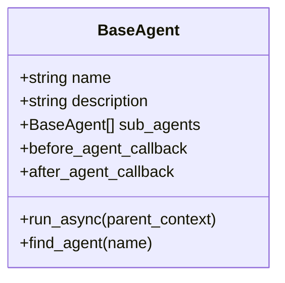
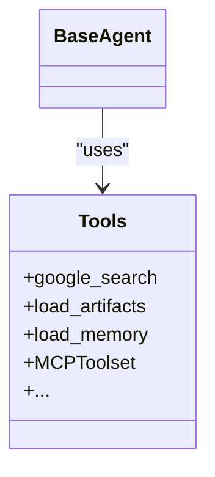
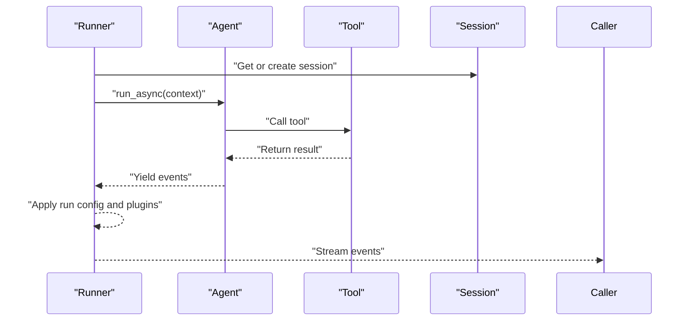
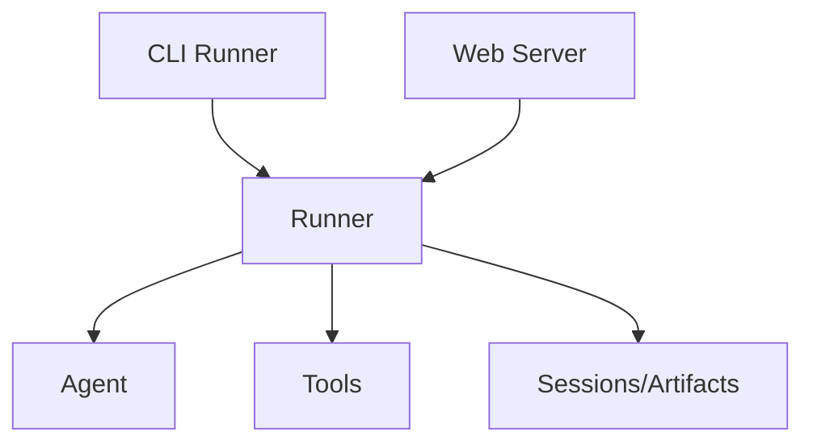
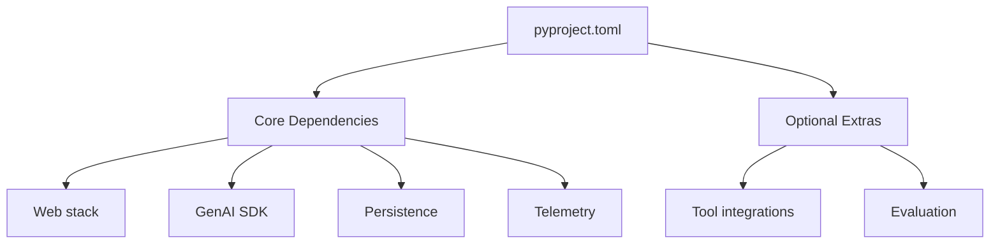

# Getting Started

<cite>
**Referenced Files in This Document**
- [README.md](file://README.md)
- [CONTRIBUTING.md](file://CONTRIBUTING.md)
- [pyproject.toml](file://pyproject.toml)
- [hello_world/agent.py](file://contributing/samples/hello_world/agent.py)
- [hello_world/main.py](file://contributing/samples/hello_world/main.py)
- [src/google/adk/__init__.py](file://src/google/adk/__init__.py)
- [src/google/adk/runners.py](file://src/google/adk/runners.py)
- [src/google/adk/agents/base_agent.py](file://src/google/adk/agents/base_agent.py)
- [src/google/adk/tools/__init__.py](file://src/google/adk/tools/__init__.py)
- [src/google/adk/cli/cli.py](file://src/google/adk/cli/cli.py)
- [src/google/adk/cli/utils/agent_loader.py](file://src/google/adk/cli/utils/agent_loader.py)
- [src/google/adk/cli/adk_web_server.py](file://src/google/adk/cli/adk_web_server.py)
</cite>

## Table of Contents
1. [Introduction](#introduction)
2. [Project Structure](#project-structure)
3. [Core Components](#core-components)
4. [Architecture Overview](#architecture-overview)
5. [Detailed Component Analysis](#detailed-component-analysis)
6. [Dependency Analysis](#dependency-analysis)
7. [Performance Considerations](#performance-considerations)
8. [Troubleshooting Guide](#troubleshooting-guide)
9. [Conclusion](#conclusion)
10. [Appendices](#appendices)

## Introduction
This guide helps you install and run your first AI agent using the Agent Development Kit (ADK) Python framework. You will learn how to:
- Install ADK (stable and development versions)
- Prepare prerequisites and environment
- Create and run a simple “hello world” agent
- Understand the basic agent structure, tool integration, and execution workflow
- Use the development UI and basic debugging techniques
- Troubleshoot common setup issues

ADK lets you define agents and tools in Python, orchestrate them locally, and scale them to production environments.

## Project Structure
ADK is organized around a core package with agents, tools, runners, CLI, and a development web server. The repository includes:
- Core SDK under src/google/adk
- CLI commands and utilities
- Tools ecosystem (search, MCP, memory, artifacts, etc.)
- Sample agents under contributing/samples

**Diagram sources**
- [src/google/adk/agents/base_agent.py](file://src/google/adk/agents/base_agent.py#L86-L137)
- [src/google/adk/tools/__init__.py](file://src/google/adk/tools/__init__.py#L49-L89)
- [src/google/adk/runners.py](file://src/google/adk/runners.py#L112-L149)
- [src/google/adk/cli/cli.py](file://src/google/adk/cli/cli.py#L136-L284)
- [contributing/samples/hello_world/agent.py](file://contributing/samples/hello_world/agent.py#L67-L109)
- [contributing/samples/hello_world/main.py](file://contributing/samples/hello_world/main.py#L30-L104)

**Section sources**
- [README.md](file://README.md#L62-L84)
- [pyproject.toml](file://pyproject.toml#L1-L228)

## Core Components
- Agent: The core entity that reasons and acts. ADK provides a base agent class and specialized variants (e.g., LLM-based agents).
- Tools: Functions or integrations (e.g., search, MCP) that the agent can call to extend capabilities.
- Runner: Executes agents within a session, manages events, artifacts, and memory.
- CLI and Web Server: Provides interactive CLI and a development UI for testing and debugging.

Key entry points:
- Agent and Runner exports are available from the package’s public API.
- The CLI entry point is registered via the project’s scripts configuration.

**Section sources**
- [src/google/adk/__init__.py](file://src/google/adk/__init__.py#L18-L23)
- [pyproject.toml](file://pyproject.toml#L83-L84)

## Architecture Overview
The execution pipeline connects user input to agent reasoning and tool use, then streams events back to the caller.

**Diagram sources**
- [src/google/adk/runners.py](file://src/google/adk/runners.py#L493-L622)
- [src/google/adk/agents/base_agent.py](file://src/google/adk/agents/base_agent.py#L274-L305)
- [src/google/adk/tools/__init__.py](file://src/google/adk/tools/__init__.py#L49-L89)

## Detailed Component Analysis

### Installation and Environment Setup
- Stable installation: Use pip to install the latest PyPI release.
- Development installation: Install directly from the main branch for the latest changes.
- Prerequisites:
  - Python 3.10+ (3.11+ recommended)
  - Virtual environment recommended
  - Optional extras for extended tooling and evaluation (see optional dependencies)

Step-by-step:
1. Create and activate a virtual environment.
2. Install ADK using pip (stable or development).
3. Verify installation by importing the package and running the CLI.

Notes:
- Development installs may include experimental features and changes not yet in the stable release.
- Optional extras enable additional tool integrations and evaluation features.

**Section sources**
- [README.md](file://README.md#L62-L84)
- [CONTRIBUTING.md](file://CONTRIBUTING.md#L146-L175)
- [pyproject.toml](file://pyproject.toml#L8-L25)

### Creating Your First Agent (Hello World)
This tutorial walks you through the hello_world sample:
- Define a simple agent with a name, model, description, instructions, and tools.
- Run the agent locally using an in-memory runner and a session.
- Observe events and artifacts produced during execution.

Steps:
1. Explore the agent definition and tool functions.
2. Run the sample main script to create a session and send messages.
3. Inspect streamed events and artifacts.

**Diagram sources**
- [contributing/samples/hello_world/agent.py](file://contributing/samples/hello_world/agent.py#L67-L109)
- [contributing/samples/hello_world/main.py](file://contributing/samples/hello_world/main.py#L30-L104)
- [src/google/adk/runners.py](file://src/google/adk/runners.py#L493-L622)

**Section sources**
- [contributing/samples/hello_world/agent.py](file://contributing/samples/hello_world/agent.py#L22-L109)
- [contributing/samples/hello_world/main.py](file://contributing/samples/hello_world/main.py#L30-L104)

### Basic Agent Structure
- Agent identity and behavior:
  - name: Unique identifier for the agent.
  - description: Short description used by the model to decide delegation.
  - instruction: Guidance for the agent’s behavior and reasoning.
- Sub-agents: Compose hierarchical multi-agent systems.
- Callback hooks: Optional before/after callbacks for pre/post-run logic.

**Diagram sources**
- [src/google/adk/agents/base_agent.py](file://src/google/adk/agents/base_agent.py#L86-L137)

**Section sources**
- [src/google/adk/agents/base_agent.py](file://src/google/adk/agents/base_agent.py#L86-L137)

### Tool Integration
- Tools are functions or integrations that the agent can call.
- Tools are lazily loaded to reduce startup overhead.
- Examples include search, MCP, memory/artifact loaders, and more.

**Diagram sources**
- [src/google/adk/tools/__init__.py](file://src/google/adk/tools/__init__.py#L49-L89)
- [src/google/adk/agents/base_agent.py](file://src/google/adk/agents/base_agent.py#L136-L137)

**Section sources**
- [src/google/adk/tools/__init__.py](file://src/google/adk/tools/__init__.py#L49-L89)

### Execution Workflow
- Runner manages:
  - Session lifecycle (create/load)
  - Invocation context (per-run state)
  - Event streaming (text, artifacts, tool responses)
  - Plugins and telemetry integration
- The agent runs asynchronously and yields events as it thinks, calls tools, and responds.

**Diagram sources**
- [src/google/adk/runners.py](file://src/google/adk/runners.py#L493-L622)
- [src/google/adk/agents/base_agent.py](file://src/google/adk/agents/base_agent.py#L274-L305)

**Section sources**
- [src/google/adk/runners.py](file://src/google/adk/runners.py#L493-L622)

### Development UI and Debugging
- CLI interactive mode:
  - Launch an agent interactively and stream events to the terminal.
  - Supports input files and saved sessions.
- Web server:
  - Exposes endpoints for session management, artifact listing, and evaluation.
  - Serves a development UI when configured with web assets.
- Telemetry:
  - OpenTelemetry integration for tracing and observability.

**Diagram sources**
- [src/google/adk/cli/cli.py](file://src/google/adk/cli/cli.py#L136-L284)
- [src/google/adk/cli/adk_web_server.py](file://src/google/adk/cli/adk_web_server.py#L681-L795)
- [src/google/adk/runners.py](file://src/google/adk/runners.py#L112-L149)

**Section sources**
- [src/google/adk/cli/cli.py](file://src/google/adk/cli/cli.py#L136-L284)
- [src/google/adk/cli/adk_web_server.py](file://src/google/adk/cli/adk_web_server.py#L681-L795)

## Dependency Analysis
ADK declares core and optional dependencies. Core dependencies include:
- FastAPI, Uvicorn, Starlette for the web server
- Google GenAI SDK for model interactions
- SQLAlchemy and related packages for persistence
- OpenTelemetry for telemetry
- Graphviz for graph rendering
- Watchdog for file watching

Optional extras enable:
- Additional tool integrations (e.g., MCP, LangGraph, Docker, Kubernetes)
- Evaluation and documentation toolchains

**Diagram sources**
- [pyproject.toml](file://pyproject.toml#L26-L74)
- [pyproject.toml](file://pyproject.toml#L154-L172)

**Section sources**
- [pyproject.toml](file://pyproject.toml#L26-L74)
- [pyproject.toml](file://pyproject.toml#L154-L172)

## Performance Considerations
- Use asynchronous runners for concurrent invocations and streaming.
- Prefer lazy tool loading to minimize startup costs.
- Limit heavy artifacts in sessions; leverage artifact services for large payloads.
- Enable telemetry selectively to avoid overhead in local development.

[No sources needed since this section provides general guidance]

## Troubleshooting Guide
Common setup issues and resolutions:
- Python version mismatch:
  - Ensure Python 3.10+ is installed. 3.11+ is recommended.
- Virtual environment not activated:
  - Create and activate a virtual environment before installing dependencies.
- Missing optional extras:
  - Some tools require optional extras. Install them via extras in the project configuration.
- Module import errors:
  - Confirm the agent directory structure and that root_agent is defined.
- Session not found:
  - Ensure the session identifiers match and the runner is configured with the correct app name.
- CLI/web server port conflicts:
  - Adjust the port or stop conflicting services.

**Section sources**
- [CONTRIBUTING.md](file://CONTRIBUTING.md#L146-L175)
- [src/google/adk/cli/utils/agent_loader.py](file://src/google/adk/cli/utils/agent_loader.py#L272-L283)
- [src/google/adk/runners.py](file://src/google/adk/runners.py#L384-L394)

## Conclusion
You now have the essentials to install ADK, run your first agent, and explore the development UI. Continue by experimenting with tools, multi-agent composition, and optional integrations. Refer to the repository’s samples and documentation for advanced patterns.

[No sources needed since this section summarizes without analyzing specific files]

## Appendices

### Quick Commands
- Install stable: pip install google-adk
- Install development: pip install git+https://github.com/google/adk-python.git@main
- Run hello world: python contributing/samples/hello_world/main.py
- Launch CLI: adk web <agents_dir> (when web assets are configured)

**Section sources**
- [README.md](file://README.md#L62-L84)
- [contributing/samples/hello_world/main.py](file://contributing/samples/hello_world/main.py#L102-L104)