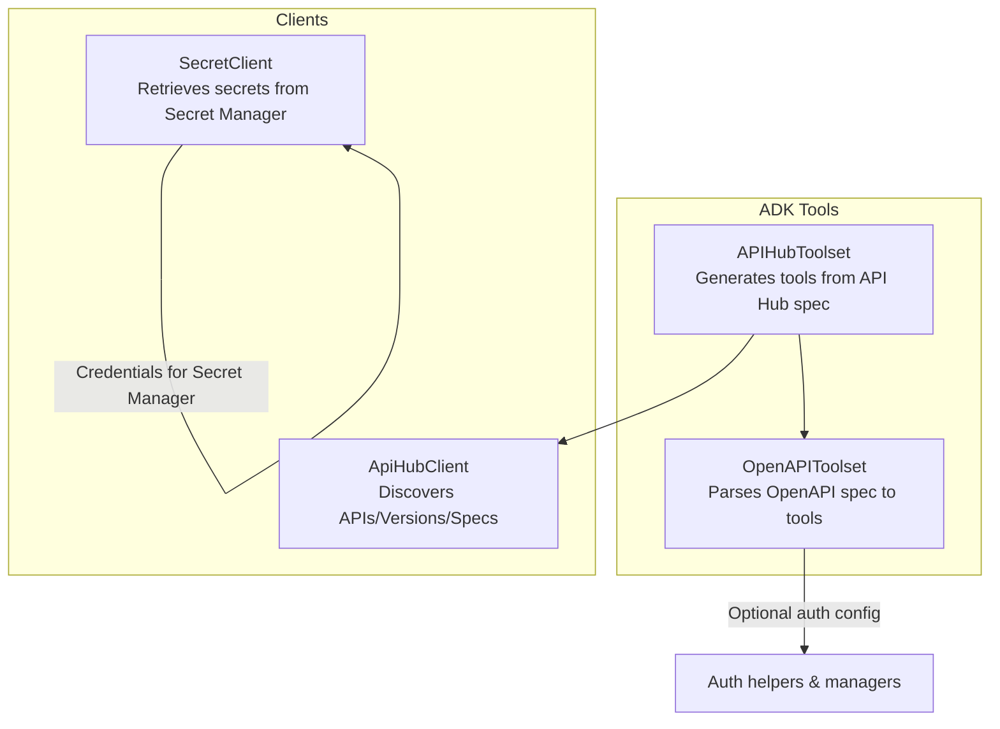
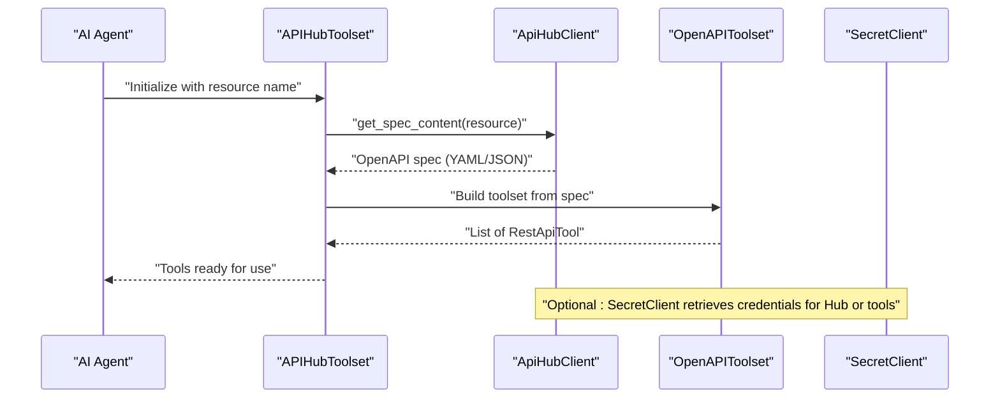
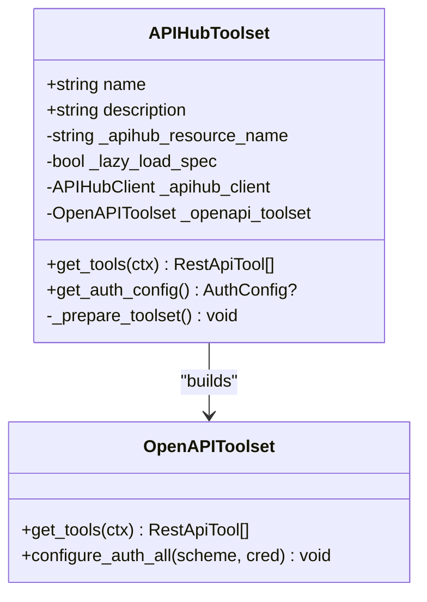
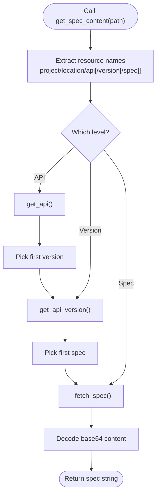
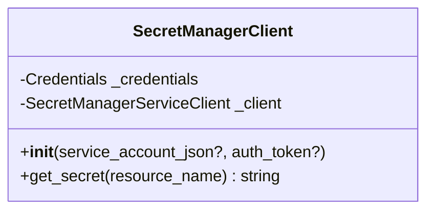
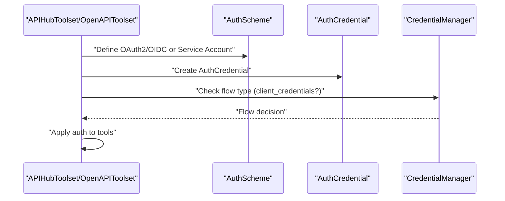
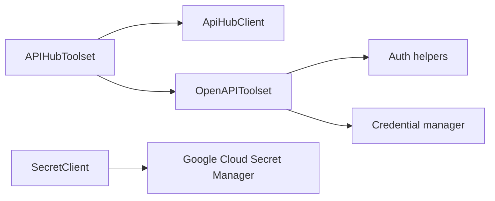

# API Hub Integration

<cite>
**Referenced Files in This Document**
- [apihub_toolset.py](file://src/google/adk/tools/apihub_tool/apihub_toolset.py)
- [apihub_client.py](file://src/google/adk/tools/apihub_tool/clients/apihub_client.py)
- [secret_client.py](file://src/google/adk/tools/apihub_tool/clients/secret_client.py)
- [apihub_tool/__init__.py](file://src/google/adk/tools/apihub_tool/__init__.py)
- [openapi_toolset.py](file://src/google/adk/tools/openapi_tool/openapi_spec_parser/openapi_toolset.py)
- [auth_helpers.py](file://src/google/adk/tools/openapi_tool/auth/auth_helpers.py)
- [oauth2_credential_util.py](file://src/google/adk/auth/oauth2_credential_util.py)
- [credential_manager.py](file://src/google/adk/auth/credential_manager.py)
- [test_apihub_toolset.py](file://tests/unittests/tools/apihub_tool/test_apihub_toolset.py)
- [test_apihub_client.py](file://tests/unittests/tools/apihub_tool/clients/test_apihub_client.py)
- [test_secret_client.py](file://tests/unittests/tools/apihub_tool/clients/test_secret_client.py)
</cite>

## Table of Contents
1. [Introduction](#introduction)
2. [Project Structure](#project-structure)
3. [Core Components](#core-components)
4. [Architecture Overview](#architecture-overview)
5. [Detailed Component Analysis](#detailed-component-analysis)
6. [Dependency Analysis](#dependency-analysis)
7. [Performance Considerations](#performance-considerations)
8. [Troubleshooting Guide](#troubleshooting-guide)
9. [Conclusion](#conclusion)

## Introduction
This document explains how API Hub integration in ADK enables managed API access and governance for AI agents. It covers:
- How APIHubToolset generates agent tools from curated APIs discovered via API Hub.
- How ApiHubClient handles API discovery, subscription management, and request routing.
- How SecretClient manages secure credentials and token refresh.
- Authentication flows including OAuth2 and service accounts.
- Practical examples, rate limiting, error handling, retry policies, selection criteria, performance optimization, and troubleshooting.

## Project Structure
The API Hub integration lives under the tools package and composes OpenAPI tool generation:
- APIHubToolset orchestrates fetching an API spec from API Hub and building tools from it.
- ApiHubClient interacts with the API Hub service to discover APIs, versions, and specs.
- SecretClient retrieves secrets from Google Cloud Secret Manager with flexible authentication modes.
- OpenAPIToolset parses the spec and produces RestApiTool instances with optional authentication configuration.

**Diagram sources**
- [apihub_toolset.py](file://src/google/adk/tools/apihub_tool/apihub_toolset.py#L36-L212)
- [apihub_client.py](file://src/google/adk/tools/apihub_tool/clients/apihub_client.py#L45-L345)
- [secret_client.py](file://src/google/adk/tools/apihub_tool/clients/secret_client.py#L27-L121)
- [openapi_toolset.py](file://src/google/adk/tools/openapi_tool/openapi_spec_parser/openapi_toolset.py#L44-L200)

**Section sources**
- [apihub_toolset.py](file://src/google/adk/tools/apihub_tool/apihub_toolset.py#L36-L212)
- [apihub_client.py](file://src/google/adk/tools/apihub_tool/clients/apihub_client.py#L45-L345)
- [secret_client.py](file://src/google/adk/tools/apihub_tool/clients/secret_client.py#L27-L121)
- [openapi_toolset.py](file://src/google/adk/tools/openapi_tool/openapi_spec_parser/openapi_toolset.py#L44-L200)

## Core Components
- APIHubToolset: Builds tools from an API Hub resource name. It can fetch the spec immediately or lazily, supports filtering, and integrates with authentication configuration.
- ApiHubClient: Discovers APIs, versions, and specs; resolves resource names from UI URLs or resource paths; obtains access tokens via ADC, service account JSON, or provided access token.
- SecretClient: Retrieves secrets from Google Cloud Secret Manager using service account JSON, existing auth token, or default credentials.

Key capabilities:
- Managed API access: Discover and subscribe to curated APIs in API Hub.
- Governance: Tool generation from standardized OpenAPI specs; optional auth enforcement.
- Secure credentials: Token refresh and secret retrieval with robust error handling.

**Section sources**
- [apihub_toolset.py](file://src/google/adk/tools/apihub_tool/apihub_toolset.py#L36-L212)
- [apihub_client.py](file://src/google/adk/tools/apihub_tool/clients/apihub_client.py#L45-L345)
- [secret_client.py](file://src/google/adk/tools/apihub_tool/clients/secret_client.py#L27-L121)

## Architecture Overview
The integration follows a layered approach:
- APIHubToolset depends on ApiHubClient to fetch a spec and delegates tool generation to OpenAPIToolset.
- OpenAPIToolset optionally applies authentication configuration (OAuth2, OIDC, or service account) to each tool.
- SecretClient provides secret retrieval for credentials and tokens.

**Diagram sources**
- [apihub_toolset.py](file://src/google/adk/tools/apihub_tool/apihub_toolset.py#L162-L212)
- [apihub_client.py](file://src/google/adk/tools/apihub_tool/clients/apihub_client.py#L74-L120)
- [openapi_toolset.py](file://src/google/adk/tools/openapi_tool/openapi_spec_parser/openapi_toolset.py#L193-L200)
- [secret_client.py](file://src/google/adk/tools/apihub_tool/clients/secret_client.py#L98-L121)

## Detailed Component Analysis

### APIHubToolset
Responsibilities:
- Accepts an API Hub resource name (supports API, version, or spec level).
- Lazily or eagerly loads the spec via ApiHubClient.
- Generates tools using OpenAPIToolset and applies optional auth configuration.
- Exposes get_tools() and get_auth_config() for runtime integration.

**Diagram sources**
- [apihub_toolset.py](file://src/google/adk/tools/apihub_tool/apihub_toolset.py#L36-L212)
- [openapi_toolset.py](file://src/google/adk/tools/openapi_tool/openapi_spec_parser/openapi_toolset.py#L44-L200)

Practical usage patterns:
- Immediate spec loading vs. lazy loading.
- Filtering tools by predicate or explicit names.
- Applying global auth scheme and credential to all tools.

**Section sources**
- [apihub_toolset.py](file://src/google/adk/tools/apihub_tool/apihub_toolset.py#L60-L212)
- [test_apihub_toolset.py](file://tests/unittests/tools/apihub_tool/test_apihub_toolset.py#L99-L226)

### ApiHubClient
Responsibilities:
- Discover APIs, versions, and specs by resource name or UI URL.
- Resolve resource names from mixed input formats.
- Fetch spec contents and decode base64-encoded content.
- Manage access tokens via ADC, service account JSON, or provided access token.

**Diagram sources**
- [apihub_client.py](file://src/google/adk/tools/apihub_tool/clients/apihub_client.py#L74-L203)
- [apihub_client.py](file://src/google/adk/tools/apihub_tool/clients/apihub_client.py#L204-L306)

Authentication and token refresh:
- Supports service account JSON or default ADC.
- Caches credentials and refreshes when needed.
- Raises clear errors when no credentials are available.

**Section sources**
- [apihub_client.py](file://src/google/adk/tools/apihub_tool/clients/apihub_client.py#L48-L345)
- [test_apihub_client.py](file://tests/unittests/tools/apihub_tool/clients/test_apihub_client.py#L48-L525)

### SecretClient
Responsibilities:
- Retrieve secrets from Google Cloud Secret Manager.
- Authenticate using service account JSON, existing auth token, or default credentials.
- Propagate exceptions from Secret Manager API for caller handling.

**Diagram sources**
- [secret_client.py](file://src/google/adk/tools/apihub_tool/clients/secret_client.py#L27-L121)

**Section sources**
- [secret_client.py](file://src/google/adk/tools/apihub_tool/clients/secret_client.py#L40-L121)
- [test_secret_client.py](file://tests/unittests/tools/apihub_tool/clients/test_secret_client.py#L27-L196)

### Authentication Flows
- OAuth2 and OIDC: Constructed via auth helpers and applied to OpenAPIToolset; credential manager detects client credentials flow.
- Service accounts: Provided via service account JSON or default ADC; used for API Hub access and tool authentication.

**Diagram sources**
- [auth_helpers.py](file://src/google/adk/tools/openapi_tool/auth/auth_helpers.py#L157-L203)
- [oauth2_credential_util.py](file://src/google/adk/auth/oauth2_credential_util.py#L38-L70)
- [credential_manager.py](file://src/google/adk/auth/credential_manager.py#L367-L386)

**Section sources**
- [auth_helpers.py](file://src/google/adk/tools/openapi_tool/auth/auth_helpers.py#L157-L203)
- [oauth2_credential_util.py](file://src/google/adk/auth/oauth2_credential_util.py#L38-L70)
- [credential_manager.py](file://src/google/adk/auth/credential_manager.py#L367-L386)

## Dependency Analysis
- APIHubToolset depends on ApiHubClient for spec acquisition and OpenAPIToolset for tool generation.
- OpenAPIToolset optionally depends on auth helpers and credential manager for authentication configuration.
- SecretClient is orthogonal but commonly used to supply credentials for ApiHubClient or tools.

**Diagram sources**
- [apihub_toolset.py](file://src/google/adk/tools/apihub_tool/apihub_toolset.py#L33-L34)
- [openapi_toolset.py](file://src/google/adk/tools/openapi_tool/openapi_spec_parser/openapi_toolset.py#L32-L39)
- [auth_helpers.py](file://src/google/adk/tools/openapi_tool/auth/auth_helpers.py#L157-L203)
- [credential_manager.py](file://src/google/adk/auth/credential_manager.py#L367-L386)
- [secret_client.py](file://src/google/adk/tools/apihub_tool/clients/secret_client.py#L94-L96)

**Section sources**
- [apihub_toolset.py](file://src/google/adk/tools/apihub_tool/apihub_toolset.py#L33-L34)
- [openapi_toolset.py](file://src/google/adk/tools/openapi_tool/openapi_spec_parser/openapi_toolset.py#L32-L39)
- [auth_helpers.py](file://src/google/adk/tools/openapi_tool/auth/auth_helpers.py#L157-L203)
- [credential_manager.py](file://src/google/adk/auth/credential_manager.py#L367-L386)
- [secret_client.py](file://src/google/adk/tools/apihub_tool/clients/secret_client.py#L94-L96)

## Performance Considerations
- Lazy loading: Use lazy_load_spec to defer spec fetching until tools are needed, reducing startup overhead.
- Credential caching: ApiHubClient caches credentials and refreshes only when expired to minimize token refresh calls.
- Spec parsing: OpenAPIToolset parses once and reuses tools; avoid rebuilding toolsets frequently.
- Network efficiency: Prefer spec-level resource names when available to reduce intermediate API calls.

[No sources needed since this section provides general guidance]

## Troubleshooting Guide
Common issues and resolutions:
- Missing credentials for ApiHubClient:
  - Ensure either service_account_json or access_token is provided; ADC fallback requires proper environment setup.
- Invalid resource name or URL:
  - Confirm project, location, API, version, and spec segments; UI URLs are supported.
- Empty or missing versions/specs:
  - API Hub may not have versions or specs; handle ValueError and choose appropriate resource level.
- Invalid YAML in spec:
  - YAML parsing errors indicate malformed spec; validate the spec content.
- Secret retrieval failures:
  - Check Secret Manager permissions and resource name format; exceptions propagate for caller handling.

**Section sources**
- [test_apihub_client.py](file://tests/unittests/tools/apihub_tool/clients/test_apihub_client.py#L467-L521)
- [test_apihub_toolset.py](file://tests/unittests/tools/apihub_tool/test_apihub_toolset.py#L212-L226)
- [test_secret_client.py](file://tests/unittests/tools/apihub_tool/clients/test_secret_client.py#L175-L196)

## Conclusion
API Hub integration in ADK provides a secure, governed pathway for AI agents to consume curated APIs:
- APIHubToolset simplifies tool generation from API Hub specs.
- ApiHubClient offers robust discovery and authentication.
- SecretClient secures credential management with flexible auth modes.
Adopt lazy loading, credential caching, and structured error handling to achieve reliable, high-performance agent workflows.