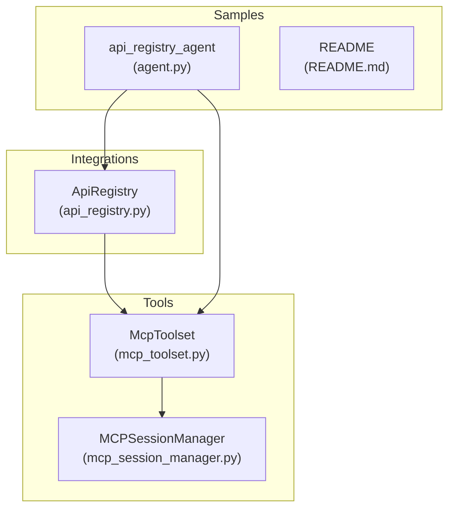
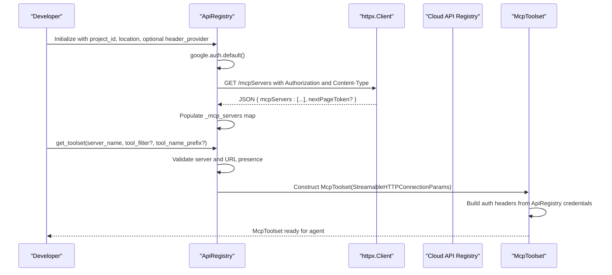
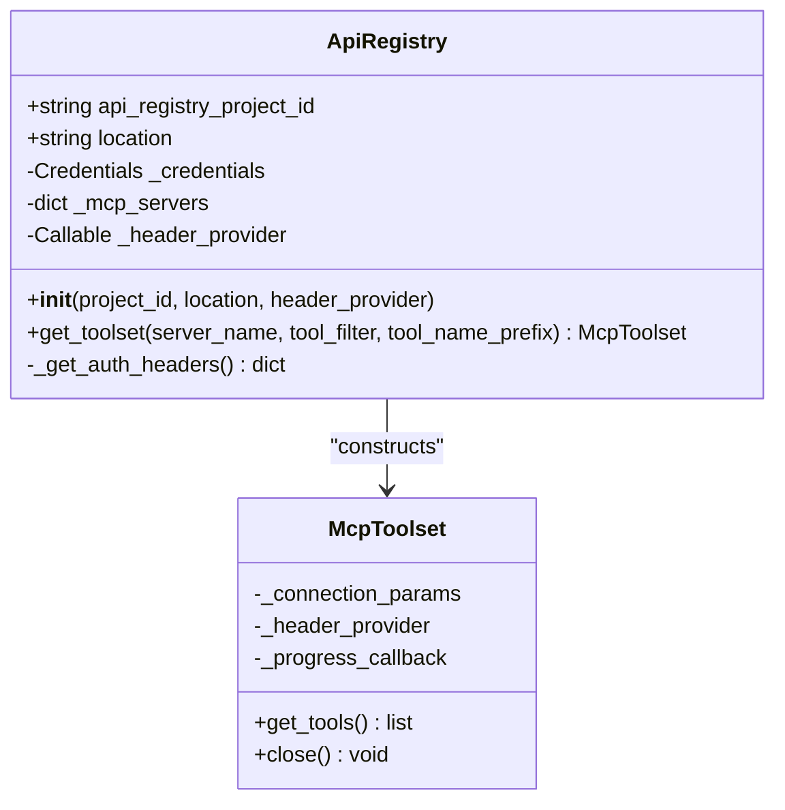
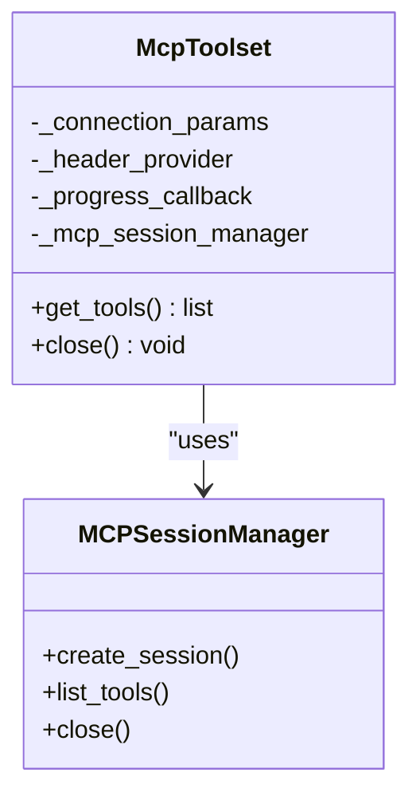
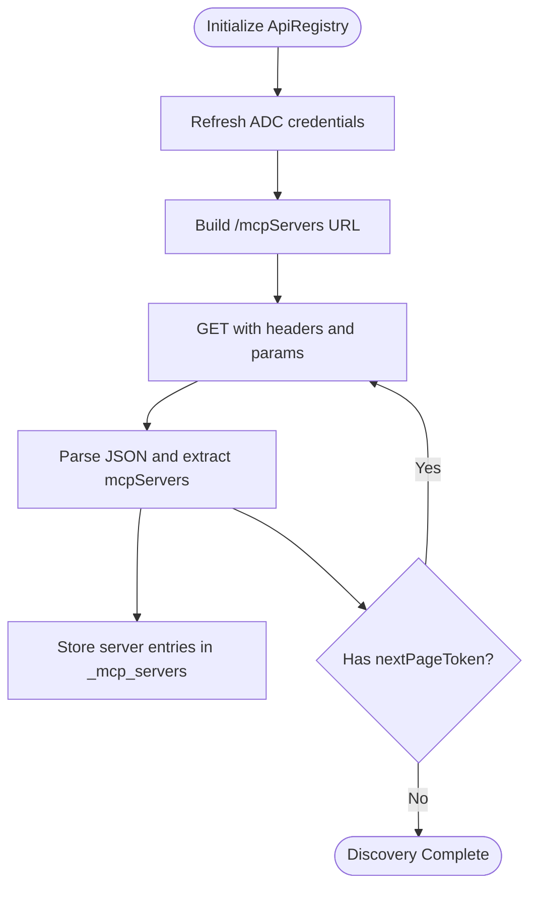
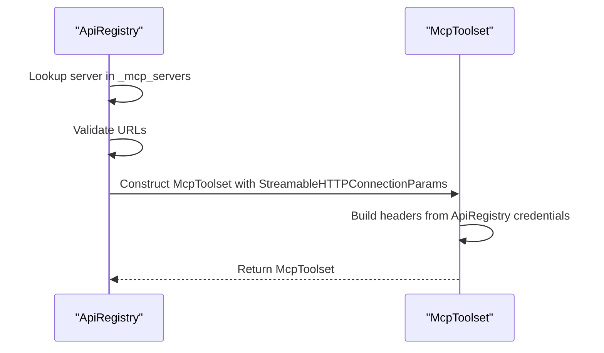
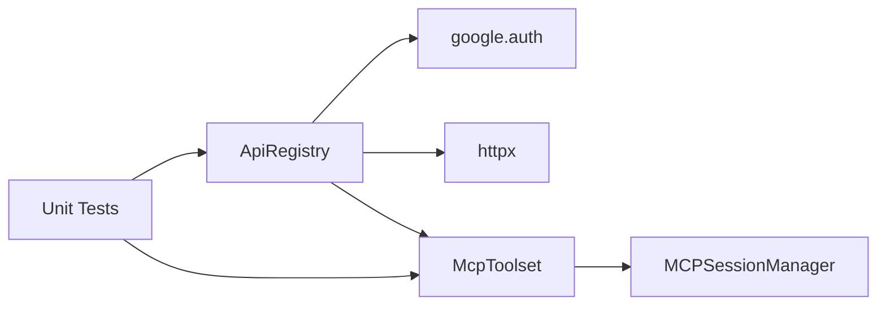

# API Registry Integration

<cite>
**Referenced Files in This Document**
- [api_registry.py](file://src/google/adk/integrations/api_registry/api_registry.py)
- [__init__.py](file://src/google/adk/integrations/api_registry/__init__.py)
- [mcp_toolset.py](file://src/google/adk/tools/mcp_tool/mcp_toolset.py)
- [mcp_session_manager.py](file://src/google/adk/tools/mcp_tool/mcp_session_manager.py)
- [test_api_registry.py](file://tests/unittests/integrations/api_registry/test_api_registry.py)
- [agent.py](file://contributing/samples/api_registry_agent/agent.py)
- [README.md](file://contributing/samples/api_registry_agent/README.md)
</cite>

## Table of Contents
1. [Introduction](#introduction)
2. [Project Structure](#project-structure)
3. [Core Components](#core-components)
4. [Architecture Overview](#architecture-overview)
5. [Detailed Component Analysis](#detailed-component-analysis)
6. [Dependency Analysis](#dependency-analysis)
7. [Performance Considerations](#performance-considerations)
8. [Troubleshooting Guide](#troubleshooting-guide)
9. [Conclusion](#conclusion)
10. [Appendices](#appendices)

## Introduction
This document explains the API Registry integration in the ADK that enables discovering MCP servers registered in Google Cloud API Registry and obtaining McpToolsets for them. It covers initialization with project ID and location, optional header provider functions, server discovery via HTTP requests with authentication, and the get_toolset method for retrieving toolsets with filtering and naming options. Practical examples show how to connect to API Registry, configure authentication, and integrate MCP servers into agents. Error handling for HTTP failures and malformed responses is documented, along with best practices for credentials and troubleshooting.

## Project Structure
The API Registry integration is implemented in the integrations package and leverages the McpToolset infrastructure to expose MCP tools to agents.

**Diagram sources**
- [api_registry.py](file://src/google/adk/integrations/api_registry/api_registry.py#L31-L141)
- [mcp_toolset.py](file://src/google/adk/tools/mcp_tool/mcp_toolset.py#L64-L184)
- [mcp_session_manager.py](file://src/google/adk/tools/mcp_tool/mcp_session_manager.py#L181-L200)
- [agent.py](file://contributing/samples/api_registry_agent/agent.py#L1-L47)
- [README.md](file://contributing/samples/api_registry_agent/README.md#L1-L22)

**Section sources**
- [api_registry.py](file://src/google/adk/integrations/api_registry/api_registry.py#L1-L141)
- [__init__.py](file://src/google/adk/integrations/api_registry/__init__.py#L13-L17)

## Core Components
- ApiRegistry: Discovers MCP servers from Google Cloud API Registry using project ID and location, authenticates with Application Default Credentials, paginates results, and stores server metadata. Provides get_toolset to construct McpToolset instances for a selected MCP server.
- McpToolset: Connects to an MCP server via Streamable HTTP or other connection modes, retrieves tools, supports filtering and naming prefixes, and integrates with ADK’s tool framework.
- MCPSessionManager: Manages MCP client sessions, handles retries, and supports different connection types (stdio, SSE, HTTP).

Key capabilities:
- Initialization with project ID, optional location, and optional header provider.
- Discovery via GET to cloudapiregistry.googleapis.com with pagination.
- Authentication via refreshed Bearer token and optional x-goog-user-project header.
- Toolset construction with filtering and optional tool name prefixing.

**Section sources**
- [api_registry.py](file://src/google/adk/integrations/api_registry/api_registry.py#L31-L141)
- [mcp_toolset.py](file://src/google/adk/tools/mcp_tool/mcp_toolset.py#L64-L184)
- [mcp_session_manager.py](file://src/google/adk/tools/mcp_tool/mcp_session_manager.py#L181-L200)

## Architecture Overview
The integration follows a clean separation: ApiRegistry focuses on discovery and metadata, while McpToolset encapsulates transport and tool retrieval.

**Diagram sources**
- [api_registry.py](file://src/google/adk/integrations/api_registry/api_registry.py#L34-L84)
- [api_registry.py](file://src/google/adk/integrations/api_registry/api_registry.py#L86-L127)
- [mcp_toolset.py](file://src/google/adk/tools/mcp_tool/mcp_toolset.py#L95-L184)

## Detailed Component Analysis

### ApiRegistry Class
Responsibilities:
- Initialize with project ID, location, and optional header provider.
- Discover MCP servers by calling the API Registry endpoint with pagination.
- Refresh ADC credentials and attach Authorization and optional quota project headers.
- Provide get_toolset to create McpToolset for a given MCP server.

Initialization and discovery:
- Uses API_REGISTRY_URL and constructs the endpoint path from project_id and location.
- Iteratively fetches pages using nextPageToken until exhausted.
- Stores server entries keyed by server name.

get_toolset:
- Validates server existence and URL presence.
- Prepares StreamableHTTPConnectionParams with URL and headers.
- Supports tool_filter and tool_name_prefix passthrough to McpToolset.
- Accepts optional header_provider to enrich headers for the MCP session.

Error handling:
- Catches httpx.HTTPError and ValueError during fetch/parsing and raises a unified RuntimeError with a descriptive message.

**Diagram sources**
- [api_registry.py](file://src/google/adk/integrations/api_registry/api_registry.py#L31-L141)
- [mcp_toolset.py](file://src/google/adk/tools/mcp_tool/mcp_toolset.py#L64-L184)

**Section sources**
- [api_registry.py](file://src/google/adk/integrations/api_registry/api_registry.py#L34-L141)

### McpToolset and MCPSessionManager
McpToolset:
- Accepts connection_params (including StreamableHTTPConnectionParams), tool_filter, tool_name_prefix, header_provider, and progress_callback.
- Builds authentication headers from exchanged credentials if configured; otherwise uses ApiRegistry-provided headers.
- Integrates with BaseToolset for filtering and naming.

MCPSessionManager:
- Manages session creation and lifecycle for different connection types (stdio, SSE, HTTP).
- Provides retry logic for transient errors.

**Diagram sources**
- [mcp_toolset.py](file://src/google/adk/tools/mcp_tool/mcp_toolset.py#L64-L184)
- [mcp_session_manager.py](file://src/google/adk/tools/mcp_tool/mcp_session_manager.py#L181-L200)

**Section sources**
- [mcp_toolset.py](file://src/google/adk/tools/mcp_tool/mcp_toolset.py#L95-L184)
- [mcp_session_manager.py](file://src/google/adk/tools/mcp_tool/mcp_session_manager.py#L181-L200)

### Server Discovery Mechanism
- Endpoint: GET to cloudapiregistry.googleapis.com with path constructed from project_id and location.
- Pagination: Uses nextPageToken to iterate until completion.
- Authentication: Adds Authorization: Bearer <token> and optionally x-goog-user-project if quota_project_id is present.
- Storage: Populates an internal map keyed by server name.

**Diagram sources**
- [api_registry.py](file://src/google/adk/integrations/api_registry/api_registry.py#L56-L84)

**Section sources**
- [api_registry.py](file://src/google/adk/integrations/api_registry/api_registry.py#L56-L84)

### get_toolset Method
- Validates that the requested server exists and has URLs.
- Prepares StreamableHTTPConnectionParams with URL and headers.
- Optionally prepends scheme if missing.
- Returns McpToolset configured with tool_filter and tool_name_prefix, and forwards header_provider.

**Diagram sources**
- [api_registry.py](file://src/google/adk/integrations/api_registry/api_registry.py#L86-L127)
- [mcp_toolset.py](file://src/google/adk/tools/mcp_tool/mcp_toolset.py#L95-L184)

**Section sources**
- [api_registry.py](file://src/google/adk/integrations/api_registry/api_registry.py#L86-L127)

### Practical Examples

- Setting up API Registry connection and constructing a toolset:
  - Initialize ApiRegistry with your Google Cloud project ID and MCP server name.
  - Call get_toolset to obtain an McpToolset.
  - Integrate the toolset into an agent.

- Configuring authentication:
  - ApiRegistry uses Application Default Credentials (ADC). Ensure your environment is configured (e.g., gcloud auth application-default login or service account key).
  - If quota_project_id is set on the ADC credentials, ApiRegistry adds x-goog-user-project header automatically.

- Integrating MCP servers:
  - Use the returned McpToolset in an agent’s tools list.
  - Optionally apply tool_filter and tool_name_prefix for fine-grained control.

- Sample usage:
  - See the sample agent that demonstrates ApiRegistry usage and agent configuration.

**Section sources**
- [agent.py](file://contributing/samples/api_registry_agent/agent.py#L20-L46)
- [README.md](file://contributing/samples/api_registry_agent/README.md#L10-L21)

## Dependency Analysis
- ApiRegistry depends on:
  - google.auth for credentials and refresh.
  - httpx for HTTP requests.
  - McpToolset for constructing toolsets.
- McpToolset depends on:
  - MCPSessionManager for session lifecycle.
  - BaseToolset for filtering and naming.
- Tests validate:
  - Successful discovery with and without quota project ID.
  - Pagination handling.
  - Error propagation for HTTP/network failures.

**Diagram sources**
- [api_registry.py](file://src/google/adk/integrations/api_registry/api_registry.py#L24-L26)
- [mcp_toolset.py](file://src/google/adk/tools/mcp_tool/mcp_toolset.py#L50-L56)
- [test_api_registry.py](file://tests/unittests/integrations/api_registry/test_api_registry.py#L61-L124)

**Section sources**
- [api_registry.py](file://src/google/adk/integrations/api_registry/api_registry.py#L24-L26)
- [mcp_toolset.py](file://src/google/adk/tools/mcp_tool/mcp_toolset.py#L50-L56)
- [test_api_registry.py](file://tests/unittests/integrations/api_registry/test_api_registry.py#L69-L188)

## Performance Considerations
- Discovery performs iterative GET calls for each page; keep location scoped to reduce payload size.
- Authentication refresh occurs per request; reuse ApiRegistry instances to avoid repeated credential refresh overhead.
- McpToolset lazy-loads tools; filtering reduces initial tool enumeration overhead.
- For large server lists, consider narrowing filters and prefixes to minimize toolset size.

## Troubleshooting Guide
Common issues and resolutions:
- HTTP/network errors during discovery:
  - Symptom: RuntimeError mentioning failure to fetch MCP servers.
  - Causes: Network connectivity, invalid project/location, API rate limits.
  - Resolution: Verify credentials, check project/region enablement, retry after backoff.

- Malformed or empty responses:
  - Symptom: ValueError indicating server not found or missing URLs.
  - Causes: Empty mcpServers array, missing name or urls fields.
  - Resolution: Confirm MCP server registration and URL availability in API Registry.

- Authentication failures:
  - Symptom: 401/403 responses.
  - Causes: Insufficient permissions or ADC misconfiguration.
  - Resolution: Re-authenticate via gcloud or set GOOGLE_APPLICATION_CREDENTIALS; ensure service account has required API Registry permissions.

- Pagination edge cases:
  - Symptom: Incomplete server list.
  - Resolution: Ensure nextPageToken handling completes; tests demonstrate multi-page scenarios.

- Quota project header:
  - Symptom: Unexpected billing behavior.
  - Resolution: Confirm quota_project_id on ADC; ApiRegistry adds x-goog-user-project accordingly.

**Section sources**
- [api_registry.py](file://src/google/adk/integrations/api_registry/api_registry.py#L80-L84)
- [test_api_registry.py](file://tests/unittests/integrations/api_registry/test_api_registry.py#L190-L200)

## Conclusion
The API Registry integration in ADK provides a streamlined way to discover MCP servers and obtain McpToolsets with minimal configuration. By leveraging ADC for authentication and pagination for discovery, it scales to environments with many registered servers. The combination of filtering and naming controls in McpToolset offers flexibility for agent tool integration. Following the best practices and troubleshooting steps outlined here will help ensure reliable operation in production.

## Appendices

### Best Practices for Managing API Registry Credentials
- Use service accounts for automated environments; set GOOGLE_APPLICATION_CREDENTIALS to point to the service account key file.
- Grant the service account roles to access API Registry and the target MCP servers.
- Prefer regional locations to limit discovery scope and improve latency.
- Rotate credentials regularly and monitor quota project usage.

### Example References
- Sample agent demonstrating ApiRegistry usage and agent configuration:
  - [agent.py](file://contributing/samples/api_registry_agent/agent.py#L20-L46)
  - [README.md](file://contributing/samples/api_registry_agent/README.md#L10-L21)