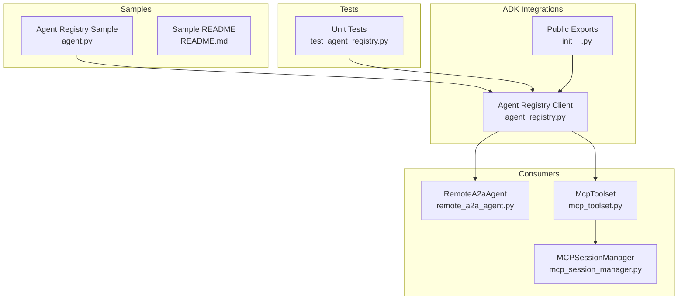
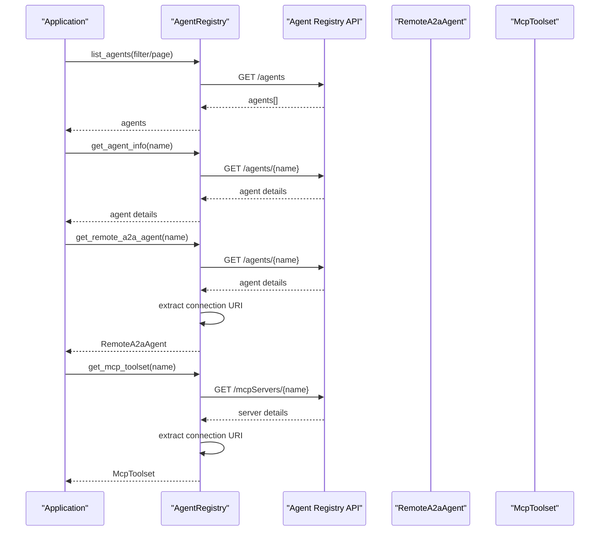
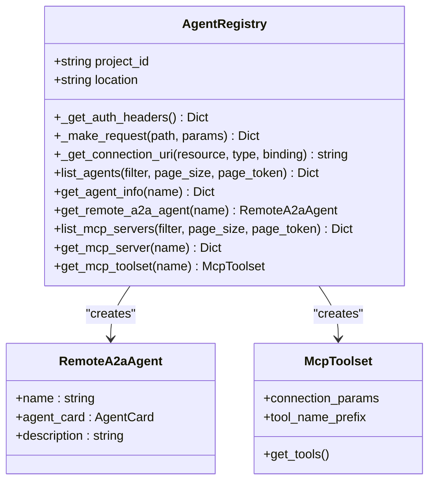
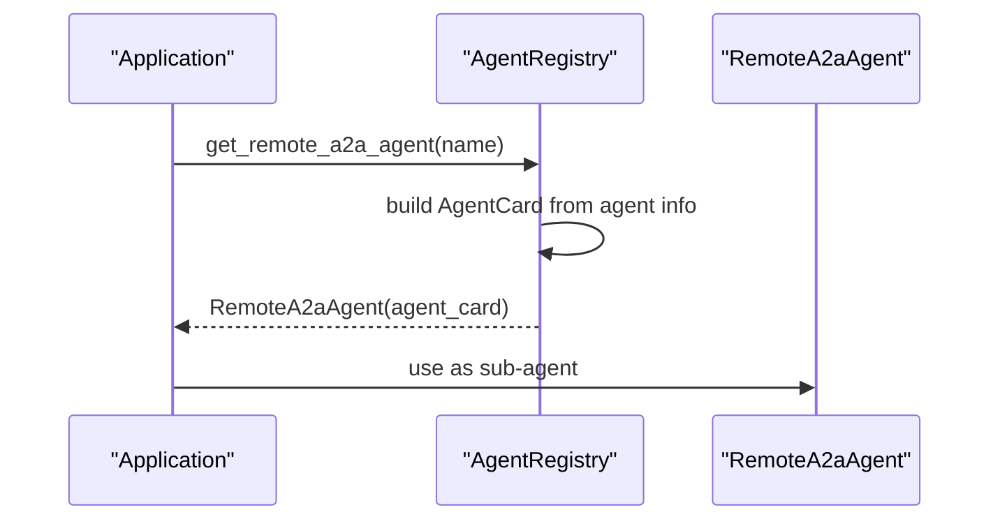
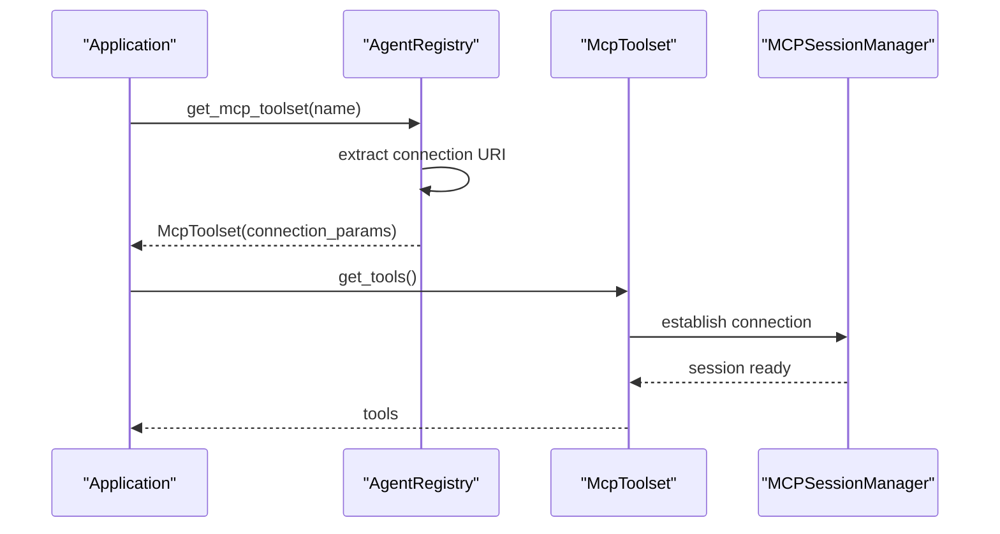
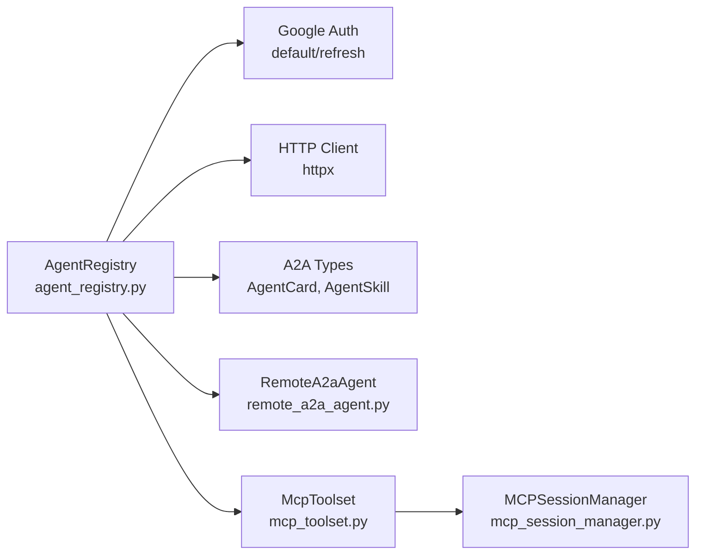

# Agent Registry Integration

<cite>
**Referenced Files in This Document**
- [agent_registry.py](file://src/google/adk/integrations/agent_registry/agent_registry.py)
- [__init__.py](file://src/google/adk/integrations/agent_registry/__init__.py)
- [agent.py](file://contributing/samples/agent_registry_agent/agent.py)
- [README.md](file://contributing/samples/agent_registry_agent/README.md)
- [test_agent_registry.py](file://tests/unittests/integrations/agent_registry/test_agent_registry.py)
- [remote_a2a_agent.py](file://src/google/adk/agents/remote_a2a_agent.py)
- [mcp_toolset.py](file://src/google/adk/tools/mcp_tool/mcp_toolset.py)
- [mcp_session_manager.py](file://src/google/adk/tools/mcp_tool/mcp_session_manager.py)
- [README.md](file://src/google/adk/integrations/README.md)
- [README.md](file://src/google/adk/agents/README.md)
</cite>

## Table of Contents
1. [Introduction](#introduction)
2. [Project Structure](#project-structure)
3. [Core Components](#core-components)
4. [Architecture Overview](#architecture-overview)
5. [Detailed Component Analysis](#detailed-component-analysis)
6. [Dependency Analysis](#dependency-analysis)
7. [Performance Considerations](#performance-considerations)
8. [Troubleshooting Guide](#troubleshooting-guide)
9. [Conclusion](#conclusion)

## Introduction
This document explains the Agent Registry integration in the Agent Development Kit (ADK). It focuses on how ADK discovers and manages AI agents hosted in Google Cloud through the Agent Registry service. The integration provides:
- Discovery of registered A2A agents and MCP servers
- Helper methods to construct ready-to-use components (RemoteA2aAgent and McpToolset)
- Authentication and authorization via Google Cloud credentials
- Practical examples for listing, resolving, and consuming agents and MCP servers

The integration is implemented as a thin client around the Agent Registry API, surfacing higher-level helpers that ADK applications can use directly.

## Project Structure
The Agent Registry integration lives under the integrations package and includes:
- A public client class for interacting with the Agent Registry API
- A sample demonstrating discovery and usage
- Unit tests validating behavior and error handling
- Supporting components for RemoteA2aAgent and McpToolset consumption

**Diagram sources**
- [agent_registry.py](file://src/google/adk/integrations/agent_registry/agent_registry.py#L59-L282)
- [__init__.py](file://src/google/adk/integrations/agent_registry/__init__.py#L13-L18)
- [agent.py](file://contributing/samples/agent_registry_agent/agent.py#L17-L64)
- [README.md](file://contributing/samples/agent_registry_agent/README.md#L1-L50)
- [test_agent_registry.py](file://tests/unittests/integrations/agent_registry/test_agent_registry.py#L1-L251)
- [remote_a2a_agent.py](file://src/google/adk/agents/remote_a2a_agent.py#L107-L200)
- [mcp_toolset.py](file://src/google/adk/tools/mcp_tool/mcp_toolset.py#L64-L184)
- [mcp_session_manager.py](file://src/google/adk/tools/mcp_tool/mcp_session_manager.py#L368-L403)

**Section sources**
- [README.md](file://src/google/adk/integrations/README.md#L1-L36)
- [agent_registry.py](file://src/google/adk/integrations/agent_registry/agent_registry.py#L59-L282)
- [__init__.py](file://src/google/adk/integrations/agent_registry/__init__.py#L13-L18)

## Core Components
- AgentRegistry client
  - Initializes with project and location, validates inputs, and sets up Google Cloud credentials
  - Provides list and get methods for agents and MCP servers
  - Resolves connection URIs from nested protocol/interface structures
  - Builds RemoteA2aAgent and McpToolset instances with proper authentication headers

- RemoteA2aAgent
  - Consumes an AgentCard to communicate with remote A2A agents
  - Manages HTTP client lifecycle and A2A message conversion

- McpToolset
  - Connects to MCP servers and exposes tools consumable by agents
  - Supports multiple connection transports (stdio, SSE, Streamable HTTP)

**Section sources**
- [agent_registry.py](file://src/google/adk/integrations/agent_registry/agent_registry.py#L59-L282)
- [remote_a2a_agent.py](file://src/google/adk/agents/remote_a2a_agent.py#L107-L200)
- [mcp_toolset.py](file://src/google/adk/tools/mcp_tool/mcp_toolset.py#L64-L184)

## Architecture Overview
The Agent Registry integration follows a layered approach:
- Application code uses AgentRegistry to discover agents and MCP servers
- AgentRegistry resolves connection details and builds higher-level components
- RemoteA2aAgent consumes A2A agent cards to communicate with remote agents
- McpToolset connects to MCP servers and exposes tools

**Diagram sources**
- [agent_registry.py](file://src/google/adk/integrations/agent_registry/agent_registry.py#L175-L282)
- [remote_a2a_agent.py](file://src/google/adk/agents/remote_a2a_agent.py#L107-L200)
- [mcp_toolset.py](file://src/google/adk/tools/mcp_tool/mcp_toolset.py#L64-L184)

## Detailed Component Analysis

### AgentRegistry Client
Responsibilities:
- Validates project and location
- Authenticates via Google Cloud default credentials and refreshes tokens
- Makes GET requests to the Agent Registry API base URL
- Extracts connection URIs from resource details considering protocol type and binding
- Builds RemoteA2aAgent and McpToolset instances with resolved endpoints and headers

Key behaviors:
- Authentication headers include Authorization and optional x-goog-user-project
- Connection URI extraction supports both top-level interfaces and nested protocols
- Error handling wraps HTTP and network errors into runtime errors with contextual messages

**Diagram sources**
- [agent_registry.py](file://src/google/adk/integrations/agent_registry/agent_registry.py#L59-L282)
- [remote_a2a_agent.py](file://src/google/adk/agents/remote_a2a_agent.py#L107-L200)
- [mcp_toolset.py](file://src/google/adk/tools/mcp_tool/mcp_toolset.py#L64-L184)

**Section sources**
- [agent_registry.py](file://src/google/adk/integrations/agent_registry/agent_registry.py#L59-L282)
- [test_agent_registry.py](file://tests/unittests/integrations/agent_registry/test_agent_registry.py#L27-L251)

### RemoteA2aAgent Integration
RemoteA2aAgent consumes an AgentCard to communicate with remote A2A agents. The AgentRegistry constructs an AgentCard from agent metadata and passes it to RemoteA2aAgent, enabling seamless integration with the ADK agent framework.

**Diagram sources**
- [agent_registry.py](file://src/google/adk/integrations/agent_registry/agent_registry.py#L241-L282)
- [remote_a2a_agent.py](file://src/google/adk/agents/remote_a2a_agent.py#L107-L200)

**Section sources**
- [agent_registry.py](file://src/google/adk/integrations/agent_registry/agent_registry.py#L241-L282)
- [remote_a2a_agent.py](file://src/google/adk/agents/remote_a2a_agent.py#L107-L200)

### McpToolset Integration
McpToolset connects to MCP servers and exposes tools consumable by agents. The AgentRegistry resolves the MCP server’s connection URI and constructs an McpToolset with appropriate connection parameters and headers.

**Diagram sources**
- [agent_registry.py](file://src/google/adk/integrations/agent_registry/agent_registry.py#L195-L218)
- [mcp_toolset.py](file://src/google/adk/tools/mcp_tool/mcp_toolset.py#L64-L184)
- [mcp_session_manager.py](file://src/google/adk/tools/mcp_tool/mcp_session_manager.py#L368-L403)

**Section sources**
- [agent_registry.py](file://src/google/adk/integrations/agent_registry/agent_registry.py#L195-L218)
- [mcp_toolset.py](file://src/google/adk/tools/mcp_tool/mcp_toolset.py#L64-L184)
- [mcp_session_manager.py](file://src/google/adk/tools/mcp_tool/mcp_session_manager.py#L368-L403)

### Practical Examples

- Listing agents and MCP servers
  - Use list_agents and list_mcp_servers to enumerate registered resources
  - Reference: [agent.py](file://contributing/samples/agent_registry_agent/agent.py#L30-L38)

- Getting a RemoteA2aAgent instance
  - Call get_remote_a2a_agent with a full resource name to obtain a configured RemoteA2aAgent
  - Reference: [agent.py](file://contributing/samples/agent_registry_agent/agent.py#L44-L47)

- Getting an McpToolset instance
  - Call get_mcp_toolset with a full MCP server resource name to obtain a configured McpToolset
  - Reference: [agent.py](file://contributing/samples/agent_registry_agent/agent.py#L50-L53)

- Constructing an agent with discovered components
  - Combine RemoteA2aAgent and McpToolset into an LlmAgent for orchestration
  - Reference: [agent.py](file://contributing/samples/agent_registry_agent/agent.py#L55-L63)

**Section sources**
- [agent.py](file://contributing/samples/agent_registry_agent/agent.py#L17-L64)
- [README.md](file://contributing/samples/agent_registry_agent/README.md#L1-L50)

### Agent Discovery Mechanisms
- By name
  - Retrieve a specific agent or MCP server using get_agent_info or get_mcp_server
  - Reference: [agent_registry.py](file://src/google/adk/integrations/agent_registry/agent_registry.py#L237-L239), [agent_registry.py](file://src/google/adk/integrations/agent_registry/agent_registry.py#L191-L193)

- By filter
  - Use list_agents and list_mcp_servers with filter parameters to narrow results
  - Reference: [agent_registry.py](file://src/google/adk/integrations/agent_registry/agent_registry.py#L221-L235), [agent_registry.py](file://src/google/adk/integrations/agent_registry/agent_registry.py#L175-L189)

- By protocol and binding
  - Connection URIs are extracted considering protocol type and binding to ensure compatibility
  - Reference: [agent_registry.py](file://src/google/adk/integrations/agent_registry/agent_registry.py#L142-L162), [test_agent_registry.py](file://tests/unittests/integrations/agent_registry/test_agent_registry.py#L40-L100)

**Section sources**
- [agent_registry.py](file://src/google/adk/integrations/agent_registry/agent_registry.py#L142-L239)
- [test_agent_registry.py](file://tests/unittests/integrations/agent_registry/test_agent_registry.py#L40-L100)

### Security Considerations
- Authentication
  - Uses Google Cloud default credentials; tokens are refreshed before each request
  - Authorization headers include Bearer token and optional x-goog-user-project
  - Reference: [agent_registry.py](file://src/google/adk/integrations/agent_registry/agent_registry.py#L99-L115)

- Authorization
  - The Agent Registry API enforces IAM policies on resources; ensure identities have appropriate permissions to list and get resources
  - Reference: [agent_registry.py](file://src/google/adk/integrations/agent_registry/agent_registry.py#L117-L140)

- Transport security
  - Connection URIs are resolved from resource details; ensure endpoints use HTTPS
  - Reference: [agent_registry.py](file://src/google/adk/integrations/agent_registry/agent_registry.py#L142-L162)

**Section sources**
- [agent_registry.py](file://src/google/adk/integrations/agent_registry/agent_registry.py#L99-L162)

### Agent Lifecycle Management
- Registration
  - Agents and MCP servers are registered externally in Google Cloud; ADK reads them via the Agent Registry API
  - Reference: [agent_registry.py](file://src/google/adk/integrations/agent_registry/agent_registry.py#L175-L239)

- Updates
  - ADK clients fetch latest metadata on demand; there is no built-in update mechanism in the client
  - Reference: [agent_registry.py](file://src/google/adk/integrations/agent_registry/agent_registry.py#L237-L239)

- Deactivation/removal
  - When resources are deactivated or removed in the registry, subsequent get/list calls will fail accordingly
  - Reference: [agent_registry.py](file://src/google/adk/integrations/agent_registry/agent_registry.py#L117-L140)

**Section sources**
- [agent_registry.py](file://src/google/adk/integrations/agent_registry/agent_registry.py#L117-L239)

## Dependency Analysis
The Agent Registry integration depends on:
- Google Cloud authentication and HTTP client libraries
- A2A types and client for RemoteA2aAgent construction
- MCP tooling for McpToolset creation

**Diagram sources**
- [agent_registry.py](file://src/google/adk/integrations/agent_registry/agent_registry.py#L33-L44)
- [remote_a2a_agent.py](file://src/google/adk/agents/remote_a2a_agent.py#L28-L47)
- [mcp_toolset.py](file://src/google/adk/tools/mcp_tool/mcp_toolset.py#L32-L51)
- [mcp_session_manager.py](file://src/google/adk/tools/mcp_tool/mcp_session_manager.py#L368-L403)

**Section sources**
- [agent_registry.py](file://src/google/adk/integrations/agent_registry/agent_registry.py#L33-L44)
- [remote_a2a_agent.py](file://src/google/adk/agents/remote_a2a_agent.py#L28-L47)
- [mcp_toolset.py](file://src/google/adk/tools/mcp_tool/mcp_toolset.py#L32-L51)
- [mcp_session_manager.py](file://src/google/adk/tools/mcp_tool/mcp_session_manager.py#L368-L403)

## Performance Considerations
- Network latency
  - Each discovery operation performs an HTTP GET to the Agent Registry API; batch operations where possible
- Token refresh overhead
  - Credentials are refreshed per request; consider reusing clients or minimizing repeated calls
- Tool enumeration
  - McpToolset may enumerate tools from MCP servers; cache results when feasible

[No sources needed since this section provides general guidance]

## Troubleshooting Guide
Common issues and resolutions:
- Missing project or location
  - Ensure project_id and location are provided during AgentRegistry initialization
  - Reference: [agent_registry.py](file://src/google/adk/integrations/agent_registry/agent_registry.py#L84-L88)

- Authentication failures
  - Verify Google Cloud credentials are configured; the client attempts default credentials and token refresh
  - Reference: [agent_registry.py](file://src/google/adk/integrations/agent_registry/agent_registry.py#L92-L115)

- Network errors
  - API requests wrap HTTP and network errors into runtime errors with status and text
  - Reference: [agent_registry.py](file://src/google/adk/integrations/agent_registry/agent_registry.py#L126-L140)

- Connection URI not found
  - Ensure the agent or MCP server resource includes a valid interface with URL and matching protocol binding
  - Reference: [agent_registry.py](file://src/google/adk/integrations/agent_registry/agent_registry.py#L142-L162), [test_agent_registry.py](file://tests/unittests/integrations/agent_registry/test_agent_registry.py#L102-L112)

- Resource not found
  - Confirm resource names and filters; verify IAM permissions for listing and getting resources
  - Reference: [agent_registry.py](file://src/google/adk/integrations/agent_registry/agent_registry.py#L117-L140)

**Section sources**
- [agent_registry.py](file://src/google/adk/integrations/agent_registry/agent_registry.py#L84-L140)
- [test_agent_registry.py](file://tests/unittests/integrations/agent_registry/test_agent_registry.py#L209-L251)

## Conclusion
The Agent Registry integration in ADK provides a streamlined way to discover and consume AI agents and MCP servers hosted in Google Cloud. By centralizing authentication, connection resolution, and component construction, it reduces boilerplate and accelerates agent composition. Developers can list and resolve agents and MCP servers, then plug them into agents and toolsets for powerful, extensible workflows.