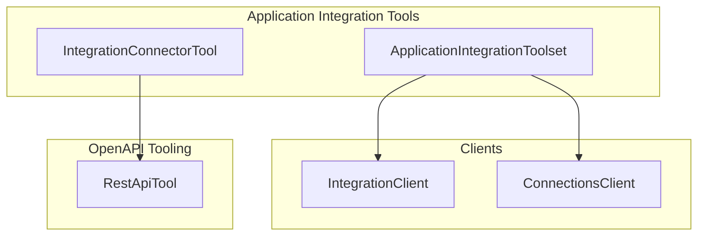
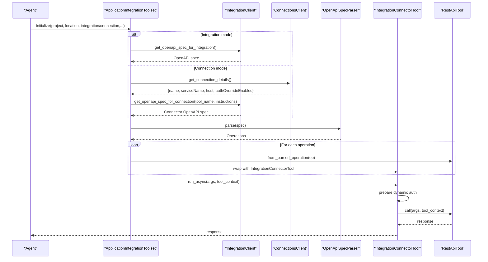
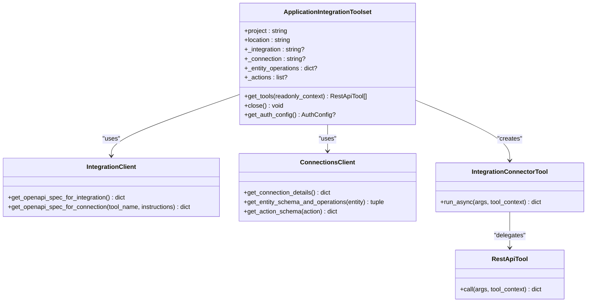
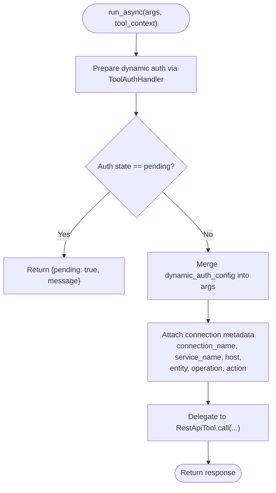
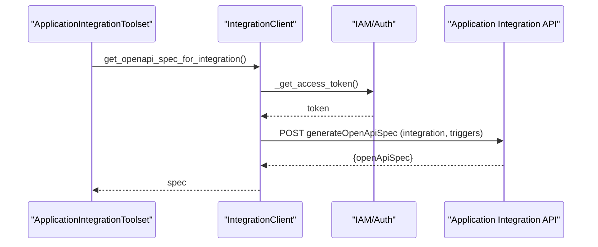
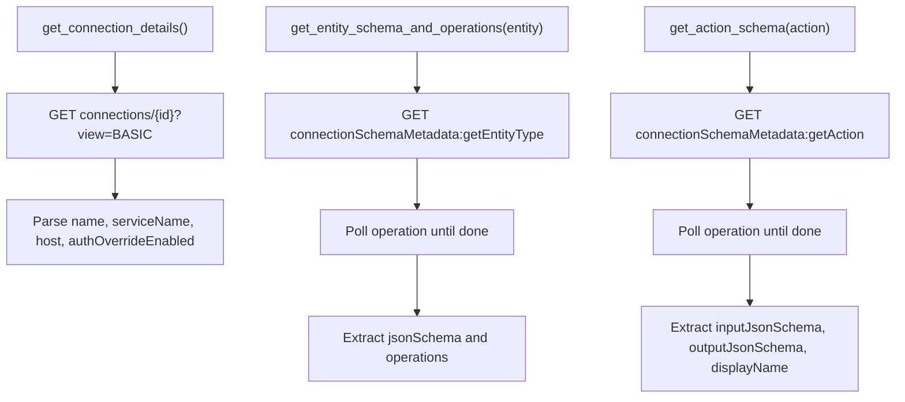
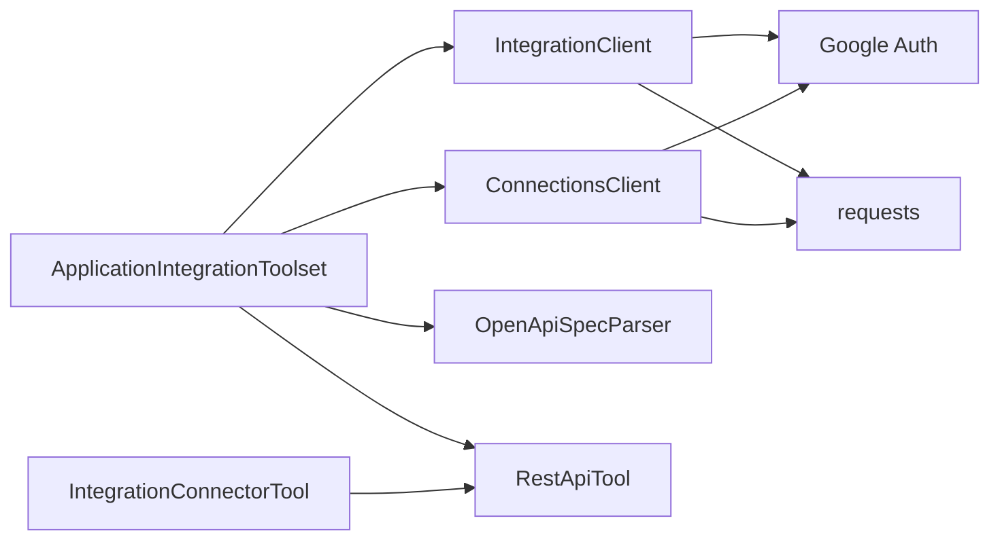

# Application Integration Tools

<cite>
**Referenced Files in This Document**
- [application_integration_toolset.py](file://src/google/adk/tools/application_integration_tool/application_integration_toolset.py)
- [integration_connector_tool.py](file://src/google/adk/tools/application_integration_tool/integration_connector_tool.py)
- [integration_client.py](file://src/google/adk/tools/application_integration_tool/clients/integration_client.py)
- [connections_client.py](file://src/google/adk/tools/application_integration_tool/clients/connections_client.py)
- [rest_api_tool.py](file://src/google/adk/tools/openapi_tool/openapi_spec_parser/rest_api_tool.py)
- [agent.py](file://contributing/samples/application_integration_agent/agent.py)
- [test_application_integration_toolset.py](file://tests/unittests/tools/application_integration_tool/test_application_integration_toolset.py)
- [test_integration_connector_tool.py](file://tests/unittests/tools/application_integration_tool/test_integration_connector_tool.py)
- [test_connections_client.py](file://tests/unittests/tools/application_integration_tool/clients/test_connections_client.py)
- [test_integration_client.py](file://tests/unittests/tools/application_integration_tool/clients/test_integration_client.py)
- [AgentConfig.json](file://src/google/adk/agents/config_schemas/AgentConfig.json)
</cite>

## Table of Contents
1. [Introduction](#introduction)
2. [Project Structure](#project-structure)
3. [Core Components](#core-components)
4. [Architecture Overview](#architecture-overview)
5. [Detailed Component Analysis](#detailed-component-analysis)
6. [Dependency Analysis](#dependency-analysis)
7. [Performance Considerations](#performance-considerations)
8. [Troubleshooting Guide](#troubleshooting-guide)
9. [Conclusion](#conclusion)
10. [Appendices](#appendices)

## Introduction
This document explains the Application Integration Tools in ADK that enable AI agents to connect to external applications and services. It covers:
- ApplicationIntegrationToolset for generating tools from Application Integration or Integration Connector resources
- IntegrationConnectorTool for bidirectional communication channels to external systems
- Client architecture including IntegrationClient and ConnectionsClient for managing service connections
- Authentication patterns and data exchange protocols
- Practical examples for CRM systems, databases, and third-party APIs
- Connection pooling, retry mechanisms, and error handling strategies
- Configuration options for timeouts, authentication methods, and connection limits

## Project Structure
The Application Integration Tools reside under the tools package and integrate with the OpenAPI tooling stack and authentication utilities.

**Diagram sources**
- [application_integration_toolset.py](file://src/google/adk/tools/application_integration_tool/application_integration_toolset.py#L46-L302)
- [integration_connector_tool.py](file://src/google/adk/tools/application_integration_tool/integration_connector_tool.py#L39-L209)
- [integration_client.py](file://src/google/adk/tools/application_integration_tool/clients/integration_client.py#L30-L271)
- [connections_client.py](file://src/google/adk/tools/application_integration_tool/clients/connections_client.py#L32-L914)
- [rest_api_tool.py](file://src/google/adk/tools/openapi_tool/openapi_spec_parser/rest_api_tool.py#L79-L577)

**Section sources**
- [application_integration_toolset.py](file://src/google/adk/tools/application_integration_tool/application_integration_toolset.py#L1-L302)
- [integration_connector_tool.py](file://src/google/adk/tools/application_integration_tool/integration_connector_tool.py#L1-L209)
- [integration_client.py](file://src/google/adk/tools/application_integration_tool/clients/integration_client.py#L1-L271)
- [connections_client.py](file://src/google/adk/tools/application_integration_tool/clients/connections_client.py#L1-L914)
- [rest_api_tool.py](file://src/google/adk/tools/openapi_tool/openapi_spec_parser/rest_api_tool.py#L1-L577)

## Core Components
- ApplicationIntegrationToolset: Builds tools from Application Integration or Integration Connector resources. It supports:
  - Generating tools from an integration with selected triggers
  - Generating tools from a connection with entity operations and actions
  - Configurable authentication and tool filtering
- IntegrationConnectorTool: Wraps RestApiTool to add Integration Connector context (connection details, entity, operation, action) and dynamic auth parameters. It prepares arguments and delegates execution to RestApiTool.
- IntegrationClient: Fetches OpenAPI specs for integrations or connections using Google Cloud Application Integration APIs.
- ConnectionsClient: Retrieves connection metadata and entity/action schemas from Google Cloud Connectors API, and constructs connector OpenAPI specs for Integration Connector flows.
- RestApiTool: Generic REST API tool that parses OpenAPI operations, prepares request parameters, attaches auth credentials, and executes HTTP calls.

Key capabilities:
- Dynamic auth token injection for OAuth flows
- Tool schema generation from OpenAPI specs
- Structured error handling and logging
- Optional SSL verification configuration

**Section sources**
- [application_integration_toolset.py](file://src/google/adk/tools/application_integration_tool/application_integration_toolset.py#L46-L302)
- [integration_connector_tool.py](file://src/google/adk/tools/application_integration_tool/integration_connector_tool.py#L39-L209)
- [integration_client.py](file://src/google/adk/tools/application_integration_tool/clients/integration_client.py#L30-L271)
- [connections_client.py](file://src/google/adk/tools/application_integration_tool/clients/connections_client.py#L32-L914)
- [rest_api_tool.py](file://src/google/adk/tools/openapi_tool/openapi_spec_parser/rest_api_tool.py#L79-L577)

## Architecture Overview
The toolset orchestrates spec retrieval, schema parsing, and tool instantiation. IntegrationConnectorTool augments each tool with connection-specific parameters and dynamic auth.

**Diagram sources**
- [application_integration_toolset.py](file://src/google/adk/tools/application_integration_tool/application_integration_toolset.py#L157-L271)
- [integration_client.py](file://src/google/adk/tools/application_integration_tool/clients/integration_client.py#L80-L235)
- [connections_client.py](file://src/google/adk/tools/application_integration_tool/clients/connections_client.py#L59-L298)
- [integration_connector_tool.py](file://src/google/adk/tools/application_integration_tool/integration_connector_tool.py#L153-L189)
- [rest_api_tool.py](file://src/google/adk/tools/openapi_tool/openapi_spec_parser/rest_api_tool.py#L457-L556)

## Detailed Component Analysis

### ApplicationIntegrationToolset
Responsibilities:
- Validate initialization parameters (integration vs connection+operations/actions)
- Build IntegrationClient and ConnectionsClient as needed
- Retrieve OpenAPI specs and parse them into tools
- Configure authentication and tool filters
- Return either RestApiTool instances (for integrations) or IntegrationConnectorTool wrappers (for connectors)

Key behaviors:
- Authentication precedence: Uses provided auth unless connection disables overrides
- Tool selection: Supports predicates and explicit tool name lists
- Async lifecycle: Exposes get_tools and close for cleanup

**Diagram sources**
- [application_integration_toolset.py](file://src/google/adk/tools/application_integration_tool/application_integration_toolset.py#L83-L302)
- [integration_client.py](file://src/google/adk/tools/application_integration_tool/clients/integration_client.py#L30-L271)
- [connections_client.py](file://src/google/adk/tools/application_integration_tool/clients/connections_client.py#L32-L914)
- [integration_connector_tool.py](file://src/google/adk/tools/application_integration_tool/integration_connector_tool.py#L39-L209)
- [rest_api_tool.py](file://src/google/adk/tools/openapi_tool/openapi_spec_parser/rest_api_tool.py#L79-L577)

**Section sources**
- [application_integration_toolset.py](file://src/google/adk/tools/application_integration_tool/application_integration_toolset.py#L83-L302)
- [test_application_integration_toolset.py](file://tests/unittests/tools/application_integration_tool/test_application_integration_toolset.py#L223-L504)

### IntegrationConnectorTool
Responsibilities:
- Augment tool arguments with connection metadata (connection_name, service_name, host)
- Inject dynamic auth tokens when available
- Delegate execution to RestApiTool
- Support optional JSON schema features for function declarations

Behavior highlights:
- Excludes internal fields from function schema
- Handles pending auth state by returning a structured message
- Logs execution and forwards responses

**Diagram sources**
- [integration_connector_tool.py](file://src/google/adk/tools/application_integration_tool/integration_connector_tool.py#L153-L189)
- [rest_api_tool.py](file://src/google/adk/tools/openapi_tool/openapi_spec_parser/rest_api_tool.py#L457-L556)

**Section sources**
- [integration_connector_tool.py](file://src/google/adk/tools/application_integration_tool/integration_connector_tool.py#L39-L209)
- [test_integration_connector_tool.py](file://tests/unittests/tools/application_integration_tool/test_integration_connector_tool.py#L1-L200)

### IntegrationClient
Responsibilities:
- Generate OpenAPI specs for integrations using Application Integration APIs
- Build connector OpenAPI specs for Integration Connector flows
- Manage access tokens via default or service account credentials
- Raise structured errors for invalid requests or permission issues

Key flows:
- Integration spec generation: POST to generate OpenAPI spec endpoint with triggers
- Connector spec assembly: Combine base spec with entity/action operations and requests

**Diagram sources**
- [integration_client.py](file://src/google/adk/tools/application_integration_tool/clients/integration_client.py#L80-L128)

**Section sources**
- [integration_client.py](file://src/google/adk/tools/application_integration_tool/clients/integration_client.py#L30-L271)
- [test_integration_client.py](file://tests/unittests/tools/application_integration_tool/clients/test_integration_client.py#L1-L200)

### ConnectionsClient
Responsibilities:
- Retrieve connection details (service name, host, auth override flag)
- Fetch entity schemas and supported operations
- Fetch action schemas and build connector request/response schemas
- Assemble connector OpenAPI spec for Integration Connector execute flows

Implementation notes:
- Polls asynchronous operations until completion
- Converts JSON schemas to OpenAPI schema structures
- Provides static builders for connector base spec and operation schemas

**Diagram sources**
- [connections_client.py](file://src/google/adk/tools/application_integration_tool/clients/connections_client.py#L59-L160)
- [connections_client.py](file://src/google/adk/tools/application_integration_tool/clients/connections_client.py#L891-L914)

**Section sources**
- [connections_client.py](file://src/google/adk/tools/application_integration_tool/clients/connections_client.py#L32-L914)
- [test_connections_client.py](file://tests/unittests/tools/application_integration_tool/clients/test_connections_client.py#L1-L200)

### RestApiTool
Responsibilities:
- Parse OpenAPI operations into executable tools
- Prepare request parameters (path, query, headers, cookies, body)
- Attach authentication parameters and headers
- Execute HTTP requests and handle responses
- Support SSL verification customization and header providers

Behavior highlights:
- Supports JSON schema-based function declarations
- Handles non-JSON responses gracefully
- Logs warnings for HTTP errors and returns structured error messages

**Section sources**
- [rest_api_tool.py](file://src/google/adk/tools/openapi_tool/openapi_spec_parser/rest_api_tool.py#L79-L577)

## Dependency Analysis
- ApplicationIntegrationToolset depends on:
  - IntegrationClient for spec retrieval
  - ConnectionsClient for connection metadata and connector spec assembly
  - OpenAPI tooling for spec parsing and RestApiTool creation
- IntegrationConnectorTool depends on:
  - RestApiTool for HTTP execution
  - ToolAuthHandler for dynamic auth preparation
- Clients depend on:
  - Google Auth for access tokens
  - Requests for HTTP calls
  - Google Cloud Connectors and Application Integration APIs

**Diagram sources**
- [application_integration_toolset.py](file://src/google/adk/tools/application_integration_tool/application_integration_toolset.py#L35-L40)
- [integration_client.py](file://src/google/adk/tools/application_integration_tool/clients/integration_client.py#L21-L27)
- [connections_client.py](file://src/google/adk/tools/application_integration_tool/clients/connections_client.py#L25-L29)
- [integration_connector_tool.py](file://src/google/adk/tools/application_integration_tool/integration_connector_tool.py#L30-L34)
- [rest_api_tool.py](file://src/google/adk/tools/openapi_tool/openapi_spec_parser/rest_api_tool.py#L34-L53)

**Section sources**
- [application_integration_toolset.py](file://src/google/adk/tools/application_integration_tool/application_integration_toolset.py#L35-L40)
- [integration_client.py](file://src/google/adk/tools/application_integration_tool/clients/integration_client.py#L21-L27)
- [connections_client.py](file://src/google/adk/tools/application_integration_tool/clients/connections_client.py#L25-L29)
- [integration_connector_tool.py](file://src/google/adk/tools/application_integration_tool/integration_connector_tool.py#L30-L34)
- [rest_api_tool.py](file://src/google/adk/tools/openapi_tool/openapi_spec_parser/rest_api_tool.py#L34-L53)

## Performance Considerations
- Credential caching:
  - IntegrationClient and ConnectionsClient cache access tokens to reduce repeated refresh overhead.
- Spec reuse:
  - Toolsets cache parsed operations and tool instances to minimize repeated parsing.
- Async I/O:
  - RestApiTool uses httpx.AsyncClient for efficient concurrent requests.
- Retry and backoff:
  - While not built-in, the system supports configuring retry policies at the agent level via HttpRetryOptions.

[No sources needed since this section provides general guidance]

## Troubleshooting Guide
Common issues and resolutions:
- Credentials errors:
  - Ensure default service account or provided service account JSON has required permissions.
  - Verify quota project ID propagation when using default credentials.
- Invalid request errors:
  - Check project, location, integration, or connection identifiers.
  - Confirm triggers and entity operations/actions are valid.
- Auth override disabled:
  - If connection has authOverrideEnabled=false, provided auth is ignored; remove overrides or enable auth override.
- HTTP errors:
  - Inspect structured error messages returned by RestApiTool; adjust inputs and retry cautiously.
- SSL verification:
  - Configure ssl_verify for enterprise proxies; avoid disabling verification in production.

Operational tips:
- Use tool filtering to limit tool surface area.
- Enable logging to capture request/response details.
- For Integration Connector flows, confirm connector base spec and operation schemas are correctly assembled.

**Section sources**
- [integration_client.py](file://src/google/adk/tools/application_integration_tool/clients/integration_client.py#L111-L127)
- [connections_client.py](file://src/google/adk/tools/application_integration_tool/clients/connections_client.py#L871-L889)
- [rest_api_tool.py](file://src/google/adk/tools/openapi_tool/openapi_spec_parser/rest_api_tool.py#L534-L555)
- [AgentConfig.json](file://src/google/adk/agents/config_schemas/AgentConfig.json#L2220-L2305)

## Conclusion
The Application Integration Tools provide a robust framework for connecting AI agents to external systems via Application Integration and Integration Connector resources. They automate spec retrieval, tool generation, authentication, and execution, while offering flexible configuration for timeouts, SSL verification, and retry policies. The modular design enables practical integrations with CRMs, databases, and third-party APIs.

[No sources needed since this section summarizes without analyzing specific files]

## Appendices

### Practical Examples

- Jira Integration (Integration Connector):
  - Initialize ApplicationIntegrationToolset with connection name and entity operations.
  - Use IntegrationConnectorTool to list, get, create, update, and delete entities.
  - Reference: [agent.py](file://contributing/samples/application_integration_agent/agent.py#L31-L49)

- Integration with API Triggers:
  - Provide integration name and trigger IDs to generate tools from Application Integration OpenAPI spec.
  - Reference: [test_application_integration_toolset.py](file://tests/unittests/tools/application_integration_tool/test_application_integration_toolset.py#L480-L492)

- Action-based Tools:
  - Specify actions to generate tools for executing custom queries or other actions.
  - Reference: [integration_client.py](file://src/google/adk/tools/application_integration_tool/clients/integration_client.py#L206-L235)

### Configuration Options
- Authentication:
  - Service account credentials or default credentials
  - Auth scheme and credential objects for tools
- Connection details:
  - Connection template override for Integration Connector
  - Tool name prefix and instructions for generated tools
- Tool filtering:
  - Predicate-based or explicit tool name filtering
- SSL verification:
  - Enable/disable or customize CA bundle for enterprise proxies
- Retry and timeouts:
  - Configure agent-level retry options via HttpRetryOptions

**Section sources**
- [application_integration_toolset.py](file://src/google/adk/tools/application_integration_tool/application_integration_toolset.py#L83-L155)
- [rest_api_tool.py](file://src/google/adk/tools/openapi_tool/openapi_spec_parser/rest_api_tool.py#L281-L298)
- [AgentConfig.json](file://src/google/adk/agents/config_schemas/AgentConfig.json#L2220-L2305)