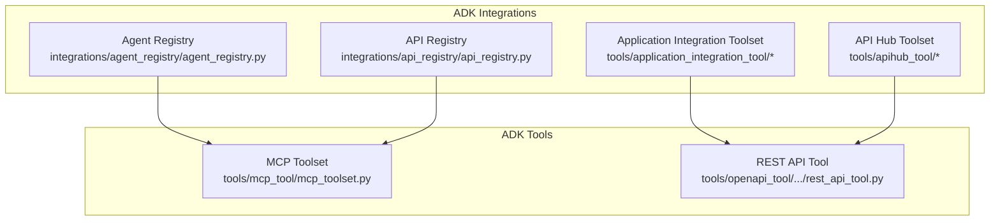
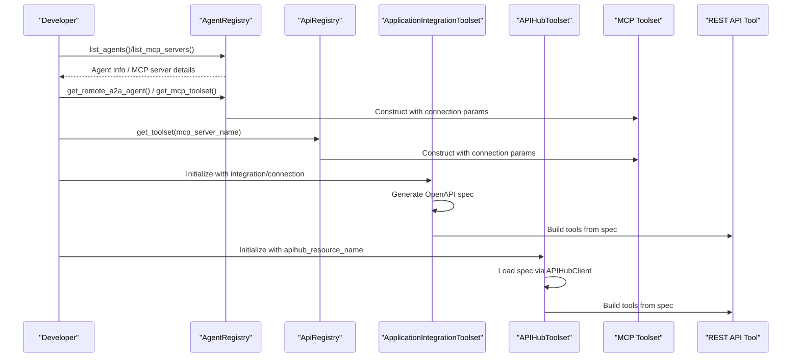
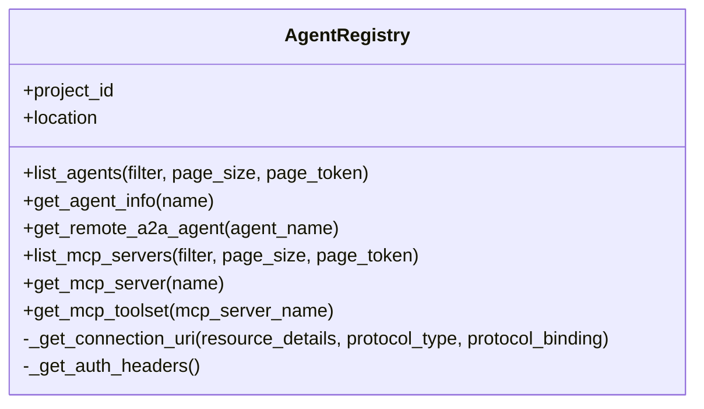
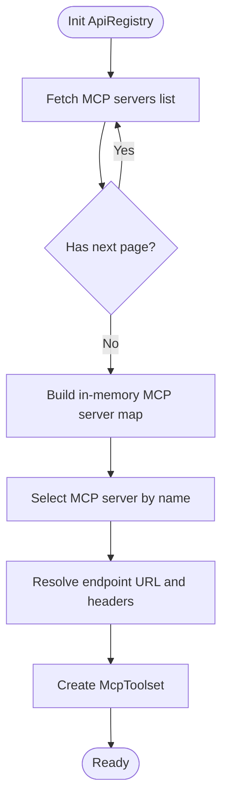
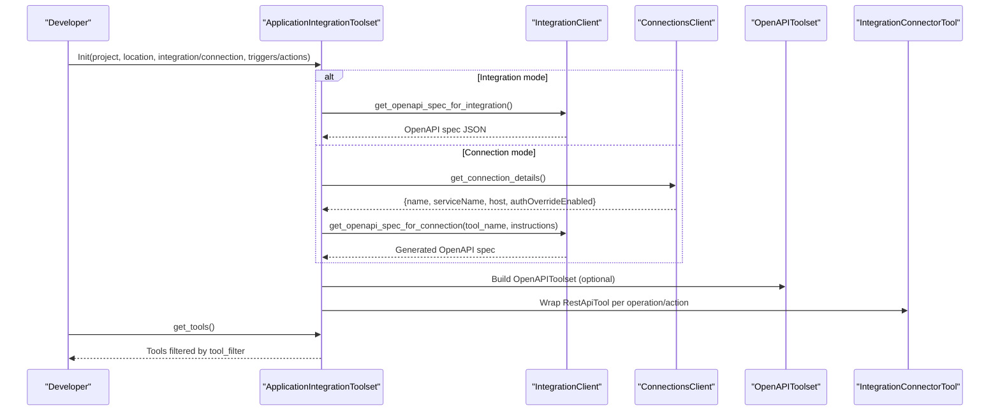
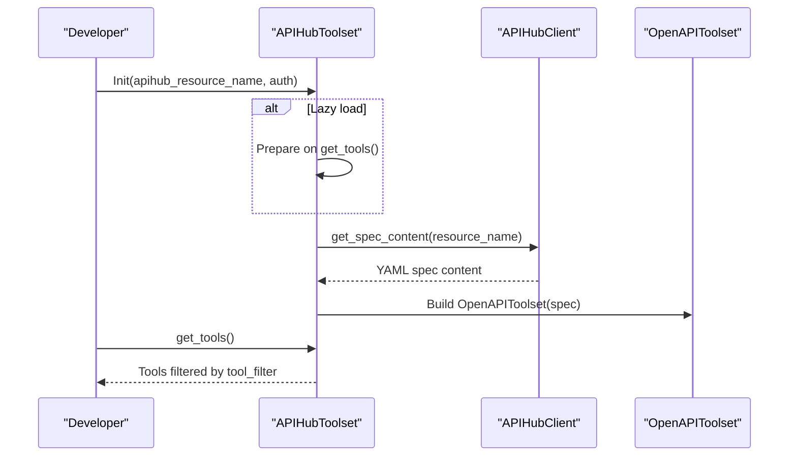
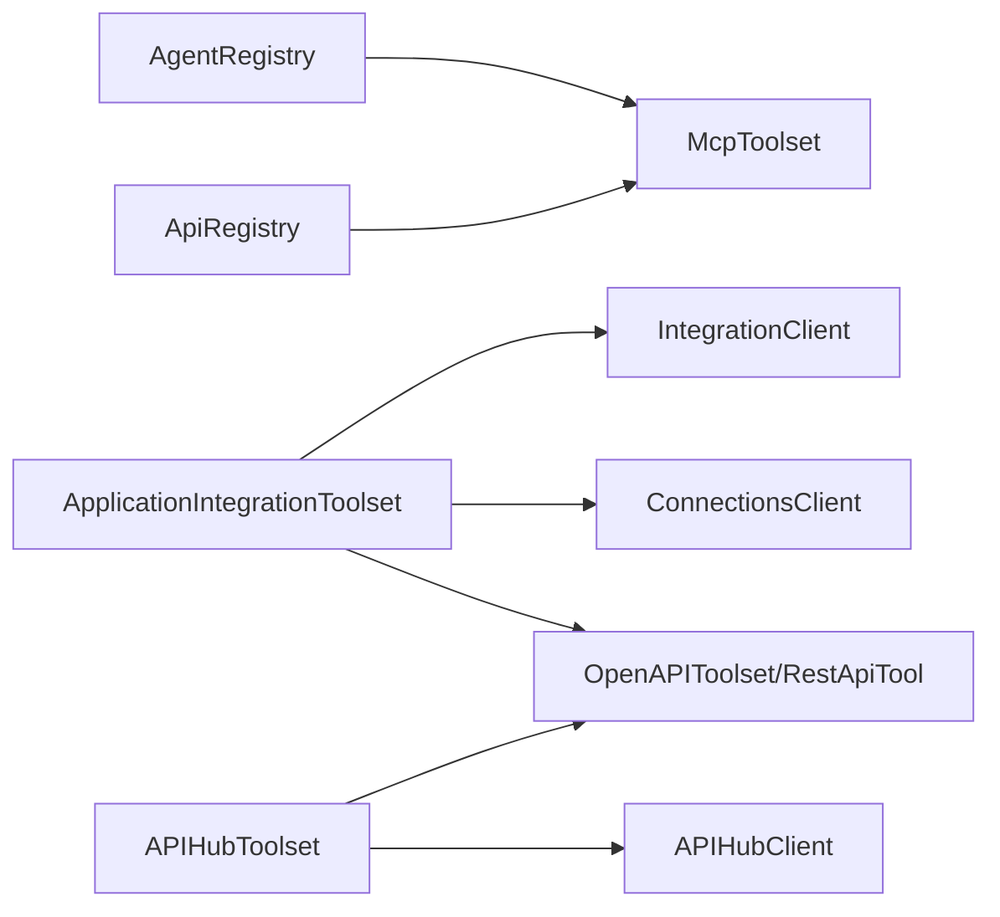

# Integrations and Connectors

<cite>
**Referenced Files in This Document**
- [integrations/README.md](file://src/google/adk/integrations/README.md)
- [agent_registry.py](file://src/google/adk/integrations/agent_registry/agent_registry.py)
- [api_registry.py](file://src/google/adk/integrations/api_registry/api_registry.py)
- [api_registry.py (deprecated redirect)](file://src/google/adk/tools/api_registry.py)
- [application_integration_toolset.py](file://src/google/adk/tools/application_integration_tool/application_integration_toolset.py)
- [integration_connector_tool.py](file://src/google/adk/tools/application_integration_tool/integration_connector_tool.py)
- [integration_client.py](file://src/google/adk/tools/application_integration_tool/clients/integration_client.py)
- [connections_client.py](file://src/google/adk/tools/application_integration_tool/clients/connections_client.py)
- [apihub_toolset.py](file://src/google/adk/tools/apihub_tool/apihub_toolset.py)
- [apihub_client.py](file://src/google/adk/tools/apihub_tool/clients/apihub_client.py)
</cite>

## Table of Contents
1. [Introduction](#introduction)
2. [Project Structure](#project-structure)
3. [Core Components](#core-components)
4. [Architecture Overview](#architecture-overview)
5. [Detailed Component Analysis](#detailed-component-analysis)
6. [Dependency Analysis](#dependency-analysis)
7. [Performance Considerations](#performance-considerations)
8. [Security and Authentication](#security-and-authentication)
9. [Monitoring and Observability](#monitoring-and-observability)
10. [Practical Setup and Lifecycle Management](#practical-setup-and-lifecycle-management)
11. [Troubleshooting Guide](#troubleshooting-guide)
12. [Best Practices](#best-practices)
13. [Conclusion](#conclusion)

## Introduction
This document explains how ADK integrates with external systems and services through dedicated integrations and connectors. It covers:
- Service discovery and management via Agent Registry and API Registry
- Application Integration toolset for connecting Google Cloud Integration and Integration Connector resources
- API Hub integration for managed API access and governance
- Patterns for third-party services, custom connectors, and enterprise system integration
- Practical setup examples, lifecycle management, security, monitoring, and troubleshooting

## Project Structure
ADK organizes integrations under a central directory with sub-packages for each integration domain. Each integration is self-contained and optionally depends on third-party extras installed separately.

**Diagram sources**
- [agent_registry.py](file://src/google/adk/integrations/agent_registry/agent_registry.py#L59-L282)
- [api_registry.py](file://src/google/adk/integrations/api_registry/api_registry.py#L31-L141)
- [application_integration_toolset.py](file://src/google/adk/tools/application_integration_tool/application_integration_toolset.py#L46-L302)
- [integration_connector_tool.py](file://src/google/adk/tools/application_integration_tool/integration_connector_tool.py#L39-L209)
- [apihub_toolset.py](file://src/google/adk/tools/apihub_tool/apihub_toolset.py#L36-L212)

**Section sources**
- [integrations/README.md](file://src/google/adk/integrations/README.md#L1-L36)

## Core Components
- Agent Registry client: Discovers A2A agents and MCP servers, resolves connection URIs, and produces ready-to-use ADK components (Remote A2a Agent, McpToolset).
- API Registry client: Fetches MCP servers registered in API Registry and returns McpToolset instances.
- Application Integration Toolset: Generates tools from Integration or Integration Connector resources using OpenAPI specs and REST API tools.
- Integration Connector Tool: Wraps REST API calls with Application Integration context (connection, entity, operation, action).
- API Hub Toolset: Loads API specs from API Hub and generates OpenAPI-based tools.
- API Hub Client: Resolves API Hub resource names and fetches spec contents.

**Section sources**
- [agent_registry.py](file://src/google/adk/integrations/agent_registry/agent_registry.py#L59-L282)
- [api_registry.py](file://src/google/adk/integrations/api_registry/api_registry.py#L31-L141)
- [application_integration_toolset.py](file://src/google/adk/tools/application_integration_tool/application_integration_toolset.py#L46-L302)
- [integration_connector_tool.py](file://src/google/adk/tools/application_integration_tool/integration_connector_tool.py#L39-L209)
- [apihub_toolset.py](file://src/google/adk/tools/apihub_tool/apihub_toolset.py#L36-L212)
- [apihub_client.py](file://src/google/adk/tools/apihub_tool/clients/apihub_client.py#L45-L345)

## Architecture Overview
The integrations layer builds on ADK’s tooling and MCP capabilities to connect to managed services and enterprise systems.

**Diagram sources**
- [agent_registry.py](file://src/google/adk/integrations/agent_registry/agent_registry.py#L175-L282)
- [api_registry.py](file://src/google/adk/integrations/api_registry/api_registry.py#L86-L141)
- [application_integration_toolset.py](file://src/google/adk/tools/application_integration_tool/application_integration_toolset.py#L157-L187)
- [integration_client.py](file://src/google/adk/tools/application_integration_tool/clients/integration_client.py#L80-L235)
- [apihub_toolset.py](file://src/google/adk/tools/apihub_tool/apihub_toolset.py#L140-L196)
- [apihub_client.py](file://src/google/adk/tools/apihub_tool/clients/apihub_client.py#L74-L120)

## Detailed Component Analysis

### Agent Registry Integration
Purpose:
- Discover A2A agents and MCP servers in Google Cloud Agent Registry.
- Resolve transport URIs and construct McpToolset or RemoteA2aAgent for immediate use.

Key capabilities:
- Listing and retrieving agents and MCP servers.
- Extracting connection URIs supporting A2A and HTTP/JSON-RPC bindings.
- Building McpToolset with StreamableHTTPConnectionParams and optional header provider.
- Creating RemoteA2aAgent with AgentCard metadata.

**Diagram sources**
- [agent_registry.py](file://src/google/adk/integrations/agent_registry/agent_registry.py#L59-L282)

**Section sources**
- [agent_registry.py](file://src/google/adk/integrations/agent_registry/agent_registry.py#L59-L282)

### API Registry Integration
Purpose:
- Retrieve MCP servers registered in API Registry and produce McpToolset instances.
- Supports pagination and authentication via ADC.

Key capabilities:
- Paginated listing of MCP servers.
- Toolset construction with filtered tool selection and optional name prefixing.

**Diagram sources**
- [api_registry.py](file://src/google/adk/integrations/api_registry/api_registry.py#L56-L127)

**Section sources**
- [api_registry.py](file://src/google/adk/integrations/api_registry/api_registry.py#L31-L141)

### Application Integration Toolset
Purpose:
- Generate tools from Google Cloud Application Integration or Integration Connector resources.
- Support both API-triggered integrations and connector-based entity operations/actions.

Key capabilities:
- Accepts either integration+triggers or connection+entity_operations/actions.
- Builds OpenAPI spec dynamically for connector-based integrations.
- Produces either OpenAPIToolset or IntegrationConnectorTool instances.
- Handles authentication schemes and credentials, including dynamic EUC tokens.

**Diagram sources**
- [application_integration_toolset.py](file://src/google/adk/tools/application_integration_tool/application_integration_toolset.py#L157-L187)
- [integration_client.py](file://src/google/adk/tools/application_integration_tool/clients/integration_client.py#L80-L235)
- [connections_client.py](file://src/google/adk/tools/application_integration_tool/clients/connections_client.py#L59-L160)
- [integration_connector_tool.py](file://src/google/adk/tools/application_integration_tool/integration_connector_tool.py#L154-L189)

**Section sources**
- [application_integration_toolset.py](file://src/google/adk/tools/application_integration_tool/application_integration_toolset.py#L46-L302)
- [integration_client.py](file://src/google/adk/tools/application_integration_tool/clients/integration_client.py#L30-L271)
- [connections_client.py](file://src/google/adk/tools/application_integration_tool/clients/connections_client.py#L32-L914)
- [integration_connector_tool.py](file://src/google/adk/tools/application_integration_tool/integration_connector_tool.py#L39-L209)

### API Hub Integration
Purpose:
- Fetch API specs from API Hub and generate tools for managed API access and governance.

Key capabilities:
- Resolve API/Version/Spec resource names from UI URLs or resource paths.
- Lazy or eager loading of specs.
- Authentication via access token or service account.

**Diagram sources**
- [apihub_toolset.py](file://src/google/adk/tools/apihub_tool/apihub_toolset.py#L140-L196)
- [apihub_client.py](file://src/google/adk/tools/apihub_tool/clients/apihub_client.py#L74-L120)

**Section sources**
- [apihub_toolset.py](file://src/google/adk/tools/apihub_tool/apihub_toolset.py#L36-L212)
- [apihub_client.py](file://src/google/adk/tools/apihub_tool/clients/apihub_client.py#L45-L345)

## Dependency Analysis
- Agent Registry and API Registry both depend on Google Auth and HTTPX for authenticated requests and on McpToolset for tool generation.
- Application Integration Toolset depends on IntegrationClient and ConnectionsClient to build OpenAPI specs, and on OpenAPIToolset/RestApiTool for runtime execution.
- API Hub Toolset depends on APIHubClient to resolve and fetch specs, and on OpenAPIToolset/RestApiTool for tool generation.

**Diagram sources**
- [agent_registry.py](file://src/google/adk/integrations/agent_registry/agent_registry.py#L19-L44)
- [api_registry.py](file://src/google/adk/integrations/api_registry/api_registry.py#L22-L26)
- [application_integration_toolset.py](file://src/google/adk/tools/application_integration_tool/application_integration_toolset.py#L38-L40)
- [integration_client.py](file://src/google/adk/tools/application_integration_tool/clients/integration_client.py#L21-L27)
- [connections_client.py](file://src/google/adk/tools/application_integration_tool/clients/connections_client.py#L25-L29)
- [apihub_toolset.py](file://src/google/adk/tools/apihub_tool/apihub_toolset.py#L33-L33)
- [apihub_client.py](file://src/google/adk/tools/apihub_tool/clients/apihub_client.py#L29-L33)

**Section sources**
- [api_registry.py (deprecated redirect)](file://src/google/adk/tools/api_registry.py#L19-L26)

## Performance Considerations
- Lazy loading: APIHubToolset supports lazy spec loading to defer network calls until tools are requested.
- Pagination: API Registry client iterates pages to build an in-memory map of MCP servers for efficient lookup.
- Credential caching: IntegrationClient and APIHubClient cache tokens to avoid repeated refresh overhead.
- Tool filtering: Use tool_filter to limit the number of generated tools and reduce agent planning overhead.

[No sources needed since this section provides general guidance]

## Security and Authentication
- Agent Registry and API Registry: Uses Google default credentials and refreshes tokens for Authorization headers. Includes quota project header when available.
- Application Integration Toolset:
  - Supports service account credentials or default ADC for accessing Integration and Connector APIs.
  - Honors connection-level auth override settings; warns when provided auth is ignored due to connector configuration.
  - Prepares dynamic EUC tokens for OAuth flows when required.
- API Hub Toolset:
  - Accepts either access token or service account JSON for authenticated requests.
  - Validates resource names and extracts project/location/API identifiers from UI URLs or resource paths.

**Section sources**
- [agent_registry.py](file://src/google/adk/integrations/agent_registry/agent_registry.py#L99-L140)
- [api_registry.py](file://src/google/adk/integrations/api_registry/api_registry.py#L129-L140)
- [application_integration_toolset.py](file://src/google/adk/tools/application_integration_tool/application_integration_toolset.py#L191-L210)
- [integration_connector_tool.py](file://src/google/adk/tools/application_integration_tool/integration_connector_tool.py#L154-L189)
- [apihub_client.py](file://src/google/adk/tools/apihub_tool/clients/apihub_client.py#L308-L344)

## Monitoring and Observability
- Logging: Components log informational messages and warnings (e.g., auth override disabled, pending auth state).
- Tracing and telemetry: Integrate with ADK’s telemetry/tracing subsystem for end-to-end visibility of tool invocations and integration flows.

**Section sources**
- [integration_connector_tool.py](file://src/google/adk/tools/application_integration_tool/integration_connector_tool.py#L188-L189)
- [application_integration_toolset.py](file://src/google/adk/tools/application_integration_tool/application_integration_toolset.py#L247-L250)

## Practical Setup and Lifecycle Management
- Agent Registry:
  - Initialize with project and location; list agents or MCP servers; construct McpToolset or RemoteA2aAgent.
- API Registry:
  - Initialize with project and location; fetch toolset for a specific MCP server; apply tool_filter and name prefixing.
- Application Integration:
  - Choose integration mode (integration + triggers) or connection mode (connection + entity operations/actions).
  - Provide service account JSON or rely on default credentials; configure auth scheme and credential if needed.
  - Use tool_name_prefix and tool_instructions to tailor tool descriptions.
- API Hub:
  - Provide apihub_resource_name (resource name or UI URL); optionally supply access token or service account JSON.
  - Use tool_filter to narrow down tools; enable lazy_load_spec for performance.

Lifecycle stages:
- Discovery: Use list_* methods to discover available resources.
- Provisioning: Ensure proper IAM roles and regional provisioning for Integration Connector ExecuteConnection.
- Generation: Build toolsets from discovered specs.
- Execution: Invoke tools within agent workflows; handle pending auth states.
- Maintenance: Rotate credentials, update specs, and adjust tool_filter.

**Section sources**
- [agent_registry.py](file://src/google/adk/integrations/agent_registry/agent_registry.py#L175-L282)
- [api_registry.py](file://src/google/adk/integrations/api_registry/api_registry.py#L86-L141)
- [application_integration_toolset.py](file://src/google/adk/tools/application_integration_tool/application_integration_toolset.py#L83-L187)
- [integration_client.py](file://src/google/adk/tools/application_integration_tool/clients/integration_client.py#L80-L235)
- [apihub_toolset.py](file://src/google/adk/tools/apihub_tool/apihub_toolset.py#L60-L134)

## Troubleshooting Guide
Common issues and resolutions:
- Missing or invalid credentials:
  - Agent Registry and API Registry require valid Google default credentials; ensure ADC is configured and refreshed.
  - Application Integration and API Hub require either service account JSON or access token; verify scopes and validity.
- Resource not found:
  - Verify project, location, and resource names; API Hub client parses UI URLs and resource paths—ensure correct segments.
- Auth override mismatch:
  - When authOverrideEnabled is false, provided auth is ignored; align connector configuration with desired auth strategy.
- Pending auth state:
  - Some tools may return a pending state requiring user authorization; handle accordingly in agent workflows.
- Network errors:
  - Inspect HTTP status codes and error messages from API requests; retry with refreshed credentials.

**Section sources**
- [agent_registry.py](file://src/google/adk/integrations/agent_registry/agent_registry.py#L94-L140)
- [api_registry.py](file://src/google/adk/integrations/api_registry/api_registry.py#L80-L84)
- [application_integration_toolset.py](file://src/google/adk/tools/application_integration_tool/application_integration_toolset.py#L247-L250)
- [integration_connector_tool.py](file://src/google/adk/tools/application_integration_tool/integration_connector_tool.py#L163-L167)
- [apihub_client.py](file://src/google/adk/tools/apihub_tool/clients/apihub_client.py#L254-L281)

## Best Practices
- Prefer lazy loading for API Hub specs to minimize startup latency.
- Use tool_filter to constrain tool sets for clarity and performance.
- Configure tool_name_prefix and tool_instructions to improve agent understanding.
- Align connector auth settings with organizational policies; avoid overriding auth unnecessarily.
- Monitor logs for warnings about auth overrides and pending auth states.
- Keep integration and connector resources provisioned in the same region as required by documentation.

[No sources needed since this section provides general guidance]

## Conclusion
ADK’s integrations and connectors provide robust mechanisms to discover, govern, and execute tools against managed services and enterprise systems. By leveraging Agent Registry, API Registry, Application Integration, and API Hub integrations, teams can achieve secure, observable, and maintainable connectivity patterns tailored to their environments.