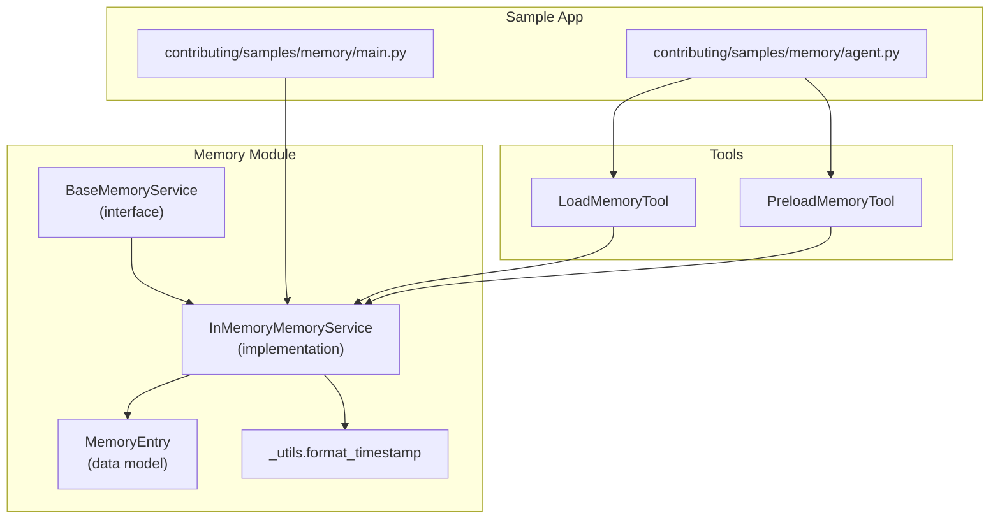
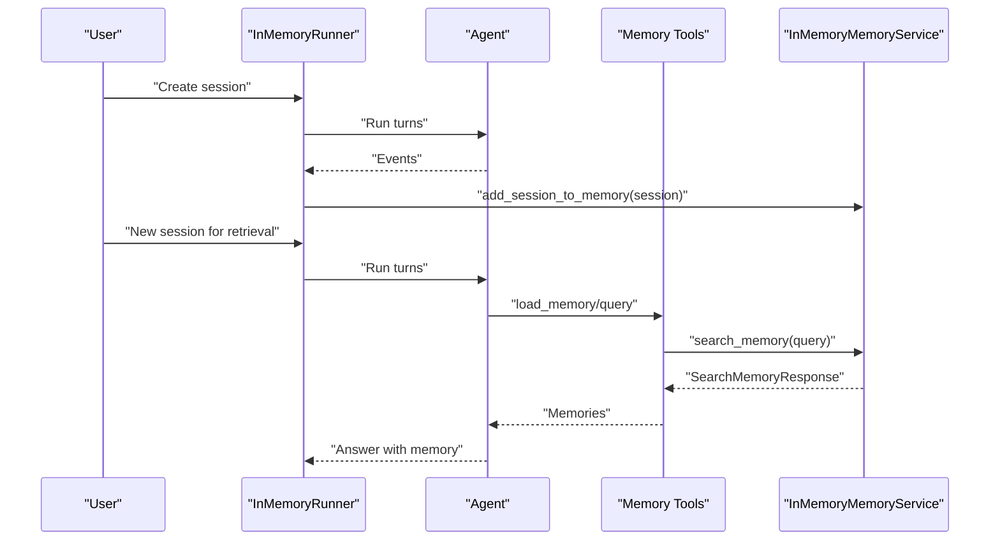
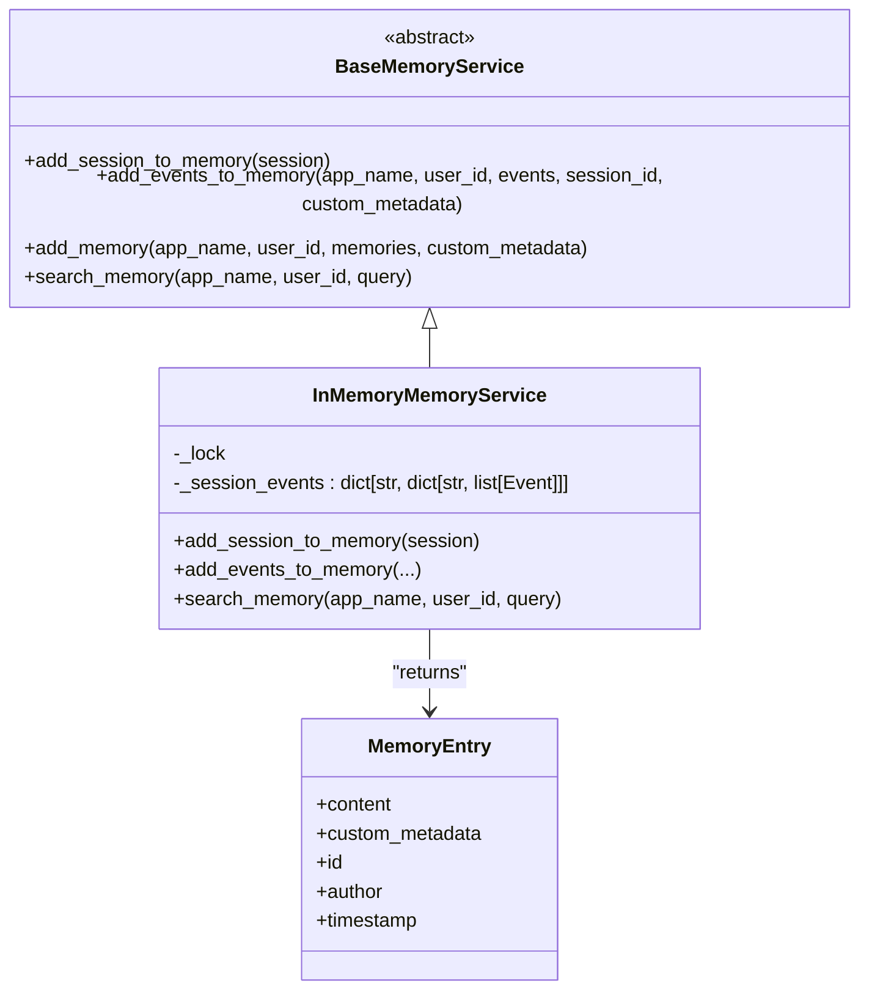
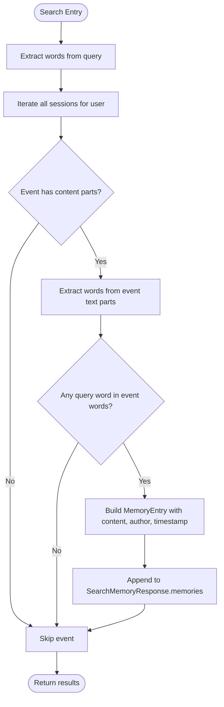
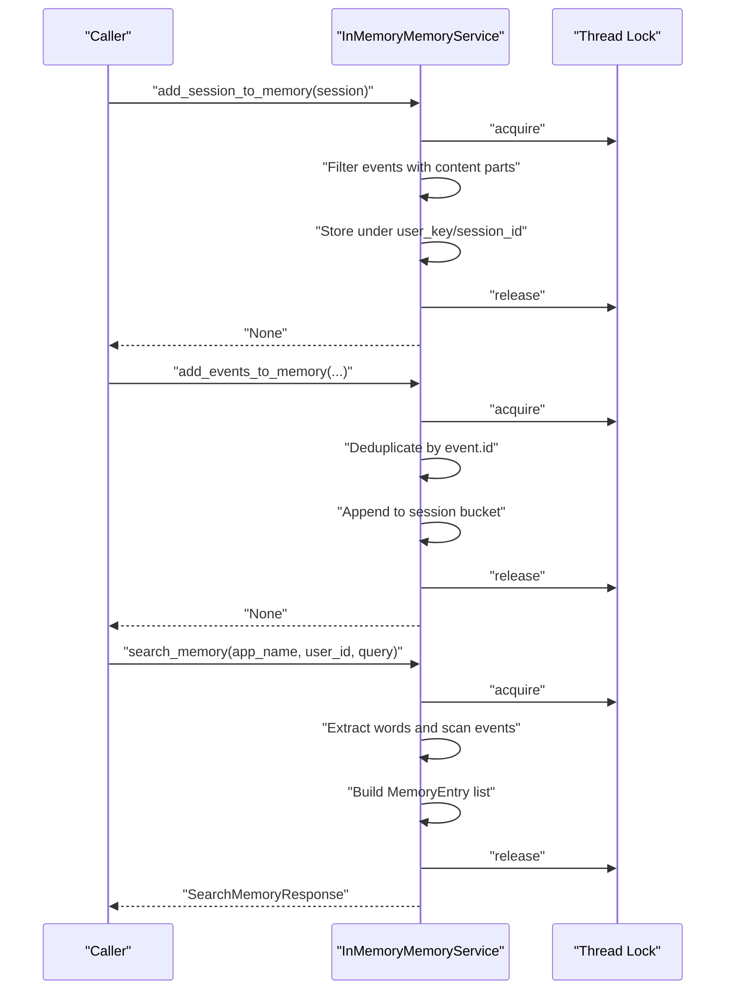
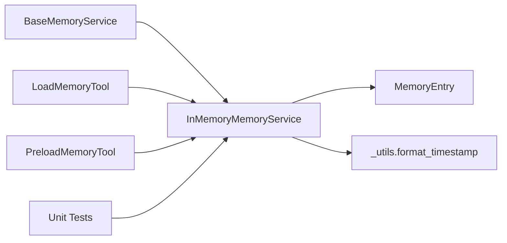

# In-Memory Implementation

<cite>
**Referenced Files in This Document**
- [in_memory_memory_service.py](file://src/google/adk/memory/in_memory_memory_service.py)
- [base_memory_service.py](file://src/google/adk/memory/base_memory_service.py)
- [memory_entry.py](file://src/google/adk/memory/memory_entry.py)
- [_utils.py](file://src/google/adk/memory/_utils.py)
- [test_in_memory_memory_service.py](file://tests/unittests/memory/test_in_memory_memory_service.py)
- [__init__.py](file://src/google/adk/memory/__init__.py)
- [main.py](file://contributing/samples/memory/main.py)
- [agent.py](file://contributing/samples/memory/agent.py)
- [load_memory_tool.py](file://src/google/adk/tools/load_memory_tool.py)
- [preload_memory_tool.py](file://src/google/adk/tools/preload_memory_tool.py)
</cite>

## Table of Contents
1. [Introduction](#introduction)
2. [Project Structure](#project-structure)
3. [Core Components](#core-components)
4. [Architecture Overview](#architecture-overview)
5. [Detailed Component Analysis](#detailed-component-analysis)
6. [Dependency Analysis](#dependency-analysis)
7. [Performance Considerations](#performance-considerations)
8. [Troubleshooting Guide](#troubleshooting-guide)
9. [Conclusion](#conclusion)
10. [Appendices](#appendices)

## Introduction
This document explains the in-memory memory service implementation used for prototyping, development, and testing. It focuses on the InMemoryMemoryService class and its concrete implementation of the BaseMemoryService interface. The service stores conversation history in memory using efficient data structures, applies a keyword-based search strategy, and organizes memory by user and session. We cover ingestion of sessions and event deltas, memory search functionality, configuration and usage examples, performance characteristics, scalability considerations, and the trade-offs of simplicity versus persistence.

## Project Structure
The in-memory memory service resides in the memory module alongside the base interface and shared models. Unit tests validate behavior, and a sample demonstrates practical usage with an in-memory runner and memory tools.

**Diagram sources**
- [base_memory_service.py](file://src/google/adk/memory/base_memory_service.py#L44-L141)
- [in_memory_memory_service.py](file://src/google/adk/memory/in_memory_memory_service.py#L45-L135)
- [memory_entry.py](file://src/google/adk/memory/memory_entry.py#L26-L46)
- [_utils.py](file://src/google/adk/memory/_utils.py#L21-L24)
- [load_memory_tool.py](file://src/google/adk/tools/load_memory_tool.py#L53-L108)
- [preload_memory_tool.py](file://src/google/adk/tools/preload_memory_tool.py#L32-L93)
- [main.py](file://contributing/samples/memory/main.py#L31-L110)
- [agent.py](file://contributing/samples/memory/agent.py#L28-L43)

**Section sources**
- [__init__.py](file://src/google/adk/memory/__init__.py#L14-L38)
- [base_memory_service.py](file://src/google/adk/memory/base_memory_service.py#L44-L141)
- [in_memory_memory_service.py](file://src/google/adk/memory/in_memory_memory_service.py#L45-L135)
- [memory_entry.py](file://src/google/adk/memory/memory_entry.py#L26-L46)
- [_utils.py](file://src/google/adk/memory/_utils.py#L21-L24)

## Core Components
- BaseMemoryService: Defines the contract for memory services, including session ingestion, event delta ingestion, direct memory writes, and search.
- InMemoryMemoryService: Thread-safe in-memory implementation using nested dictionaries keyed by user and session to store events.
- MemoryEntry: Lightweight data model representing a memory item with content, optional metadata, author, and timestamp.
- _utils: Provides timestamp formatting for memory entries.

Key behaviors:
- Ingestion: Adds entire sessions or incremental event deltas while filtering out events without content parts.
- Indexing: Organizes events per user and per session; deduplicates by event ID when appending deltas.
- Search: Performs keyword matching against text parts of events, case-insensitively, returning MemoryEntry objects wrapped in a SearchMemoryResponse.

**Section sources**
- [base_memory_service.py](file://src/google/adk/memory/base_memory_service.py#L44-L141)
- [in_memory_memory_service.py](file://src/google/adk/memory/in_memory_memory_service.py#L45-L135)
- [memory_entry.py](file://src/google/adk/memory/memory_entry.py#L26-L46)
- [_utils.py](file://src/google/adk/memory/_utils.py#L21-L24)

## Architecture Overview
The in-memory memory service integrates with tools and runners to support memory-aware agents. The sample application demonstrates creating sessions, running turns, saving sessions to memory, and querying memory via tools.

**Diagram sources**
- [main.py](file://contributing/samples/memory/main.py#L31-L110)
- [agent.py](file://contributing/samples/memory/agent.py#L28-L43)
- [load_memory_tool.py](file://src/google/adk/tools/load_memory_tool.py#L38-L51)
- [preload_memory_tool.py](file://src/google/adk/tools/preload_memory_tool.py#L47-L90)
- [in_memory_memory_service.py](file://src/google/adk/memory/in_memory_memory_service.py#L63-L135)

## Detailed Component Analysis

### InMemoryMemoryService
Implements BaseMemoryService with:
- Thread-safety via a lock guarding access to internal storage.
- Storage model: a dictionary keyed by user identifiers (app_name/user_id) mapping to another dictionary of session_id to event lists.
- Ingestion methods:
  - add_session_to_memory: filters events to include only those with content parts and stores them under the session’s ID.
  - add_events_to_memory: accepts explicit event deltas, deduplicates by event ID, and appends to the appropriate session bucket (defaulting to an internal unknown session ID when none is provided).
- Search method:
  - search_memory: extracts words from the query and matches them against words extracted from event content parts, case-insensitively, and returns MemoryEntry objects with formatted timestamps.

**Diagram sources**
- [base_memory_service.py](file://src/google/adk/memory/base_memory_service.py#L44-L141)
- [in_memory_memory_service.py](file://src/google/adk/memory/in_memory_memory_service.py#L45-L135)
- [memory_entry.py](file://src/google/adk/memory/memory_entry.py#L26-L46)

**Section sources**
- [in_memory_memory_service.py](file://src/google/adk/memory/in_memory_memory_service.py#L45-L135)

### Data Structures and Indexing Strategy
- Storage layout:
  - Outer key: user key constructed from app_name and user_id.
  - Inner mapping: session_id to a list of Event objects.
- Indexing for search:
  - Words are extracted from the query and from each event’s text parts.
  - Matching is performed by checking if any query word appears in the event’s word set.
- Organization patterns:
  - Per-user scoping ensures isolation across users.
  - Per-session partitioning supports incremental updates and session-aware retrieval.

**Diagram sources**
- [in_memory_memory_service.py](file://src/google/adk/memory/in_memory_memory_service.py#L104-L135)
- [_utils.py](file://src/google/adk/memory/_utils.py#L21-L24)

**Section sources**
- [in_memory_memory_service.py](file://src/google/adk/memory/in_memory_memory_service.py#L57-L135)
- [_utils.py](file://src/google/adk/memory/_utils.py#L21-L24)

### Method Implementations
- add_session_to_memory:
  - Filters events to include only those with content parts.
  - Stores the filtered list under the session’s ID for the given user key.
- add_events_to_memory:
  - Accepts explicit event deltas; deduplicates by event ID to avoid duplicates.
  - Appends to the session bucket identified by session_id or a default unknown session ID.
- search_memory:
  - Builds a SearchMemoryResponse by scanning all stored events for the user.
  - Produces MemoryEntry objects with formatted timestamps.

**Diagram sources**
- [in_memory_memory_service.py](file://src/google/adk/memory/in_memory_memory_service.py#L63-L135)

**Section sources**
- [in_memory_memory_service.py](file://src/google/adk/memory/in_memory_memory_service.py#L63-L135)

### Memory Model and Timestamp Formatting
- MemoryEntry encapsulates content, optional author, optional ID, optional custom metadata, and a timestamp string.
- Timestamps are formatted to ISO 8601 strings for downstream use.

**Section sources**
- [memory_entry.py](file://src/google/adk/memory/memory_entry.py#L26-L46)
- [_utils.py](file://src/google/adk/memory/_utils.py#L21-L24)

### Integration with Tools and Sample Application
- Tools:
  - LoadMemoryTool invokes the memory service to fetch memories for a query and returns them to the agent.
  - PreloadMemoryTool augments the LLM request with a synthesized memory context derived from search results.
- Sample application:
  - Demonstrates creating sessions, running turns, saving sessions to memory, and querying memory via tools to answer questions.

**Section sources**
- [load_memory_tool.py](file://src/google/adk/tools/load_memory_tool.py#L38-L51)
- [preload_memory_tool.py](file://src/google/adk/tools/preload_memory_tool.py#L47-L90)
- [main.py](file://contributing/samples/memory/main.py#L31-L110)
- [agent.py](file://contributing/samples/memory/agent.py#L28-L43)

## Dependency Analysis
The in-memory memory service depends on:
- BaseMemoryService for the interface contract.
- MemoryEntry for response modeling.
- _utils for timestamp formatting.
- Tools for invoking search and preloading memory.
- Tests for validating correctness of ingestion, deduplication, and search behavior.

**Diagram sources**
- [base_memory_service.py](file://src/google/adk/memory/base_memory_service.py#L44-L141)
- [in_memory_memory_service.py](file://src/google/adk/memory/in_memory_memory_service.py#L45-L135)
- [memory_entry.py](file://src/google/adk/memory/memory_entry.py#L26-L46)
- [_utils.py](file://src/google/adk/memory/_utils.py#L21-L24)
- [load_memory_tool.py](file://src/google/adk/tools/load_memory_tool.py#L53-L108)
- [preload_memory_tool.py](file://src/google/adk/tools/preload_memory_tool.py#L32-L93)
- [test_in_memory_memory_service.py](file://tests/unittests/memory/test_in_memory_memory_service.py#L105-L330)

**Section sources**
- [base_memory_service.py](file://src/google/adk/memory/base_memory_service.py#L44-L141)
- [in_memory_memory_service.py](file://src/google/adk/memory/in_memory_memory_service.py#L45-L135)
- [memory_entry.py](file://src/google/adk/memory/memory_entry.py#L26-L46)
- [_utils.py](file://src/google/adk/memory/_utils.py#L21-L24)
- [load_memory_tool.py](file://src/google/adk/tools/load_memory_tool.py#L53-L108)
- [preload_memory_tool.py](file://src/google/adk/tools/preload_memory_tool.py#L32-L93)
- [test_in_memory_memory_service.py](file://tests/unittests/memory/test_in_memory_memory_service.py#L105-L330)

## Performance Considerations
- Time complexity:
  - Ingestion of a session: O(N) where N is the number of events in the session.
  - Ingestion of event deltas: O(D) where D is the number of incoming events, with O(1) deduplication checks per event.
  - Search: O(U × S × E) where U is the number of sessions for the user, S is average events per session, and E is the average number of words per event. Word extraction and set membership checks are linear in the number of words.
- Space complexity:
  - Proportional to total stored events and their content parts.
- Concurrency:
  - Thread-safe via a lock; contention may occur under heavy concurrent ingestion/search workloads.
- Scalability:
  - Not suitable for multi-process or multi-instance deployments; data is process-local.
  - Not designed for large-scale persistent storage; intended for development and testing.

[No sources needed since this section provides general guidance]

## Troubleshooting Guide
Common issues and resolutions:
- Events without content parts are ignored during ingestion. Ensure events include content parts to appear in memory.
- Duplicate event IDs are prevented when appending deltas; subsequent additions with the same ID will not increase size.
- Unknown session IDs are used when no session_id is provided for event deltas; ensure to pass a meaningful session_id for precise partitioning.
- Search is case-insensitive and word-based; ensure query terms align with the text parts of events.
- User scoping isolates memories by user_id; verify app_name and user_id match the stored keys when searching.

Validation references:
- Ingestion and filtering of events without content.
- Deduplication of event IDs during delta ingestion.
- Default bucket usage when session_id is omitted.
- Case-insensitive and multi-word matching behavior.
- User-scoped search isolation.

**Section sources**
- [test_in_memory_memory_service.py](file://tests/unittests/memory/test_in_memory_memory_service.py#L106-L330)
- [in_memory_memory_service.py](file://src/google/adk/memory/in_memory_memory_service.py#L63-L135)

## Conclusion
The InMemoryMemoryService provides a simple, thread-safe, keyword-based memory solution ideal for prototyping, development, and testing. It organizes data by user and session, supports incremental event deltas with deduplication, and offers straightforward search semantics. While not suited for production persistence or horizontal scaling, it enables rapid iteration and validation of memory-aware agent behaviors.

[No sources needed since this section summarizes without analyzing specific files]

## Appendices

### Configuration and Usage Examples
- Using the in-memory memory service with the sample application:
  - Create sessions, run turns, and save sessions to memory.
  - Invoke memory tools to load or preload memories for answering questions.
- Typical steps:
  - Initialize an InMemoryRunner and run sessions.
  - After collecting conversational turns, call add_session_to_memory(session).
  - Use load_memory_tool or preload_memory_tool to surface memories in agent prompts.

**Section sources**
- [main.py](file://contributing/samples/memory/main.py#L31-L110)
- [agent.py](file://contributing/samples/memory/agent.py#L28-L43)
- [load_memory_tool.py](file://src/google/adk/tools/load_memory_tool.py#L38-L51)
- [preload_memory_tool.py](file://src/google/adk/tools/preload_memory_tool.py#L47-L90)

### Trade-offs Between Simplicity and Persistence
- Simplicity:
  - Minimal dependencies, easy to reason about, and fast to set up.
- Limitations:
  - No persistence across process restarts.
  - No cross-instance sharing.
  - No advanced indexing or semantic search.
- When to use:
  - Local development, unit/integration tests, demos, and early-stage experimentation.
- When to move to persistent solutions:
  - Multi-instance deployments, production workloads, or when semantic search and advanced indexing are required.

[No sources needed since this section provides general guidance]