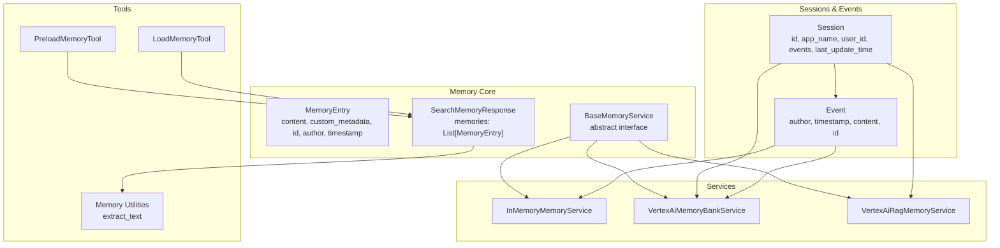
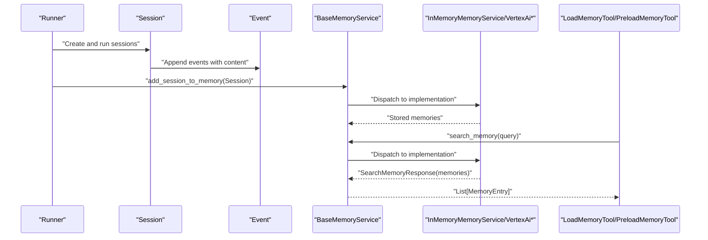
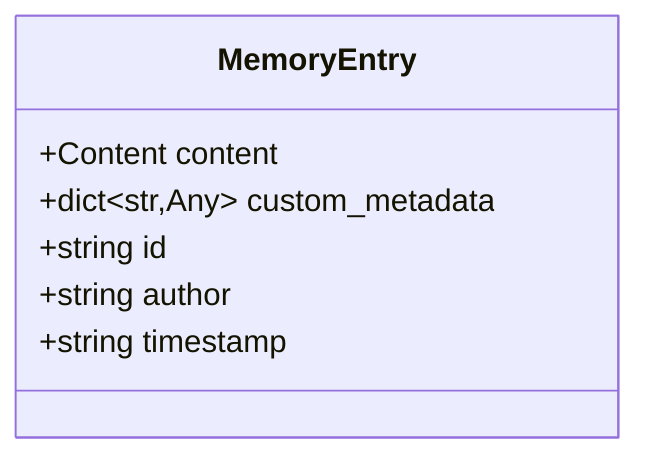
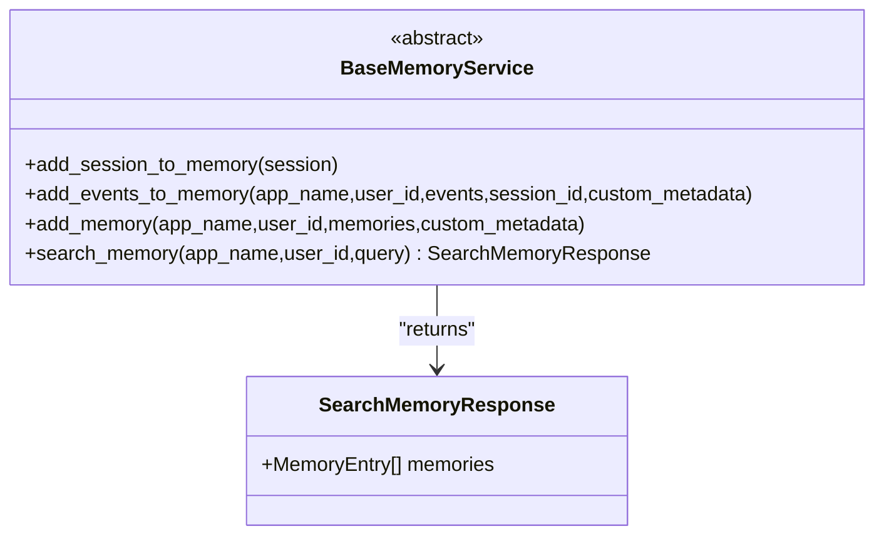
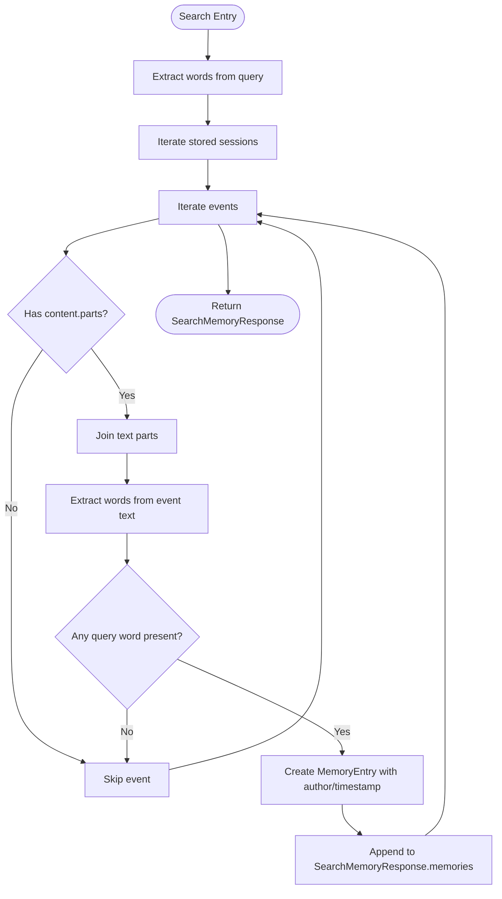
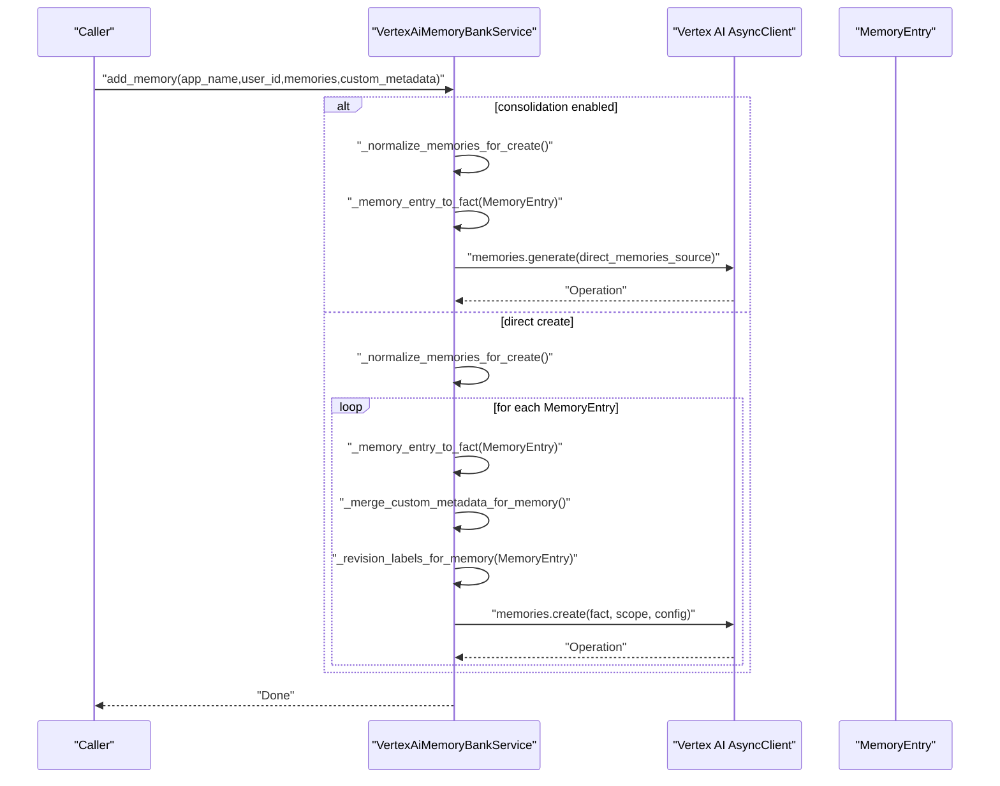
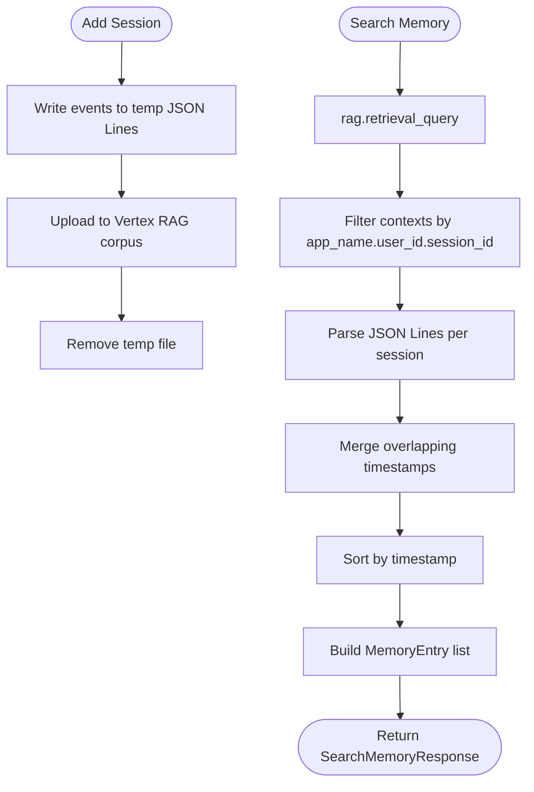
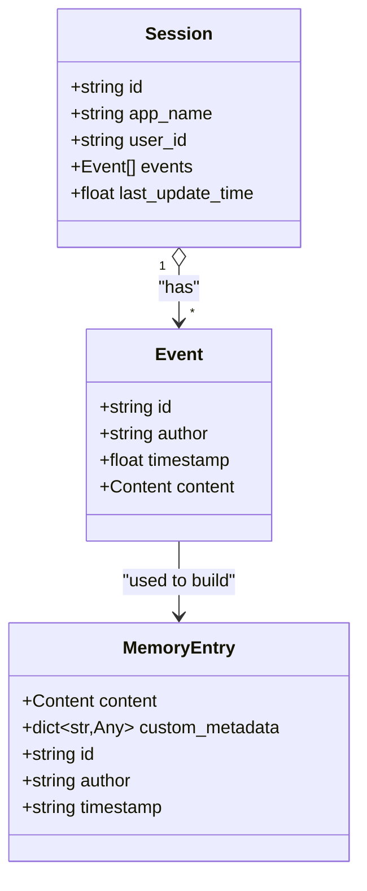
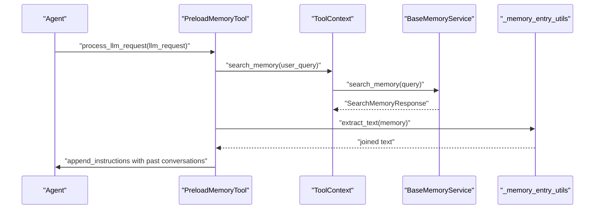
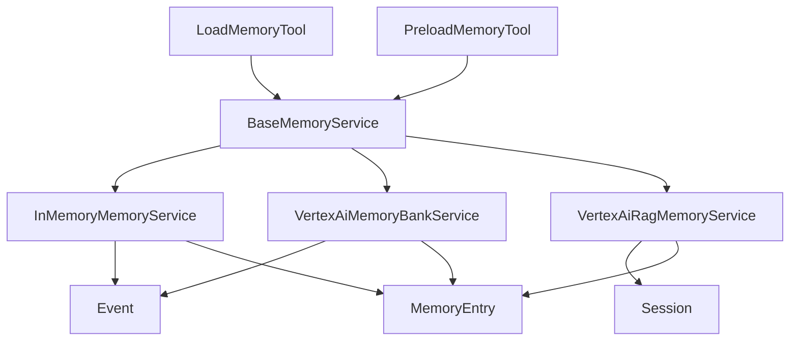

# Memory Entry Management

<cite>
**Referenced Files in This Document**
- [memory_entry.py](file://src/google/adk/memory/memory_entry.py)
- [base_memory_service.py](file://src/google/adk/memory/base_memory_service.py)
- [in_memory_memory_service.py](file://src/google/adk/memory/in_memory_memory_service.py)
- [vertex_ai_memory_bank_service.py](file://src/google/adk/memory/vertex_ai_memory_bank_service.py)
- [vertex_ai_rag_memory_service.py](file://src/google/adk/memory/vertex_ai_rag_memory_service.py)
- [_utils.py](file://src/google/adk/memory/_utils.py)
- [event.py](file://src/google/adk/events/event.py)
- [session.py](file://src/google/adk/sessions/session.py)
- [_memory_entry_utils.py](file://src/google/adk/tools/_memory_entry_utils.py)
- [load_memory_tool.py](file://src/google/adk/tools/load_memory_tool.py)
- [preload_memory_tool.py](file://src/google/adk/tools/preload_memory_tool.py)
- [__init__.py](file://src/google/adk/memory/__init__.py)
- [test_in_memory_memory_service.py](file://tests/unittests/memory/test_in_memory_memory_service.py)
- [main.py](file://contributing/samples/memory/main.py)
- [agent.py](file://contributing/samples/memory/agent.py)
</cite>

## Table of Contents
1. [Introduction](#introduction)
2. [Project Structure](#project-structure)
3. [Core Components](#core-components)
4. [Architecture Overview](#architecture-overview)
5. [Detailed Component Analysis](#detailed-component-analysis)
6. [Dependency Analysis](#dependency-analysis)
7. [Performance Considerations](#performance-considerations)
8. [Troubleshooting Guide](#troubleshooting-guide)
9. [Conclusion](#conclusion)
10. [Appendices](#appendices)

## Introduction
This document explains memory entry management in the Agent Development Kit (ADK). It focuses on the MemoryEntry data model, how memory entries represent individual memory units, and how they are created, transformed, searched, and stored across different memory services. It also covers serialization/deserialization, best practices for content formatting and metadata, and strategies for versioning and backward compatibility.

## Project Structure
The memory subsystem centers around a shared data model (MemoryEntry) and pluggable memory services. Sessions and Events feed content into memory services, which normalize and persist them. Tools integrate memory into agent workflows.

**Diagram sources**
- [memory_entry.py](file://src/google/adk/memory/memory_entry.py#L26-L46)
- [base_memory_service.py](file://src/google/adk/memory/base_memory_service.py#L34-L141)
- [in_memory_memory_service.py](file://src/google/adk/memory/in_memory_memory_service.py#L45-L135)
- [vertex_ai_memory_bank_service.py](file://src/google/adk/memory/vertex_ai_memory_bank_service.py#L141-L765)
- [vertex_ai_rag_memory_service.py](file://src/google/adk/memory/vertex_ai_rag_memory_service.py#L38-L203)
- [session.py](file://src/google/adk/sessions/session.py#L27-L51)
- [event.py](file://src/google/adk/events/event.py#L31-L130)
- [load_memory_tool.py](file://src/google/adk/tools/load_memory_tool.py#L34-L108)
- [preload_memory_tool.py](file://src/google/adk/tools/preload_memory_tool.py#L32-L93)
- [_memory_entry_utils.py](file://src/google/adk/tools/_memory_entry_utils.py#L24-L31)

**Section sources**
- [memory_entry.py](file://src/google/adk/memory/memory_entry.py#L26-L46)
- [base_memory_service.py](file://src/google/adk/memory/base_memory_service.py#L44-L141)
- [in_memory_memory_service.py](file://src/google/adk/memory/in_memory_memory_service.py#L45-L135)
- [vertex_ai_memory_bank_service.py](file://src/google/adk/memory/vertex_ai_memory_bank_service.py#L141-L765)
- [vertex_ai_rag_memory_service.py](file://src/google/adk/memory/vertex_ai_rag_memory_service.py#L38-L203)
- [session.py](file://src/google/adk/sessions/session.py#L27-L51)
- [event.py](file://src/google/adk/events/event.py#L31-L130)
- [load_memory_tool.py](file://src/google/adk/tools/load_memory_tool.py#L34-L108)
- [preload_memory_tool.py](file://src/google/adk/tools/preload_memory_tool.py#L32-L93)
- [_memory_entry_utils.py](file://src/google/adk/tools/_memory_entry_utils.py#L24-L31)

## Core Components
- MemoryEntry: The canonical representation of a memory unit with content, optional custom metadata, optional identifiers, author, and timestamp.
- BaseMemoryService: Defines the contract for ingesting sessions/events and searching memory.
- InMemoryMemoryService: Prototype service using keyword matching; stores events per user and session.
- VertexAiMemoryBankService: Integrates with Vertex AI Memory Bank for generation, creation, and retrieval of memories.
- VertexAiRagMemoryService: Stores and retrieves memory via Vertex AI RAG, using temporary files and JSON lines.
- Event and Session: Provide the source content and context for memory ingestion.
- Tools: LoadMemoryTool and PreloadMemoryTool surface memory to agents.

**Section sources**
- [memory_entry.py](file://src/google/adk/memory/memory_entry.py#L26-L46)
- [base_memory_service.py](file://src/google/adk/memory/base_memory_service.py#L44-L141)
- [in_memory_memory_service.py](file://src/google/adk/memory/in_memory_memory_service.py#L45-L135)
- [vertex_ai_memory_bank_service.py](file://src/google/adk/memory/vertex_ai_memory_bank_service.py#L141-L765)
- [vertex_ai_rag_memory_service.py](file://src/google/adk/memory/vertex_ai_rag_memory_service.py#L38-L203)
- [event.py](file://src/google/adk/events/event.py#L31-L130)
- [session.py](file://src/google/adk/sessions/session.py#L27-L51)
- [load_memory_tool.py](file://src/google/adk/tools/load_memory_tool.py#L34-L108)
- [preload_memory_tool.py](file://src/google/adk/tools/preload_memory_tool.py#L32-L93)

## Architecture Overview
MemoryEntry is the central data structure. Services implement ingestion and search. Events and Sessions are transformed into MemoryEntry instances for storage and retrieval. Tools consume SearchMemoryResponse to augment agent prompts.

**Diagram sources**
- [base_memory_service.py](file://src/google/adk/memory/base_memory_service.py#L51-L141)
- [in_memory_memory_service.py](file://src/google/adk/memory/in_memory_memory_service.py#L62-L135)
- [vertex_ai_memory_bank_service.py](file://src/google/adk/memory/vertex_ai_memory_bank_service.py#L188-L388)
- [vertex_ai_rag_memory_service.py](file://src/google/adk/memory/vertex_ai_rag_memory_service.py#L66-L176)
- [session.py](file://src/google/adk/sessions/session.py#L27-L51)
- [event.py](file://src/google/adk/events/event.py#L31-L130)
- [load_memory_tool.py](file://src/google/adk/tools/load_memory_tool.py#L38-L51)
- [preload_memory_tool.py](file://src/google/adk/tools/preload_memory_tool.py#L47-L93)

## Detailed Component Analysis

### MemoryEntry Data Model
- Purpose: Represents a single memory unit suitable for storage and retrieval.
- Fields:
  - content: Content carrying text and/or structured parts.
  - custom_metadata: Arbitrary dictionary for service-specific attributes.
  - id: Optional unique identifier.
  - author: Optional author string.
  - timestamp: Optional ISO 8601-formatted timestamp string.
- Serialization: Pydantic model; content serializes via model_dump(mode="json") in Vertex AI Memory Bank integration.

**Diagram sources**
- [memory_entry.py](file://src/google/adk/memory/memory_entry.py#L26-L46)

**Section sources**
- [memory_entry.py](file://src/google/adk/memory/memory_entry.py#L26-L46)

### BaseMemoryService Contract
- Responsibilities:
  - Ingest sessions or explicit events into memory.
  - Accept direct MemoryEntry writes when supported.
  - Search memory and return SearchMemoryResponse.
- Design:
  - Abstract methods enforce consistent behavior across implementations.
  - Optional overrides indicate unsupported operations.

**Diagram sources**
- [base_memory_service.py](file://src/google/adk/memory/base_memory_service.py#L44-L141)

**Section sources**
- [base_memory_service.py](file://src/google/adk/memory/base_memory_service.py#L44-L141)

### InMemoryMemoryService
- Behavior:
  - Stores events per user scope and session bucket.
  - Keyword-based search using word matching.
  - Thread-safe with a lock; designed for testing/prototyping.
- Ingestion:
  - add_session_to_memory: Filters events with empty content.
  - add_events_to_memory: Deduplicates by event id; supports unknown session bucket when session_id is absent.
- Search:
  - Builds a SearchMemoryResponse by extracting text from event parts and matching words.

**Diagram sources**
- [in_memory_memory_service.py](file://src/google/adk/memory/in_memory_memory_service.py#L104-L135)
- [_utils.py](file://src/google/adk/memory/_utils.py#L21-L24)

**Section sources**
- [in_memory_memory_service.py](file://src/google/adk/memory/in_memory_memory_service.py#L45-L135)
- [_utils.py](file://src/google/adk/memory/_utils.py#L21-L24)

### VertexAiMemoryBankService
- Capabilities:
  - Generate memories from events or create memories directly.
  - Consolidation via generate with direct_memories_source.
  - Metadata and revision labels support.
  - Retrieval using similarity search.
- Ingestion:
  - add_session_to_memory: Converts session events to direct contents and invokes generate.
  - add_events_to_memory: Processes explicit events similarly.
  - add_memory: Writes MemoryEntry items directly via create or consolidate via generate.
- Normalization and Validation:
  - Validates inputs and raises errors for unsupported content types.
  - Builds facts from MemoryEntry content parts.
- Metadata and Revision Labels:
  - Merges custom metadata with MemoryEntry metadata.
  - Builds revision labels from author and timestamp.
- Retrieval:
  - Uses retrieve API and wraps results into MemoryEntry.

**Diagram sources**
- [vertex_ai_memory_bank_service.py](file://src/google/adk/memory/vertex_ai_memory_bank_service.py#L224-L388)

**Section sources**
- [vertex_ai_memory_bank_service.py](file://src/google/adk/memory/vertex_ai_memory_bank_service.py#L141-L765)

### VertexAiRagMemoryService
- Storage:
  - Writes session events to a temporary JSON Lines file.
  - Uploads to Vertex AI RAG corpus with display_name encoding session identity.
- Retrieval:
  - Uses rag.retrieval_query to fetch contexts.
  - Parses JSON Lines, filters by app_name.user_id.session_id, merges overlapping timestamps, sorts by timestamp, and builds MemoryEntry.

**Diagram sources**
- [vertex_ai_rag_memory_service.py](file://src/google/adk/memory/vertex_ai_rag_memory_service.py#L66-L176)

**Section sources**
- [vertex_ai_rag_memory_service.py](file://src/google/adk/memory/vertex_ai_rag_memory_service.py#L38-L203)

### Relationship to Sessions and Events
- Sessions encapsulate user/app scope and a list of events.
- Events carry content parts and timestamps; they are the primary source for memory ingestion.
- MemoryEntry mirrors event content and adds optional metadata and identifiers.

**Diagram sources**
- [session.py](file://src/google/adk/sessions/session.py#L27-L51)
- [event.py](file://src/google/adk/events/event.py#L31-L130)
- [memory_entry.py](file://src/google/adk/memory/memory_entry.py#L26-L46)

**Section sources**
- [session.py](file://src/google/adk/sessions/session.py#L27-L51)
- [event.py](file://src/google/adk/events/event.py#L31-L130)
- [memory_entry.py](file://src/google/adk/memory/memory_entry.py#L26-L46)

### Tools Integration
- LoadMemoryTool: Searches memory and returns MemoryEntry list for downstream use.
- PreloadMemoryTool: Automatically augments LLM requests with relevant memory snippets extracted from MemoryEntry.

**Diagram sources**
- [preload_memory_tool.py](file://src/google/adk/tools/preload_memory_tool.py#L47-L93)
- [_memory_entry_utils.py](file://src/google/adk/tools/_memory_entry_utils.py#L24-L31)
- [load_memory_tool.py](file://src/google/adk/tools/load_memory_tool.py#L38-L51)

**Section sources**
- [load_memory_tool.py](file://src/google/adk/tools/load_memory_tool.py#L34-L108)
- [preload_memory_tool.py](file://src/google/adk/tools/preload_memory_tool.py#L32-L93)
- [_memory_entry_utils.py](file://src/google/adk/tools/_memory_entry_utils.py#L24-L31)

## Dependency Analysis
- Cohesion: MemoryEntry is cohesive and reusable across services.
- Coupling: Services depend on BaseMemoryService; implementations depend on Event/Session for ingestion and on Vertex SDK for external APIs.
- External Dependencies: Vertex AI SDK for Memory Bank and RAG; Pydantic for serialization; Google genai types for Content/Part.

**Diagram sources**
- [base_memory_service.py](file://src/google/adk/memory/base_memory_service.py#L44-L141)
- [in_memory_memory_service.py](file://src/google/adk/memory/in_memory_memory_service.py#L45-L135)
- [vertex_ai_memory_bank_service.py](file://src/google/adk/memory/vertex_ai_memory_bank_service.py#L141-L765)
- [vertex_ai_rag_memory_service.py](file://src/google/adk/memory/vertex_ai_rag_memory_service.py#L38-L203)
- [event.py](file://src/google/adk/events/event.py#L31-L130)
- [session.py](file://src/google/adk/sessions/session.py#L27-L51)
- [load_memory_tool.py](file://src/google/adk/tools/load_memory_tool.py#L34-L108)
- [preload_memory_tool.py](file://src/google/adk/tools/preload_memory_tool.py#L32-L93)

**Section sources**
- [base_memory_service.py](file://src/google/adk/memory/base_memory_service.py#L44-L141)
- [in_memory_memory_service.py](file://src/google/adk/memory/in_memory_memory_service.py#L45-L135)
- [vertex_ai_memory_bank_service.py](file://src/google/adk/memory/vertex_ai_memory_bank_service.py#L141-L765)
- [vertex_ai_rag_memory_service.py](file://src/google/adk/memory/vertex_ai_rag_memory_service.py#L38-L203)
- [event.py](file://src/google/adk/events/event.py#L31-L130)
- [session.py](file://src/google/adk/sessions/session.py#L27-L51)
- [load_memory_tool.py](file://src/google/adk/tools/load_memory_tool.py#L34-L108)
- [preload_memory_tool.py](file://src/google/adk/tools/preload_memory_tool.py#L32-L93)

## Performance Considerations
- InMemoryMemoryService:
  - Keyword matching scales linearly with stored events; consider indexing or limiting stored sessions for large workloads.
  - Thread-safety is ensured via locking; avoid long operations under the lock.
- VertexAiMemoryBankService:
  - Batch generation respects a limit on direct memories per call; batching is handled internally.
  - Metadata and revision labels are constructed per memory; minimize unnecessary metadata to reduce overhead.
- VertexAiRagMemoryService:
  - Temporary file I/O and JSON parsing; ensure efficient session sizes and consider corpus quotas.
- Serialization:
  - Content serialization uses JSON mode; keep content concise to reduce payload sizes.

[No sources needed since this section provides general guidance]

## Troubleshooting Guide
- Empty or missing content:
  - Events without content or parts are filtered out during ingestion in both in-memory and Vertex services.
- Unsupported content types:
  - Vertex AI Memory Bank requires text-only content for direct create; inline_data and file_data are rejected.
- Missing agent engine ID:
  - VertexAiMemoryBankService requires agent_engine_id; initialization will fail otherwise.
- RAG corpus not configured:
  - VertexAiRagMemoryService requires rag_corpus; initialization will fail if unset.
- Timestamp formatting:
  - InMemoryMemoryService formats timestamps to ISO 8601 strings; ensure consistent timezones.

**Section sources**
- [in_memory_memory_service.py](file://src/google/adk/memory/in_memory_memory_service.py#L63-L135)
- [vertex_ai_memory_bank_service.py](file://src/google/adk/memory/vertex_ai_memory_bank_service.py#L188-L388)
- [vertex_ai_rag_memory_service.py](file://src/google/adk/memory/vertex_ai_rag_memory_service.py#L41-L107)
- [_utils.py](file://src/google/adk/memory/_utils.py#L21-L24)

## Conclusion
MemoryEntry is the core abstraction enabling flexible memory ingestion and retrieval across services. InMemoryMemoryService offers a lightweight prototype, while VertexAiMemoryBankService and VertexAiRagMemoryService provide production-grade capabilities with robust normalization, metadata handling, and retrieval. Tools integrate memory seamlessly into agent workflows, enabling contextual answers and improved user experiences.

[No sources needed since this section summarizes without analyzing specific files]

## Appendices

### Lifecycle of a Memory Entry
- Creation:
  - From Event content during ingestion.
  - Optionally augmented with custom_metadata, author, and timestamp.
- Transformation:
  - Normalization and validation in Vertex services.
  - Fact construction for direct create.
  - Metadata and revision labels assembly.
- Storage:
  - In-memory keyword store or external Vertex AI Memory Bank/RAG.
- Retrieval:
  - Keyword search or similarity search; wrapped into MemoryEntry for tools.
- Consumption:
  - Tools extract text and inject context into agent prompts.

**Section sources**
- [in_memory_memory_service.py](file://src/google/adk/memory/in_memory_memory_service.py#L63-L135)
- [vertex_ai_memory_bank_service.py](file://src/google/adk/memory/vertex_ai_memory_bank_service.py#L288-L388)
- [vertex_ai_rag_memory_service.py](file://src/google/adk/memory/vertex_ai_rag_memory_service.py#L66-L176)
- [_memory_entry_utils.py](file://src/google/adk/tools/_memory_entry_utils.py#L24-L31)

### Serialization and Deserialization
- MemoryEntry:
  - Pydantic model; content serialized via model_dump(mode="json").
- Vertex AI Memory Bank:
  - Direct contents and facts use JSON serialization; metadata converted to Vertex-compatible shapes.
- Vertex AI RAG:
  - JSON Lines format written to temporary files; parsed back on retrieval.

**Section sources**
- [memory_entry.py](file://src/google/adk/memory/memory_entry.py#L26-L46)
- [vertex_ai_memory_bank_service.py](file://src/google/adk/memory/vertex_ai_memory_bank_service.py#L269-L270)
- [vertex_ai_rag_memory_service.py](file://src/google/adk/memory/vertex_ai_rag_memory_service.py#L82-L88)

### Best Practices for Memory Entry Design
- Content Formatting:
  - Prefer plain text parts for broad compatibility; avoid unsupported binary payloads in Vertex Memory Bank direct create.
  - Normalize whitespace and trim content to reduce noise.
- Metadata Organization:
  - Use custom_metadata for service-specific attributes; keep keys consistent across deployments.
  - Leverage revision_labels for author and timestamp to enable targeted updates.
- Storage Optimization:
  - Filter out empty or irrelevant events early.
  - Limit stored sessions for in-memory service; consider TTL and retention policies via service-specific metadata.
- Versioning and Backward Compatibility:
  - Maintain stable MemoryEntry schema; avoid breaking changes to required fields.
  - Use custom_metadata for experimental features; guard with capability checks.
  - Preserve backward compatibility by falling back to static allowlists when SDK introspection is unavailable.

**Section sources**
- [vertex_ai_memory_bank_service.py](file://src/google/adk/memory/vertex_ai_memory_bank_service.py#L417-L491)
- [vertex_ai_memory_bank_service.py](file://src/google/adk/memory/vertex_ai_memory_bank_service.py#L493-L581)
- [vertex_ai_memory_bank_service.py](file://src/google/adk/memory/vertex_ai_memory_bank_service.py#L95-L139)

### Examples: Working with Memory Entries
- In-memory search:
  - Add sessions; perform keyword search; inspect MemoryEntry content and author.
- Vertex AI Memory Bank:
  - Add sessions or explicit events; optionally enable consolidation; search with similarity.
- Vertex AI RAG:
  - Add sessions; search with retrieval query; merge and sort overlapping events.
- Tools:
  - LoadMemoryTool returns MemoryEntry list; PreloadMemoryTool augments prompts with formatted memory text.

**Section sources**
- [test_in_memory_memory_service.py](file://tests/unittests/memory/test_in_memory_memory_service.py#L106-L330)
- [main.py](file://contributing/samples/memory/main.py#L31-L110)
- [agent.py](file://contributing/samples/memory/agent.py#L28-L43)
- [load_memory_tool.py](file://src/google/adk/tools/load_memory_tool.py#L38-L51)
- [preload_memory_tool.py](file://src/google/adk/tools/preload_memory_tool.py#L47-L93)

### Module Initialization and Availability
- The memory package exports core services and conditionally exposes Vertex AI RAG service if the SDK is available.

**Section sources**
- [__init__.py](file://src/google/adk/memory/__init__.py#L14-L38)