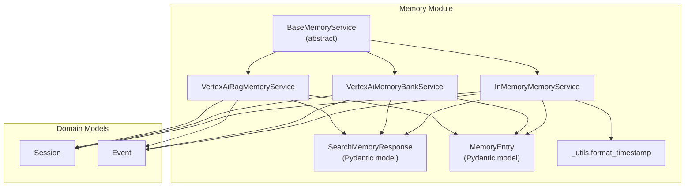
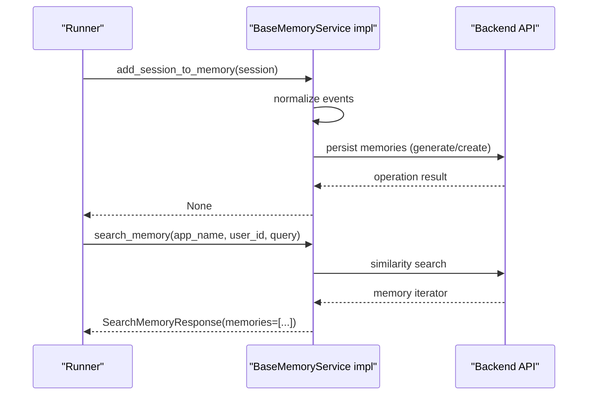
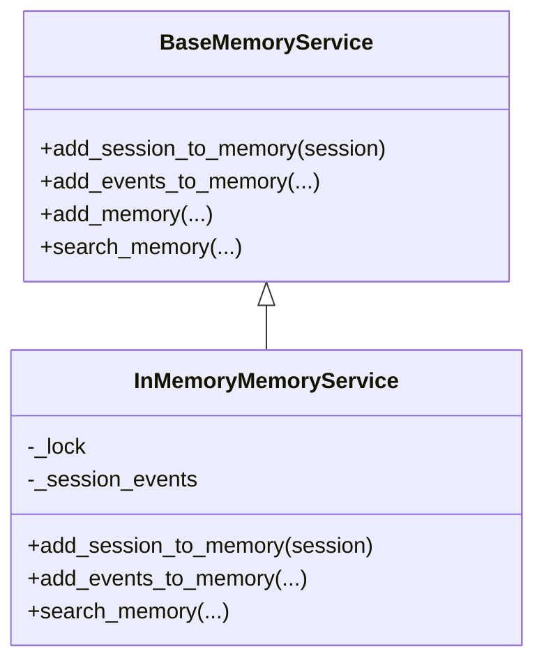
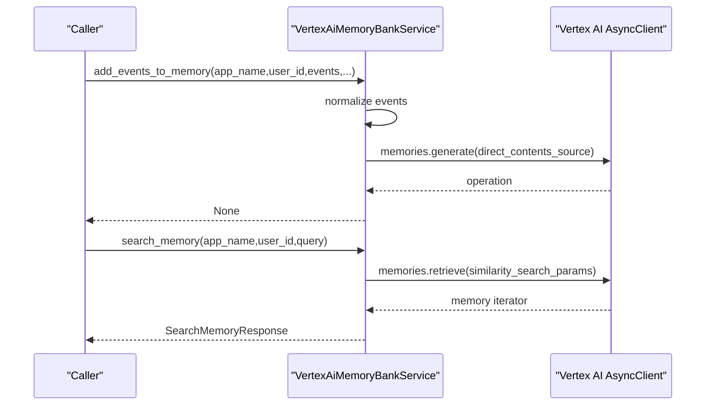
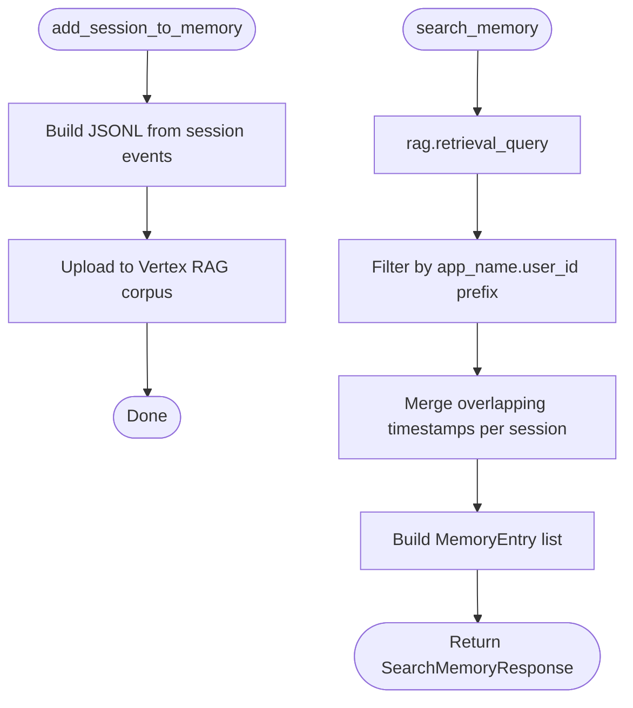
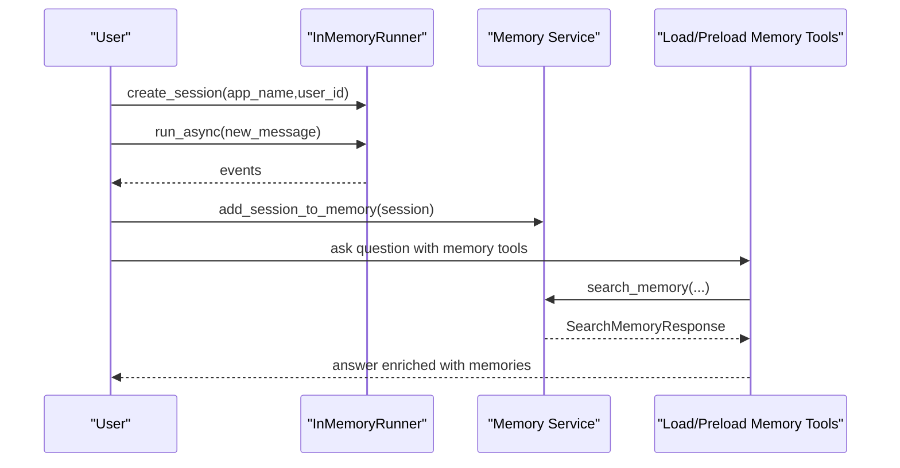
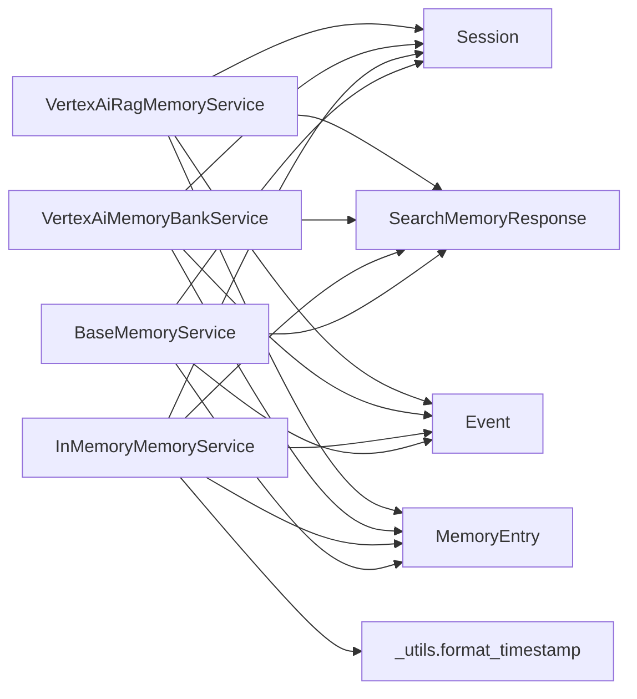

# Memory Service Architecture

<cite>
**Referenced Files in This Document**
- [base_memory_service.py](file://src/google/adk/memory/base_memory_service.py)
- [memory_entry.py](file://src/google/adk/memory/memory_entry.py)
- [__init__.py](file://src/google/adk/memory/__init__.py)
- [in_memory_memory_service.py](file://src/google/adk/memory/in_memory_memory_service.py)
- [_utils.py](file://src/google/adk/memory/_utils.py)
- [vertex_ai_memory_bank_service.py](file://src/google/adk/memory/vertex_ai_memory_bank_service.py)
- [vertex_ai_rag_memory_service.py](file://src/google/adk/memory/vertex_ai_rag_memory_service.py)
- [event.py](file://src/google/adk/events/event.py)
- [session.py](file://src/google/adk/sessions/session.py)
- [main.py](file://contributing/samples/memory/main.py)
- [dummy_services.py](file://contributing/samples/dummy_services.py)
</cite>

## Table of Contents
1. [Introduction](#introduction)
2. [Project Structure](#project-structure)
3. [Core Components](#core-components)
4. [Architecture Overview](#architecture-overview)
5. [Detailed Component Analysis](#detailed-component-analysis)
6. [Dependency Analysis](#dependency-analysis)
7. [Performance Considerations](#performance-considerations)
8. [Troubleshooting Guide](#troubleshooting-guide)
9. [Conclusion](#conclusion)
10. [Appendices](#appendices)

## Introduction
This document explains the memory service architecture in the Agent Development Kit (ADK). It focuses on the BaseMemoryService abstract class and its core asynchronous interfaces: add_session_to_memory, add_events_to_memory, add_memory, and search_memory. It also documents the SearchMemoryResponse model and MemoryEntry structure, outlines abstract method contracts, and demonstrates how the service abstraction enables pluggable memory backends. Architectural diagrams illustrate relationships among memory services, sessions, and events, and the design principles behind the interface are explained alongside async/await patterns used throughout the APIs.

## Project Structure
The memory subsystem resides under src/google/adk/memory and includes:
- Base abstractions and models
- Pluggable implementations (in-memory, Vertex AI Memory Bank, Vertex AI RAG)
- Utilities for timestamp formatting
- Public exports and optional Vertex RAG service

**Diagram sources**
- [base_memory_service.py](file://src/google/adk/memory/base_memory_service.py#L44-L141)
- [memory_entry.py](file://src/google/adk/memory/memory_entry.py#L26-L46)
- [in_memory_memory_service.py](file://src/google/adk/memory/in_memory_memory_service.py#L45-L135)
- [vertex_ai_memory_bank_service.py](file://src/google/adk/memory/vertex_ai_memory_bank_service.py#L141-L388)
- [vertex_ai_rag_memory_service.py](file://src/google/adk/memory/vertex_ai_rag_memory_service.py#L38-L176)
- [_utils.py](file://src/google/adk/memory/_utils.py#L21-L24)
- [session.py](file://src/google/adk/sessions/session.py#L27-L51)
- [event.py](file://src/google/adk/events/event.py#L31-L130)

**Section sources**
- [__init__.py](file://src/google/adk/memory/__init__.py#L16-L38)

## Core Components
- BaseMemoryService: Defines the contract for memory ingestion and retrieval. All methods are asynchronous and accept scoping parameters app_name and user_id. It declares four methods:
  - add_session_to_memory(session): Ingest a full session
  - add_events_to_memory(...): Ingest a delta of events
  - add_memory(...): Write explicit MemoryEntry items
  - search_memory(...): Retrieve relevant memories for a query
- SearchMemoryResponse: Pydantic model containing a list of MemoryEntry results.
- MemoryEntry: Pydantic model representing a single memory item with content, optional custom metadata, optional id, author, and timestamp.

Key design characteristics:
- Async/await throughout for non-blocking I/O
- Scoping via app_name and user_id
- Optional session_id for event ingestion
- Portable custom_metadata for service-specific configuration
- Optional direct memory writes via add_memory (not all services support it)

**Section sources**
- [base_memory_service.py](file://src/google/adk/memory/base_memory_service.py#L44-L141)
- [memory_entry.py](file://src/google/adk/memory/memory_entry.py#L26-L46)

## Architecture Overview
The memory service abstraction enables pluggable backends. Implementations can:
- Convert sessions/events into memory entries
- Persist them using backend-specific APIs
- Retrieve semantically similar memories for a query
- Optionally support direct memory writes

**Diagram sources**
- [base_memory_service.py](file://src/google/adk/memory/base_memory_service.py#L51-L141)
- [vertex_ai_memory_bank_service.py](file://src/google/adk/memory/vertex_ai_memory_bank_service.py#L188-L388)
- [in_memory_memory_service.py](file://src/google/adk/memory/in_memory_memory_service.py#L62-L135)

## Detailed Component Analysis

### BaseMemoryService Contract
- add_session_to_memory(session: Session) -> None
  - Purpose: Ingest a full session into memory
  - Parameters: session (Session)
  - Notes: Sessions are scoped by app_name and user_id
- add_events_to_memory(..., app_name: str, user_id: str, events: Sequence[Event], session_id: str | None = None, custom_metadata: Mapping[str, object] | None = None) -> None
  - Purpose: Ingest a delta of events (incremental update)
  - Notes: Implementations may ignore session_id if not applicable; raises NotImplementedError if unsupported
- add_memory(..., app_name: str, user_id: str, memories: Sequence[MemoryEntry], custom_metadata: Mapping[str, object] | None = None) -> None
  - Purpose: Write explicit MemoryEntry items
  - Notes: Raises NotImplementedError if unsupported
- search_memory(..., app_name: str, user_id: str, query: str) -> SearchMemoryResponse
  - Purpose: Retrieve memories relevant to the query
  - Returns: SearchMemoryResponse with a list of MemoryEntry

Async/await patterns:
- All methods are declared async and must be awaited by callers
- Implementations may perform network I/O or local indexing

**Section sources**
- [base_memory_service.py](file://src/google/adk/memory/base_memory_service.py#L51-L141)

### SearchMemoryResponse Model
- memories: list[MemoryEntry] = Field(default_factory=list)
- Used as the return type for search_memory to encapsulate matched memories

**Section sources**
- [base_memory_service.py](file://src/google/adk/memory/base_memory_service.py#L34-L42)

### MemoryEntry Structure
- content: types.Content
  - The main content of the memory
- custom_metadata: dict[str, Any] = Field(default_factory=dict)
- id: Optional[str] = None
- author: Optional[str] = None
- timestamp: Optional[str] = None
  - Formatted as ISO 8601 string for downstream use

**Section sources**
- [memory_entry.py](file://src/google/adk/memory/memory_entry.py#L26-L46)

### InMemoryMemoryService
Purpose:
- Prototype/testing in-memory memory service
- Keyword-based matching instead of semantic search
- Thread-safe via a lock

Key behaviors:
- Stores per-user session events keyed by "app_name/user_id"
- Filters events with empty/non-text content
- Implements add_session_to_memory, add_events_to_memory, and search_memory
- Uses _utils.format_timestamp to convert numeric timestamps to ISO 8601 strings

**Diagram sources**
- [base_memory_service.py](file://src/google/adk/memory/base_memory_service.py#L44-L141)
- [in_memory_memory_service.py](file://src/google/adk/memory/in_memory_memory_service.py#L45-L135)

**Section sources**
- [in_memory_memory_service.py](file://src/google/adk/memory/in_memory_memory_service.py#L45-L135)
- [_utils.py](file://src/google/adk/memory/_utils.py#L21-L24)

### VertexAiMemoryBankService
Purpose:
- Integrates with Vertex AI Memory Bank for generation and retrieval
- Supports ingestion via memories.generate and memories.create
- Supports direct memory consolidation via generate with direct_memories_source
- Supports metadata and revision labels for lifecycle control

Key behaviors:
- add_session_to_memory delegates to event-based generation
- add_events_to_memory supports incremental ingestion
- add_memory supports direct writes or consolidation via generate
- search_memory uses memories.retrieve with similarity search

**Diagram sources**
- [vertex_ai_memory_bank_service.py](file://src/google/adk/memory/vertex_ai_memory_bank_service.py#L188-L388)

**Section sources**
- [vertex_ai_memory_bank_service.py](file://src/google/adk/memory/vertex_ai_memory_bank_service.py#L141-L388)

### VertexAiRagMemoryService
Purpose:
- Uses Vertex AI RAG for storage and retrieval
- Uploads session events to a RAG corpus as temporary files
- Retrieves contextual segments and reconstructs MemoryEntry items

Key behaviors:
- add_session_to_memory writes session events to a temporary JSONL file and uploads to RAG
- search_memory performs retrieval_query and merges overlapping contexts per session
- Filters results by app_name.user_id prefix stored in display_name

**Diagram sources**
- [vertex_ai_rag_memory_service.py](file://src/google/adk/memory/vertex_ai_rag_memory_service.py#L65-L176)

**Section sources**
- [vertex_ai_rag_memory_service.py](file://src/google/adk/memory/vertex_ai_rag_memory_service.py#L38-L176)

### Domain Models: Session and Event
- Session: Contains id, app_name, user_id, state, events, last_update_time
- Event: Extends LlmResponse with author, actions, id, timestamp, and helpers

These models are consumed by memory services to produce MemoryEntry items for storage and retrieval.

**Section sources**
- [session.py](file://src/google/adk/sessions/session.py#L27-L51)
- [event.py](file://src/google/adk/events/event.py#L31-L130)

### Usage Example: Sample Runner
The memory sample demonstrates:
- Creating sessions
- Running prompts to accumulate events
- Saving a session to memory via add_session_to_memory
- Using memory tools to answer questions based on stored memories

**Diagram sources**
- [main.py](file://contributing/samples/memory/main.py#L31-L110)

**Section sources**
- [main.py](file://contributing/samples/memory/main.py#L31-L110)

## Dependency Analysis
- BaseMemoryService depends on:
  - Session and Event for ingestion
  - MemoryEntry and SearchMemoryResponse for outputs
- Implementations depend on:
  - InMemoryMemoryService: threading, regex, internal utilities
  - VertexAiMemoryBankService: Vertex AI async client, SDK introspection, metadata handling
  - VertexAiRagMemoryService: Vertex AI RAG upload/query, JSONL parsing, merging overlapping events

**Diagram sources**
- [base_memory_service.py](file://src/google/adk/memory/base_memory_service.py#L44-L141)
- [in_memory_memory_service.py](file://src/google/adk/memory/in_memory_memory_service.py#L45-L135)
- [vertex_ai_memory_bank_service.py](file://src/google/adk/memory/vertex_ai_memory_bank_service.py#L141-L388)
- [vertex_ai_rag_memory_service.py](file://src/google/adk/memory/vertex_ai_rag_memory_service.py#L38-L176)
- [_utils.py](file://src/google/adk/memory/_utils.py#L21-L24)
- [session.py](file://src/google/adk/sessions/session.py#L27-L51)
- [event.py](file://src/google/adk/events/event.py#L31-L130)

**Section sources**
- [__init__.py](file://src/google/adk/memory/__init__.py#L16-L38)

## Performance Considerations
- Asynchronous I/O: All memory operations are async; ensure callers schedule them efficiently to avoid blocking
- Incremental updates: Prefer add_events_to_memory for partial updates to reduce overhead
- Metadata batching: Vertex AI Memory Bank batches direct memories for generate calls
- Local vs. cloud: InMemoryMemoryService is lightweight but not scalable; Vertex-backed services offer persistence and scalability
- Timestamp formatting: Use _utils.format_timestamp to maintain consistent ISO 8601 strings for downstream consumers

[No sources needed since this section provides general guidance]

## Troubleshooting Guide
Common issues and resolutions:
- Unsupported operations
  - add_events_to_memory or add_memory not implemented: Catch NotImplementedError and fall back to add_session_to_memory or add_events_to_memory
- Empty or non-text content
  - Events without content or non-text parts are filtered out; ensure content.parts includes text
- Vertex SDK compatibility
  - Some metadata keys require newer SDK versions; check warnings and supported fields dynamically
- RAG filtering
  - VertexAiRagMemoryService filters by app_name.user_id prefix; ensure display_name encoding matches expectations
- Threading
  - InMemoryMemoryService is thread-safe internally; avoid sharing mutable state outside the service

**Section sources**
- [base_memory_service.py](file://src/google/adk/memory/base_memory_service.py#L92-L121)
- [in_memory_memory_service.py](file://src/google/adk/memory/in_memory_memory_service.py#L84-L101)
- [vertex_ai_memory_bank_service.py](file://src/google/adk/memory/vertex_ai_memory_bank_service.py#L417-L490)
- [vertex_ai_rag_memory_service.py](file://src/google/adk/memory/vertex_ai_rag_memory_service.py#L128-L131)

## Conclusion
The memory service architecture in ADK is designed around a clean, asynchronous abstraction that enables pluggable backends. The BaseMemoryService contract defines ingestion and retrieval semantics with strong scoping and optional metadata support. Implementations like InMemoryMemoryService, VertexAiMemoryBankService, and VertexAiRagMemoryService demonstrate how different storage backends can be integrated while preserving a uniform interface. The SearchMemoryResponse and MemoryEntry models provide a consistent way to represent and exchange memory data across services.

[No sources needed since this section summarizes without analyzing specific files]

## Appendices

### API Method Contracts Summary
- add_session_to_memory(session: Session) -> None
- add_events_to_memory(app_name: str, user_id: str, events: Sequence[Event], session_id: str | None = None, custom_metadata: Mapping[str, object] | None = None) -> None
- add_memory(app_name: str, user_id: str, memories: Sequence[MemoryEntry], custom_metadata: Mapping[str, object] | None = None) -> None
- search_memory(app_name: str, user_id: str, query: str) -> SearchMemoryResponse

Return value formats:
- SearchMemoryResponse.memories is a list of MemoryEntry
- MemoryEntry.content conforms to types.Content; optional fields may be None

**Section sources**
- [base_memory_service.py](file://src/google/adk/memory/base_memory_service.py#L51-L141)
- [memory_entry.py](file://src/google/adk/memory/memory_entry.py#L26-L46)

### Example Implementations
- Dummy services show minimal overrides for add_session_to_memory and search_memory returning fixed responses
- These are useful for testing and as templates for custom implementations

**Section sources**
- [dummy_services.py](file://contributing/samples/dummy_services.py#L31-L82)