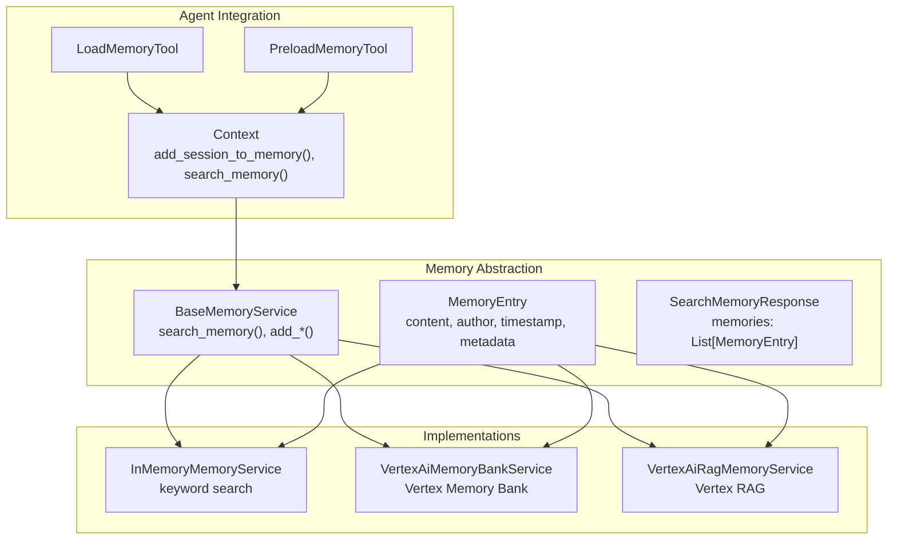
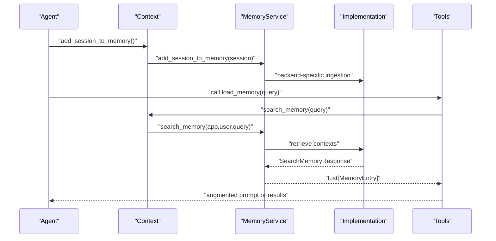
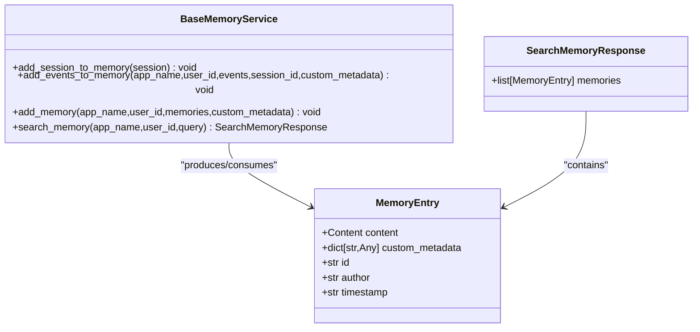
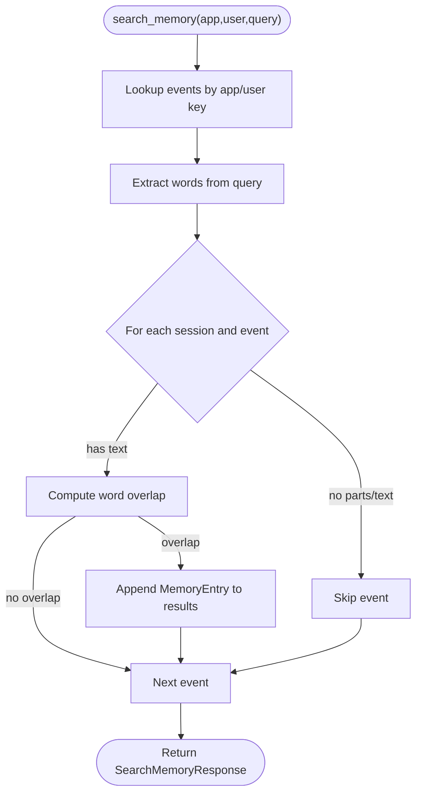
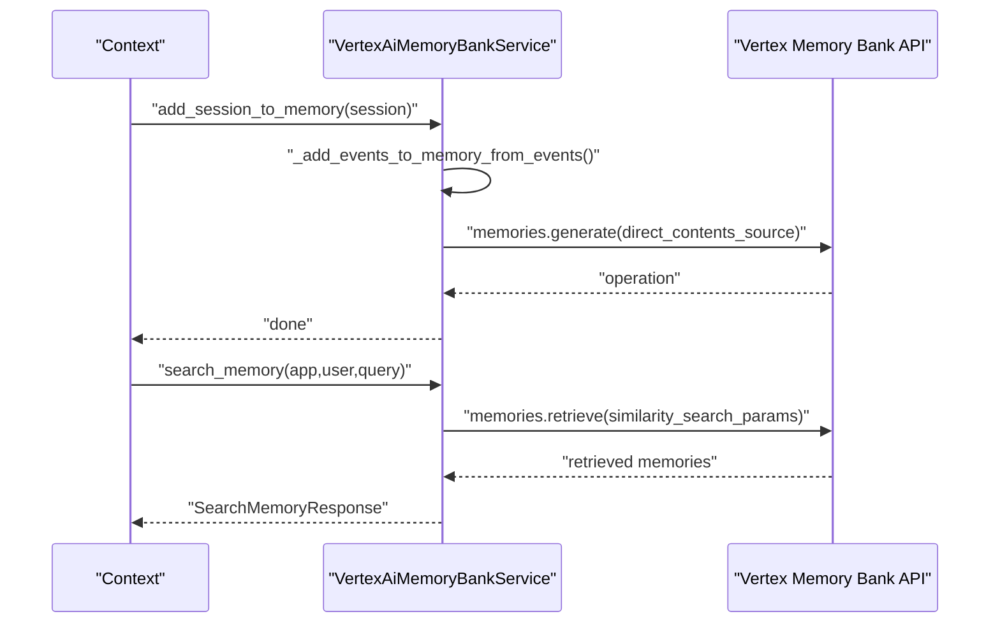
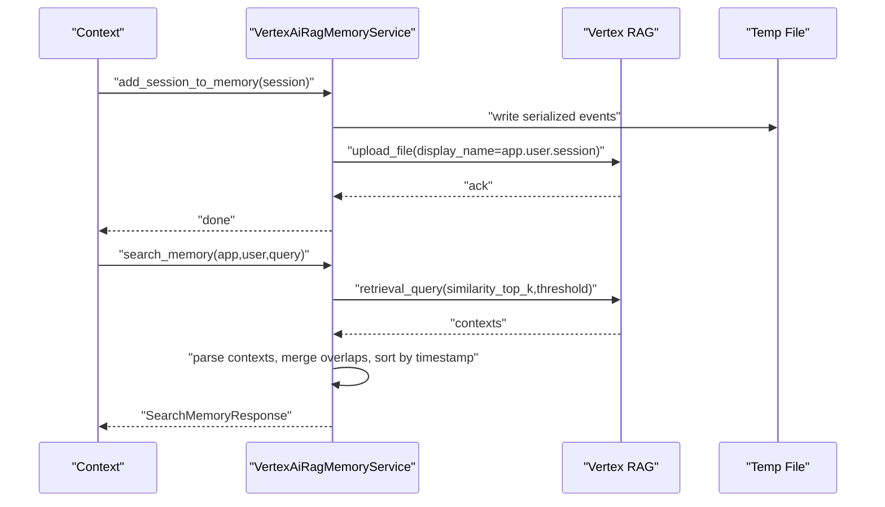
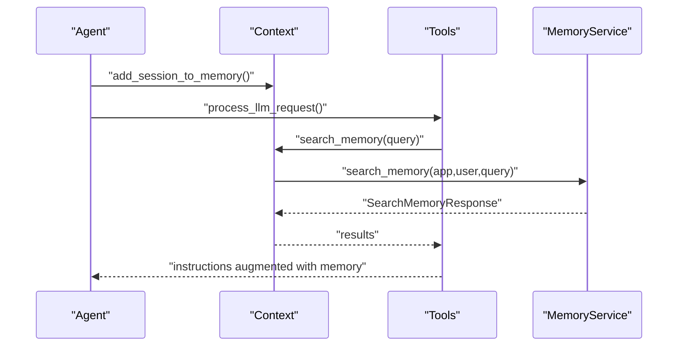
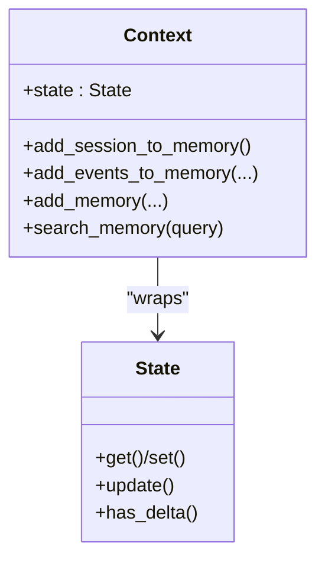
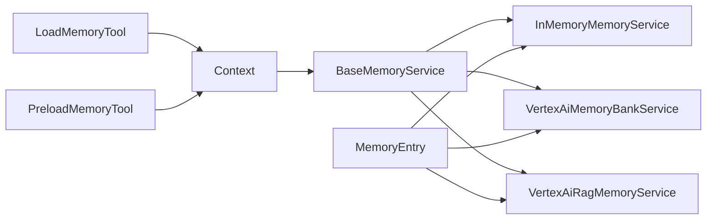

# Memory and Knowledge Management

<cite>
**Referenced Files in This Document**
- [base_memory_service.py](file://src/google/adk/memory/base_memory_service.py)
- [in_memory_memory_service.py](file://src/google/adk/memory/in_memory_memory_service.py)
- [vertex_ai_memory_bank_service.py](file://src/google/adk/memory/vertex_ai_memory_bank_service.py)
- [vertex_ai_rag_memory_service.py](file://src/google/adk/memory/vertex_ai_rag_memory_service.py)
- [memory_entry.py](file://src/google/adk/memory/memory_entry.py)
- [_utils.py](file://src/google/adk/memory/_utils.py)
- [context.py](file://src/google/adk/agents/context.py)
- [load_memory_tool.py](file://src/google/adk/tools/load_memory_tool.py)
- [preload_memory_tool.py](file://src/google/adk/tools/preload_memory_tool.py)
- [_memory_entry_utils.py](file://src/google/adk/tools/_memory_entry_utils.py)
- [state.py](file://src/google/adk/sessions/state.py)
- [__init__.py](file://src/google/adk/memory/__init__.py)
- [agent.py](file://contributing/samples/memory/agent.py)
</cite>

## Table of Contents
1. [Introduction](#introduction)
2. [Project Structure](#project-structure)
3. [Core Components](#core-components)
4. [Architecture Overview](#architecture-overview)
5. [Detailed Component Analysis](#detailed-component-analysis)
6. [Dependency Analysis](#dependency-analysis)
7. [Performance Considerations](#performance-considerations)
8. [Troubleshooting Guide](#troubleshooting-guide)
9. [Conclusion](#conclusion)
10. [Appendices](#appendices)

## Introduction
This document explains the memory and knowledge management architecture in ADK, focusing on how conversations and contextual knowledge are ingested, indexed, searched, and integrated into agent workflows. It covers the service abstractions, concrete implementations (in-memory and Vertex AI-backed), memory entry semantics, retrieval patterns, and the integration with agent context processing. Practical configuration examples and operational guidance for performance, caching, and scalability are included, along with best practices for building knowledge bases and augmenting retrieval.

## Project Structure
The memory subsystem is organized around a shared interface and multiple implementations, plus tools and context integration points:
- Base abstraction and models define the contract and data structures.
- Implementations provide ingestion and search capabilities for different backends.
- Tools expose memory to agents and augment prompts with retrieved context.
- Context bridges memory services into agent runs and session state.

**Diagram sources**
- [base_memory_service.py](file://src/google/adk/memory/base_memory_service.py#L44-L141)
- [memory_entry.py](file://src/google/adk/memory/memory_entry.py#L26-L46)
- [in_memory_memory_service.py](file://src/google/adk/memory/in_memory_memory_service.py#L45-L135)
- [vertex_ai_memory_bank_service.py](file://src/google/adk/memory/vertex_ai_memory_bank_service.py#L141-L388)
- [vertex_ai_rag_memory_service.py](file://src/google/adk/memory/vertex_ai_rag_memory_service.py#L38-L203)
- [context.py](file://src/google/adk/agents/context.py#L313-L412)
- [load_memory_tool.py](file://src/google/adk/tools/load_memory_tool.py#L38-L108)
- [preload_memory_tool.py](file://src/google/adk/tools/preload_memory_tool.py#L32-L93)

**Section sources**
- [base_memory_service.py](file://src/google/adk/memory/base_memory_service.py#L44-L141)
- [memory_entry.py](file://src/google/adk/memory/memory_entry.py#L26-L46)
- [in_memory_memory_service.py](file://src/google/adk/memory/in_memory_memory_service.py#L45-L135)
- [vertex_ai_memory_bank_service.py](file://src/google/adk/memory/vertex_ai_memory_bank_service.py#L141-L388)
- [vertex_ai_rag_memory_service.py](file://src/google/adk/memory/vertex_ai_rag_memory_service.py#L38-L203)
- [context.py](file://src/google/adk/agents/context.py#L313-L412)
- [load_memory_tool.py](file://src/google/adk/tools/load_memory_tool.py#L38-L108)
- [preload_memory_tool.py](file://src/google/adk/tools/preload_memory_tool.py#L32-L93)

## Core Components
- BaseMemoryService defines the contract for adding sessions/events/memories and for searching memory scoped by application and user.
- MemoryEntry encapsulates content, author, timestamp, and optional metadata for a memory item.
- Implementations:
  - InMemoryMemoryService: prototype-grade keyword-based search over session events.
  - VertexAiMemoryBankService: server-side memory generation and retrieval via Vertex Memory Bank.
  - VertexAiRagMemoryService: uploads session segments to Vertex RAG and retrieves semantically similar contexts.

Key capabilities:
- Ingestion: add_session_to_memory, add_events_to_memory, add_memory.
- Retrieval: search_memory returning SearchMemoryResponse with MemoryEntry results.
- Context integration: tools and Context methods to trigger memory operations and inject retrieved context into agent prompts.

**Section sources**
- [base_memory_service.py](file://src/google/adk/memory/base_memory_service.py#L44-L141)
- [memory_entry.py](file://src/google/adk/memory/memory_entry.py#L26-L46)
- [in_memory_memory_service.py](file://src/google/adk/memory/in_memory_memory_service.py#L45-L135)
- [vertex_ai_memory_bank_service.py](file://src/google/adk/memory/vertex_ai_memory_bank_service.py#L141-L388)
- [vertex_ai_rag_memory_service.py](file://src/google/adk/memory/vertex_ai_rag_memory_service.py#L38-L203)

## Architecture Overview
The memory architecture separates concerns between service interface, backend implementations, and agent integration points. Agents use Context methods to add sessions to memory and to search for relevant knowledge. Tools can proactively preload memory into prompts or explicitly load it on demand.

**Diagram sources**
- [context.py](file://src/google/adk/agents/context.py#L313-L412)
- [load_memory_tool.py](file://src/google/adk/tools/load_memory_tool.py#L38-L108)
- [base_memory_service.py](file://src/google/adk/memory/base_memory_service.py#L44-L141)
- [in_memory_memory_service.py](file://src/google/adk/memory/in_memory_memory_service.py#L63-L135)
- [vertex_ai_memory_bank_service.py](file://src/google/adk/memory/vertex_ai_memory_bank_service.py#L188-L388)
- [vertex_ai_rag_memory_service.py](file://src/google/adk/memory/vertex_ai_rag_memory_service.py#L66-L176)

## Detailed Component Analysis

### BaseMemoryService and Data Models
- Contract:
  - add_session_to_memory(session): ingest a full session.
  - add_events_to_memory(...): incremental delta ingestion.
  - add_memory(...): direct memory writes.
  - search_memory(...): query-based retrieval returning SearchMemoryResponse.
- Data models:
  - MemoryEntry: content, author, timestamp, custom_metadata, optional id.
  - SearchMemoryResponse: list of MemoryEntry results.

**Diagram sources**
- [base_memory_service.py](file://src/google/adk/memory/base_memory_service.py#L44-L141)
- [memory_entry.py](file://src/google/adk/memory/memory_entry.py#L26-L46)

**Section sources**
- [base_memory_service.py](file://src/google/adk/memory/base_memory_service.py#L44-L141)
- [memory_entry.py](file://src/google/adk/memory/memory_entry.py#L26-L46)

### InMemoryMemoryService
- Purpose: prototype/testing only; keyword-based matching instead of semantic search.
- Behavior:
  - Thread-safe storage keyed by app_name/user_id.
  - Supports add_session_to_memory and add_events_to_memory with deduplication by event id.
  - search_memory performs word-set intersection across event text parts.

**Diagram sources**
- [in_memory_memory_service.py](file://src/google/adk/memory/in_memory_memory_service.py#L104-L135)

**Section sources**
- [in_memory_memory_service.py](file://src/google/adk/memory/in_memory_memory_service.py#L45-L135)
- [_utils.py](file://src/google/adk/memory/_utils.py#L21-L24)

### VertexAiMemoryBankService
- Purpose: server-side memory generation and retrieval using Vertex Memory Bank.
- Features:
  - Ingestion via memories.generate (with optional consolidation) and memories.create.
  - Retrieval via memories.retrieve with similarity search.
  - Configurable metadata and revision labels passed through custom_metadata.
  - Batched direct memories ingestion respecting backend limits.

**Diagram sources**
- [vertex_ai_memory_bank_service.py](file://src/google/adk/memory/vertex_ai_memory_bank_service.py#L188-L388)

**Section sources**
- [vertex_ai_memory_bank_service.py](file://src/google/adk/memory/vertex_ai_memory_bank_service.py#L141-L388)

### VertexAiRagMemoryService
- Purpose: leverage Vertex RAG for ingestion and retrieval.
- Behavior:
  - Ingestion: serialize session events to a temporary file and upload to RAG corpus.
  - Retrieval: use rag.retrieval_query and reconstruct MemoryEntry events, merging overlapping timestamps.

**Diagram sources**
- [vertex_ai_rag_memory_service.py](file://src/google/adk/memory/vertex_ai_rag_memory_service.py#L66-L176)

**Section sources**
- [vertex_ai_rag_memory_service.py](file://src/google/adk/memory/vertex_ai_rag_memory_service.py#L38-L203)

### Agent Context Integration
- Context exposes:
  - add_session_to_memory(): triggers backend ingestion for the current session.
  - add_events_to_memory(): incremental ingestion with custom metadata.
  - add_memory(): direct memory writes.
  - search_memory(): query-based retrieval.
- Tools:
  - LoadMemoryTool: invokes search_memory and returns MemoryEntry list.
  - PreloadMemoryTool: proactively augments the LLM request with formatted memory text.

**Diagram sources**
- [context.py](file://src/google/adk/agents/context.py#L313-L412)
- [load_memory_tool.py](file://src/google/adk/tools/load_memory_tool.py#L38-L108)
- [preload_memory_tool.py](file://src/google/adk/tools/preload_memory_tool.py#L47-L90)

**Section sources**
- [context.py](file://src/google/adk/agents/context.py#L313-L412)
- [load_memory_tool.py](file://src/google/adk/tools/load_memory_tool.py#L38-L108)
- [preload_memory_tool.py](file://src/google/adk/tools/preload_memory_tool.py#L32-L93)
- [_memory_entry_utils.py](file://src/google/adk/tools/_memory_entry_utils.py#L24-L31)

### Memory Entry Management and Context Preservation
- MemoryEntry preserves:
  - Content parts (text, inline data, file data).
  - Author and timestamp (ISO 8601-formatted via _utils).
  - Optional custom metadata for downstream filtering or routing.
- Context preservation:
  - Timestamps are preserved and used to order reconstructed events.
  - Author and formatted time are included when preloading memory into prompts.

**Section sources**
- [memory_entry.py](file://src/google/adk/memory/memory_entry.py#L26-L46)
- [_utils.py](file://src/google/adk/memory/_utils.py#L21-L24)
- [preload_memory_tool.py](file://src/google/adk/tools/preload_memory_tool.py#L71-L89)

### Knowledge Retrieval Patterns and Relevance Ranking
- InMemoryMemoryService: keyword overlap heuristic; not semantic.
- VertexAiMemoryBankService: similarity search via Vertex Memory Bank; configurable parameters exposed via custom_metadata.
- VertexAiRagMemoryService: similarity_top_k and vector_distance_threshold control retrieval depth and relevance.

**Section sources**
- [in_memory_memory_service.py](file://src/google/adk/memory/in_memory_memory_service.py#L104-L135)
- [vertex_ai_memory_bank_service.py](file://src/google/adk/memory/vertex_ai_memory_bank_service.py#L417-L490)
- [vertex_ai_rag_memory_service.py](file://src/google/adk/memory/vertex_ai_rag_memory_service.py#L41-L63)

### Practical Configuration Examples
- Using VertexAiMemoryBankService:
  - Initialize with project, location, and agent_engine_id.
  - Use custom_metadata to pass config keys recognized by the backend (e.g., ttl, metadata, revision_labels).
  - Enable consolidation via a dedicated flag to consolidate direct memories server-side.
- Using VertexAiRagMemoryService:
  - Provide rag_corpus and tuning knobs (similarity_top_k, vector_distance_threshold).
  - Ensure session events are serializable; ingestion writes a temporary file and uploads to RAG.
- Using InMemoryMemoryService:
  - Suitable for development and testing; keyword-based search is enabled by default.

**Section sources**
- [vertex_ai_memory_bank_service.py](file://src/google/adk/memory/vertex_ai_memory_bank_service.py#L144-L179)
- [vertex_ai_memory_bank_service.py](file://src/google/adk/memory/vertex_ai_memory_bank_service.py#L417-L490)
- [vertex_ai_rag_memory_service.py](file://src/google/adk/memory/vertex_ai_rag_memory_service.py#L41-L63)
- [in_memory_memory_service.py](file://src/google/adk/memory/in_memory_memory_service.py#L45-L52)

### Relationship Between Memory Management and Session State
- Context wraps session state and exposes delta-aware State for mutations.
- Memory operations are scoped by app_name and user_id derived from the current session.
- After-agent callbacks can trigger add_session_to_memory to persist conversation history.

**Diagram sources**
- [context.py](file://src/google/adk/agents/context.py#L41-L103)
- [state.py](file://src/google/adk/sessions/state.py#L20-L82)

**Section sources**
- [context.py](file://src/google/adk/agents/context.py#L313-L412)
- [state.py](file://src/google/adk/sessions/state.py#L20-L82)

## Dependency Analysis
- BaseMemoryService is the central abstraction; implementations depend on it.
- Vertex implementations depend on external Vertex SDKs and APIs.
- Tools depend on Context to access memory services.
- Memory entries depend on Google GenAI types for content representation.

**Diagram sources**
- [base_memory_service.py](file://src/google/adk/memory/base_memory_service.py#L44-L141)
- [in_memory_memory_service.py](file://src/google/adk/memory/in_memory_memory_service.py#L45-L135)
- [vertex_ai_memory_bank_service.py](file://src/google/adk/memory/vertex_ai_memory_bank_service.py#L141-L388)
- [vertex_ai_rag_memory_service.py](file://src/google/adk/memory/vertex_ai_rag_memory_service.py#L38-L203)
- [context.py](file://src/google/adk/agents/context.py#L313-L412)
- [load_memory_tool.py](file://src/google/adk/tools/load_memory_tool.py#L38-L108)
- [preload_memory_tool.py](file://src/google/adk/tools/preload_memory_tool.py#L32-L93)

**Section sources**
- [__init__.py](file://src/google/adk/memory/__init__.py#L16-L38)

## Performance Considerations
- InMemoryMemoryService:
  - Linear scan over stored events; suitable for small datasets and prototypes.
  - Consider precomputing lowercased word sets for improved lookup performance.
- VertexAiMemoryBankService:
  - Use custom_metadata to tune server-side behavior (e.g., wait_for_completion, ttl, metadata).
  - Consolidation reduces redundancy but may increase latency; evaluate trade-offs.
  - Batch direct memories according to backend limits to avoid partial failures.
- VertexAiRagMemoryService:
  - similarity_top_k controls retrieval cost; larger values increase latency and token usage.
  - vector_distance_threshold filters low-relevance results; tune to balance precision/recall.
  - Temporary file I/O overhead; ensure adequate disk space and cleanup.
- Context integration:
  - PreloadMemoryTool adds tokens to prompts; monitor token budget and trim or paginate results.
  - Use LoadMemoryTool for on-demand retrieval to minimize prompt size.

[No sources needed since this section provides general guidance]

## Troubleshooting Guide
- VertexAiRagMemoryService:
  - Ensure rag_corpus is set; otherwise ingestion raises an error.
  - Filter contexts by app_name and user_id prefix; verify display_name encoding.
  - Merge overlapping events by timestamp to avoid duplication.
- VertexAiMemoryBankService:
  - Unsupported config keys are ignored with warnings; verify SDK version and supported fields.
  - metadata and revision_labels require SDK support; fallback behavior logs warnings.
  - enable_consolidation must be a boolean; otherwise raises type error.
- Context:
  - If memory service is not available, operations raise ValueError; ensure service is configured.
- Tools:
  - PreloadMemoryTool swallows exceptions during preload; check logs for failures.
  - If no memories are returned, verify ingestion occurred and search query is appropriate.

**Section sources**
- [vertex_ai_rag_memory_service.py](file://src/google/adk/memory/vertex_ai_rag_memory_service.py#L92-L106)
- [vertex_ai_rag_memory_service.py](file://src/google/adk/memory/vertex_ai_rag_memory_service.py#L128-L131)
- [vertex_ai_memory_bank_service.py](file://src/google/adk/memory/vertex_ai_memory_bank_service.py#L417-L490)
- [vertex_ai_memory_bank_service.py](file://src/google/adk/memory/vertex_ai_memory_bank_service.py#L697-L710)
- [context.py](file://src/google/adk/agents/context.py#L329-L335)
- [preload_memory_tool.py](file://src/google/adk/tools/preload_memory_tool.py#L62-L69)

## Conclusion
ADK’s memory and knowledge management provides a flexible, extensible framework for storing, retrieving, and integrating conversational context into agents. The BaseMemoryService abstraction enables pluggable backends, while Vertex-backed implementations offer scalable, server-side memory generation and retrieval. Tools and Context integration streamline ingestion and augmentation, supporting both proactive and reactive retrieval patterns. Proper configuration of backend parameters, awareness of performance characteristics, and robust error handling ensure reliable operation across diverse use cases.

[No sources needed since this section summarizes without analyzing specific files]

## Appendices

### Best Practices for Knowledge Base Integration and Retrieval Augmentation
- Choose the right backend:
  - Use VertexAiMemoryBankService for server-side generation and revision control.
  - Use VertexAiRagMemoryService for semantic retrieval with RAG corpora.
  - Use InMemoryMemoryService only for prototyping.
- Scope and partition:
  - Always scope memory operations by app_name and user_id to prevent cross-user leakage.
  - Consider session_id scoping for multi-turn segmentation when supported.
- Metadata and labels:
  - Attach custom_metadata for TTL, labels, and routing; validate SDK support.
  - Use revision_labels to track provenance and updates.
- Prompt augmentation:
  - Use PreloadMemoryTool to automatically inject relevant context into prompts.
  - Use LoadMemoryTool for explicit, on-demand retrieval.
- Monitoring and tuning:
  - Track retrieval latency and token usage; adjust similarity_top_k and thresholds.
  - Monitor backend warnings for unsupported keys and fix configuration.

[No sources needed since this section provides general guidance]