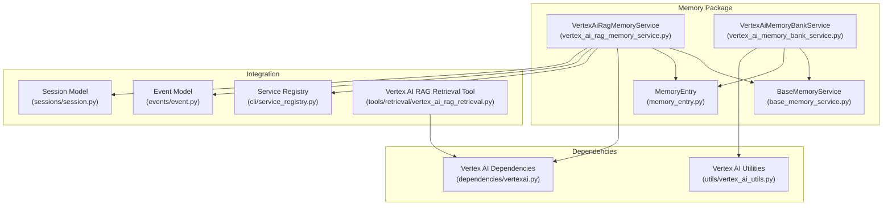
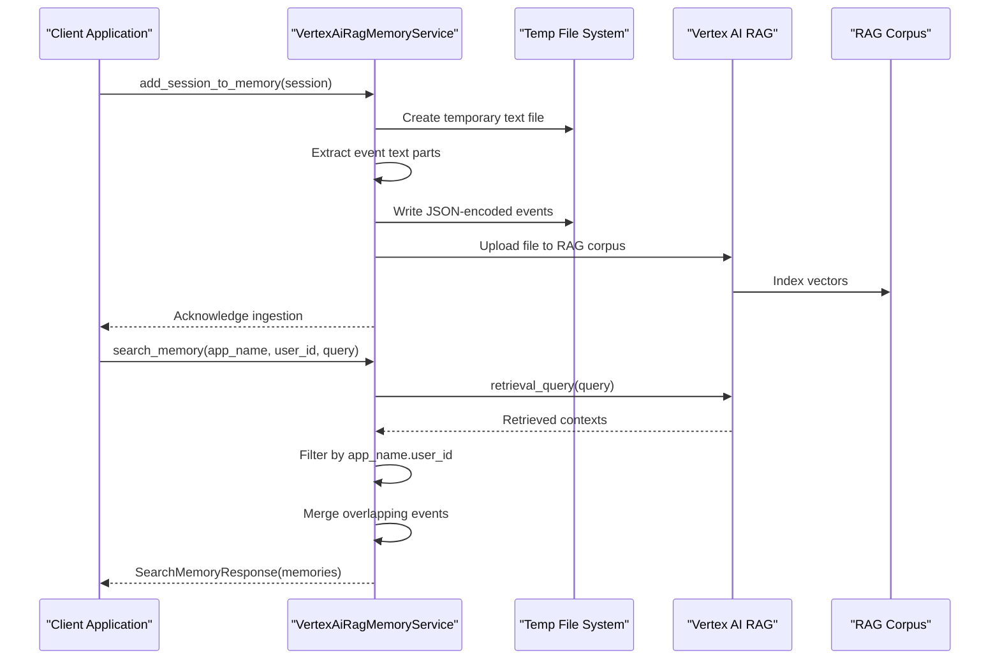
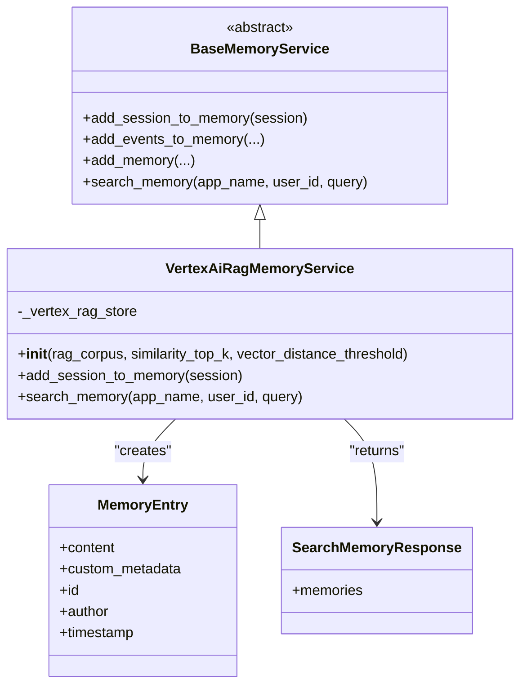
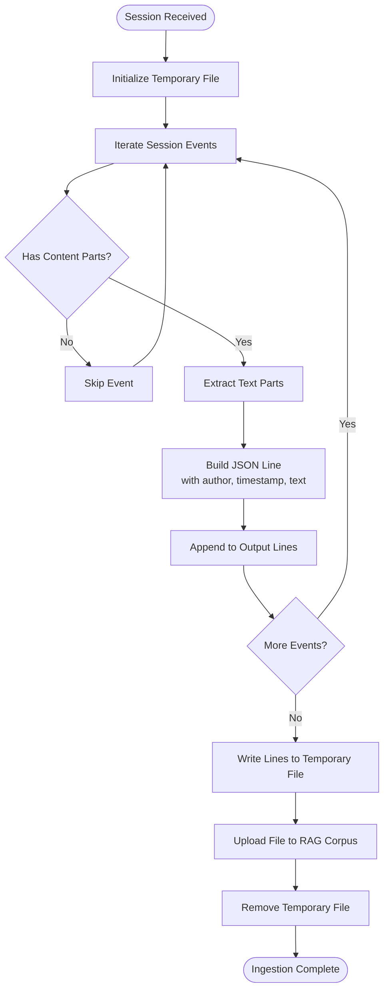
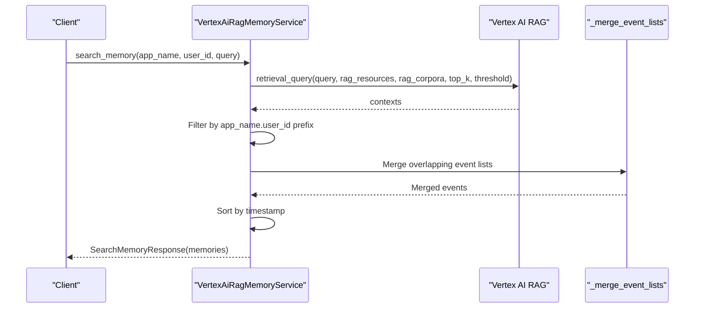
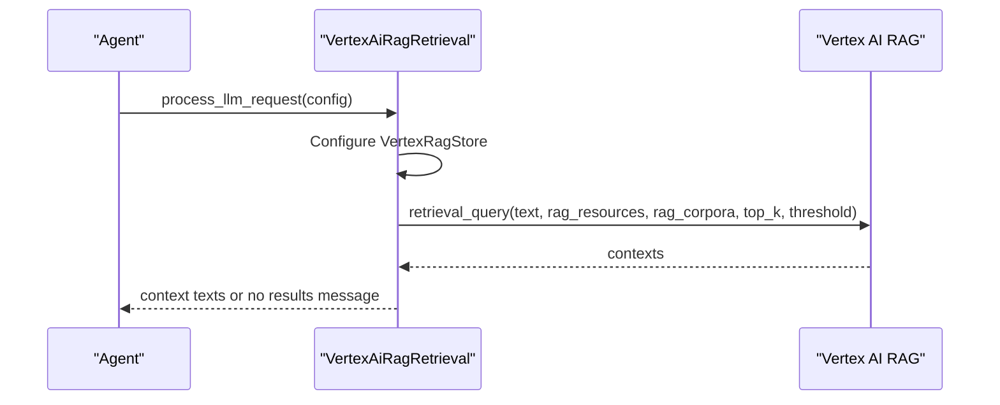
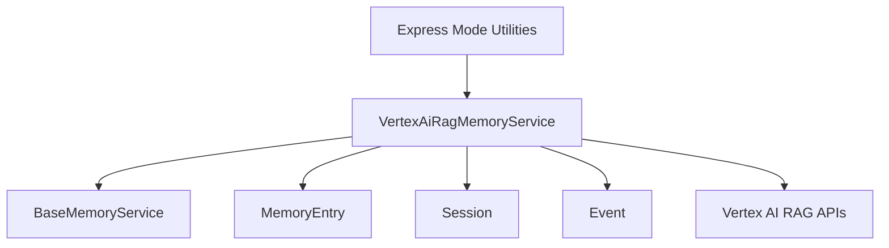

# Vertex AI RAG Implementation

<cite>
**Referenced Files in This Document**
- [vertex_ai_rag_memory_service.py](file://src/google/adk/memory/vertex_ai_rag_memory_service.py)
- [vertex_ai_memory_bank_service.py](file://src/google/adk/memory/vertex_ai_memory_bank_service.py)
- [base_memory_service.py](file://src/google/adk/memory/base_memory_service.py)
- [memory_entry.py](file://src/google/adk/memory/memory_entry.py)
- [vertex_ai_utils.py](file://src/google/adk/utils/vertex_ai_utils.py)
- [vertexai.py](file://src/google/adk/dependencies/vertexai.py)
- [service_registry.py](file://src/google/adk/cli/service_registry.py)
- [event.py](file://src/google/adk/events/event.py)
- [session.py](file://src/google/adk/sessions/session.py)
- [vertex_ai_rag_retrieval.py](file://src/google/adk/tools/retrieval/vertex_ai_rag_retrieval.py)
</cite>

## Table of Contents
1. [Introduction](#introduction)
2. [Project Structure](#project-structure)
3. [Core Components](#core-components)
4. [Architecture Overview](#architecture-overview)
5. [Detailed Component Analysis](#detailed-component-analysis)
6. [Dependency Analysis](#dependency-analysis)
7. [Performance Considerations](#performance-considerations)
8. [Troubleshooting Guide](#troubleshooting-guide)
9. [Conclusion](#conclusion)

## Introduction
This document provides comprehensive technical documentation for the Vertex AI Retrieval-Augmented Generation (RAG) memory service implementation within the Agent Development Kit (ADK). It focuses on the VertexAiRagMemoryService class, detailing how it integrates with Google Cloud's Vertex AI RAG capabilities to provide semantic memory retrieval. The documentation covers setup requirements, authentication configuration, cloud resource dependencies, the memory ingestion pipeline from conversation events to indexed vector embeddings, search functionality including similarity scoring and relevance ranking, and practical deployment guidance for production environments. It also addresses cost optimization strategies, indexing performance, and scalability patterns for large-scale deployments.

## Project Structure
The Vertex AI RAG memory service is implemented as part of the ADK's memory subsystem. The primary implementation resides in the memory package, with supporting utilities and dependencies located in dedicated modules. The CLI service registry demonstrates how the RAG memory service is configured and instantiated in production environments.

**Diagram sources**
- [vertex_ai_rag_memory_service.py](file://src/google/adk/memory/vertex_ai_rag_memory_service.py#L38-L63)
- [vertex_ai_memory_bank_service.py](file://src/google/adk/memory/vertex_ai_memory_bank_service.py#L141-L178)
- [base_memory_service.py](file://src/google/adk/memory/base_memory_service.py#L44-L141)
- [memory_entry.py](file://src/google/adk/memory/memory_entry.py#L26-L46)
- [vertexai.py](file://src/google/adk/dependencies/vertexai.py#L17-L20)
- [vertex_ai_utils.py](file://src/google/adk/utils/vertex_ai_utils.py#L29-L44)
- [service_registry.py](file://src/google/adk/cli/service_registry.py#L309-L321)
- [event.py](file://src/google/adk/events/event.py#L31-L130)
- [session.py](file://src/google/adk/sessions/session.py#L27-L51)
- [vertex_ai_rag_retrieval.py](file://src/google/adk/tools/retrieval/vertex_ai_rag_retrieval.py#L76-L111)

**Section sources**
- [vertex_ai_rag_memory_service.py](file://src/google/adk/memory/vertex_ai_rag_memory_service.py#L1-L203)
- [base_memory_service.py](file://src/google/adk/memory/base_memory_service.py#L1-L141)
- [service_registry.py](file://src/google/adk/cli/service_registry.py#L309-L321)

## Core Components
This section introduces the primary classes and their roles in the Vertex AI RAG memory service implementation.

- VertexAiRagMemoryService: Implements the BaseMemoryService interface to ingest conversation sessions into Vertex AI RAG and retrieve semantically similar contexts for queries.
- BaseMemoryService: Defines the abstract interface for memory services, including methods for adding sessions, adding events, adding explicit memories, and searching memory.
- MemoryEntry: Represents a single memory item with content, optional custom metadata, identifier, author, and timestamp.
- VertexAiMemoryBankService: Alternative memory service implementation using Vertex AI Memory Bank for comparison and complementary use cases.
- Vertex AI Dependencies and Utilities: Provide access to Vertex AI RAG APIs and Express Mode configuration helpers.

Key implementation highlights:
- Semantic ingestion pipeline converts session events to text, uploads them as files to a Vertex AI RAG corpus, and stores session identifiers in display names for later retrieval.
- Search functionality leverages Vertex AI RAG retrieval queries, filters results by application and user scope, merges overlapping event segments, and returns structured MemoryEntry objects.
- Configuration supports similarity top-k retrieval and vector distance thresholds for relevance filtering.

**Section sources**
- [vertex_ai_rag_memory_service.py](file://src/google/adk/memory/vertex_ai_rag_memory_service.py#L38-L63)
- [base_memory_service.py](file://src/google/adk/memory/base_memory_service.py#L44-L141)
- [memory_entry.py](file://src/google/adk/memory/memory_entry.py#L26-L46)
- [vertex_ai_memory_bank_service.py](file://src/google/adk/memory/vertex_ai_memory_bank_service.py#L141-L178)

## Architecture Overview
The Vertex AI RAG memory service architecture integrates with the broader ADK framework to provide seamless semantic memory capabilities. The system orchestrates ingestion and retrieval flows, leveraging Vertex AI RAG for vector indexing and similarity search.

**Diagram sources**
- [vertex_ai_rag_memory_service.py](file://src/google/adk/memory/vertex_ai_rag_memory_service.py#L66-L106)
- [vertex_ai_rag_memory_service.py](file://src/google/adk/memory/vertex_ai_rag_memory_service.py#L109-L175)

**Section sources**
- [vertex_ai_rag_memory_service.py](file://src/google/adk/memory/vertex_ai_rag_memory_service.py#L66-L175)

## Detailed Component Analysis

### VertexAiRagMemoryService
The VertexAiRagMemoryService class implements semantic memory ingestion and retrieval using Vertex AI RAG. It manages a VertexRagStore configuration and coordinates file uploads and retrieval queries.

**Diagram sources**
- [base_memory_service.py](file://src/google/adk/memory/base_memory_service.py#L44-L141)
- [vertex_ai_rag_memory_service.py](file://src/google/adk/memory/vertex_ai_rag_memory_service.py#L38-L63)
- [memory_entry.py](file://src/google/adk/memory/memory_entry.py#L26-L46)

Key implementation patterns:
- Ingestion pipeline: Converts session events to newline-delimited JSON, writes to a temporary file, uploads to the RAG corpus using the display name to encode session metadata, and cleans up the temporary file.
- Search pipeline: Executes retrieval queries against the RAG corpus, filters contexts by application and user scope, merges overlapping event segments, sorts by timestamp, and constructs MemoryEntry objects for the response.

Configuration and parameters:
- rag_corpus: Accepts either a short corpus ID or a full resource path; the service registry resolves project and location for full resource construction.
- similarity_top_k: Controls the number of contexts returned by the retrieval query.
- vector_distance_threshold: Filters contexts based on vector distance thresholds for relevance.

Integration points:
- Uses Vertex AI RAG APIs for file upload and retrieval queries.
- Leverages session and event models to structure ingestion data.
- Returns SearchMemoryResponse with MemoryEntry objects for downstream consumption.

**Section sources**
- [vertex_ai_rag_memory_service.py](file://src/google/adk/memory/vertex_ai_rag_memory_service.py#L38-L63)
- [vertex_ai_rag_memory_service.py](file://src/google/adk/memory/vertex_ai_rag_memory_service.py#L66-L106)
- [vertex_ai_rag_memory_service.py](file://src/google/adk/memory/vertex_ai_rag_memory_service.py#L109-L175)

### Memory Ingestion Pipeline
The ingestion pipeline transforms conversation events into a format suitable for vector indexing and retrieval.

**Diagram sources**
- [vertex_ai_rag_memory_service.py](file://src/google/adk/memory/vertex_ai_rag_memory_service.py#L66-L106)

Processing logic:
- Skips events without content parts.
- Normalizes text by replacing newlines with spaces.
- Encodes each event as a JSON object with author, timestamp, and text fields.
- Writes newline-delimited JSON to a temporary file.
- Uploads the file to the specified RAG corpus using the display name to encode session metadata (app_name.user_id.session_id).
- Removes the temporary file after upload.

**Section sources**
- [vertex_ai_rag_memory_service.py](file://src/google/adk/memory/vertex_ai_rag_memory_service.py#L66-L106)

### Search Functionality and Result Processing
The search functionality retrieves semantically similar contexts and processes them into structured memory entries.

**Diagram sources**
- [vertex_ai_rag_memory_service.py](file://src/google/adk/memory/vertex_ai_rag_memory_service.py#L109-L175)
- [vertex_ai_rag_memory_service.py](file://src/google/adk/memory/vertex_ai_rag_memory_service.py#L178-L203)

Processing logic:
- Executes retrieval queries with configured similarity top-k and vector distance threshold.
- Filters contexts by source display name prefix to ensure app_name.user_id scope.
- Parses JSON lines within each context to reconstruct Event objects.
- Merges overlapping event lists across contexts to eliminate duplicates.
- Sorts events by timestamp and constructs MemoryEntry objects with formatted timestamps.

Relevance ranking and filtering:
- similarity_top_k controls the number of contexts returned.
- vector_distance_threshold filters out irrelevant matches.
- Server-side filtering by app_name and user_id is noted as a TODO for enhancement.

**Section sources**
- [vertex_ai_rag_memory_service.py](file://src/google/adk/memory/vertex_ai_rag_memory_service.py#L109-L175)
- [vertex_ai_rag_memory_service.py](file://src/google/adk/memory/vertex_ai_rag_memory_service.py#L178-L203)

### Integration with Vertex AI RAG Retrieval Tool
The Vertex AI RAG Retrieval Tool demonstrates how Vertex AI RAG can be integrated directly into agent workflows, complementing the memory service.

**Diagram sources**
- [vertex_ai_rag_retrieval.py](file://src/google/adk/tools/retrieval/vertex_ai_rag_retrieval.py#L76-L111)

**Section sources**
- [vertex_ai_rag_retrieval.py](file://src/google/adk/tools/retrieval/vertex_ai_rag_retrieval.py#L76-L111)

## Dependency Analysis
This section examines the dependencies between components and external systems.

**Diagram sources**
- [vertex_ai_rag_memory_service.py](file://src/google/adk/memory/vertex_ai_rag_memory_service.py#L38-L63)
- [base_memory_service.py](file://src/google/adk/memory/base_memory_service.py#L44-L141)
- [memory_entry.py](file://src/google/adk/memory/memory_entry.py#L26-L46)
- [session.py](file://src/google/adk/sessions/session.py#L27-L51)
- [event.py](file://src/google/adk/events/event.py#L31-L130)
- [vertexai.py](file://src/google/adk/dependencies/vertexai.py#L17-L20)
- [vertex_ai_utils.py](file://src/google/adk/utils/vertex_ai_utils.py#L29-L44)

External dependencies and integration points:
- Vertex AI RAG APIs: Used for file upload and retrieval queries.
- Vertex AI Memory Bank Service: Alternative memory service for comparison and complementary use cases.
- Express Mode Utilities: Provide API key handling for Express Mode configurations.

Potential circular dependencies:
- No circular dependencies detected among the analyzed components.

**Section sources**
- [vertex_ai_rag_memory_service.py](file://src/google/adk/memory/vertex_ai_rag_memory_service.py#L38-L63)
- [vertex_ai_memory_bank_service.py](file://src/google/adk/memory/vertex_ai_memory_bank_service.py#L141-L178)
- [vertex_ai_utils.py](file://src/google/adk/utils/vertex_ai_utils.py#L29-L44)

## Performance Considerations
This section provides guidance on optimizing performance and scalability for the Vertex AI RAG memory service.

Indexing performance:
- Batch ingestion: Group multiple sessions or events into fewer larger files to reduce upload overhead.
- Content normalization: Preprocess text to remove unnecessary whitespace and normalize line breaks to improve embedding quality.
- Metadata encoding: Use concise display names to encode session metadata, minimizing payload sizes.

Search performance:
- similarity_top_k tuning: Adjust top-k values based on query latency requirements and accuracy targets.
- vector_distance_threshold: Set thresholds to balance precision and recall; stricter thresholds reduce false positives but may miss relevant contexts.
- Result deduplication: The merge operation eliminates overlapping events, reducing redundant information in responses.

Scalability patterns:
- Horizontal scaling: Deploy multiple instances behind a load balancer to handle increased ingestion and search loads.
- Asynchronous processing: Offload ingestion to background tasks to avoid blocking request threads.
- Caching: Cache frequently accessed contexts or pre-computed embeddings where appropriate to reduce repeated computations.

Cost optimization strategies:
- Resource sizing: Choose appropriate corpus sizes and adjust similarity parameters to minimize unnecessary retrievals.
- Monitoring and alerts: Track ingestion rates, query volumes, and error rates to identify bottlenecks and optimize configurations.
- Budget controls: Set quotas and budgets at the project level to prevent unexpected costs.

[No sources needed since this section provides general guidance]

## Troubleshooting Guide
Common issues and resolutions for the Vertex AI RAG memory service:

Authentication and configuration:
- Missing Vertex SDK: The RAG memory service is conditionally imported; ensure the Vertex SDK is installed if you intend to use this service.
- Environment variables: Verify GOOGLE_CLOUD_PROJECT and GOOGLE_CLOUD_LOCATION are set when using the service registry factory.
- Express Mode API key: When using Express Mode, ensure the API key is correctly configured and compatible with the Vertex AI client.

Ingestion issues:
- Empty sessions: Sessions without content parts are skipped during ingestion. Ensure events contain text parts for meaningful embeddings.
- Temporary file cleanup: Confirm that temporary files are removed after upload to prevent disk space accumulation.

Search issues:
- Scope filtering: The service filters contexts by app_name.user_id prefix; ensure display names are correctly formatted during upload.
- Overlapping events: The merge operation relies on overlapping timestamps; verify event timestamps are accurate and consistent.

Operational checks:
- Vertex AI RAG availability: Confirm the RAG corpus exists and is accessible with the configured credentials.
- Network connectivity: Ensure outbound access to Vertex AI endpoints is permitted from the deployment environment.

**Section sources**
- [vertex_ai_rag_memory_service.py](file://src/google/adk/memory/vertex_ai_rag_memory_service.py#L92-L106)
- [service_registry.py](file://src/google/adk/cli/service_registry.py#L337-L354)

## Conclusion
The Vertex AI RAG memory service implementation provides a robust foundation for semantic memory retrieval within the ADK ecosystem. By converting conversation events into structured text and leveraging Vertex AI RAG for vector indexing and similarity search, the service enables intelligent context retrieval for agent applications. Proper configuration, authentication, and operational practices are essential for reliable performance and cost-effective deployment. The modular design allows for easy integration with existing workflows and supports scalable, production-ready implementations.