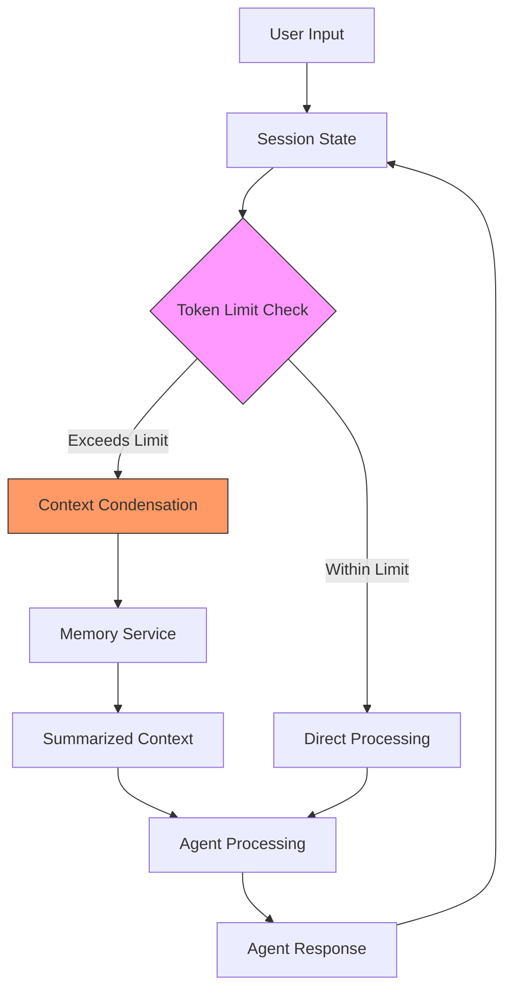
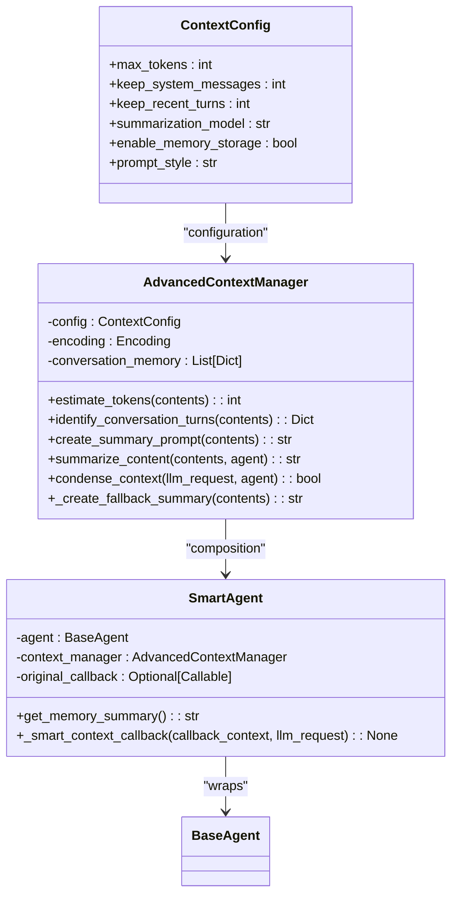

# Context Management

<cite>
**Referenced Files in This Document**   
- [advanced_context_manager.py](file://contributing/samples/context_management/advanced_context_manager.py)
- [context_manager_example.py](file://contributing/samples/context_management/context_manager_example.py)
- [integration_guide.py](file://contributing/samples/context_management/integration_guide.py)
- [test_context_management.py](file://contributing/samples/context_management/test_context_management.py)
- [test_simple.py](file://contributing/samples/context_management/test_simple.py)
- [test_condenser_trigger.py](file://contributing/samples/context_management/test_condenser_trigger.py)
- [callback_context.py](file://src/google/adk/agents/callback_context.py)
- [context_utils.py](file://src/google/adk/utils/context_utils.py)
</cite>

## Table of Contents
1. [Introduction](#introduction)
2. [Short-Term Context vs. Long-Term Memory](#short-term-context-vs-long-term-memory)
3. [Context Preservation Across Agent Turns](#context-preservation-across-agent-turns)
4. [Advanced Context Management Patterns](#advanced-context-management-patterns)
5. [Integration with System Components](#integration-with-system-components)
6. [Common Issues and Solutions](#common-issues-and-solutions)
7. [Designing Effective Context Schemas](#designing-effective-context-schemas)
8. [Conclusion](#conclusion)

## Introduction

Context management is a critical aspect of building effective AI agents that can maintain coherent and productive conversations over multiple turns. This document provides a comprehensive overview of context management patterns and implementations within the ADK-Python framework. The system differentiates between short-term context, managed through sessions, and long-term memory, handled by memory services. These mechanisms work together to ensure agents can preserve essential information while operating within token limitations. The implementation draws inspiration from advanced systems like OpenHands condenser, providing intelligent context window management that automatically handles overflow through summarization and condensation techniques. This documentation covers the architecture, implementation details, integration patterns, and best practices for building robust context-aware agents.

**Section sources**
- [advanced_context_manager.py](file://contributing/samples/context_management/advanced_context_manager.py#L1-L407)
- [context_manager_example.py](file://contributing/samples/context_management/context_manager_example.py#L1-L283)

## Short-Term Context vs. Long-Term Memory

The context management system distinguishes between short-term context and long-term memory, each serving different purposes in agent conversations. Short-term context is managed through sessions and contains the immediate conversation history, including recent user inputs and agent responses. This context is stored in the session state and follows a turn-based structure where each interaction pair (user message and agent response) is preserved for immediate reference. The session-based context has inherent limitations due to token constraints of the underlying LLM, typically requiring management when conversations exceed a certain length.

Long-term memory, on the other hand, is managed through dedicated memory services that can store summarized information beyond the immediate conversation window. This memory system preserves essential context such as user requirements, task tracking, completed work, pending tasks, current state, code state, decisions made, and errors resolved. The memory service acts as a knowledge bank that the agent can reference even when the immediate conversation history has been condensed. This separation allows agents to maintain continuity across extended interactions while staying within token limits.

The integration between these two systems is seamless: when short-term context approaches its token limit, the system automatically condenses older conversation turns into summarized memory entries. This process preserves the essential meaning and context while freeing up space for new interactions. The agent can then access both the immediate conversation history and the summarized long-term memory, providing a comprehensive understanding of the ongoing task. This hybrid approach combines the immediacy of session-based context with the persistence of memory services, creating a robust foundation for complex, multi-turn interactions.

**Diagram sources **
- [advanced_context_manager.py](file://contributing/samples/context_management/advanced_context_manager.py#L37-L305)
- [callback_context.py](file://src/google/adk/agents/callback_context.py#L34-L149)

**Section sources**
- [advanced_context_manager.py](file://contributing/samples/context_management/advanced_context_manager.py#L27-L305)
- [context_manager_example.py](file://contributing/samples/context_management/context_manager_example.py#L15-L283)

## Context Preservation Across Agent Turns

Context preservation across agent turns is implemented through a sophisticated system that manages the conversation history while respecting token limitations. The core mechanism involves monitoring the token count of the conversation and applying intelligent condensation when thresholds are approached. Each conversation turn, consisting of a user message and agent response, is added to the context until the cumulative token count nears the configured maximum. At this point, the system triggers a condensation process that preserves essential elements while summarizing older content.

The preservation strategy follows several key principles: system messages are always preserved (typically the first N messages), recent conversation turns are maintained intact (typically the last N user-assistant pairs), and intermediate content is summarized into a compact representation. This approach ensures that critical instructions and recent interactions remain fully accessible while older, less relevant content is condensed. The system uses token estimation to accurately track conversation length, employing the cl100k_base encoding (GPT-4 encoding) to provide reliable token counts across different content types.

When condensation occurs, the system creates a structured summary that captures essential context elements including user requirements, active tasks, completed work, pending tasks, current state, code changes, decisions made, and resolved errors. This summary is injected into the conversation as a system message, effectively preserving the meaning of multiple conversation turns in a compact format. The original conversation history is then reconstructed with the preserved elements and the summary, significantly reducing the token count while maintaining contextual continuity. This process enables agents to handle conversations of arbitrary length without losing important context or exceeding token limits.

**Section sources**
- [advanced_context_manager.py](file://contributing/samples/context_management/advanced_context_manager.py#L47-L305)
- [test_context_management.py](file://contributing/samples/context_management/test_context_management.py#L195-L323)

## Advanced Context Management Patterns

The context management system implements several advanced patterns that enhance its effectiveness and reliability. One key pattern is conditional context updates, where the system evaluates the content and importance of conversation turns before deciding on preservation or summarization. This intelligent approach ensures that critical information is never lost during condensation. The system also implements context condensation techniques that use LLM-powered summarization to create comprehensive summaries of conversation history. When the primary summarization model fails, a fallback mechanism creates simple summaries using basic text extraction and formatting.

Context inheritance in multi-agent systems is another advanced pattern, where child agents can inherit relevant context from parent agents while maintaining their own conversation history. This enables coordinated workflows where multiple specialized agents work together on complex tasks, each with appropriate context. The system also supports different prompt styles for summarization, including a custom style that emphasizes structured context elements and an OpenHands-style prompt that provides detailed event formatting with previous summary integration.

The implementation includes sophisticated error handling and edge case management, ensuring reliable operation even when components fail. For example, if the LLM summarization fails, the system automatically falls back to a simple text-based summary rather than failing entirely. The system also handles malformed content objects gracefully, extracting available text information without crashing. These patterns work together to create a robust context management system that can handle real-world complexities and edge cases while maintaining high reliability and performance.

**Diagram sources **
- [advanced_context_manager.py](file://contributing/samples/context_management/advanced_context_manager.py#L26-L349)
- [test_simple.py](file://contributing/samples/context_management/test_simple.py#L147-L217)

**Section sources**
- [advanced_context_manager.py](file://contributing/samples/context_management/advanced_context_manager.py#L1-L407)
- [test_condenser_trigger.py](file://contributing/samples/context_management/test_condenser_trigger.py#L21-L169)

## Integration with System Components

The context management system integrates seamlessly with other system components such as tools, planners, and flows, creating a cohesive architecture where context influences agent decision-making. The integration occurs primarily through the agent's callback system, where the context manager hooks into the before_model_callback to process the LLM request before it's sent to the model. This allows the context manager to modify the conversation history, apply condensation, and inject summaries without requiring changes to the core agent logic.

Tools can leverage the context system by accessing both the immediate conversation history and long-term memory. For example, memory tools like load_memory_tool and preload_memory_tool can retrieve summarized context from the memory service, allowing agents to reference information beyond the immediate conversation window. The context system also integrates with the state management system through the CallbackContext, which provides access to session state that can be mutated during agent execution. This enables tools to update shared state that persists across turns and can influence future decision-making.

Planners and flows benefit from the context system by having access to a comprehensive view of the conversation history and task progress. The structured summaries created during condensation include elements like task tracking, completed work, and pending tasks, which planners can use to make informed decisions about next steps. The integration is designed to be transparent to higher-level components - they continue to work with the agent as usual, while the context management operates behind the scenes to ensure optimal performance and reliability. This layered approach allows complex workflows to be built on top of a robust context management foundation without requiring specialized handling for long conversations.

**Section sources**
- [integration_guide.py](file://contributing/samples/context_management/integration_guide.py#L1-L345)
- [callback_context.py](file://src/google/adk/agents/callback_context.py#L34-L149)

## Common Issues and Solutions

Several common issues arise in context management, each with specific solutions implemented in the system. Context drift, where the agent loses track of the original task or user requirements, is addressed through structured summarization that explicitly preserves user context, task tracking, and decisions made. Information overload, where too much context degrades performance or causes token limits to be exceeded, is mitigated through intelligent condensation that preserves essential information while summarizing less critical content. The system's token estimation and conditional condensation ensure that conversations can continue indefinitely without performance degradation.

Security concerns with sensitive data in context are addressed through several mechanisms. The system provides options to disable memory storage when handling sensitive information, and the summarization process can be configured to exclude certain types of data. Context validation is implemented through comprehensive testing and monitoring, with the system including built-in test frameworks to verify correct behavior under various conditions. The integration guide provides best practices for securing context data, including recommendations for environment configuration and access controls.

Summarization strategies are designed to balance completeness with conciseness, using LLM-powered summarization for high-quality compression of conversation history. When summarization fails, a fallback mechanism creates simple text-based summaries to ensure continuity. Data masking techniques can be implemented through custom summarization prompts that instruct the LLM to anonymize sensitive information. The system also includes debugging and monitoring capabilities, with logging of condensation events and metrics tracking to help identify and resolve issues in production environments. These solutions work together to create a robust context management system that handles real-world challenges effectively.

**Section sources**
- [integration_guide.py](file://contributing/samples/context_management/integration_guide.py#L141-L287)
- [test_context_management.py](file://contributing/samples/context_management/test_context_management.py#L325-L369)

## Designing Effective Context Schemas

Designing effective context schemas requires balancing information richness with performance considerations. The system provides a flexible configuration through the ContextConfig class, allowing developers to tune parameters based on their specific use cases. Key considerations include the maximum token limit, which should be set conservatively to leave room for responses, and the number of system messages and recent turns to preserve, which affects how much immediate context remains available.

The schema design should prioritize essential context elements that are most valuable for maintaining conversation continuity. These typically include user requirements, task status, completed work, pending tasks, current state, and key decisions. The system's structured summarization prompt explicitly calls out these elements, ensuring they are preserved during condensation. For specialized applications, custom prompt styles can be implemented to emphasize domain-specific context elements.

Performance considerations include the choice of summarization model, with faster, more cost-effective models preferred for high-volume applications. Memory storage should be enabled for debugging and analysis but can be disabled in production to reduce overhead. The system supports various integration approaches, from simple wrapper patterns to custom callback implementations, allowing developers to choose the right balance of simplicity and control. Comprehensive testing is essential to validate that the chosen schema effectively preserves necessary context while maintaining optimal performance.

**Section sources**
- [advanced_context_manager.py](file://contributing/samples/context_management/advanced_context_manager.py#L26-L35)
- [integration_guide.py](file://contributing/samples/context_management/integration_guide.py#L78-L105)

## Conclusion

The context management system provides a comprehensive solution for handling conversations of arbitrary length while preserving essential information and operating within token limitations. By combining short-term context management through sessions with long-term memory services, the system enables agents to maintain continuity across extended interactions. The intelligent condensation techniques, inspired by systems like OpenHands condenser, automatically handle overflow through LLM-powered summarization, ensuring that critical context is never lost.

The implementation offers flexibility through configurable parameters and multiple integration approaches, from simple wrapper patterns to custom callback implementations. Advanced features like conditional updates, fallback summarization, and multi-agent context inheritance make the system suitable for complex, real-world applications. The comprehensive testing framework and integration guide provide confidence in the system's reliability and ease of adoption.

By following the patterns and best practices outlined in this documentation, developers can build robust, context-aware agents that deliver superior user experiences. The system's transparent operation means that existing agents can be enhanced with intelligent context management with minimal code changes, making it a practical solution for both new and existing projects. As AI applications continue to evolve, effective context management will remain a critical component of successful agent design.