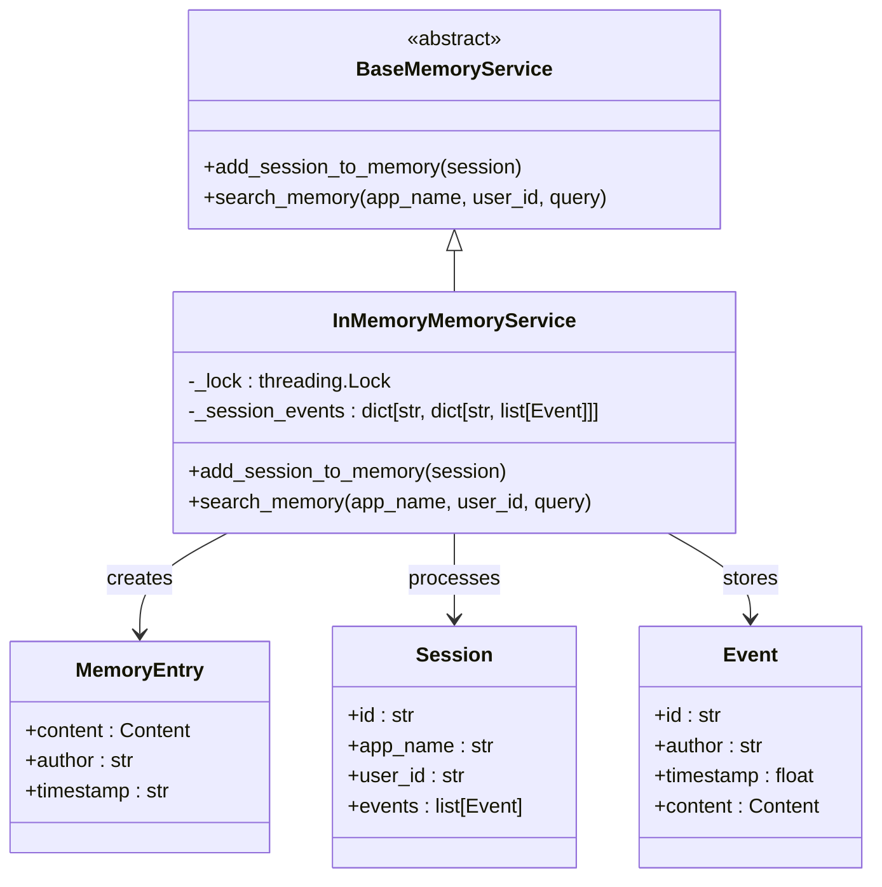
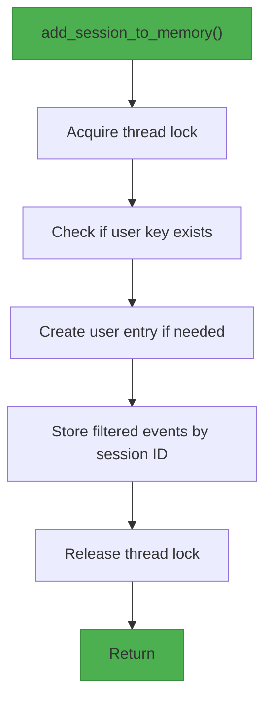
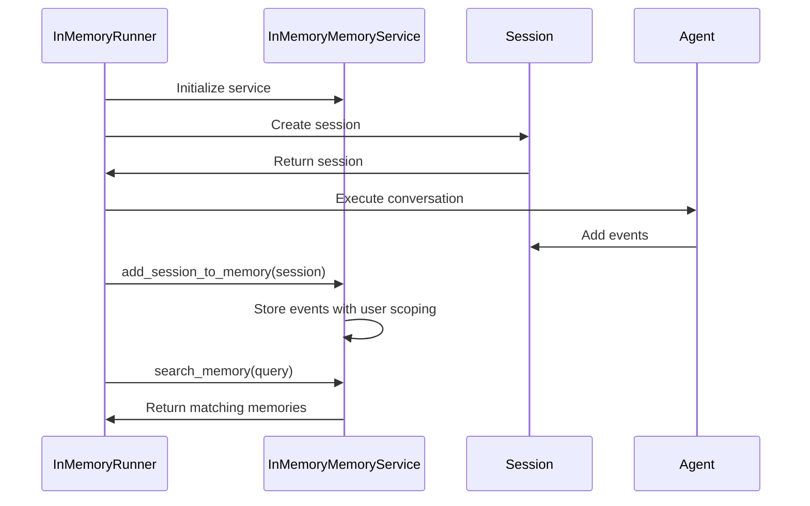
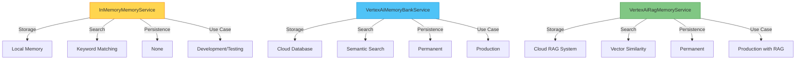

# In-memory Memory

<cite>
**Referenced Files in This Document**   
- [in_memory_memory_service.py](file://src/google/adk/memory/in_memory_memory_service.py)
- [base_memory_service.py](file://src/google/adk/memory/base_memory_service.py)
- [memory_entry.py](file://src/google/adk/memory/memory_entry.py)
- [session.py](file://src/google/adk/sessions/session.py)
- [test_in_memory_memory_service.py](file://tests/unittests/memory/test_in_memory_memory_service.py)
- [load_memory_tool.py](file://src/google/adk/tools/load_memory_tool.py)
- [preload_memory_tool.py](file://src/google/adk/tools/preload_memory_tool.py)
- [main.py](file://contributing/samples/memory/main.py)
- [in_memory_session_service.py](file://src/google/adk/sessions/in_memory_session_service.py)
- [vertex_ai_memory_bank_service.py](file://src/google/adk/memory/vertex_ai_memory_bank_service.py)
- [vertex_ai_rag_memory_service.py](file://src/google/adk/memory/vertex_ai_rag_memory_service.py)
</cite>

## Table of Contents
1. [Introduction](#introduction)
2. [Architecture Overview](#architecture-overview)
3. [Core Components](#core-components)
4. [Implementation Details](#implementation-details)
5. [Usage Examples](#usage-examples)
6. [Performance and Persistence Trade-offs](#performance-and-persistence-trade-offs)
7. [Common Issues and Solutions](#common-issues-and-solutions)
8. [Comparison with Other Memory Services](#comparison-with-other-memory-services)
9. [Conclusion](#conclusion)

## Introduction
The InMemoryMemoryService provides a lightweight, low-latency storage solution for session data in the ADK framework. Designed specifically for development and testing purposes, this service offers temporary context preservation during agent conversations through an in-memory implementation. The service implements keyword-based matching rather than semantic search, making it ideal for prototyping scenarios where speed is prioritized over sophisticated retrieval capabilities. Built with thread-safety in mind, the service uses Python dictionaries as its underlying storage mechanism with proper locking to ensure data integrity in concurrent environments.

## Architecture Overview

**Diagram sources**
- [base_memory_service.py](file://src/google/adk/memory/base_memory_service.py#L41-L78)
- [in_memory_memory_service.py](file://src/google/adk/memory/in_memory_memory_service.py#L41-L102)
- [memory_entry.py](file://src/google/adk/memory/memory_entry.py#L24-L38)
- [session.py](file://src/google/adk/sessions/session.py#L25-L59)

**Section sources**
- [in_memory_memory_service.py](file://src/google/adk/memory/in_memory_memory_service.py#L41-L102)
- [base_memory_service.py](file://src/google/adk/memory/base_memory_service.py#L41-L78)

## Core Components

The InMemoryMemoryService architecture revolves around several key components that work together to provide temporary storage for agent conversations. At its core, the service extends the BaseMemoryService interface, implementing two primary methods: add_session_to_memory and search_memory. The service stores session data in a nested dictionary structure where keys are composed of application name and user ID combinations, enabling proper scoping of memory entries. Each user's sessions are stored as lists of Event objects, which contain conversation content, author information, and timestamps.

The MemoryEntry class serves as the fundamental unit of stored information, containing the actual content from conversations along with metadata such as author and timestamp. This class is used to represent search results and is populated from Event objects during retrieval operations. The service leverages the Session class to process complete conversation histories, extracting relevant events for storage while filtering out those without content.

**Section sources**
- [in_memory_memory_service.py](file://src/google/adk/memory/in_memory_memory_service.py#L41-L102)
- [memory_entry.py](file://src/google/adk/memory/memory_entry.py#L24-L38)
- [session.py](file://src/google/adk/sessions/session.py#L25-L59)

## Implementation Details

### Storage Mechanism
The InMemoryMemoryService utilizes Python dictionaries as its primary storage mechanism, organized in a hierarchical structure. The top-level dictionary uses a composite key format "{app_name}/{user_id}" to scope memory entries appropriately. Within each user's entry, sessions are stored as a dictionary mapping session IDs to lists of Event objects. This structure enables efficient retrieval and organization of conversation data while maintaining proper isolation between different applications and users.

**Diagram sources**
- [in_memory_memory_service.py](file://src/google/adk/memory/in_memory_memory_service.py#L50-L69)

### Thread Safety
Thread safety is implemented through the use of Python's threading.Lock, ensuring that concurrent access to the shared _session_events dictionary is properly synchronized. The lock is acquired at the beginning of both add_session_to_memory and search_memory operations and released upon completion, preventing race conditions when multiple threads attempt to modify or read the data structure simultaneously. This approach provides a simple yet effective mechanism for maintaining data integrity in multi-threaded environments.

### Memory Entry Lifecycle
The lifecycle of memory entries begins when a Session object is passed to the add_session_to_memory method. The service extracts events from the session, filtering out those without content or parts. Each qualifying event is stored in the in-memory dictionary structure with appropriate scoping. During search operations, the service processes these stored events, creating MemoryEntry objects for those that match the query criteria. The search uses keyword matching by extracting lowercase words from both the query and event content, returning entries where any query word appears in the event text.

**Section sources**
- [in_memory_memory_service.py](file://src/google/adk/memory/in_memory_memory_service.py#L50-L102)
- [_utils.py](file://src/google/adk/memory/_utils.py#L21-L24)

## Usage Examples

### Configuration and Initialization
The InMemoryMemoryService requires no external configuration or dependencies, making it simple to set up for development and testing. It can be instantiated directly and integrated into agent runners as demonstrated in the sample code. The service automatically handles the creation of necessary data structures upon initialization.

**Diagram sources**
- [main.py](file://contributing/samples/memory/main.py#L31-L110)
- [in_memory_memory_service.py](file://src/google/adk/memory/in_memory_memory_service.py#L50-L102)

### Practical Implementation
The provided sample demonstrates a complete workflow where conversation history is first created in one session, saved to memory, and then retrieved in a subsequent session. The example shows how user preferences, activities, and temporal information can be preserved and recalled through memory operations. The preload_memory_tool automatically injects relevant past conversations into the LLM context based on the current query, while the load_memory_tool allows explicit retrieval of memories through function calls.

**Section sources**
- [main.py](file://contributing/samples/memory/main.py#L31-L110)
- [preload_memory_tool.py](file://src/google/adk/tools/preload_memory_tool.py#L29-L84)
- [load_memory_tool.py](file://src/google/adk/tools/load_memory_tool.py#L51-L93)

## Performance and Persistence Trade-offs

### Performance Characteristics
The in-memory implementation provides exceptional performance characteristics due to its local storage mechanism and simple keyword matching algorithm. Operations execute with minimal latency since they involve only in-process dictionary lookups and string operations. The time complexity for search operations is O(n*m) where n represents the number of stored events and m represents the average number of words per event, making it efficient for small to medium-sized datasets typical in development scenarios.

### Persistence Limitations
The primary limitation of this implementation is its ephemeral nature—data is lost when the application terminates or restarts. This makes it unsuitable for production environments where data persistence is required. The service is explicitly designed for temporary context preservation during active agent conversations, particularly in development and testing contexts where rapid iteration is valued over data durability.

### Appropriate Use Cases
This memory service is appropriate for:
- Development and prototyping environments
- Unit and integration testing
- Short-lived conversational sessions
- Scenarios requiring low-latency access to recent conversation history
- Proof-of-concept implementations

It should be avoided in:
- Production environments requiring data persistence
- Applications with long-term memory requirements
- Systems where data durability is critical
- High-availability deployments

**Section sources**
- [in_memory_memory_service.py](file://src/google/adk/memory/in_memory_memory_service.py#L42-L48)
- [in_memory_session_service.py](file://src/google/adk/sessions/in_memory_session_service.py#L36-L40)

## Common Issues and Solutions

### Memory Leaks
While the current implementation does not include automatic cleanup mechanisms, memory leaks can be prevented through proper application-level management. Developers should implement session cleanup routines that remove old or inactive sessions from memory. The service's scoping by application and user ID facilitates targeted cleanup operations.

### Data Loss Prevention
Since data loss on restart is inherent to the design, applications requiring persistence should implement complementary storage solutions. For development environments, this might include periodic export of conversation data to files, while production systems should migrate to persistent memory services like VertexAiMemoryBankService.

### Memory Size Management
For extended testing sessions, developers can implement size limits by:
- Tracking memory usage and evicting oldest entries
- Implementing time-based expiration of memory entries
- Adding application-level monitoring of memory consumption
- Using the list_sessions functionality to identify and remove inactive sessions

**Section sources**
- [in_memory_memory_service.py](file://src/google/adk/memory/in_memory_memory_service.py#L53-L56)
- [in_memory_session_service.py](file://src/google/adk/sessions/in_memory_session_service.py#L45-L49)

## Comparison with Other Memory Services

**Diagram sources**
- [in_memory_memory_service.py](file://src/google/adk/memory/in_memory_memory_service.py#L41-L102)
- [vertex_ai_memory_bank_service.py](file://src/google/adk/memory/vertex_ai_memory_bank_service.py#L38-L165)
- [vertex_ai_rag_memory_service.py](file://src/google/adk/memory/vertex_ai_rag_memory_service.py#L39-L201)

The InMemoryMemoryService differs significantly from its cloud-based counterparts in several key aspects. Unlike the VertexAiMemoryBankService and VertexAiRagMemoryService, it does not require external dependencies or cloud infrastructure, making it immediately available without configuration. Its search capability is limited to keyword matching rather than semantic or vector-based retrieval, but this limitation contributes to its low-latency performance. The service's lack of persistence contrasts with the permanent storage offered by the cloud services, but aligns with its intended use case for temporary, short-term memory needs.

**Section sources**
- [in_memory_memory_service.py](file://src/google/adk/memory/in_memory_memory_service.py#L41-L102)
- [vertex_ai_memory_bank_service.py](file://src/google/adk/memory/vertex_ai_memory_bank_service.py#L38-L165)
- [vertex_ai_rag_memory_service.py](file://src/google/adk/memory/vertex_ai_rag_memory_service.py#L39-L201)

## Conclusion
The InMemoryMemoryService provides a valuable tool for development and testing within the ADK framework, offering low-latency storage for session data with minimal setup requirements. Its simple architecture based on Python dictionaries and thread-safe operations makes it reliable for prototyping conversational agents while maintaining proper isolation between users and applications. The service's keyword-based search, while less sophisticated than semantic alternatives, delivers fast results suitable for development workflows. Developers should recognize its limitations regarding data persistence and scalability, reserving its use for appropriate scenarios such as development, testing, and short-lived sessions. For production deployments, migration to cloud-based memory services is recommended to ensure data durability and advanced retrieval capabilities.