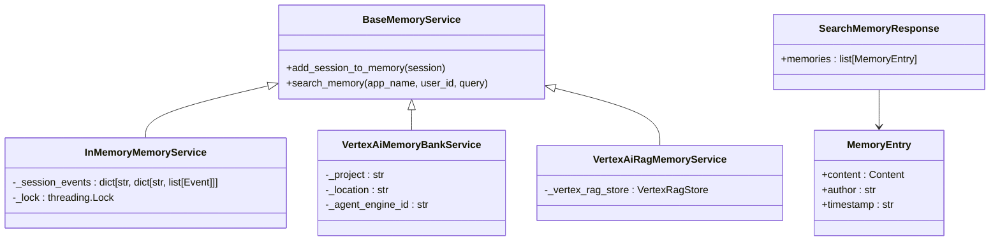
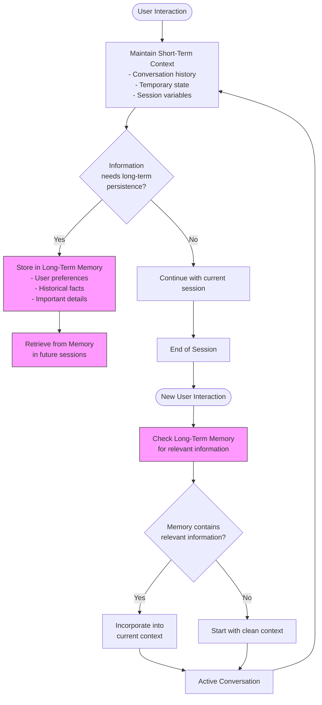
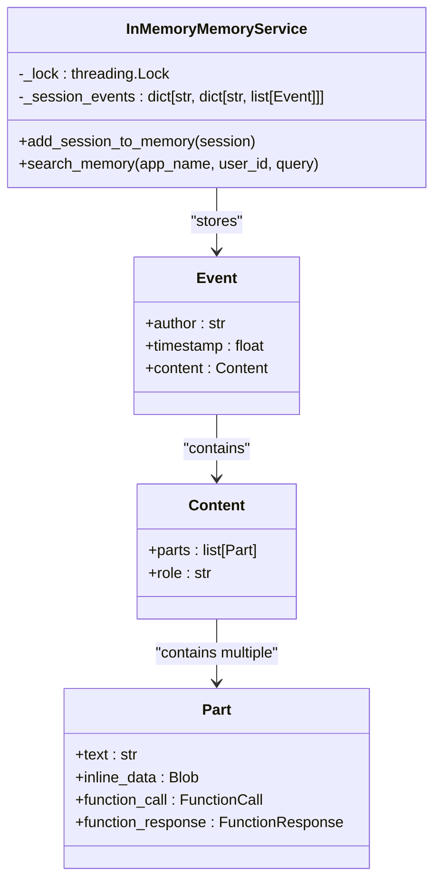
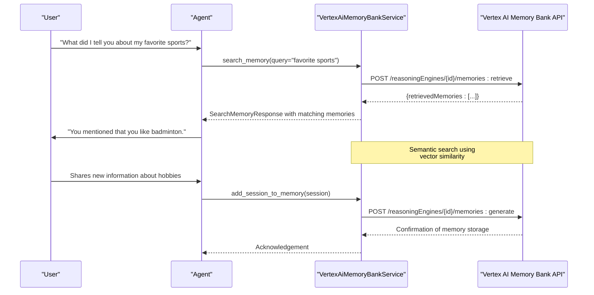
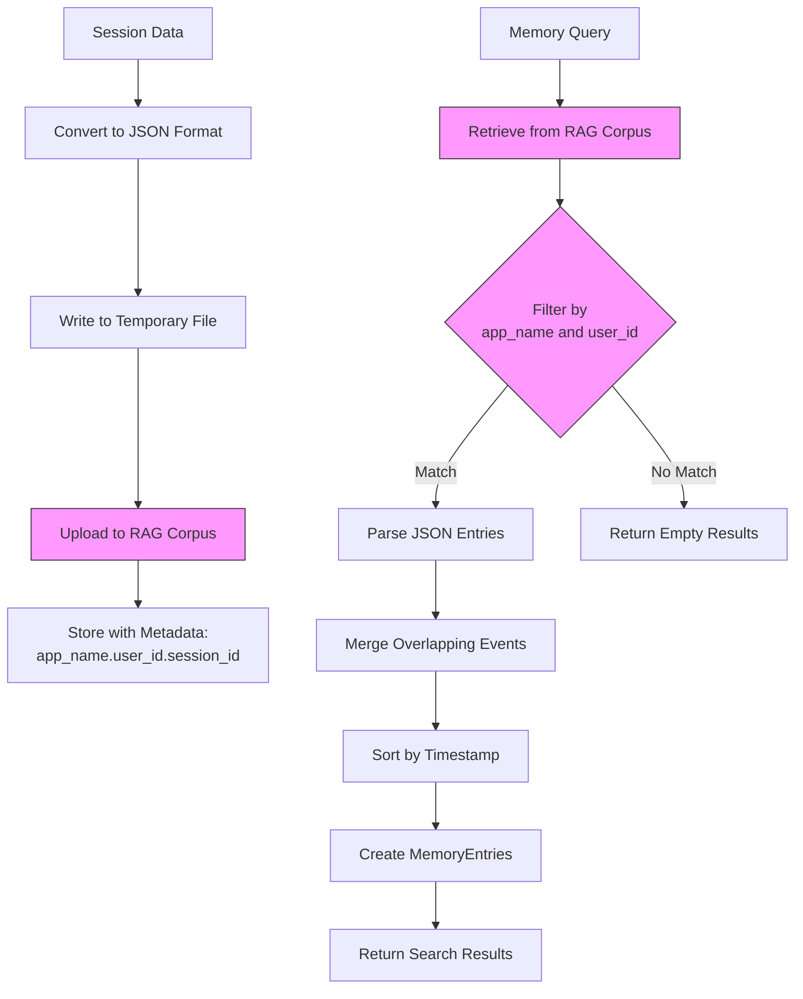
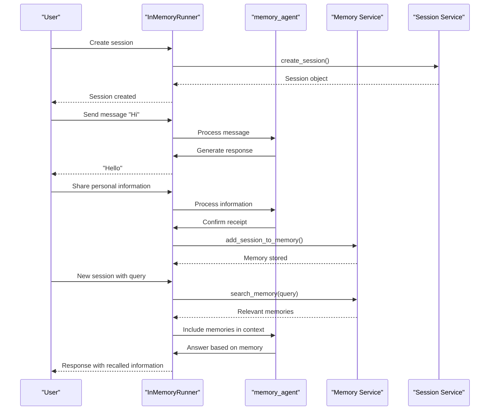

# Memory and State Management

<cite>
**Referenced Files in This Document**   
- [base_memory_service.py](file://src/google/adk/memory/base_memory_service.py)
- [in_memory_memory_service.py](file://src/google/adk/memory/in_memory_memory_service.py)
- [vertex_ai_memory_bank_service.py](file://src/google/adk/memory/vertex_ai_memory_bank_service.py)
- [vertex_ai_rag_memory_service.py](file://src/google/adk/memory/vertex_ai_rag_memory_service.py)
- [memory_entry.py](file://src/google/adk/memory/memory_entry.py)
- [agent.py](file://contributing/samples/memory/agent.py)
- [main.py](file://contributing/samples/memory/main.py)
- [load_memory_tool.py](file://src/google/adk/tools/load_memory_tool.py)
- [preload_memory_tool.py](file://src/google/adk/tools/preload_memory_tool.py)
- [session.py](file://src/google/adk/sessions/session.py)
</cite>

## Table of Contents
1. [Introduction](#introduction)
2. [Memory Services Overview](#memory-services-overview)
3. [Short-Term Context vs Long-Term Memory](#short-term-context-vs-long-term-memory)
4. [In-Memory Storage Implementation](#in-memory-storage-implementation)
5. [Vertex AI Memory Bank Service](#vertex-ai-memory-bank-service)
6. [Vertex AI RAG Memory Service](#vertex-ai-rag-memory-service)
7. [Memory Schema Design and Retrieval Optimization](#memory-schema-design-and-retrieval-optimization)
8. [Memory Cost Management and Data Privacy](#memory-cost-management-and-data-privacy)
9. [Practical Implementation Examples](#practical-implementation-examples)
10. [Conclusion](#conclusion)

## Introduction
The ADK framework provides a comprehensive memory and state management system that enables AI agents to maintain context across interactions and retain long-term user information. This documentation details the architecture and implementation of the data persistence systems within the ADK framework, focusing on the various memory services that support both short-term conversation context and long-term user memory recall. The system is designed to provide flexible storage backends that can be selected based on scalability requirements, retrieval performance needs, and production constraints.

## Memory Services Overview
The ADK framework implements a pluggable memory service architecture that allows developers to choose from multiple storage backends based on their application requirements. The core abstraction is defined by the `BaseMemoryService` class, which establishes a contract for memory operations including session ingestion and semantic search capabilities. This interface enables consistent memory access patterns regardless of the underlying storage technology, allowing for seamless switching between different memory implementations.

The framework supports three primary memory service implementations: in-memory storage for development and testing, Vertex AI Memory Bank for managed semantic memory, and Vertex AI RAG (Retrieval-Augmented Generation) for document-based knowledge retrieval. Each service implements the same interface but provides different trade-offs in terms of persistence, scalability, and retrieval capabilities. The memory services work in conjunction with session management to provide both transient context and persistent user memory.

**Diagram sources**
- [base_memory_service.py](file://src/google/adk/memory/base_memory_service.py#L41-L79)
- [in_memory_memory_service.py](file://src/google/adk/memory/in_memory_memory_service.py#L41-L102)
- [vertex_ai_memory_bank_service.py](file://src/google/adk/memory/vertex_ai_memory_bank_service.py#L38-L165)
- [vertex_ai_rag_memory_service.py](file://src/google/adk/memory/vertex_ai_rag_memory_service.py#L39-L201)
- [memory_entry.py](file://src/google/adk/memory/memory_entry.py#L24-L38)

**Section sources**
- [base_memory_service.py](file://src/google/adk/memory/base_memory_service.py#L41-L79)
- [memory_entry.py](file://src/google/adk/memory/memory_entry.py#L24-L38)

## Short-Term Context vs Long-Term Memory
The ADK framework distinguishes between short-term context management and long-term memory persistence, providing appropriate mechanisms for each use case. Short-term context is managed through session state, which maintains the conversation history within a single interaction session. This context is ephemeral and typically persists only for the duration of a user session, providing the immediate context needed for coherent conversation flow.

Long-term memory, in contrast, provides persistent storage of user information across multiple sessions and interactions. This capability enables agents to recall user preferences, past conversations, and important facts over extended periods. The framework implements this through dedicated memory services that can store and retrieve information based on semantic similarity rather than exact matches. This distinction allows developers to optimize resource usage by keeping frequently accessed session context in fast, transient storage while archiving important user information in persistent, scalable memory systems.

The decision of when to use short-term context versus long-term memory depends on the application requirements. Session context is ideal for maintaining conversation flow, tracking temporary state, and managing multi-turn interactions. Long-term memory is appropriate for storing user preferences, historical information, and any data that needs to persist beyond a single session. The framework provides tools to seamlessly transition information from short-term context to long-term memory when appropriate.

**Diagram sources**
- [session.py](file://src/google/adk/sessions/session.py#L25-L59)
- [base_memory_service.py](file://src/google/adk/memory/base_memory_service.py#L41-L79)

**Section sources**
- [session.py](file://src/google/adk/sessions/session.py#L25-L59)
- [base_memory_service.py](file://src/google/adk/memory/base_memory_service.py#L41-L79)

## In-Memory Storage Implementation
The `InMemoryMemoryService` provides a simple, thread-safe implementation of the memory interface for development and testing purposes. This service stores session data in Python dictionaries, using keyword matching rather than semantic search for retrieval operations. While not suitable for production deployments due to its ephemeral nature and limited scalability, it serves as a valuable tool for prototyping and local development.

The implementation uses a nested dictionary structure to organize memory entries by application name and user ID, with sessions as the innermost level. This structure enables efficient retrieval of user-specific memory while maintaining isolation between different applications and users. The service is thread-safe through the use of a threading lock that protects all read and write operations, preventing race conditions in multi-threaded environments.

Keyword extraction is performed using regular expressions to identify alphanumeric sequences, which are then converted to lowercase for case-insensitive matching. When searching for relevant memories, the service compares the keywords in the query against those in stored events, returning any entries that share at least one keyword. This approach provides basic recall functionality without requiring external dependencies or complex infrastructure.

**Diagram sources**
- [in_memory_memory_service.py](file://src/google/adk/memory/in_memory_memory_service.py#L41-L102)
- [session.py](file://src/google/adk/sessions/session.py#L25-L59)

**Section sources**
- [in_memory_memory_service.py](file://src/google/adk/memory/in_memory_memory_service.py#L41-L102)

## Vertex AI Memory Bank Service
The `VertexAiMemoryBankService` provides a production-ready memory solution using Google's Vertex AI Memory Bank, offering semantic search capabilities and managed persistence. This service integrates with the Vertex AI platform to provide scalable, durable storage of user memories with advanced retrieval features. Unlike the in-memory implementation, this service uses vector-based semantic search to find relevant memories based on meaning rather than exact keyword matches.

The service requires configuration with a project ID, location, and agent engine ID to connect to the appropriate Vertex AI resources. When adding a session to memory, the service sends the session events to the Vertex AI Memory Bank API, which processes and stores them for future retrieval. The API handles the complexity of vector embedding generation and indexing, allowing developers to focus on application logic rather than infrastructure management.

During memory retrieval, the service performs a similarity search against the stored memories, returning the most relevant entries based on the query. The results include metadata such as timestamps and authors, enabling rich contextual responses. This service is particularly well-suited for applications requiring high recall accuracy and the ability to understand nuanced queries that may not match stored memories exactly.

**Diagram sources**
- [vertex_ai_memory_bank_service.py](file://src/google/adk/memory/vertex_ai_memory_bank_service.py#L38-L165)

**Section sources**
- [vertex_ai_memory_bank_service.py](file://src/google/adk/memory/vertex_ai_memory_bank_service.py#L38-L165)

## Vertex AI RAG Memory Service
The `VertexAiRagMemoryService` implements memory storage and retrieval using Vertex AI's Retrieval-Augmented Generation (RAG) capabilities, providing document-based knowledge management. This service is designed for scenarios where memory needs to be stored as structured documents with metadata, enabling sophisticated retrieval patterns and integration with existing document management systems.

The implementation converts session data into text files that are uploaded to a Vertex AI RAG corpus. Each file is associated with metadata that includes the application name, user ID, and session ID, encoded in the display name for filtering purposes. When searching for relevant memories, the service queries the RAG corpus and processes the results to reconstruct the original session events. This approach allows for efficient storage of large volumes of conversational data while maintaining the ability to retrieve specific information based on semantic similarity.

A key feature of this service is its ability to merge overlapping event lists from multiple retrieval results, ensuring comprehensive context reconstruction. The service also handles JSON parsing of stored memory entries, allowing for structured data storage and retrieval. This makes it particularly suitable for applications that need to maintain detailed user profiles or store complex interaction histories.

**Diagram sources**
- [vertex_ai_rag_memory_service.py](file://src/google/adk/memory/vertex_ai_rag_memory_service.py#L39-L201)

**Section sources**
- [vertex_ai_rag_memory_service.py](file://src/google/adk/memory/vertex_ai_rag_memory_service.py#L39-L201)

## Memory Schema Design and Retrieval Optimization
Effective memory management in the ADK framework requires careful consideration of schema design and retrieval optimization strategies. The framework provides flexible data structures that can accommodate various types of information, from simple text messages to complex structured data. When designing memory schemas, developers should consider the types of queries that will be performed and structure the stored information accordingly.

For optimal retrieval performance, it's recommended to include descriptive metadata with memory entries, such as timestamps and author information. The timestamp should be formatted in ISO 8601 format to ensure compatibility with downstream systems and proper sorting. When storing complex data, consider breaking it into smaller, semantically coherent entries that can be retrieved independently, rather than creating large monolithic memory objects.

Retrieval optimization involves selecting the appropriate memory service based on the application's requirements. For applications with high query volumes and low latency requirements, the Vertex AI Memory Bank service provides the best performance due to its optimized indexing and retrieval algorithms. For applications with large volumes of historical data, the Vertex AI RAG service may be more cost-effective while still providing good retrieval quality.

When implementing memory retrieval, consider using specific, descriptive queries rather than vague ones to improve precision. The framework's semantic search capabilities work best with well-formed queries that clearly express the desired information. Additionally, applications should implement caching strategies for frequently accessed memory patterns to reduce latency and API costs.

**Section sources**
- [memory_entry.py](file://src/google/adk/memory/memory_entry.py#L24-L38)
- [base_memory_service.py](file://src/google/adk/memory/base_memory_service.py#L62-L79)

## Memory Cost Management and Data Privacy
Managing memory costs and ensuring data privacy are critical considerations when implementing persistent memory systems in production environments. The ADK framework provides several mechanisms to address these concerns, allowing developers to balance functionality with cost efficiency and compliance requirements.

Cost management strategies include selecting the appropriate memory service tier based on access patterns, implementing data retention policies to automatically purge old memories, and optimizing query patterns to minimize unnecessary API calls. The in-memory service is free but ephemeral, making it suitable for temporary context, while the Vertex AI services incur costs based on storage volume and query frequency.

Data privacy is addressed through multiple layers of protection. Memory entries are scoped to specific applications and user IDs, preventing cross-application data leakage. Sensitive information should be filtered before storage, and developers should implement appropriate access controls and encryption for stored data. The framework also supports data retention policies that can automatically remove memories after a specified period, helping to comply with data protection regulations.

When handling sensitive information, developers should consider implementing additional security measures such as data anonymization, access logging, and audit trails. The framework's modular design allows for the integration of custom security policies and compliance checks before memory storage and retrieval operations.

**Section sources**
- [base_memory_service.py](file://src/google/adk/memory/base_memory_service.py#L48-L79)
- [vertex_ai_memory_bank_service.py](file://src/google/adk/memory/vertex_ai_memory_bank_service.py#L61-L95)
- [vertex_ai_rag_memory_service.py](file://src/google/adk/memory/vertex_ai_rag_memory_service.py#L67-L106)

## Practical Implementation Examples
The ADK framework provides practical examples demonstrating how to configure and use different memory backends based on application requirements. The memory sample demonstrates a complete implementation using the `InMemoryRunner` with memory tools integrated into an agent configuration. This example shows how to create sessions, interact with an agent, save session data to memory, and retrieve memories in subsequent sessions.

The agent configuration includes both `load_memory_tool` and `preload_memory_tool`, which provide different approaches to memory access. The `load_memory_tool` allows the agent to explicitly query memory when needed, while the `preload_memory_tool` automatically retrieves relevant memories and includes them in the system instructions for every request. This dual approach enables flexible memory usage patterns, from on-demand retrieval to proactive context enrichment.

Configuration of the memory service is handled through the runner setup, where developers can inject the appropriate memory service implementation based on environment variables or deployment requirements. This dependency injection pattern allows for easy switching between memory backends without modifying the core application logic, supporting development, testing, and production environments with different storage requirements.

**Diagram sources**
- [main.py](file://contributing/samples/memory/main.py#L31-L110)
- [agent.py](file://contributing/samples/memory/agent.py#L28-L43)
- [load_memory_tool.py](file://src/google/adk/tools/load_memory_tool.py#L36-L49)
- [preload_memory_tool.py](file://src/google/adk/tools/preload_memory_tool.py#L29-L84)

**Section sources**
- [main.py](file://contributing/samples/memory/main.py#L31-L110)
- [agent.py](file://contributing/samples/memory/agent.py#L28-L43)

## Conclusion
The ADK framework's memory and state management system provides a comprehensive solution for maintaining context and persisting user information across interactions. By offering multiple memory service implementations with a consistent interface, the framework enables developers to select the appropriate storage backend based on their specific requirements for scalability, performance, and cost. The distinction between short-term context and long-term memory allows for efficient resource utilization while supporting rich, personalized user experiences.

The integration of memory tools with agent workflows demonstrates a practical approach to leveraging persistent memory in conversational AI applications. By combining explicit memory queries with automatic context preloading, applications can achieve both precision and comprehensiveness in their responses. The framework's attention to data privacy and cost management considerations ensures that these powerful capabilities can be deployed responsibly in production environments.

As AI applications continue to evolve, the ability to maintain coherent context and recall past interactions will become increasingly important. The ADK framework's flexible, extensible memory architecture provides a solid foundation for building intelligent agents that can develop deeper understanding of users over time, enabling more natural and helpful interactions.