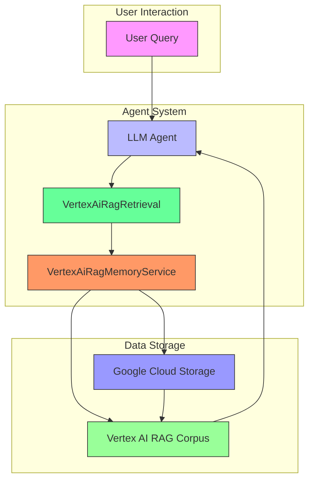
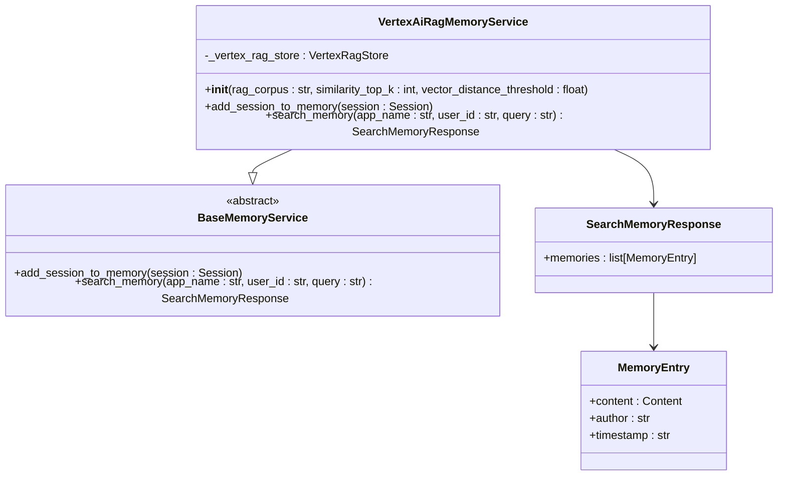
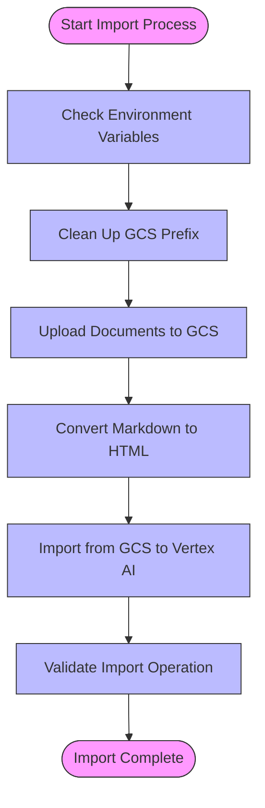
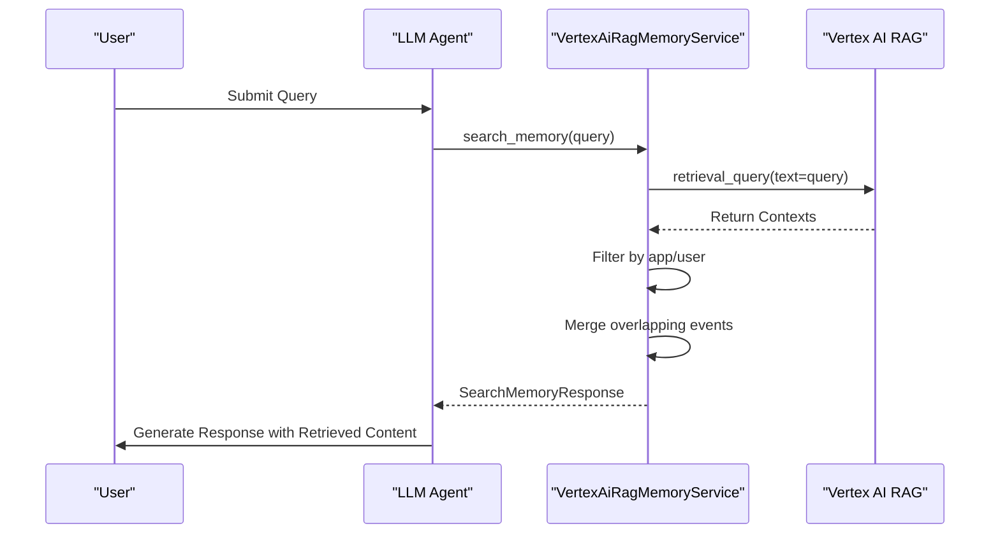
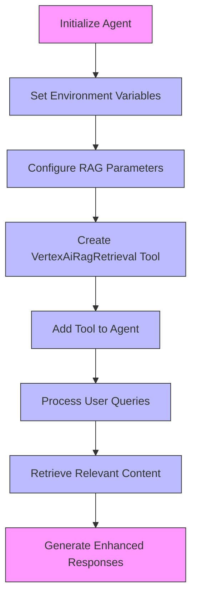

# RAG Memory

<cite>
**Referenced Files in This Document**   
- [vertex_ai_rag_memory_service.py](file://src/google/adk/memory/vertex_ai_rag_memory_service.py)
- [vertex_ai_rag_retrieval.py](file://src/google/adk/tools/retrieval/vertex_ai_rag_retrieval.py)
- [base_memory_service.py](file://src/google/adk/memory/base_memory_service.py)
- [memory_entry.py](file://src/google/adk/memory/memory_entry.py)
- [upload_docs_to_vertex_ai_search.py](file://contributing/samples/adk_answering_agent/upload_docs_to_vertex_ai_search.py)
- [agent.py](file://contributing/samples/rag_agent/agent.py)
</cite>

## Table of Contents
1. [Introduction](#introduction)
2. [Architecture Overview](#architecture-overview)
3. [Core Components](#core-components)
4. [RAG Memory Service Implementation](#rag-memory-service-implementation)
5. [Document Import and Corpus Management](#document-import-and-corpus-management)
6. [Retrieval Mechanism](#retrieval-mechanism)
7. [Configuration and Usage Examples](#configuration-and-usage-examples)
8. [Prompt Augmentation and Context Injection](#prompt-augmentation-and-context-injection)
9. [Performance Optimization and Error Handling](#performance-optimization-and-error-handling)
10. [Use Cases and Best Practices](#use-cases-and-best-practices)

## Introduction

The Vertex AI RAG (Retrieval-Augmented Generation) memory service provides a powerful mechanism for enhancing LLM responses with external knowledge by integrating Vertex AI's RAG functionality. This implementation enables agents to retrieve relevant information from specialized corpora and incorporate it into their responses, significantly improving accuracy and context-awareness. The system is designed to support knowledge-intensive applications such as customer support bots, research assistants, and technical documentation systems.

The RAG memory service architecture combines semantic search with traditional keyword matching to deliver high-quality retrieval results. It manages the entire lifecycle of RAG operations, from corpus creation and document import to context-aware retrieval during agent conversations. The service is tightly integrated with the ADK framework, allowing seamless access to external knowledge sources while maintaining conversation context and user-specific data.

**Section sources**
- [vertex_ai_rag_memory_service.py](file://src/google/adk/memory/vertex_ai_rag_memory_service.py#L1-L201)
- [vertex_ai_rag_retrieval.py](file://src/google/adk/tools/retrieval/vertex_ai_rag_retrieval.py#L1-L109)

## Architecture Overview

The RAG memory architecture consists of several interconnected components that work together to provide enhanced knowledge retrieval capabilities. At its core, the system uses Vertex AI RAG to store and retrieve contextual information, which is then integrated into the LLM response generation process.

**Diagram sources**
- [vertex_ai_rag_memory_service.py](file://src/google/adk/memory/vertex_ai_rag_memory_service.py#L39-L201)
- [vertex_ai_rag_retrieval.py](file://src/google/adk/tools/retrieval/vertex_ai_rag_retrieval.py#L37-L109)

## Core Components

The RAG memory implementation consists of several key components that work together to provide enhanced knowledge retrieval capabilities. The core components include the VertexAiRagMemoryService, which manages the storage and retrieval of contextual information, and the VertexAiRagRetrieval tool, which integrates RAG functionality into the agent's response generation process.

The BaseMemoryService provides the abstract interface for memory operations, defining the contract for adding sessions to memory and searching for relevant content. The MemoryEntry class represents individual memory entries with their content, author, and timestamp information. These components work together to create a cohesive system for managing external knowledge and incorporating it into agent conversations.

**Section sources**
- [base_memory_service.py](file://src/google/adk/memory/base_memory_service.py#L1-L79)
- [memory_entry.py](file://src/google/adk/memory/memory_entry.py#L1-L38)

## RAG Memory Service Implementation

The VertexAiRagMemoryService class implements the core functionality for storing and retrieving contextual information using Vertex AI RAG. The service is initialized with configuration parameters including the RAG corpus identifier, similarity threshold, and vector distance threshold. These parameters control the retrieval behavior and ensure that only relevant content is returned.

The service provides two primary methods: add_session_to_memory and search_memory. The add_session_to_memory method converts session data into a format suitable for storage in the RAG corpus, while the search_memory method retrieves relevant content based on a query. The implementation uses temporary files to efficiently transfer session data to the RAG corpus, with metadata stored in the display name field to enable filtering by application and user.

**Diagram sources**
- [vertex_ai_rag_memory_service.py](file://src/google/adk/memory/vertex_ai_rag_memory_service.py#L39-L201)
- [base_memory_service.py](file://src/google/adk/memory/base_memory_service.py#L41-L79)
- [memory_entry.py](file://src/google/adk/memory/memory_entry.py#L24-L38)

**Section sources**
- [vertex_ai_rag_memory_service.py](file://src/google/adk/memory/vertex_ai_rag_memory_service.py#L39-L201)

## Document Import and Corpus Management

The document import process for RAG corpora involves several steps to ensure that content is properly formatted and indexed for retrieval. Documents can be imported from various sources including Google Cloud Storage (GCS) and direct URLs. The import process handles different file types such as Markdown and Python files, converting them to appropriate formats for storage in the RAG corpus.

For Markdown files, the system converts content to HTML format since Vertex AI Search does not natively support the text/markdown content type. This conversion preserves the document structure while making it compatible with the search system. Python files are uploaded directly, maintaining their original format. The import process also handles metadata filtering and chunking strategies to optimize retrieval performance.

**Diagram sources**
- [upload_docs_to_vertex_ai_search.py](file://contributing/samples/adk_answering_agent/upload_docs_to_vertex_ai_search.py#L1-L223)

**Section sources**
- [upload_docs_to_vertex_ai_search.py](file://contributing/samples/adk_answering_agent/upload_docs_to_vertex_ai_search.py#L1-L223)

## Retrieval Mechanism

The retrieval mechanism combines semantic search with traditional keyword matching to deliver high-quality results. When a query is received, the system searches the RAG corpus for relevant content using vector similarity and keyword matching algorithms. The retrieval process is controlled by parameters such as similarity_top_k, which determines the number of results to return, and vector_distance_threshold, which filters out results that are too dissimilar to the query.

The search_memory method processes the retrieval results by filtering them based on application name and user ID, ensuring that only relevant content is returned. The system also handles overlapping timestamps by merging event lists, providing a coherent view of the retrieved information. This approach ensures that the most relevant and contextually appropriate content is incorporated into the LLM response.

**Diagram sources**
- [vertex_ai_rag_memory_service.py](file://src/google/adk/memory/vertex_ai_rag_memory_service.py#L108-L173)

**Section sources**
- [vertex_ai_rag_memory_service.py](file://src/google/adk/memory/vertex_ai_rag_memory_service.py#L108-L173)

## Configuration and Usage Examples

Configuring the RAG memory service involves setting up the necessary environment variables and initializing the service with appropriate parameters. The service can be configured to use specific RAG corpora, set similarity thresholds, and control the number of results returned. Configuration is typically done through environment variables or direct parameter passing during initialization.

Usage examples demonstrate how to create agents with RAG capabilities, import documents into the corpus, and perform context-aware retrieval during conversations. The examples show how to set up the VertexAiRagRetrieval tool with specific corpus identifiers and configure retrieval parameters for optimal performance.

**Diagram sources**
- [agent.py](file://contributing/samples/rag_agent/agent.py#L1-L52)

**Section sources**
- [agent.py](file://contributing/samples/rag_agent/agent.py#L1-L52)

## Prompt Augmentation and Context Injection

The RAG memory service enhances LLM responses through prompt augmentation and context injection. When a query is received, the system retrieves relevant content from the RAG corpus and injects it into the LLM prompt, providing additional context for generating responses. This process significantly improves the quality and accuracy of responses by incorporating external knowledge.

The context injection mechanism ensures that retrieved content is properly formatted and integrated into the conversation flow. The system maintains conversation history and user context, allowing for coherent and contextually appropriate responses. This approach enables agents to provide detailed, accurate answers to complex queries by leveraging both their internal knowledge and external information sources.

**Section sources**
- [vertex_ai_rag_memory_service.py](file://src/google/adk/memory/vertex_ai_rag_memory_service.py#L108-L173)
- [vertex_ai_rag_retrieval.py](file://src/google/adk/tools/retrieval/vertex_ai_rag_retrieval.py#L59-L109)

## Performance Optimization and Error Handling

The RAG memory service includes several performance optimization features and robust error handling mechanisms. Performance optimizations include efficient chunking strategies, metadata filtering, and caching mechanisms to reduce latency and improve retrieval speed. The system also provides configuration options for controlling the number of results returned and setting similarity thresholds.

Error handling is implemented at multiple levels, with try-catch blocks around critical operations such as document uploads and retrieval queries. The system handles common issues such as document parsing errors, retrieval relevance problems, and network connectivity issues. When errors occur, the system provides meaningful error messages and fallback mechanisms to ensure continued operation.

**Section sources**
- [vertex_ai_rag_memory_service.py](file://src/google/adk/memory/vertex_ai_rag_memory_service.py#L66-L106)
- [upload_docs_to_vertex_ai_search.py](file://contributing/samples/adk_answering_agent/upload_docs_to_vertex_ai_search.py#L1-L223)

## Use Cases and Best Practices

The RAG memory service is essential for knowledge-intensive applications such as customer support bots, research assistants, and technical documentation systems. These use cases benefit from the ability to retrieve and incorporate external knowledge into responses, providing accurate and comprehensive answers to user queries.

Best practices for using the RAG memory service include optimizing chunking strategies for the specific content type, using appropriate similarity thresholds, and implementing effective metadata filtering. It is also recommended to regularly update the RAG corpus with new content and monitor retrieval performance to identify areas for improvement. For large documentation sets, performance tuning is crucial to maintain low latency and high relevance in retrieval results.

**Section sources**
- [spec_kit_integration/INTEGRATION_COMPLETE.md](file://contributing/samples/spec_kit_integration/INTEGRATION_COMPLETE.md#L175-L189)
- [proposal_initial_agent_instruction.md](file://contributing/samples/openspec_integration/proposal_initial_agent_instruction.md#L129-L147)