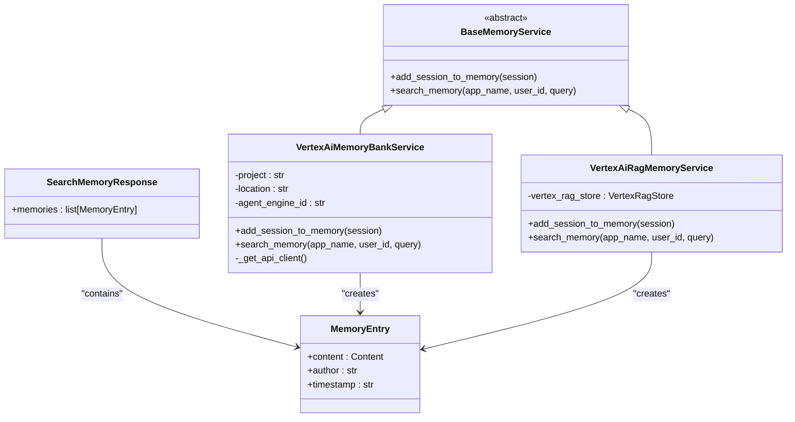
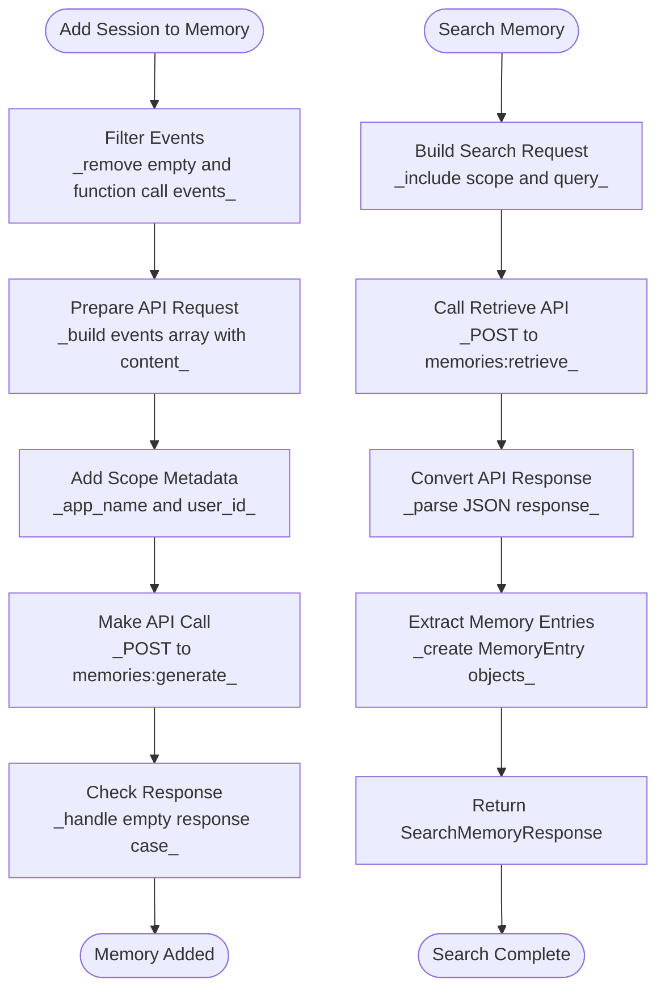
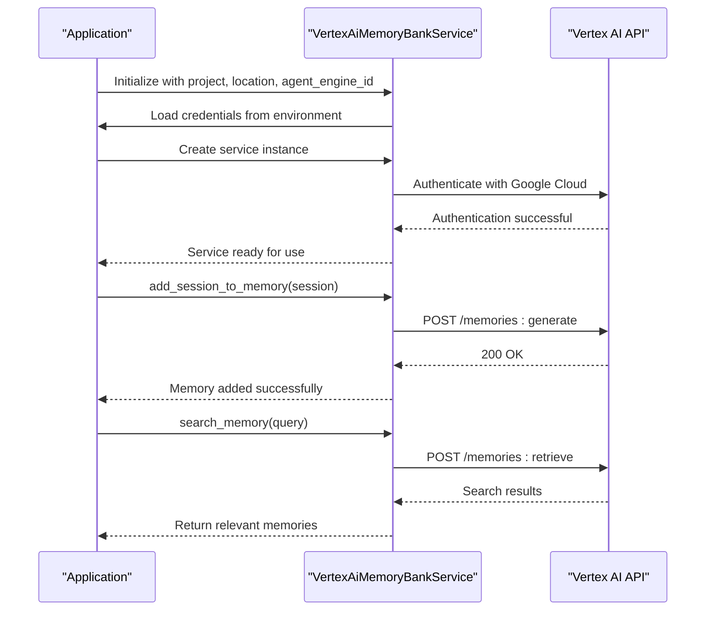
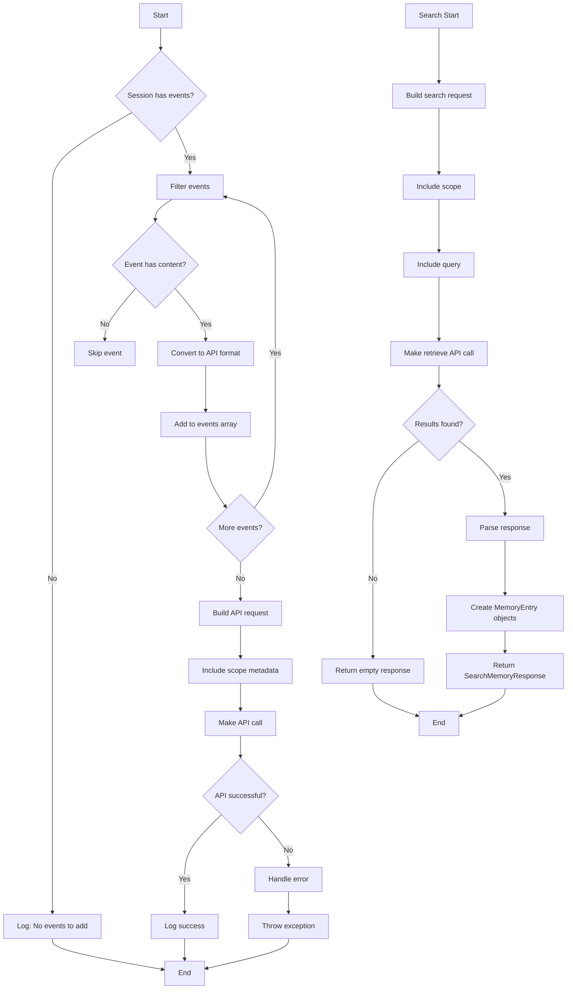
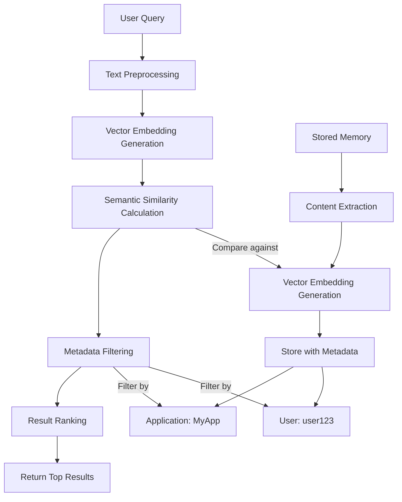
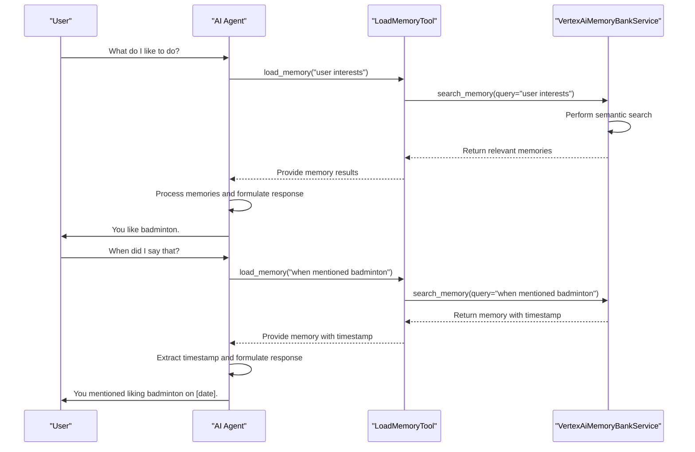
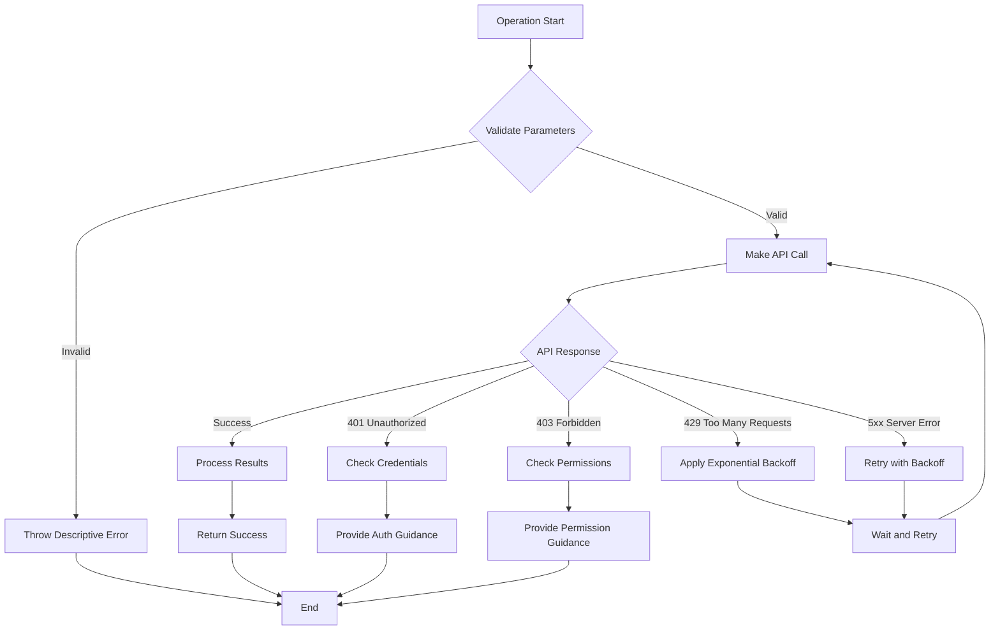
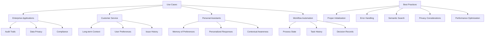

# Vertex AI Memory

<cite>
**Referenced Files in This Document**   
- [vertex_ai_memory_bank_service.py](file://src/google/adk/memory/vertex_ai_memory_bank_service.py)
- [base_memory_service.py](file://src/google/adk/memory/base_memory_service.py)
- [memory_entry.py](file://src/google/adk/memory/memory_entry.py)
- [vertex_ai_session_service.py](file://src/google/adk/sessions/vertex_ai_session_service.py)
- [load_memory_tool.py](file://src/google/adk/tools/load_memory_tool.py)
- [vertex_ai_rag_memory_service.py](file://src/google/adk/memory/vertex_ai_rag_memory_service.py)
- [test_vertex_ai_memory_bank_service.py](file://tests/unittests/memory/test_vertex_ai_memory_bank_service.py)
- [settings.py](file://contributing/samples/adk_answering_agent/settings.py)
</cite>

## Table of Contents
1. [Introduction](#introduction)
2. [Architecture Overview](#architecture-overview)
3. [Core Components](#core-components)
4. [Authentication and Configuration](#authentication-and-configuration)
5. [Memory Operations](#memory-operations)
6. [Semantic Search and Metadata Filtering](#semantic-search-and-metadata-filtering)
7. [Integration with Agent Workflows](#integration-with-agent-workflows)
8. [Error Handling and Performance Optimization](#error-handling-and-performance-optimization)
9. [Use Cases and Best Practices](#use-cases-and-best-practices)
10. [Conclusion](#conclusion)

## Introduction

The Vertex AI Memory Bank service provides a scalable, persistent memory storage solution for AI agents within the Google Cloud ecosystem. This service enables agents to maintain long-term context across sessions, allowing for more personalized and context-aware interactions. The implementation is designed for production environments where enterprise-grade reliability, audit trails, and persistent user context are required.

The VertexAiMemoryBankService class serves as the primary interface for interacting with Google Cloud's Vertex AI Memory Bank, offering CRUD operations for memory entries and semantic search capabilities through vector embeddings. This documentation provides a comprehensive analysis of the service architecture, implementation details, and integration patterns, with a focus on practical usage, error handling, and performance optimization.

The memory system is particularly valuable for applications requiring long-term user context retention, such as customer service bots, personal assistants, and enterprise workflow automation tools. By leveraging Google Cloud's infrastructure, the service ensures data persistence, scalability, and security while providing low-latency access to stored memories.

## Architecture Overview

The Vertex AI Memory Bank service follows a layered architecture that integrates with Google Cloud's Vertex AI platform to provide persistent memory storage for AI agents. The service is built on a foundation of abstraction and extensibility, allowing for different memory implementations while maintaining a consistent interface.

**Diagram sources**
- [vertex_ai_memory_bank_service.py](file://src/google/adk/memory/vertex_ai_memory_bank_service.py#L38-L165)
- [base_memory_service.py](file://src/google/adk/memory/base_memory_service.py#L41-L79)
- [memory_entry.py](file://src/google/adk/memory/memory_entry.py#L24-L38)

The architecture centers around the BaseMemoryService abstract class, which defines the contract for all memory services in the system. The VertexAiMemoryBankService implements this interface specifically for Google Cloud's Vertex AI Memory Bank, handling the integration with the underlying API. The service works in conjunction with the Session system, where each session contains a sequence of events that can be converted into memory entries.

The memory entries are structured as MemoryEntry objects containing the content, author information, and timestamp. When searching for memories, the service returns a SearchMemoryResponse containing a list of relevant MemoryEntry objects. This design allows for flexible querying and retrieval of contextual information while maintaining a clean separation between the memory storage mechanism and the application logic.

**Section sources**
- [vertex_ai_memory_bank_service.py](file://src/google/adk/memory/vertex_ai_memory_bank_service.py#L38-L165)
- [base_memory_service.py](file://src/google/adk/memory/base_memory_service.py#L41-L79)

## Core Components

The Vertex AI Memory Bank service implementation consists of several core components that work together to provide persistent memory storage and retrieval capabilities. The primary component is the VertexAiMemoryBankService class, which serves as the bridge between the application and Google Cloud's Vertex AI Memory Bank API.

The service initialization requires three key parameters: project ID, location, and agent engine ID. These parameters are used to configure the connection to the appropriate Vertex AI resources. The agent engine ID is particularly important as it identifies the specific reasoning engine that will manage the memory operations. During initialization, these parameters are stored as instance variables and used in subsequent API calls.

The memory entry model is defined by the MemoryEntry class, which encapsulates the essential components of a memory: content, author, and timestamp. The content field uses Google's Content type from the genai library, allowing for rich text and structured data storage. The timestamp follows ISO 8601 format, ensuring consistent time representation across different systems and time zones.

The service implements two primary operations: adding sessions to memory and searching for relevant memories. When adding a session to memory, the service processes each event in the session, filtering out events that don't contain meaningful content (such as function calls or empty messages). The remaining events are converted into a format suitable for the Vertex AI API and sent in a batch request to generate memories.

For memory retrieval, the service performs semantic search using vector embeddings, allowing for contextually relevant results even when the query doesn't exactly match the stored content. The search operation includes metadata filtering based on application name and user ID, ensuring that memories are scoped appropriately and preventing cross-user data leakage.

**Diagram sources**
- [vertex_ai_memory_bank_service.py](file://src/google/adk/memory/vertex_ai_memory_bank_service.py#L61-L133)
- [memory_entry.py](file://src/google/adk/memory/memory_entry.py#L24-L38)

**Section sources**
- [vertex_ai_memory_bank_service.py](file://src/google/adk/memory/vertex_ai_memory_bank_service.py#L38-L165)
- [memory_entry.py](file://src/google/adk/memory/memory_entry.py#L24-L38)

## Authentication and Configuration

The Vertex AI Memory Bank service integrates with Google Cloud's authentication system to ensure secure access to memory resources. Authentication is configured through environment variables and credential management, following Google Cloud best practices for secure credential handling.

The primary configuration parameters include the Google Cloud project ID, location, and agent engine ID, which are typically set through environment variables such as GOOGLE_CLOUD_PROJECT and GOOGLE_CLOUD_LOCATION. These values are used to initialize the VertexAiMemoryBankService instance and establish the connection to the appropriate Vertex AI resources.

For authentication, the service supports multiple credential types, including service account keys and OAuth2. Service account keys are suitable for server-to-server communication in production environments, while OAuth2 is preferred for applications requiring user-level authentication. The authentication method is specified through the CREDENTIALS_TYPE environment variable, which can be set to AuthCredentialTypes.SERVICE_ACCOUNT or AuthCredentialTypes.OAUTH2.

When using OAuth2 authentication, additional configuration is required, including the OAuth client ID and client secret. These credentials must be registered in the Google Cloud Console and configured with the appropriate redirect URIs. The OAuth flow follows the standard authorization code grant pattern, with the application redirecting users to Google's authorization server and handling the callback to obtain access tokens.

The service also supports Vertex AI Express Mode, which uses an API key instead of project and location parameters. This mode is activated when both GOOGLE_GENAI_USE_VERTEXAI is set to TRUE and GOOGLE_API_KEY is provided. Express Mode simplifies configuration for development and testing but should be used with caution in production environments due to the security implications of API key usage.

**Diagram sources**
- [vertex_ai_memory_bank_service.py](file://src/google/adk/memory/vertex_ai_memory_bank_service.py#L135-L147)
- [settings.py](file://contributing/samples/adk_answering_agent/settings.py#L21-L45)

**Section sources**
- [vertex_ai_memory_bank_service.py](file://src/google/adk/memory/vertex_ai_memory_bank_service.py#L41-L58)
- [settings.py](file://contributing/samples/adk_answering_agent/settings.py#L21-L45)

## Memory Operations

The Vertex AI Memory Bank service provides comprehensive CRUD operations for managing memory entries, with a focus on session-based memory management and semantic search capabilities. The primary operations are adding sessions to memory and retrieving relevant memories through search queries.

When adding a session to memory, the service processes each event in the session's event history. Events are filtered to exclude those without meaningful content, such as empty messages or function call events. This filtering ensures that only relevant conversational content is stored as memories, optimizing storage efficiency and search relevance. The remaining events are converted into a format compatible with the Vertex AI API and sent in a batch request to the memories:generate endpoint.

The memory creation process includes important metadata such as the application name and user ID, which are used for scoping and access control. This metadata ensures that memories are properly isolated between different applications and users, preventing unauthorized access to sensitive information. The service also handles edge cases, such as sessions with no valid events, by logging an informational message and skipping the API call.

For memory retrieval, the service implements semantic search using vector embeddings, allowing for contextually relevant results even when the query doesn't exactly match the stored content. The search operation supports metadata filtering through the scope parameter, which includes the application name and user ID. This ensures that search results are limited to memories belonging to the specified application and user, maintaining data privacy and relevance.

The search results are returned as a SearchMemoryResponse containing a list of MemoryEntry objects. Each memory entry includes the content, author information, and timestamp, providing a complete representation of the stored memory. The service handles cases where no matching memories are found by returning an empty SearchMemoryResponse, allowing the application to handle the absence of relevant context gracefully.

**Diagram sources**
- [vertex_ai_memory_bank_service.py](file://src/google/adk/memory/vertex_ai_memory_bank_service.py#L61-L133)
- [test_vertex_ai_memory_bank_service.py](file://tests/unittests/memory/test_vertex_ai_memory_bank_service.py#L134-L188)

**Section sources**
- [vertex_ai_memory_bank_service.py](file://src/google/adk/memory/vertex_ai_memory_bank_service.py#L61-L133)

## Semantic Search and Metadata Filtering

The Vertex AI Memory Bank service implements advanced semantic search capabilities through vector embeddings, enabling contextually relevant memory retrieval even when exact keyword matches are not present. This semantic search functionality is a key differentiator from traditional keyword-based search systems, allowing the service to understand the meaning and context of both queries and stored memories.

The search process begins with the conversion of the query text into a vector embedding using Google's embedding models. This vector representation captures the semantic meaning of the query, including synonyms, related concepts, and contextual relationships. The service then compares this query vector against the vectors of stored memories, identifying those with the highest semantic similarity.

Metadata filtering is implemented through the scope parameter, which includes the application name and user ID. This ensures that search results are limited to memories belonging to the specified application and user, maintaining data privacy and relevance. The filtering occurs at the API level, preventing unauthorized access to memories from other applications or users.

The service also supports similarity thresholds and result limits, allowing applications to control the precision and quantity of search results. By adjusting the similarity threshold, applications can balance between recall (finding all potentially relevant memories) and precision (ensuring high relevance of results). The result limit prevents excessive data transfer and processing, particularly important in high-volume applications.

The combination of semantic search and metadata filtering creates a powerful mechanism for retrieving relevant contextual information. For example, a query about "favorite sports" can retrieve memories containing "I like badminton" even though the exact words don't match, while still respecting the application and user boundaries defined in the scope.

**Diagram sources**
- [vertex_ai_memory_bank_service.py](file://src/google/adk/memory/vertex_ai_memory_bank_service.py#L97-L133)
- [vertex_ai_rag_memory_service.py](file://src/google/adk/memory/vertex_ai_rag_memory_service.py#L114-L173)

**Section sources**
- [vertex_ai_memory_bank_service.py](file://src/google/adk/memory/vertex_ai_memory_bank_service.py#L97-L133)

## Integration with Agent Workflows

The Vertex AI Memory Bank service integrates seamlessly with agent workflows through the LoadMemoryTool, enabling agents to access persistent memory during conversation. This integration allows agents to maintain long-term context across sessions, providing more personalized and context-aware responses.

The LoadMemoryTool serves as the bridge between the agent's reasoning process and the memory storage system. When an agent determines that a query requires historical context, it can invoke the load_memory function with an appropriate search query. The tool handles the interaction with the VertexAiMemoryBankService, retrieving relevant memories and presenting them to the agent for consideration.

The integration follows a pattern where the agent's instruction set includes guidance on when to use memory retrieval. For example, instructions might include: "You have memory. You can use it to answer questions. If any questions need you to look up the memory, you should call load_memory function with a query." This explicit instruction ensures that the agent understands its capability to access historical context.

In practice, this integration enables sophisticated conversational patterns. An agent can remember user preferences, past interactions, and important facts across multiple sessions. For instance, if a user previously mentioned liking badminton, the agent can recall this information when asked about favorite sports, even if the conversation occurs days or weeks later.

The service also integrates with session management, where completed sessions can be automatically added to memory for future reference. This creates a continuous learning loop where each interaction contributes to the agent's long-term knowledge base, improving its ability to provide relevant and personalized responses over time.

**Diagram sources**
- [load_memory_tool.py](file://src/google/adk/tools/load_memory_tool.py#L36-L93)
- [vertex_ai_memory_bank_service.py](file://src/google/adk/memory/vertex_ai_memory_bank_service.py#L97-L133)

**Section sources**
- [load_memory_tool.py](file://src/google/adk/tools/load_memory_tool.py#L36-L93)

## Error Handling and Performance Optimization

The Vertex AI Memory Bank service implements comprehensive error handling and performance optimization strategies to ensure reliable operation in production environments. These mechanisms address common issues such as authentication failures, quota limits, and latency considerations, providing robust solutions for maintaining service availability and responsiveness.

Authentication failures are handled through proper credential validation and clear error messaging. The service validates required parameters during initialization, raising descriptive exceptions when critical information like the agent engine ID is missing. This early validation prevents runtime errors and helps developers identify configuration issues quickly.

For quota limits and rate limiting, the service relies on Google Cloud's built-in mechanisms while providing appropriate error handling. When API quotas are exceeded, the service receives standard HTTP 429 responses, which should be handled by implementing retry mechanisms with exponential backoff. This approach prevents overwhelming the API during periods of high demand and ensures fair usage across multiple clients.

Latency considerations are addressed through asynchronous operations and efficient data handling. All memory operations are implemented as async methods, allowing non-blocking execution and preventing the agent from becoming unresponsive during memory operations. The service also minimizes data transfer by filtering events before sending them to the API and handling empty responses efficiently.

Performance optimization includes batching operations where possible and caching frequently accessed data. For example, when adding a session to memory, all relevant events are sent in a single batch request rather than individual calls, reducing network overhead and improving throughput. The service also implements proper logging at different levels (info for normal operation, debug for detailed response inspection), enabling monitoring and troubleshooting without impacting performance.

**Diagram sources**
- [vertex_ai_memory_bank_service.py](file://src/google/adk/memory/vertex_ai_memory_bank_service.py#L64-L65)
- [vertex_ai_session_service.py](file://src/google/adk/sessions/vertex_ai_session_service.py#L121-L149)

**Section sources**
- [vertex_ai_memory_bank_service.py](file://src/google/adk/memory/vertex_ai_memory_bank_service.py#L64-L65)

## Use Cases and Best Practices

The Vertex AI Memory Bank service is ideal for production environments requiring persistent, scalable memory storage for AI agents. Key use cases include enterprise applications with audit trail requirements, customer service systems maintaining long-term user context, and personal assistant applications that need to remember user preferences and history.

For enterprise applications, the service provides a secure and compliant way to store interaction history with proper access controls and audit capabilities. The metadata filtering ensures that sensitive information is properly scoped to specific applications and users, meeting regulatory requirements for data privacy and security.

In customer service scenarios, the service enables agents to maintain context across multiple interactions, providing a seamless experience for users. Agents can remember previous conversations, resolved issues, and user preferences, allowing for more personalized and efficient support. This long-term context reduces the need for users to repeat information and improves overall satisfaction.

Best practices for implementing the Vertex AI Memory Bank service include proper initialization with all required parameters, implementing appropriate error handling for authentication and quota issues, and using semantic search queries that capture the intent rather than relying on exact keyword matches. Applications should also consider the privacy implications of storing user data and implement appropriate data retention policies.

For optimal performance, applications should batch memory operations when possible, use asynchronous methods to prevent blocking, and implement caching for frequently accessed memories. Monitoring and logging should be enabled to track usage patterns, identify potential issues, and optimize resource allocation.

**Diagram sources**
- [vertex_ai_memory_bank_service.py](file://src/google/adk/memory/vertex_ai_memory_bank_service.py#L41-L58)
- [base_memory_service.py](file://src/google/adk/memory/base_memory_service.py#L48-L78)

**Section sources**
- [vertex_ai_memory_bank_service.py](file://src/google/adk/memory/vertex_ai_memory_bank_service.py#L41-L58)

## Conclusion

The Vertex AI Memory Bank service provides a robust, scalable solution for persistent memory storage in AI agent applications. By leveraging Google Cloud's infrastructure, the service offers enterprise-grade reliability, security, and performance while enabling sophisticated context-aware interactions through semantic search and metadata filtering.

The architecture, centered around the VertexAiMemoryBankService class, provides a clean abstraction for integrating persistent memory into agent workflows. The service's integration with the LoadMemoryTool enables agents to access historical context seamlessly, creating more personalized and intelligent interactions. The implementation follows best practices for authentication, error handling, and performance optimization, making it suitable for production environments with demanding requirements.

Key strengths of the service include its support for long-term user context, enterprise-grade security features, and seamless integration with Google Cloud's ecosystem. The semantic search capabilities, powered by vector embeddings, allow for contextually relevant memory retrieval that goes beyond simple keyword matching, enabling more natural and intuitive interactions.

For developers implementing AI agents, the Vertex AI Memory Bank service offers a powerful tool for creating applications that can remember, learn, and adapt over time. By following the best practices outlined in this documentation, teams can build robust, scalable solutions that provide exceptional user experiences while maintaining data privacy and security.