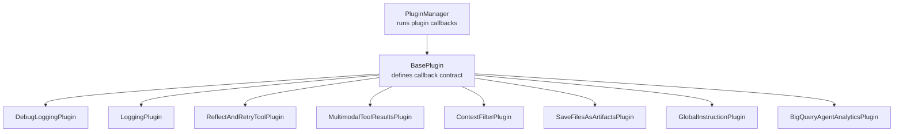
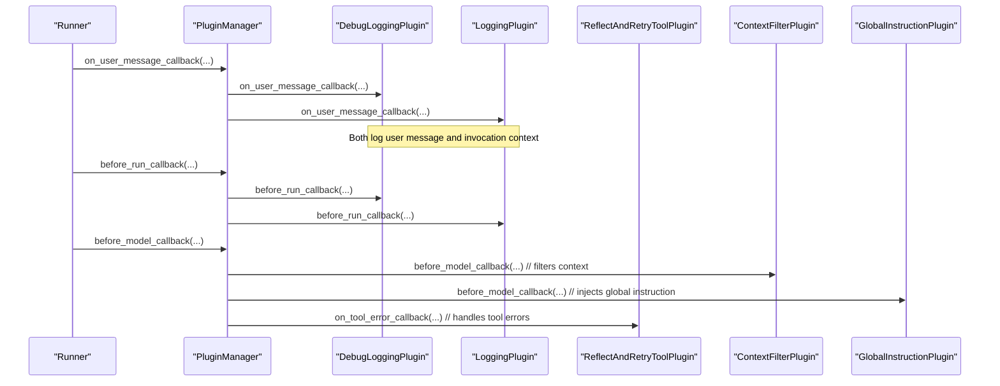
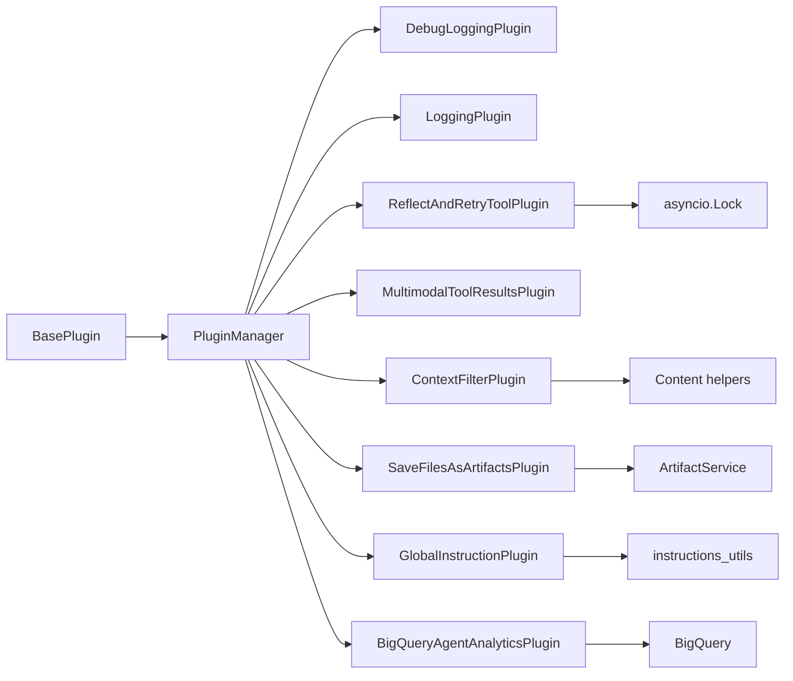

# Built-in Plugins

<cite>
**Referenced Files in This Document**
- [base_plugin.py](file://src/google/adk/plugins/base_plugin.py)
- [plugin_manager.py](file://src/google/adk/plugins/plugin_manager.py)
- [debug_logging_plugin.py](file://src/google/adk/plugins/debug_logging_plugin.py)
- [logging_plugin.py](file://src/google/adk/plugins/logging_plugin.py)
- [reflect_retry_tool_plugin.py](file://src/google/adk/plugins/reflect_retry_tool_plugin.py)
- [multimodal_tool_results_plugin.py](file://src/google/adk/plugins/multimodal_tool_results_plugin.py)
- [context_filter_plugin.py](file://src/google/adk/plugins/context_filter_plugin.py)
- [save_files_as_artifacts_plugin.py](file://src/google/adk/plugins/save_files_as_artifacts_plugin.py)
- [bigquery_agent_analytics_plugin.py](file://src/google/adk/plugins/bigquery_agent_analytics_plugin.py)
- [global_instruction_plugin.py](file://src/google/adk/plugins/global_instruction_plugin.py)
- [agent.py](file://contributing/samples/plugin_debug_logging/agent.py)
- [README.md](file://contributing/samples/plugin_reflect_tool_retry/README.md)
</cite>

## Table of Contents
1. [Introduction](#introduction)
2. [Project Structure](#project-structure)
3. [Core Components](#core-components)
4. [Architecture Overview](#architecture-overview)
5. [Detailed Component Analysis](#detailed-component-analysis)
6. [Dependency Analysis](#dependency-analysis)
7. [Performance Considerations](#performance-considerations)
8. [Troubleshooting Guide](#troubleshooting-guide)
9. [Conclusion](#conclusion)

## Introduction
This document provides comprehensive documentation for ADK’s built-in plugins and their specific functionalities. It covers the debug logging plugin for execution tracking, reflect retry tool plugin for automatic tool retry mechanisms, multimodal tool results plugin for enhanced tool output handling, context filter plugin for selective context processing, save files as artifacts plugin for automatic artifact creation, bigquery agent analytics plugin for analytics collection, global instruction plugin for system-wide instruction injection, and logging plugin for structured logging. For each plugin, you will find use cases, configuration options, callback methods, practical implementation examples, performance implications, best practices, integration patterns, troubleshooting tips, and optimization strategies.

## Project Structure
ADK’s plugin system is centered around a base plugin interface and a plugin manager that orchestrates plugin lifecycle callbacks. Plugins are registered with the runner and executed in a deterministic order. The built-in plugins reside under the plugins package and integrate with agent, tool, and LLM execution flows.

**Diagram sources**
- [plugin_manager.py](file://src/google/adk/plugins/plugin_manager.py#L60-L348)
- [base_plugin.py](file://src/google/adk/plugins/base_plugin.py#L41-L373)
- [debug_logging_plugin.py](file://src/google/adk/plugins/debug_logging_plugin.py#L67-L573)
- [logging_plugin.py](file://src/google/adk/plugins/logging_plugin.py#L37-L324)
- [reflect_retry_tool_plugin.py](file://src/google/adk/plugins/reflect_retry_tool_plugin.py#L54-L383)
- [multimodal_tool_results_plugin.py](file://src/google/adk/plugins/multimodal_tool_results_plugin.py#L32-L91)
- [context_filter_plugin.py](file://src/google/adk/plugins/context_filter_plugin.py#L100-L156)
- [save_files_as_artifacts_plugin.py](file://src/google/adk/plugins/save_files_as_artifacts_plugin.py#L35-L188)
- [global_instruction_plugin.py](file://src/google/adk/plugins/global_instruction_plugin.py#L34-L131)
- [bigquery_agent_analytics_plugin.py](file://src/google/adk/plugins/bigquery_agent_analytics_plugin.py#L448-L522)

**Section sources**
- [plugin_manager.py](file://src/google/adk/plugins/plugin_manager.py#L60-L348)
- [base_plugin.py](file://src/google/adk/plugins/base_plugin.py#L41-L373)

## Core Components
- BasePlugin: Defines the plugin callback contract for user messages, invocation lifecycle, agent lifecycle, model requests/responses, tool calls/results, and error handling.
- PluginManager: Registers plugins, executes callbacks in order, supports early exit semantics, and manages plugin close lifecycle.

Key callback categories:
- Invocation lifecycle: on_user_message_callback, before_run_callback, after_run_callback
- Agent lifecycle: before_agent_callback, after_agent_callback
- Model lifecycle: before_model_callback, after_model_callback, on_model_error_callback
- Tool lifecycle: before_tool_callback, after_tool_callback, on_tool_error_callback
- Event handling: on_event_callback

Early exit behavior: If a plugin returns a non-None value from a callback, subsequent plugins and agent callbacks are skipped for that event.

**Section sources**
- [base_plugin.py](file://src/google/adk/plugins/base_plugin.py#L114-L373)
- [plugin_manager.py](file://src/google/adk/plugins/plugin_manager.py#L260-L307)

## Architecture Overview
The plugin system integrates with the runner’s execution pipeline. The PluginManager invokes plugin callbacks at key moments, allowing plugins to observe or modify inputs/outputs. Some plugins mutate LLM requests (e.g., injecting instructions or filtering context), others capture diagnostics (debug logging), and some transform tool outputs (multimodal results).

**Diagram sources**
- [plugin_manager.py](file://src/google/adk/plugins/plugin_manager.py#L117-L258)
- [debug_logging_plugin.py](file://src/google/adk/plugins/debug_logging_plugin.py#L218-L372)
- [logging_plugin.py](file://src/google/adk/plugins/logging_plugin.py#L70-L140)
- [reflect_retry_tool_plugin.py](file://src/google/adk/plugins/reflect_retry_tool_plugin.py#L204-L266)
- [context_filter_plugin.py](file://src/google/adk/plugins/context_filter_plugin.py#L125-L155)
- [global_instruction_plugin.py](file://src/google/adk/plugins/global_instruction_plugin.py#L62-L106)

## Detailed Component Analysis

### Debug Logging Plugin
Purpose:
- Captures complete interaction data (user messages, agent lifecycle, LLM requests/responses, tool calls/results, events, session state snapshots) to a YAML file for debugging and reproducibility.

Key configuration options:
- output_path: Path to the output YAML file (default: "adk_debug.yaml")
- include_session_state: Whether to include a session state snapshot at invocation end
- include_system_instruction: Whether to include full system instructions in LLM request logs

Callback methods used:
- on_user_message_callback
- before_run_callback
- on_event_callback
- after_run_callback
- before_agent_callback, after_agent_callback
- before_model_callback, after_model_callback, on_model_error_callback
- before_tool_callback, after_tool_callback, on_tool_error_callback

Implementation highlights:
- Maintains per-invocation state and serializes content safely, including multimodal parts and tool results
- Writes each invocation as a separate YAML document separated by "---"
- Includes timestamps, invocation IDs, agent names, and action metadata

Practical example:
- See the sample app that registers DebugLoggingPlugin and runs a multi-tool agent, generating a detailed YAML log.

Performance implications:
- File I/O overhead; consider rotating or limiting included content for long sessions
- Serialization cost for large multimodal payloads; consider disabling inline data content in serialized logs

Integration patterns:
- Use with LoggingPlugin for console visibility and DebugLoggingPlugin for persistent diagnostics
- Combine with ContextFilterPlugin to reduce context size before logging

**Section sources**
- [debug_logging_plugin.py](file://src/google/adk/plugins/debug_logging_plugin.py#L67-L573)
- [agent.py](file://contributing/samples/plugin_debug_logging/agent.py#L107-L124)

### Logging Plugin
Purpose:
- Provides console-based structured logging for each callback point to aid development and debugging.

Key configuration options:
- None; minimal configuration via constructor name

Callback methods used:
- on_user_message_callback, before_run_callback, on_event_callback, after_run_callback
- before_agent_callback, after_agent_callback
- before_model_callback, after_model_callback, on_model_error_callback
- before_tool_callback, after_tool_callback, on_tool_error_callback

Implementation highlights:
- Emits formatted console logs with contextual information (invocation IDs, agent names, tool names, content summaries)
- Truncates long content to maintain readability

Practical example:
- Register LoggingPlugin alongside other plugins to observe end-to-end execution flow

Performance implications:
- Low overhead; primarily console I/O
- Safe for production use in development environments

Integration patterns:
- Pair with DebugLoggingPlugin for both console and persistent logs

**Section sources**
- [logging_plugin.py](file://src/google/adk/plugins/logging_plugin.py#L37-L324)

### Reflect Retry Tool Plugin
Purpose:
- Provides self-healing, concurrent-safe error recovery for tool failures by intercepting tool errors, generating structured reflection guidance, and retrying up to a configurable limit.

Key configuration options:
- max_retries: Maximum consecutive failures before giving up (0 = no retries)
- throw_exception_if_retry_exceeded: Whether to raise the final exception or return guidance
- tracking_scope: Per-invocation or global failure tracking

Callback methods used:
- after_tool_callback (detects errors in tool results)
- on_tool_error_callback (handles exceptions)
- Internal state management via scoped counters and locks

Implementation highlights:
- Concurrency-safe failure counting using asyncio.Lock
- Structured reflection guidance with retry count and actionable suggestions
- Extensible via extract_error_from_result to detect errors in non-exception tool results

Practical example:
- See the sample README demonstrating retries for both exceptions and hallucinated tool names.

Performance implications:
- Minimal overhead; mainly CPU time for reflection message generation
- Lock contention negligible for typical concurrency levels

Integration patterns:
- Use with LoggingPlugin to observe retry decisions and outcomes
- Combine with ContextFilterPlugin to reduce context size when retries increase token usage

**Section sources**
- [reflect_retry_tool_plugin.py](file://src/google/adk/plugins/reflect_retry_tool_plugin.py#L54-L383)
- [README.md](file://contributing/samples/plugin_reflect_tool_retry/README.md#L1-L76)

### Multimodal Tool Results Plugin
Purpose:
- Enables tools to return lists of multimodal parts directly, which are later attached to the LLM request context.

Key configuration options:
- None; automatically processes compatible tool results

Callback methods used:
- after_tool_callback: Saves returned parts into ToolContext state
- before_model_callback: Attaches saved parts to the last content part of the LLM request

Implementation highlights:
- Detects google.genai.types.Part or list[types.Part] results
- Accumulates parts across tool calls and appends them to the LLM request before model call

Practical example:
- Useful when tools return images, code execution results, or other multimodal content that should be presented to the model

Performance implications:
- Low overhead; only appends parts to the last content element
- Avoids duplicating content across multiple turns

Integration patterns:
- Works with DebugLoggingPlugin to capture multimodal tool outputs in logs

**Section sources**
- [multimodal_tool_results_plugin.py](file://src/google/adk/plugins/multimodal_tool_results_plugin.py#L32-L91)

### Context Filter Plugin
Purpose:
- Reduces LLM context size by filtering out older invocations and optionally applying a custom filter function.

Key configuration options:
- num_invocations_to_keep: Number of recent invocations to retain
- custom_filter: A callable that receives and returns filtered content list
- name: Plugin instance name

Callback methods used:
- before_model_callback: Filters llm_request.contents before model call

Implementation highlights:
- Preserves function call/response pairs by adjusting split index to avoid orphaned responses
- Identifies invocation start indices based on human user messages
- Applies custom_filter after invocation-based trimming

Practical example:
- Use when long conversations exceed model context limits

Performance implications:
- Efficient list slicing and minimal scanning of content
- Avoids expensive deep transformations by working with shallow content sequences

Integration patterns:
- Use with LoggingPlugin to monitor context trimming decisions

**Section sources**
- [context_filter_plugin.py](file://src/google/adk/plugins/context_filter_plugin.py#L100-L156)

### Save Files As Artifacts Plugin
Purpose:
- Automatically saves files embedded in user messages as session-scoped artifacts and replaces them with placeholders and model-accessible references.

Key configuration options:
- None; relies on artifact service availability

Callback methods used:
- on_user_message_callback: Processes user message parts, saves artifacts, and constructs file reference parts when URIs are model-accessible

Implementation highlights:
- Uses artifact service to persist inline_data parts
- Generates placeholders for user visibility and attaches FileData parts when canonical URIs are model-accessible
- Falls back gracefully if artifact service is unavailable

Practical example:
- Allows users to upload files in chat and have them available to tools within the session

Performance implications:
- Network I/O for artifact storage and resolution
- URI parsing and MIME type detection overhead

Integration patterns:
- Combine with LoggingPlugin to observe artifact creation and reference attachment

**Section sources**
- [save_files_as_artifacts_plugin.py](file://src/google/adk/plugins/save_files_as_artifacts_plugin.py#L35-L188)

### BigQuery Agent Analytics Plugin
Purpose:
- Streams agent events and traces to BigQuery for analytics and observability, with batching, retries, and schema evolution support.

Key configuration options:
- enabled: Enable/disable logging
- event_allowlist/event_denylist: Control which events are logged
- max_content_length: Truncate long text content
- table_id: Target BigQuery table
- clustering_fields: Clustering fields for the table
- log_multi_modal_content: Whether to log detailed content parts
- retry_config: Retry policy for BigQuery writes
- batch_size/batch_flush_interval: Batching controls
- shutdown_timeout: Graceful shutdown timeout
- queue_max_size: In-memory queue capacity
- content_formatter: Custom formatter for content
- gcs_bucket_name: Optional GCS bucket for large content offload
- connection_id: Connection ID for ObjectRef authorization
- log_session_metadata: Whether to log session metadata
- custom_tags: Static tags to annotate logs
- auto_schema_upgrade: Auto-add columns on schema changes
- create_views: Auto-create per-event-type views

Callback methods used:
- Orchestrated by internal trace and event handlers; decorated with safe callback wrapper to prevent plugin errors from crashing runs

Implementation highlights:
- Async-safe trace management using contextvars
- Fork-safe reset for child processes
- Smart truncation and schema conversion helpers
- Configurable batching and retry policies

Practical example:
- Deploy in production to monitor agent behavior and performance

Performance implications:
- Network I/O and BigQuery write latency
- Batch sizing and flush interval tuning impact throughput and latency
- GCS offloading reduces payload sizes for large content

Integration patterns:
- Use with LoggingPlugin for lightweight console logs and DebugLoggingPlugin for detailed YAML logs

**Section sources**
- [bigquery_agent_analytics_plugin.py](file://src/google/adk/plugins/bigquery_agent_analytics_plugin.py#L448-L522)
- [bigquery_agent_analytics_plugin.py](file://src/google/adk/plugins/bigquery_agent_analytics_plugin.py#L110-L128)

### Global Instruction Plugin
Purpose:
- Injects global instructions into LLM requests before they are sent to the model, replacing or prepending to existing system instructions.

Key configuration options:
- global_instruction: Either a string or an InstructionProvider function (sync or async) that resolves to a string
- name: Plugin instance name

Callback methods used:
- before_model_callback: Modifies llm_request.config.system_instruction

Implementation highlights:
- Resolves InstructionProvider asynchronously or injects session state for string instructions
- Prepends global instruction to preserve user-provided instructions
- Handles both string and iterable system instructions

Practical example:
- Apply consistent persona or identity across all agents in an application

Performance implications:
- Minimal overhead; string concatenation and async resolution cost
- Safe to enable in production

Integration patterns:
- Use with LoggingPlugin to confirm instruction injection behavior

**Section sources**
- [global_instruction_plugin.py](file://src/google/adk/plugins/global_instruction_plugin.py#L34-L131)

## Dependency Analysis
The built-in plugins depend on the BasePlugin interface and PluginManager orchestration. Some plugins depend on internal utilities or external services:
- DebugLoggingPlugin depends on serialization utilities and YAML
- ReflectAndRetryToolPlugin uses asyncio.Lock and Pydantic models
- ContextFilterPlugin uses content role and function call/response pairing logic
- SaveFilesAsArtifactsPlugin depends on artifact service and URI parsing
- BigQueryAgentAnalyticsPlugin depends on BigQuery, BigQuery Storage, GCS, and OpenTelemetry
- GlobalInstructionPlugin depends on instruction utilities and ReadonlyContext

**Diagram sources**
- [base_plugin.py](file://src/google/adk/plugins/base_plugin.py#L41-L373)
- [plugin_manager.py](file://src/google/adk/plugins/plugin_manager.py#L60-L348)
- [reflect_retry_tool_plugin.py](file://src/google/adk/plugins/reflect_retry_tool_plugin.py#L135-L136)
- [context_filter_plugin.py](file://src/google/adk/plugins/context_filter_plugin.py#L32-L97)
- [save_files_as_artifacts_plugin.py](file://src/google/adk/plugins/save_files_as_artifacts_plugin.py#L24-L27)
- [bigquery_agent_analytics_plugin.py](file://src/google/adk/plugins/bigquery_agent_analytics_plugin.py#L49-L71)
- [global_instruction_plugin.py](file://src/google/adk/plugins/global_instruction_plugin.py#L26-L31)

**Section sources**
- [plugin_manager.py](file://src/google/adk/plugins/plugin_manager.py#L60-L348)
- [reflect_retry_tool_plugin.py](file://src/google/adk/plugins/reflect_retry_tool_plugin.py#L135-L136)
- [context_filter_plugin.py](file://src/google/adk/plugins/context_filter_plugin.py#L32-L97)
- [save_files_as_artifacts_plugin.py](file://src/google/adk/plugins/save_files_as_artifacts_plugin.py#L24-L27)
- [bigquery_agent_analytics_plugin.py](file://src/google/adk/plugins/bigquery_agent_analytics_plugin.py#L49-L71)
- [global_instruction_plugin.py](file://src/google/adk/plugins/global_instruction_plugin.py#L26-L31)

## Performance Considerations
- Logging overhead: Console logging is lightweight; persistent debug logs may incur disk I/O. Consider rotating output files and disabling verbose content in production.
- Retry logic: ReflectAndRetryToolPlugin adds CPU time for reflection message generation and lock acquisition; tune max_retries to balance resilience and latency.
- Context filtering: Efficiently trims content while preserving call/response pairs; adjust num_invocations_to_keep to fit model context windows.
- Artifact saving: Network I/O for artifact storage and resolution; prefer model-accessible URIs to avoid extra copies.
- BigQuery analytics: Batching and retry policies significantly impact throughput and latency; choose batch_size and flush intervals based on workload.
- Global instructions: String concatenation cost is negligible; ensure instruction resolution is efficient.

[No sources needed since this section provides general guidance]

## Troubleshooting Guide
Common issues and resolutions:
- Duplicate plugin names: PluginManager raises an error if registering a plugin with an existing name. Ensure unique plugin names.
- Artifact service not configured: SaveFilesAsArtifactsPlugin logs a warning and passes through user messages unchanged. Configure artifact service to enable artifact saving.
- BigQuery write failures: The plugin wraps callback errors and logs them; verify credentials, table permissions, and network connectivity. Adjust retry_config and queue_max_size.
- Context trimming removes too much: Increase num_invocations_to_keep or provide a custom_filter to refine trimming logic.
- Tool retries exhausted: ReflectAndRetryToolPlugin can raise the final exception or return guidance depending on throw_exception_if_retry_exceeded. Review tool logic and consider extracting errors from results.
- Multimodal parts not appearing: Ensure tools return google.genai.types.Part or list[types.Part]; otherwise, the plugin will not attach them to the LLM request.

**Section sources**
- [plugin_manager.py](file://src/google/adk/plugins/plugin_manager.py#L92-L104)
- [save_files_as_artifacts_plugin.py](file://src/google/adk/plugins/save_files_as_artifacts_plugin.py#L65-L70)
- [bigquery_agent_analytics_plugin.py](file://src/google/adk/plugins/bigquery_agent_analytics_plugin.py#L110-L128)
- [reflect_retry_tool_plugin.py](file://src/google/adk/plugins/reflect_retry_tool_plugin.py#L243-L266)
- [multimodal_tool_results_plugin.py](file://src/google/adk/plugins/multimodal_tool_results_plugin.py#L62-L77)

## Conclusion
ADK’s built-in plugins provide a robust foundation for observability, reliability, and operational excellence. Use DebugLoggingPlugin and LoggingPlugin for comprehensive diagnostics, ReflectAndRetryToolPlugin for resilient tool execution, MultimodalToolResultsPlugin for richer tool outputs, ContextFilterPlugin for managing context size, SaveFilesAsArtifactsPlugin for seamless artifact handling, BigQueryAgentAnalyticsPlugin for production-grade analytics, and GlobalInstructionPlugin for consistent application-wide instructions. Tune configurations per environment, monitor performance, and integrate complementary plugins for optimal results.

[No sources needed since this section summarizes without analyzing specific files]