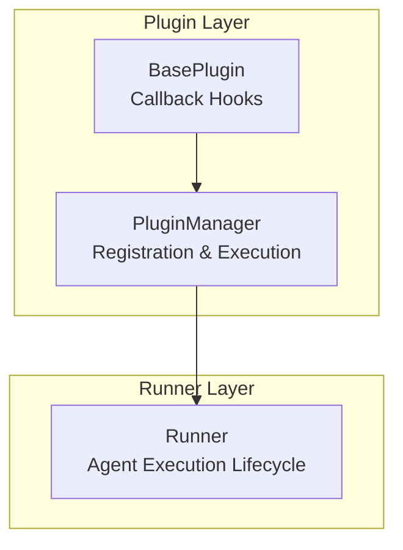
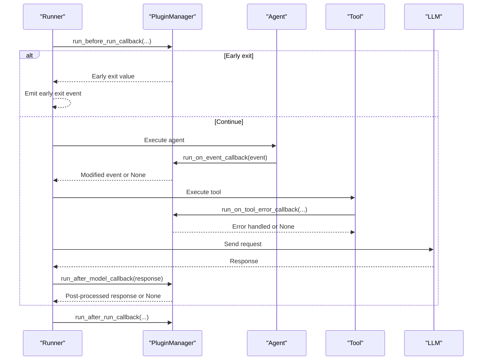
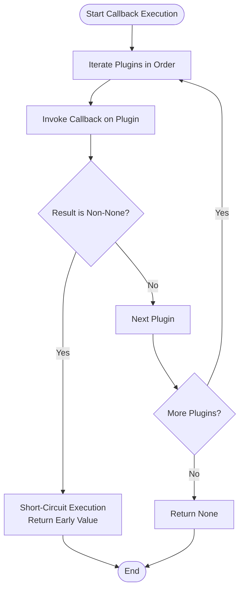
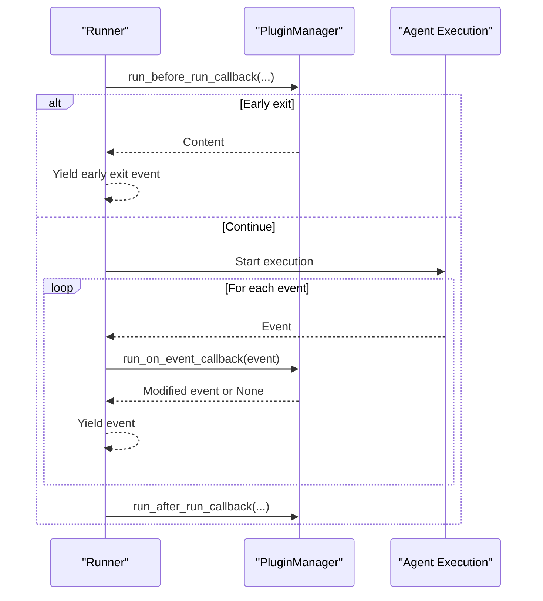
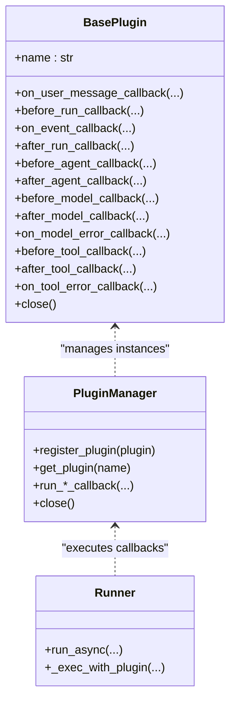

# Custom Plugin Development

<cite>
**Referenced Files in This Document**
- [base_plugin.py](file://src/google/adk/plugins/base_plugin.py)
- [plugin_manager.py](file://src/google/adk/plugins/plugin_manager.py)
- [runners.py](file://src/google/adk/runners.py)
- [logging_plugin.py](file://src/google/adk/plugins/logging_plugin.py)
- [debug_logging_plugin.py](file://src/google/adk/plugins/debug_logging_plugin.py)
- [context_filter_plugin.py](file://src/google/adk/plugins/context_filter_plugin.py)
- [reflect_retry_tool_plugin.py](file://src/google/adk/plugins/reflect_retry_tool_plugin.py)
- [count_plugin.py](file://contributing/samples/plugin_basic/count_plugin.py)
- [main.py](file://contributing/samples/plugin_basic/main.py)
- [test_plugin_manager.py](file://tests/unittests/plugins/test_plugin_manager.py)
- [__init__.py](file://src/google/adk/plugins/__init__.py)
</cite>

## Table of Contents
1. [Introduction](#introduction)
2. [Project Structure](#project-structure)
3. [Core Components](#core-components)
4. [Architecture Overview](#architecture-overview)
5. [Detailed Component Analysis](#detailed-component-analysis)
6. [Dependency Analysis](#dependency-analysis)
7. [Performance Considerations](#performance-considerations)
8. [Troubleshooting Guide](#troubleshooting-guide)
9. [Conclusion](#conclusion)
10. [Appendices](#appendices)

## Introduction
This document explains how to develop custom plugins for the ADK (Agent Development Kit). It covers extending the BasePlugin class, implementing callback methods aligned with use cases, managing state, handling asynchronous callbacks, and robust error handling. You will learn how plugins integrate with the Runner, how to register them, and how to leverage dependency injection patterns. The guide includes step-by-step examples for common scenarios such as logging, request/response transformation, caching, and policy enforcement. It also provides testing strategies, debugging techniques, performance optimization tips, best practices for naming and configuration, and guidance for distributing and sharing plugins.

## Project Structure
The plugin system centers around three key elements:
- BasePlugin defines the plugin interface and callback hooks.
- PluginManager orchestrates plugin registration and execution, enforcing early exit semantics.
- Runner integrates PluginManager into the agent execution lifecycle.

**Diagram sources**
- [base_plugin.py](file://src/google/adk/plugins/base_plugin.py#L41-L373)
- [plugin_manager.py](file://src/google/adk/plugins/plugin_manager.py#L60-L348)
- [runners.py](file://src/google/adk/runners.py#L778-L977)

**Section sources**
- [base_plugin.py](file://src/google/adk/plugins/base_plugin.py#L41-L373)
- [plugin_manager.py](file://src/google/adk/plugins/plugin_manager.py#L60-L348)
- [runners.py](file://src/google/adk/runners.py#L778-L977)

## Core Components
- BasePlugin: Defines the plugin interface with asynchronous callback hooks for user messages, invocation lifecycle, agent/tool/LLM events, and error handling. It enforces that each plugin instance must have a unique name and supports early-exit behavior via returning non-None values.
- PluginManager: Manages plugin registration, validates uniqueness, executes callbacks in order, and implements early exit. It wraps plugin exceptions into descriptive RuntimeErrors and supports graceful shutdown with timeouts.
- Runner: Integrates PluginManager into the agent execution pipeline. It invokes plugin callbacks around invocation start/end, event emission, and agent/tool/LLM lifecycle points.

Key responsibilities:
- BasePlugin: Define behavior for specific lifecycle points.
- PluginManager: Enforce ordering, early exit, and error propagation.
- Runner: Coordinate plugin execution with agent execution.

**Section sources**
- [base_plugin.py](file://src/google/adk/plugins/base_plugin.py#L41-L373)
- [plugin_manager.py](file://src/google/adk/plugins/plugin_manager.py#L60-L348)
- [runners.py](file://src/google/adk/runners.py#L778-L977)

## Architecture Overview
The plugin architecture follows a layered approach:
- Plugins implement callbacks for specific lifecycle events.
- PluginManager executes callbacks in registration order and short-circuits on first non-None return.
- Runner coordinates plugin execution around agent/tool/LLM invocations.

**Diagram sources**
- [runners.py](file://src/google/adk/runners.py#L778-L977)
- [plugin_manager.py](file://src/google/adk/plugins/plugin_manager.py#L117-L307)

**Section sources**
- [runners.py](file://src/google/adk/runners.py#L778-L977)
- [plugin_manager.py](file://src/google/adk/plugins/plugin_manager.py#L117-L307)

## Detailed Component Analysis

### BasePlugin: Extending the Plugin Interface
BasePlugin defines the plugin contract with asynchronous callback hooks. Implement only the callbacks you need for your use case. Each callback receives contextual information and can return a value to short-circuit downstream plugins and agent callbacks.

Important behaviors:
- Unique plugin names: Registration enforces uniqueness.
- Early exit: Returning a non-None value from any callback halts further plugin execution for that event.
- Change propagation: Modifications to inputs (user message, tool args, LLM request/response) propagate to subsequent callbacks.

Common callback categories:
- Invocation lifecycle: on_user_message_callback, before_run_callback, on_event_callback, after_run_callback.
- Agent lifecycle: before_agent_callback, after_agent_callback.
- Tool lifecycle: before_tool_callback, after_tool_callback, on_tool_error_callback.
- LLM lifecycle: before_model_callback, after_model_callback, on_model_error_callback.

Implementation guidance:
- Keep callbacks pure or side-effect minimal; use state for metrics or caches.
- Return early only when you intend to short-circuit the chain.
- For transformations, return modified inputs/outputs; for early exits, return a representative value.

**Section sources**
- [base_plugin.py](file://src/google/adk/plugins/base_plugin.py#L41-L373)

### PluginManager: Registration and Execution Orchestration
PluginManager handles:
- Registration with uniqueness validation.
- Ordered execution of callbacks across all registered plugins.
- Early exit semantics: first non-None return stops further execution.
- Exception handling: wraps plugin exceptions into descriptive RuntimeErrors.
- Graceful shutdown: calls close() on each plugin with timeout control.

Execution flow:
- For each callback, iterate plugins in registration order.
- Invoke the specific callback method on each plugin.
- If a plugin returns non-None, return immediately; otherwise, continue.
- If an exception occurs, wrap and re-raise with chaining.

**Diagram sources**
- [plugin_manager.py](file://src/google/adk/plugins/plugin_manager.py#L260-L307)

**Section sources**
- [plugin_manager.py](file://src/google/adk/plugins/plugin_manager.py#L60-L348)

### Runner Integration: Plugin Execution in Agent Lifecycle
Runner integrates PluginManager into the agent execution pipeline:
- before_run_callback: Allows early exit by returning a Content value.
- on_event_callback: Allows event modification before emission.
- after_run_callback: Final cleanup or reporting.

Runner’s execution wrapper:
- Executes before_run_callback and may emit an early exit event.
- Streams events from agent execution, applying on_event_callback to each.
- Calls after_run_callback after completion.

**Diagram sources**
- [runners.py](file://src/google/adk/runners.py#L778-L977)
- [plugin_manager.py](file://src/google/adk/plugins/plugin_manager.py#L146-L154)

**Section sources**
- [runners.py](file://src/google/adk/runners.py#L778-L977)

### Example Plugin Implementations

#### Logging Plugin
A demonstration plugin that logs major lifecycle events for debugging and observability.

Highlights:
- Logs user messages, invocation start/end, agent lifecycle, LLM requests/responses, tool calls/results, and errors.
- Provides a simple template for implementing before_/after_ and error callbacks.

**Section sources**
- [logging_plugin.py](file://src/google/adk/plugins/logging_plugin.py#L37-L324)

#### Debug Logging Plugin
Captures complete interaction data to a YAML file for deep debugging and reproducibility.

Highlights:
- Records LLM requests/responses, function calls/responses, events, and optional session state snapshots.
- Serializes content safely and writes documents separated by YAML markers.

**Section sources**
- [debug_logging_plugin.py](file://src/google/adk/plugins/debug_logging_plugin.py#L67-L573)

#### Context Filter Plugin
Reduces LLM context size by filtering to recent invocations and ensuring function call/response pairs remain intact.

Highlights:
- Computes invocation boundaries and adjusts split index to avoid orphaned function responses.
- Applies custom filters if provided.

**Section sources**
- [context_filter_plugin.py](file://src/google/adk/plugins/context_filter_plugin.py#L100-L156)

#### Reflect-and-Retry Tool Plugin
Implements self-healing for tool failures with concurrency-safe failure tracking and reflection guidance.

Highlights:
- Tracks failures per tool and per scope (per-invocation or global).
- Generates structured reflection guidance to help the LLM retry with corrections.
- Supports detection of errors in successful tool results.

**Section sources**
- [reflect_retry_tool_plugin.py](file://src/google/adk/plugins/reflect_retry_tool_plugin.py#L55-L383)

### Step-by-Step Plugin Development Examples

#### Custom Logging Plugin
Goal: Log agent/tool/LLM lifecycle events.

Steps:
1. Create a class extending BasePlugin and implement desired callbacks (e.g., before_agent_callback, after_tool_callback).
2. Register the plugin instance with Runner via the plugins list.
3. Use logging or print statements within callbacks to capture events.
4. Optionally return None to allow normal propagation.

Reference example:
- [count_plugin.py](file://contributing/samples/plugin_basic/count_plugin.py#L21-L44)

**Section sources**
- [count_plugin.py](file://contributing/samples/plugin_basic/count_plugin.py#L21-L44)

#### Request/Response Transformation Plugin
Goal: Modify LLM requests or responses.

Steps:
1. Implement before_model_callback to adjust LlmRequest contents or metadata.
2. Implement after_model_callback to process LlmResponse (e.g., enrich or sanitize).
3. Return modified values to propagate changes; return None to keep original.

Reference example:
- [context_filter_plugin.py](file://src/google/adk/plugins/context_filter_plugin.py#L125-L156)

**Section sources**
- [context_filter_plugin.py](file://src/google/adk/plugins/context_filter_plugin.py#L125-L156)

#### Caching Plugin
Goal: Short-circuit expensive LLM/tool calls using cached responses.

Steps:
1. Implement before_model_callback to check cache; return cached LlmResponse if available.
2. Implement after_model_callback to populate cache with fresh responses.
3. Ensure thread-safe cache access if multiple agents run concurrently.

Reference example pattern:
- [reflect_retry_tool_plugin.py](file://src/google/adk/plugins/reflect_retry_tool_plugin.py#L138-L175)

**Section sources**
- [reflect_retry_tool_plugin.py](file://src/google/adk/plugins/reflect_retry_tool_plugin.py#L138-L175)

#### Policy Enforcement Plugin
Goal: Enforce authorization or input validation before tool execution.

Steps:
1. Implement before_tool_callback to validate tool_args and return an error response if invalid.
2. Optionally implement on_tool_error_callback to normalize error responses.

Reference example pattern:
- [reflect_retry_tool_plugin.py](file://src/google/adk/plugins/reflect_retry_tool_plugin.py#L204-L223)

**Section sources**
- [reflect_retry_tool_plugin.py](file://src/google/adk/plugins/reflect_retry_tool_plugin.py#L204-L223)

### Plugin Registration and Integration with Runner
- Register plugins when constructing Runner. The Runner delegates plugin management to PluginManager.
- Plugins are executed in the order they are registered.
- Early exits from plugins take precedence over agent callbacks.

Example registration:
- [main.py](file://contributing/samples/plugin_basic/main.py#L43-L48)

**Section sources**
- [main.py](file://contributing/samples/plugin_basic/main.py#L43-L48)

### State Management, Async Callbacks, and Error Handling
- State management: Store counters, caches, or configuration in plugin instance attributes. Use locks for concurrency-safe updates.
- Async callbacks: All plugin callbacks are async; await any I/O or external services.
- Error handling: PluginManager wraps exceptions into descriptive RuntimeErrors and chains the original exception. Implement on_model_error_callback and on_tool_error_callback to recover gracefully.

**Section sources**
- [plugin_manager.py](file://src/google/adk/plugins/plugin_manager.py#L284-L307)
- [reflect_retry_tool_plugin.py](file://src/google/adk/plugins/reflect_retry_tool_plugin.py#L225-L266)

### Testing Strategies and Debugging Techniques
- Unit tests: Use a TestPlugin helper to simulate return values and exceptions for specific callbacks.
- Early exit verification: Confirm that a non-None return prevents subsequent plugins from executing.
- Exception propagation: Validate that plugin exceptions are wrapped and chained.
- Close behavior: Verify plugin close() is awaited and timeouts are handled.

References:
- [test_plugin_manager.py](file://tests/unittests/plugins/test_plugin_manager.py#L34-L320)

**Section sources**
- [test_plugin_manager.py](file://tests/unittests/plugins/test_plugin_manager.py#L34-L320)

## Dependency Analysis
Plugin dependencies and relationships:
- BasePlugin is the foundation for all plugins.
- PluginManager depends on BasePlugin and orchestrates execution.
- Runner depends on PluginManager to integrate plugins into agent execution.

**Diagram sources**
- [base_plugin.py](file://src/google/adk/plugins/base_plugin.py#L41-L373)
- [plugin_manager.py](file://src/google/adk/plugins/plugin_manager.py#L60-L348)
- [runners.py](file://src/google/adk/runners.py#L778-L977)

**Section sources**
- [base_plugin.py](file://src/google/adk/plugins/base_plugin.py#L41-L373)
- [plugin_manager.py](file://src/google/adk/plugins/plugin_manager.py#L60-L348)
- [runners.py](file://src/google/adk/runners.py#L778-L977)

## Performance Considerations
- Minimize synchronous I/O in callbacks; prefer async operations.
- Use early exit judiciously to avoid unnecessary processing.
- Cache responses in before_model_callback to reduce latency and cost.
- Avoid heavy computation in hot paths; defer to background tasks if needed.
- Ensure thread-safe state updates when multiple agents run concurrently.

[No sources needed since this section provides general guidance]

## Troubleshooting Guide
Common issues and resolutions:
- Duplicate plugin names: Registration raises a ValueError; ensure unique names.
- Plugin exceptions: PluginManager wraps exceptions into a descriptive RuntimeError; check chained exceptions for root cause.
- Timeout during close: PluginManager raises RuntimeError on timeout; increase close_timeout or optimize plugin shutdown.
- Unexpected early exit: Verify that no plugin is unintentionally returning a non-None value.

**Section sources**
- [plugin_manager.py](file://src/google/adk/plugins/plugin_manager.py#L99-L104)
- [plugin_manager.py](file://src/google/adk/plugins/plugin_manager.py#L309-L347)

## Conclusion
ADK plugins provide a powerful, structured way to extend agent behavior globally. By implementing targeted callback methods, managing state carefully, handling async operations, and leveraging early exit semantics, you can build robust plugins for logging, transformation, caching, and policy enforcement. Integrate plugins through Runner, test thoroughly with unit tests, and follow best practices for naming, configuration, and distribution.

[No sources needed since this section summarizes without analyzing specific files]

## Appendices

### Best Practices
- Naming: Use descriptive, unique plugin names to avoid conflicts.
- Configuration: Expose configuration via constructor parameters; keep defaults safe.
- Avoid callback conflicts: Do not implement the same callback in multiple plugins; use a single responsibility per plugin.
- Error handling: Return structured error responses when short-circuiting; log and re-raise for unhandled exceptions.
- Distribution: Package plugins as standalone modules; export them via plugins package init.

**Section sources**
- [base_plugin.py](file://src/google/adk/plugins/base_plugin.py#L105-L112)
- [__init__.py](file://src/google/adk/plugins/__init__.py#L15-L27)

### Templates and Boilerplate
- Minimal plugin template: Extend BasePlugin, implement chosen callbacks, and return None by default.
- Example reference: [count_plugin.py](file://contributing/samples/plugin_basic/count_plugin.py#L21-L44)

**Section sources**
- [count_plugin.py](file://contributing/samples/plugin_basic/count_plugin.py#L21-L44)