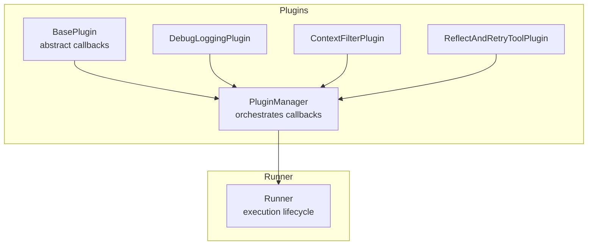
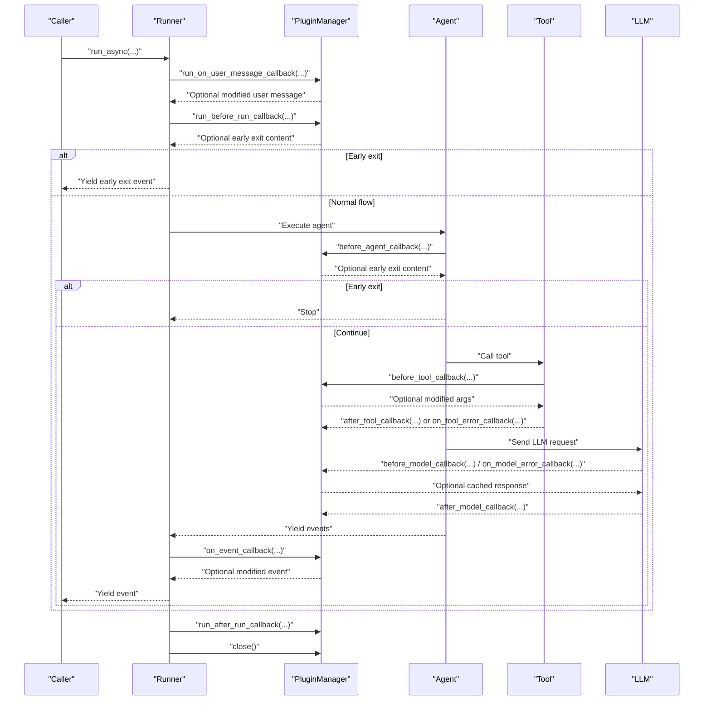
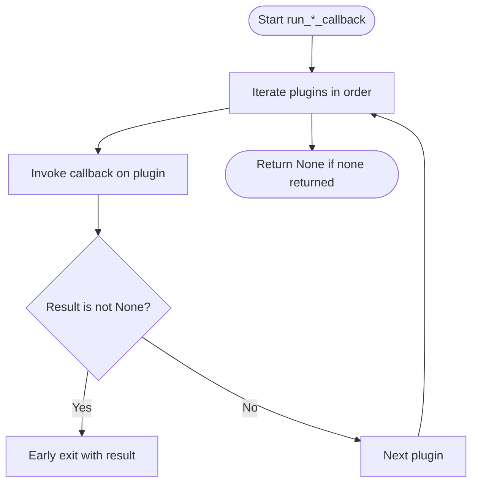
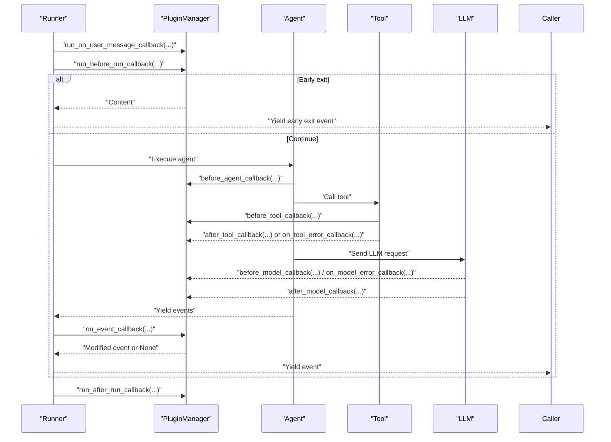
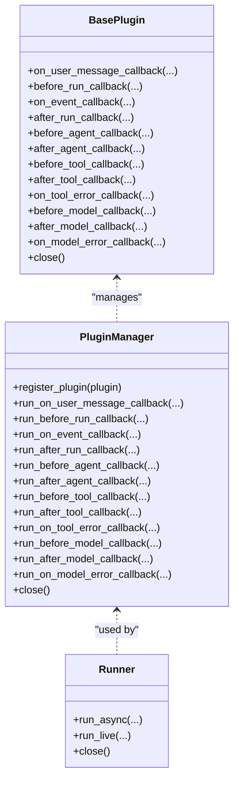

# Plugin Architecture and Lifecycle

<cite>
**Referenced Files in This Document**
- [base_plugin.py](file://src/google/adk/plugins/base_plugin.py)
- [plugin_manager.py](file://src/google/adk/plugins/plugin_manager.py)
- [runners.py](file://src/google/adk/runners.py)
- [count_plugin.py](file://contributing/samples/plugin_basic/count_plugin.py)
- [main.py](file://contributing/samples/plugin_basic/main.py)
- [debug_logging_plugin.py](file://src/google/adk/plugins/debug_logging_plugin.py)
- [context_filter_plugin.py](file://src/google/adk/plugins/context_filter_plugin.py)
- [reflect_retry_tool_plugin.py](file://src/google/adk/plugins/reflect_retry_tool_plugin.py)
- [test_plugin_manager.py](file://tests/unittests/plugins/test_plugin_manager.py)
</cite>

## Table of Contents
1. [Introduction](#introduction)
2. [Project Structure](#project-structure)
3. [Core Components](#core-components)
4. [Architecture Overview](#architecture-overview)
5. [Detailed Component Analysis](#detailed-component-analysis)
6. [Dependency Analysis](#dependency-analysis)
7. [Performance Considerations](#performance-considerations)
8. [Troubleshooting Guide](#troubleshooting-guide)
9. [Conclusion](#conclusion)

## Introduction
This document explains the ADK plugin architecture and execution lifecycle. It focuses on the BasePlugin abstract class and its callback methods, the PluginManager orchestration, and the Runner’s integration. It covers execution order (plugins precede agent callbacks), early-exit semantics via return values, lifecycle from initialization to close(), callback parameter types, return value handling, practical examples, state management, async/await patterns, and performance considerations.

## Project Structure
The plugin system spans three main areas:
- Plugin definition and lifecycle: BasePlugin and PluginManager
- Runner integration: Runner wraps execution with plugin hooks
- Examples and built-in plugins: Debug logging, context filtering, and reflect-retry tool handling

**Diagram sources**
- [base_plugin.py](file://src/google/adk/plugins/base_plugin.py#L41-L373)
- [plugin_manager.py](file://src/google/adk/plugins/plugin_manager.py#L60-L348)
- [runners.py](file://src/google/adk/runners.py#L112-L1618)
- [debug_logging_plugin.py](file://src/google/adk/plugins/debug_logging_plugin.py#L67-L573)
- [context_filter_plugin.py](file://src/google/adk/plugins/context_filter_plugin.py#L100-L156)
- [reflect_retry_tool_plugin.py](file://src/google/adk/plugins/reflect_retry_tool_plugin.py#L55-L383)

**Section sources**
- [base_plugin.py](file://src/google/adk/plugins/base_plugin.py#L41-L103)
- [plugin_manager.py](file://src/google/adk/plugins/plugin_manager.py#L60-L105)
- [runners.py](file://src/google/adk/runners.py#L112-L219)

## Core Components
- BasePlugin: Defines the plugin contract with lifecycle callbacks for user messages, run lifecycle, events, agent/tool/model execution, and error handling. It supports async methods and optional early-exit via return values.
- PluginManager: Registers plugins, executes callbacks in registration order, enforces early-exit semantics, and coordinates plugin close() calls with timeouts.
- Runner: Integrates plugins into the invocation lifecycle, calling plugin hooks around user message handling, agent execution, tool execution, model requests/responses, and error handling.

Key callback categories:
- Invocation lifecycle: on_user_message_callback, before_run_callback, on_event_callback, after_run_callback
- Agent lifecycle: before_agent_callback, after_agent_callback
- Tool lifecycle: before_tool_callback, after_tool_callback, on_tool_error_callback
- Model lifecycle: before_model_callback, after_model_callback, on_model_error_callback
- Resource cleanup: close()

Return value semantics:
- Returning a non-None value from a plugin callback triggers early exit for that callback chain, skipping remaining plugins and agent callbacks.
- Returning None continues the chain.

**Section sources**
- [base_plugin.py](file://src/google/adk/plugins/base_plugin.py#L114-L373)
- [plugin_manager.py](file://src/google/adk/plugins/plugin_manager.py#L260-L307)
- [runners.py](file://src/google/adk/runners.py#L778-L909)

## Architecture Overview
The Runner wraps agent execution with plugin hooks. The execution order is:
1) on_user_message_callback
2) before_run_callback
3) Agent/tool/model execution
4) on_event_callback
5) after_run_callback
6) close() on shutdown

Plugins run before agent callbacks and can short-circuit the chain. The PluginManager ensures ordered execution and early exits.

**Diagram sources**
- [runners.py](file://src/google/adk/runners.py#L778-L909)
- [plugin_manager.py](file://src/google/adk/plugins/plugin_manager.py#L117-L258)
- [base_plugin.py](file://src/google/adk/plugins/base_plugin.py#L114-L373)

**Section sources**
- [runners.py](file://src/google/adk/runners.py#L778-L909)
- [plugin_manager.py](file://src/google/adk/plugins/plugin_manager.py#L260-L307)

## Detailed Component Analysis

### BasePlugin: Abstract Contract and Callback Semantics
- Purpose: Define a plugin interface with async callbacks for all major lifecycle points.
- Execution order: Plugins execute before agent callbacks; early-exit occurs when a plugin returns a non-None value.
- Change propagation: Modifications to inputs (user message, tool args, LLM request/response) are visible to subsequent callbacks.
- Return value handling: Non-None values short-circuit the chain; None allows continuation.

Callback summary:
- on_user_message_callback: Modify or observe user message before handling.
- before_run_callback: Global setup; can return content to short-circuit.
- on_event_callback: Intercept and modify events before they are yielded.
- after_run_callback: Final cleanup/logging.
- before_agent_callback / after_agent_callback: Interleave with agent execution.
- before_model_callback / after_model_callback: Intercept LLM requests/responses; can short-circuit with cached responses.
- on_model_error_callback: Recover from model errors.
- before_tool_callback / after_tool_callback: Intercept tool calls; can short-circuit with precomputed results.
- on_tool_error_callback: Recover from tool errors.
- close(): Cleanup resources.

Practical examples:
- CountInvocationPlugin: Demonstrates counting agent and tool invocations via before_* callbacks.
- DebugLoggingPlugin: Comprehensive logging of user messages, events, agent/tool/model lifecycle.
- ContextFilterPlugin: Reduces LLM context by filtering to recent invocations.
- ReflectAndRetryToolPlugin: Self-healing tool error handling with retry and reflection guidance.

**Section sources**
- [base_plugin.py](file://src/google/adk/plugins/base_plugin.py#L41-L103)
- [base_plugin.py](file://src/google/adk/plugins/base_plugin.py#L114-L373)
- [count_plugin.py](file://contributing/samples/plugin_basic/count_plugin.py#L21-L44)
- [debug_logging_plugin.py](file://src/google/adk/plugins/debug_logging_plugin.py#L67-L116)
- [context_filter_plugin.py](file://src/google/adk/plugins/context_filter_plugin.py#L100-L156)
- [reflect_retry_tool_plugin.py](file://src/google/adk/plugins/reflect_retry_tool_plugin.py#L55-L137)

### PluginManager: Execution Orchestration
Responsibilities:
- Register plugins and enforce unique names.
- Execute callbacks in registration order.
- Early-exit on first non-None return.
- Wrap exceptions into descriptive RuntimeErrors.
- Close plugins with timeouts and aggregate failures.

Key behaviors:
- run_*_callback methods forward to _run_callbacks with the callback name and kwargs.
- _run_callbacks iterates plugins, invokes the named method, and returns immediately on first non-None result.
- close() sequentially awaits plugin.close() with timeout handling and error aggregation.

**Diagram sources**
- [plugin_manager.py](file://src/google/adk/plugins/plugin_manager.py#L260-L307)

**Section sources**
- [plugin_manager.py](file://src/google/adk/plugins/plugin_manager.py#L60-L105)
- [plugin_manager.py](file://src/google/adk/plugins/plugin_manager.py#L117-L258)
- [plugin_manager.py](file://src/google/adk/plugins/plugin_manager.py#L260-L307)
- [plugin_manager.py](file://src/google/adk/plugins/plugin_manager.py#L309-L348)

### Runner Integration: Lifecycle Hooks
Runner integrates plugins around:
- New user message handling: on_user_message_callback, then append to session.
- Agent run lifecycle: before_run_callback, agent execution, on_event_callback, after_run_callback.
- Tool and model lifecycle: before_tool_callback, tool execution, after_tool_callback/on_tool_error_callback, before_model_callback, after_model_callback/on_model_error_callback.

Early-exit behavior:
- If before_run_callback returns content, Runner emits an early exit event and skips agent execution.
- If on_event_callback returns a modified event, Runner yields the modified event.

**Diagram sources**
- [runners.py](file://src/google/adk/runners.py#L778-L909)
- [runners.py](file://src/google/adk/runners.py#L1486-L1505)

**Section sources**
- [runners.py](file://src/google/adk/runners.py#L778-L909)
- [runners.py](file://src/google/adk/runners.py#L1486-L1505)

### Practical Examples

- Basic counting plugin
  - Demonstrates implementing before_agent_callback and before_model_callback to increment counters.
  - Shows how to register plugins with Runner/InMemoryRunner.

- Debug logging plugin
  - Comprehensive logging of user messages, events, agent/tool/model lifecycle, and session state snapshots.
  - Useful for diagnostics and reproducibility.

- Context filter plugin
  - Filters LLM context to recent invocations and preserves function call/response pairing integrity.

- Reflect-and-retry tool plugin
  - Handles tool failures with reflection guidance and retry logic, scoped per-invocation or globally.

**Section sources**
- [count_plugin.py](file://contributing/samples/plugin_basic/count_plugin.py#L21-L44)
- [main.py](file://contributing/samples/plugin_basic/main.py#L40-L66)
- [debug_logging_plugin.py](file://src/google/adk/plugins/debug_logging_plugin.py#L67-L116)
- [context_filter_plugin.py](file://src/google/adk/plugins/context_filter_plugin.py#L100-L156)
- [reflect_retry_tool_plugin.py](file://src/google/adk/plugins/reflect_retry_tool_plugin.py#L55-L137)

## Dependency Analysis
- BasePlugin depends on agent, tool, and model types for callback signatures.
- PluginManager depends on BasePlugin and orchestrates callback execution.
- Runner composes PluginManager and delegates lifecycle hooks to it.
- Built-in plugins depend on BasePlugin and demonstrate real-world usage patterns.

**Diagram sources**
- [base_plugin.py](file://src/google/adk/plugins/base_plugin.py#L41-L373)
- [plugin_manager.py](file://src/google/adk/plugins/plugin_manager.py#L60-L348)
- [runners.py](file://src/google/adk/runners.py#L112-L1618)

**Section sources**
- [base_plugin.py](file://src/google/adk/plugins/base_plugin.py#L41-L103)
- [plugin_manager.py](file://src/google/adk/plugins/plugin_manager.py#L60-L105)
- [runners.py](file://src/google/adk/runners.py#L112-L219)

## Performance Considerations
- Early-exit short-circuiting: Plugins can prevent unnecessary agent/tool/model work by returning early, reducing latency and cost.
- Concurrency and timeouts: PluginManager.close() uses timeouts to avoid hanging shutdowns; Runner’s cleanup also applies timeouts for toolsets.
- Serialization overhead: DebugLoggingPlugin serializes complex objects; consider disabling or limiting in production.
- Context filtering: ContextFilterPlugin reduces LLM context size, lowering token usage and latency.
- Async patterns: All plugin callbacks are async; ensure plugin implementations avoid blocking operations.

[No sources needed since this section provides general guidance]

## Troubleshooting Guide
Common issues and resolutions:
- Duplicate plugin names: Registration raises a ValueError; ensure unique plugin names.
- Exceptions in plugins: PluginManager wraps callback exceptions in a descriptive RuntimeError and chains the original exception.
- Plugin close failures: PluginManager.close() aggregates failures and raises a RuntimeError with a summary; check individual plugin logs.
- Early-exit confusion: If a plugin returns a non-None value, subsequent plugins and agent callbacks are skipped; verify plugin ordering and conditions.
- Timeout during close: If a plugin’s close() is slow, a TimeoutError or CancelledError may occur; increase plugin_close_timeout or optimize plugin cleanup.

Validation via unit tests:
- Early-exit behavior verified: Subsequent plugins are not called when a plugin returns a value.
- Normal flow: When all plugins return None, all are executed in order.
- Exception propagation: Callback exceptions are wrapped and chained.
- Close timeout and error aggregation: Failures are reported with a summary.

**Section sources**
- [plugin_manager.py](file://src/google/adk/plugins/plugin_manager.py#L101-L104)
- [plugin_manager.py](file://src/google/adk/plugins/plugin_manager.py#L299-L305)
- [plugin_manager.py](file://src/google/adk/plugins/plugin_manager.py#L343-L347)
- [test_plugin_manager.py](file://tests/unittests/plugins/test_plugin_manager.py#L135-L159)
- [test_plugin_manager.py](file://tests/unittests/plugins/test_plugin_manager.py#L182-L202)
- [test_plugin_manager.py](file://tests/unittests/plugins/test_plugin_manager.py#L287-L319)

## Conclusion
ADK’s plugin architecture provides a powerful, extensible mechanism to intercept and modify agent, tool, and model execution. BasePlugin defines a comprehensive callback surface, PluginManager enforces ordered execution and early-exit semantics, and Runner integrates these hooks into the invocation lifecycle. Built-in and sample plugins illustrate practical patterns for logging, context management, and error recovery. Proper use of return values enables efficient short-circuiting, while careful state management and async patterns ensure robust performance and reliability.