# Plugin System

<cite>
**Referenced Files in This Document**
- [base_plugin.py](file://src/google/adk/plugins/base_plugin.py)
- [plugin_manager.py](file://src/google/adk/plugins/plugin_manager.py)
- [debug_logging_plugin.py](file://src/google/adk/plugins/debug_logging_plugin.py)
- [reflect_retry_tool_plugin.py](file://src/google/adk/plugins/reflect_retry_tool_plugin.py)
- [multimodal_tool_results_plugin.py](file://src/google/adk/plugins/multimodal_tool_results_plugin.py)
- [context_filter_plugin.py](file://src/google/adk/plugins/context_filter_plugin.py)
- [logging_plugin.py](file://src/google/adk/plugins/logging_plugin.py)
- [bigquery_agent_analytics_plugin.py](file://src/google/adk/plugins/bigquery_agent_analytics_plugin.py)
- [recordings_plugin.py](file://src/google/adk/cli/plugins/recordings_plugin.py)
- [replay_plugin.py](file://src/google/adk/cli/plugins/replay_plugin.py)
- [request_intercepter_plugin.py](file://src/google/adk/evaluation/request_intercepter_plugin.py)
- [count_plugin.py](file://contributing/samples/plugin_basic/count_plugin.py)
- [main.py](file://contributing/samples/plugin_basic/main.py)
- [agent.py](file://contributing/samples/plugin_debug_logging/agent.py)
</cite>

## Table of Contents
1. [Introduction](#introduction)
2. [Project Structure](#project-structure)
3. [Core Components](#core-components)
4. [Architecture Overview](#architecture-overview)
5. [Detailed Component Analysis](#detailed-component-analysis)
6. [Dependency Analysis](#dependency-analysis)
7. [Performance Considerations](#performance-considerations)
8. [Troubleshooting Guide](#troubleshooting-guide)
9. [Conclusion](#conclusion)
10. [Appendices](#appendices)

## Introduction
This document explains the ADK plugin system and its callback architecture. It covers how plugins extend agent functionality globally, how the PluginManager registers and executes plugins, and how built-in plugins implement common behaviors such as debug logging, reflection-based tool retries, multimodal tool results handling, context filtering, and logging. It also provides practical guidance for building custom plugins, configuring them, managing dependencies, and optimizing performance.

## Project Structure
The plugin system lives under the plugins package and integrates with agent execution via the PluginManager. Built-in plugins demonstrate typical callback interception patterns and are complemented by CLI plugins for conformance testing and evaluation plugins for internal use.

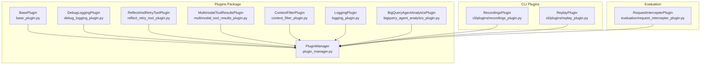

**Diagram sources**
- [base_plugin.py](file://src/google/adk/plugins/base_plugin.py#L41-L373)
- [plugin_manager.py](file://src/google/adk/plugins/plugin_manager.py#L60-L348)
- [debug_logging_plugin.py](file://src/google/adk/plugins/debug_logging_plugin.py#L67-L573)
- [reflect_retry_tool_plugin.py](file://src/google/adk/plugins/reflect_retry_tool_plugin.py#L55-L383)
- [multimodal_tool_results_plugin.py](file://src/google/adk/plugins/multimodal_tool_results_plugin.py#L32-L91)
- [context_filter_plugin.py](file://src/google/adk/plugins/context_filter_plugin.py#L100-L156)
- [logging_plugin.py](file://src/google/adk/plugins/logging_plugin.py#L37-L324)
- [bigquery_agent_analytics_plugin.py](file://src/google/adk/plugins/bigquery_agent_analytics_plugin.py#L448-L800)
- [recordings_plugin.py](file://src/google/adk/cli/plugins/recordings_plugin.py#L66-L401)
- [replay_plugin.py](file://src/google/adk/cli/plugins/replay_plugin.py#L72-L383)
- [request_intercepter_plugin.py](file://src/google/adk/evaluation/request_intercepter_plugin.py#L33-L95)

**Section sources**
- [base_plugin.py](file://src/google/adk/plugins/base_plugin.py#L41-L373)
- [plugin_manager.py](file://src/google/adk/plugins/plugin_manager.py#L60-L348)

## Core Components
- BasePlugin: Defines the plugin interface with lifecycle hooks for user messages, invocation, events, agent/tool/LLM callbacks, and error handling. Plugins can short-circuit execution by returning a non-None value from a callback.
- PluginManager: Registers plugins, ensures unique names, and orchestrates callback execution in registration order. It implements an early-exit strategy and supports graceful shutdown with timeouts.

Key callback categories:
- Invocation lifecycle: on_user_message_callback, before_run_callback, on_event_callback, after_run_callback
- Agent lifecycle: before_agent_callback, after_agent_callback
- LLM lifecycle: before_model_callback, after_model_callback, on_model_error_callback
- Tool lifecycle: before_tool_callback, after_tool_callback, on_tool_error_callback
- Close lifecycle: close

Early-exit semantics:
- If any plugin returns a non-None value for a given callback, subsequent plugins and agent callbacks are skipped for that event.

**Section sources**
- [base_plugin.py](file://src/google/adk/plugins/base_plugin.py#L114-L373)
- [plugin_manager.py](file://src/google/adk/plugins/plugin_manager.py#L260-L308)

## Architecture Overview
The PluginManager coordinates plugin execution around agent execution. Each callback in the manager resolves to a specific BasePlugin method, iterating through registered plugins in order. Exceptions are caught and re-raised as runtime errors with contextual messages.

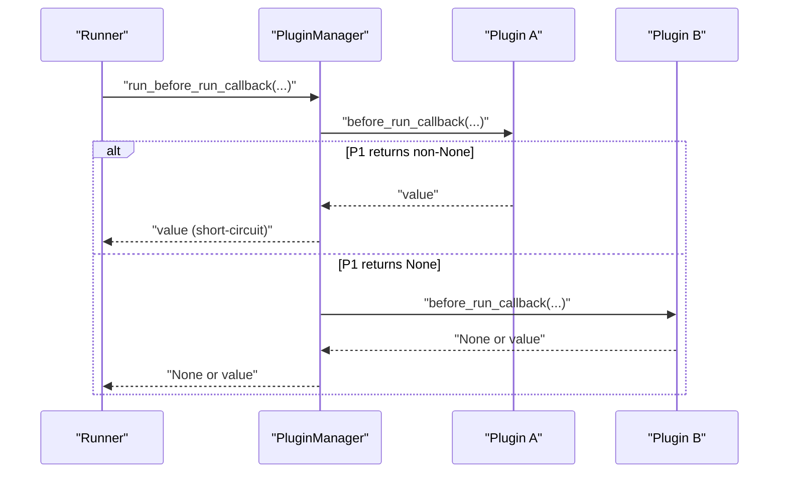

**Diagram sources**
- [plugin_manager.py](file://src/google/adk/plugins/plugin_manager.py#L130-L136)
- [plugin_manager.py](file://src/google/adk/plugins/plugin_manager.py#L260-L308)

**Section sources**
- [plugin_manager.py](file://src/google/adk/plugins/plugin_manager.py#L60-L348)

## Detailed Component Analysis

### BasePlugin and Lifecycle
BasePlugin defines the contract for all plugins. It documents execution order, short-circuit behavior, and mutation propagation through callback parameters. Implementers choose which callbacks to override.

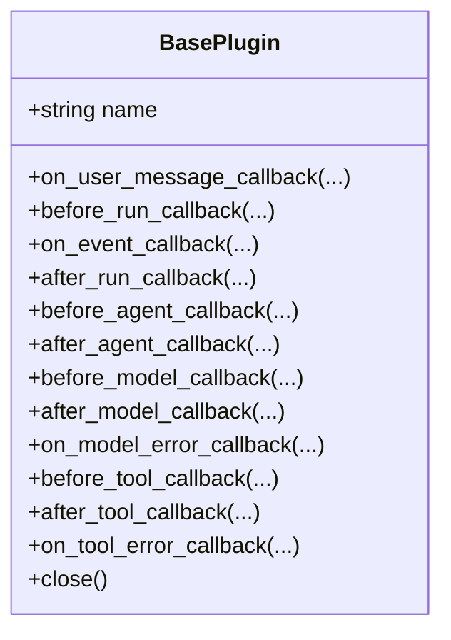

**Diagram sources**
- [base_plugin.py](file://src/google/adk/plugins/base_plugin.py#L41-L373)

**Section sources**
- [base_plugin.py](file://src/google/adk/plugins/base_plugin.py#L41-L373)

### PluginManager
- Registration: Ensures unique plugin names and logs registration.
- Execution: Iterates plugins in order, invoking the requested callback. Short-circuits on first non-None return.
- Error handling: Wraps plugin exceptions into a RuntimeError with contextual info.
- Shutdown: Calls close on all plugins concurrently with timeouts and aggregates failures.

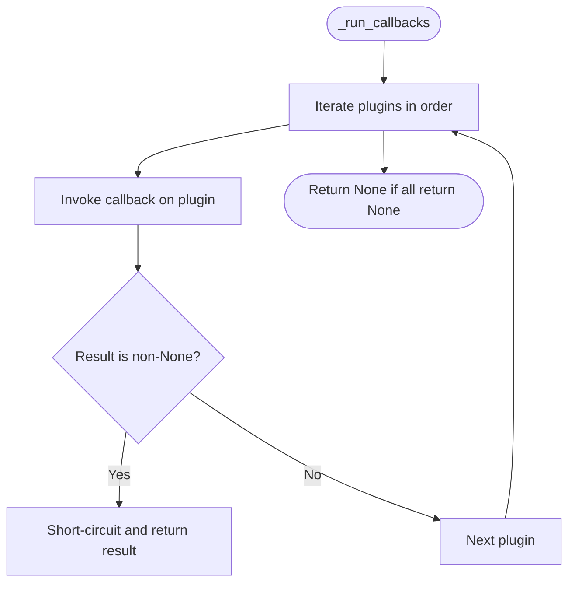

**Diagram sources**
- [plugin_manager.py](file://src/google/adk/plugins/plugin_manager.py#L260-L308)

**Section sources**
- [plugin_manager.py](file://src/google/adk/plugins/plugin_manager.py#L60-L348)

### DebugLoggingPlugin
Captures complete invocation data to a YAML file, including user messages, events, LLM requests/responses, tool calls/results, and optional session state snapshots. It serializes Content and other objects safely and appends each invocation as a YAML document.

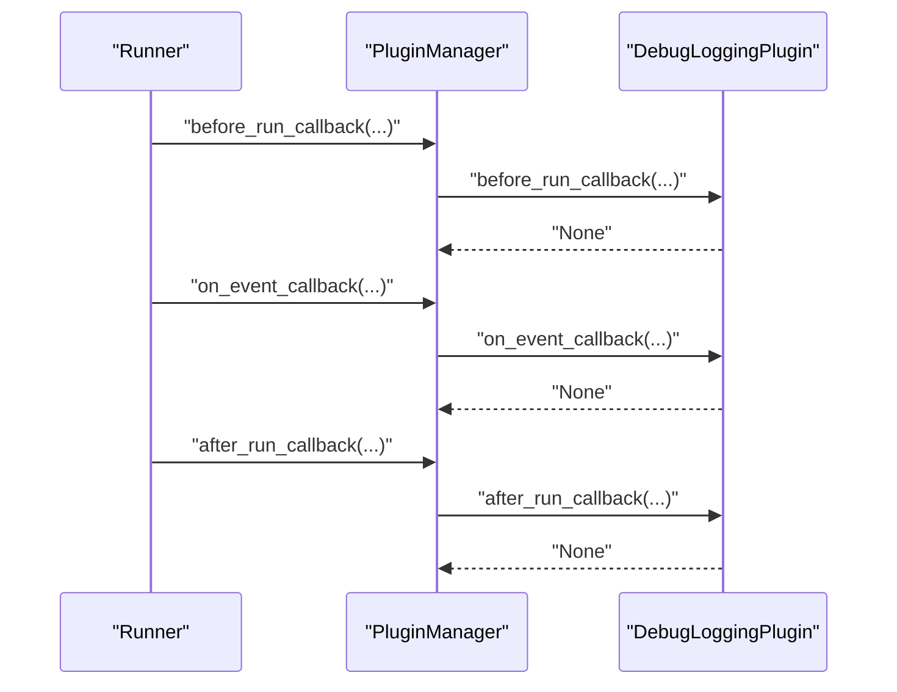

**Diagram sources**
- [debug_logging_plugin.py](file://src/google/adk/plugins/debug_logging_plugin.py#L236-L372)
- [plugin_manager.py](file://src/google/adk/plugins/plugin_manager.py#L138-L144)

**Section sources**
- [debug_logging_plugin.py](file://src/google/adk/plugins/debug_logging_plugin.py#L67-L573)

### ReflectAndRetryToolPlugin
Implements concurrency-safe, configurable tool error recovery. It tracks failures per invocation or globally, supports extracting errors from tool results, and returns structured reflection guidance to the LLM to encourage corrective action.

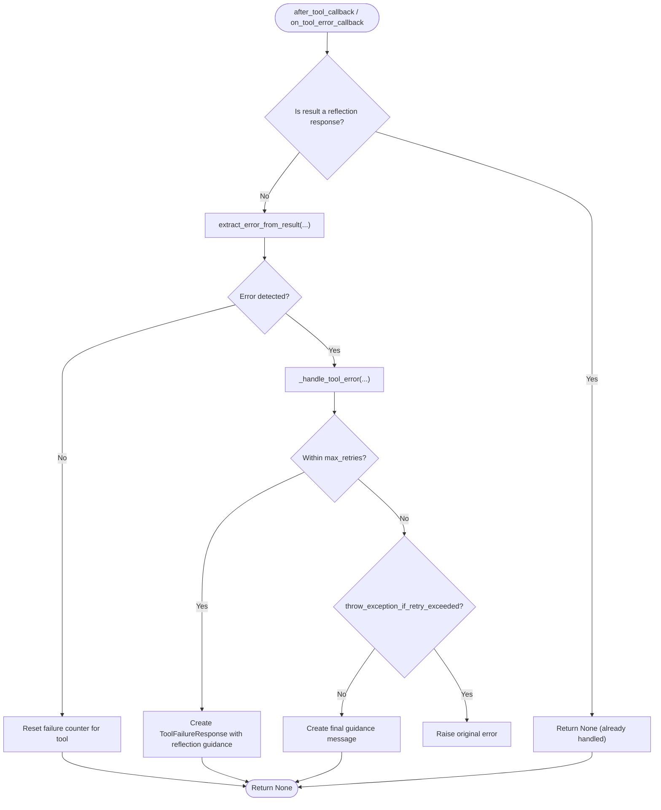

**Diagram sources**
- [reflect_retry_tool_plugin.py](file://src/google/adk/plugins/reflect_retry_tool_plugin.py#L138-L266)

**Section sources**
- [reflect_retry_tool_plugin.py](file://src/google/adk/plugins/reflect_retry_tool_plugin.py#L55-L383)

### MultimodalToolResultsPlugin
Enables tools to return lists of parts or single parts directly to the LLM by saving them in ToolContext and injecting them into the last content part before model calls.

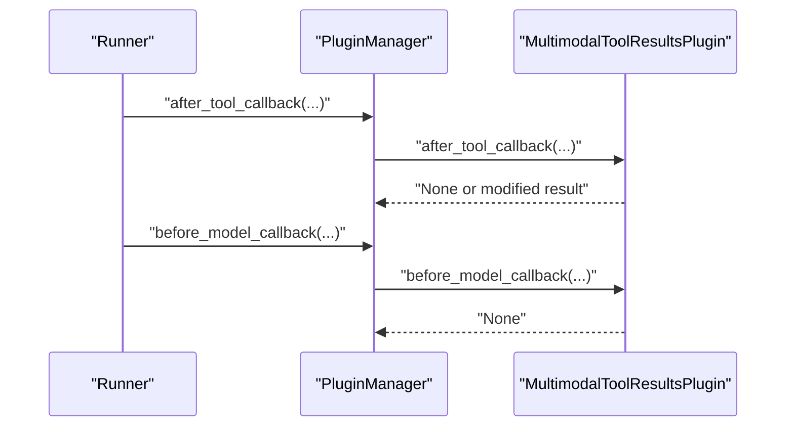

**Diagram sources**
- [multimodal_tool_results_plugin.py](file://src/google/adk/plugins/multimodal_tool_results_plugin.py#L48-L91)

**Section sources**
- [multimodal_tool_results_plugin.py](file://src/google/adk/plugins/multimodal_tool_results_plugin.py#L32-L91)

### ContextFilterPlugin
Reduces LLM context size by keeping only the last N invocations and ensuring function call/response pairs remain intact.

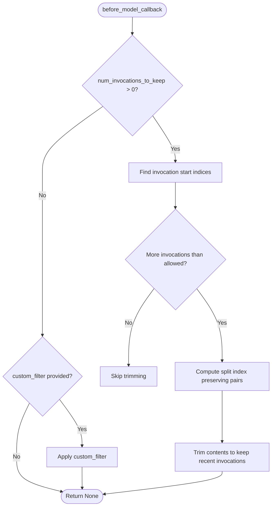

**Diagram sources**
- [context_filter_plugin.py](file://src/google/adk/plugins/context_filter_plugin.py#L125-L155)

**Section sources**
- [context_filter_plugin.py](file://src/google/adk/plugins/context_filter_plugin.py#L100-L156)

### LoggingPlugin
Provides console-based logging for all major lifecycle events, serving as a simple demonstration and debugging aid.

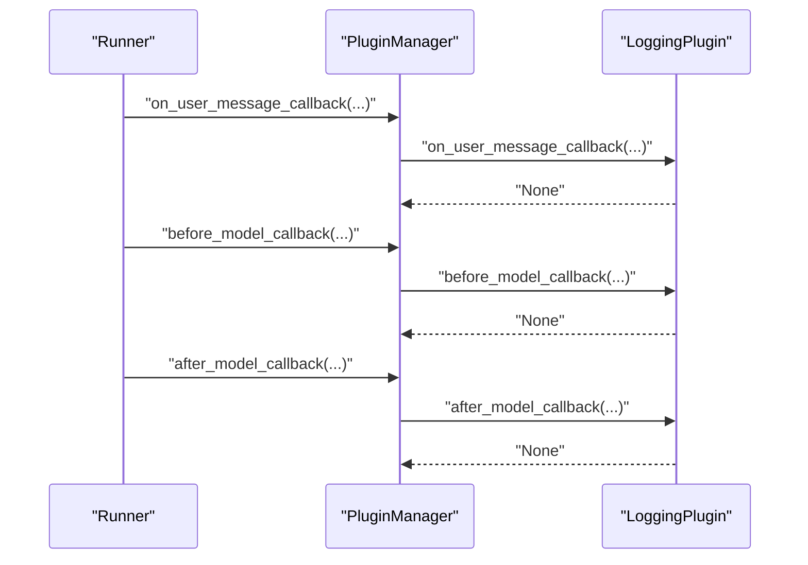

**Diagram sources**
- [logging_plugin.py](file://src/google/adk/plugins/logging_plugin.py#L71-L216)

**Section sources**
- [logging_plugin.py](file://src/google/adk/plugins/logging_plugin.py#L37-L324)

### BigQueryAgentAnalyticsPlugin
Writes agent interactions to BigQuery with batching, retries, schema evolution, and OpenTelemetry trace integration. Includes a safe callback decorator to prevent plugin errors from crashing the runner.

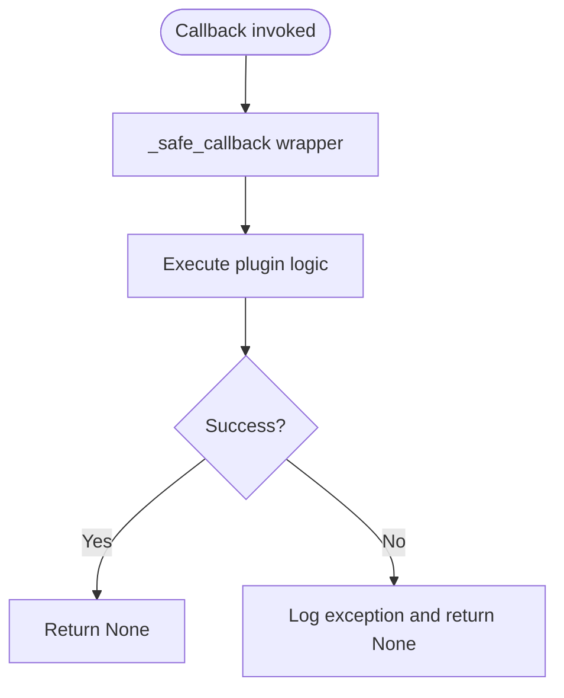

**Diagram sources**
- [bigquery_agent_analytics_plugin.py](file://src/google/adk/plugins/bigquery_agent_analytics_plugin.py#L110-L128)

**Section sources**
- [bigquery_agent_analytics_plugin.py](file://src/google/adk/plugins/bigquery_agent_analytics_plugin.py#L448-L800)

### CLI RecordingsPlugin and ReplayPlugin
Enable conformance testing by recording and replaying interactions. RecordingsPlugin captures LLM/tool interactions and persists them; ReplayPlugin verifies and replays them deterministically.

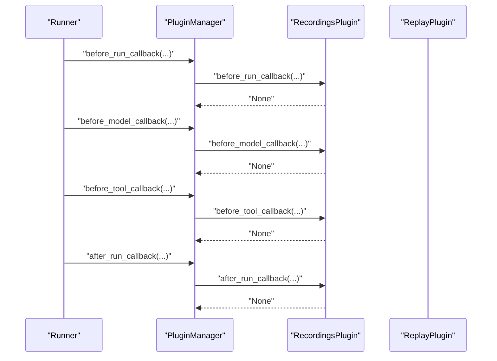

**Diagram sources**
- [recordings_plugin.py](file://src/google/adk/cli/plugins/recordings_plugin.py#L77-L328)

**Section sources**
- [recordings_plugin.py](file://src/google/adk/cli/plugins/recordings_plugin.py#L66-L401)
- [replay_plugin.py](file://src/google/adk/cli/plugins/replay_plugin.py#L83-L168)

### RequestIntercepterPlugin
Internal evaluation helper that correlates LLM requests with responses using a request ID stored in callback context and response custom metadata.

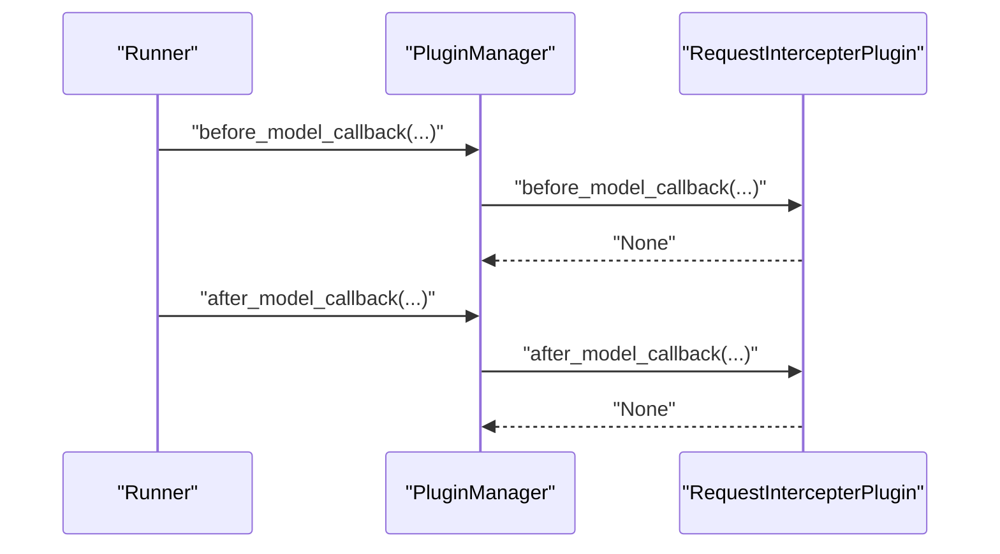

**Diagram sources**
- [request_intercepter_plugin.py](file://src/google/adk/evaluation/request_intercepter_plugin.py#L58-L80)

**Section sources**
- [request_intercepter_plugin.py](file://src/google/adk/evaluation/request_intercepter_plugin.py#L33-L95)

### Custom Plugin Example: CountInvocationPlugin
A minimal example counting agent/tool/LLM invocations demonstrates how to subclass BasePlugin and override specific callbacks.

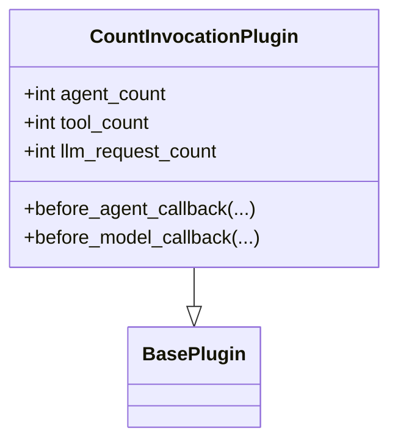

**Diagram sources**
- [count_plugin.py](file://contributing/samples/plugin_basic/count_plugin.py#L21-L44)

**Section sources**
- [count_plugin.py](file://contributing/samples/plugin_basic/count_plugin.py#L21-L44)
- [main.py](file://contributing/samples/plugin_basic/main.py#L40-L66)

## Dependency Analysis
- BasePlugin depends on agent, tool, and model types for callback signatures.
- PluginManager depends on BasePlugin and orchestrates callback execution.
- Built-in plugins depend on BasePlugin and use callback context/state to modify behavior.
- CLI and evaluation plugins depend on BasePlugin and integrate with session state and callback context.

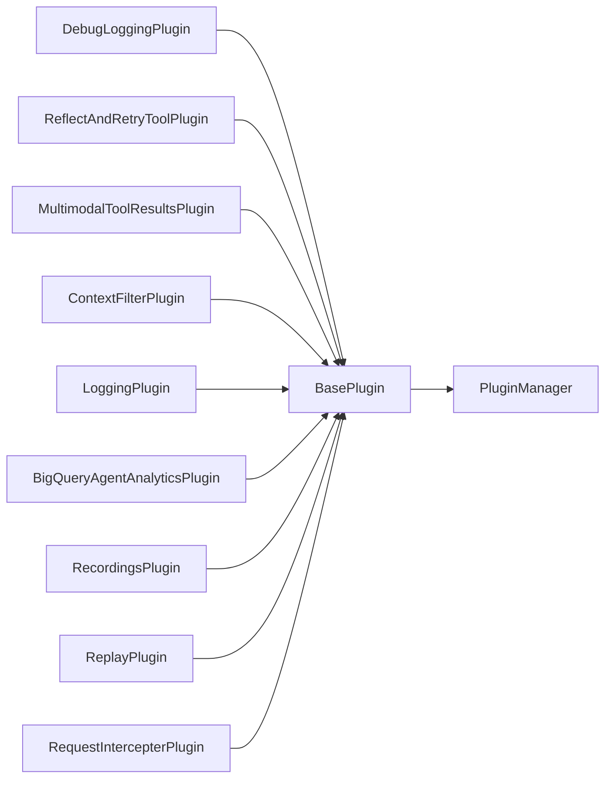

**Diagram sources**
- [base_plugin.py](file://src/google/adk/plugins/base_plugin.py#L41-L373)
- [plugin_manager.py](file://src/google/adk/plugins/plugin_manager.py#L60-L348)
- [debug_logging_plugin.py](file://src/google/adk/plugins/debug_logging_plugin.py#L67-L573)
- [reflect_retry_tool_plugin.py](file://src/google/adk/plugins/reflect_retry_tool_plugin.py#L55-L383)
- [multimodal_tool_results_plugin.py](file://src/google/adk/plugins/multimodal_tool_results_plugin.py#L32-L91)
- [context_filter_plugin.py](file://src/google/adk/plugins/context_filter_plugin.py#L100-L156)
- [logging_plugin.py](file://src/google/adk/plugins/logging_plugin.py#L37-L324)
- [bigquery_agent_analytics_plugin.py](file://src/google/adk/plugins/bigquery_agent_analytics_plugin.py#L448-L800)
- [recordings_plugin.py](file://src/google/adk/cli/plugins/recordings_plugin.py#L66-L401)
- [replay_plugin.py](file://src/google/adk/cli/plugins/replay_plugin.py#L72-L383)
- [request_intercepter_plugin.py](file://src/google/adk/evaluation/request_intercepter_plugin.py#L33-L95)

**Section sources**
- [plugin_manager.py](file://src/google/adk/plugins/plugin_manager.py#L60-L348)

## Performance Considerations
- Early-exit strategy: Prefer returning early from callbacks to avoid unnecessary downstream processing.
- Concurrency safety: Use locks in plugins that maintain shared state (e.g., ReflectAndRetryToolPlugin).
- Serialization overhead: DebugLoggingPlugin and BigQueryAgentAnalyticsPlugin may incur I/O and serialization costs; tune output and batching accordingly.
- Context filtering: Reduce token usage by trimming context to recent invocations to improve latency and cost.
- Logging verbosity: LoggingPlugin is useful for debugging but can increase console I/O; use selectively.

[No sources needed since this section provides general guidance]

## Troubleshooting Guide
Common issues and resolutions:
- Duplicate plugin names: Registration raises a ValueError. Ensure unique plugin names.
- Plugin exceptions: PluginManager wraps exceptions into a RuntimeError with contextual info. Inspect logs for the specific plugin and callback.
- Plugin shutdown failures: PluginManager aggregates close failures and raises a RuntimeError summarizing issues. Fix plugin close logic and timeouts.
- Reflection retry limits: If max_retries is exceeded and throw_exception_if_retry_exceeded is True, the original exception is raised. Consider disabling throwing to receive guidance instead.
- Multimodal results not appearing: Ensure tools return parts or lists of parts; the plugin saves them in ToolContext and injects them into the LLM request.
- Context trimming orphaned function responses: Use ContextFilterPlugin to preserve call/response pairs by adjusting the split index.

**Section sources**
- [plugin_manager.py](file://src/google/adk/plugins/plugin_manager.py#L92-L104)
- [plugin_manager.py](file://src/google/adk/plugins/plugin_manager.py#L299-L305)
- [plugin_manager.py](file://src/google/adk/plugins/plugin_manager.py#L343-L348)
- [reflect_retry_tool_plugin.py](file://src/google/adk/plugins/reflect_retry_tool_plugin.py#L243-L266)
- [multimodal_tool_results_plugin.py](file://src/google/adk/plugins/multimodal_tool_results_plugin.py#L62-L77)
- [context_filter_plugin.py](file://src/google/adk/plugins/context_filter_plugin.py#L32-L60)

## Conclusion
ADK’s plugin system provides a robust, extensible mechanism to observe and modify agent behavior at every stage of execution. The PluginManager ensures predictable ordering and early-exit semantics, while built-in plugins showcase practical patterns for logging, error recovery, multimodal results, context management, and analytics. By following the guidelines in this document, developers can implement reliable, performant plugins tailored to their use cases.

[No sources needed since this section summarizes without analyzing specific files]

## Appendices

### Practical Examples

- Using DebugLoggingPlugin in an App:
  - Configure DebugLoggingPlugin in the App’s plugins list and run the agent. The plugin writes a YAML file with detailed invocation logs.

  **Section sources**
  - [agent.py](file://contributing/samples/plugin_debug_logging/agent.py#L109-L124)

- Creating a custom plugin:
  - Subclass BasePlugin and override desired callbacks. Register the plugin instance with the Runner or App.

  **Section sources**
  - [count_plugin.py](file://contributing/samples/plugin_basic/count_plugin.py#L21-L44)
  - [main.py](file://contributing/samples/plugin_basic/main.py#L40-L66)

### Best Practices
- Keep plugins focused: Each plugin should address a single concern.
- Use early-exit judiciously: Only return non-None values when you intend to short-circuit.
- Handle errors gracefully: Expect exceptions and log them; avoid letting plugin errors crash the runner.
- Respect concurrency: Use locks for shared mutable state.
- Minimize side effects: Prefer pure transformations of callback parameters.
- Test thoroughly: Use RecordingsPlugin and ReplayPlugin for deterministic testing.

[No sources needed since this section provides general guidance]