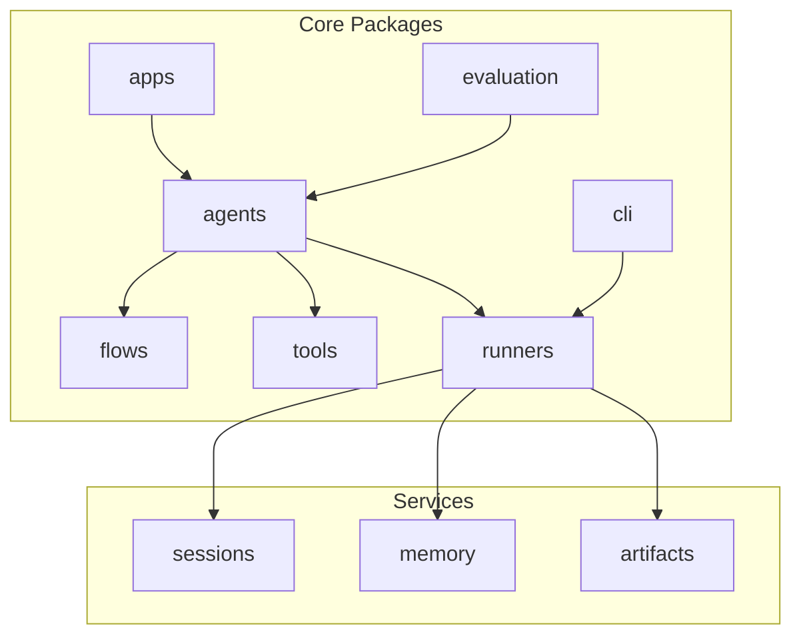
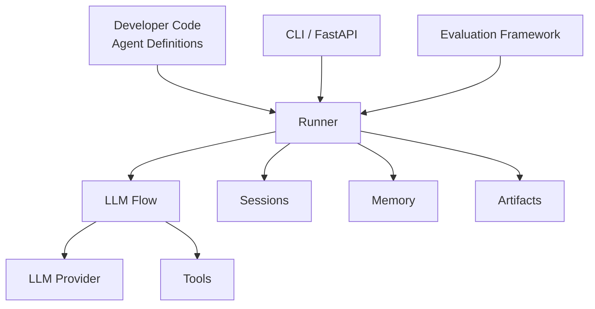
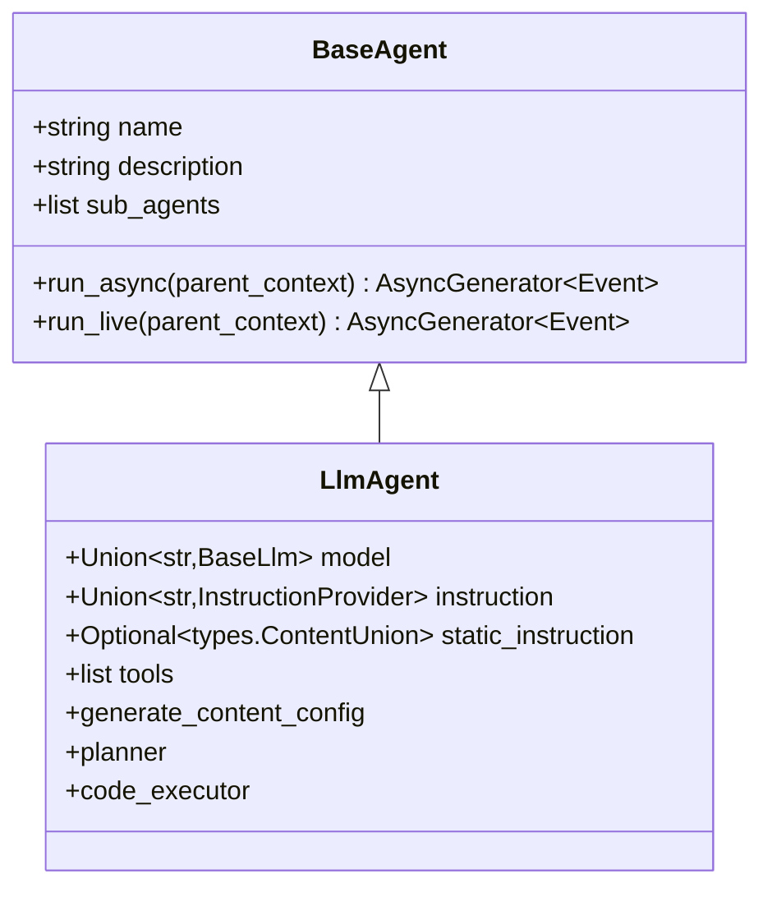
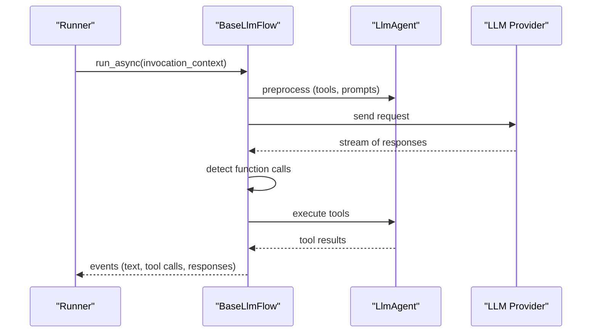
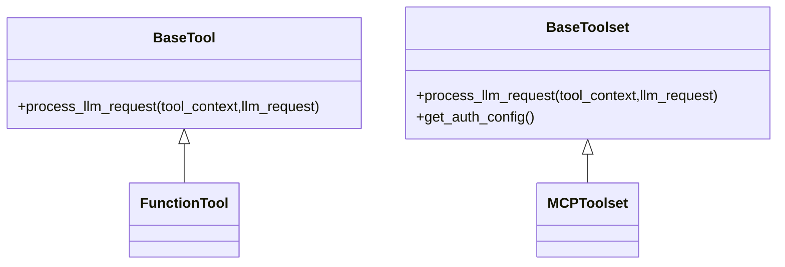
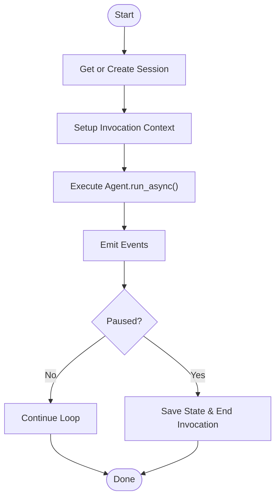
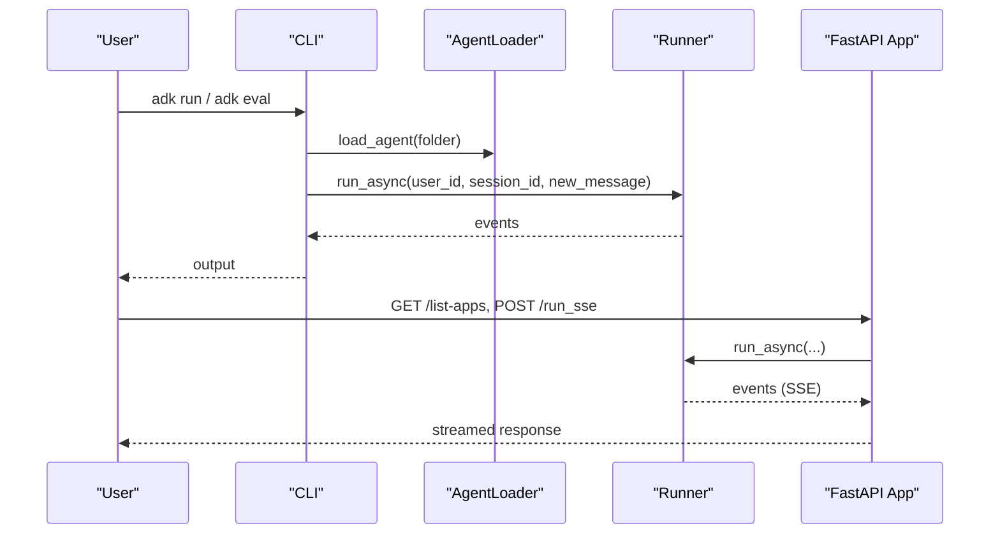
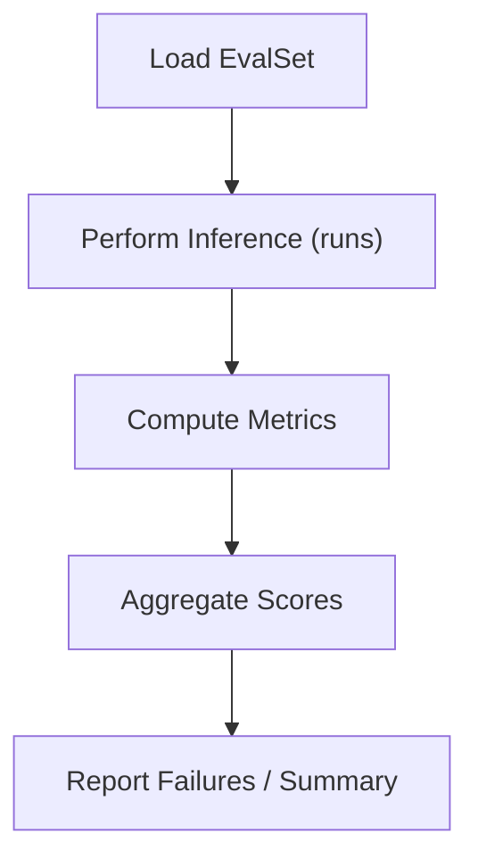
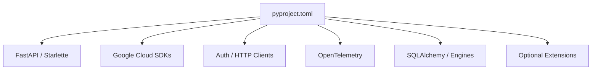

# Project Overview

<cite>
**Referenced Files in This Document**
- [README.md](file://README.md)
- [contributing/adk_project_overview_and_architecture.md](file://contributing/adk_project_overview_and_architecture.md)
- [src/google/adk/__init__.py](file://src/google/adk/__init__.py)
- [src/google/adk/version.py](file://src/google/adk/version.py)
- [pyproject.toml](file://pyproject.toml)
- [src/google/adk/agents/base_agent.py](file://src/google/adk/agents/base_agent.py)
- [src/google/adk/agents/llm_agent.py](file://src/google/adk/agents/llm_agent.py)
- [src/google/adk/runners.py](file://src/google/adk/runners.py)
- [src/google/adk/cli/cli.py](file://src/google/adk/cli/cli.py)
- [src/google/adk/apps/app.py](file://src/google/adk/apps/app.py)
- [src/google/adk/flows/llm_flows/base_llm_flow.py](file://src/google/adk/flows/llm_flows/base_llm_flow.py)
- [src/google/adk/tools/__init__.py](file://src/google/adk/tools/__init__.py)
- [src/google/adk/evaluation/agent_evaluator.py](file://src/google/adk/evaluation/agent_evaluator.py)
</cite>

## Table of Contents
1. [Introduction](#introduction)
2. [Project Structure](#project-structure)
3. [Core Components](#core-components)
4. [Architecture Overview](#architecture-overview)
5. [Detailed Component Analysis](#detailed-component-analysis)
6. [Dependency Analysis](#dependency-analysis)
7. [Performance Considerations](#performance-considerations)
8. [Troubleshooting Guide](#troubleshooting-guide)
9. [Conclusion](#conclusion)
10. [Appendices](#appendices)

## Introduction
Agent Development Kit (ADK) is an open-source, code-first Python framework for building, evaluating, and deploying sophisticated AI agents. It applies software engineering principles—modularity, composability, and separation of concerns—to AI agent creation. ADK emphasizes:
- Rich tool ecosystem with built-in and extensible capabilities
- Code-first development for versioning, testing, and IDE support
- Modular multi-agent systems with hierarchical composition
- Deployment flexibility across local, cloud, and managed platforms
- Model-agnostic design compatible with multiple LLM providers and frameworks

ADK’s philosophy centers on treating agents as code-first artifacts that remain portable across environments and deployment targets. The framework provides robust abstractions for agents, tools, sessions, memory, artifacts, and evaluation, enabling teams to iterate quickly and scale confidently.

**Section sources**
- [README.md](file://README.md#L26-L31)
- [contributing/adk_project_overview_and_architecture.md](file://contributing/adk_project_overview_and_architecture.md#L5-L12)

## Project Structure
ADK organizes functionality into cohesive packages:
- agents: Agent base classes, LLM-backed agents, and agent composition
- flows: LLM interaction flows (streaming, live, single-step)
- tools: Tool abstractions and a rich ecosystem of built-in tools
- apps: Application containerization and configuration
- runners: Execution engine for agent runs and session lifecycle
- cli: Command-line interface and FastAPI integration
- evaluation: Evaluation framework for quality assessment
- sessions/memory/artifacts: Persistence and state management
- telemetry/plugins/errors: Observability, extensibility, and error handling

**Diagram sources**
- [src/google/adk/agents/base_agent.py](file://src/google/adk/agents/base_agent.py#L86-L120)
- [src/google/adk/flows/llm_flows/base_llm_flow.py](file://src/google/adk/flows/llm_flows/base_llm_flow.py#L447-L460)
- [src/google/adk/tools/__init__.py](file://src/google/adk/tools/__init__.py#L49-L91)
- [src/google/adk/apps/app.py](file://src/google/adk/apps/app.py#L111-L152)
- [src/google/adk/runners.py](file://src/google/adk/runners.py#L112-L150)
- [src/google/adk/cli/cli.py](file://src/google/adk/cli/cli.py#L136-L148)

**Section sources**
- [contributing/adk_project_overview_and_architecture.md](file://contributing/adk_project_overview_and_architecture.md#L27-L47)

## Core Components
- Agent: Defines identity, instructions, tools, and behavior. BaseAgent provides lifecycle hooks and composition; LlmAgent adds LLM orchestration, tool execution, and planner integration.
- Tool: Capability abstraction supporting functions, toolsets, and MCP-based integrations.
- Runner: Executes agent invocations, manages sessions, and coordinates events across plugins and services.
- App: Top-level container for an agent tree, plugins, and configuration (resumability, compaction, context caching).
- CLI/FastAPI: Developer and operator entry points for local testing, interactive runs, and API exposure.
- Evaluation: Automated evaluation pipeline for tool use and response quality against structured test sets.

**Section sources**
- [src/google/adk/agents/base_agent.py](file://src/google/adk/agents/base_agent.py#L86-L120)
- [src/google/adk/agents/llm_agent.py](file://src/google/adk/agents/llm_agent.py#L187-L220)
- [src/google/adk/tools/__init__.py](file://src/google/adk/tools/__init__.py#L49-L91)
- [src/google/adk/runners.py](file://src/google/adk/runners.py#L112-L150)
- [src/google/adk/apps/app.py](file://src/google/adk/apps/app.py#L111-L152)
- [src/google/adk/cli/cli.py](file://src/google/adk/cli/cli.py#L136-L148)
- [src/google/adk/evaluation/agent_evaluator.py](file://src/google/adk/evaluation/agent_evaluator.py#L97-L116)

## Architecture Overview
ADK’s architecture separates agent logic from deployment and persistence:
- Code-first agent definitions in Python
- Runner orchestrates LLM calls, tool execution, and event emission
- Services (sessions, memory, artifacts) decouple state and persistence
- CLI and FastAPI expose standardized endpoints
- Evaluation validates agent behavior against test sets

**Diagram sources**
- [src/google/adk/runners.py](file://src/google/adk/runners.py#L493-L622)
- [src/google/adk/flows/llm_flows/base_llm_flow.py](file://src/google/adk/flows/llm_flows/base_llm_flow.py#L751-L800)
- [src/google/adk/cli/cli.py](file://src/google/adk/cli/cli.py#L136-L148)
- [src/google/adk/evaluation/agent_evaluator.py](file://src/google/adk/evaluation/agent_evaluator.py#L108-L164)

**Section sources**
- [contributing/adk_project_overview_and_architecture.md](file://contributing/adk_project_overview_and_architecture.md#L5-L12)
- [README.md](file://README.md#L26-L31)

## Detailed Component Analysis

### Agent Abstractions
ADK defines a base agent abstraction with lifecycle hooks and composition. LlmAgent extends this with LLM orchestration, tool resolution, and planner integration. Both support callbacks for pre/post model/tool execution and error handling.

**Diagram sources**
- [src/google/adk/agents/base_agent.py](file://src/google/adk/agents/base_agent.py#L86-L120)
- [src/google/adk/agents/llm_agent.py](file://src/google/adk/agents/llm_agent.py#L187-L220)

**Section sources**
- [src/google/adk/agents/base_agent.py](file://src/google/adk/agents/base_agent.py#L86-L120)
- [src/google/adk/agents/llm_agent.py](file://src/google/adk/agents/llm_agent.py#L187-L220)

### LLM Flow and Execution Loop
The LLM flow encapsulates the “think-act” loop: prepare request, call LLM, process tool calls, and emit events. It supports both streaming and live modes, with resumability and long-running tool handling.

**Diagram sources**
- [src/google/adk/runners.py](file://src/google/adk/runners.py#L592-L621)
- [src/google/adk/flows/llm_flows/base_llm_flow.py](file://src/google/adk/flows/llm_flows/base_llm_flow.py#L751-L800)

**Section sources**
- [src/google/adk/flows/llm_flows/base_llm_flow.py](file://src/google/adk/flows/llm_flows/base_llm_flow.py#L447-L520)

### Tool Ecosystem
ADK exposes a unified tool interface and a rich ecosystem of tools, including search, retrieval, API integrations, and MCP-based toolsets. Tools can be functions, BaseTool instances, or toolsets.

**Diagram sources**
- [src/google/adk/tools/__init__.py](file://src/google/adk/tools/__init__.py#L49-L91)

**Section sources**
- [src/google/adk/tools/__init__.py](file://src/google/adk/tools/__init__.py#L49-L91)

### Runner and Session Lifecycle
Runner manages session creation, invocation setup, event emission, and resumability. It integrates with plugins, artifacts, memory, and credentials.

**Diagram sources**
- [src/google/adk/runners.py](file://src/google/adk/runners.py#L395-L426)
- [src/google/adk/runners.py](file://src/google/adk/runners.py#L527-L621)

**Section sources**
- [src/google/adk/runners.py](file://src/google/adk/runners.py#L112-L150)
- [src/google/adk/runners.py](file://src/google/adk/runners.py#L395-L426)
- [src/google/adk/runners.py](file://src/google/adk/runners.py#L527-L621)

### CLI and API Exposure
ADK provides a CLI for interactive runs and batch processing, and a helper to generate a FastAPI app for production APIs.

**Diagram sources**
- [src/google/adk/cli/cli.py](file://src/google/adk/cli/cli.py#L136-L148)
- [src/google/adk/cli/cli.py](file://src/google/adk/cli/cli.py#L50-L91)
- [src/google/adk/runners.py](file://src/google/adk/runners.py#L493-L621)

**Section sources**
- [src/google/adk/cli/cli.py](file://src/google/adk/cli/cli.py#L136-L148)
- [src/google/adk/cli/cli.py](file://src/google/adk/cli/cli.py#L50-L91)

### Evaluation Pipeline
ADK’s evaluation framework supports structured test sets, multiple runs, and metrics such as tool trajectory and response match. It validates agent behavior end-to-end with a live LLM.

**Diagram sources**
- [src/google/adk/evaluation/agent_evaluator.py](file://src/google/adk/evaluation/agent_evaluator.py#L108-L164)
- [src/google/adk/evaluation/agent_evaluator.py](file://src/google/adk/evaluation/agent_evaluator.py#L532-L600)

**Section sources**
- [src/google/adk/evaluation/agent_evaluator.py](file://src/google/adk/evaluation/agent_evaluator.py#L97-L116)
- [src/google/adk/evaluation/agent_evaluator.py](file://src/google/adk/evaluation/agent_evaluator.py#L108-L164)

## Dependency Analysis
ADK declares a comprehensive set of dependencies for LLM integrations, tooling, observability, and optional extensions. The project is designed to be modular, enabling teams to install only what they need.

**Diagram sources**
- [pyproject.toml](file://pyproject.toml#L26-L74)
- [pyproject.toml](file://pyproject.toml#L86-L168)

**Section sources**
- [pyproject.toml](file://pyproject.toml#L26-L74)
- [pyproject.toml](file://pyproject.toml#L86-L168)

## Performance Considerations
- Context caching: Static instructions and explicit caches can reduce repeated prompt overhead.
- Streaming and live modes: Optimize real-time audio/video pipelines with caching and resumption handles.
- Tool concurrency: Use asynchronous tool execution and gather patterns to minimize latency.
- Event compaction: Configure sliding window compaction to manage long histories efficiently.
- Resumability: Pause on long-running tools and resume deterministically to avoid redundant work.

[No sources needed since this section provides general guidance]

## Troubleshooting Guide
Common operational issues and resolutions:
- Session not found: Ensure app name alignment and consider enabling auto-create session.
- Rewind session: Use rewind API to revert state and artifacts to a prior invocation.
- Invocation misalignment: Validate invocation IDs derived from function responses.
- Missing tool credentials: Resolve toolset auth requests or configure credentials.

**Section sources**
- [src/google/adk/runners.py](file://src/google/adk/runners.py#L384-L394)
- [src/google/adk/runners.py](file://src/google/adk/runners.py#L623-L758)
- [src/google/adk/flows/llm_flows/base_llm_flow.py](file://src/google/adk/flows/llm_flows/base_llm_flow.py#L116-L190)

## Conclusion
ADK positions itself as a code-first, model- and deployment-agnostic framework for building sophisticated AI agents. Its modular architecture, rich tool ecosystem, robust evaluation pipeline, and developer-friendly CLI/API surface make it suitable for rapid iteration and production-grade deployments. The project’s open-source nature and active community ecosystem further accelerate innovation and adoption.

[No sources needed since this section summarizes without analyzing specific files]

## Appendices

### Quick Facts
- Version and entry points: The package exports core symbols and version metadata.
- Installation: Stable and development channels available via pip.
- Community: Active community repo and events for collaboration and learning.

**Section sources**
- [src/google/adk/__init__.py](file://src/google/adk/__init__.py#L18-L24)
- [src/google/adk/version.py](file://src/google/adk/version.py#L15-L17)
- [README.md](file://README.md#L62-L84)
- [README.md](file://README.md#L159-L164)