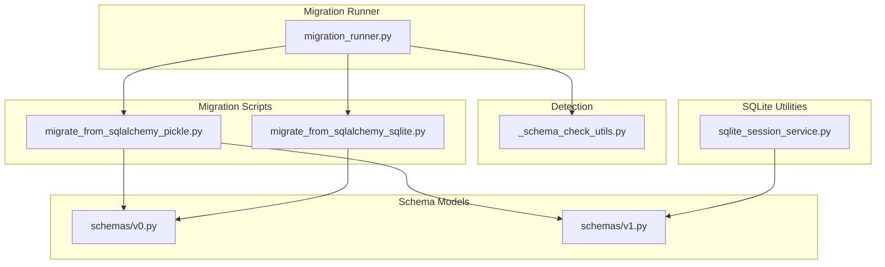
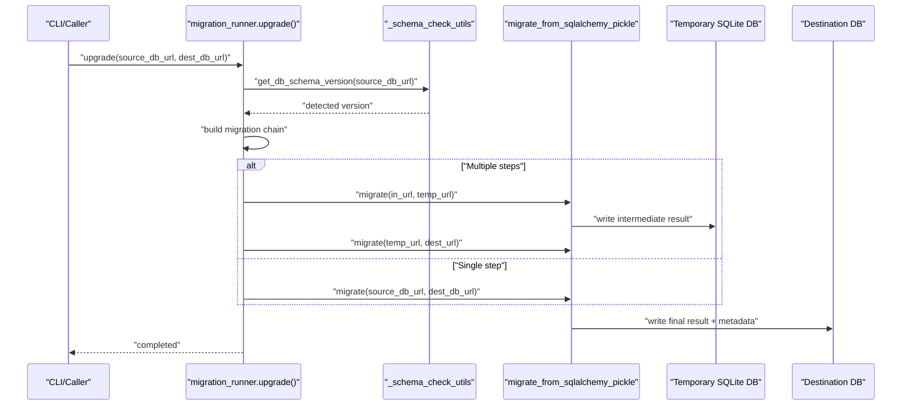
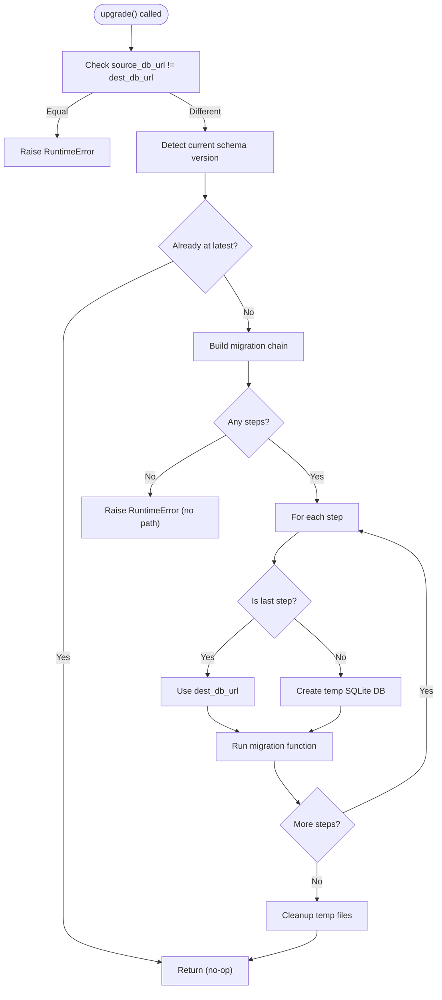
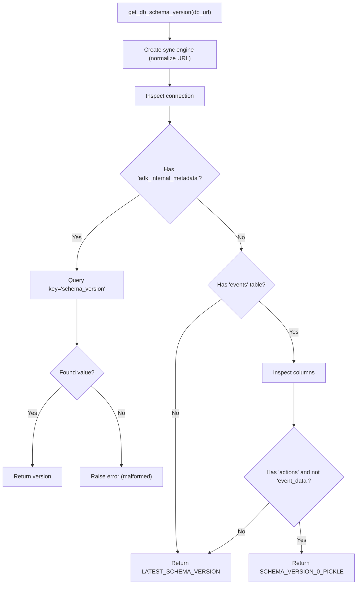
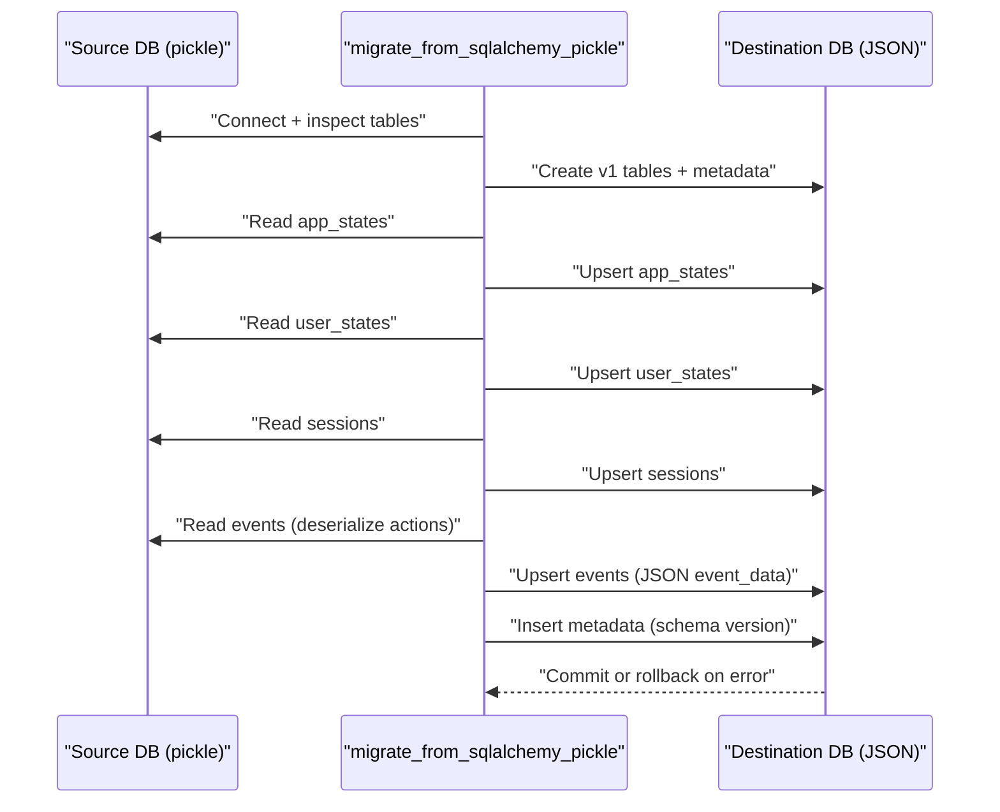
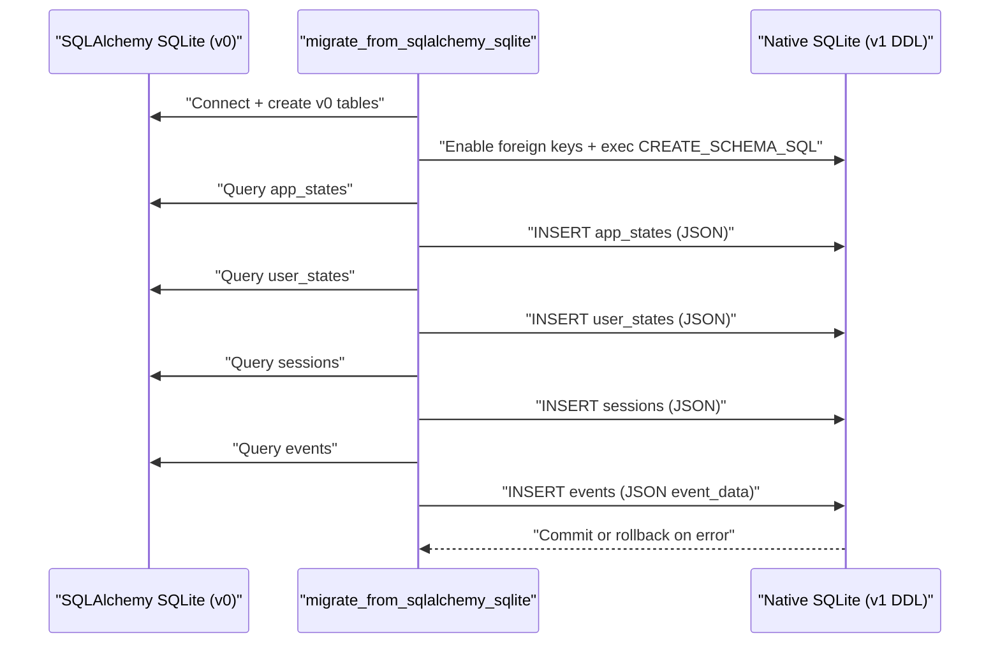
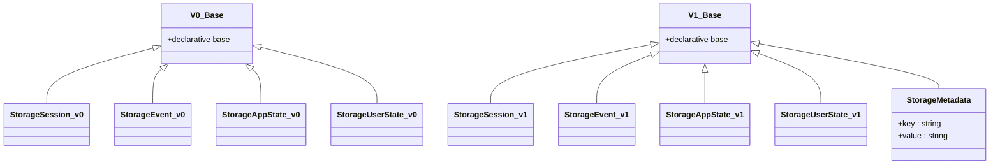
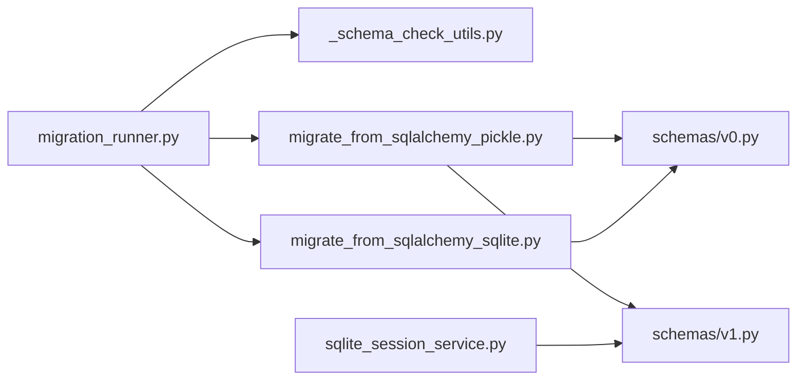

# Database Migration System

<cite>
**Referenced Files in This Document**
- [migration_runner.py](file://src/google/adk/sessions/migration/migration_runner.py)
- [_schema_check_utils.py](file://src/google/adk/sessions/migration/_schema_check_utils.py)
- [migrate_from_sqlalchemy_pickle.py](file://src/google/adk/sessions/migration/migrate_from_sqlalchemy_pickle.py)
- [migrate_from_sqlalchemy_sqlite.py](file://src/google/adk/sessions/migration/migrate_from_sqlalchemy_sqlite.py)
- [v0.py](file://src/google/adk/sessions/schemas/v0.py)
- [v1.py](file://src/google/adk/sessions/schemas/v1.py)
- [sqlite_session_service.py](file://src/google/adk/sessions/sqlite_session_service.py)
- [README.md](file://src/google/adk/sessions/migration/README.md)
- [test_migration.py](file://tests/unittests/sessions/migration/test_migration.py)
- [test_database_schema.py](file://tests/unittests/sessions/migration/test_database_schema.py)
</cite>

## Table of Contents
1. [Introduction](#introduction)
2. [Project Structure](#project-structure)
3. [Core Components](#core-components)
4. [Architecture Overview](#architecture-overview)
5. [Detailed Component Analysis](#detailed-component-analysis)
6. [Dependency Analysis](#dependency-analysis)
7. [Performance Considerations](#performance-considerations)
8. [Troubleshooting Guide](#troubleshooting-guide)
9. [Conclusion](#conclusion)
10. [Appendices](#appendices)

## Introduction
This document explains the database migration system used by the Application Development Kit (ADK) for managing schema upgrades of session and event data. It covers the migration runner architecture, detection of legacy schemas, and automated upgrade processes. It documents the strategy for transitioning from SQLAlchemy pickle-based storage to a modern SQL schema with JSON serialization, and details SQLite-specific migration utilities. The guide also describes validation, rollback behavior, error handling, step-by-step workflows, preparation and verification steps, performance considerations, downtime minimization strategies, and production best practices.

## Project Structure
The migration system is organized around:
- A migration runner that orchestrates multi-step upgrades
- Schema detection utilities that identify current database versions
- Migration scripts that transform data between schema versions
- SQLAlchemy model definitions for each schema version
- SQLite-specific migration utilities for evolving SQLite database formats
- Tests validating migration correctness and schema behavior

**Diagram sources**
- [migration_runner.py](file://src/google/adk/sessions/migration/migration_runner.py#L45-L128)
- [_schema_check_utils.py](file://src/google/adk/sessions/migration/_schema_check_utils.py#L115-L142)
- [migrate_from_sqlalchemy_pickle.py](file://src/google/adk/sessions/migration/migrate_from_sqlalchemy_pickle.py#L166-L296)
- [migrate_from_sqlalchemy_sqlite.py](file://src/google/adk/sessions/migration/migrate_from_sqlalchemy_sqlite.py#L34-L148)
- [v0.py](file://src/google/adk/sessions/schemas/v0.py#L98-L387)
- [v1.py](file://src/google/adk/sessions/schemas/v1.py#L55-L248)
- [sqlite_session_service.py](file://src/google/adk/sessions/sqlite_session_service.py#L43-L93)

**Section sources**
- [migration_runner.py](file://src/google/adk/sessions/migration/migration_runner.py#L1-L128)
- [_schema_check_utils.py](file://src/google/adk/sessions/migration/_schema_check_utils.py#L1-L142)
- [migrate_from_sqlalchemy_pickle.py](file://src/google/adk/sessions/migration/migrate_from_sqlalchemy_pickle.py#L1-L318)
- [migrate_from_sqlalchemy_sqlite.py](file://src/google/adk/sessions/migration/migrate_from_sqlalchemy_sqlite.py#L1-L173)
- [v0.py](file://src/google/adk/sessions/schemas/v0.py#L1-L387)
- [v1.py](file://src/google/adk/sessions/schemas/v1.py#L1-L248)
- [sqlite_session_service.py](file://src/google/adk/sessions/sqlite_session_service.py#L1-L200)

## Core Components
- Migration Runner: Orchestrates multi-step migrations, validates inputs, builds migration chains, and manages temporary intermediate databases.
- Schema Detection: Determines the current schema version by inspecting metadata tables and legacy table/column layouts, and supports URL normalization for async drivers.
- Migration Scripts:
  - From Pickle to JSON: Converts legacy SQLAlchemy models with pickle-serialized event actions to the new JSON-based schema.
  - From SQLAlchemy SQLite to native SQLite: Migrates SQLAlchemy-backed SQLite databases to the native SQLite JSON schema.
- Schema Models: SQLAlchemy DeclarativeBase classes define the structure and relationships for each schema version.
- SQLite Utilities: Provide SQL DDL for creating tables and guardrails against legacy schemas in the SQLite service.

Key responsibilities:
- Validation: Ensures source and destination URLs differ and that a migration path exists.
- Rollback: Performs transaction rollbacks on errors and cleans up temporary files.
- Compatibility: Handles async driver URLs by converting them to synchronous equivalents for migration.

**Section sources**
- [migration_runner.py](file://src/google/adk/sessions/migration/migration_runner.py#L45-L128)
- [_schema_check_utils.py](file://src/google/adk/sessions/migration/_schema_check_utils.py#L115-L142)
- [migrate_from_sqlalchemy_pickle.py](file://src/google/adk/sessions/migration/migrate_from_sqlalchemy_pickle.py#L166-L296)
- [migrate_from_sqlalchemy_sqlite.py](file://src/google/adk/sessions/migration/migrate_from_sqlalchemy_sqlite.py#L34-L148)
- [v0.py](file://src/google/adk/sessions/schemas/v0.py#L98-L387)
- [v1.py](file://src/google/adk/sessions/schemas/v1.py#L55-L248)
- [sqlite_session_service.py](file://src/google/adk/sessions/sqlite_session_service.py#L139-L154)

## Architecture Overview
The migration system follows a staged pipeline:
- Detect current schema version from the source database
- Build a chain of migration steps from current to latest version
- For each step, run the appropriate migration function
- Use temporary SQLite databases for intermediate steps when crossing database types
- Mark the destination database with the new schema version

**Diagram sources**
- [migration_runner.py](file://src/google/adk/sessions/migration/migration_runner.py#L45-L128)
- [_schema_check_utils.py](file://src/google/adk/sessions/migration/_schema_check_utils.py#L115-L142)
- [migrate_from_sqlalchemy_pickle.py](file://src/google/adk/sessions/migration/migrate_from_sqlalchemy_pickle.py#L166-L296)

## Detailed Component Analysis

### Migration Runner
Responsibilities:
- Validate inputs and prevent in-place migration
- Detect current schema version
- Construct migration chain using a registry of version-to-version transitions
- Execute migration functions sequentially
- Manage temporary SQLite files for intermediate steps
- Clean up temporary files even on failure

Behavior highlights:
- Uses a registry mapping start version to (end_version, migration_function)
- Converts async driver URLs to sync for migration operations
- Logs progress and errors per step
- Ensures destination metadata reflects the new schema version

**Diagram sources**
- [migration_runner.py](file://src/google/adk/sessions/migration/migration_runner.py#L45-L128)

**Section sources**
- [migration_runner.py](file://src/google/adk/sessions/migration/migration_runner.py#L45-L128)

### Schema Detection Utilities
Responsibilities:
- Determine schema version by inspecting metadata table presence and legacy table/column characteristics
- Support URL normalization for async drivers by stripping driver suffixes
- Provide helpers to convert async URLs to sync for migration operations

Key logic:
- If metadata table exists, read the schema version key
- Otherwise, if legacy events table has pickle actions and lacks JSON event_data, treat as v0
- Otherwise, treat as latest schema for new databases

**Diagram sources**
- [_schema_check_utils.py](file://src/google/adk/sessions/migration/_schema_check_utils.py#L115-L142)

**Section sources**
- [_schema_check_utils.py](file://src/google/adk/sessions/migration/_schema_check_utils.py#L115-L142)

### Migration from SQLAlchemy Pickle to JSON
Purpose:
- Transition legacy databases using pickle-serialized event actions to the new JSON-based schema
- Safely deserialize and re-serialize event data, state dictionaries, and timestamps
- Upsert migrated records into the destination database using SQLAlchemy ORM

Key steps:
- Normalize async URLs to sync for migration
- Create destination schema tables
- Migrate app_states, user_states, sessions, and events
- Insert metadata indicating the new schema version
- Commit or rollback on error

**Diagram sources**
- [migrate_from_sqlalchemy_pickle.py](file://src/google/adk/sessions/migration/migrate_from_sqlalchemy_pickle.py#L166-L296)
- [v0.py](file://src/google/adk/sessions/schemas/v0.py#L179-L387)
- [v1.py](file://src/google/adk/sessions/schemas/v1.py#L55-L248)

**Section sources**
- [migrate_from_sqlalchemy_pickle.py](file://src/google/adk/sessions/migration/migrate_from_sqlalchemy_pickle.py#L166-L296)
- [v0.py](file://src/google/adk/sessions/schemas/v0.py#L179-L387)
- [v1.py](file://src/google/adk/sessions/schemas/v1.py#L55-L248)

### Migration from SQLAlchemy SQLite to Native SQLite
Purpose:
- Migrate databases backed by SQLAlchemy’s SQLite dialect to the native SQLite JSON schema
- Use SQLAlchemy for inspection and v0 models, then write to native SQLite using pragmas and DDL

Key steps:
- Normalize async URLs to sync for inspection
- Create v0 tables for inspection
- Open destination SQLite connection, enable foreign keys, and execute CREATE_SCHEMA_SQL
- Migrate each table using INSERT statements with JSON serialization
- Commit or rollback on error

**Diagram sources**
- [migrate_from_sqlalchemy_sqlite.py](file://src/google/adk/sessions/migration/migrate_from_sqlalchemy_sqlite.py#L34-L148)
- [sqlite_session_service.py](file://src/google/adk/sessions/sqlite_session_service.py#L43-L93)
- [v0.py](file://src/google/adk/sessions/schemas/v0.py#L354-L387)

**Section sources**
- [migrate_from_sqlalchemy_sqlite.py](file://src/google/adk/sessions/migration/migrate_from_sqlalchemy_sqlite.py#L34-L148)
- [sqlite_session_service.py](file://src/google/adk/sessions/sqlite_session_service.py#L43-L93)
- [v0.py](file://src/google/adk/sessions/schemas/v0.py#L354-L387)

### Schema Models (v0 and v1)
- v0: Defines SQLAlchemy models with pickle-serialized event actions and legacy column layout
- v1: Defines SQLAlchemy models with JSON-serialized event data and an internal metadata table for schema versioning

Highlights:
- v0 uses DynamicPickleType and DynamicJSON for flexible storage
- v1 consolidates event data into a single JSON field and adds adk_internal_metadata for version tracking
- Both versions include relationships and constraints for referential integrity

**Diagram sources**
- [v0.py](file://src/google/adk/sessions/schemas/v0.py#L92-L387)
- [v1.py](file://src/google/adk/sessions/schemas/v1.py#L49-L248)

**Section sources**
- [v0.py](file://src/google/adk/sessions/schemas/v0.py#L92-L387)
- [v1.py](file://src/google/adk/sessions/schemas/v1.py#L49-L248)

### SQLite Session Service Guardrails
- The SQLite service checks for legacy schemas and raises a clear error instructing users to run the migration utility
- It prepares CREATE_SCHEMA_SQL for native SQLite tables and enables foreign keys

Operational impact:
- Prevents accidental writes to legacy schemas
- Guides users toward safe migration before enabling the service

**Section sources**
- [sqlite_session_service.py](file://src/google/adk/sessions/sqlite_session_service.py#L139-L154)
- [sqlite_session_service.py](file://src/google/adk/sessions/sqlite_session_service.py#L43-L93)

## Dependency Analysis
The migration system exhibits clear separation of concerns:
- Runner depends on detection utilities and migration scripts
- Migration scripts depend on schema models and event utilities
- SQLite utilities depend on v1 schema DDL
- Tests validate detection, migration outcomes, and schema behavior

**Diagram sources**
- [migration_runner.py](file://src/google/adk/sessions/migration/migration_runner.py#L23-L42)
- [_schema_check_utils.py](file://src/google/adk/sessions/migration/_schema_check_utils.py#L26-L29)
- [migrate_from_sqlalchemy_pickle.py](file://src/google/adk/sessions/migration/migrate_from_sqlalchemy_pickle.py#L31-L36)
- [migrate_from_sqlalchemy_sqlite.py](file://src/google/adk/sessions/migration/migrate_from_sqlalchemy_sqlite.py#L25-L29)
- [sqlite_session_service.py](file://src/google/adk/sessions/sqlite_session_service.py#L43-L93)

**Section sources**
- [migration_runner.py](file://src/google/adk/sessions/migration/migration_runner.py#L23-L42)
- [_schema_check_utils.py](file://src/google/adk/sessions/migration/_schema_check_utils.py#L26-L29)
- [migrate_from_sqlalchemy_pickle.py](file://src/google/adk/sessions/migration/migrate_from_sqlalchemy_pickle.py#L31-L36)
- [migrate_from_sqlalchemy_sqlite.py](file://src/google/adk/sessions/migration/migrate_from_sqlalchemy_sqlite.py#L25-L29)
- [sqlite_session_service.py](file://src/google/adk/sessions/sqlite_session_service.py#L43-L93)

## Performance Considerations
- Batch reads and writes: Prefer iterating over result sets and batching inserts to reduce round-trips.
- Temporary storage: Intermediate steps use temporary SQLite files; ensure sufficient disk space and fast local storage.
- URL normalization: Converting async URLs to sync avoids overhead of async engines during migration.
- Indexing: For large datasets, consider adding indexes on frequently queried columns (e.g., timestamps) in destination tables.
- Memory usage: Large event payloads serialized to JSON increase storage; monitor memory during deserialization and re-serialization.
- Parallelism: The runner executes steps sequentially; parallelization is not implemented. Plan downtime accordingly.

[No sources needed since this section provides general guidance]

## Troubleshooting Guide
Common issues and resolutions:
- In-place migration attempted: The runner rejects identical source and destination URLs. Provide separate URLs.
- No migration path found: Detected version does not match any registered migration step. Verify schema version and registration.
- Async driver URLs: Migration converts async URLs to sync internally; ensure the provided URLs are valid for the target database.
- Legacy schema detected: If the SQLite service detects an old schema, run the migration utility before enabling the service.
- Migration failures: The scripts rollback on exceptions and log warnings; inspect logs for specific row-level failures and fix data anomalies.

Validation and verification:
- Tests confirm metadata insertion, table creation, and successful data migration for each entity type.
- Post-migration, verify the adk_internal_metadata table contains the expected schema version.

**Section sources**
- [migration_runner.py](file://src/google/adk/sessions/migration/migration_runner.py#L69-L94)
- [_schema_check_utils.py](file://src/google/adk/sessions/migration/_schema_check_utils.py#L107-L112)
- [sqlite_session_service.py](file://src/google/adk/sessions/sqlite_session_service.py#L145-L154)
- [migrate_from_sqlalchemy_pickle.py](file://src/google/adk/sessions/migration/migrate_from_sqlalchemy_pickle.py#L292-L295)
- [test_migration.py](file://tests/unittests/sessions/migration/test_migration.py#L150-L184)

## Conclusion
The ADK database migration system provides a robust, version-aware pipeline to evolve session and event schemas safely. By combining schema detection, staged migrations, and explicit metadata tracking, it ensures reliable upgrades from pickle-based to JSON-based schemas. SQLite-specific utilities facilitate smooth transitions for native SQLite deployments. With careful preparation, validation, and adherence to best practices, teams can minimize downtime and maintain data integrity during production schema updates.

[No sources needed since this section summarizes without analyzing specific files]

## Appendices

### Step-by-Step Migration Workflows
- From Pickle to JSON:
  - Prepare source and destination database URLs
  - Run the migration runner; it detects the current version and applies the pickle-to-JSON migration
  - Verify metadata and migrated data in the destination database
- From SQLAlchemy SQLite to Native SQLite:
  - Prepare source SQLAlchemy SQLite URL and destination file path
  - Run the SQLite migration script to produce a new SQLite database with JSON events
  - Replace the original file with the migrated file after backup

**Section sources**
- [migration_runner.py](file://src/google/adk/sessions/migration/migration_runner.py#L45-L128)
- [migrate_from_sqlalchemy_pickle.py](file://src/google/adk/sessions/migration/migrate_from_sqlalchemy_pickle.py#L166-L296)
- [migrate_from_sqlalchemy_sqlite.py](file://src/google/adk/sessions/migration/migrate_from_sqlalchemy_sqlite.py#L34-L148)

### Pre-Migration Preparation Requirements
- Back up source databases before migration
- Ensure destination databases are writable and have sufficient disk space for temporary files
- Confirm connectivity and credentials for both source and destination URLs
- Review async driver URLs; the system normalizes them to sync equivalents for migration

**Section sources**
- [migration_runner.py](file://src/google/adk/sessions/migration/migration_runner.py#L96-L111)
- [_schema_check_utils.py](file://src/google/adk/sessions/migration/_schema_check_utils.py#L107-L112)

### Post-Migration Verification Steps
- Confirm schema version in adk_internal_metadata
- Validate representative rows across app_states, user_states, sessions, and events
- Re-run unit tests to ensure expected behavior

**Section sources**
- [test_migration.py](file://tests/unittests/sessions/migration/test_migration.py#L158-L184)
- [test_database_schema.py](file://tests/unittests/sessions/migration/test_database_schema.py#L35-L38)

### Production Deployment Best Practices
- Schedule maintenance windows to accommodate migration time
- Use read replicas or offline mode for minimal disruption
- Monitor logs for warnings and errors during migration
- Validate rollback procedures and restore backups before proceeding
- Gradually roll out schema changes across environments

[No sources needed since this section provides general guidance]