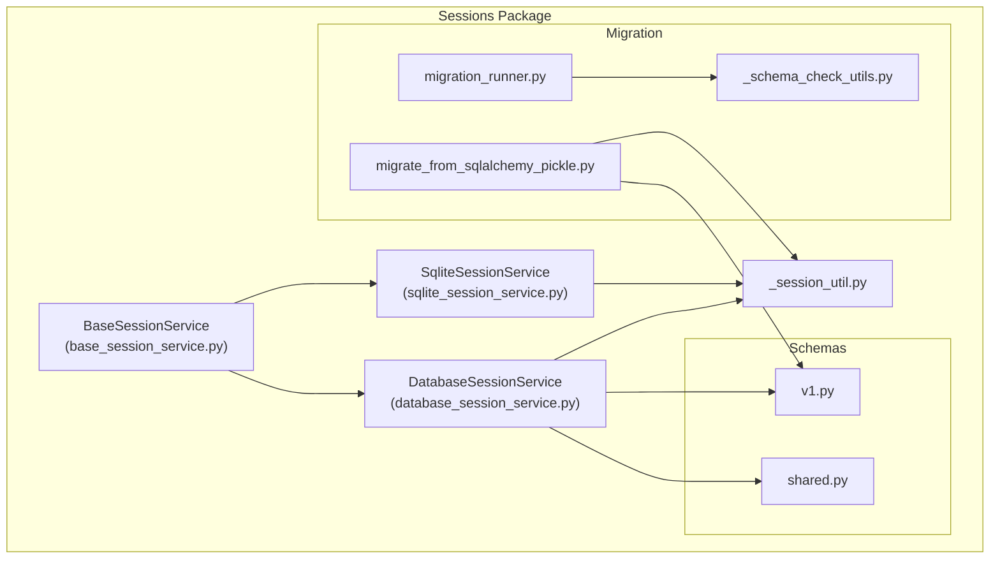
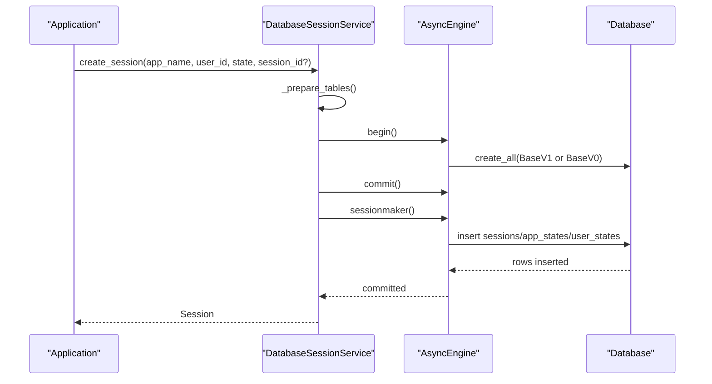
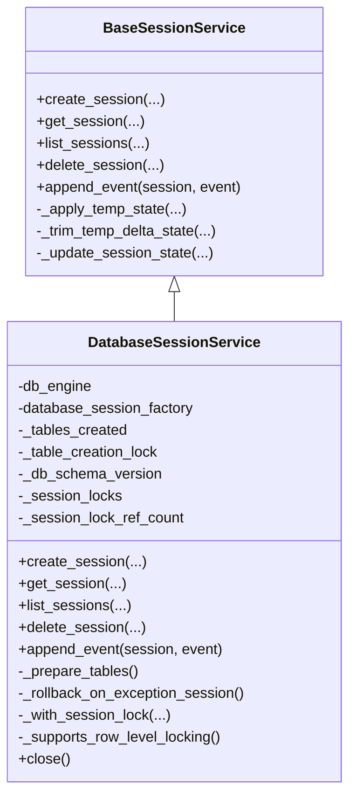
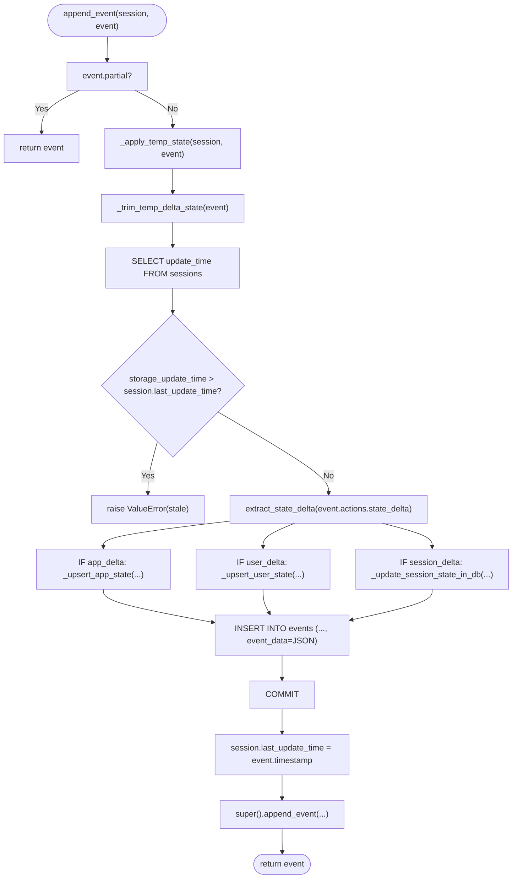
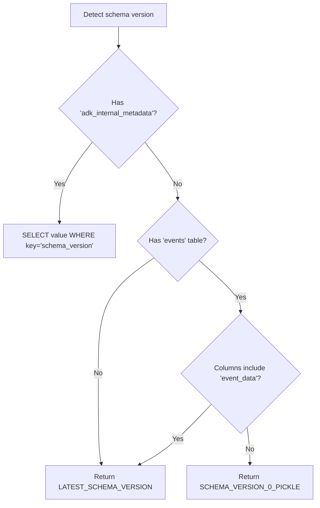
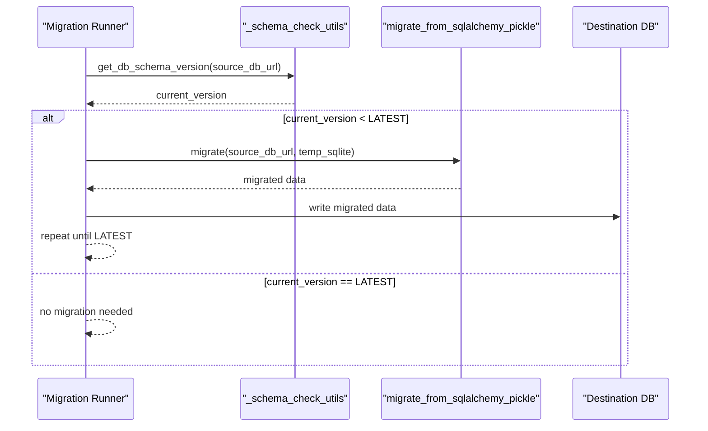
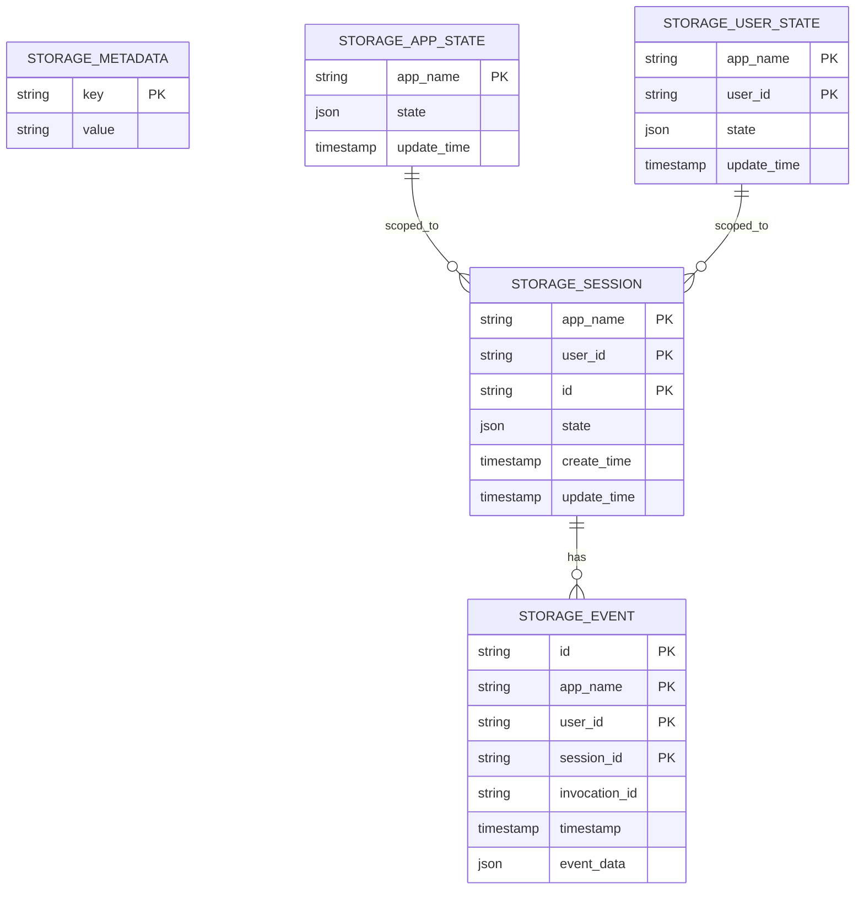
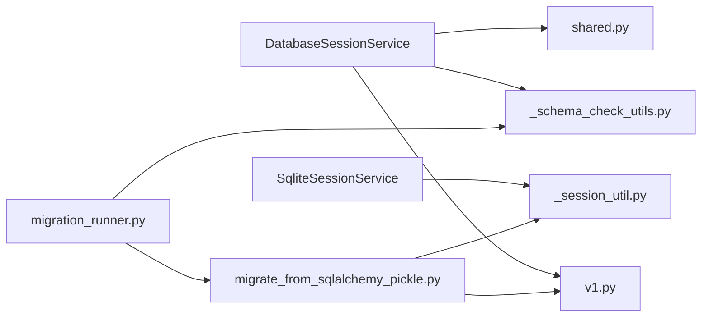

# Database Session Services

<cite>
**Referenced Files in This Document**
- [base_session_service.py](file://src/google/adk/sessions/base_session_service.py)
- [database_session_service.py](file://src/google/adk/sessions/database_session_service.py)
- [sqlite_session_service.py](file://src/google/adk/sessions/sqlite_session_service.py)
- [v1.py](file://src/google/adk/sessions/schemas/v1.py)
- [shared.py](file://src/google/adk/sessions/schemas/shared.py)
- [_schema_check_utils.py](file://src/google/adk/sessions/migration/_schema_check_utils.py)
- [migration_runner.py](file://src/google/adk/sessions/migration/migration_runner.py)
- [migrate_from_sqlalchemy_pickle.py](file://src/google/adk/sessions/migration/migrate_from_sqlalchemy_pickle.py)
- [_session_util.py](file://src/google/adk/sessions/_session_util.py)
- [db_migration.sh](file://scripts/db_migration.sh)
- [postgres_session_service README.md](file://contributing/samples/postgres_session_service/README.md)
- [migrate_session_db README.md](file://contributing/samples/migrate_session_db/README.md)
</cite>

## Table of Contents
1. [Introduction](#introduction)
2. [Project Structure](#project-structure)
3. [Core Components](#core-components)
4. [Architecture Overview](#architecture-overview)
5. [Detailed Component Analysis](#detailed-component-analysis)
6. [Dependency Analysis](#dependency-analysis)
7. [Performance Considerations](#performance-considerations)
8. [Troubleshooting Guide](#troubleshooting-guide)
9. [Conclusion](#conclusion)
10. [Appendices](#appendices)

## Introduction
This document explains the database-backed session services in ADK, focusing on the DatabaseSessionService abstract base class and its concrete implementations. It covers the SQLite implementation, schema handling, migration system, transaction and concurrency controls, database-specific optimizations, and operational guidance for production deployments.

## Project Structure
The database session services are organized under the sessions package with clear separation between:
- Base abstractions and common utilities
- Database-backed service using SQLAlchemy
- SQLite-backed service using aiosqlite
- Schemas for versioned persistence
- Migration utilities and scripts

**Diagram sources**
- [base_session_service.py](file://src/google/adk/sessions/base_session_service.py#L45-L154)
- [database_session_service.py](file://src/google/adk/sessions/database_session_service.py#L135-L661)
- [sqlite_session_service.py](file://src/google/adk/sessions/sqlite_session_service.py#L132-L596)
- [v1.py](file://src/google/adk/sessions/schemas/v1.py#L49-L248)
- [shared.py](file://src/google/adk/sessions/schemas/shared.py#L29-L68)
- [_schema_check_utils.py](file://src/google/adk/sessions/migration/_schema_check_utils.py#L32-L142)
- [migration_runner.py](file://src/google/adk/sessions/migration/migration_runner.py#L45-L128)
- [migrate_from_sqlalchemy_pickle.py](file://src/google/adk/sessions/migration/migrate_from_sqlalchemy_pickle.py#L166-L296)
- [_session_util.py](file://src/google/adk/sessions/_session_util.py#L37-L51)

**Section sources**
- [base_session_service.py](file://src/google/adk/sessions/base_session_service.py#L45-L154)
- [database_session_service.py](file://src/google/adk/sessions/database_session_service.py#L135-L661)
- [sqlite_session_service.py](file://src/google/adk/sessions/sqlite_session_service.py#L132-L596)
- [v1.py](file://src/google/adk/sessions/schemas/v1.py#L49-L248)
- [shared.py](file://src/google/adk/sessions/schemas/shared.py#L29-L68)
- [_schema_check_utils.py](file://src/google/adk/sessions/migration/_schema_check_utils.py#L32-L142)
- [migration_runner.py](file://src/google/adk/sessions/migration/migration_runner.py#L45-L128)
- [migrate_from_sqlalchemy_pickle.py](file://src/google/adk/sessions/migration/migrate_from_sqlalchemy_pickle.py#L166-L296)
- [_session_util.py](file://src/google/adk/sessions/_session_util.py#L37-L51)

## Core Components
- BaseSessionService: Defines the contract for session lifecycle operations (create, get, list, delete) and event appending with temp-state handling.
- DatabaseSessionService: Implements a database-backed session service using SQLAlchemy async engines, with schema detection, table creation, transactions, and concurrency controls.
- SqliteSessionService: Provides a SQLite-backed implementation using aiosqlite, with JSON serialization for events and atomic state upserts.
- Schemas v1: SQLAlchemy models for sessions, events, app/user states, and metadata with dynamic JSON and precise timestamps.
- Migration utilities: Tools to detect schema versions and migrate from legacy pickle-based event storage to JSON-based storage.

**Section sources**
- [base_session_service.py](file://src/google/adk/sessions/base_session_service.py#L45-L154)
- [database_session_service.py](file://src/google/adk/sessions/database_session_service.py#L135-L661)
- [sqlite_session_service.py](file://src/google/adk/sessions/sqlite_session_service.py#L132-L596)
- [v1.py](file://src/google/adk/sessions/schemas/v1.py#L49-L248)
- [_schema_check_utils.py](file://src/google/adk/sessions/migration/_schema_check_utils.py#L32-L142)

## Architecture Overview
The system separates concerns across layers:
- Abstraction: BaseSessionService defines the interface and temp-state semantics.
- Database implementation: DatabaseSessionService manages async SQLAlchemy engines, schema versioning, table creation, transactions, and per-session locking.
- SQLite implementation: SqliteSessionService encapsulates aiosqlite connections, JSON serialization, and atomic upserts.
- Schema layer: v1 models define tables, types, and relationships.
- Migration layer: Utilities detect schema versions and migrate legacy data to the current JSON-based schema.

**Diagram sources**
- [database_session_service.py](file://src/google/adk/sessions/database_session_service.py#L255-L311)
- [database_session_service.py](file://src/google/adk/sessions/database_session_service.py#L312-L390)
- [v1.py](file://src/google/adk/sessions/schemas/v1.py#L49-L248)

## Detailed Component Analysis

### DatabaseSessionService
DatabaseSessionService extends BaseSessionService and provides:
- Async SQLAlchemy engine creation with dialect-specific tuning (SQLite StaticPool, non-SQLite pool_pre_ping).
- Lazy table creation with schema version detection and metadata table initialization.
- Transaction management with a context manager that ensures rollback on exceptions.
- Per-session locks to serialize concurrent append_event calls within the same process.
- Row-level locking support for databases that support it (MariaDB, MySQL, PostgreSQL).
- State delta extraction and merging across app, user, and session scopes.
- Timezone-aware timestamp handling for SQLite vs. other dialects.

**Diagram sources**
- [base_session_service.py](file://src/google/adk/sessions/base_session_service.py#L45-L154)
- [database_session_service.py](file://src/google/adk/sessions/database_session_service.py#L135-L661)

**Section sources**
- [database_session_service.py](file://src/google/adk/sessions/database_session_service.py#L135-L661)
- [base_session_service.py](file://src/google/adk/sessions/base_session_service.py#L45-L154)

### SQLite Implementation (SqliteSessionService)
SqliteSessionService provides:
- URL/path parsing and normalization for SQLite URIs.
- Aiosqlite connection management with PRAGMA foreign_keys enabled.
- JSON serialization for event data and atomic upserts using json_patch for app/user/session states.
- Explicit schema creation SQL for app_states, user_states, sessions, and events with foreign key constraints.
- Migration detection to prevent accidental use of legacy schemas.

**Diagram sources**
- [sqlite_session_service.py](file://src/google/adk/sessions/sqlite_session_service.py#L360-L456)
- [_session_util.py](file://src/google/adk/sessions/_session_util.py#L37-L51)

**Section sources**
- [sqlite_session_service.py](file://src/google/adk/sessions/sqlite_session_service.py#L132-L596)
- [_session_util.py](file://src/google/adk/sessions/_session_util.py#L37-L51)

### Schema Handling and Versioning
- Schema detection: The system detects schema version by checking metadata table presence and column sets.
- Version 0 (legacy): Uses pickle-serialized event actions.
- Version 1 (current): Uses JSON serialization for event data and dynamic JSON types.
- Metadata table: Stores schema version for compatibility tracking.

**Diagram sources**
- [_schema_check_utils.py](file://src/google/adk/sessions/migration/_schema_check_utils.py#L32-L76)

**Section sources**
- [_schema_check_utils.py](file://src/google/adk/sessions/migration/_schema_check_utils.py#L32-L142)
- [v1.py](file://src/google/adk/sessions/schemas/v1.py#L55-L68)

### Migration System
- Migration runner: Applies sequential migrations from current version to latest, using temporary SQLite files for intermediate steps when crossing database types.
- Pickle-to-JSON migration: Converts legacy pickle-based event actions to JSON-based event_data, preserving state and relationships.
- Command-line usage: The migration runner can be invoked programmatically or via the provided shell script for Alembic-based upgrades.

**Diagram sources**
- [migration_runner.py](file://src/google/adk/sessions/migration/migration_runner.py#L45-L128)
- [_schema_check_utils.py](file://src/google/adk/sessions/migration/_schema_check_utils.py#L115-L142)
- [migrate_from_sqlalchemy_pickle.py](file://src/google/adk/sessions/migration/migrate_from_sqlalchemy_pickle.py#L166-L296)

**Section sources**
- [migration_runner.py](file://src/google/adk/sessions/migration/migration_runner.py#L45-L128)
- [migrate_from_sqlalchemy_pickle.py](file://src/google/adk/sessions/migration/migrate_from_sqlalchemy_pickle.py#L166-L296)
- [db_migration.sh](file://scripts/db_migration.sh#L1-L144)

### Data Models and Relationships
The v1 schema defines:
- sessions: app_name, user_id, id (primary key), state (JSON), timestamps.
- events: id, app_name, user_id, session_id (foreign key), invocation_id, timestamp, event_data (JSON).
- app_states: app_name (primary key), state (JSON), update_time.
- user_states: (app_name, user_id) (composite primary key), state (JSON), update_time.
- adk_internal_metadata: key, value for internal tracking.

**Diagram sources**
- [v1.py](file://src/google/adk/sessions/schemas/v1.py#L55-L248)
- [shared.py](file://src/google/adk/sessions/schemas/shared.py#L29-L68)

**Section sources**
- [v1.py](file://src/google/adk/sessions/schemas/v1.py#L49-L248)
- [shared.py](file://src/google/adk/sessions/schemas/shared.py#L29-L68)

## Dependency Analysis
- DatabaseSessionService depends on SQLAlchemy async engine, sessionmaker, and dialect-specific features. It also relies on schema classes and migration utilities for versioning.
- SqliteSessionService depends on aiosqlite and JSON serialization for event data.
- Both implementations depend on _session_util for state delta extraction and decoding helpers.
- Migration utilities depend on schema inspection and model definitions.

**Diagram sources**
- [database_session_service.py](file://src/google/adk/sessions/database_session_service.py#L41-L60)
- [sqlite_session_service.py](file://src/google/adk/sessions/sqlite_session_service.py#L32-L40)
- [v1.py](file://src/google/adk/sessions/schemas/v1.py#L41-L46)
- [shared.py](file://src/google/adk/sessions/schemas/shared.py#L18-L26)
- [_schema_check_utils.py](file://src/google/adk/sessions/migration/_schema_check_utils.py#L20-L26)
- [_session_util.py](file://src/google/adk/sessions/_session_util.py#L28-L35)
- [migration_runner.py](file://src/google/adk/sessions/migration/migration_runner.py#L23-L39)
- [migrate_from_sqlalchemy_pickle.py](file://src/google/adk/sessions/migration/migrate_from_sqlalchemy_pickle.py#L27-L36)

**Section sources**
- [database_session_service.py](file://src/google/adk/sessions/database_session_service.py#L41-L60)
- [sqlite_session_service.py](file://src/google/adk/sessions/sqlite_session_service.py#L32-L40)
- [_session_util.py](file://src/google/adk/sessions/_session_util.py#L28-L35)
- [migration_runner.py](file://src/google/adk/sessions/migration/migration_runner.py#L23-L39)
- [migrate_from_sqlalchemy_pickle.py](file://src/google/adk/sessions/migration/migrate_from_sqlalchemy_pickle.py#L27-L36)

## Performance Considerations
- Connection pooling and engine tuning:
  - Non-SQLite engines use pool_pre_ping for reliability.
  - SQLite in-memory (:memory:) uses StaticPool with check_same_thread disabled.
- Indexing and constraints:
  - Primary keys are defined on composite identifiers; foreign keys enforce referential integrity.
  - Additional indexes can be added based on application query patterns (e.g., timestamps, app_name filters).
- Serialization and storage:
  - JSONB on PostgreSQL and LONGTEXT on MySQL accommodate larger JSON payloads.
  - SQLite uses JSON patch semantics for atomic state merges.
- Concurrency:
  - Per-session asyncio locks serialize concurrent append_event calls within the same process.
  - Row-level locking is used for databases that support it to reduce contention.
- Timezone handling:
  - SQLite returns naive datetimes; conversions to UTC are handled explicitly for timestamp comparisons.

[No sources needed since this section provides general guidance]

## Troubleshooting Guide
- Schema version mismatch:
  - Use the migration runner to move from legacy pickle-based schemas to JSON-based schemas.
  - For Alembic-based upgrades, use the provided shell script to stamp and upgrade the database.
- Migration failures:
  - Ensure the destination URL is different from the source URL.
  - Clean up temporary Alembic artifacts before re-running.
- SQLite migration needed:
  - The SQLite service detects legacy schemas and raises an error instructing to run the migration command.
- Connection errors:
  - Verify database URL format and credentials.
  - For async drivers, ensure the correct dialect is used.

**Section sources**
- [migration_runner.py](file://src/google/adk/sessions/migration/migration_runner.py#L69-L89)
- [db_migration.sh](file://scripts/db_migration.sh#L42-L47)
- [sqlite_session_service.py](file://src/google/adk/sessions/sqlite_session_service.py#L145-L154)
- [database_session_service.py](file://src/google/adk/sessions/database_session_service.py#L162-L173)

## Conclusion
The database-backed session services in ADK provide robust, versioned persistence for sessions and events across multiple database backends. DatabaseSessionService offers scalable async operations with schema versioning and transaction safety, while SqliteSessionService delivers a lightweight, file-based option with JSON serialization and atomic state updates. The migration system ensures smooth transitions from legacy schemas, and operational guidance helps maintain reliability in production environments.

[No sources needed since this section summarizes without analyzing specific files]

## Appendices

### Configuration Examples and Deployment Scenarios
- PostgreSQL with DatabaseSessionService:
  - Use asyncpg driver with SQLAlchemy URL format.
  - Configure connection pooling and SSL/TLS for production.
  - Reference: [postgres_session_service README.md](file://contributing/samples/postgres_session_service/README.md#L83-L118)
- Alembic-based schema upgrades:
  - Use the provided shell script to initialize Alembic, stamp, autogenerate, and apply revisions.
  - Reference: [db_migration.sh](file://scripts/db_migration.sh#L1-L144)
- Migrating legacy SQLite databases:
  - Follow the sample’s instructions to run the migration script and resolve schema errors.
  - Reference: [migrate_session_db README.md](file://contributing/samples/migrate_session_db/README.md#L1-L55)

**Section sources**
- [postgres_session_service README.md](file://contributing/samples/postgres_session_service/README.md#L83-L118)
- [db_migration.sh](file://scripts/db_migration.sh#L1-L144)
- [migrate_session_db README.md](file://contributing/samples/migrate_session_db/README.md#L1-L55)