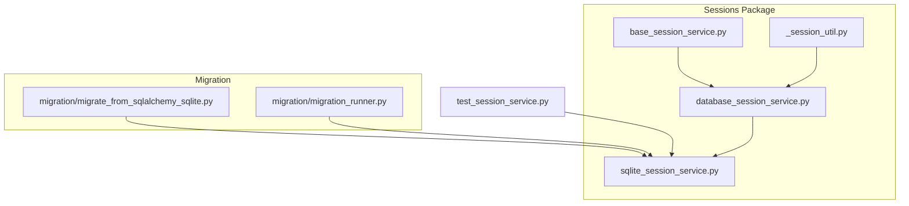
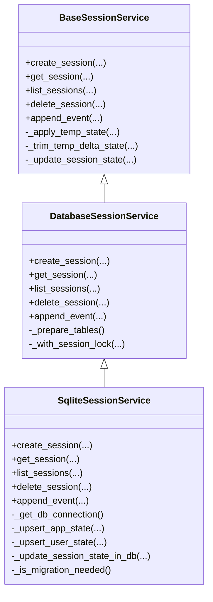
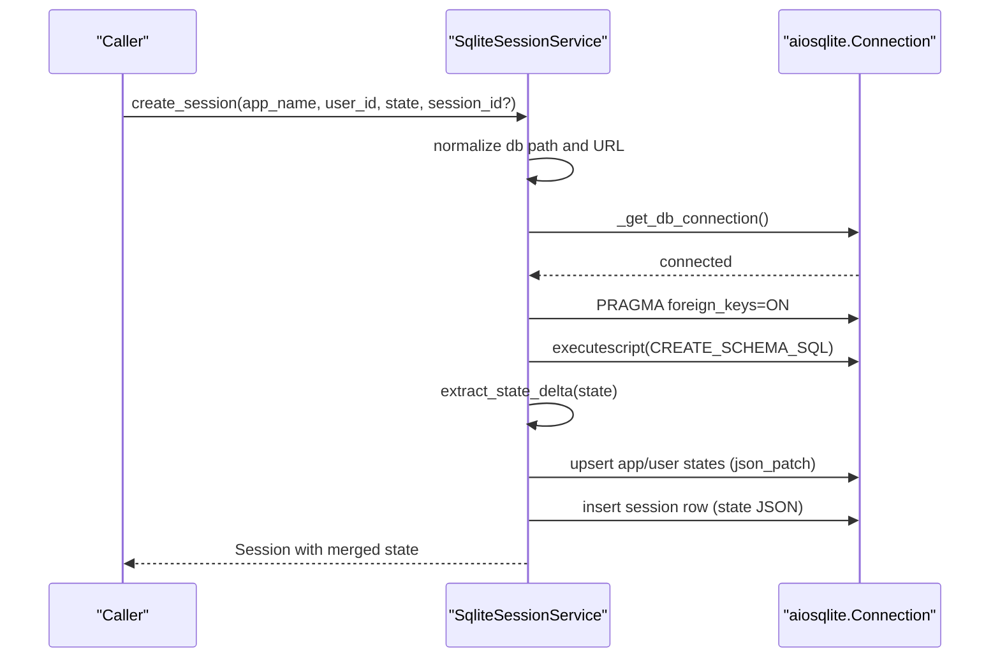
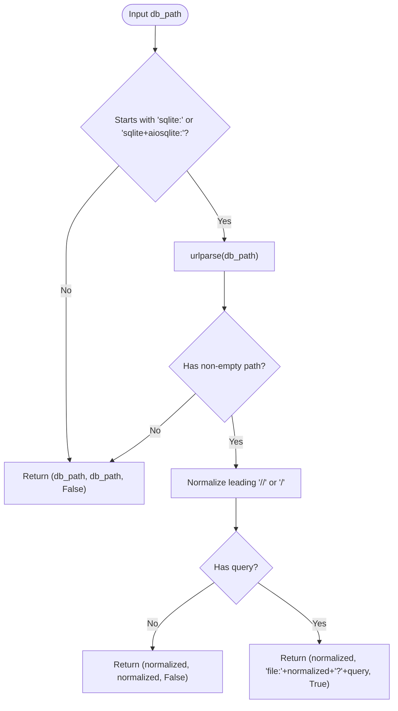
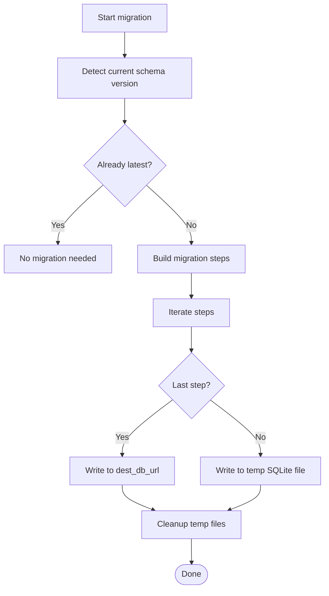
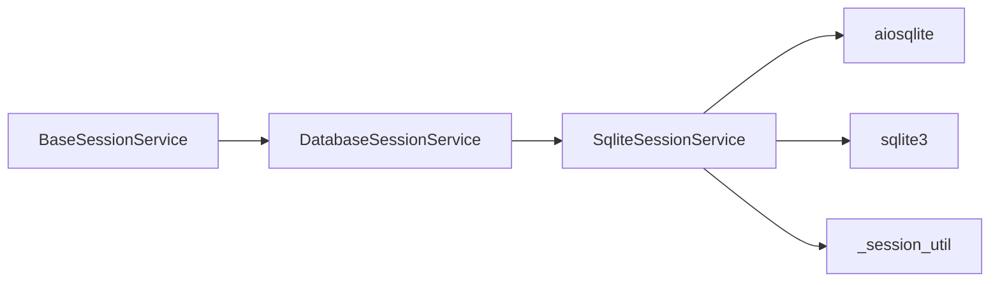

# SQLite Session Service

<cite>
**Referenced Files in This Document**
- [sqlite_session_service.py](file://src/google/adk/sessions/sqlite_session_service.py)
- [database_session_service.py](file://src/google/adk/sessions/database_session_service.py)
- [base_session_service.py](file://src/google/adk/sessions/base_session_service.py)
- [_session_util.py](file://src/google/adk/sessions/_session_util.py)
- [migrate_from_sqlalchemy_sqlite.py](file://src/google/adk/sessions/migration/migrate_from_sqlalchemy_sqlite.py)
- [migration_runner.py](file://src/google/adk/sessions/migration/migration_runner.py)
- [test_session_service.py](file://tests/unittests/sessions/test_session_service.py)
</cite>

## Table of Contents
1. [Introduction](#introduction)
2. [Project Structure](#project-structure)
3. [Core Components](#core-components)
4. [Architecture Overview](#architecture-overview)
5. [Detailed Component Analysis](#detailed-component-analysis)
6. [Dependency Analysis](#dependency-analysis)
7. [Performance Considerations](#performance-considerations)
8. [Troubleshooting Guide](#troubleshooting-guide)
9. [Conclusion](#conclusion)
10. [Appendices](#appendices)

## Introduction
This document explains the SQLite-based session service implementation in ADK. It focuses on how the SQLiteSessionService extends the DatabaseSessionService to provide file-based persistent storage for agent sessions using aiosqlite. It covers SQLite-specific configuration options, connection handling, PRAGMA settings, foreign key constraints, memory versus file-based databases, migration strategies, and practical configuration examples for development and production.

## Project Structure
The SQLite session service is part of the sessions package and builds upon shared abstractions:
- Base interface and common utilities define the contract and helpers.
- DatabaseSessionService provides a generic SQL-backed implementation using SQLAlchemy.
- SQLiteSessionService specializes the behavior for SQLite using aiosqlite and JSON columns for flexible event storage.
- Migration utilities support upgrading from older schemas.

**Diagram sources**
- [base_session_service.py](file://src/google/adk/sessions/base_session_service.py#L45-L154)
- [_session_util.py](file://src/google/adk/sessions/_session_util.py#L37-L51)
- [database_session_service.py](file://src/google/adk/sessions/database_session_service.py#L135-L661)
- [sqlite_session_service.py](file://src/google/adk/sessions/sqlite_session_service.py#L132-L596)
- [migrate_from_sqlalchemy_sqlite.py](file://src/google/adk/sessions/migration/migrate_from_sqlalchemy_sqlite.py#L34-L173)
- [migration_runner.py](file://src/google/adk/sessions/migration/migration_runner.py#L64-L127)
- [test_session_service.py](file://tests/unittests/sessions/test_session_service.py#L155-L192)

**Section sources**
- [sqlite_session_service.py](file://src/google/adk/sessions/sqlite_session_service.py#L132-L596)
- [database_session_service.py](file://src/google/adk/sessions/database_session_service.py#L135-L661)
- [base_session_service.py](file://src/google/adk/sessions/base_session_service.py#L45-L154)
- [_session_util.py](file://src/google/adk/sessions/_session_util.py#L37-L51)
- [migrate_from_sqlalchemy_sqlite.py](file://src/google/adk/sessions/migration/migrate_from_sqlalchemy_sqlite.py#L34-L173)
- [migration_runner.py](file://src/google/adk/sessions/migration/migration_runner.py#L64-L127)
- [test_session_service.py](file://tests/unittests/sessions/test_session_service.py#L155-L192)

## Core Components
- BaseSessionService defines the abstract interface for session management and common state handling utilities.
- DatabaseSessionService provides a generic SQL-backed implementation with connection pooling, schema preparation, and concurrency controls.
- SQLiteSessionService specializes the behavior for SQLite:
  - Uses aiosqlite for asynchronous connections.
  - Normalizes database paths and supports SQLite URL formats.
  - Enforces foreign key constraints via PRAGMA.
  - Creates tables on first use and merges app/user/session states.
  - Stores event data as JSON for schema flexibility.
  - Detects legacy schema and raises migration guidance.

Key SQLite-specific elements:
- Path normalization and URL parsing for SQLite and aiosqlite.
- PRAGMA foreign_keys activation.
- JSON-based state and event storage.
- Schema creation on first connection.

**Section sources**
- [base_session_service.py](file://src/google/adk/sessions/base_session_service.py#L45-L154)
- [database_session_service.py](file://src/google/adk/sessions/database_session_service.py#L135-L661)
- [sqlite_session_service.py](file://src/google/adk/sessions/sqlite_session_service.py#L96-L130)
- [sqlite_session_service.py](file://src/google/adk/sessions/sqlite_session_service.py#L458-L467)
- [sqlite_session_service.py](file://src/google/adk/sessions/sqlite_session_service.py#L88-L93)
- [sqlite_session_service.py](file://src/google/adk/sessions/sqlite_session_service.py#L557-L586)

## Architecture Overview
The SQLiteSessionService composes the base session operations with SQLite-specific persistence. It inherits the state merging and event handling logic from the base service while implementing SQLite-specific connection and schema management.

**Diagram sources**
- [base_session_service.py](file://src/google/adk/sessions/base_session_service.py#L45-L154)
- [database_session_service.py](file://src/google/adk/sessions/database_session_service.py#L135-L661)
- [sqlite_session_service.py](file://src/google/adk/sessions/sqlite_session_service.py#L132-L596)

## Detailed Component Analysis

### SQLiteSessionService
Responsibilities:
- Normalize database path from URL or filesystem path.
- Establish aiosqlite connection, set PRAGMA foreign_keys, and create schema on first use.
- Manage app/user/session state via JSON upserts and merges.
- Persist events as JSON and support filtering by timestamp and recent count.
- Detect legacy schema and guide migration.

Concurrency and isolation:
- Uses per-connection setup and executes schema creation once per connection acquisition.
- Does not implement per-process locking for event appends; relies on SQLite’s single-writer model and foreign key constraints for referential integrity.

**Diagram sources**
- [sqlite_session_service.py](file://src/google/adk/sessions/sqlite_session_service.py#L139-L228)
- [sqlite_session_service.py](file://src/google/adk/sessions/sqlite_session_service.py#L458-L467)
- [sqlite_session_service.py](file://src/google/adk/sessions/sqlite_session_service.py#L506-L555)

**Section sources**
- [sqlite_session_service.py](file://src/google/adk/sessions/sqlite_session_service.py#L132-L228)
- [sqlite_session_service.py](file://src/google/adk/sessions/sqlite_session_service.py#L458-L467)
- [sqlite_session_service.py](file://src/google/adk/sessions/sqlite_session_service.py#L506-L555)

### Path Handling and URL Parsing
The service accepts both filesystem paths and SQLite/aiosqlite URLs. It normalizes paths and preserves URI query parameters when constructing the connection string.

Behavior highlights:
- Recognizes sqlite: and sqlite+aiosqlite: prefixes.
- Converts SQLAlchemy-style relative and absolute paths.
- Preserves query parameters (e.g., mode=ro) by passing uri=True when needed.

**Diagram sources**
- [sqlite_session_service.py](file://src/google/adk/sessions/sqlite_session_service.py#L96-L129)

**Section sources**
- [sqlite_session_service.py](file://src/google/adk/sessions/sqlite_session_service.py#L96-L129)
- [test_session_service.py](file://tests/unittests/sessions/test_session_service.py#L155-L192)

### Foreign Keys and PRAGMA Settings
SQLiteSessionService ensures referential integrity by enabling foreign keys at connection time and creating schema with foreign key constraints on the events table.

- PRAGMA foreign_keys is executed on each connection.
- Events table references sessions with ON DELETE CASCADE.
- Legacy schema detection prevents accidental writes to outdated schemas.

**Section sources**
- [sqlite_session_service.py](file://src/google/adk/sessions/sqlite_session_service.py#L43-L87)
- [sqlite_session_service.py](file://src/google/adk/sessions/sqlite_session_service.py#L465-L467)
- [sqlite_session_service.py](file://src/google/adk/sessions/sqlite_session_service.py#L557-L586)

### State Upserts and Merging
State is stored as JSON and updated atomically using json_patch semantics:
- App state: per-app JSON blob updated via INSERT ... ON CONFLICT.
- User state: per-(app,user) JSON blob updated similarly.
- Session state: per-(app,user,session) JSON blob updated via direct patch.

Merging logic combines app, user, and session states for responses.

**Section sources**
- [sqlite_session_service.py](file://src/google/adk/sessions/sqlite_session_service.py#L506-L555)
- [sqlite_session_service.py](file://src/google/adk/sessions/sqlite_session_service.py#L588-L596)
- [_session_util.py](file://src/google/adk/sessions/_session_util.py#L37-L51)

### Event Storage and Retrieval
Events are stored as JSON blobs to accommodate evolving schemas. Queries support:
- Filtering by session.
- Optional after_timestamp.
- Optional limit on recent events.
- Ordering by timestamp descending.

**Section sources**
- [sqlite_session_service.py](file://src/google/adk/sessions/sqlite_session_service.py#L231-L291)

### Migration Considerations
Legacy schema detection triggers explicit migration guidance. The migration utilities convert from SQLAlchemy-based SQLite to the new JSON-based schema.

- Detection checks for presence of events table and event_data column.
- Migration script copies app_states, user_states, sessions, and events into new schema.
- Migration runner coordinates multi-step migrations and temporary files.

**Diagram sources**
- [migration_runner.py](file://src/google/adk/sessions/migration/migration_runner.py#L64-L127)
- [migrate_from_sqlalchemy_sqlite.py](file://src/google/adk/sessions/migration/migrate_from_sqlalchemy_sqlite.py#L34-L148)

**Section sources**
- [sqlite_session_service.py](file://src/google/adk/sessions/sqlite_session_service.py#L557-L586)
- [migration_runner.py](file://src/google/adk/sessions/migration/migration_runner.py#L64-L127)
- [migrate_from_sqlalchemy_sqlite.py](file://src/google/adk/sessions/migration/migrate_from_sqlalchemy_sqlite.py#L34-L148)

## Dependency Analysis
- SQLiteSessionService depends on:
  - BaseSessionService for state handling and event append semantics.
  - aiosqlite for asynchronous connections.
  - sqlite3 for legacy schema checks.
  - Internal utilities for state extraction and merging.

- DatabaseSessionService (generic) depends on SQLAlchemy for ORM and connection pooling.

**Diagram sources**
- [base_session_service.py](file://src/google/adk/sessions/base_session_service.py#L45-L154)
- [database_session_service.py](file://src/google/adk/sessions/database_session_service.py#L135-L661)
- [sqlite_session_service.py](file://src/google/adk/sessions/sqlite_session_service.py#L132-L596)
- [_session_util.py](file://src/google/adk/sessions/_session_util.py#L37-L51)

**Section sources**
- [sqlite_session_service.py](file://src/google/adk/sessions/sqlite_session_service.py#L132-L596)
- [database_session_service.py](file://src/google/adk/sessions/database_session_service.py#L135-L661)
- [base_session_service.py](file://src/google/adk/sessions/base_session_service.py#L45-L154)
- [_session_util.py](file://src/google/adk/sessions/_session_util.py#L37-L51)

## Performance Considerations
- Connection model:
  - SQLiteSessionService uses aiosqlite per-operation connections without a persistent pool. This simplifies concurrency and avoids pool contention but may incur overhead for very high QPS.
- Concurrency:
  - SQLite’s single-writer model and foreign keys provide strong consistency. There is no per-process locking for event appends in SQLiteSessionService; rely on SQLite’s atomic write semantics.
- Indexing:
  - The default schema includes primary keys. Consider adding indexes on frequently queried columns (e.g., timestamps) if query patterns grow.
- Memory vs file:
  - File-based databases persist across restarts and support larger datasets. In-memory databases (e.g., :memory:) are suitable for isolated tests or ephemeral workloads.
- JSON storage:
  - JSON columns offer schema flexibility but may increase storage and reduce index efficiency compared to normalized relational columns.

[No sources needed since this section provides general guidance]

## Troubleshooting Guide
Common issues and resolutions:
- Legacy schema detected:
  - The service raises a runtime error guiding to run the migration script to upgrade the schema.
- Read-only database:
  - When URI query parameters imply read-only mode, schema creation fails. Adjust the URI to allow writes.
- Stale session timestamps:
  - Appending events validates that the provided last_update_time is not older than storage; refresh the session before appending.

Validation references:
- Migration guidance and error messages.
- URI query parameter preservation tests.
- Read-only mode enforcement tests.

**Section sources**
- [sqlite_session_service.py](file://src/google/adk/sessions/sqlite_session_service.py#L145-L154)
- [sqlite_session_service.py](file://src/google/adk/sessions/sqlite_session_service.py#L372-L387)
- [test_session_service.py](file://tests/unittests/sessions/test_session_service.py#L169-L182)

## Conclusion
The SQLiteSessionService provides a robust, file-based session persistence layer tailored for SQLite. It leverages aiosqlite for asynchronous operations, enforces referential integrity via PRAGMA and foreign keys, and stores state and events as JSON for flexibility. Migration utilities facilitate upgrades from legacy schemas. For high-throughput scenarios, consider tuning indexing and evaluating connection strategies aligned with workload characteristics.

[No sources needed since this section summarizes without analyzing specific files]

## Appendices

### Practical Configuration Examples
- Development (relative path):
  - Use a relative path or sqlite:///./sessions.db.
- Production (absolute path):
  - Use sqlite+aiosqlite:////absolute/path/to/sessions.db.
- Read-only mode:
  - Append ?mode=ro to the URI; note that schema creation will fail.
- Absolute URL:
  - Use sqlite+aiosqlite://// followed by the absolute path.

References:
- URL acceptance and absolute path tests.

**Section sources**
- [test_session_service.py](file://tests/unittests/sessions/test_session_service.py#L155-L192)

### Best Practices for Large Datasets
- Monitor database file growth and implement periodic maintenance.
- Add indexes on timestamp and session identifiers if queries become frequent.
- Prefer file-based databases for durability and scalability over in-memory databases.
- Use migration tools to keep schemas current and leverage JSON flexibility.

[No sources needed since this section provides general guidance]

### Migration Between SQLite Versions
- Use the migration runner to move across schema versions.
- For SQLAlchemy SQLite to new JSON schema, use the migration script to copy data into the new tables.
- Always back up the database before migration and verify the new schema post-migration.

**Section sources**
- [migration_runner.py](file://src/google/adk/sessions/migration/migration_runner.py#L64-L127)
- [migrate_from_sqlalchemy_sqlite.py](file://src/google/adk/sessions/migration/migrate_from_sqlalchemy_sqlite.py#L34-L148)