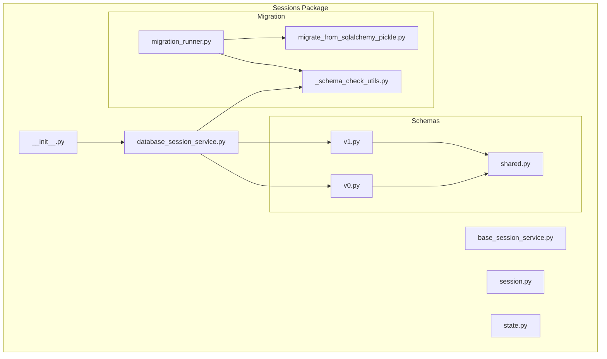
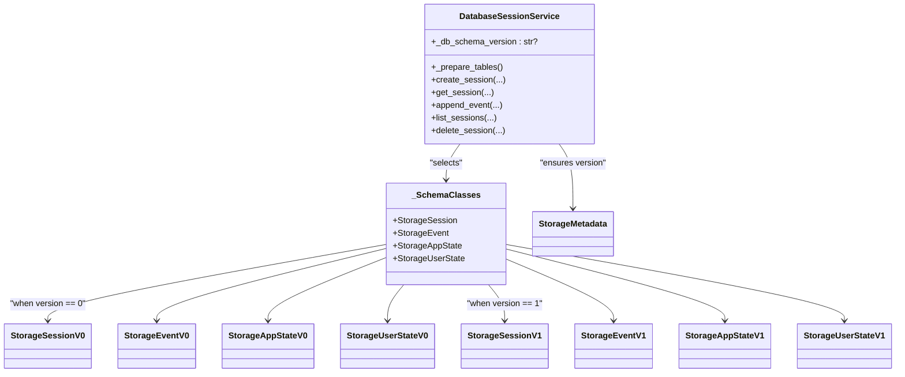
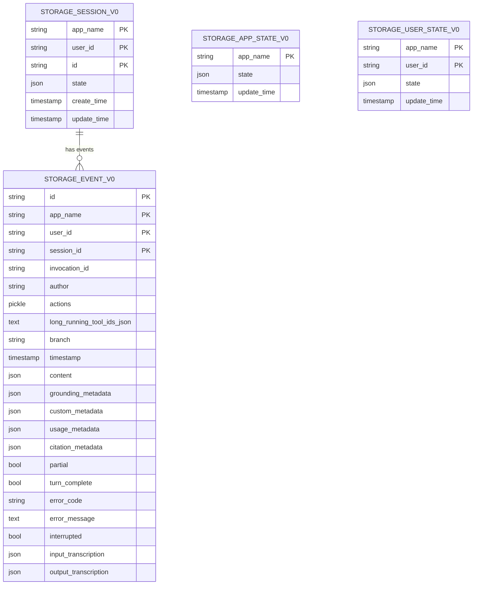
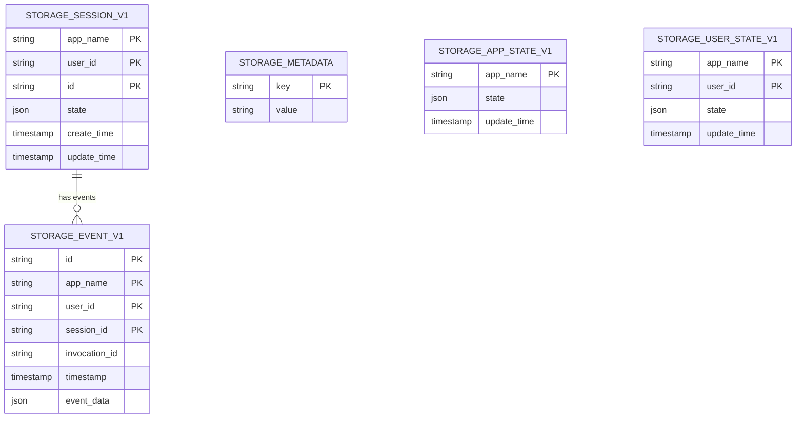
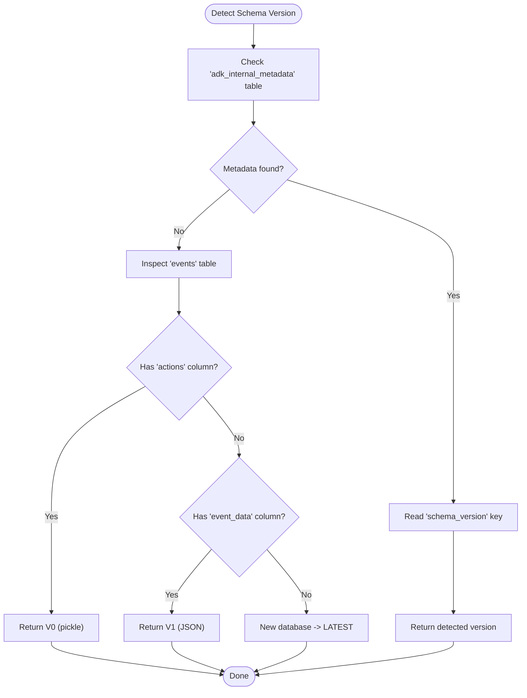
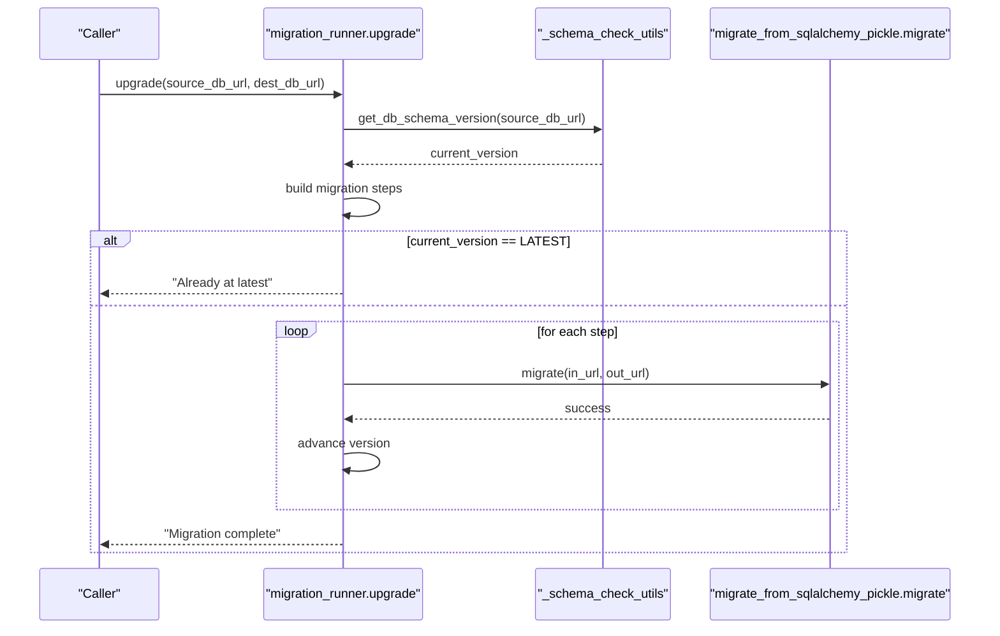
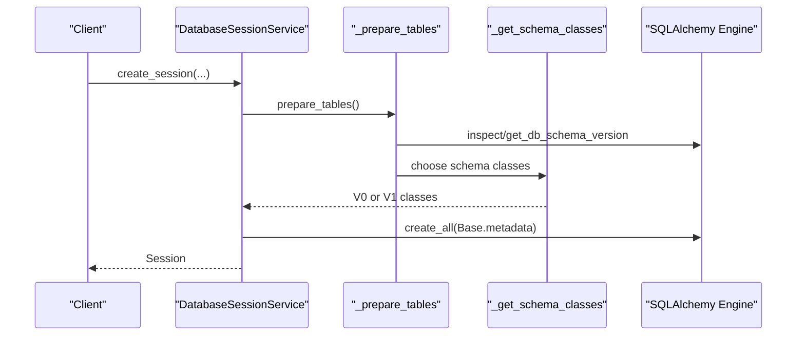
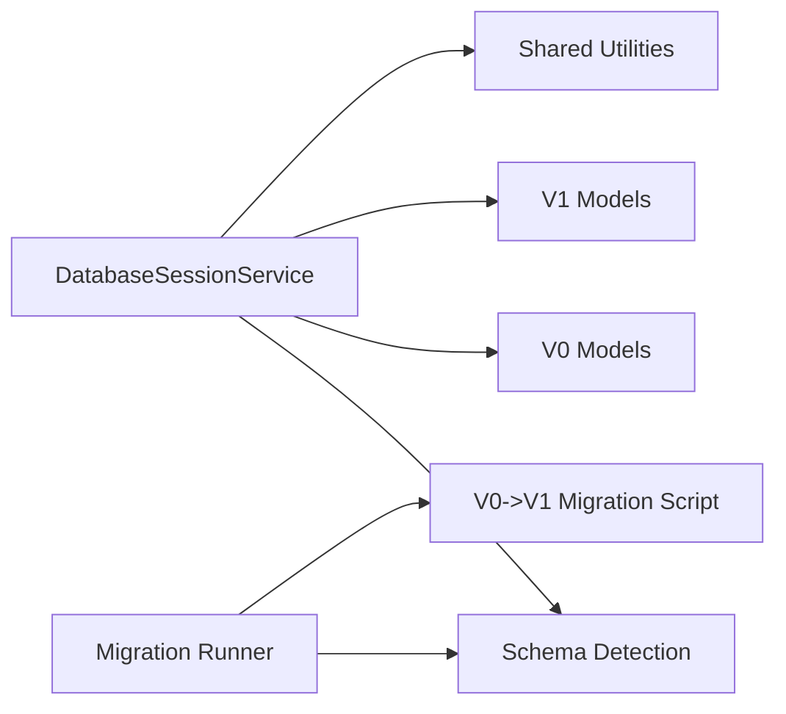

# Session Schema Management

<cite>
**Referenced Files in This Document**
- [__init__.py](file://src/google/adk/sessions/__init__.py)
- [base_session_service.py](file://src/google/adk/sessions/base_session_service.py)
- [database_session_service.py](file://src/google/adk/sessions/database_session_service.py)
- [session.py](file://src/google/adk/sessions/session.py)
- [state.py](file://src/google/adk/sessions/state.py)
- [v0.py](file://src/google/adk/sessions/schemas/v0.py)
- [v1.py](file://src/google/adk/sessions/schemas/v1.py)
- [shared.py](file://src/google/adk/sessions/schemas/shared.py)
- [_schema_check_utils.py](file://src/google/adk/sessions/migration/_schema_check_utils.py)
- [migration_runner.py](file://src/google/adk/sessions/migration/migration_runner.py)
- [migrate_from_sqlalchemy_pickle.py](file://src/google/adk/sessions/migration/migrate_from_sqlalchemy_pickle.py)
- [test_session_service.py](file://tests/unittests/sessions/test_session_service.py)
</cite>

## Table of Contents
1. [Introduction](#introduction)
2. [Project Structure](#project-structure)
3. [Core Components](#core-components)
4. [Architecture Overview](#architecture-overview)
5. [Detailed Component Analysis](#detailed-component-analysis)
6. [Dependency Analysis](#dependency-analysis)
7. [Performance Considerations](#performance-considerations)
8. [Troubleshooting Guide](#troubleshooting-guide)
9. [Conclusion](#conclusion)

## Introduction
This document explains session schema management and versioning in the ADK. It covers the evolution from V0 to V1 schema versions, including field changes, data type modifications, and structural improvements. It documents the schema detection mechanism, automatic version migration processes, the migration runner functionality, schema validation checks, and backward compatibility considerations. It also details the StorageSession, StorageAppState, StorageUserState, and StorageEvent model definitions for both schema versions, along with examples of schema evolution scenarios, migration timing, and rollback procedures. Finally, it addresses schema version detection logic, metadata storage, and the relationship between schema versions and database dialects.

## Project Structure
The session schema management is organized around:
- Schema definitions for V0 and V1
- Shared utilities for JSON and timestamp handling
- Database session service that selects the appropriate schema at runtime
- Migration utilities to detect schema versions and upgrade from V0 to V1
- Tests validating behavior across schema versions and dialects

**Diagram sources**
- [__init__.py](file://src/google/adk/sessions/__init__.py#L14-L42)
- [database_session_service.py](file://src/google/adk/sessions/database_session_service.py#L48-L59)
- [v0.py](file://src/google/adk/sessions/schemas/v0.py#L92-L387)
- [v1.py](file://src/google/adk/sessions/schemas/v1.py#L49-L248)
- [shared.py](file://src/google/adk/sessions/schemas/shared.py#L29-L68)
- [_schema_check_utils.py](file://src/google/adk/sessions/migration/_schema_check_utils.py#L26-L142)
- [migration_runner.py](file://src/google/adk/sessions/migration/migration_runner.py#L34-L128)
- [migrate_from_sqlalchemy_pickle.py](file://src/google/adk/sessions/migration/migrate_from_sqlalchemy_pickle.py#L166-L296)

**Section sources**
- [__init__.py](file://src/google/adk/sessions/__init__.py#L14-L42)
- [database_session_service.py](file://src/google/adk/sessions/database_session_service.py#L138-L195)

## Core Components
- Session model: Pydantic model representing a series of interactions with camelCase field names and strict validation.
- State wrapper: Manages current and pending-commit state deltas with prefix-based scoping for app/user/temp state.
- DatabaseSessionService: Asynchronous service that lazily prepares tables, detects schema version, and routes operations to V0 or V1 models.
- Schema classes selector: Chooses StorageSession, StorageEvent, StorageAppState, and StorageUserState based on detected schema version.
- Migration utilities: Detect schema version via metadata table or fallback inspection, and upgrade from V0 to V1.

**Section sources**
- [session.py](file://src/google/adk/sessions/session.py#L27-L51)
- [state.py](file://src/google/adk/sessions/state.py#L20-L82)
- [database_session_service.py](file://src/google/adk/sessions/database_session_service.py#L196-L198)
- [_schema_check_utils.py](file://src/google/adk/sessions/migration/_schema_check_utils.py#L26-L77)

## Architecture Overview
The system dynamically selects schema classes at runtime based on detected schema version. The V0 schema uses pickle serialization for event actions, while V1 consolidates event data into a single JSON field. A dedicated metadata table stores the schema version for future-proofing.

**Diagram sources**
- [database_session_service.py](file://src/google/adk/sessions/database_session_service.py#L196-L198)
- [v0.py](file://src/google/adk/sessions/schemas/v0.py#L98-L387)
- [v1.py](file://src/google/adk/sessions/schemas/v1.py#L70-L248)
- [_schema_check_utils.py](file://src/google/adk/sessions/migration/_schema_check_utils.py#L26-L29)

## Detailed Component Analysis

### Schema Evolution: V0 to V1
- V0 schema:
  - Uses pickle serialization for event actions via a specialized type decorator.
  - Stores event fields (content, grounding_metadata, usage_metadata, etc.) as separate JSON columns.
  - Has an events table with an actions column and long-running tool IDs serialized as JSON text.
- V1 schema:
  - Introduces a consolidated event_data JSON column for the entire Event payload.
  - Adds an adk_internal_metadata table to track schema_version.
  - Improves foreign key cascading and timestamp handling across dialects.
  - Removes pickle dependency for event data.

**Diagram sources**
- [v0.py](file://src/google/adk/sessions/schemas/v0.py#L98-L387)

**Diagram sources**
- [v1.py](file://src/google/adk/sessions/schemas/v1.py#L70-L248)

**Section sources**
- [v0.py](file://src/google/adk/sessions/schemas/v0.py#L14-L25)
- [v1.py](file://src/google/adk/sessions/schemas/v1.py#L15-L22)
- [v0.py](file://src/google/adk/sessions/schemas/v0.py#L197-L351)
- [v1.py](file://src/google/adk/sessions/schemas/v1.py#L175-L213)

### Schema Detection Mechanism
- Metadata table check: If the adk_internal_metadata table exists, read the schema_version key.
- Fallback inspection: If not present, inspect the events table for presence of actions (V0) vs absence of event_data (V1).
- Latest version: If neither metadata nor legacy table is found, assume the latest schema.

**Diagram sources**
- [_schema_check_utils.py](file://src/google/adk/sessions/migration/_schema_check_utils.py#L32-L77)

**Section sources**
- [_schema_check_utils.py](file://src/google/adk/sessions/migration/_schema_check_utils.py#L26-L77)

### Automatic Migration Runner
- Migration map: Defines transitions from V0 (pickle) to V1 (JSON).
- Upgrade pipeline: Iteratively applies migration steps, using temporary SQLite files for intermediate steps when needed.
- Safety: Enforces separate source and destination URLs; cleans up temporary files; logs progress and errors.

**Diagram sources**
- [migration_runner.py](file://src/google/adk/sessions/migration/migration_runner.py#L45-L128)
- [_schema_check_utils.py](file://src/google/adk/sessions/migration/_schema_check_utils.py#L115-L142)
- [migrate_from_sqlalchemy_pickle.py](file://src/google/adk/sessions/migration/migrate_from_sqlalchemy_pickle.py#L166-L296)

**Section sources**
- [migration_runner.py](file://src/google/adk/sessions/migration/migration_runner.py#L28-L128)
- [migrate_from_sqlalchemy_pickle.py](file://src/google/adk/sessions/migration/migrate_from_sqlalchemy_pickle.py#L166-L296)

### DatabaseSessionService Runtime Behavior
- Lazy table preparation: Detects schema version and creates appropriate tables on first use.
- Schema class selection: Uses _SchemaClasses to route to V0 or V1 models.
- Timestamp handling: Strips timezone for SQLite and PostgreSQL to avoid dialect-specific errors.
- Row-level locking: Enables SELECT ... FOR UPDATE for MySQL/MariaDB/PostgreSQL when applying state deltas.
- Event conversion: Converts between Event and StorageEvent using model_dump/exclude_none and JSON serialization.

**Diagram sources**
- [database_session_service.py](file://src/google/adk/sessions/database_session_service.py#L255-L311)
- [database_session_service.py](file://src/google/adk/sessions/database_session_service.py#L196-L198)

**Section sources**
- [database_session_service.py](file://src/google/adk/sessions/database_session_service.py#L138-L311)

### Model Definitions and Data Types

#### V0 Models
- StorageSession: Primary keys include app_name, user_id, id; state stored as JSON; timestamps with microsecond precision; relationship to events.
- StorageEvent: Separate JSON columns for content, grounding_metadata, usage_metadata, citation_metadata, input_transcription, output_transcription; actions stored as pickle; long-running tool IDs as JSON text.
- StorageAppState/UserState: JSON state with update_time.

**Section sources**
- [v0.py](file://src/google/adk/sessions/schemas/v0.py#L98-L177)
- [v0.py](file://src/google/adk/sessions/schemas/v0.py#L179-L351)
- [v0.py](file://src/google/adk/sessions/schemas/v0.py#L354-L387)

#### V1 Models
- StorageSession: Same primary keys and state; improved cascade behavior for events; timestamp handling aligned with dialects.
- StorageEvent: Consolidated event_data JSON column; simplified schema with unified event representation.
- StorageMetadata: adk_internal_metadata table to store schema_version.
- StorageAppState/UserState: Same structure as V0.

**Section sources**
- [v1.py](file://src/google/adk/sessions/schemas/v1.py#L70-L151)
- [v1.py](file://src/google/adk/sessions/schemas/v1.py#L153-L213)
- [v1.py](file://src/google/adk/sessions/schemas/v1.py#L55-L68)
- [v1.py](file://src/google/adk/sessions/schemas/v1.py#L215-L248)

### Validation and Backward Compatibility
- Validation: Session model enforces strict field validation and camelCase aliasing.
- Backward compatibility: V1 migration preserves all event semantics by serializing Event into event_data; V0 events are reconstructed with robust decoding and defaults.
- State handling: Prefix-based state scoping (app:, user:, temp:) remains consistent across versions.

**Section sources**
- [session.py](file://src/google/adk/sessions/session.py#L30-L36)
- [state.py](file://src/google/adk/sessions/state.py#L23-L26)
- [migrate_from_sqlalchemy_pickle.py](file://src/google/adk/sessions/migration/migrate_from_sqlalchemy_pickle.py#L54-L147)

### Examples of Schema Evolution Scenarios
- From V0 to V1: Migrate sessions, app_states, user_states, and events; consolidate event fields into event_data; write schema_version metadata.
- Migration timing: Run offline or during maintenance windows; runner supports multi-step migrations via temporary SQLite intermediates.
- Rollback procedures: Not provided in code; recommended approach is to keep V0 data intact and maintain both schema versions during transition.

**Section sources**
- [migration_runner.py](file://src/google/adk/sessions/migration/migration_runner.py#L45-L128)
- [migrate_from_sqlalchemy_pickle.py](file://src/google/adk/sessions/migration/migrate_from_sqlalchemy_pickle.py#L166-L296)

### Relationship Between Schema Versions and Database Dialects
- DynamicJSON: Uses JSONB for PostgreSQL, LONGTEXT for MySQL, TEXT for others; ensures portable JSON storage.
- PreciseTimestamp: Uses MySQL DATETIME with microseconds when applicable; otherwise standard DateTime.
- Timezone handling: Strips timezone for SQLite and PostgreSQL to avoid dialect-specific errors; preserves for dialects supporting timezone.

**Section sources**
- [shared.py](file://src/google/adk/sessions/schemas/shared.py#L29-L68)
- [database_session_service.py](file://src/google/adk/sessions/database_session_service.py#L369-L371)

## Dependency Analysis
- DatabaseSessionService depends on:
  - Schema detection utilities for version resolution
  - V0/V1 SQLAlchemy models for table creation and queries
  - Shared JSON/timestamp decorators for cross-dialect compatibility
- Migration runner depends on:
  - Schema detection utilities to compute migration path
  - Migration script for V0-to-V1 transformation

**Diagram sources**
- [database_session_service.py](file://src/google/adk/sessions/database_session_service.py#L47-L59)
- [shared.py](file://src/google/adk/sessions/schemas/shared.py#L29-L68)
- [_schema_check_utils.py](file://src/google/adk/sessions/migration/_schema_check_utils.py#L26-L77)
- [migration_runner.py](file://src/google/adk/sessions/migration/migration_runner.py#L34-L42)
- [migrate_from_sqlalchemy_pickle.py](file://src/google/adk/sessions/migration/migrate_from_sqlalchemy_pickle.py#L166-L296)

**Section sources**
- [database_session_service.py](file://src/google/adk/sessions/database_session_service.py#L47-L59)
- [migration_runner.py](file://src/google/adk/sessions/migration/migration_runner.py#L34-L42)

## Performance Considerations
- JSON vs Pickle: V1 consolidates event data into a single JSON column, reducing schema complexity and improving portability compared to V0’s scattered JSON columns and pickle actions.
- Timestamp handling: Avoids timezone-aware timestamps for SQLite and PostgreSQL to prevent conversion overhead and errors.
- Connection pooling: Enables pool_pre_ping for non-SQLite dialects by default to improve reliability.

**Section sources**
- [shared.py](file://src/google/adk/sessions/schemas/shared.py#L29-L68)
- [database_session_service.py](file://src/google/adk/sessions/database_session_service.py#L68-L156)

## Troubleshooting Guide
- Schema version detection failures: Verify adk_internal_metadata exists and contains schema_version; if missing, ensure events table inspection succeeds; otherwise treat as new database.
- Migration errors: Check source/destination URLs differ; confirm temporary SQLite files are writable; review logs for specific failure points.
- State consistency: Ensure app_states and user_states exist before appending events; otherwise, operations will raise errors indicating missing state rows.
- Dialect-specific issues: Confirm timezone stripping for SQLite/PostgreSQL; adjust connection parameters if needed.

**Section sources**
- [_schema_check_utils.py](file://src/google/adk/sessions/migration/_schema_check_utils.py#L115-L142)
- [migration_runner.py](file://src/google/adk/sessions/migration/migration_runner.py#L69-L94)
- [test_session_service.py](file://tests/unittests/sessions/test_session_service.py#L686-L737)

## Conclusion
ADK’s session schema management cleanly evolves from V0 to V1 by consolidating event data into JSON, eliminating pickle dependencies, and introducing a metadata table for schema versioning. The DatabaseSessionService dynamically selects schema classes at runtime, ensuring backward compatibility and smooth migration. Migration utilities provide a robust upgrade path, while shared utilities ensure cross-dialect compatibility. Together, these mechanisms deliver a maintainable, extensible session persistence layer.