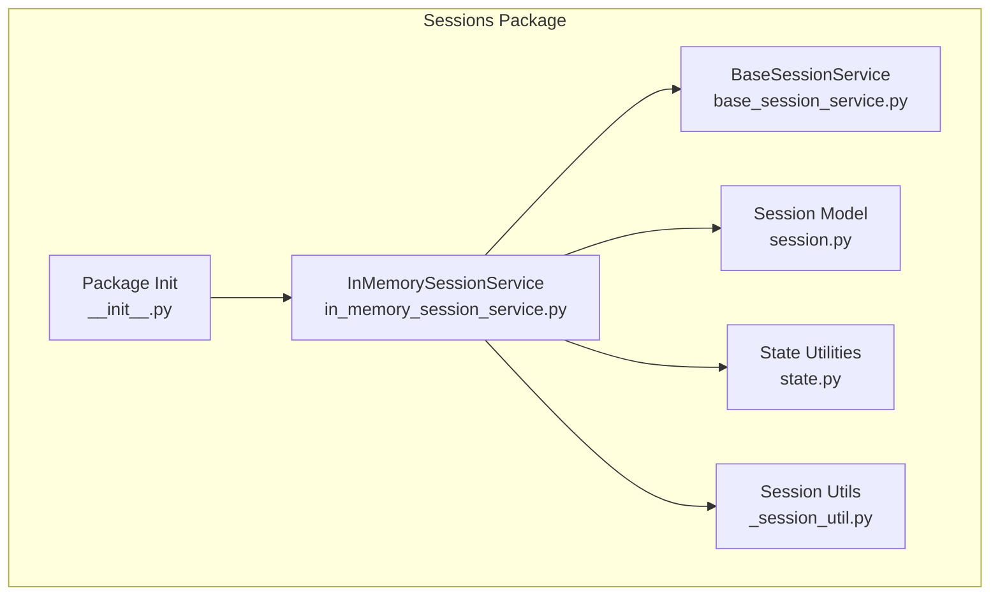
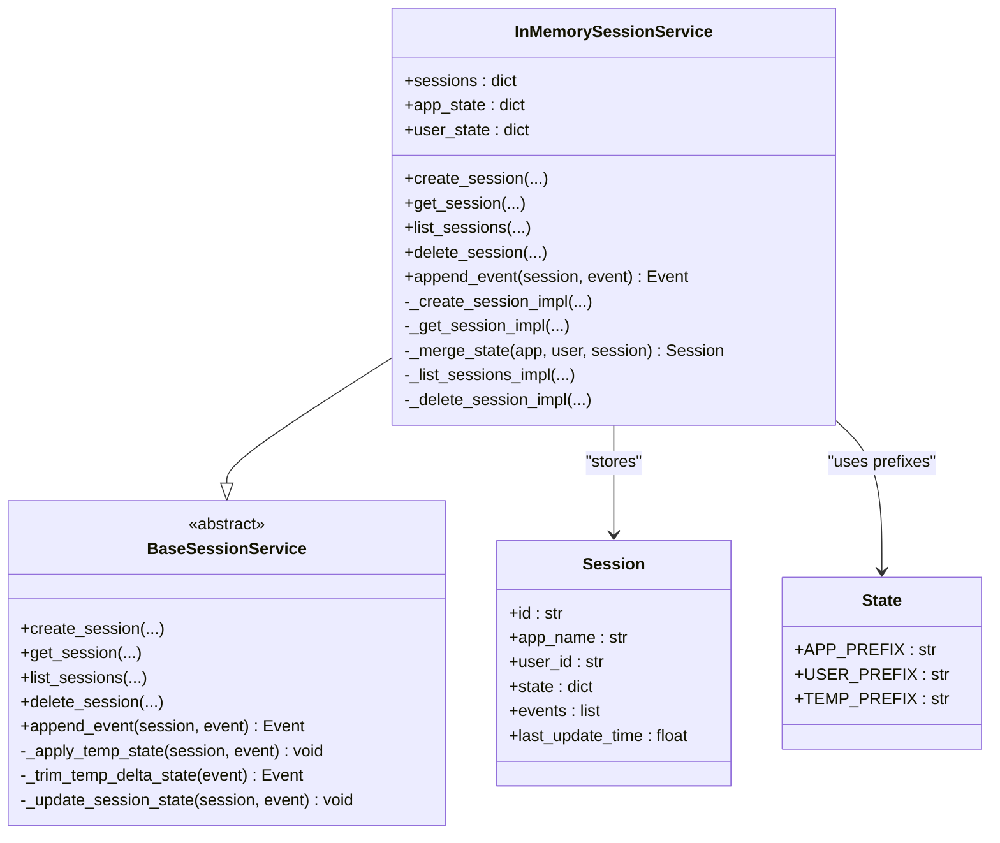
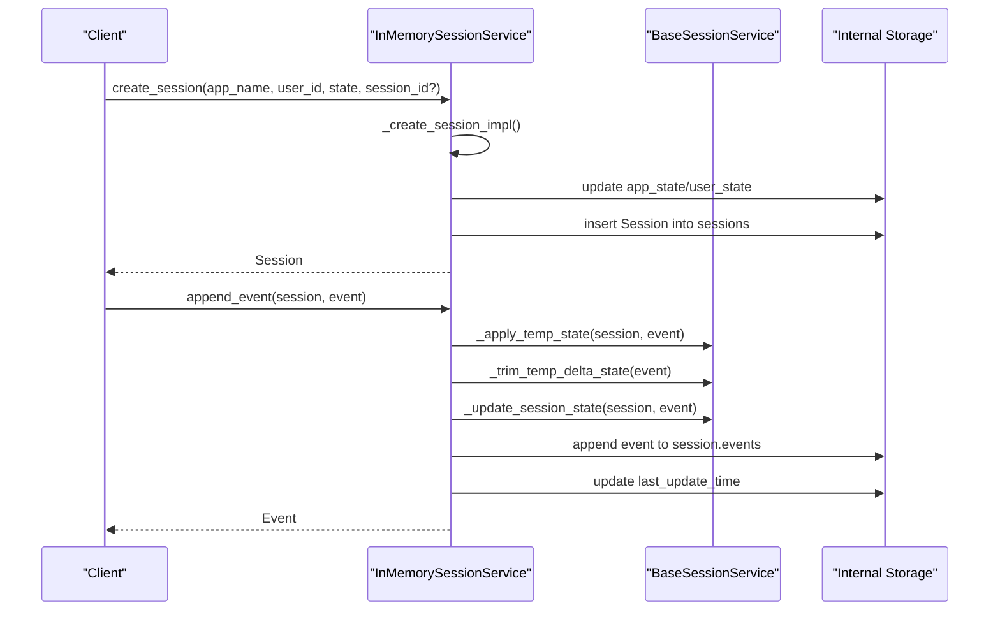
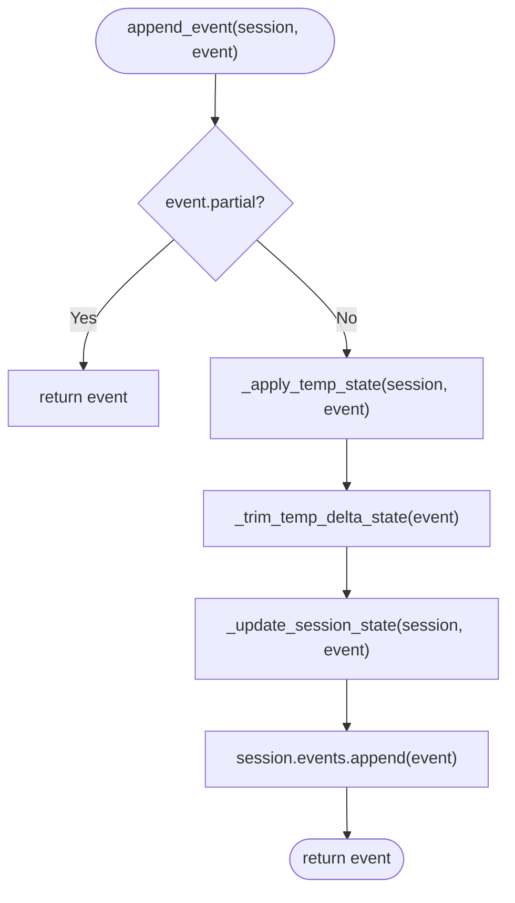
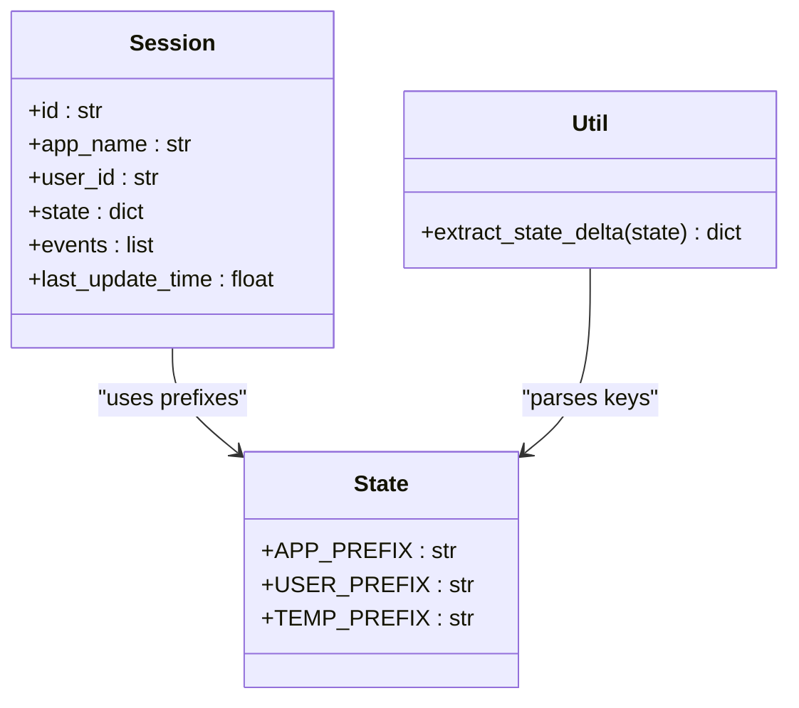
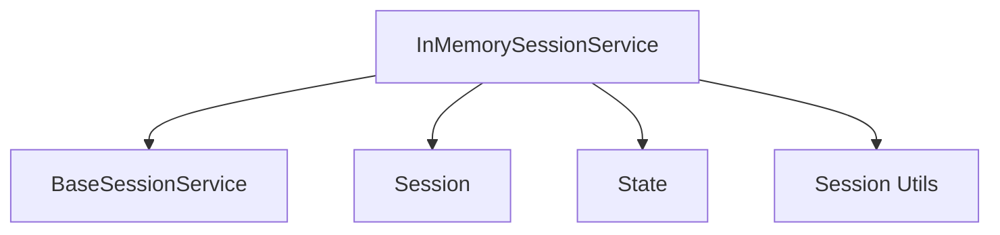

# In-Memory Session Service

<cite>
**Referenced Files in This Document**
- [in_memory_session_service.py](file://src/google/adk/sessions/in_memory_session_service.py)
- [base_session_service.py](file://src/google/adk/sessions/base_session_service.py)
- [session.py](file://src/google/adk/sessions/session.py)
- [state.py](file://src/google/adk/sessions/state.py)
- [_session_util.py](file://src/google/adk/sessions/_session_util.py)
- [test_session_service.py](file://tests/unittests/sessions/test_session_service.py)
- [__init__.py](file://src/google/adk/sessions/__init__.py)
- [main.py](file://contributing/samples/callbacks/main.py)
</cite>

## Table of Contents
1. [Introduction](#introduction)
2. [Project Structure](#project-structure)
3. [Core Components](#core-components)
4. [Architecture Overview](#architecture-overview)
5. [Detailed Component Analysis](#detailed-component-analysis)
6. [Dependency Analysis](#dependency-analysis)
7. [Performance Considerations](#performance-considerations)
8. [Troubleshooting Guide](#troubleshooting-guide)
9. [Conclusion](#conclusion)
10. [Appendices](#appendices)

## Introduction
This document provides comprehensive documentation for the in-memory session service implementation. It explains how the service extends the base session service to provide volatile session storage suitable for development and testing environments. The documentation covers internal data structures, memory management considerations, performance characteristics, and the implementation of all abstract methods including session creation, retrieval, listing, and deletion. It also details temporary state handling and event processing specific to in-memory storage, configuration options, limitations, and appropriate use cases.

## Project Structure
The in-memory session service resides within the sessions package and integrates with the broader ADK framework. The key files involved are:
- In-memory session service implementation
- Base session service interface
- Session model definition
- State utilities and prefixes
- Session utility functions for state delta extraction
- Unit tests validating behavior
- Package initialization exposing the service
- Sample usage in contributing examples

**Diagram sources**
- [in_memory_session_service.py](file://src/google/adk/sessions/in_memory_session_service.py#L37-L52)
- [base_session_service.py](file://src/google/adk/sessions/base_session_service.py#L45-L154)
- [session.py](file://src/google/adk/sessions/session.py#L27-L51)
- [state.py](file://src/google/adk/sessions/state.py#L20-L82)
- [_session_util.py](file://src/google/adk/sessions/_session_util.py#L37-L51)
- [__init__.py](file://src/google/adk/sessions/__init__.py#L14-L27)

**Section sources**
- [in_memory_session_service.py](file://src/google/adk/sessions/in_memory_session_service.py#L1-L339)
- [base_session_service.py](file://src/google/adk/sessions/base_session_service.py#L1-L154)
- [session.py](file://src/google/adk/sessions/session.py#L1-L51)
- [state.py](file://src/google/adk/sessions/state.py#L1-L82)
- [_session_util.py](file://src/google/adk/sessions/_session_util.py#L1-L51)
- [__init__.py](file://src/google/adk/sessions/__init__.py#L1-L42)

## Core Components
- InMemorySessionService: An in-memory implementation extending BaseSessionService, providing volatile storage for sessions and state.
- BaseSessionService: Abstract base class defining the contract for session services, including asynchronous methods for session lifecycle and event handling.
- Session: Pydantic model representing a session with identifiers, state, events, and timestamps.
- State: Utility class and constants for state prefixes (app:, user:, temp:).
- _session_util: Utility functions for decoding models and extracting state deltas from prefixed keys.

Key responsibilities:
- Volatile storage using nested dictionaries for sessions, app state, and user state.
- Temporary state handling during event processing without persisting temp keys.
- Merging app and user state into session state for retrieval.
- Event appending with state delta updates and last update time maintenance.

**Section sources**
- [in_memory_session_service.py](file://src/google/adk/sessions/in_memory_session_service.py#L37-L52)
- [base_session_service.py](file://src/google/adk/sessions/base_session_service.py#L45-L154)
- [session.py](file://src/google/adk/sessions/session.py#L27-L51)
- [state.py](file://src/google/adk/sessions/state.py#L20-L82)
- [_session_util.py](file://src/google/adk/sessions/_session_util.py#L37-L51)

## Architecture Overview
The in-memory session service implements the BaseSessionService contract and manages three primary data structures:
- sessions: Nested dictionary mapping app_name -> user_id -> session_id -> Session
- app_state: Dictionary mapping app_name -> key -> value for shared application state
- user_state: Nested dictionary mapping app_name -> user_id -> key -> value for user-scoped state

It inherits event handling logic from BaseSessionService, which applies temporary state to the in-memory session before trimming temp keys from persisted event deltas.

**Diagram sources**
- [base_session_service.py](file://src/google/adk/sessions/base_session_service.py#L45-L154)
- [in_memory_session_service.py](file://src/google/adk/sessions/in_memory_session_service.py#L37-L52)
- [session.py](file://src/google/adk/sessions/session.py#L27-L51)
- [state.py](file://src/google/adk/sessions/state.py#L20-L26)

## Detailed Component Analysis

### InMemorySessionService Implementation
The in-memory implementation provides synchronous and asynchronous variants for session operations. It maintains:
- sessions: Three-level nested dictionary for session storage
- app_state: Shared application state
- user_state: Per-user state

It implements all abstract methods from BaseSessionService and augments event handling to manage temporary state and state deltas.

Key behaviors:
- Session creation validates uniqueness and initializes state from provided deltas
- Session retrieval supports filtering recent events and timestamp-based filtering
- Listing returns sessions without events for performance
- Deletion removes sessions by identity
- Event appending applies temp state, trims temp keys, updates session state, and persists events

**Diagram sources**
- [in_memory_session_service.py](file://src/google/adk/sessions/in_memory_session_service.py#L53-L129)
- [in_memory_session_service.py](file://src/google/adk/sessions/in_memory_session_service.py#L290-L339)
- [base_session_service.py](file://src/google/adk/sessions/base_session_service.py#L105-L154)

**Section sources**
- [in_memory_session_service.py](file://src/google/adk/sessions/in_memory_session_service.py#L37-L52)
- [in_memory_session_service.py](file://src/google/adk/sessions/in_memory_session_service.py#L53-L129)
- [in_memory_session_service.py](file://src/google/adk/sessions/in_memory_session_service.py#L130-L196)
- [in_memory_session_service.py](file://src/google/adk/sessions/in_memory_session_service.py#L197-L220)
- [in_memory_session_service.py](file://src/google/adk/sessions/in_memory_session_service.py#L221-L258)
- [in_memory_session_service.py](file://src/google/adk/sessions/in_memory_session_service.py#L260-L288)
- [in_memory_session_service.py](file://src/google/adk/sessions/in_memory_session_service.py#L290-L339)

### BaseSessionService Contract
BaseSessionService defines the abstract methods and shared event handling logic:
- Abstract methods: create_session, get_session, list_sessions, delete_session
- append_event: Applies temp state, trims temp delta, updates session state, appends event
- Helper methods: _apply_temp_state, _trim_temp_delta_state, _update_session_state

Temporary state semantics:
- Keys prefixed with State.TEMP_PREFIX are applied to the in-memory session state during event processing
- These temp keys are removed from the event’s state_delta before persistence
- This ensures temp values are ephemeral within an invocation but not persisted

**Diagram sources**
- [base_session_service.py](file://src/google/adk/sessions/base_session_service.py#L105-L154)
- [state.py](file://src/google/adk/sessions/state.py#L20-L26)

**Section sources**
- [base_session_service.py](file://src/google/adk/sessions/base_session_service.py#L45-L154)
- [state.py](file://src/google/adk/sessions/state.py#L20-L26)

### Session Model and State Management
The Session model encapsulates session metadata and state:
- Identifiers: id, app_name, user_id
- State: dict[str, Any] for session state
- Events: list[Event] for interaction history
- Timestamp: last_update_time for freshness checks

State utilities define prefixes:
- APP_PREFIX: "app:"
- USER_PREFIX: "user:"
- TEMP_PREFIX: "temp:"

State delta extraction separates state into app, user, and session categories based on prefixes.

**Diagram sources**
- [session.py](file://src/google/adk/sessions/session.py#L27-L51)
- [state.py](file://src/google/adk/sessions/state.py#L20-L26)
- [_session_util.py](file://src/google/adk/sessions/_session_util.py#L37-L51)

**Section sources**
- [session.py](file://src/google/adk/sessions/session.py#L27-L51)
- [state.py](file://src/google/adk/sessions/state.py#L20-L82)
- [_session_util.py](file://src/google/adk/sessions/_session_util.py#L37-L51)

### Event Processing and Temporary State
Temporary state handling is central to the in-memory service:
- During append_event, temp state is applied to the in-memory session state
- The event’s state_delta is trimmed to remove temp keys before persistence
- This allows sequential agents within the same invocation to share temp values

Validation in tests demonstrates:
- Temp state is present in the in-memory session during the same invocation
- Persisted events do not contain temp keys in state_delta
- Temp state remains readable across sequential events within the same session object

**Section sources**
- [base_session_service.py](file://src/google/adk/sessions/base_session_service.py#L105-L154)
- [test_session_service.py](file://tests/unittests/sessions/test_session_service.py#L408-L457)

### Session Retrieval and Filtering
The get_session method supports:
- Returning a deep copy of the session to prevent external mutation
- Optional filtering:
  - num_recent_events: limits returned events to the most recent N
  - after_timestamp: filters events to those occurring after a given timestamp

Merging behavior:
- App state is merged into session.state with "app:" prefix
- User state is merged into session.state with "user:" prefix

**Section sources**
- [in_memory_session_service.py](file://src/google/adk/sessions/in_memory_session_service.py#L162-L196)
- [in_memory_session_service.py](file://src/google/adk/sessions/in_memory_session_service.py#L197-L220)

### Session Listing and Deletion
List sessions:
- Returns sessions without events for performance
- Supports listing all sessions for a user or all users within an app
- Merges app and user state into each returned session

Delete session:
- Removes a session by app_name, user_id, and session_id
- No-op if the session does not exist

**Section sources**
- [in_memory_session_service.py](file://src/google/adk/sessions/in_memory_session_service.py#L221-L258)
- [in_memory_session_service.py](file://src/google/adk/sessions/in_memory_session_service.py#L260-L288)

## Dependency Analysis
The in-memory session service depends on:
- BaseSessionService for the abstract contract and event handling logic
- Session model for session representation
- State utilities for prefix constants and merging behavior
- _session_util for state delta extraction
- Platform utilities for UUID generation and time retrieval

**Diagram sources**
- [in_memory_session_service.py](file://src/google/adk/sessions/in_memory_session_service.py#L25-L32)
- [base_session_service.py](file://src/google/adk/sessions/base_session_service.py#L24-L26)
- [session.py](file://src/google/adk/sessions/session.py#L24)
- [state.py](file://src/google/adk/sessions/state.py#L20-L26)
- [_session_util.py](file://src/google/adk/sessions/_session_util.py#L23)

**Section sources**
- [in_memory_session_service.py](file://src/google/adk/sessions/in_memory_session_service.py#L25-L32)
- [base_session_service.py](file://src/google/adk/sessions/base_session_service.py#L24-L26)
- [session.py](file://src/google/adk/sessions/session.py#L24)
- [state.py](file://src/google/adk/sessions/state.py#L20-L26)
- [_session_util.py](file://src/google/adk/sessions/_session_util.py#L23)

## Performance Considerations
- Memory footprint: Sessions, app state, and user state are stored in nested dictionaries. Growth is proportional to the number of sessions and state entries.
- Retrieval performance: get_session returns a deep copy and optionally filters events; filtering by timestamp iterates backwards through events.
- Listing performance: list_sessions returns sessions without events to minimize overhead.
- Event processing: append_event applies temp state, trims temp keys, updates session state, and appends to events; operations are O(1) per event except timestamp filtering which is O(n) in worst case.
- Concurrency: The in-memory service is not suitable for multi-threaded production environments; use it for development and testing only.

[No sources needed since this section provides general guidance]

## Troubleshooting Guide
Common issues and resolutions:
- Session ID conflicts: Creating a session with an existing session_id raises an AlreadyExistsError. Ensure unique session IDs or omit session_id to auto-generate.
- Missing app/user state rows: While not applicable to in-memory service, the base event handling logic expects app/user state rows to exist for persistence backends.
- Stale session updates: When multiple stale copies of a session are updated concurrently, the backend preserves all state changes; ensure to refresh sessions before appending events.

Validation references:
- Session ID conflict behavior is tested across multiple session services.
- Event handling and state delta trimming are validated in tests.

**Section sources**
- [test_session_service.py](file://tests/unittests/sessions/test_session_service.py#L481-L500)
- [base_session_service.py](file://src/google/adk/sessions/base_session_service.py#L105-L154)

## Conclusion
The in-memory session service provides a lightweight, volatile implementation suitable for development and testing. It maintains three core data structures for sessions, app state, and user state, and implements the BaseSessionService contract with robust event handling including temporary state management. While not designed for production concurrency, it offers excellent performance and simplicity for local experimentation and automated testing.

## Appendices

### Configuration Options and Usage Scenarios
- Initialization: Instantiate InMemorySessionService without arguments.
- Typical usage: Pass the service to Runner alongside an artifact service for end-to-end testing.
- Example setup: See the callbacks sample demonstrating session creation and iterative runs.

**Section sources**
- [__init__.py](file://src/google/adk/sessions/__init__.py#L14-L27)
- [main.py](file://contributing/samples/callbacks/main.py#L33-L46)

### API Reference Summary
- create_session: Creates a session with optional initial state and session_id.
- get_session: Retrieves a session with optional filtering of recent events and timestamp.
- list_sessions: Lists sessions for a user or all users within an app.
- delete_session: Deletes a session by identity.
- append_event: Appends an event, applying temp state and trimming temp keys from persisted deltas.

**Section sources**
- [in_memory_session_service.py](file://src/google/adk/sessions/in_memory_session_service.py#L53-L129)
- [in_memory_session_service.py](file://src/google/adk/sessions/in_memory_session_service.py#L130-L196)
- [in_memory_session_service.py](file://src/google/adk/sessions/in_memory_session_service.py#L221-L258)
- [in_memory_session_service.py](file://src/google/adk/sessions/in_memory_session_service.py#L260-L288)
- [in_memory_session_service.py](file://src/google/adk/sessions/in_memory_session_service.py#L290-L339)
- [base_session_service.py](file://src/google/adk/sessions/base_session_service.py#L105-L154)