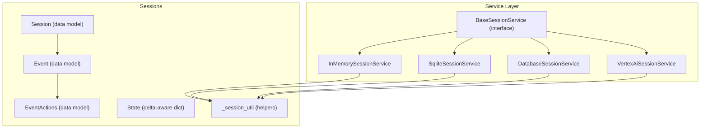
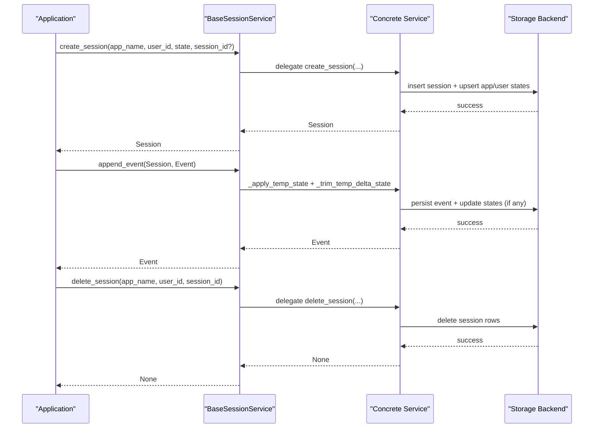
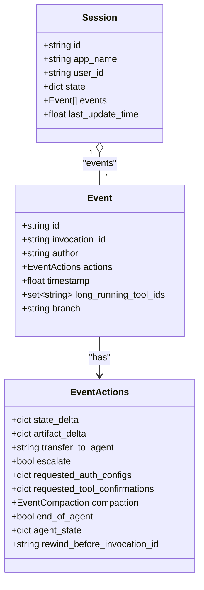
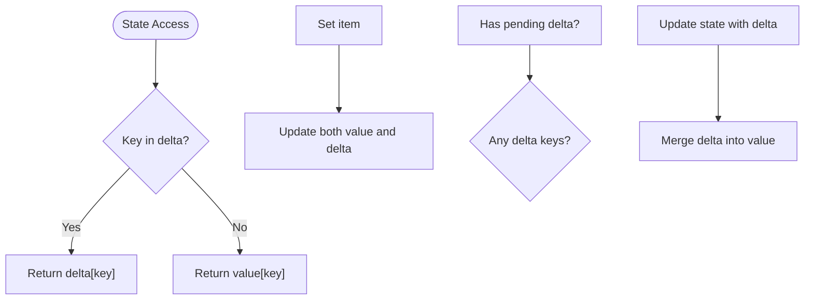
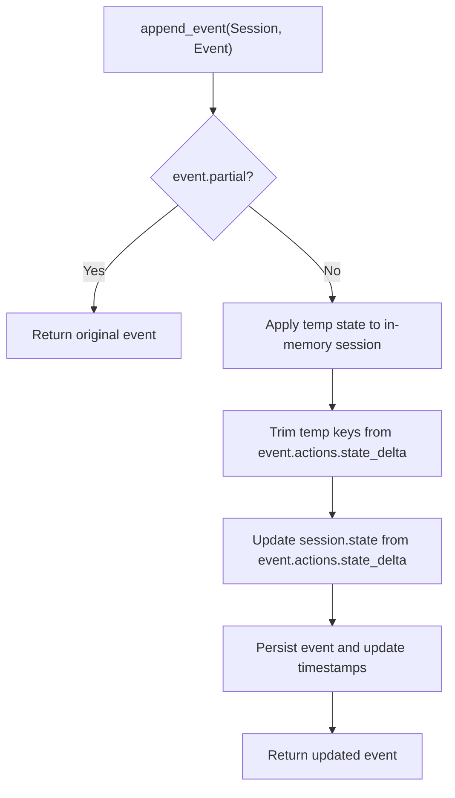
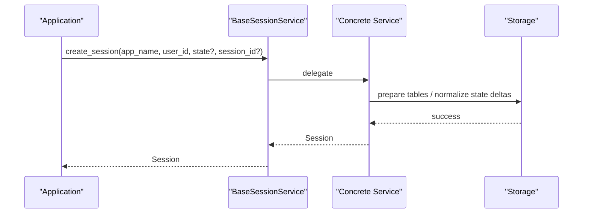
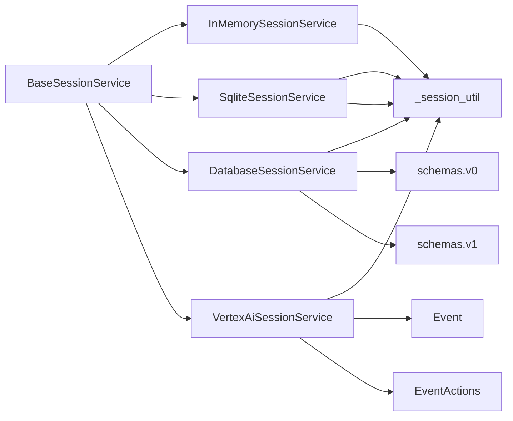

# Session Lifecycle Management

<cite>
**Referenced Files in This Document**
- [sessions/__init__.py](file://src/google/adk/sessions/__init__.py)
- [sessions/session.py](file://src/google/adk/sessions/session.py)
- [sessions/state.py](file://src/google/adk/sessions/state.py)
- [sessions/base_session_service.py](file://src/google/adk/sessions/base_session_service.py)
- [sessions/_session_util.py](file://src/google/adk/sessions/_session_util.py)
- [sessions/in_memory_session_service.py](file://src/google/adk/sessions/in_memory_session_service.py)
- [sessions/sqlite_session_service.py](file://src/google/adk/sessions/sqlite_session_service.py)
- [sessions/database_session_service.py](file://src/google/adk/sessions/database_session_service.py)
- [sessions/vertex_ai_session_service.py](file://src/google/adk/sessions/vertex_ai_session_service.py)
- [sessions/migration/_schema_check_utils.py](file://src/google/adk/sessions/migration/_schema_check_utils.py)
- [sessions/schemas/v0.py](file://src/google/adk/sessions/schemas/v0.py)
- [sessions/schemas/v1.py](file://src/google/adk/sessions/schemas/v1.py)
- [events/event.py](file://src/google/adk/events/event.py)
- [events/event_actions.py](file://src/google/adk/events/event_actions.py)
</cite>

## Table of Contents
1. [Introduction](#introduction)
2. [Project Structure](#project-structure)
3. [Core Components](#core-components)
4. [Architecture Overview](#architecture-overview)
5. [Detailed Component Analysis](#detailed-component-analysis)
6. [Dependency Analysis](#dependency-analysis)
7. [Performance Considerations](#performance-considerations)
8. [Troubleshooting Guide](#troubleshooting-guide)
9. [Conclusion](#conclusion)

## Introduction
This document explains the complete session lifecycle management in the ADK framework, covering creation, event handling, state management, persistence, expiration, cleanup, and error handling. It focuses on how sessions are created, how events are appended and processed, how state deltas are applied and persisted, and how sessions are scoped to applications and users. Practical examples illustrate lifecycle hooks, event processing workflows, and state synchronization patterns.

## Project Structure
The session subsystem is organized around a shared interface and multiple storage backends:
- Shared models and utilities define the session, event, and state abstractions.
- A base service interface coordinates creation, retrieval, listing, deletion, and event appending.
- Concrete services implement storage backends: in-memory, SQLite, SQL databases, and Vertex AI Agent Engine.

**Diagram sources**
- [sessions/session.py](file://src/google/adk/sessions/session.py#L27-L51)
- [events/event.py](file://src/google/adk/events/event.py#L31-L130)
- [events/event_actions.py](file://src/google/adk/events/event_actions.py#L50-L111)
- [sessions/state.py](file://src/google/adk/sessions/state.py#L20-L82)
- [sessions/_session_util.py](file://src/google/adk/sessions/_session_util.py#L28-L51)
- [sessions/base_session_service.py](file://src/google/adk/sessions/base_session_service.py#L45-L154)
- [sessions/in_memory_session_service.py](file://src/google/adk/sessions/in_memory_session_service.py#L37-L339)
- [sessions/sqlite_session_service.py](file://src/google/adk/sessions/sqlite_session_service.py#L132-L596)
- [sessions/database_session_service.py](file://src/google/adk/sessions/database_session_service.py#L135-L661)
- [sessions/vertex_ai_session_service.py](file://src/google/adk/sessions/vertex_ai_session_service.py#L46-L438)

**Section sources**
- [sessions/__init__.py](file://src/google/adk/sessions/__init__.py#L14-L42)
- [sessions/session.py](file://src/google/adk/sessions/session.py#L27-L51)
- [events/event.py](file://src/google/adk/events/event.py#L31-L130)
- [events/event_actions.py](file://src/google/adk/events/event_actions.py#L50-L111)
- [sessions/state.py](file://src/google/adk/sessions/state.py#L20-L82)
- [sessions/_session_util.py](file://src/google/adk/sessions/_session_util.py#L28-L51)
- [sessions/base_session_service.py](file://src/google/adk/sessions/base_session_service.py#L45-L154)

## Core Components
- Session: A Pydantic model representing a conversation stream with app_name, user_id, id, state, events, and last_update_time.
- Event: A Pydantic model capturing content, actions, timestamps, and metadata for each interaction.
- EventActions: Defines action payloads such as state_delta, artifact_delta, transfer_to_agent, escalate, and compaction.
- State: A delta-aware dictionary supporting app:user:temp prefixes and pending commits.
- BaseSessionService: Abstract interface defining create/get/list/delete and event append semantics.
- Concrete Services: Implement storage-specific behavior for in-memory, SQLite, SQL databases, and Vertex AI.

**Section sources**
- [sessions/session.py](file://src/google/adk/sessions/session.py#L27-L51)
- [events/event.py](file://src/google/adk/events/event.py#L31-L130)
- [events/event_actions.py](file://src/google/adk/events/event_actions.py#L50-L111)
- [sessions/state.py](file://src/google/adk/sessions/state.py#L20-L82)
- [sessions/base_session_service.py](file://src/google/adk/sessions/base_session_service.py#L45-L154)

## Architecture Overview
The session lifecycle spans three phases:
1. Creation: A session is created with optional initial state and identifiers.
2. Interaction: Events are appended, state deltas are applied, and persistence occurs according to backend capabilities.
3. Destruction/Cleanup: Sessions are deleted or rely on external expiration policies.

**Diagram sources**
- [sessions/base_session_service.py](file://src/google/adk/sessions/base_session_service.py#L105-L154)
- [sessions/in_memory_session_service.py](file://src/google/adk/sessions/in_memory_session_service.py#L54-L129)
- [sessions/sqlite_session_service.py](file://src/google/adk/sessions/sqlite_session_service.py#L157-L229)
- [sessions/database_session_service.py](file://src/google/adk/sessions/database_session_service.py#L313-L390)
- [sessions/vertex_ai_session_service.py](file://src/google/adk/sessions/vertex_ai_session_service.py#L81-L132)

## Detailed Component Analysis

### Session Model and Metadata
- Session encapsulates identity (id), application scoping (app_name), user association (user_id), mutable state (state), event stream (events), and last_update_time.
- Metadata includes event authorship, branching, partial/turn completion flags, and long-running tool IDs.

**Diagram sources**
- [sessions/session.py](file://src/google/adk/sessions/session.py#L27-L51)
- [events/event.py](file://src/google/adk/events/event.py#L31-L130)
- [events/event_actions.py](file://src/google/adk/events/event_actions.py#L50-L111)

**Section sources**
- [sessions/session.py](file://src/google/adk/sessions/session.py#L27-L51)
- [events/event.py](file://src/google/adk/events/event.py#L31-L130)
- [events/event_actions.py](file://src/google/adk/events/event_actions.py#L50-L111)

### State Management and Delta Processing
- State maintains current and pending-delta values with helpers to read/write and detect pending changes.
- Prefixes:
  - app: keys scoped to the application
  - user: keys scoped to the user within an app
  - temp: ephemeral keys scoped to the current invocation
- Delta extraction separates app/user/session deltas from a flat state dictionary.

**Diagram sources**
- [sessions/state.py](file://src/google/adk/sessions/state.py#L20-L82)
- [sessions/_session_util.py](file://src/google/adk/sessions/_session_util.py#L37-L51)

**Section sources**
- [sessions/state.py](file://src/google/adk/sessions/state.py#L20-L82)
- [sessions/_session_util.py](file://src/google/adk/sessions/_session_util.py#L37-L51)

### Event Handling Patterns
- Partial events: Base service short-circuits appending of partial events.
- Temp-scoped state: Applied to in-memory session before trimming temp keys from persisted deltas.
- Event ordering: Backends preserve chronological order; Vertex service preserves full event stream to avoid clock-skew loss.
- Conflict resolution: Database service detects stale sessions and reloads state/events before applying deltas.

**Diagram sources**
- [sessions/base_session_service.py](file://src/google/adk/sessions/base_session_service.py#L105-L154)
- [sessions/database_session_service.py](file://src/google/adk/sessions/database_session_service.py#L521-L648)
- [sessions/sqlite_session_service.py](file://src/google/adk/sessions/sqlite_session_service.py#L360-L456)
- [sessions/vertex_ai_session_service.py](file://src/google/adk/sessions/vertex_ai_session_service.py#L249-L321)

**Section sources**
- [sessions/base_session_service.py](file://src/google/adk/sessions/base_session_service.py#L105-L154)
- [sessions/database_session_service.py](file://src/google/adk/sessions/database_session_service.py#L521-L648)
- [sessions/sqlite_session_service.py](file://src/google/adk/sessions/sqlite_session_service.py#L360-L456)
- [sessions/vertex_ai_session_service.py](file://src/google/adk/sessions/vertex_ai_session_service.py#L249-L321)

### Session Creation Workflows
- In-memory: Validates uniqueness, extracts state deltas, merges app/user states into session state, stores in-memory maps, and returns a deep-copied merged session.
- SQLite: Inserts session and upserts app/user states atomically, merges states for response, and returns a Session with last_update_time.
- Database (SQL): Uses SQLAlchemy ORM, prepares tables lazily, upserts app/user states, persists session, and returns merged Session.
- Vertex AI: Creates sessions via Vertex AI Agent Engine; user-provided session IDs are not supported; returns Session with last_update_time.

**Diagram sources**
- [sessions/in_memory_session_service.py](file://src/google/adk/sessions/in_memory_session_service.py#L54-L129)
- [sessions/sqlite_session_service.py](file://src/google/adk/sessions/sqlite_session_service.py#L157-L229)
- [sessions/database_session_service.py](file://src/google/adk/sessions/database_session_service.py#L313-L390)
- [sessions/vertex_ai_session_service.py](file://src/google/adk/sessions/vertex_ai_session_service.py#L81-L132)

**Section sources**
- [sessions/in_memory_session_service.py](file://src/google/adk/sessions/in_memory_session_service.py#L54-L129)
- [sessions/sqlite_session_service.py](file://src/google/adk/sessions/sqlite_session_service.py#L157-L229)
- [sessions/database_session_service.py](file://src/google/adk/sessions/database_session_service.py#L313-L390)
- [sessions/vertex_ai_session_service.py](file://src/google/adk/sessions/vertex_ai_session_service.py#L81-L132)

### Session Expiration and Cleanup
- Vertex AI sessions: Expiration can be configured during creation; deletion removes session resources.
- Database/SQLite: No built-in TTL; cleanup relies on explicit delete_session or external retention policies.
- In-memory: No persistence; sessions are lost when the process ends.

Practical notes:
- Use delete_session to clean up resources promptly.
- For Vertex AI, configure expiration at creation time when supported by the backend.

**Section sources**
- [sessions/vertex_ai_session_service.py](file://src/google/adk/sessions/vertex_ai_session_service.py#L81-L132)
- [sessions/vertex_ai_session_service.py](file://src/google/adk/sessions/vertex_ai_session_service.py#L232-L247)
- [sessions/sqlite_session_service.py](file://src/google/adk/sessions/sqlite_session_service.py#L348-L358)
- [sessions/database_session_service.py](file://src/google/adk/sessions/database_session_service.py#L505-L519)
- [sessions/in_memory_session_service.py](file://src/google/adk/sessions/in_memory_session_service.py#L260-L275)

### State Synchronization Patterns
- App/User/Session state merging:
  - In-memory: Merges app and user state into session state before returning copies.
  - SQLite: Merges app/user/session states from storage into the returned Session.
  - Database: Merges app/user/session states from ORM models into the returned Session.
- Delta propagation:
  - Base service applies temp state to in-memory session before trimming temp keys from persisted deltas.
  - Backends upsert app/user/session state deltas atomically.

**Section sources**
- [sessions/in_memory_session_service.py](file://src/google/adk/sessions/in_memory_session_service.py#L197-L219)
- [sessions/sqlite_session_service.py](file://src/google/adk/sessions/sqlite_session_service.py#L218-L228)
- [sessions/database_session_service.py](file://src/google/adk/sessions/database_session_service.py#L384-L390)
- [sessions/base_session_service.py](file://src/google/adk/sessions/base_session_service.py#L118-L154)

### Error Handling During Lifecycle Transitions
- Stale session detection: Database service compares storage update_time with session.last_update_time and raises if storage is newer.
- Missing state rows: Database service raises if app/user state is missing when required.
- Duplicate session IDs: In-memory and SQLite services raise AlreadyExistsError when attempting to reuse an existing ID.
- Vertex AI errors: 404 returns None; user mismatch raises ValueError; other errors propagate.

Recovery strategies:
- Reload session from storage and replay events if a stale session is detected.
- Validate app/user state initialization before append_event.
- Use retry/backoff for transient external errors (e.g., Vertex AI).

**Section sources**
- [sessions/sqlite_session_service.py](file://src/google/adk/sessions/sqlite_session_service.py#L372-L388)
- [sessions/database_session_service.py](file://src/google/adk/sessions/database_session_service.py#L594-L615)
- [sessions/in_memory_session_service.py](file://src/google/adk/sessions/in_memory_session_service.py#L93-L96)
- [sessions/sqlite_session_service.py](file://src/google/adk/sessions/sqlite_session_service.py#L172-L180)
- [sessions/vertex_ai_session_service.py](file://src/google/adk/sessions/vertex_ai_session_service.py#L168-L179)

## Dependency Analysis
- Cohesion: BaseSessionService centralizes event append logic and temp-state handling, reducing duplication across implementations.
- Coupling: Concrete services depend on shared models and utilities; database services depend on SQLAlchemy ORM and schema classes.
- External dependencies: Vertex AI SDK for cloud-backed sessions; aiosqlite/sqlalchemy for local/remote SQL backends.

**Diagram sources**
- [sessions/base_session_service.py](file://src/google/adk/sessions/base_session_service.py#L45-L154)
- [sessions/in_memory_session_service.py](file://src/google/adk/sessions/in_memory_session_service.py#L25-L32)
- [sessions/sqlite_session_service.py](file://src/google/adk/sessions/sqlite_session_service.py#L32-L39)
- [sessions/database_session_service.py](file://src/google/adk/sessions/database_session_service.py#L41-L60)
- [sessions/vertex_ai_session_service.py](file://src/google/adk/sessions/vertex_ai_session_service.py#L33-L41)
- [sessions/schemas/v0.py](file://src/google/adk/sessions/schemas/v0.py#L92-L387)
- [sessions/schemas/v1.py](file://src/google/adk/sessions/schemas/v1.py#L49-L248)

**Section sources**
- [sessions/base_session_service.py](file://src/google/adk/sessions/base_session_service.py#L45-L154)
- [sessions/database_session_service.py](file://src/google/adk/sessions/database_session_service.py#L135-L661)
- [sessions/sqlite_session_service.py](file://src/google/adk/sessions/sqlite_session_service.py#L132-L596)
- [sessions/vertex_ai_session_service.py](file://src/google/adk/sessions/vertex_ai_session_service.py#L46-L438)
- [sessions/schemas/v0.py](file://src/google/adk/sessions/schemas/v0.py#L92-L387)
- [sessions/schemas/v1.py](file://src/google/adk/sessions/schemas/v1.py#L49-L248)

## Performance Considerations
- Temp state handling: Applying temp state before trimming avoids repeated reads and reduces cross-invocation overhead.
- Atomic state updates: SQLite and Database services use atomic upserts/json_patch to minimize contention and ensure consistency.
- Lazy table preparation: Database service prepares tables lazily and caches schema version to reduce startup overhead.
- Concurrency control: Database service serializes append_event per session within a process using per-session locks.

[No sources needed since this section provides general guidance]

## Troubleshooting Guide
Common issues and resolutions:
- Stale session detected: Reload the session from storage and replay events to synchronize state and event streams.
- Missing app/user state: Ensure create_session initializes app/user state before append_event.
- Duplicate session ID: Generate a new UUID or omit session_id to allow backend-generated IDs.
- Vertex AI user mismatch: Verify user_id matches the session owner before retrieving or appending events.
- Schema migration: Use migration utilities to upgrade from legacy schemas to v1.

**Section sources**
- [sessions/database_session_service.py](file://src/google/adk/sessions/database_session_service.py#L594-L615)
- [sessions/migration/_schema_check_utils.py](file://src/google/adk/sessions/migration/_schema_check_utils.py#L79-L83)
- [sessions/migration/_schema_check_utils.py](file://src/google/adk/sessions/migration/_schema_check_utils.py#L115-L142)

## Conclusion
ADK’s session lifecycle is designed around a robust, extensible service abstraction that cleanly separates concerns between event handling, state management, and persistence. The base service ensures consistent behavior across backends, while concrete implementations tailor persistence, concurrency, and integration specifics. By leveraging temp-scoped state, atomic delta updates, and careful conflict detection, the framework supports reliable multi-turn conversations across diverse storage backends and runtime environments.