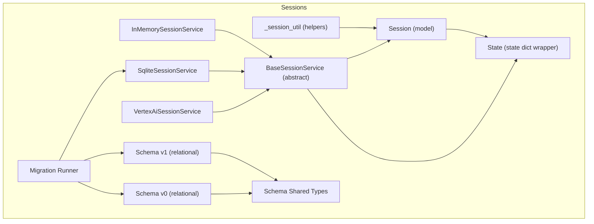
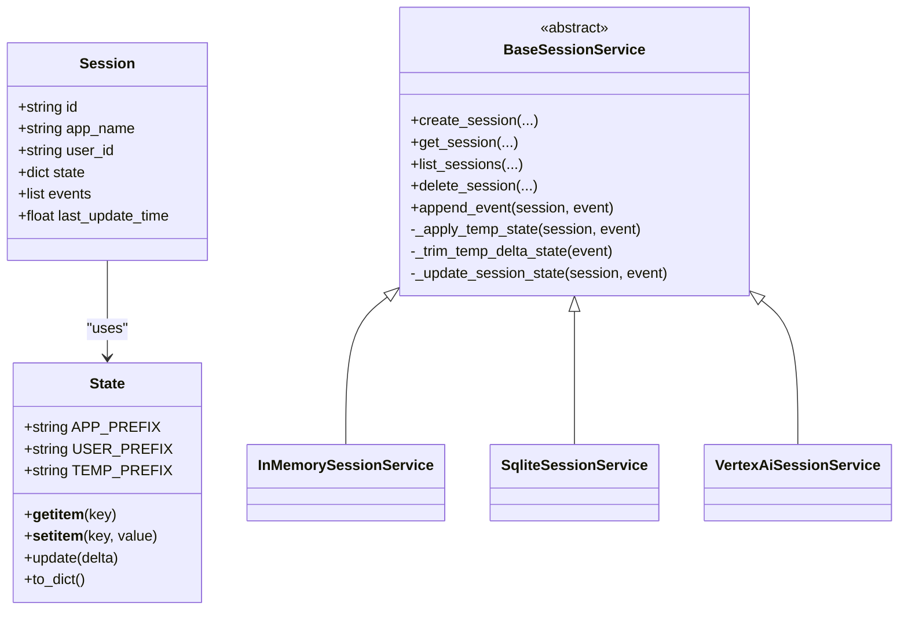
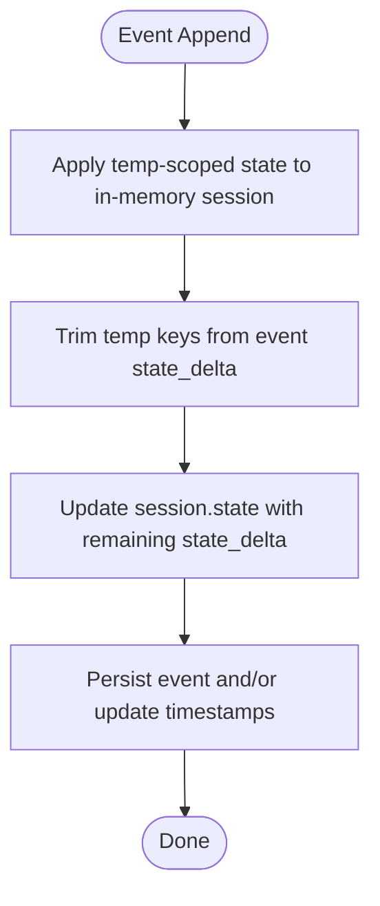
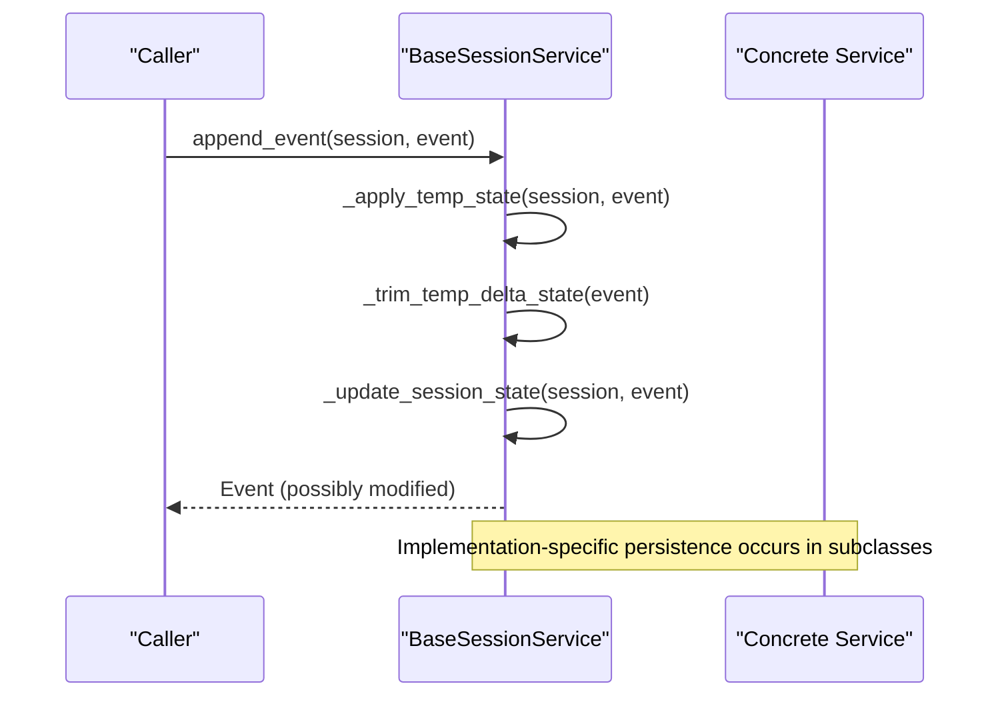
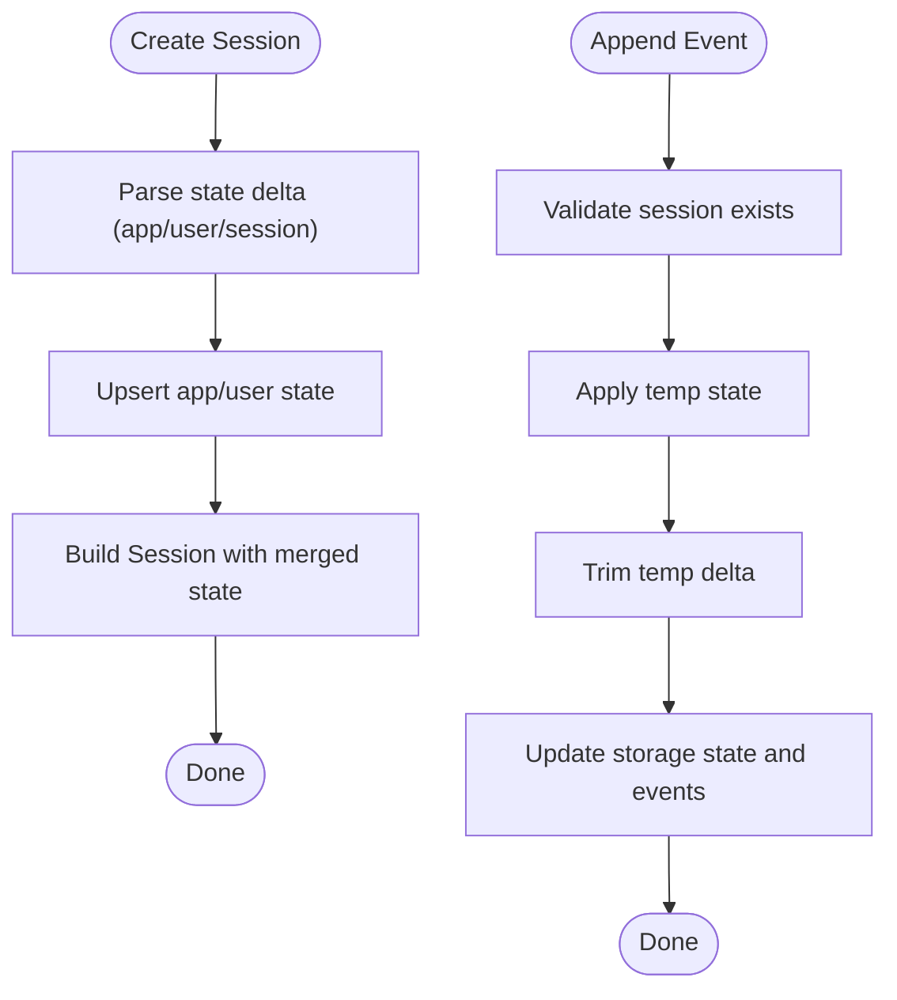
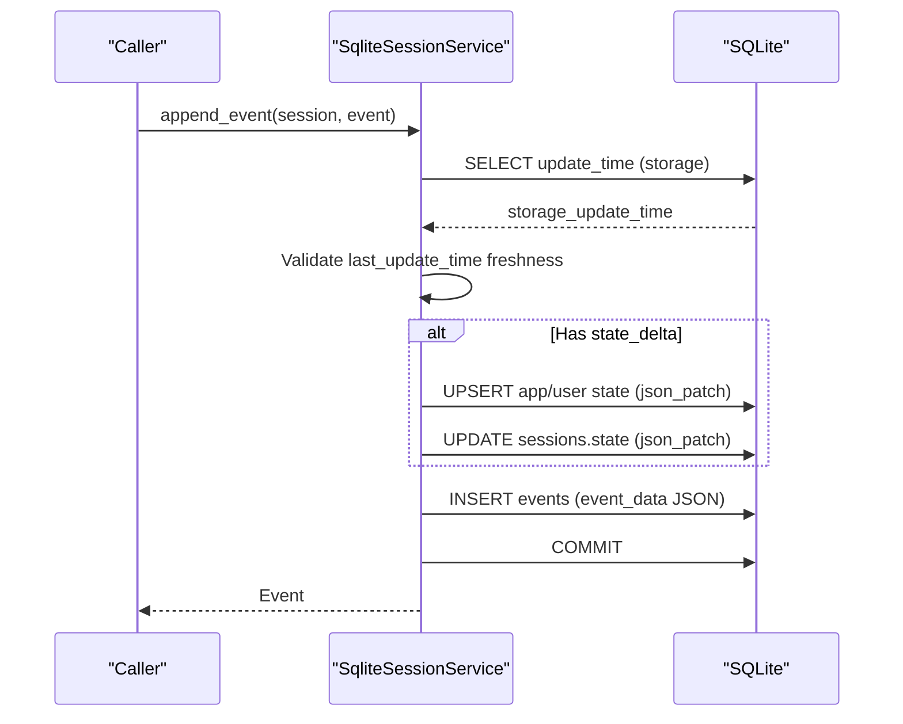
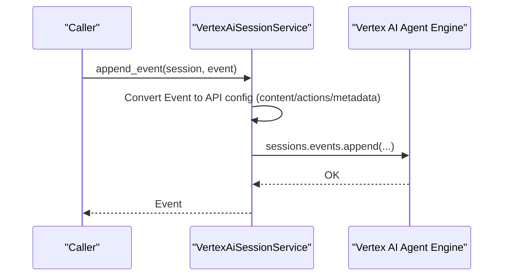
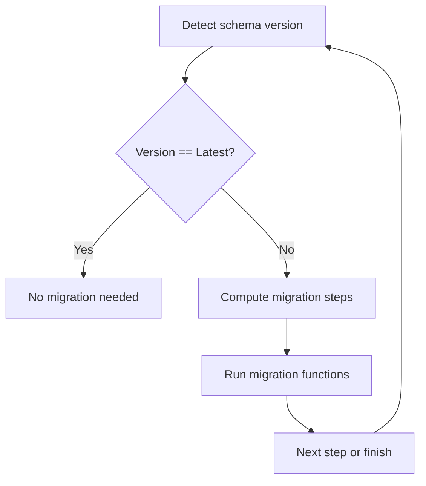
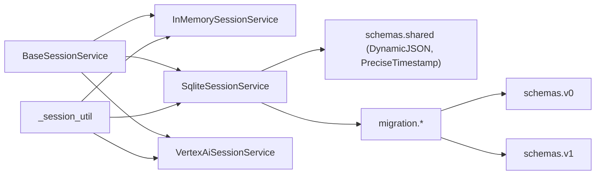

# Session Management

<cite>
**Referenced Files in This Document**
- [__init__.py](file://src/google/adk/sessions/__init__.py)
- [_session_util.py](file://src/google/adk/sessions/_session_util.py)
- [base_session_service.py](file://src/google/adk/sessions/base_session_service.py)
- [in_memory_session_service.py](file://src/google/adk/sessions/in_memory_session_service.py)
- [sqlite_session_service.py](file://src/google/adk/sessions/sqlite_session_service.py)
- [vertex_ai_session_service.py](file://src/google/adk/sessions/vertex_ai_session_service.py)
- [session.py](file://src/google/adk/sessions/session.py)
- [state.py](file://src/google/adk/sessions/state.py)
- [migration_runner.py](file://src/google/adk/sessions/migration/migration_runner.py)
- [_schema_check_utils.py](file://src/google/adk/sessions/migration/_schema_check_utils.py)
- [v0.py](file://src/google/adk/sessions/schemas/v0.py)
- [v1.py](file://src/google/adk/sessions/schemas/v1.py)
- [shared.py](file://src/google/adk/sessions/schemas/shared.py)
- [session_not_found_error.py](file://src/google/adk/errors/session_not_found_error.py)
</cite>

## Table of Contents
1. [Introduction](#introduction)
2. [Project Structure](#project-structure)
3. [Core Components](#core-components)
4. [Architecture Overview](#architecture-overview)
5. [Detailed Component Analysis](#detailed-component-analysis)
6. [Dependency Analysis](#dependency-analysis)
7. [Performance Considerations](#performance-considerations)
8. [Troubleshooting Guide](#troubleshooting-guide)
9. [Conclusion](#conclusion)
10. [Appendices](#appendices)

## Introduction
This document explains ADK’s session management system: the session model, event handling, state persistence, and the pluggable session service implementations. It covers:
- Session lifecycle and state management
- In-memory, SQLite, and Vertex AI-backed session services
- Serialization and schema evolution
- Migration patterns and backward compatibility
- Practical configuration examples
- Scaling, performance, and security considerations
- Relationship between sessions and agent state management

## Project Structure
The session subsystem resides under src/google/adk/sessions and includes:
- Core model and service abstractions
- Concrete implementations for in-memory, SQLite, and Vertex AI
- Migration utilities and schema definitions
- Shared schema helpers for relational databases

**Diagram sources**
- [session.py](file://src/google/adk/sessions/session.py#L27-L51)
- [state.py](file://src/google/adk/sessions/state.py#L20-L82)
- [_session_util.py](file://src/google/adk/sessions/_session_util.py#L28-L51)
- [base_session_service.py](file://src/google/adk/sessions/base_session_service.py#L45-L154)
- [in_memory_session_service.py](file://src/google/adk/sessions/in_memory_session_service.py#L37-L339)
- [sqlite_session_service.py](file://src/google/adk/sessions/sqlite_session_service.py#L132-L596)
- [vertex_ai_session_service.py](file://src/google/adk/sessions/vertex_ai_session_service.py#L46-L438)
- [migration_runner.py](file://src/google/adk/sessions/migration/migration_runner.py#L45-L128)
- [v0.py](file://src/google/adk/sessions/schemas/v0.py#L98-L387)
- [v1.py](file://src/google/adk/sessions/schemas/v1.py#L70-L248)
- [shared.py](file://src/google/adk/sessions/schemas/shared.py#L29-L68)

**Section sources**
- [__init__.py](file://src/google/adk/sessions/__init__.py#L14-L42)
- [session.py](file://src/google/adk/sessions/session.py#L27-L51)
- [state.py](file://src/google/adk/sessions/state.py#L20-L82)
- [base_session_service.py](file://src/google/adk/sessions/base_session_service.py#L45-L154)

## Core Components
- Session model: Encapsulates per-user-agent interaction state, event history, and timestamps.
- State wrapper: Manages current and pending-delta state with prefixes for app/user/temp scoping.
- BaseSessionService: Defines the contract for creating, retrieving, listing, deleting sessions, and appending events.
- Utilities: Helpers for extracting state deltas and decoding models from serialized forms.
- Implementations:
  - InMemorySessionService: Non-persistent, in-process storage for development/testing.
  - SqliteSessionService: Persistent storage using SQLite with JSON-based event serialization.
  - VertexAiSessionService: Cloud-backed sessions via Vertex AI Agent Engine.

Key responsibilities:
- Event append pipeline applies temp-scoped state, trims temp deltas, updates persistent state, and persists events.
- State prefixes enable scoped persistence: app:, user:, temp:, and session-level keys.

**Section sources**
- [session.py](file://src/google/adk/sessions/session.py#L27-L51)
- [state.py](file://src/google/adk/sessions/state.py#L20-L82)
- [base_session_service.py](file://src/google/adk/sessions/base_session_service.py#L45-L154)
- [_session_util.py](file://src/google/adk/sessions/_session_util.py#L37-L51)

## Architecture Overview
The session service architecture separates concerns between:
- Model and state: Session and State wrappers
- Service abstraction: BaseSessionService
- Implementations: In-memory, SQLite, Vertex AI
- Persistence and migration: Relational schemas and migration runner

**Diagram sources**
- [session.py](file://src/google/adk/sessions/session.py#L27-L51)
- [state.py](file://src/google/adk/sessions/state.py#L20-L82)
- [base_session_service.py](file://src/google/adk/sessions/base_session_service.py#L45-L154)
- [in_memory_session_service.py](file://src/google/adk/sessions/in_memory_session_service.py#L37-L339)
- [sqlite_session_service.py](file://src/google/adk/sessions/sqlite_session_service.py#L132-L596)
- [vertex_ai_session_service.py](file://src/google/adk/sessions/vertex_ai_session_service.py#L46-L438)

## Detailed Component Analysis

### Session Model and State
- Session: Pydantic model with strict field validation, camelCase aliases, and typed fields for id, app_name, user_id, state, events, and last_update_time.
- State: Wrapper around a dict with three key prefixes:
  - app: Keys prefixed with app: are merged into session state globally.
  - user: Keys prefixed with user: are merged per user.
  - temp: Keys prefixed with temp: are applied to in-memory state during an invocation but not persisted.
  - session: Other keys are treated as session-level state.

**Diagram sources**
- [base_session_service.py](file://src/google/adk/sessions/base_session_service.py#L105-L154)
- [state.py](file://src/google/adk/sessions/state.py#L20-L82)

**Section sources**
- [session.py](file://src/google/adk/sessions/session.py#L27-L51)
- [state.py](file://src/google/adk/sessions/state.py#L20-L82)
- [base_session_service.py](file://src/google/adk/sessions/base_session_service.py#L105-L154)

### BaseSessionService: Contract and Event Pipeline
- Methods: create_session, get_session, list_sessions, delete_session, append_event.
- append_event orchestrates:
  - Applying temp-scoped state to the in-memory session before trimming.
  - Trimming temp keys from the event’s state_delta.
  - Updating session state from non-temp deltas.
  - Appending the event to the session.

**Diagram sources**
- [base_session_service.py](file://src/google/adk/sessions/base_session_service.py#L105-L154)

**Section sources**
- [base_session_service.py](file://src/google/adk/sessions/base_session_service.py#L45-L154)

### InMemorySessionService
- Purpose: Development/testing only; not suitable for multi-threaded production.
- Behavior:
  - Stores sessions, app-level state, and user-level state in-memory maps.
  - On create/get/list/delete, merges app/user state into returned session state.
  - append_event validates session presence, applies temp state, updates storage, and merges state deltas.

**Diagram sources**
- [in_memory_session_service.py](file://src/google/adk/sessions/in_memory_session_service.py#L85-L129)
- [in_memory_session_service.py](file://src/google/adk/sessions/in_memory_session_service.py#L290-L339)

**Section sources**
- [in_memory_session_service.py](file://src/google/adk/sessions/in_memory_session_service.py#L37-L339)

### SqliteSessionService
- Purpose: Persistent storage using SQLite with JSON-based event serialization.
- Schema:
  - sessions: app_name, user_id, id, state (JSON), timestamps.
  - events: id, app_name, user_id, session_id, invocation_id, timestamp, event_data (JSON).
  - app_states, user_states: JSON state with update_time.
- Features:
  - Uses json_patch to atomically merge state deltas.
  - Supports filtering events by after_timestamp and limiting by num_recent_events.
  - Detects legacy schema and raises migration-required errors.
  - Provides helper to normalize SQLite URLs and URIs.

**Diagram sources**
- [sqlite_session_service.py](file://src/google/adk/sessions/sqlite_session_service.py#L360-L456)

**Section sources**
- [sqlite_session_service.py](file://src/google/adk/sessions/sqlite_session_service.py#L132-L596)

### VertexAiSessionService
- Purpose: Cloud-backed sessions via Vertex AI Agent Engine.
- Behavior:
  - Creates sessions server-side; user-provided session_id is not supported.
  - Retrieves sessions and events in parallel; preserves full event stream to avoid clock-skew issues.
  - Converts between API event objects and internal Event model, including compaction metadata stored in custom_metadata.
  - Appends events with content, actions, error info, and metadata; stores compaction data in custom_metadata until native support.

**Diagram sources**
- [vertex_ai_session_service.py](file://src/google/adk/sessions/vertex_ai_session_service.py#L248-L321)

**Section sources**
- [vertex_ai_session_service.py](file://src/google/adk/sessions/vertex_ai_session_service.py#L46-L438)

### Migration and Schema Evolution
- Schema versions:
  - v0: Legacy schema using Pickle for event actions.
  - v1: Current schema using JSON for event data and metadata.
- Migration runner:
  - Detects current schema version and applies sequential migrations.
  - Supports multi-step migrations via temporary SQLite files.
  - Enforces separate source and destination URLs.
- Schema utilities:
  - DynamicJSON selects JSONB for PostgreSQL, TEXT/JSON for others.
  - PreciseTimestamp ensures microsecond precision across dialects.

**Diagram sources**
- [migration_runner.py](file://src/google/adk/sessions/migration/migration_runner.py#L45-L128)
- [_schema_check_utils.py](file://src/google/adk/sessions/migration/_schema_check_utils.py#L115-L142)
- [v0.py](file://src/google/adk/sessions/schemas/v0.py#L63-L90)
- [v1.py](file://src/google/adk/sessions/schemas/v1.py#L55-L68)
- [shared.py](file://src/google/adk/sessions/schemas/shared.py#L29-L68)

**Section sources**
- [migration_runner.py](file://src/google/adk/sessions/migration/migration_runner.py#L45-L128)
- [_schema_check_utils.py](file://src/google/adk/sessions/migration/_schema_check_utils.py#L32-L77)
- [v0.py](file://src/google/adk/sessions/schemas/v0.py#L14-L387)
- [v1.py](file://src/google/adk/sessions/schemas/v1.py#L15-L248)
- [shared.py](file://src/google/adk/sessions/schemas/shared.py#L29-L68)

## Dependency Analysis
- Concrete implementations depend on BaseSessionService and share utilities for state delta extraction and model decoding.
- SQLite service depends on aiosqlite and JSON serialization; it also uses schema helpers for dynamic JSON and precise timestamps.
- Vertex AI service depends on the Vertex AI SDK and translates between API objects and internal models.

**Diagram sources**
- [base_session_service.py](file://src/google/adk/sessions/base_session_service.py#L45-L154)
- [in_memory_session_service.py](file://src/google/adk/sessions/in_memory_session_service.py#L25-L33)
- [sqlite_session_service.py](file://src/google/adk/sessions/sqlite_session_service.py#L32-L40)
- [vertex_ai_session_service.py](file://src/google/adk/sessions/vertex_ai_session_service.py#L33-L42)
- [shared.py](file://src/google/adk/sessions/schemas/shared.py#L29-L68)
- [v0.py](file://src/google/adk/sessions/schemas/v0.py#L53-L60)
- [v1.py](file://src/google/adk/sessions/schemas/v1.py#L48-L53)

**Section sources**
- [__init__.py](file://src/google/adk/sessions/__init__.py#L14-L42)
- [sqlite_session_service.py](file://src/google/adk/sessions/sqlite_session_service.py#L132-L596)
- [vertex_ai_session_service.py](file://src/google/adk/sessions/vertex_ai_session_service.py#L46-L438)

## Performance Considerations
- InMemorySessionService:
  - Suitable only for single-threaded development; not recommended for production due to lack of persistence and concurrency guarantees.
- SqliteSessionService:
  - Uses json_patch for atomic state merges; consider indexing and query filters (after_timestamp, num_recent_events) to limit scans.
  - Event retrieval sorts by timestamp descending and optionally limits rows; ensure appropriate filters to reduce payload sizes.
  - JSON serialization is flexible but may increase storage overhead compared to structured fields; monitor size and consider compression if needed.
- VertexAiSessionService:
  - Network-bound; batch operations where possible and minimize redundant event appends.
  - Leverages parallel retrieval of session and events; ensure client-side caching for repeated reads.
- General:
  - Prefer prefix-based state scoping (app:/user:/temp:) to avoid unnecessary persistence and improve clarity.
  - Limit event counts via GetSessionConfig to reduce memory and bandwidth usage.

[No sources needed since this section provides general guidance]

## Troubleshooting Guide
Common issues and resolutions:
- Session not found:
  - Symptom: Retrieval returns None or raises a not-found error.
  - Resolution: Verify app_name, user_id, and session_id; confirm the session exists and is accessible.
  - Section sources
    - [session_not_found_error.py](file://src/google/adk/errors/session_not_found_error.py)
- Stale session detected:
  - Symptom: Error indicating last_update_time is earlier than storage update_time.
  - Resolution: Refresh the session from storage and retry with an up-to-date session object.
  - Section sources
    - [sqlite_session_service.py](file://src/google/adk/sessions/sqlite_session_service.py#L372-L388)
- Legacy schema detected:
  - Symptom: Runtime error instructing to run migration.
  - Resolution: Use the migration runner to upgrade the schema to the latest version.
  - Section sources
    - [sqlite_session_service.py](file://src/google/adk/sessions/sqlite_session_service.py#L145-L154)
    - [migration_runner.py](file://src/google/adk/sessions/migration/migration_runner.py#L45-L128)
- Vertex AI session ownership mismatch:
  - Symptom: Error stating the session does not belong to the specified user.
  - Resolution: Ensure the correct user_id is used when retrieving sessions.
  - Section sources
    - [vertex_ai_session_service.py](file://src/google/adk/sessions/vertex_ai_session_service.py#L176-L179)
- Event ordering anomalies:
  - Symptom: Missing tool_result events due to clock skew.
  - Resolution: The service preserves the entire event stream from the API to avoid dropping events; ensure clients do not filter prematurely.
  - Section sources
    - [vertex_ai_session_service.py](file://src/google/adk/sessions/vertex_ai_session_service.py#L189-L194)

**Section sources**
- [session_not_found_error.py](file://src/google/adk/errors/session_not_found_error.py)
- [sqlite_session_service.py](file://src/google/adk/sessions/sqlite_session_service.py#L145-L154)
- [sqlite_session_service.py](file://src/google/adk/sessions/sqlite_session_service.py#L372-L388)
- [vertex_ai_session_service.py](file://src/google/adk/sessions/vertex_ai_session_service.py#L176-L179)
- [vertex_ai_session_service.py](file://src/google/adk/sessions/vertex_ai_session_service.py#L189-L194)

## Conclusion
ADK’s session management provides a robust, extensible foundation for agent interaction state:
- A clear model and state abstraction
- Pluggable persistence backends (in-memory, SQLite, Vertex AI)
- Well-defined event append pipeline with temp-scoped state handling
- Migration tooling and schema evolution for backward compatibility
Adopt the appropriate backend per deployment needs, apply migration procedures when upgrading, and follow performance and security recommendations for reliable operation.

[No sources needed since this section summarizes without analyzing specific files]

## Appendices

### Practical Configuration Examples
- InMemorySessionService:
  - Use for local development and unit tests; avoid in production.
  - Typical initialization and usage patterns are demonstrated in the implementation.
  - Section sources
    - [in_memory_session_service.py](file://src/google/adk/sessions/in_memory_session_service.py#L37-L339)
- SqliteSessionService:
  - Initialize with a database path or URL; supports SQLite and aiosqlite conventions.
  - Section sources
    - [sqlite_session_service.py](file://src/google/adk/sessions/sqlite_session_service.py#L139-L155)
- VertexAiSessionService:
  - Initialize with project, location, and agent engine identifiers; optional Express Mode API key.
  - Section sources
    - [vertex_ai_session_service.py](file://src/google/adk/sessions/vertex_ai_session_service.py#L52-L79)

### Relationship Between Sessions and Agent State Management
- Sessions encapsulate conversation state and event history.
- State prefixes (app:/user:/temp:) enable:
  - Global app state (app:)
  - Per-user state (user:)
  - Invocation-scoped temp state (temp:) that is not persisted
- Event actions’ state_delta drives updates to session.state and persistent state tables (when applicable).

**Section sources**
- [state.py](file://src/google/adk/sessions/state.py#L20-L82)
- [base_session_service.py](file://src/google/adk/sessions/base_session_service.py#L105-L154)
- [sqlite_session_service.py](file://src/google/adk/sessions/sqlite_session_service.py#L389-L421)