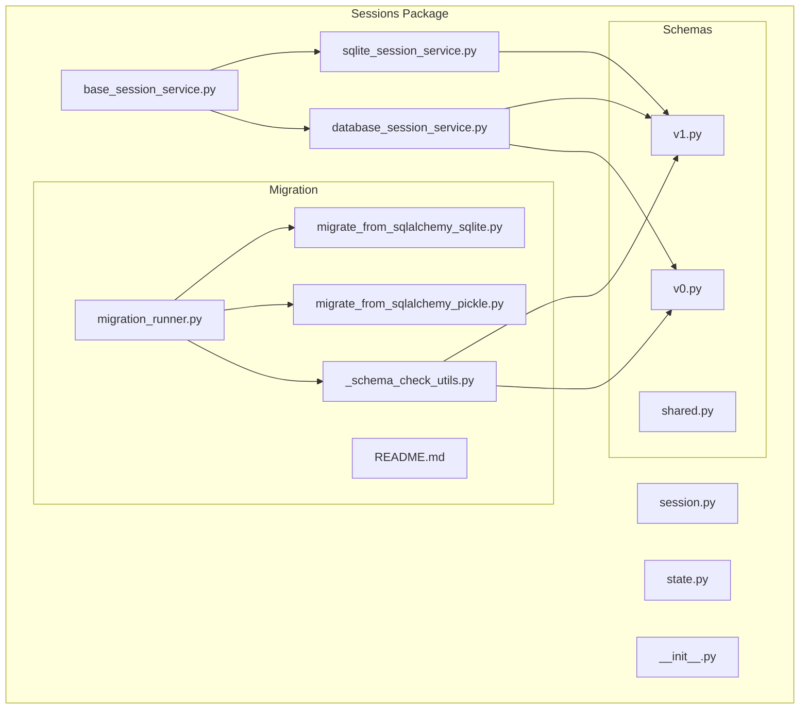
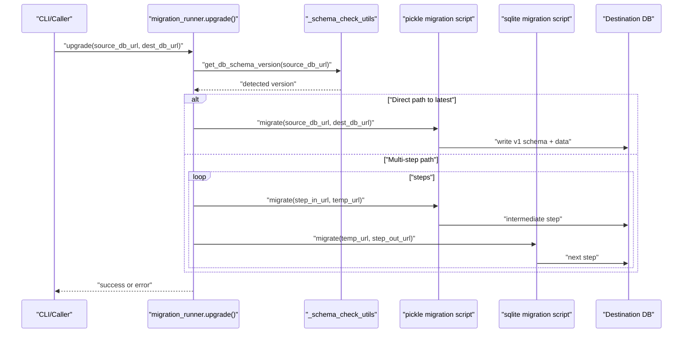
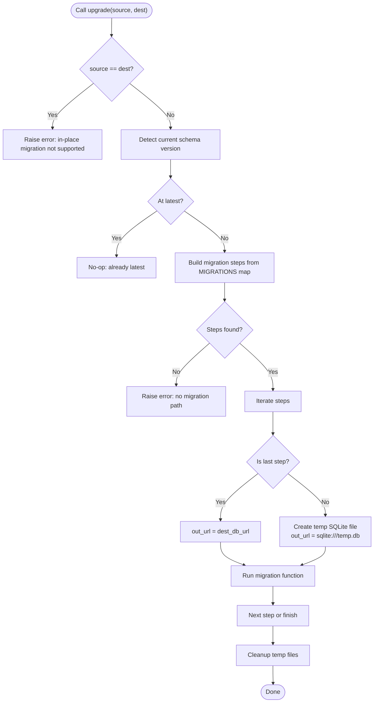
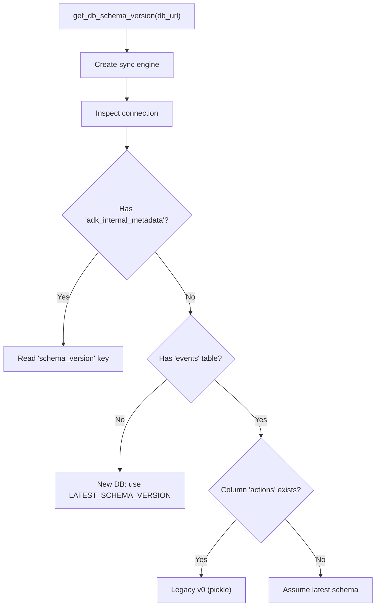
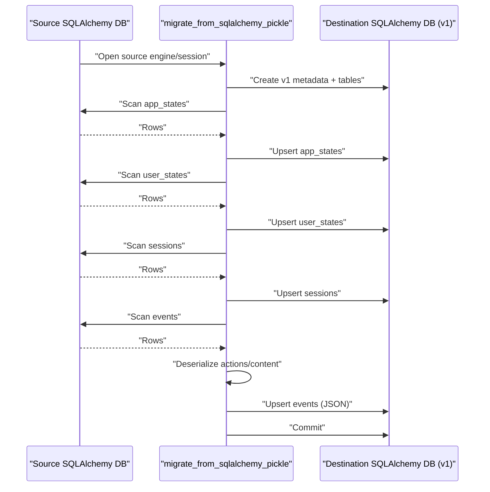
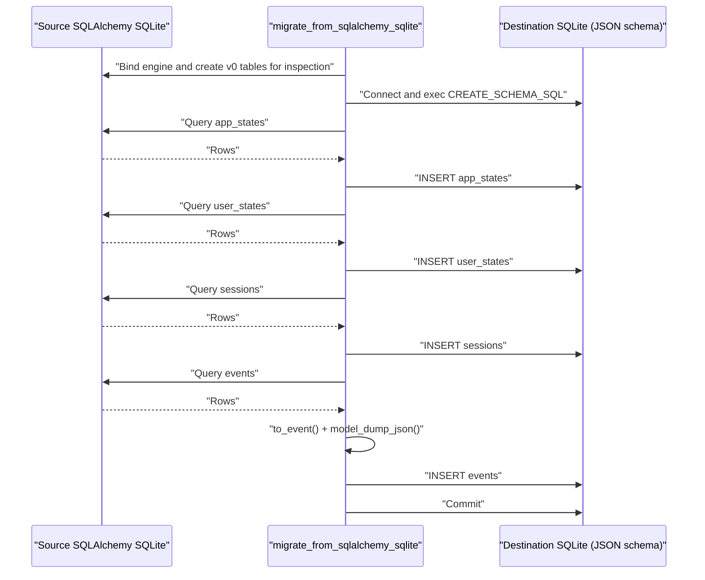
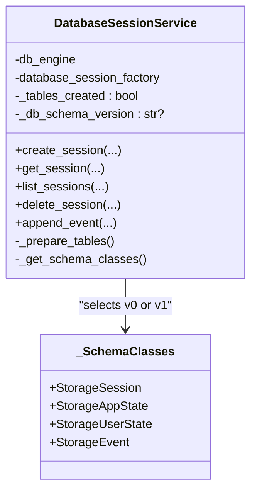
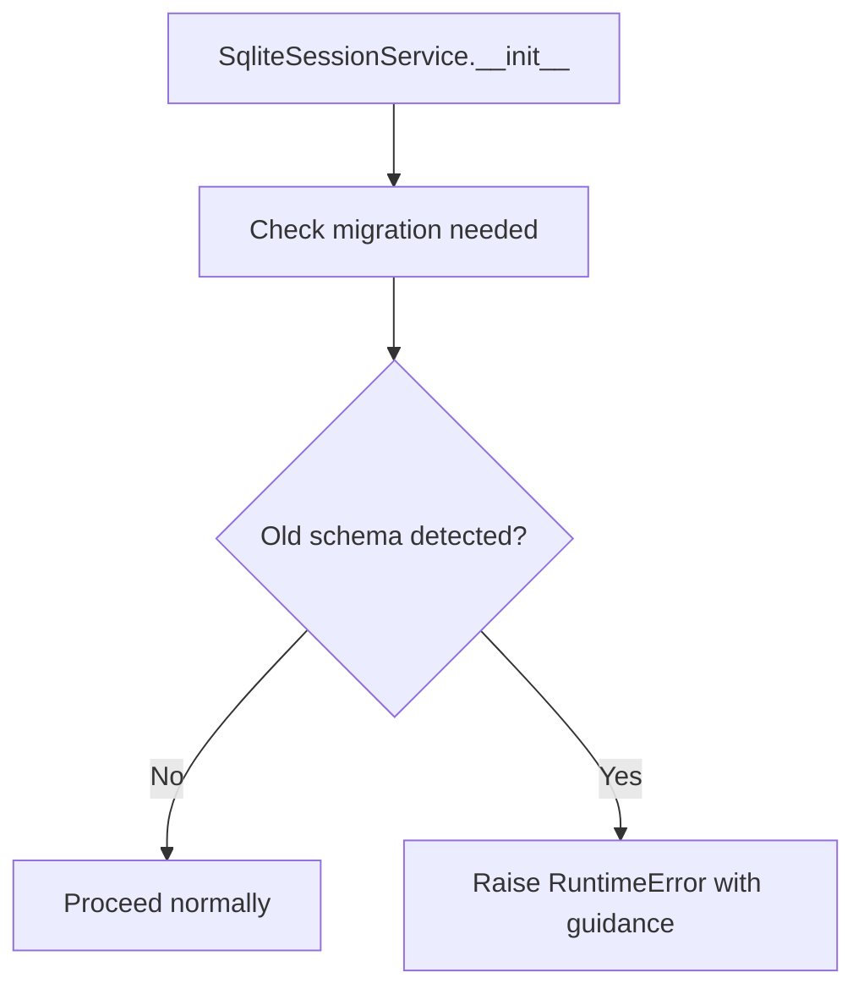
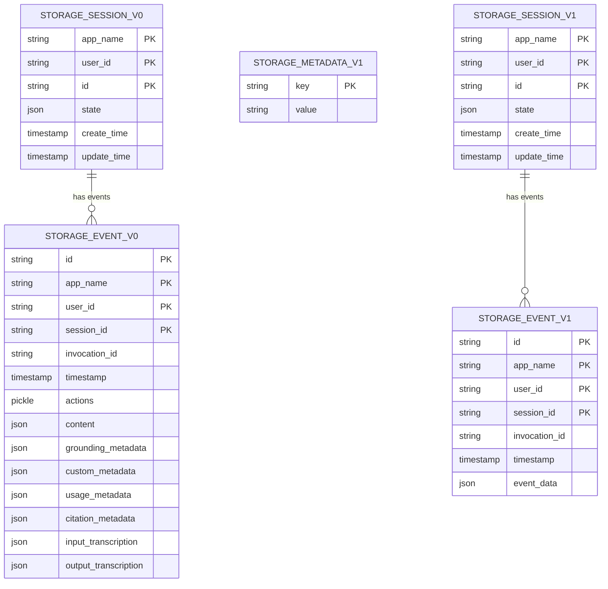
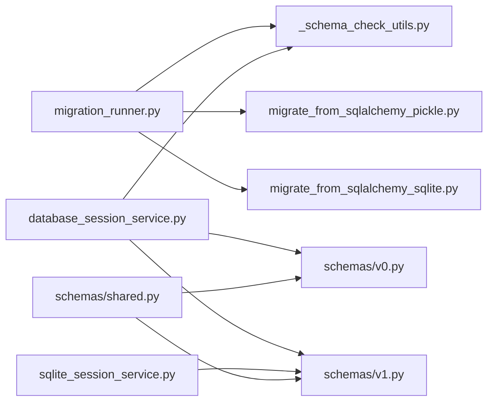

# Session Migration and Schema Evolution

<cite>
**Referenced Files in This Document**
- [sessions/__init__.py](file://src/google/adk/sessions/__init__.py)
- [sessions/session.py](file://src/google/adk/sessions/session.py)
- [sessions/state.py](file://src/google/adk/sessions/state.py)
- [sessions/base_session_service.py](file://src/google/adk/sessions/base_session_service.py)
- [sessions/database_session_service.py](file://src/google/adk/sessions/database_session_service.py)
- [sessions/sqlite_session_service.py](file://src/google/adk/sessions/sqlite_session_service.py)
- [sessions/migration/README.md](file://src/google/adk/sessions/migration/README.md)
- [sessions/migration/migration_runner.py](file://src/google/adk/sessions/migration/migration_runner.py)
- [sessions/migration/_schema_check_utils.py](file://src/google/adk/sessions/migration/_schema_check_utils.py)
- [sessions/migration/migrate_from_sqlalchemy_pickle.py](file://src/google/adk/sessions/migration/migrate_from_sqlalchemy_pickle.py)
- [sessions/migration/migrate_from_sqlalchemy_sqlite.py](file://src/google/adk/sessions/migration/migrate_from_sqlalchemy_sqlite.py)
- [sessions/schemas/v0.py](file://src/google/adk/sessions/schemas/v0.py)
- [sessions/schemas/v1.py](file://src/google/adk/sessions/schemas/v1.py)
- [sessions/schemas/shared.py](file://src/google/adk/sessions/schemas/shared.py)
</cite>

## Table of Contents
1. [Introduction](#introduction)
2. [Project Structure](#project-structure)
3. [Core Components](#core-components)
4. [Architecture Overview](#architecture-overview)
5. [Detailed Component Analysis](#detailed-component-analysis)
6. [Dependency Analysis](#dependency-analysis)
7. [Performance Considerations](#performance-considerations)
8. [Troubleshooting Guide](#troubleshooting-guide)
9. [Conclusion](#conclusion)
10. [Appendices](#appendices)

## Introduction
This document explains the session migration and schema evolution capabilities in ADK. It covers how the system detects and migrates between session storage formats, the migration runner architecture, and strategies for handling breaking changes. It documents the pickle-to-JSON migration for SQLAlchemy-backed databases and the SQLite schema migration path, along with schema versioning, compatibility checks, rollback procedures, and production deployment guidance. Practical examples and troubleshooting advice are included to help teams plan, test, and deploy migrations safely.

## Project Structure
The session migration and schema evolution features are centered in the sessions package with dedicated modules for schemas, migration utilities, and backend-specific services.

**Diagram sources**
- [sessions/base_session_service.py](file://src/google/adk/sessions/base_session_service.py#L45-L154)
- [sessions/database_session_service.py](file://src/google/adk/sessions/database_session_service.py#L135-L661)
- [sessions/sqlite_session_service.py](file://src/google/adk/sessions/sqlite_session_service.py#L132-L596)
- [sessions/migration/migration_runner.py](file://src/google/adk/sessions/migration/migration_runner.py#L45-L128)
- [sessions/migration/_schema_check_utils.py](file://src/google/adk/sessions/migration/_schema_check_utils.py#L115-L142)
- [sessions/migration/migrate_from_sqlalchemy_pickle.py](file://src/google/adk/sessions/migration/migrate_from_sqlalchemy_pickle.py#L166-L296)
- [sessions/migration/migrate_from_sqlalchemy_sqlite.py](file://src/google/adk/sessions/migration/migrate_from_sqlalchemy_sqlite.py#L34-L148)
- [sessions/schemas/v0.py](file://src/google/adk/sessions/schemas/v0.py#L98-L387)
- [sessions/schemas/v1.py](file://src/google/adk/sessions/schemas/v1.py#L70-L248)
- [sessions/schemas/shared.py](file://src/google/adk/sessions/schemas/shared.py#L29-L68)

**Section sources**
- [sessions/__init__.py](file://src/google/adk/sessions/__init__.py#L14-L42)
- [sessions/base_session_service.py](file://src/google/adk/sessions/base_session_service.py#L45-L154)
- [sessions/database_session_service.py](file://src/google/adk/sessions/database_session_service.py#L135-L661)
- [sessions/sqlite_session_service.py](file://src/google/adk/sessions/sqlite_session_service.py#L132-L596)
- [sessions/migration/README.md](file://src/google/adk/sessions/migration/README.md#L1-L129)
- [sessions/migration/migration_runner.py](file://src/google/adk/sessions/migration/migration_runner.py#L45-L128)
- [sessions/migration/_schema_check_utils.py](file://src/google/adk/sessions/migration/_schema_check_utils.py#L115-L142)
- [sessions/migration/migrate_from_sqlalchemy_pickle.py](file://src/google/adk/sessions/migration/migrate_from_sqlalchemy_pickle.py#L166-L296)
- [sessions/migration/migrate_from_sqlalchemy_sqlite.py](file://src/google/adk/sessions/migration/migrate_from_sqlalchemy_sqlite.py#L34-L148)
- [sessions/schemas/v0.py](file://src/google/adk/sessions/schemas/v0.py#L98-L387)
- [sessions/schemas/v1.py](file://src/google/adk/sessions/schemas/v1.py#L70-L248)
- [sessions/schemas/shared.py](file://src/google/adk/sessions/schemas/shared.py#L29-L68)

## Core Components
- Migration runner: Orchestrates multi-step migrations, validates compatibility, and manages temporary databases for cross-backend conversions.
- Schema detection utilities: Detects current schema version from metadata tables or legacy table/column structures.
- SQLAlchemy pickle-to-JSON migration: Converts legacy pickle-serialized event actions to JSON for improved portability and safety.
- SQLite schema migration: Migrates existing SQLAlchemy-based SQLite databases to the new JSON-based schema.
- Database session service: Supports both v0 and v1 schemas, dynamically selecting appropriate models and ensuring metadata is set.
- SQLite session service: Enforces new schema and rejects legacy schemas with clear guidance.

**Section sources**
- [sessions/migration/migration_runner.py](file://src/google/adk/sessions/migration/migration_runner.py#L45-L128)
- [sessions/migration/_schema_check_utils.py](file://src/google/adk/sessions/migration/_schema_check_utils.py#L32-L76)
- [sessions/migration/migrate_from_sqlalchemy_pickle.py](file://src/google/adk/sessions/migration/migrate_from_sqlalchemy_pickle.py#L166-L296)
- [sessions/migration/migrate_from_sqlalchemy_sqlite.py](file://src/google/adk/sessions/migration/migrate_from_sqlalchemy_sqlite.py#L34-L148)
- [sessions/database_session_service.py](file://src/google/adk/sessions/database_session_service.py#L196-L311)
- [sessions/sqlite_session_service.py](file://src/google/adk/sessions/sqlite_session_service.py#L139-L154)

## Architecture Overview
The migration architecture separates concerns across detection, orchestration, and backend-specific migration scripts. The runner reads the current schema, builds a migration path, and executes scripts sequentially, using temporary SQLite databases for intermediate steps when crossing different database backends.

**Diagram sources**
- [sessions/migration/migration_runner.py](file://src/google/adk/sessions/migration/migration_runner.py#L45-L128)
- [sessions/migration/_schema_check_utils.py](file://src/google/adk/sessions/migration/_schema_check_utils.py#L115-L142)
- [sessions/migration/migrate_from_sqlalchemy_pickle.py](file://src/google/adk/sessions/migration/migrate_from_sqlalchemy_pickle.py#L166-L296)
- [sessions/migration/migrate_from_sqlalchemy_sqlite.py](file://src/google/adk/sessions/migration/migrate_from_sqlalchemy_sqlite.py#L34-L148)

## Detailed Component Analysis

### Migration Runner System
The runner coordinates migrations from any detected version to the latest. It enforces separate source and destination URLs, constructs a stepwise migration plan, and cleans up temporary files afterward.

**Diagram sources**
- [sessions/migration/migration_runner.py](file://src/google/adk/sessions/migration/migration_runner.py#L45-L128)

**Section sources**
- [sessions/migration/migration_runner.py](file://src/google/adk/sessions/migration/migration_runner.py#L45-L128)

### Schema Detection and Versioning
Schema detection prioritizes a metadata table for versioning, with fallbacks to legacy table/column inspection. It supports v0 (pickle-based), v1 (JSON-based), and a latest constant.

**Diagram sources**
- [sessions/migration/_schema_check_utils.py](file://src/google/adk/sessions/migration/_schema_check_utils.py#L115-L142)
- [sessions/migration/_schema_check_utils.py](file://src/google/adk/sessions/migration/_schema_check_utils.py#L32-L76)

**Section sources**
- [sessions/migration/_schema_check_utils.py](file://src/google/adk/sessions/migration/_schema_check_utils.py#L26-L76)
- [sessions/migration/_schema_check_utils.py](file://src/google/adk/sessions/migration/_schema_check_utils.py#L115-L142)

### Pickle-Based Migration (SQLAlchemy)
This migration converts legacy pickle-serialized event actions to JSON, recreating v1 schema tables and upserting data. It handles diverse JSON/bytes formats and logs warnings for malformed rows.

**Diagram sources**
- [sessions/migration/migrate_from_sqlalchemy_pickle.py](file://src/google/adk/sessions/migration/migrate_from_sqlalchemy_pickle.py#L166-L296)
- [sessions/schemas/v1.py](file://src/google/adk/sessions/schemas/v1.py#L55-L248)

**Section sources**
- [sessions/migration/migrate_from_sqlalchemy_pickle.py](file://src/google/adk/sessions/migration/migrate_from_sqlalchemy_pickle.py#L166-L296)
- [sessions/schemas/v1.py](file://src/google/adk/sessions/schemas/v1.py#L55-L248)

### SQLite-Based Migration
This migration targets SQLAlchemy-based SQLite databases, recreating the new JSON-based schema and inserting data using native SQLite APIs.

**Diagram sources**
- [sessions/migration/migrate_from_sqlalchemy_sqlite.py](file://src/google/adk/sessions/migration/migrate_from_sqlalchemy_sqlite.py#L34-L148)
- [sessions/sqlite_session_service.py](file://src/google/adk/sessions/sqlite_session_service.py#L88-L93)

**Section sources**
- [sessions/migration/migrate_from_sqlalchemy_sqlite.py](file://src/google/adk/sessions/migration/migrate_from_sqlalchemy_sqlite.py#L34-L148)
- [sessions/sqlite_session_service.py](file://src/google/adk/sessions/sqlite_session_service.py#L88-L93)

### Database Session Service Compatibility
The service dynamically selects schema classes based on detected version, ensures tables are created, and initializes metadata if missing. It branches logic for different dialects and timestamps.

**Diagram sources**
- [sessions/database_session_service.py](file://src/google/adk/sessions/database_session_service.py#L135-L661)
- [sessions/database_session_service.py](file://src/google/adk/sessions/database_session_service.py#L196-L197)

**Section sources**
- [sessions/database_session_service.py](file://src/google/adk/sessions/database_session_service.py#L196-L311)

### SQLite Session Service Enforcement
The SQLite service enforces the new schema and raises a clear error if an old schema is detected, guiding users to run the migration script and replace the database file.

**Diagram sources**
- [sessions/sqlite_session_service.py](file://src/google/adk/sessions/sqlite_session_service.py#L139-L154)

**Section sources**
- [sessions/sqlite_session_service.py](file://src/google/adk/sessions/sqlite_session_service.py#L139-L154)

### Schema Models and Backward Compatibility
- v0 schema uses pickle serialization for event actions and a metadata-free approach.
- v1 schema consolidates event data into a single JSON field and adds a metadata table for versioning.
- Shared utilities define JSON and timestamp types across dialects.

**Diagram sources**
- [sessions/schemas/v0.py](file://src/google/adk/sessions/schemas/v0.py#L98-L387)
- [sessions/schemas/v1.py](file://src/google/adk/sessions/schemas/v1.py#L70-L248)

**Section sources**
- [sessions/schemas/v0.py](file://src/google/adk/sessions/schemas/v0.py#L98-L387)
- [sessions/schemas/v1.py](file://src/google/adk/sessions/schemas/v1.py#L55-L248)
- [sessions/schemas/shared.py](file://src/google/adk/sessions/schemas/shared.py#L29-L68)

## Dependency Analysis
- Migration runner depends on schema detection utilities and migration scripts.
- Database session service depends on both v0 and v1 schema models and metadata.
- SQLite session service depends on the new JSON schema SQL definitions.
- Shared utilities provide JSON and timestamp handling across schemas.

**Diagram sources**
- [sessions/migration/migration_runner.py](file://src/google/adk/sessions/migration/migration_runner.py#L23-L42)
- [sessions/migration/_schema_check_utils.py](file://src/google/adk/sessions/migration/_schema_check_utils.py#L26-L29)
- [sessions/database_session_service.py](file://src/google/adk/sessions/database_session_service.py#L48-L58)
- [sessions/sqlite_session_service.py](file://src/google/adk/sessions/sqlite_session_service.py#L88-L93)
- [sessions/schemas/shared.py](file://src/google/adk/sessions/schemas/shared.py#L29-L68)

**Section sources**
- [sessions/migration/migration_runner.py](file://src/google/adk/sessions/migration/migration_runner.py#L23-L42)
- [sessions/database_session_service.py](file://src/google/adk/sessions/database_session_service.py#L48-L58)
- [sessions/sqlite_session_service.py](file://src/google/adk/sessions/sqlite_session_service.py#L88-L93)
- [sessions/schemas/shared.py](file://src/google/adk/sessions/schemas/shared.py#L29-L68)

## Performance Considerations
- Migration scripts iterate over tables and upsert records; batching and indexing on target tables can improve throughput.
- Temporary SQLite files are used for cross-backend migrations; ensure sufficient disk space and avoid slow network filesystems.
- Database session service uses lazy table preparation and async sessions; ensure connection pooling and dialect-specific optimizations (e.g., pool_pre_ping) are configured appropriately.
- SQLite JSON operations leverage JSON1 extensions; ensure the runtime environment supports them for optimal performance.

[No sources needed since this section provides general guidance]

## Troubleshooting Guide
Common issues and resolutions:
- In-place migration error: The runner disallows source_db_url equal to dest_db_url. Use distinct URLs for source and destination.
- No migration path error: Detected version lacks a registered migration step. Upgrade incrementally or register the missing migration.
- Legacy v0 schema warning: Detected legacy pickle-based schema. Use the provided migration command to move to v1.
- SQLite old schema detected: The service refuses to operate on legacy schemas. Run the SQLite migration script and replace the database file.
- Connection errors: Verify database URLs, credentials, and driver availability. For async drivers, the detection utilities convert to synchronous URLs internally.
- Data integrity: Migration scripts commit on success and rollback on exceptions. Review logs for warnings about malformed rows and fix data before retrying.

**Section sources**
- [sessions/migration/migration_runner.py](file://src/google/adk/sessions/migration/migration_runner.py#L69-L94)
- [sessions/migration/_schema_check_utils.py](file://src/google/adk/sessions/migration/_schema_check_utils.py#L63-L71)
- [sessions/sqlite_session_service.py](file://src/google/adk/sessions/sqlite_session_service.py#L145-L154)
- [sessions/migration/migrate_from_sqlalchemy_pickle.py](file://src/google/adk/sessions/migration/migrate_from_sqlalchemy_pickle.py#L292-L295)

## Conclusion
ADK’s session migration and schema evolution system provides robust, stepwise upgrades from legacy pickle-based schemas to modern JSON-based schemas. The migration runner, detection utilities, and backend-specific scripts work together to ensure safe, reversible upgrades across different database backends. Teams can plan migrations incrementally, validate compatibility, and deploy confidently with clear rollback and error-handling mechanisms.

[No sources needed since this section summarizes without analyzing specific files]

## Appendices

### Migration Planning Checklist
- Assess current schema using detection utilities or CLI commands.
- Plan incremental upgrades if multiple steps are required.
- Back up source databases before running migrations.
- Test migrations on staging environments with representative datasets.
- Coordinate zero-downtime deployments by routing traffic away from affected services during migration windows.

[No sources needed since this section provides general guidance]

### Testing Procedures
- Unit test migration scripts against known-good fixtures for event/action formats.
- Validate that event_data roundtrips correctly (to_event/from_event) for both v0 and v1.
- Confirm metadata table creation and version updates in target databases.
- Simulate failure scenarios (network interruptions, malformed rows) and verify rollback behavior.

[No sources needed since this section provides general guidance]

### Production Deployment Strategies
- Use the runner to perform multi-step migrations with temporary SQLite intermediates for cross-backend conversions.
- Schedule maintenance windows to minimize impact; prefer off-peak hours.
- Monitor migration logs and alert on warnings or errors.
- After successful migration, verify application behavior end-to-end and confirm schema version metadata.

[No sources needed since this section provides general guidance]

### Rollback Procedures
- For SQLAlchemy migrations, keep the original database intact until verification passes.
- For SQLite migrations, retain the original file and only replace it after confirming correctness.
- If issues arise, re-run the migration with corrected data or revert to the preserved backup.

[No sources needed since this section provides general guidance]