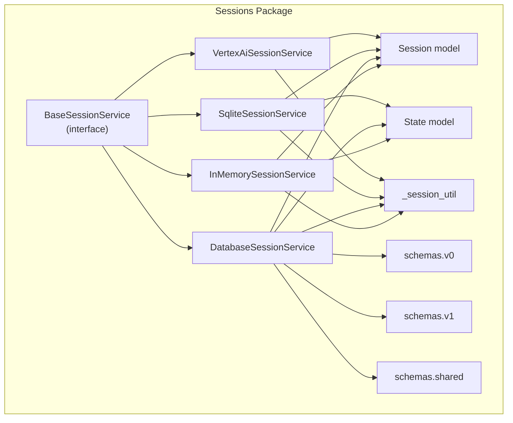
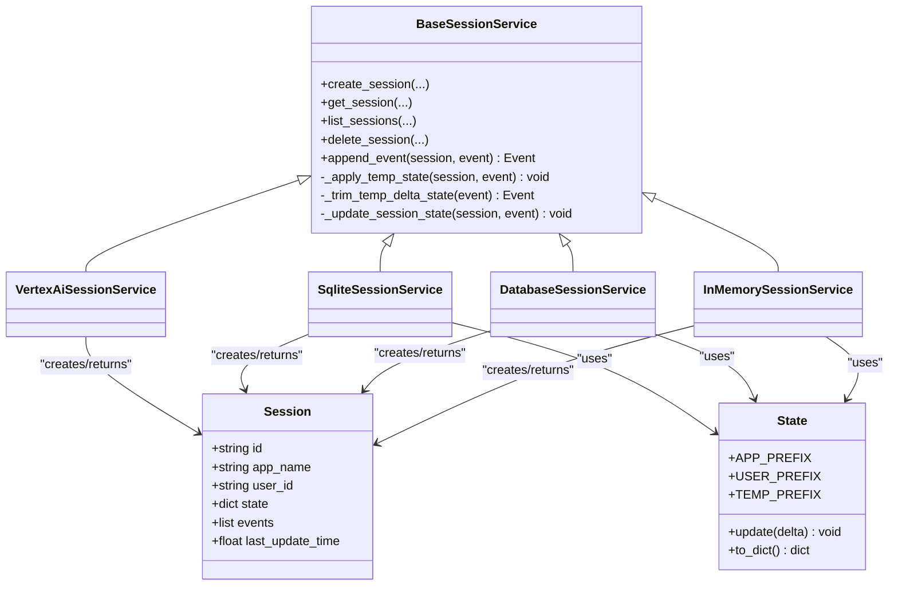
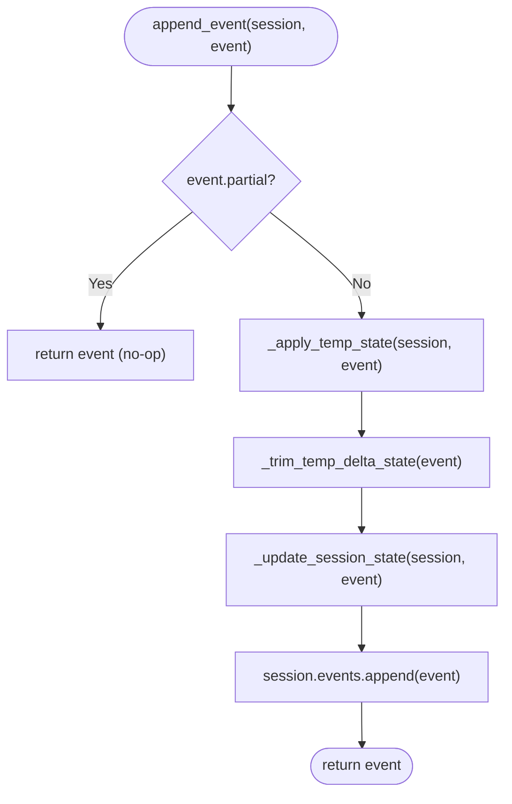
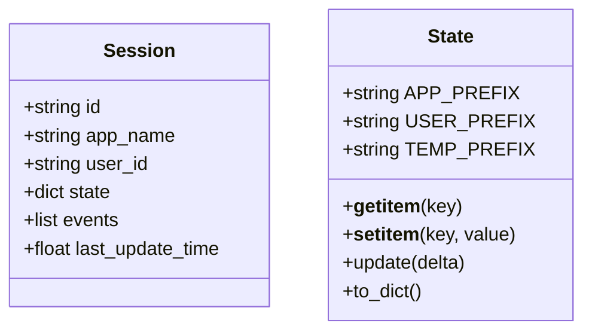
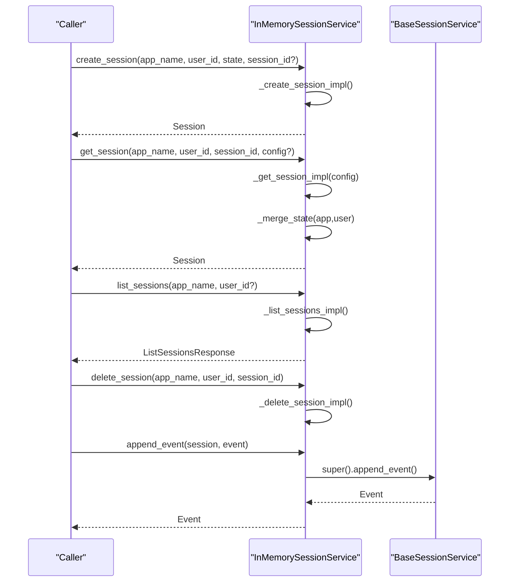
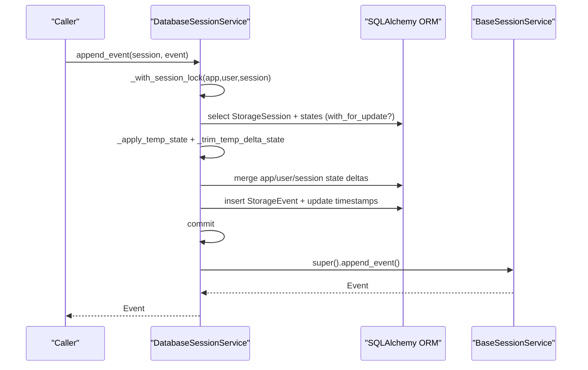
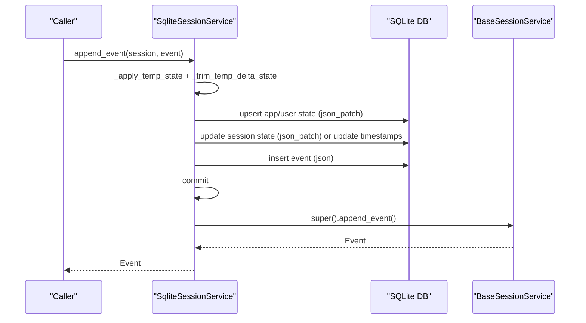
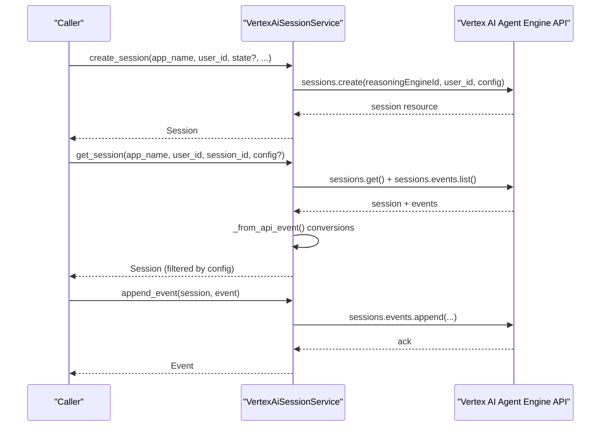
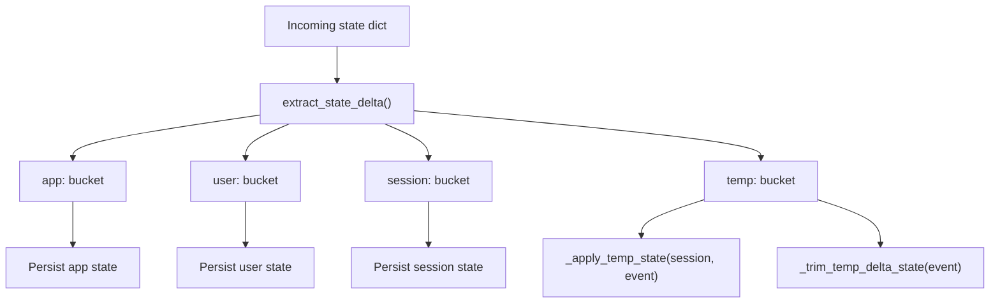
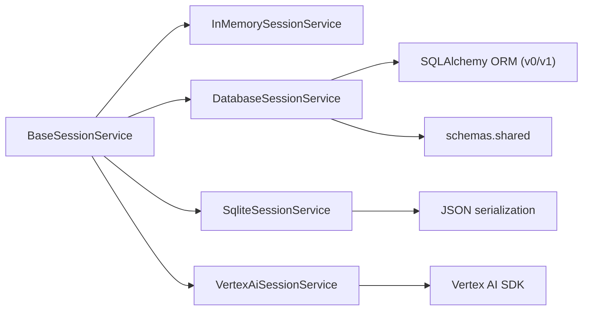

# Session Service Architecture

<cite>
**Referenced Files in This Document**
- [base_session_service.py](file://src/google/adk/sessions/base_session_service.py)
- [session.py](file://src/google/adk/sessions/session.py)
- [state.py](file://src/google/adk/sessions/state.py)
- [in_memory_session_service.py](file://src/google/adk/sessions/in_memory_session_service.py)
- [database_session_service.py](file://src/google/adk/sessions/database_session_service.py)
- [sqlite_session_service.py](file://src/google/adk/sessions/sqlite_session_service.py)
- [vertex_ai_session_service.py](file://src/google/adk/sessions/vertex_ai_session_service.py)
- [_session_util.py](file://src/google/adk/sessions/_session_util.py)
- [v0.py](file://src/google/adk/sessions/schemas/v0.py)
- [v1.py](file://src/google/adk/sessions/schemas/v1.py)
- [shared.py](file://src/google/adk/sessions/schemas/shared.py)
- [__init__.py](file://src/google/adk/sessions/__init__.py)
</cite>

## Table of Contents
1. [Introduction](#introduction)
2. [Project Structure](#project-structure)
3. [Core Components](#core-components)
4. [Architecture Overview](#architecture-overview)
5. [Detailed Component Analysis](#detailed-component-analysis)
6. [Dependency Analysis](#dependency-analysis)
7. [Performance Considerations](#performance-considerations)
8. [Troubleshooting Guide](#troubleshooting-guide)
9. [Conclusion](#conclusion)

## Introduction
This document explains the session service architecture in the ADK framework. It focuses on the abstract BaseSessionService interface and its role in enabling pluggable session backends. It documents the core session lifecycle operations (create_session, get_session, list_sessions, delete_session), the session model structure, event handling mechanisms, and state management patterns. It also covers the GetSessionConfig and ListSessionsResponse models, the event append mechanism, temporary state handling, and state delta processing. Finally, it provides architectural diagrams and guidance on how different implementations can be seamlessly swapped.

## Project Structure
The session subsystem resides under src/google/adk/sessions and includes:
- An abstract base interface (BaseSessionService)
- Concrete implementations for in-memory, SQL databases (via SQLAlchemy), SQLite, and Vertex AI Agent Engine
- Supporting models for sessions, state, and event utilities
- Schema definitions for database-backed implementations

**Diagram sources**
- [base_session_service.py](file://src/google/adk/sessions/base_session_service.py#L45-L154)
- [in_memory_session_service.py](file://src/google/adk/sessions/in_memory_session_service.py#L37-L339)
- [database_session_service.py](file://src/google/adk/sessions/database_session_service.py#L135-L661)
- [sqlite_session_service.py](file://src/google/adk/sessions/sqlite_session_service.py#L132-L596)
- [vertex_ai_session_service.py](file://src/google/adk/sessions/vertex_ai_session_service.py#L46-L438)
- [session.py](file://src/google/adk/sessions/session.py#L27-L51)
- [state.py](file://src/google/adk/sessions/state.py#L20-L82)
- [v0.py](file://src/google/adk/sessions/schemas/v0.py#L92-L387)
- [v1.py](file://src/google/adk/sessions/schemas/v1.py#L49-L248)
- [shared.py](file://src/google/adk/sessions/schemas/shared.py#L29-L68)
- [_session_util.py](file://src/google/adk/sessions/_session_util.py#L37-L51)

**Section sources**
- [__init__.py](file://src/google/adk/sessions/__init__.py#L14-L42)

## Core Components
- BaseSessionService: Defines the contract for session management and event appending, including abstract methods for create_session, get_session, list_sessions, delete_session, and a reusable append_event pipeline that manages temporary state, trims temp deltas, and updates persistent state.
- Session: Pydantic model representing a conversation session with identifiers, state dictionary, event list, and last update time.
- State: Encapsulates state dictionaries with value and delta tracking, supporting prefix-based separation (app:, user:, temp:).
- GetSessionConfig: Optional configuration for get_session to limit returned events by recency or timestamp.
- ListSessionsResponse: Response wrapper for list_sessions, returning a list of sessions without embedded events.
- Event utilities: Functions to extract state deltas by prefix and decode models from JSON-compatible structures.

Key responsibilities:
- Abstraction: BaseSessionService isolates consumers from storage specifics.
- Event append pipeline: Centralized logic for applying temp state, trimming temp deltas, updating session state, and appending events.
- State delta extraction: Utilities to split state into app/user/session deltas for proper persistence.

**Section sources**
- [base_session_service.py](file://src/google/adk/sessions/base_session_service.py#L29-L154)
- [session.py](file://src/google/adk/sessions/session.py#L27-L51)
- [state.py](file://src/google/adk/sessions/state.py#L20-L82)
- [_session_util.py](file://src/google/adk/sessions/_session_util.py#L37-L51)

## Architecture Overview
The session service architecture is layered:
- Interface layer: BaseSessionService defines the API.
- Implementation layer: Pluggable services implement the interface (in-memory, SQL-backed, SQLite, Vertex AI).
- Model and utility layer: Session, State, and utilities for state delta extraction and decoding.
- Persistence layer: SQLAlchemy ORM models (v0/v1) and SQLite schema for SQL-backed services.

**Diagram sources**
- [base_session_service.py](file://src/google/adk/sessions/base_session_service.py#L45-L154)
- [in_memory_session_service.py](file://src/google/adk/sessions/in_memory_session_service.py#L37-L339)
- [database_session_service.py](file://src/google/adk/sessions/database_session_service.py#L135-L661)
- [sqlite_session_service.py](file://src/google/adk/sessions/sqlite_session_service.py#L132-L596)
- [vertex_ai_session_service.py](file://src/google/adk/sessions/vertex_ai_session_service.py#L46-L438)
- [session.py](file://src/google/adk/sessions/session.py#L27-L51)
- [state.py](file://src/google/adk/sessions/state.py#L20-L82)

## Detailed Component Analysis

### BaseSessionService: Abstract Interface and Event Append Pipeline
- Lifecycle methods:
  - create_session: Creates a new session with optional client-provided ID and initial state.
  - get_session: Retrieves a session optionally filtered by recency or timestamp.
  - list_sessions: Lists sessions for a user or across users.
  - delete_session: Removes a session.
- Event append pipeline:
  - append_event: Applies temp state to in-memory session, trims temp delta from event, updates session state, appends event to the list.
  - _apply_temp_state: Propagates temp-scoped state into the in-memory session state for the current invocation.
  - _trim_temp_delta_state: Removes temp-prefixed keys from event state deltas to prevent persistence.
  - _update_session_state: Persists non-temp state deltas into the session’s state.

**Diagram sources**
- [base_session_service.py](file://src/google/adk/sessions/base_session_service.py#L105-L154)

**Section sources**
- [base_session_service.py](file://src/google/adk/sessions/base_session_service.py#L45-L154)

### Session Model and State Management
- Session: Holds identifiers, state dictionary, event list, and last update time. Uses Pydantic configuration for strictness and camelCase aliasing.
- State: Manages current value and pending delta, with helpers to merge deltas into the effective state. Supports prefix-based namespaces:
  - app: for application-wide state
  - user: for user-scoped state
  - temp: for ephemeral state scoped to the current invocation

**Diagram sources**
- [session.py](file://src/google/adk/sessions/session.py#L27-L51)
- [state.py](file://src/google/adk/sessions/state.py#L20-L82)

**Section sources**
- [session.py](file://src/google/adk/sessions/session.py#L27-L51)
- [state.py](file://src/google/adk/sessions/state.py#L20-L82)

### GetSessionConfig and ListSessionsResponse
- GetSessionConfig: Optional parameters for get_session to constrain returned events:
  - num_recent_events: Limit to most recent N events.
  - after_timestamp: Include only events after a given timestamp.
- ListSessionsResponse: Container for list_sessions results, providing a list of Session objects without embedded events.

Usage:
- In-memory and SQL-backed services honor these filters when retrieving sessions.
- Vertex AI service applies similar filtering semantics using API capabilities.

**Section sources**
- [base_session_service.py](file://src/google/adk/sessions/base_session_service.py#L29-L43)

### InMemorySessionService
- Purpose: Non-persistent, in-memory storage for testing and development.
- Behavior:
  - Stores sessions, app state, and user state in memory.
  - Merges app/user state into session state on retrieval.
  - Implements all lifecycle methods and delegates event append to the base pipeline.

**Diagram sources**
- [in_memory_session_service.py](file://src/google/adk/sessions/in_memory_session_service.py#L37-L339)
- [base_session_service.py](file://src/google/adk/sessions/base_session_service.py#L105-L154)

**Section sources**
- [in_memory_session_service.py](file://src/google/adk/sessions/in_memory_session_service.py#L37-L339)

### DatabaseSessionService (SQLAlchemy)
- Purpose: Persistent session storage using SQLAlchemy with support for multiple dialects and schema versions.
- Features:
  - Lazy table creation and schema version detection.
  - Row-level locking support for selected dialects to serialize concurrent appends.
  - State delta extraction and merging across app/user/session scopes.
  - Robust timestamp handling for SQLite vs. other databases.
  - Transaction rollback-on-exception guard.

**Diagram sources**
- [database_session_service.py](file://src/google/adk/sessions/database_session_service.py#L520-L648)
- [base_session_service.py](file://src/google/adk/sessions/base_session_service.py#L105-L154)
- [v1.py](file://src/google/adk/sessions/schemas/v1.py#L153-L213)

**Section sources**
- [database_session_service.py](file://src/google/adk/sessions/database_session_service.py#L135-L661)
- [v0.py](file://src/google/adk/sessions/schemas/v0.py#L98-L351)
- [v1.py](file://src/google/adk/sessions/schemas/v1.py#L70-L248)
- [shared.py](file://src/google/adk/sessions/schemas/shared.py#L29-L68)

### SqliteSessionService
- Purpose: SQLite-backed session service using aiosqlite with JSON serialization for flexible event storage.
- Features:
  - Automatic schema initialization and foreign key enforcement.
  - JSON patch-based atomic updates for app/user/session state.
  - Event data stored as JSON to accommodate evolving schemas.
  - Migration guard to detect legacy schema and guide migration.

**Diagram sources**
- [sqlite_session_service.py](file://src/google/adk/sessions/sqlite_session_service.py#L359-L456)
- [base_session_service.py](file://src/google/adk/sessions/base_session_service.py#L105-L154)

**Section sources**
- [sqlite_session_service.py](file://src/google/adk/sessions/sqlite_session_service.py#L132-L596)

### VertexAiSessionService
- Purpose: Integrates with Vertex AI Agent Engine Sessions API.
- Features:
  - Creates sessions via API and retrieves sessions/events in parallel.
  - Converts API event objects to internal Event models and vice versa.
  - Stores compaction data in custom metadata for backward compatibility.
  - Honors GetSessionConfig for timestamp-based filtering and recent event limits.

**Diagram sources**
- [vertex_ai_session_service.py](file://src/google/adk/sessions/vertex_ai_session_service.py#L80-L321)

**Section sources**
- [vertex_ai_session_service.py](file://src/google/adk/sessions/vertex_ai_session_service.py#L46-L438)

### State Delta Processing and Temporary State Handling
- Prefix-based separation:
  - Keys prefixed with app: are stored in app-scoped state.
  - Keys prefixed with user: are stored in user-scoped state.
  - Keys prefixed with temp: are ephemeral and applied to in-memory session state during the current invocation only.
  - Other keys are treated as session state.
- Extraction and trimming:
  - extract_state_delta splits incoming state into app/user/session buckets.
  - _trim_temp_delta_state removes temp-prefixed keys from event state deltas before persistence.
- Merge semantics:
  - Retrieval merges app/user/session state into the effective session state for the consumer.

**Diagram sources**
- [_session_util.py](file://src/google/adk/sessions/_session_util.py#L37-L51)
- [base_session_service.py](file://src/google/adk/sessions/base_session_service.py#L118-L154)
- [state.py](file://src/google/adk/sessions/state.py#L20-L82)

**Section sources**
- [_session_util.py](file://src/google/adk/sessions/_session_util.py#L37-L51)
- [base_session_service.py](file://src/google/adk/sessions/base_session_service.py#L118-L154)
- [state.py](file://src/google/adk/sessions/state.py#L20-L82)

## Dependency Analysis
- Cohesion: BaseSessionService centralizes event append logic, improving cohesion across implementations.
- Coupling: Implementations depend on Session, State, and _session_util, but not on each other, enabling loose coupling.
- External dependencies:
  - SQLAlchemy for DatabaseSessionService (engines, sessions, ORM models).
  - aiosqlite for SqliteSessionService.
  - Vertex AI SDK for VertexAiSessionService.
- Potential circular dependencies: None observed among session components.

**Diagram sources**
- [base_session_service.py](file://src/google/adk/sessions/base_session_service.py#L45-L154)
- [database_session_service.py](file://src/google/adk/sessions/database_session_service.py#L135-L661)
- [sqlite_session_service.py](file://src/google/adk/sessions/sqlite_session_service.py#L132-L596)
- [vertex_ai_session_service.py](file://src/google/adk/sessions/vertex_ai_session_service.py#L46-L438)
- [v0.py](file://src/google/adk/sessions/schemas/v0.py#L92-L387)
- [v1.py](file://src/google/adk/sessions/schemas/v1.py#L49-L248)
- [shared.py](file://src/google/adk/sessions/schemas/shared.py#L29-L68)

**Section sources**
- [database_session_service.py](file://src/google/adk/sessions/database_session_service.py#L135-L661)
- [sqlite_session_service.py](file://src/google/adk/sessions/sqlite_session_service.py#L132-L596)
- [vertex_ai_session_service.py](file://src/google/adk/sessions/vertex_ai_session_service.py#L46-L438)

## Performance Considerations
- Concurrency:
  - DatabaseSessionService uses per-session locks to serialize event appends within a process, reducing race conditions on state updates.
  - SQLiteSessionService relies on transaction isolation and JSON patch updates for atomicity.
- Timestamp handling:
  - Specialized logic for SQLite timezone handling ensures accurate last_update_time comparisons.
- Event retrieval:
  - Filtering by num_recent_events and after_timestamp reduces payload sizes and improves latency.
- Memory footprint:
  - InMemorySessionService is fastest but unsuitable for multi-threaded production scenarios.

[No sources needed since this section provides general guidance]

## Troubleshooting Guide
Common issues and resolutions:
- Session not found:
  - DatabaseSessionService raises a ValueError when a session is missing during append; ensure the session exists and was created via the same service.
- Stale session detected:
  - DatabaseSessionService reloads session state and events if storage indicates newer updates; retry with the updated session object.
  - SQLiteSessionService validates last_update_time against storage and raises an error if the provided session is stale.
- Missing state rows:
  - DatabaseSessionService expects app/user state tables to be initialized by create_session; ensure initialization occurred.
- Vertex AI API errors:
  - VertexAiSessionService catches and logs ClientError; a 404 indicates the session does not exist in the backend.
- Migration needs:
  - SqliteSessionService detects legacy schema and instructs to run migration commands before proceeding.

**Section sources**
- [database_session_service.py](file://src/google/adk/sessions/database_session_service.py#L594-L615)
- [sqlite_session_service.py](file://src/google/adk/sessions/sqlite_session_service.py#L372-L388)
- [vertex_ai_session_service.py](file://src/google/adk/sessions/vertex_ai_session_service.py#L168-L179)

## Conclusion
The ADK session service architecture provides a clean abstraction over multiple storage backends while centralizing event append logic and state delta handling. The BaseSessionService interface enables seamless swapping of implementations—choose in-memory for testing, SQLite for lightweight deployments, SQLAlchemy for robust relational persistence, or Vertex AI for managed Agent Engine sessions. The prefix-based state model and event append pipeline ensure consistent behavior across implementations, with temporary state isolated from persistence and efficient filtering for retrieval.