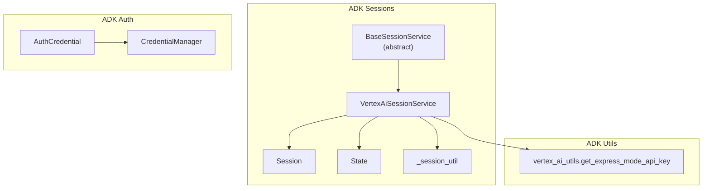
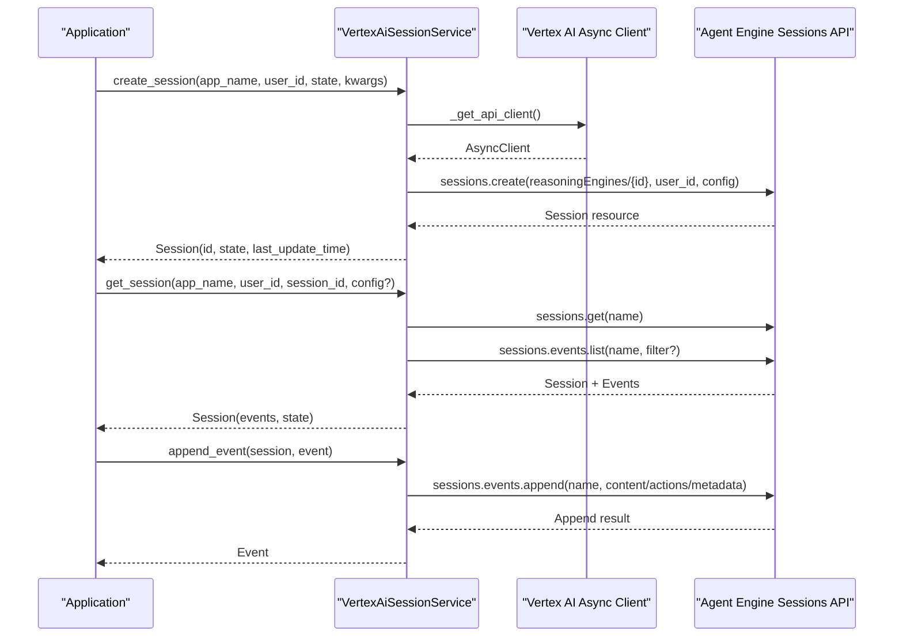
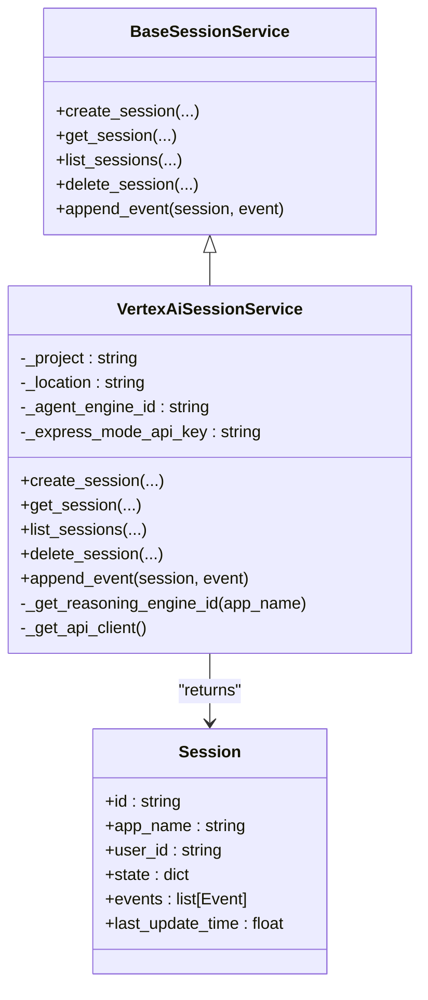
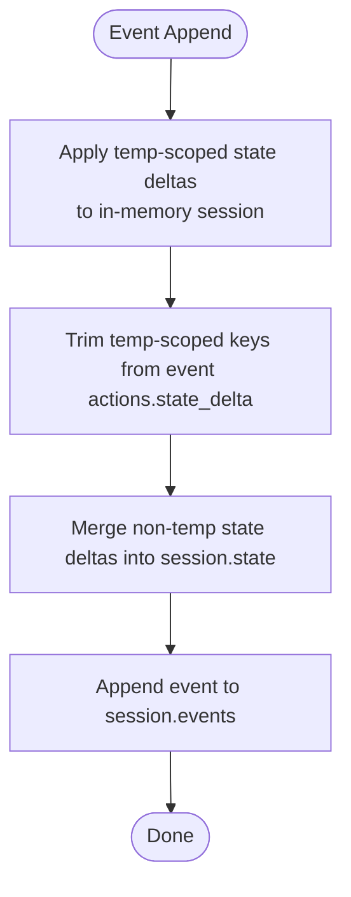
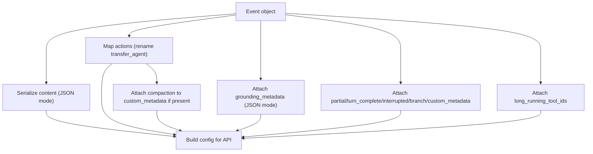
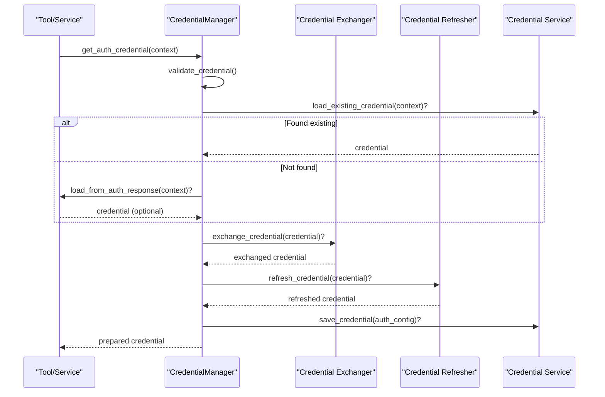
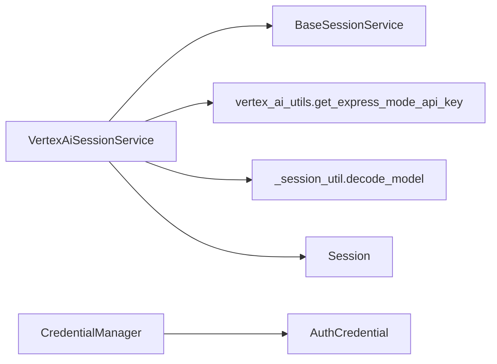

# Vertex AI Session Service

<cite>
**Referenced Files in This Document**
- [vertex_ai_session_service.py](file://src/google/adk/sessions/vertex_ai_session_service.py)
- [base_session_service.py](file://src/google/adk/sessions/base_session_service.py)
- [session.py](file://src/google/adk/sessions/session.py)
- [state.py](file://src/google/adk/sessions/state.py)
- [_session_util.py](file://src/google/adk/sessions/_session_util.py)
- [vertex_ai_utils.py](file://src/google/adk/utils/vertex_ai_utils.py)
- [auth_credential.py](file://src/google/adk/auth/auth_credential.py)
- [credential_manager.py](file://src/google/adk/auth/credential_manager.py)
- [test_vertex_ai_session_service.py](file://tests/unittests/sessions/test_vertex_ai_session_service.py)
</cite>

## Table of Contents
1. [Introduction](#introduction)
2. [Project Structure](#project-structure)
3. [Core Components](#core-components)
4. [Architecture Overview](#architecture-overview)
5. [Detailed Component Analysis](#detailed-component-analysis)
6. [Dependency Analysis](#dependency-analysis)
7. [Performance Considerations](#performance-considerations)
8. [Troubleshooting Guide](#troubleshooting-guide)
9. [Conclusion](#conclusion)
10. [Appendices](#appendices)

## Introduction
This document explains the Vertex AI session service implementation that integrates with Google Cloud Vertex AI Agent Engine for managed session storage and retrieval. It covers the cloud-native architecture benefits, authentication and authorization mechanisms, configuration and IAM requirements, data serialization formats, network and latency considerations, production deployment examples, cost optimization strategies, monitoring integration, and troubleshooting guidance for connectivity and permission issues.

## Project Structure
The Vertex AI session service is implemented as a pluggable session backend within the ADK session framework. It extends the base session service interface and uses the Vertex AI Async Client to communicate with the Agent Engine Sessions API.

**Diagram sources**
- [vertex_ai_session_service.py](file://src/google/adk/sessions/vertex_ai_session_service.py#L46-L438)
- [base_session_service.py](file://src/google/adk/sessions/base_session_service.py#L45-L154)
- [session.py](file://src/google/adk/sessions/session.py#L27-L51)
- [state.py](file://src/google/adk/sessions/state.py#L20-L82)
- [_session_util.py](file://src/google/adk/sessions/_session_util.py#L28-L51)
- [vertex_ai_utils.py](file://src/google/adk/utils/vertex_ai_utils.py#L29-L44)
- [auth_credential.py](file://src/google/adk/auth/auth_credential.py#L214-L280)
- [credential_manager.py](file://src/google/adk/auth/credential_manager.py#L40-L387)

**Section sources**
- [vertex_ai_session_service.py](file://src/google/adk/sessions/vertex_ai_session_service.py#L46-L438)
- [base_session_service.py](file://src/google/adk/sessions/base_session_service.py#L45-L154)
- [session.py](file://src/google/adk/sessions/session.py#L27-L51)
- [state.py](file://src/google/adk/sessions/state.py#L20-L82)
- [_session_util.py](file://src/google/adk/sessions/_session_util.py#L28-L51)
- [vertex_ai_utils.py](file://src/google/adk/utils/vertex_ai_utils.py#L29-L44)
- [auth_credential.py](file://src/google/adk/auth/auth_credential.py#L214-L280)
- [credential_manager.py](file://src/google/adk/auth/credential_manager.py#L40-L387)

## Core Components
- VertexAiSessionService: Implements asynchronous session CRUD and event append operations against Vertex AI Agent Engine Sessions API. Handles session state, event metadata, and compaction data.
- BaseSessionService: Defines the abstract interface for session services, including create, get, list, delete, and append-event operations.
- Session: Pydantic model representing a conversation session with id, app_name, user_id, state, events, and last_update_time.
- State: Manages state deltas with prefixes for app/user/temp scopes and helpers to merge and expose values.
- _session_util: Provides decoding helpers for Vertex AI types and state delta extraction utilities.
- vertex_ai_utils: Supplies Express Mode API key resolution logic based on environment and configuration.
- AuthCredential and CredentialManager: Define credential models and orchestrate credential loading, exchange, refresh, and persistence for tools and services.

Key behaviors:
- Session creation and retrieval leverage Vertex AI Async Client and return Session objects with hydrated events.
- Event append serializes content, actions, error fields, and metadata, preserving compaction data in custom metadata until native support arrives.
- Express Mode API key selection is gated by an environment flag and mutual exclusion with project/location configuration.

**Section sources**
- [vertex_ai_session_service.py](file://src/google/adk/sessions/vertex_ai_session_service.py#L46-L438)
- [base_session_service.py](file://src/google/adk/sessions/base_session_service.py#L45-L154)
- [session.py](file://src/google/adk/sessions/session.py#L27-L51)
- [state.py](file://src/google/adk/sessions/state.py#L20-L82)
- [_session_util.py](file://src/google/adk/sessions/_session_util.py#L28-L51)
- [vertex_ai_utils.py](file://src/google/adk/utils/vertex_ai_utils.py#L29-L44)
- [auth_credential.py](file://src/google/adk/auth/auth_credential.py#L214-L280)
- [credential_manager.py](file://src/google/adk/auth/credential_manager.py#L40-L387)

## Architecture Overview
The Vertex AI session service is a managed, cloud-native backend that offloads session storage and retrieval to Vertex AI Agent Engine. It provides:
- Scalability: Auto-scaling of underlying Vertex AI infrastructure.
- Reliability: Managed maintenance and high availability.
- Operational simplicity: Reduced operational overhead compared to self-hosted solutions.

**Diagram sources**
- [vertex_ai_session_service.py](file://src/google/adk/sessions/vertex_ai_session_service.py#L80-L321)

**Section sources**
- [vertex_ai_session_service.py](file://src/google/adk/sessions/vertex_ai_session_service.py#L80-L321)

## Detailed Component Analysis

### VertexAiSessionService
Responsibilities:
- Initialize with project/location or Express Mode API key.
- Create sessions via Agent Engine Sessions API.
- Retrieve sessions and events in parallel, with optional timestamp filtering.
- List sessions with optional user filter.
- Delete sessions.
- Append events with content, actions, error fields, and metadata; preserve compaction in custom metadata.

Notable implementation details:
- Express Mode API key selection is validated and resolved via vertex_ai_utils.
- Session resource naming follows Agent Engine conventions.
- Event metadata mapping preserves compaction data in custom_metadata for backward compatibility.
- Timestamps are normalized to UTC for API calls.

**Diagram sources**
- [base_session_service.py](file://src/google/adk/sessions/base_session_service.py#L45-L154)
- [vertex_ai_session_service.py](file://src/google/adk/sessions/vertex_ai_session_service.py#L46-L438)
- [session.py](file://src/google/adk/sessions/session.py#L27-L51)

**Section sources**
- [vertex_ai_session_service.py](file://src/google/adk/sessions/vertex_ai_session_service.py#L46-L438)

### Session and State Management
- Session: Holds runtime state and event stream; exposes last_update_time for freshness checks.
- State: Encapsulates current and pending-delta values with prefix-based scoping (app:, user:, temp:). It merges deltas and exposes combined values.

**Diagram sources**
- [base_session_service.py](file://src/google/adk/sessions/base_session_service.py#L105-L154)
- [state.py](file://src/google/adk/sessions/state.py#L20-L82)

**Section sources**
- [base_session_service.py](file://src/google/adk/sessions/base_session_service.py#L105-L154)
- [state.py](file://src/google/adk/sessions/state.py#L20-L82)

### Event Serialization and Metadata Mapping
- Content serialization uses JSON-compatible dumps with explicit modes.
- Actions mapping renames fields and preserves compaction data in custom metadata for backward compatibility.
- Grounding metadata and long-running tool ids are preserved in event metadata.

**Diagram sources**
- [vertex_ai_session_service.py](file://src/google/adk/sessions/vertex_ai_session_service.py#L248-L321)
- [_session_util.py](file://src/google/adk/sessions/_session_util.py#L28-L51)

**Section sources**
- [vertex_ai_session_service.py](file://src/google/adk/sessions/vertex_ai_session_service.py#L248-L321)
- [_session_util.py](file://src/google/adk/sessions/_session_util.py#L28-L51)

### Authentication and Authorization
- Express Mode API key: Resolved via vertex_ai_utils when the environment flag indicates Vertex AI usage and mutual exclusion with project/location is enforced.
- Service accounts and OAuth: AuthCredential and CredentialManager define credential models and lifecycle orchestration for OAuth2, OpenID Connect, HTTP, and service account flows. These are used by tools and services that interact with external APIs during session execution.

**Diagram sources**
- [credential_manager.py](file://src/google/adk/auth/credential_manager.py#L135-L183)
- [auth_credential.py](file://src/google/adk/auth/auth_credential.py#L214-L280)

**Section sources**
- [vertex_ai_utils.py](file://src/google/adk/utils/vertex_ai_utils.py#L29-L44)
- [credential_manager.py](file://src/google/adk/auth/credential_manager.py#L135-L183)
- [auth_credential.py](file://src/google/adk/auth/auth_credential.py#L214-L280)

## Dependency Analysis
- VertexAiSessionService depends on:
  - BaseSessionService for the interface contract.
  - vertex_ai_utils for Express Mode API key resolution.
  - _session_util for decoding Vertex AI types and extracting state deltas.
  - Session and Event models for data representation.
- Authentication stack depends on AuthCredential and CredentialManager for credential lifecycle management.

**Diagram sources**
- [vertex_ai_session_service.py](file://src/google/adk/sessions/vertex_ai_session_service.py#L33-L438)
- [base_session_service.py](file://src/google/adk/sessions/base_session_service.py#L45-L154)
- [vertex_ai_utils.py](file://src/google/adk/utils/vertex_ai_utils.py#L29-L44)
- [_session_util.py](file://src/google/adk/sessions/_session_util.py#L28-L51)
- [session.py](file://src/google/adk/sessions/session.py#L27-L51)
- [credential_manager.py](file://src/google/adk/auth/credential_manager.py#L40-L387)
- [auth_credential.py](file://src/google/adk/auth/auth_credential.py#L214-L280)

**Section sources**
- [vertex_ai_session_service.py](file://src/google/adk/sessions/vertex_ai_session_service.py#L33-L438)
- [base_session_service.py](file://src/google/adk/sessions/base_session_service.py#L45-L154)
- [vertex_ai_utils.py](file://src/google/adk/utils/vertex_ai_utils.py#L29-L44)
- [_session_util.py](file://src/google/adk/sessions/_session_util.py#L28-L51)
- [session.py](file://src/google/adk/sessions/session.py#L27-L51)
- [credential_manager.py](file://src/google/adk/auth/credential_manager.py#L40-L387)
- [auth_credential.py](file://src/google/adk/auth/auth_credential.py#L214-L280)

## Performance Considerations
- Parallel retrieval: The service fetches session resources and events concurrently to reduce round trips.
- Event filtering: Optional timestamp-based filtering reduces payload sizes when retrieving recent events.
- Serialization: JSON-compatible serialization minimizes encoding overhead.
- Temp state handling: Applying and trimming temp-scoped state avoids persisting ephemeral values, reducing write amplification.
- Network and latency: Using the Vertex AI Async Client and leveraging managed infrastructure helps achieve predictable latency and throughput.

[No sources needed since this section provides general guidance]

## Troubleshooting Guide
Common issues and resolutions:
- Permission errors (404/403): Verify IAM bindings for the Vertex AI Agent Engine Sessions API and that the service account or API key has appropriate roles.
- Express Mode configuration conflicts: Ensure mutual exclusivity between project/location and express_mode_api_key; confirm the environment flag enabling Vertex AI usage.
- Session ownership mismatch: The service validates user ownership and raises an error if mismatched.
- Unsupported user-provided session IDs: Creation does not accept user-provided session IDs; the service generates IDs.

Operational checks:
- Confirm Vertex AI Async Client initialization with correct project/location or Express Mode API key.
- Validate session resource naming and reasoning engine ID resolution.
- Review event metadata mapping for compaction and grounding metadata preservation.

**Section sources**
- [vertex_ai_session_service.py](file://src/google/adk/sessions/vertex_ai_session_service.py#L105-L109)
- [vertex_ai_session_service.py](file://src/google/adk/sessions/vertex_ai_session_service.py#L168-L179)
- [vertex_ai_utils.py](file://src/google/adk/utils/vertex_ai_utils.py#L35-L39)
- [test_vertex_ai_session_service.py](file://tests/unittests/sessions/test_vertex_ai_session_service.py#L758-L767)

## Conclusion
The Vertex AI session service provides a robust, managed backend for session storage and retrieval, leveraging Vertex AI Agent Engine’s scalability and reliability. By adhering to the session service interface, it integrates seamlessly with the broader ADK ecosystem. Proper configuration of authentication, careful handling of event metadata, and awareness of network characteristics enable efficient and secure deployments.

[No sources needed since this section summarizes without analyzing specific files]

## Appendices

### Configuration and Deployment Examples
- Express Mode API key: Configure the environment flag and API key according to vertex_ai_utils behavior.
- Project/location-based authentication: Supply project and location to initialize the Async Client.
- Service account and OAuth flows: Use AuthCredential and CredentialManager for credential lifecycle management in tools and services.

**Section sources**
- [vertex_ai_utils.py](file://src/google/adk/utils/vertex_ai_utils.py#L29-L44)
- [auth_credential.py](file://src/google/adk/auth/auth_credential.py#L214-L280)
- [credential_manager.py](file://src/google/adk/auth/credential_manager.py#L40-L387)

### Monitoring and Observability
- Integrate with Google Cloud Operations suite for logs and metrics emitted by the application and Vertex AI services.
- Track session creation, retrieval, and event append latencies; monitor error rates and 404/not found scenarios.

[No sources needed since this section provides general guidance]

### Cost Optimization Strategies
- Right-size session retention policies and event filtering to minimize storage and API usage.
- Use event trimming and temp state handling to reduce unnecessary persistence.
- Leverage Vertex AI’s managed scaling to avoid over-provisioning.

[No sources needed since this section provides general guidance]