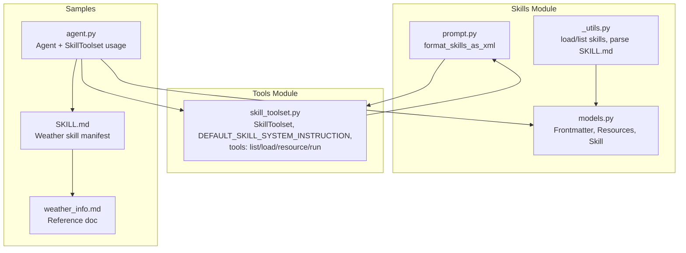
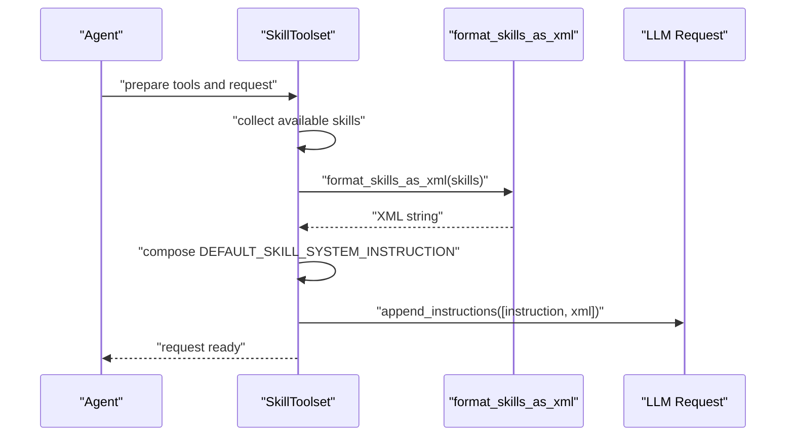
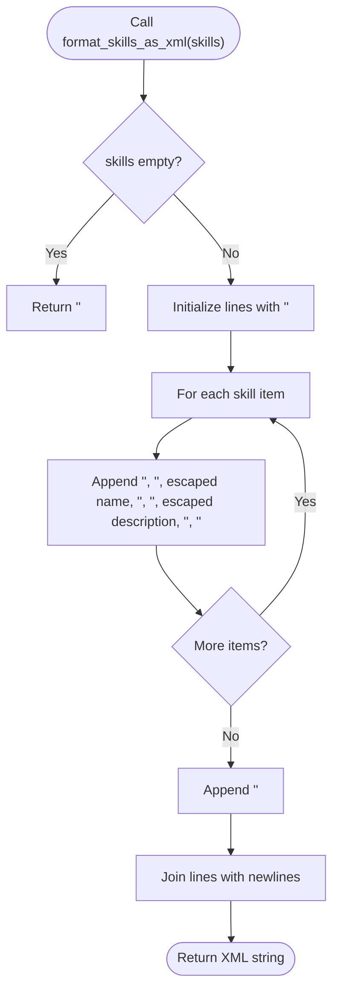
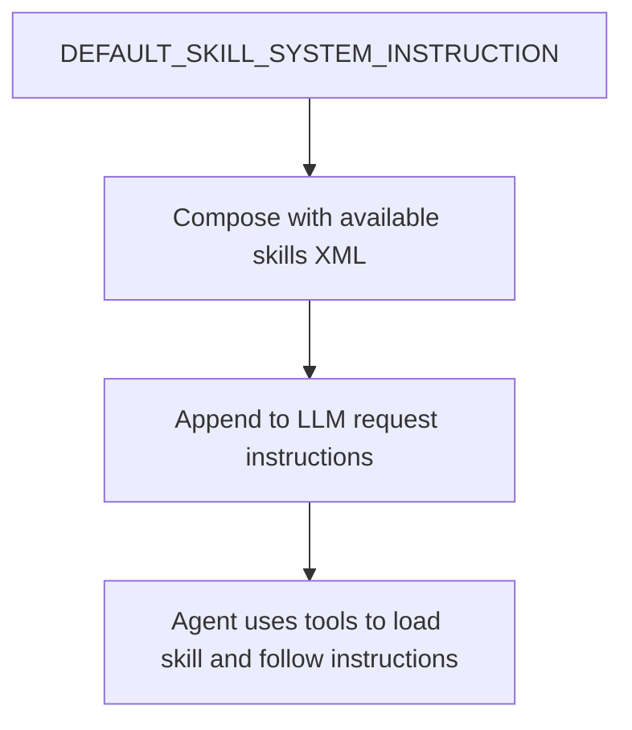
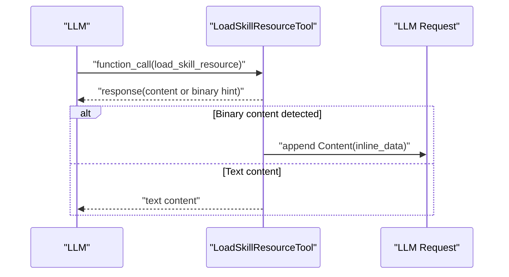
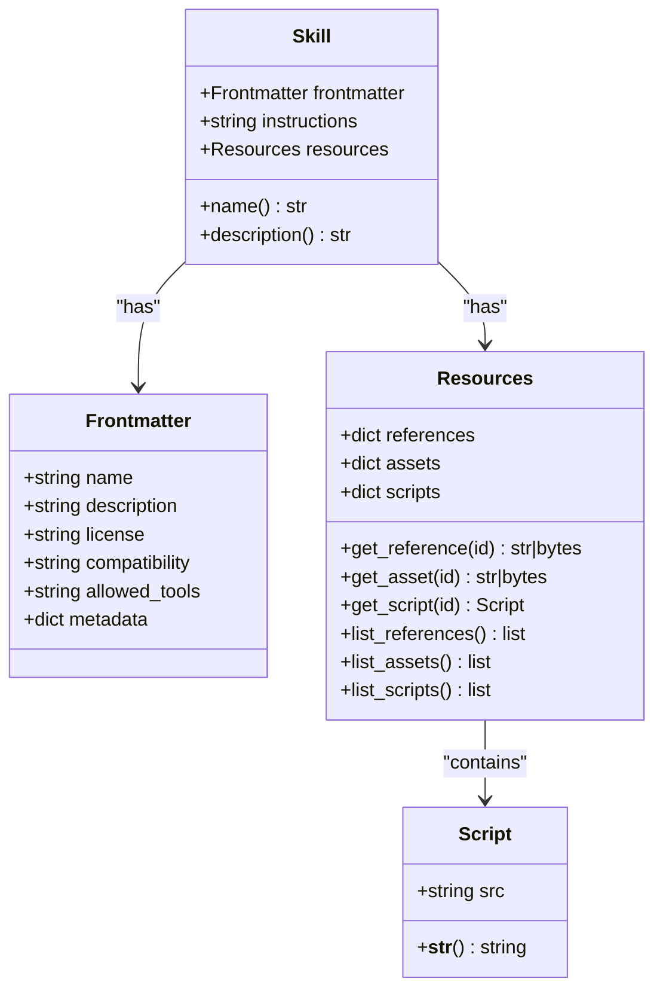
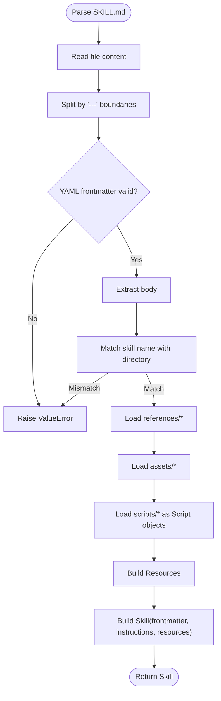
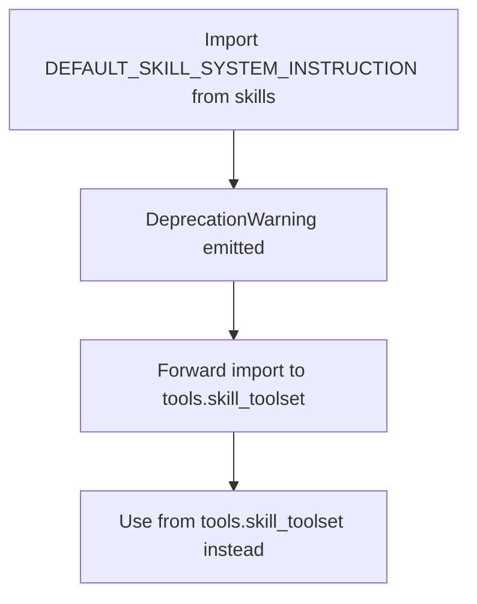
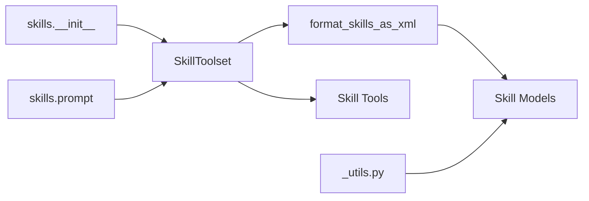

# Prompt Engineering and Templates

<cite>
**Referenced Files in This Document**
- [__init__.py](file://src/google/adk/skills/__init__.py)
- [prompt.py](file://src/google/adk/skills/prompt.py)
- [models.py](file://src/google/adk/skills/models.py)
- [_utils.py](file://src/google/adk/skills/_utils.py)
- [README.md](file://src/google/adk/skills/README.md)
- [skill_toolset.py](file://src/google/adk/tools/skill_toolset.py)
- [agent.py](file://contributing/samples/skills_agent/agent.py)
- [SKILL.md](file://contributing/samples/skills_agent/skills/weather-skill/SKILL.md)
- [weather_info.md](file://contributing/samples/skills_agent/skills/weather-skill/references/weather_info.md)
</cite>

## Table of Contents
1. [Introduction](#introduction)
2. [Project Structure](#project-structure)
3. [Core Components](#core-components)
4. [Architecture Overview](#architecture-overview)
5. [Detailed Component Analysis](#detailed-component-analysis)
6. [Dependency Analysis](#dependency-analysis)
7. [Performance Considerations](#performance-considerations)
8. [Troubleshooting Guide](#troubleshooting-guide)
9. [Conclusion](#conclusion)
10. [Appendices](#appendices)

## Introduction
This document explains how prompt engineering and template systems work in the ADK Skills feature. It covers:
- XML formatting functions for presenting available skills
- Default system instructions for skill-based agents
- Prompt construction patterns for context injection, role definition, and instruction formatting
- Optimization techniques for skill performance and accuracy
- Deprecation notices and migration paths for skill system instructions
- Practical examples of prompt templates for different skill types and use cases
- Debugging, testing, and validation strategies for skill effectiveness

## Project Structure
The Skills subsystem centers around three modules:
- Data models and parsing utilities for skills
- XML formatting for skill presentation
- Toolset that injects default system instructions and available skills into prompts

**Diagram sources**
- [models.py](file://src/google/adk/skills/models.py#L32-L208)
- [_utils.py](file://src/google/adk/skills/_utils.py#L64-L177)
- [prompt.py](file://src/google/adk/skills/prompt.py#L28-L58)
- [skill_toolset.py](file://src/google/adk/tools/skill_toolset.py#L60-L74)
- [agent.py](file://contributing/samples/skills_agent/agent.py#L88-L101)
- [SKILL.md](file://contributing/samples/skills_agent/skills/weather-skill/SKILL.md#L1-L9)
- [weather_info.md](file://contributing/samples/skills_agent/skills/weather-skill/references/weather_info.md#L1-L7)

**Section sources**
- [models.py](file://src/google/adk/skills/models.py#L32-L208)
- [_utils.py](file://src/google/adk/skills/_utils.py#L64-L177)
- [prompt.py](file://src/google/adk/skills/prompt.py#L28-L58)
- [skill_toolset.py](file://src/google/adk/tools/skill_toolset.py#L60-L74)
- [agent.py](file://contributing/samples/skills_agent/agent.py#L88-L101)
- [SKILL.md](file://contributing/samples/skills_agent/skills/weather-skill/SKILL.md#L1-L9)
- [weather_info.md](file://contributing/samples/skills_agent/skills/weather-skill/references/weather_info.md#L1-L7)

## Core Components
- Skill data models define the structure of skill frontmatter, instructions, and resources.
- Utilities parse SKILL.md manifests and load skills from local or cloud locations.
- XML formatter renders available skills into a standardized XML block.
- SkillToolset provides default system instructions and injects them along with the XML into LLM requests.

Key responsibilities:
- Frontmatter validation and normalization
- SKILL.md parsing and resource loading
- XML rendering for skill catalogs
- Default system instruction injection and tool-driven skill activation

**Section sources**
- [models.py](file://src/google/adk/skills/models.py#L32-L208)
- [_utils.py](file://src/google/adk/skills/_utils.py#L64-L177)
- [prompt.py](file://src/google/adk/skills/prompt.py#L28-L58)
- [skill_toolset.py](file://src/google/adk/tools/skill_toolset.py#L60-L74)

## Architecture Overview
The prompt pipeline for skill-based agents:
- At request time, the SkillToolset builds a system instruction and an XML catalog of available skills
- The XML is appended to the system instruction
- The combined instruction is injected into the LLM request

**Diagram sources**
- [skill_toolset.py](file://src/google/adk/tools/skill_toolset.py#L780-L789)
- [prompt.py](file://src/google/adk/skills/prompt.py#L28-L58)

## Detailed Component Analysis

### XML Formatting for Skill Presentation
The XML formatter produces a standardized block listing available skills with name and description. It escapes special characters and handles empty lists gracefully.

**Diagram sources**
- [prompt.py](file://src/google/adk/skills/prompt.py#L28-L58)

**Section sources**
- [prompt.py](file://src/google/adk/skills/prompt.py#L28-L58)

### Default System Instructions
The default system instruction defines:
- What skills are
- How to discover and load them
- How to access references/assets/scripts safely
- The mandatory steps to follow when a relevant skill is identified

It is provided by the SkillToolset and injected into the LLM request alongside the XML catalog.

**Diagram sources**
- [skill_toolset.py](file://src/google/adk/tools/skill_toolset.py#L60-L74)
- [skill_toolset.py](file://src/google/adk/tools/skill_toolset.py#L780-L789)

**Section sources**
- [skill_toolset.py](file://src/google/adk/tools/skill_toolset.py#L60-L74)
- [skill_toolset.py](file://src/google/adk/tools/skill_toolset.py#L780-L789)

### Prompt Construction Patterns
Patterns demonstrated in the codebase:
- Content injection via tools: the LoadSkillResourceTool can inject binary content into the LLM request when a model views a binary file
- Role definition: the system instruction establishes the agent’s role as a skill user who follows documented steps
- Instruction formatting: the XML block is appended after the system instruction to keep instructions explicit and structured

**Diagram sources**
- [skill_toolset.py](file://src/google/adk/tools/skill_toolset.py#L270-L334)

**Section sources**
- [skill_toolset.py](file://src/google/adk/tools/skill_toolset.py#L270-L334)

### Skill Data Models
The models define:
- Frontmatter: validated metadata (name, description, optional fields)
- Resources: references, assets, scripts
- Skill: composition of frontmatter, instructions, and resources

**Diagram sources**
- [models.py](file://src/google/adk/skills/models.py#L32-L208)

**Section sources**
- [models.py](file://src/google/adk/skills/models.py#L32-L208)

### SKILL.md Parsing and Loading
Utilities parse SKILL.md YAML frontmatter and body, validate names against directory names, and load references, assets, and scripts.

**Diagram sources**
- [_utils.py](file://src/google/adk/skills/_utils.py#L64-L177)

**Section sources**
- [_utils.py](file://src/google/adk/skills/_utils.py#L64-L177)

### Deprecation Notice and Migration Paths
- Importing the default system instruction from the skills module is deprecated. Use the new canonical location in the tools module.
- The skills module emits a deprecation warning and forwards the import to the tools module.

**Diagram sources**
- [__init__.py](file://src/google/adk/skills/__init__.py#L42-L57)
- [prompt.py](file://src/google/adk/skills/prompt.py#L61-L76)

**Section sources**
- [__init__.py](file://src/google/adk/skills/__init__.py#L42-L57)
- [prompt.py](file://src/google/adk/skills/prompt.py#L61-L76)

### Practical Examples of Prompt Templates
Below are template outlines for different skill types and use cases. Replace placeholders with actual values and ensure proper escaping for XML and JSON.

- Basic skill catalog template
  - Combine the default system instruction with the XML catalog of skills
  - Example structure: [DEFAULT instruction] + [XML skills list]

- Skill-specific instruction template
  - After loading a skill, follow the documented steps exactly
  - Example structure: “After loading the skill, read references, optionally run scripts, then reply”

- Multi-turn contextual template
  - Inject prior turns’ content and the current user query
  - Include the default instruction and skills catalog at the start of system content

- Binary resource handling template
  - When a binary file is accessed, append inline data to the request for model analysis

Note: The repository provides a working example of a weather skill with a manifest and a reference document. Use it as a blueprint for structuring your own skills.

**Section sources**
- [skill_toolset.py](file://src/google/adk/tools/skill_toolset.py#L60-L74)
- [prompt.py](file://src/google/adk/skills/prompt.py#L28-L58)
- [SKILL.md](file://contributing/samples/skills_agent/skills/weather-skill/SKILL.md#L1-L9)
- [weather_info.md](file://contributing/samples/skills_agent/skills/weather-skill/references/weather_info.md#L1-L7)

## Dependency Analysis
- SkillToolset depends on:
  - XML formatter to render available skills
  - Tools to list, load skills, load resources, and run scripts
- XML formatter depends on:
  - Skill models for name and description
- SKILL.md parsing utilities depend on:
  - YAML parsing and filesystem access
- The skills module emits deprecation warnings and forwards imports to the tools module

**Diagram sources**
- [skill_toolset.py](file://src/google/adk/tools/skill_toolset.py#L780-L789)
- [prompt.py](file://src/google/adk/skills/prompt.py#L28-L58)
- [models.py](file://src/google/adk/skills/models.py#L32-L208)
- [_utils.py](file://src/google/adk/skills/_utils.py#L64-L177)
- [__init__.py](file://src/google/adk/skills/__init__.py#L42-L57)
- [prompt.py](file://src/google/adk/skills/prompt.py#L61-L76)

**Section sources**
- [skill_toolset.py](file://src/google/adk/tools/skill_toolset.py#L780-L789)
- [prompt.py](file://src/google/adk/skills/prompt.py#L28-L58)
- [models.py](file://src/google/adk/skills/models.py#L32-L208)
- [_utils.py](file://src/google/adk/skills/_utils.py#L64-L177)
- [__init__.py](file://src/google/adk/skills/__init__.py#L42-L57)
- [prompt.py](file://src/google/adk/skills/prompt.py#L61-L76)

## Performance Considerations
- Keep skills concise and focused; avoid overly large instructions or scripts
- Prefer small, atomic references and scripts; the code warns when payload size exceeds a threshold
- Limit the number of skills exposed to reduce XML size and parsing overhead
- Use allowed tools and metadata judiciously to minimize unnecessary tool surface
- Cache frequently accessed references and assets when appropriate

[No sources needed since this section provides general guidance]

## Troubleshooting Guide
Common issues and resolutions:
- Invalid SKILL.md
  - Ensure frontmatter starts and ends with delimiters and is valid YAML
  - Verify the skill name matches the directory name
- Missing or invalid skill resources
  - Confirm paths under references/, assets/, scripts/ exist
  - For binary resources, expect a binary detection message and verify MIME type inference
- Tool errors
  - Missing skill name or resource path leads to explicit error codes
  - Script execution requires a configured code executor
- Deprecation warnings
  - Import the default system instruction from the tools module instead of the skills module

Validation tips:
- Use the listing utilities to validate skills before loading
- Test XML rendering independently to ensure escaping and formatting are correct
- Verify tool declarations and parameter schemas align with expected inputs

**Section sources**
- [_utils.py](file://src/google/adk/skills/_utils.py#L179-L231)
- [skill_toolset.py](file://src/google/adk/tools/skill_toolset.py#L100-L104)
- [skill_toolset.py](file://src/google/adk/tools/skill_toolset.py#L134-L164)
- [skill_toolset.py](file://src/google/adk/tools/skill_toolset.py#L205-L268)
- [skill_toolset.py](file://src/google/adk/tools/skill_toolset.py#L602-L667)

## Conclusion
The ADK Skills system provides a robust framework for dynamic, structured skill-based prompting. By combining validated skill frontmatter, clear instructions, and a standardized XML catalog, agents can reliably discover and execute skills. The default system instruction and tool-driven resource access ensure predictable behavior, while deprecation notices guide safe migrations to newer APIs.

[No sources needed since this section summarizes without analyzing specific files]

## Appendices

### Appendix A: Example Agent Setup
See the sample agent that registers a SkillToolset with multiple skills and additional tools.

**Section sources**
- [agent.py](file://contributing/samples/skills_agent/agent.py#L88-L101)

### Appendix B: Sample Skill Manifest and Reference
Review the weather skill manifest and a reference document to model your own skills.

**Section sources**
- [SKILL.md](file://contributing/samples/skills_agent/skills/weather-skill/SKILL.md#L1-L9)
- [weather_info.md](file://contributing/samples/skills_agent/skills/weather-skill/references/weather_info.md#L1-L7)