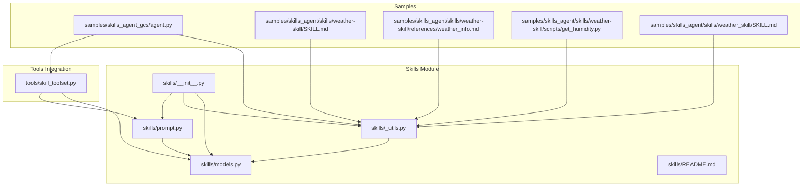
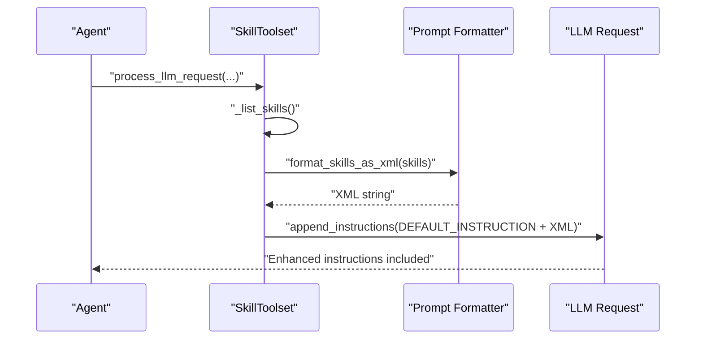
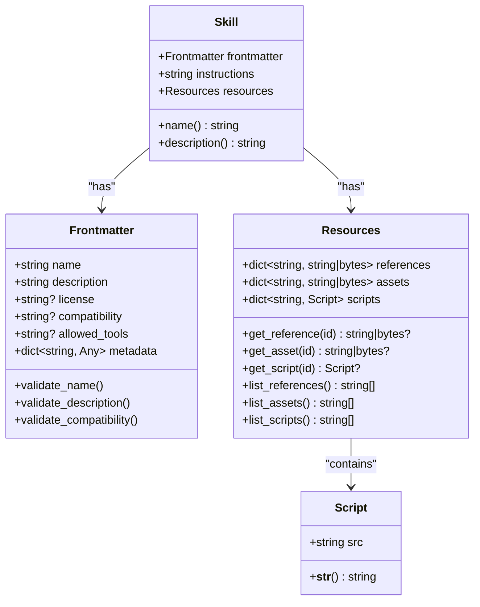
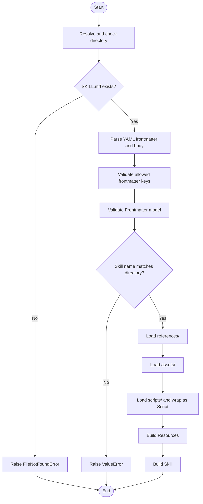
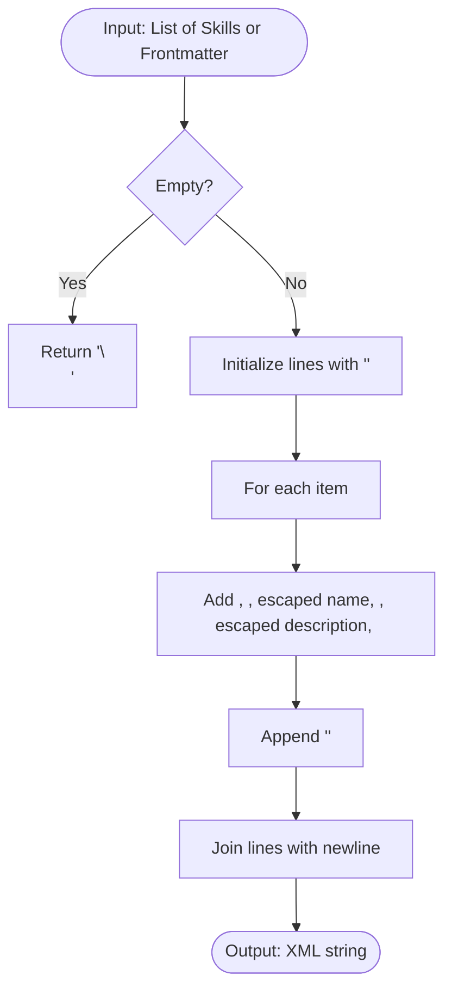
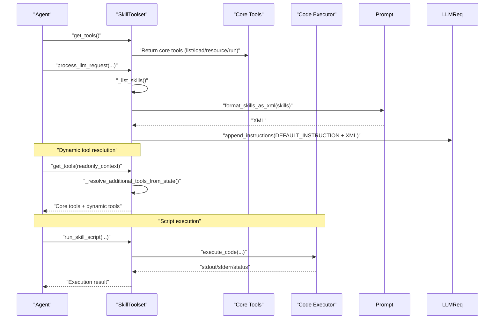
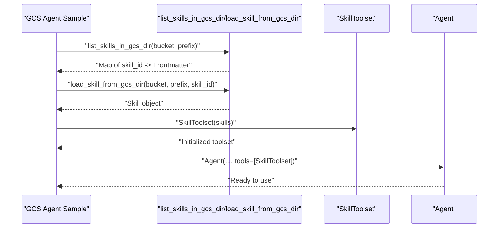
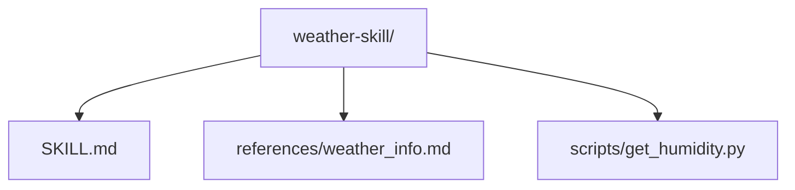
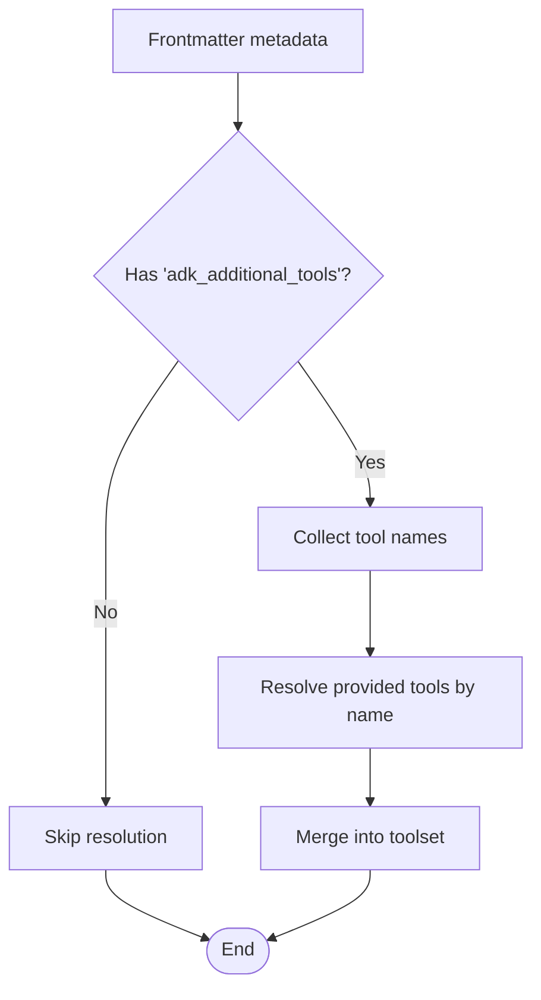
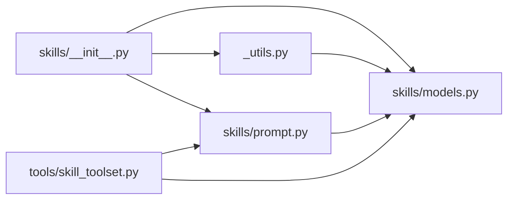

# Skill Architecture and Design

<cite>
**Referenced Files in This Document**
- [skills/__init__.py](file://src/google/adk/skills/__init__.py)
- [skills/models.py](file://src/google/adk/skills/models.py)
- [skills/_utils.py](file://src/google/adk/skills/_utils.py)
- [skills/prompt.py](file://src/google/adk/skills/prompt.py)
- [skills/README.md](file://src/google/adk/skills/README.md)
- [tools/skill_toolset.py](file://src/google/adk/tools/skill_toolset.py)
- [samples/skills_agent_gcs/agent.py](file://contributing/samples/skills_agent_gcs/agent.py)
- [samples/skills_agent/skills/weather-skill/SKILL.md](file://contributing/samples/skills_agent/skills/weather-skill/SKILL.md)
- [samples/skills_agent/skills/weather-skill/references/weather_info.md](file://contributing/samples/skills_agent/skills/weather-skill/references/weather_info.md)
- [samples/skills_agent/skills/weather-skill/scripts/get_humidity.py](file://contributing/samples/skills_agent/skills/weather-skill/scripts/get_humidity.py)
- [samples/skills_agent/skills/weather_skill/SKILL.md](file://contributing/samples/skills_agent/skills/weather_skill/SKILL.md)
- [tests/unittests/skills/test__utils.py](file://tests/unittests/skills/test__utils.py)
- [tests/unittests/tools/test_skill_toolset.py](file://tests/unittests/tools/test_skill_toolset.py)
</cite>

## Table of Contents
1. [Introduction](#introduction)
2. [Project Structure](#project-structure)
3. [Core Components](#core-components)
4. [Architecture Overview](#architecture-overview)
5. [Detailed Component Analysis](#detailed-component-analysis)
6. [Dependency Analysis](#dependency-analysis)
7. [Performance Considerations](#performance-considerations)
8. [Troubleshooting Guide](#troubleshooting-guide)
9. [Conclusion](#conclusion)
10. [Appendices](#appendices)

## Introduction
This document explains the ADK skill architecture and design patterns. It covers the skill data models (Frontmatter, Skill, Resources, Script), the skill lifecycle from creation to deployment, composition patterns for combining multiple skills, versioning and backward compatibility considerations, testing methodologies, and performance benchmarking techniques. Practical examples demonstrate how to create, modify, and optimize skills, and how to integrate them into agents using the SkillToolset.

## Project Structure
The skill system is organized around three primary modules:
- Data models: define the skill schema and validation rules
- Utilities: load and validate skills from local directories or GCS
- Prompt helpers: format skills for LLM consumption
- Tool integration: expose tools to list, load, view resources, and execute scripts

**Diagram sources**
- [skills/__init__.py](file://src/google/adk/skills/__init__.py#L1-L58)
- [skills/models.py](file://src/google/adk/skills/models.py#L1-L208)
- [skills/_utils.py](file://src/google/adk/skills/_utils.py#L1-L436)
- [skills/prompt.py](file://src/google/adk/skills/prompt.py#L1-L77)
- [tools/skill_toolset.py](file://src/google/adk/tools/skill_toolset.py#L1-L803)
- [samples/skills_agent_gcs/agent.py](file://contributing/samples/skills_agent_gcs/agent.py#L1-L90)
- [samples/skills_agent/skills/weather-skill/SKILL.md](file://contributing/samples/skills_agent/skills/weather-skill/SKILL.md#L1-L9)
- [samples/skills_agent/skills/weather-skill/references/weather_info.md](file://contributing/samples/skills_agent/skills/weather-skill/references/weather_info.md#L1-L7)
- [samples/skills_agent/skills/weather-skill/scripts/get_humidity.py](file://contributing/samples/skills_agent/skills/weather-skill/scripts/get_humidity.py#L1-L30)
- [samples/skills_agent/skills/weather_skill/SKILL.md](file://contributing/samples/skills_agent/skills/weather_skill/SKILL.md#L1-L11)

**Section sources**
- [skills/README.md](file://src/google/adk/skills/README.md#L1-L12)
- [skills/__init__.py](file://src/google/adk/skills/__init__.py#L1-L58)

## Core Components
- Frontmatter: L1 metadata parsed from SKILL.md frontmatter, validated for naming, description length, optional compatibility, allowed_tools alias, and metadata constraints.
- Resources: L3 content including references, assets, and scripts; provides lookup and listing helpers.
- Script: Wrapper for executable scripts with string conversion for inclusion in prompts or saving.
- Skill: Complete skill representation combining Frontmatter, instructions (SKILL.md body), and Resources.
- Prompt formatting: Converts available skills to a standardized XML string for LLM consumption.
- Utilities: Parse SKILL.md, validate directory layout, load skills from local or GCS, and list skills.
- Tool integration: SkillToolset exposes tools to list, load, view resources, and execute scripts; supports dynamic tool resolution via metadata.

**Section sources**
- [skills/models.py](file://src/google/adk/skills/models.py#L32-L208)
- [skills/prompt.py](file://src/google/adk/skills/prompt.py#L28-L58)
- [skills/_utils.py](file://src/google/adk/skills/_utils.py#L64-L176)
- [tools/skill_toolset.py](file://src/google/adk/tools/skill_toolset.py#L671-L790)

## Architecture Overview
The skill architecture integrates cleanly with the ADK agent tooling. At runtime, the SkillToolset injects system instructions and an XML list of available skills into the LLM request. Agents can then discover, load, and execute skills dynamically. Scripts are materialized and executed via a pluggable code executor.

**Diagram sources**
- [tools/skill_toolset.py](file://src/google/adk/tools/skill_toolset.py#L780-L790)
- [skills/prompt.py](file://src/google/adk/skills/prompt.py#L28-L58)

## Detailed Component Analysis

### Data Model Layer
The model layer defines strict validation and convenience properties for skills.

**Diagram sources**
- [skills/models.py](file://src/google/adk/skills/models.py#L32-L208)

Key validation behaviors:
- Name must be lowercase kebab-case, normalized, and <= 64 characters.
- Description must be non-empty and <= 1024 characters.
- Compatibility must be <= 500 characters.
- Metadata can include adk_additional_tools as a list of tool names.

**Section sources**
- [skills/models.py](file://src/google/adk/skills/models.py#L32-L103)
- [skills/models.py](file://src/google/adk/skills/models.py#L105-L178)
- [skills/models.py](file://src/google/adk/skills/models.py#L180-L208)

### Skill Loading and Validation
Utilities provide robust loading and validation for local and GCS skill directories.

**Diagram sources**
- [skills/_utils.py](file://src/google/adk/skills/_utils.py#L97-L176)

Operational highlights:
- Supports SKILL.md or skill.md variants.
- Validates allowed frontmatter keys and raises descriptive errors.
- Loads binary assets safely and skips non-UTF-8 files.
- Lists skills from GCS by iterating prefixes and parsing manifests.

**Section sources**
- [skills/_utils.py](file://src/google/adk/skills/_utils.py#L40-L62)
- [skills/_utils.py](file://src/google/adk/skills/_utils.py#L64-L128)
- [skills/_utils.py](file://src/google/adk/skills/_utils.py#L179-L231)
- [skills/_utils.py](file://src/google/adk/skills/_utils.py#L257-L298)
- [skills/_utils.py](file://src/google/adk/skills/_utils.py#L301-L346)
- [skills/_utils.py](file://src/google/adk/skills/_utils.py#L349-L436)

### Prompt Formatting
Skills are formatted into a standardized XML string for LLM consumption.

**Diagram sources**
- [skills/prompt.py](file://src/google/adk/skills/prompt.py#L28-L58)

**Section sources**
- [skills/prompt.py](file://src/google/adk/skills/prompt.py#L28-L58)

### Tool Integration and Lifecycle
The SkillToolset orchestrates skill discovery, loading, resource access, and script execution.

**Diagram sources**
- [tools/skill_toolset.py](file://src/google/adk/tools/skill_toolset.py#L712-L718)
- [tools/skill_toolset.py](file://src/google/adk/tools/skill_toolset.py#L780-L790)
- [tools/skill_toolset.py](file://src/google/adk/tools/skill_toolset.py#L729-L770)
- [tools/skill_toolset.py](file://src/google/adk/tools/skill_toolset.py#L602-L667)

Core tools:
- ListSkillsTool: returns XML of available skills.
- LoadSkillTool: loads instructions and frontmatter for a skill.
- LoadSkillResourceTool: retrieves references/assets/scripts content; injects binary content into LLM requests when needed.
- RunSkillScriptTool: materializes skill files and executes scripts via a code executor.

Dynamic tool resolution:
- When a skill is activated, the toolset reads adk_additional_tools from the skill’s metadata and resolves additional tools provided at initialization.

**Section sources**
- [tools/skill_toolset.py](file://src/google/adk/tools/skill_toolset.py#L77-L105)
- [tools/skill_toolset.py](file://src/google/adk/tools/skill_toolset.py#L107-L165)
- [tools/skill_toolset.py](file://src/google/adk/tools/skill_toolset.py#L168-L269)
- [tools/skill_toolset.py](file://src/google/adk/tools/skill_toolset.py#L270-L334)
- [tools/skill_toolset.py](file://src/google/adk/tools/skill_toolset.py#L562-L668)
- [tools/skill_toolset.py](file://src/google/adk/tools/skill_toolset.py#L671-L719)
- [tools/skill_toolset.py](file://src/google/adk/tools/skill_toolset.py#L729-L770)

### Practical Examples

#### Example 1: Loading Skills from GCS
This sample demonstrates listing and loading skills from a GCS bucket and initializing an agent with a SkillToolset.

**Diagram sources**
- [samples/skills_agent_gcs/agent.py](file://contributing/samples/skills_agent_gcs/agent.py#L37-L65)

**Section sources**
- [samples/skills_agent_gcs/agent.py](file://contributing/samples/skills_agent_gcs/agent.py#L1-L90)

#### Example 2: Skill Directory Structure and Content
A minimal skill includes SKILL.md, optional references/, assets/, and scripts/.

**Diagram sources**
- [samples/skills_agent/skills/weather-skill/SKILL.md](file://contributing/samples/skills_agent/skills/weather-skill/SKILL.md#L1-L9)
- [samples/skills_agent/skills/weather-skill/references/weather_info.md](file://contributing/samples/skills_agent/skills/weather-skill/references/weather_info.md#L1-L7)
- [samples/skills_agent/skills/weather-skill/scripts/get_humidity.py](file://contributing/samples/skills_agent/skills/weather-skill/scripts/get_humidity.py#L1-L30)

**Section sources**
- [samples/skills_agent/skills/weather-skill/SKILL.md](file://contributing/samples/skills_agent/skills/weather-skill/SKILL.md#L1-L9)
- [samples/skills_agent/skills/weather-skill/references/weather_info.md](file://contributing/samples/skills_agent/skills/weather-skill/references/weather_info.md#L1-L7)
- [samples/skills_agent/skills/weather-skill/scripts/get_humidity.py](file://contributing/samples/skills_agent/skills/weather-skill/scripts/get_humidity.py#L1-L30)

#### Example 3: Skill with Additional Tools via Metadata
A skill can advertise additional tools via metadata, enabling dynamic tool resolution when the skill is activated.

**Diagram sources**
- [samples/skills_agent/skills/weather_skill/SKILL.md](file://contributing/samples/skills_agent/skills/weather_skill/SKILL.md#L4-L6)
- [tools/skill_toolset.py](file://src/google/adk/tools/skill_toolset.py#L729-L770)

**Section sources**
- [samples/skills_agent/skills/weather_skill/SKILL.md](file://contributing/samples/skills_agent/skills/weather_skill/SKILL.md#L1-L11)
- [tools/skill_toolset.py](file://src/google/adk/tools/skill_toolset.py#L729-L770)

## Dependency Analysis
The skill system exhibits low coupling and high cohesion:
- skills/__init__.py re-exports models and utility functions.
- skills/_utils.py depends on skills/models.py and YAML/GCS libraries.
- skills/prompt.py depends on skills/models.py for formatting.
- tools/skill_toolset.py depends on skills/models.py, skills/prompt.py, and code executors.

**Diagram sources**
- [skills/__init__.py](file://src/google/adk/skills/__init__.py#L20-L39)
- [skills/_utils.py](file://src/google/adk/skills/_utils.py#L27-L27)
- [skills/prompt.py](file://src/google/adk/skills/prompt.py#L25-L25)
- [tools/skill_toolset.py](file://src/google/adk/tools/skill_toolset.py#L38-L43)

**Section sources**
- [skills/__init__.py](file://src/google/adk/skills/__init__.py#L1-L58)
- [skills/_utils.py](file://src/google/adk/skills/_utils.py#L1-L436)
- [skills/prompt.py](file://src/google/adk/skills/prompt.py#L1-L77)
- [tools/skill_toolset.py](file://src/google/adk/tools/skill_toolset.py#L1-L803)

## Performance Considerations
- Payload size limits: The wrapper enforces a maximum payload size for skill resources to avoid oversized requests.
- Script timeouts: Shell scripts are executed with a configurable timeout; Python scripts are executed synchronously in a thread.
- Binary content handling: Binary assets are detected and injected into the LLM request as inline data with appropriate MIME types.
- Listing from GCS: Listing skills from GCS consumes an iterator to populate prefixes; invalid skills are logged and skipped.

Recommendations:
- Keep SKILL.md concise; offload detailed instructions to references/.
- Use assets/scripts sparingly; compress or minimize content.
- Prefer Python scripts for deterministic execution; shell scripts require careful argument passing and timeout tuning.
- Monitor logs for warnings about payload size and invalid skills.

**Section sources**
- [tools/skill_toolset.py](file://src/google/adk/tools/skill_toolset.py#L51-L58)
- [tools/skill_toolset.py](file://src/google/adk/tools/skill_toolset.py#L562-L668)
- [tools/skill_toolset.py](file://src/google/adk/tools/skill_toolset.py#L270-L334)
- [skills/_utils.py](file://src/google/adk/skills/_utils.py#L301-L346)

## Troubleshooting Guide
Common issues and resolutions:
- Missing or malformed SKILL.md: Validation raises descriptive errors; ensure frontmatter starts with delimiters and body follows.
- Unknown frontmatter fields: Only allowed keys are accepted; remove unsupported fields.
- Name-directory mismatch: Skill name must match directory name; rename directory accordingly.
- Resource not found: Verify paths under references/, assets/, or scripts/; ensure correct casing and nesting.
- Duplicate skill names: SkillToolset rejects duplicates; ensure unique names across skills.
- No code executor configured: RunSkillScriptTool requires a code executor; configure toolset-level or agent-level executor.

Testing references:
- Unit tests validate tool behavior, error codes, and dynamic tool resolution.
- Utility tests validate directory validation and GCS listing.

**Section sources**
- [skills/_utils.py](file://src/google/adk/skills/_utils.py#L179-L231)
- [skills/_utils.py](file://src/google/adk/skills/_utils.py#L301-L346)
- [tools/skill_toolset.py](file://src/google/adk/tools/skill_toolset.py#L426-L444)
- [tools/skill_toolset.py](file://src/google/adk/tools/skill_toolset.py#L647-L667)
- [tests/unittests/skills/test__utils.py](file://tests/unittests/skills/test__utils.py#L127-L168)
- [tests/unittests/tools/test_skill_toolset.py](file://tests/unittests/tools/test_skill_toolset.py#L167-L184)
- [tests/unittests/tools/test_skill_toolset.py](file://tests/unittests/tools/test_skill_toolset.py#L186-L236)
- [tests/unittests/tools/test_skill_toolset.py](file://tests/unittests/tools/test_skill_toolset.py#L426-L435)
- [tests/unittests/tools/test_skill_toolset.py](file://tests/unittests/tools/test_skill_toolset.py#L655-L691)

## Conclusion
The ADK skill architecture provides a structured, validated, and extensible way to package agent capabilities. By separating concerns into models, utilities, prompts, and tools, it enables dynamic discovery, controlled execution, and composability. Following the design patterns and best practices outlined here will help you create robust, maintainable skills and integrate them effectively into agents.

## Appendices

### A. Skill Lifecycle Checklist
- Create SKILL.md with validated frontmatter and instructions.
- Organize references/, assets/, and scripts/ as needed.
- Validate locally with utility functions before deployment.
- Deploy to local directory or GCS.
- Load skills into a SkillToolset and initialize the agent.
- Test listing, loading, resource access, and script execution.
- Monitor logs for warnings and errors.

**Section sources**
- [skills/_utils.py](file://src/google/adk/skills/_utils.py#L179-L231)
- [skills/_utils.py](file://src/google/adk/skills/_utils.py#L257-L298)
- [skills/_utils.py](file://src/google/adk/skills/_utils.py#L301-L346)
- [tools/skill_toolset.py](file://src/google/adk/tools/skill_toolset.py#L712-L719)

### B. Composition Patterns
- Multi-skill orchestration: Combine multiple skills in a single agent by registering them in the SkillToolset.
- Dynamic tool resolution: Use metadata to add tools only when specific skills are activated.
- Script chaining: Use scripts to prepare data or environment for subsequent tool invocations.

**Section sources**
- [tools/skill_toolset.py](file://src/google/adk/tools/skill_toolset.py#L729-L770)
- [samples/skills_agent/skills/weather_skill/SKILL.md](file://contributing/samples/skills_agent/skills/weather_skill/SKILL.md#L4-L6)

### C. Versioning and Backward Compatibility
- Keep SKILL.md frontmatter minimal and additive; avoid changing allowed keys.
- Use the compatibility field for compatibility notes; keep descriptions clear.
- Maintain backward-compatible script interfaces; introduce new scripts rather than modifying existing ones.
- Use metadata keys consistently; avoid breaking changes to adk_additional_tools format.

**Section sources**
- [skills/models.py](file://src/google/adk/skills/models.py#L32-L103)
- [skills/models.py](file://src/google/adk/skills/models.py#L180-L208)

### D. Testing Methodologies
- Unit tests cover tool behavior, error codes, and dynamic tool resolution.
- Integration tests demonstrate loading skills from GCS and running agents.
- Validate directory layouts and GCS listings with dedicated test fixtures.

**Section sources**
- [tests/unittests/skills/test__utils.py](file://tests/unittests/skills/test__utils.py#L127-L168)
- [tests/unittests/tools/test_skill_toolset.py](file://tests/unittests/tools/test_skill_toolset.py#L167-L184)
- [tests/unittests/tools/test_skill_toolset.py](file://tests/unittests/tools/test_skill_toolset.py#L399-L409)
- [tests/unittests/tools/test_skill_toolset.py](file://tests/unittests/tools/test_skill_toolset.py#L1292-L1332)

### E. Performance Benchmarking Techniques
- Establish baselines with representative workloads.
- Measure latency, throughput, CPU, memory, disk, and network metrics.
- Simulate realistic load profiles and stress conditions.
- Identify bottlenecks in skill loading, resource access, and script execution.
- Optimize payload sizes and script execution strategies.

[No sources needed since this section provides general guidance]