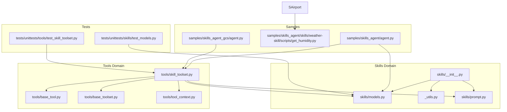
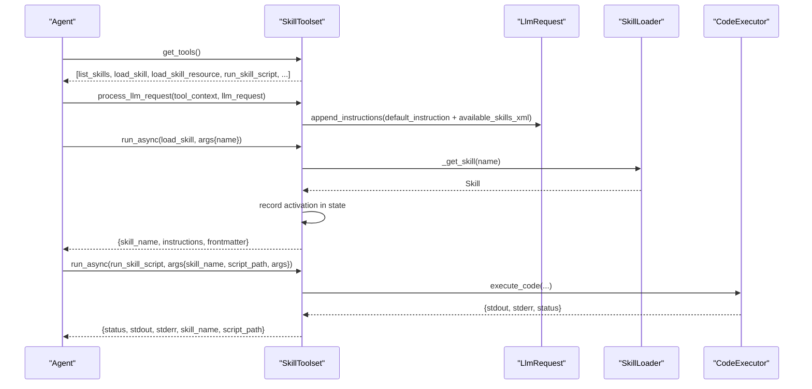
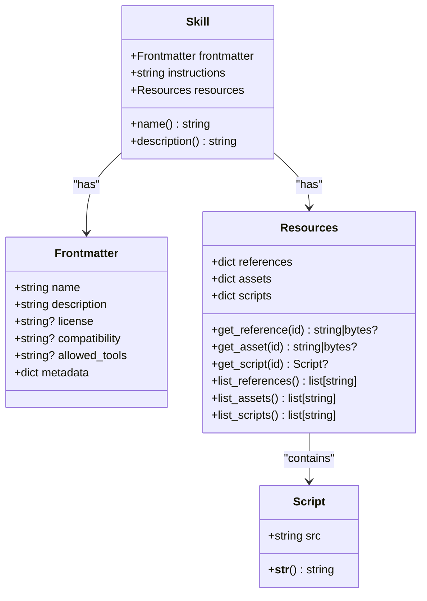
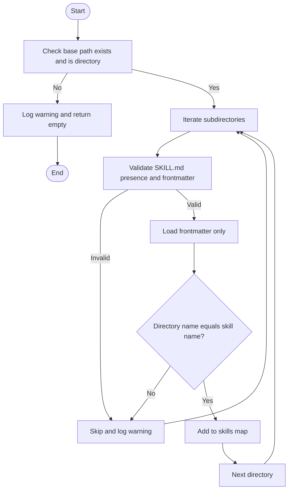
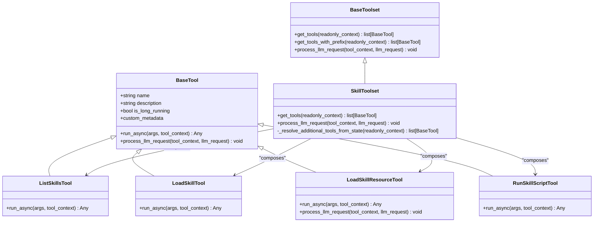
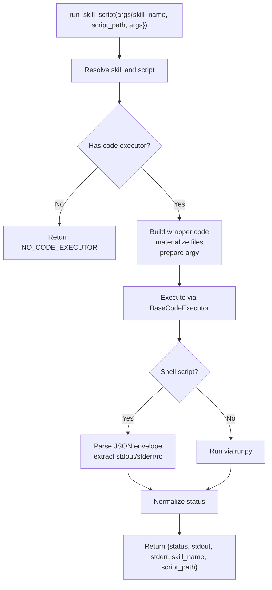
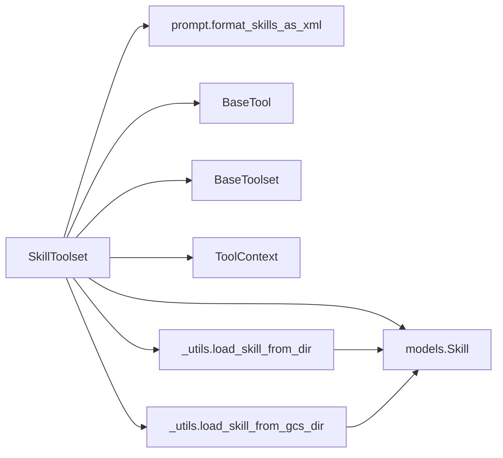

# Skill Toolset Integration

<cite>
**Referenced Files in This Document**
- [__init__.py](file://src/google/adk/skills/__init__.py)
- [_utils.py](file://src/google/adk/skills/_utils.py)
- [models.py](file://src/google/adk/skills/models.py)
- [prompt.py](file://src/google/adk/skills/prompt.py)
- [skill_toolset.py](file://src/google/adk/tools/skill_toolset.py)
- [base_tool.py](file://src/google/adk/tools/base_tool.py)
- [base_toolset.py](file://src/google/adk/tools/base_toolset.py)
- [tool_context.py](file://src/google/adk/tools/tool_context.py)
- [agent.py](file://contributing/samples/skills_agent/agent.py)
- [get_humidity.py](file://contributing/samples/skills_agent/skills/weather-skill/scripts/get_humidity.py)
- [agent.py](file://contributing/samples/skills_agent_gcs/agent.py)
- [test_skill_toolset.py](file://tests/unittests/tools/test_skill_toolset.py)
- [test_models.py](file://tests/unittests/skills/test_models.py)
</cite>

## Table of Contents
1. [Introduction](#introduction)
2. [Project Structure](#project-structure)
3. [Core Components](#core-components)
4. [Architecture Overview](#architecture-overview)
5. [Detailed Component Analysis](#detailed-component-analysis)
6. [Dependency Analysis](#dependency-analysis)
7. [Performance Considerations](#performance-considerations)
8. [Troubleshooting Guide](#troubleshooting-guide)
9. [Conclusion](#conclusion)
10. [Appendices](#appendices)

## Introduction
This document explains how skills integrate with the tool ecosystem in the Agent Development Kit (ADK). It covers the skill toolset architecture, how skills interact with agent tools and workflows, skill-based agent patterns, and how skills enhance tool capabilities through specialized knowledge. It also details skill tool configuration, parameter passing, result handling, composition and chaining patterns for multi-step operations, plus practical examples, error handling, performance optimization, and testing and monitoring approaches for production deployments.

## Project Structure
The skill toolset spans several modules:
- Skills domain: models, utilities, and prompt helpers
- Tools domain: base abstractions and the SkillToolset implementation
- Samples: example agents demonstrating local and cloud-based skill usage
- Tests: unit tests validating tool behavior and error handling

**Diagram sources**
- [__init__.py](file://src/google/adk/skills/__init__.py#L1-L58)
- [models.py](file://src/google/adk/skills/models.py#L1-L208)
- [_utils.py](file://src/google/adk/skills/_utils.py#L1-L436)
- [prompt.py](file://src/google/adk/skills/prompt.py#L1-L77)
- [base_tool.py](file://src/google/adk/tools/base_tool.py#L1-L213)
- [base_toolset.py](file://src/google/adk/tools/base_toolset.py#L1-L226)
- [skill_toolset.py](file://src/google/adk/tools/skill_toolset.py#L1-L803)
- [tool_context.py](file://src/google/adk/tools/tool_context.py#L1-L31)
- [agent.py](file://contributing/samples/skills_agent/agent.py#L1-L102)
- [get_humidity.py](file://contributing/samples/skills_agent/skills/weather-skill/scripts/get_humidity.py#L1-L30)
- [agent.py](file://contributing/samples/skills_agent_gcs/agent.py#L1-L91)
- [test_skill_toolset.py](file://tests/unittests/tools/test_skill_toolset.py#L1-L1352)
- [test_models.py](file://tests/unittests/skills/test_models.py#L1-L207)

**Section sources**
- [__init__.py](file://src/google/adk/skills/__init__.py#L1-L58)
- [skill_toolset.py](file://src/google/adk/tools/skill_toolset.py#L1-L803)

## Core Components
- Skill data models define the skill structure and validation rules:
  - Frontmatter: metadata with name, description, optional license/compatibility, allowed tools, and adk_additional_tools metadata
  - Resources: references, assets, and scripts
  - Skill: composition of frontmatter, instructions, and resources
- Skill utilities provide discovery and loading from local directories and GCS
- Prompt helpers format available skills for LLM consumption
- SkillToolset: a toolset that exposes tools to list, load, fetch resources, and execute scripts from skills
- BaseTool and BaseToolset: foundational abstractions for tools and toolsets

Key responsibilities:
- Validation and normalization of skill metadata
- Discovery and loading of skills from disk or GCS
- Dynamic tool resolution based on activated skills
- Safe execution of skill scripts with timeouts and structured results
- Binary resource handling and injection into LLM requests

**Section sources**
- [models.py](file://src/google/adk/skills/models.py#L32-L208)
- [_utils.py](file://src/google/adk/skills/_utils.py#L131-L176)
- [prompt.py](file://src/google/adk/skills/prompt.py#L28-L58)
- [skill_toolset.py](file://src/google/adk/tools/skill_toolset.py#L671-L790)
- [base_tool.py](file://src/google/adk/tools/base_tool.py#L47-L134)
- [base_toolset.py](file://src/google/adk/tools/base_toolset.py#L63-L97)

## Architecture Overview
The skill toolset integrates with agents through the tool abstraction. Agents receive a SkillToolset instance, which:
- Declares four core tools: list_skills, load_skill, load_skill_resource, run_skill_script
- Injects a standardized system instruction and available skills into each LLM request
- Tracks activated skills per agent to enable dynamic tool resolution
- Executes scripts via a pluggable code executor with safe wrapper generation

**Diagram sources**
- [skill_toolset.py](file://src/google/adk/tools/skill_toolset.py#L780-L790)
- [skill_toolset.py](file://src/google/adk/tools/skill_toolset.py#L100-L164)
- [skill_toolset.py](file://src/google/adk/tools/skill_toolset.py#L602-L667)
- [base_toolset.py](file://src/google/adk/tools/base_toolset.py#L192-L207)

## Detailed Component Analysis

### Skill Data Model Layer
- Frontmatter enforces strict validation for name (kebab-case, length limits), description (presence and length), optional compatibility, allowed tools, and metadata with special handling for adk_additional_tools
- Resources supports lazy access to references, assets, and scripts
- Skill composes frontmatter, instructions, and resources

**Diagram sources**
- [models.py](file://src/google/adk/skills/models.py#L32-L208)

**Section sources**
- [models.py](file://src/google/adk/skills/models.py#L32-L208)
- [test_models.py](file://tests/unittests/skills/test_models.py#L22-L120)

### Skill Utilities and Discovery
- Local discovery: scan a base directory, validate SKILL.md presence and structure, and load frontmatter
- GCS discovery: list prefixes and load SKILL.md from blobs, supporting both text and binary assets
- Loading helpers: parse SKILL.md YAML frontmatter, body, and construct Skill with references/assets/scripts

**Diagram sources**
- [_utils.py](file://src/google/adk/skills/_utils.py#L257-L298)

**Section sources**
- [_utils.py](file://src/google/adk/skills/_utils.py#L131-L176)
- [_utils.py](file://src/google/adk/skills/_utils.py#L257-L298)
- [_utils.py](file://src/google/adk/skills/_utils.py#L301-L346)

### Prompt Formatting for Skills
- Formats available skills into a standard XML string suitable for injection into system instructions
- Escapes content to ensure safe inclusion in prompts

**Section sources**
- [prompt.py](file://src/google/adk/skills/prompt.py#L28-L58)

### SkillToolset Implementation
- Core tools:
  - ListSkillsTool: returns XML of available skills
  - LoadSkillTool: loads instructions and frontmatter for a named skill; records activation in agent state
  - LoadSkillResourceTool: reads references/assets/scripts; injects binary content into LLM request when needed
  - RunSkillScriptTool: executes scripts via a code executor with argument forwarding and structured results
- Dynamic tool resolution: resolves additional tools from skills’ metadata when activated
- LLM integration: appends default system instruction and available skills XML to each request

**Diagram sources**
- [base_tool.py](file://src/google/adk/tools/base_tool.py#L47-L134)
- [base_toolset.py](file://src/google/adk/tools/base_toolset.py#L63-L97)
- [skill_toolset.py](file://src/google/adk/tools/skill_toolset.py#L78-L164)
- [skill_toolset.py](file://src/google/adk/tools/skill_toolset.py#L562-L667)
- [skill_toolset.py](file://src/google/adk/tools/skill_toolset.py#L671-L790)

**Section sources**
- [skill_toolset.py](file://src/google/adk/tools/skill_toolset.py#L78-L164)
- [skill_toolset.py](file://src/google/adk/tools/skill_toolset.py#L168-L334)
- [skill_toolset.py](file://src/google/adk/tools/skill_toolset.py#L562-L667)
- [skill_toolset.py](file://src/google/adk/tools/skill_toolset.py#L671-L790)

### Skill-Based Agent Patterns
- Activation-driven tool expansion: when a skill is loaded, its metadata can declare additional tools to be made available to the agent
- Content-centric workflows: agents use load_skill_resource to retrieve contextual references, assets, and scripts before acting
- Script-driven automation: run_skill_script executes skill-provided scripts with optional arguments, enabling multi-step operations

Practical examples:
- Local skills agent: constructs a SkillToolset with in-memory skills and additional tools, then creates an Agent
- GCS skills agent: discovers and loads skills from a GCS bucket, then initializes an Agent with the toolset

**Section sources**
- [agent.py](file://contributing/samples/skills_agent/agent.py#L62-L101)
- [agent.py](file://contributing/samples/skills_agent_gcs/agent.py#L34-L65)

### Parameter Passing and Result Handling
- Parameter validation: tools enforce required fields and return structured error responses with error codes
- Result shaping: tools return normalized JSON with fields such as skill_name, path/content/status, stdout/stderr, and status
- Binary handling: binary resources are detected and injected into the LLM request as inline data with appropriate MIME types

**Section sources**
- [skill_toolset.py](file://src/google/adk/tools/skill_toolset.py#L134-L164)
- [skill_toolset.py](file://src/google/adk/tools/skill_toolset.py#L205-L268)
- [skill_toolset.py](file://src/google/adk/tools/skill_toolset.py#L271-L334)
- [skill_toolset.py](file://src/google/adk/tools/skill_toolset.py#L602-L667)

### Composition and Chaining Patterns
- Multi-step chaining: run_skill_script supports passing arguments to scripts; shell scripts serialize envelopes with stdout/stderr/rc
- Payload management: wrapper code materializes all skill resources into a temporary directory before execution
- Priority and fallback: toolset-level code executor overrides agent-level executor when present

**Diagram sources**
- [skill_toolset.py](file://src/google/adk/tools/skill_toolset.py#L647-L667)
- [skill_toolset.py](file://src/google/adk/tools/skill_toolset.py#L346-L558)

**Section sources**
- [skill_toolset.py](file://src/google/adk/tools/skill_toolset.py#L336-L558)
- [test_skill_toolset.py](file://tests/unittests/tools/test_skill_toolset.py#L562-L608)

### Practical Examples
- Local skills integration:
  - Define skills with references and scripts
  - Register additional tools via metadata and callable functions
  - Instantiate SkillToolset and attach to an Agent
- GCS skills integration:
  - List and load skills from a GCS bucket
  - Initialize Agent with the toolset

**Section sources**
- [agent.py](file://contributing/samples/skills_agent/agent.py#L62-L101)
- [get_humidity.py](file://contributing/samples/skills_agent/skills/weather-skill/scripts/get_humidity.py#L18-L30)
- [agent.py](file://contributing/samples/skills_agent_gcs/agent.py#L34-L65)

## Dependency Analysis
- SkillToolset depends on:
  - Skills models for validation and composition
  - Prompt helpers for system instruction formatting
  - BaseTool and BaseToolset for tool semantics and lifecycle
  - ToolContext for agent state and invocation context
- Dynamic tool resolution depends on agent state keys to track activated skills
- Script execution depends on a pluggable code executor with wrapper generation

**Diagram sources**
- [skill_toolset.py](file://src/google/adk/tools/skill_toolset.py#L671-L790)
- [_utils.py](file://src/google/adk/skills/_utils.py#L131-L176)
- [_utils.py](file://src/google/adk/skills/_utils.py#L349-L435)
- [base_tool.py](file://src/google/adk/tools/base_tool.py#L47-L134)
- [base_toolset.py](file://src/google/adk/tools/base_toolset.py#L63-L97)
- [tool_context.py](file://src/google/adk/tools/tool_context.py#L1-L31)

**Section sources**
- [skill_toolset.py](file://src/google/adk/tools/skill_toolset.py#L671-L790)
- [_utils.py](file://src/google/adk/skills/_utils.py#L131-L176)
- [_utils.py](file://src/google/adk/skills/_utils.py#L349-L435)

## Performance Considerations
- Payload size limits: the wrapper generation tracks total size of skill resources and logs warnings when exceeding thresholds
- Script timeouts: shell scripts are executed with timeouts; Python scripts are executed synchronously in a controlled environment
- Token efficiency: truncates long exception messages to avoid excessive token usage in LLM prompts
- Binary content handling: avoids embedding large binaries directly in prompts; injects them as inline data when requested

**Section sources**
- [skill_toolset.py](file://src/google/adk/tools/skill_toolset.py#L51-L58)
- [skill_toolset.py](file://src/google/adk/tools/skill_toolset.py#L476-L487)
- [skill_toolset.py](file://src/google/adk/tools/skill_toolset.py#L527-L548)
- [test_skill_toolset.py](file://tests/unittests/tools/test_skill_toolset.py#L758-L773)

## Troubleshooting Guide
Common issues and resolutions:
- Missing or invalid skill metadata:
  - Ensure SKILL.md frontmatter is valid YAML and matches directory name
  - Validate allowed-tools alias and adk_additional_tools list format
- Script execution failures:
  - Unsupported script type returns explicit error code
  - Execution errors are captured with truncated messages
  - SystemExit is handled gracefully; zero exit is success, non-zero is error
- Resource access:
  - Binary resources are detected and injected into LLM requests
  - Invalid paths or missing resources return structured errors
- Dynamic tool resolution:
  - Additional tools are only resolved when skills are activated
  - Tool name collisions are logged and ignored

**Section sources**
- [test_models.py](file://tests/unittests/skills/test_models.py#L178-L207)
- [test_skill_toolset.py](file://tests/unittests/tools/test_skill_toolset.py#L495-L531)
- [test_skill_toolset.py](file://tests/unittests/tools/test_skill_toolset.py#L550-L560)
- [test_skill_toolset.py](file://tests/unittests/tools/test_skill_toolset.py#L711-L724)
- [test_skill_toolset.py](file://tests/unittests/tools/test_skill_toolset.py#L1293-L1352)

## Conclusion
The skill toolset provides a robust, validated, and extensible mechanism for integrating skills into agent workflows. It enables structured discovery, dynamic tool resolution, safe script execution, and seamless LLM integration. By leveraging skill metadata and resources, agents can perform complex, multi-step operations while maintaining clear error handling, performance safeguards, and testability.

## Appendices

### API Summary: SkillToolset Tools
- list_skills: returns XML of available skills
- load_skill: returns instructions and frontmatter for a skill; records activation
- load_skill_resource: returns content or binary status; injects binary into LLM request
- run_skill_script: executes scripts with arguments; returns structured results

**Section sources**
- [skill_toolset.py](file://src/google/adk/tools/skill_toolset.py#L78-L164)
- [skill_toolset.py](file://src/google/adk/tools/skill_toolset.py#L168-L334)
- [skill_toolset.py](file://src/google/adk/tools/skill_toolset.py#L562-L667)

### Testing and Monitoring Approaches
- Unit tests validate tool behavior, error codes, and edge cases
- Integration tests demonstrate local and GCS skill loading
- Logging and warnings guide developers on deprecations and experimental features
- Tracing and telemetry can be integrated at the runner level for production observability

**Section sources**
- [test_skill_toolset.py](file://tests/unittests/tools/test_skill_toolset.py#L1-L1352)
- [test_models.py](file://tests/unittests/skills/test_models.py#L1-L207)
- [agent.py](file://contributing/samples/skills_agent_gcs/agent.py#L68-L91)