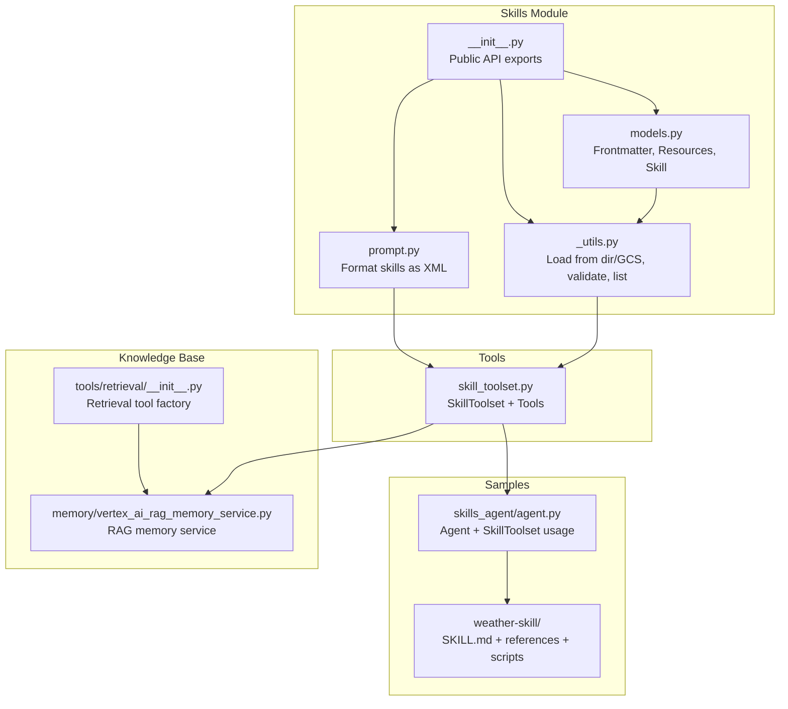
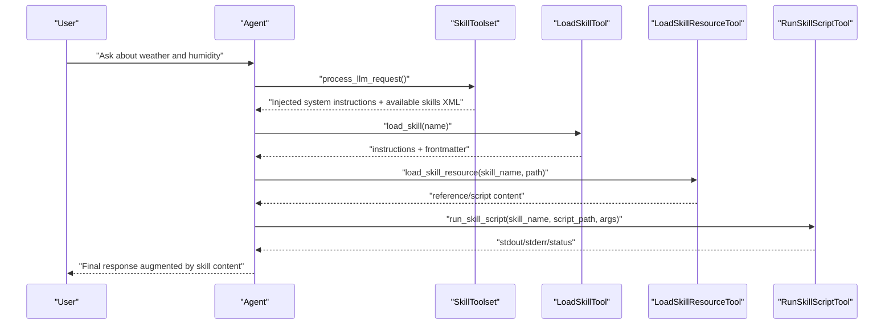
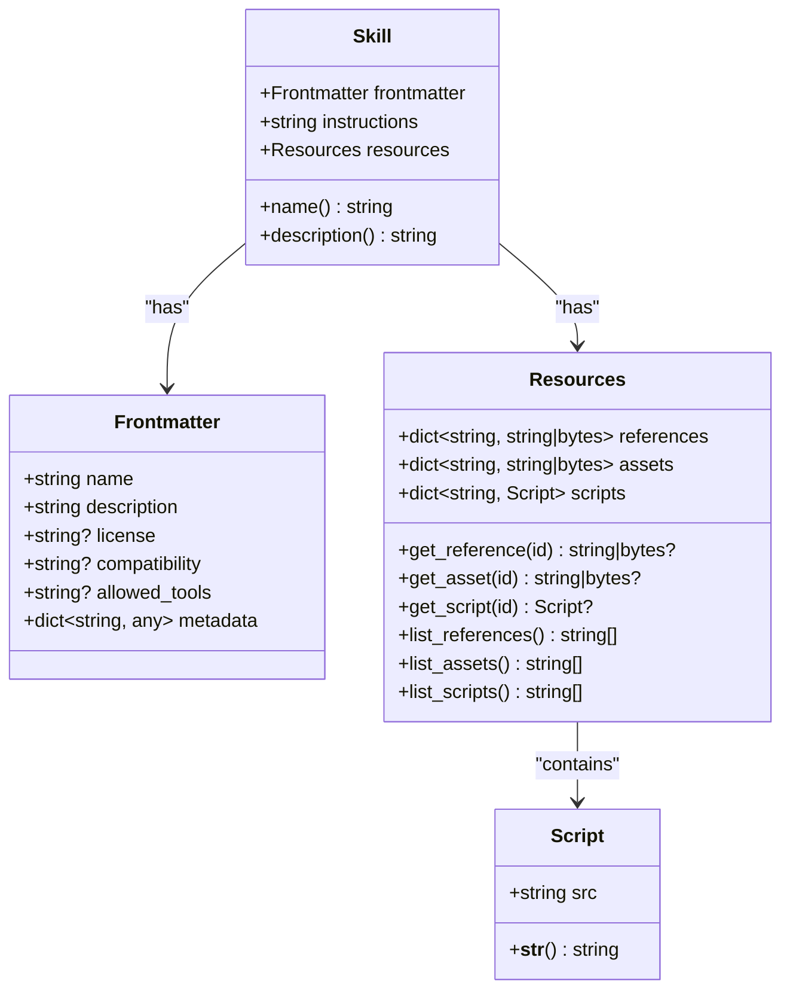
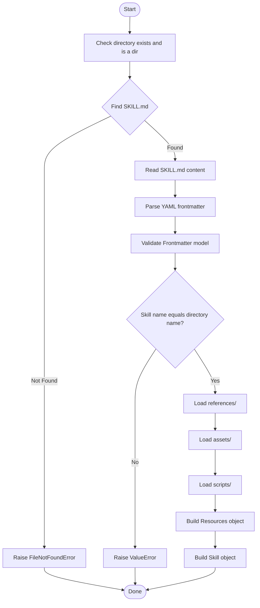
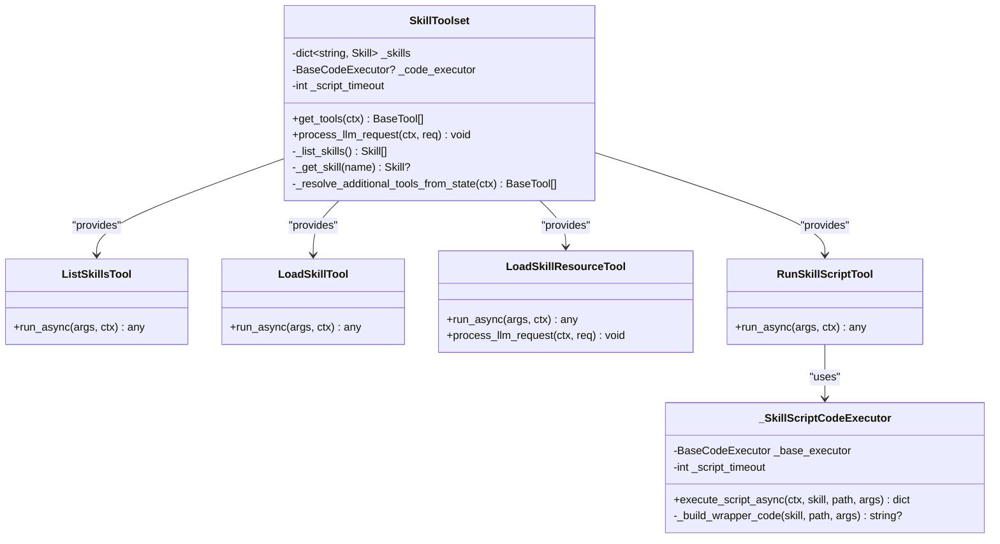
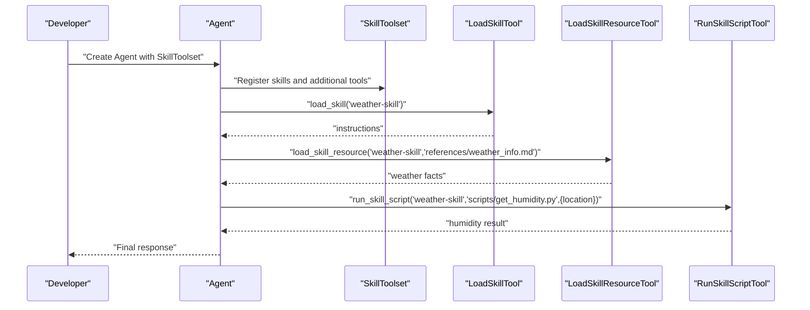
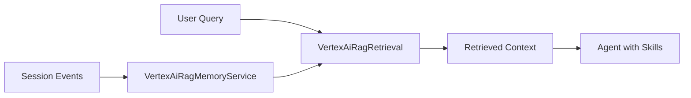
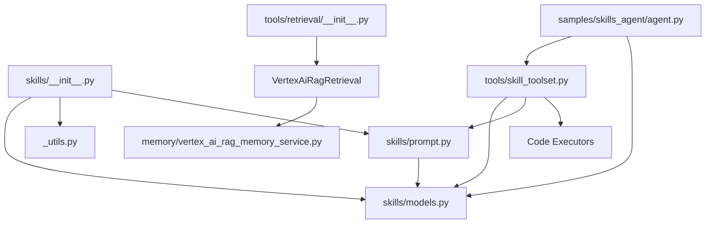

# Skills and Knowledge Base

<cite>
**Referenced Files in This Document**
- [skills/__init__.py](file://src/google/adk/skills/__init__.py)
- [skills/README.md](file://src/google/adk/skills/README.md)
- [skills/models.py](file://src/google/adk/skills/models.py)
- [skills/prompt.py](file://src/google/adk/skills/prompt.py)
- [skills/_utils.py](file://src/google/adk/skills/_utils.py)
- [tools/skill_toolset.py](file://src/google/adk/tools/skill_toolset.py)
- [samples/skills_agent/agent.py](file://contributing/samples/skills_agent/agent.py)
- [samples/skills_agent/skills/weather-skill/SKILL.md](file://contributing/samples/skills_agent/skills/weather-skill/SKILL.md)
- [samples/skills_agent/skills/weather-skill/references/weather_info.md](file://contributing/samples/skills_agent/skills/weather-skill/references/weather_info.md)
- [samples/skills_agent/skills/weather-skill/scripts/get_humidity.py](file://contributing/samples/skills_agent/skills/weather-skill/scripts/get_humidity.py)
- [memory/vertex_ai_rag_memory_service.py](file://src/google/adk/memory/vertex_ai_rag_memory_service.py)
- [tools/retrieval/__init__.py](file://src/google/adk/tools/retrieval/__init__.py)
</cite>

## Table of Contents
1. [Introduction](#introduction)
2. [Project Structure](#project-structure)
3. [Core Components](#core-components)
4. [Architecture Overview](#architecture-overview)
5. [Detailed Component Analysis](#detailed-component-analysis)
6. [Dependency Analysis](#dependency-analysis)
7. [Performance Considerations](#performance-considerations)
8. [Troubleshooting Guide](#troubleshooting-guide)
9. [Conclusion](#conclusion)
10. [Appendices](#appendices)

## Introduction
This document explains the skills and knowledge base system in the Agent Development Kit (ADK). It covers how skills extend agent capabilities through structured instruction sets and resources, how skills integrate with toolsets and agents, and how knowledge bases and retrieval-augmented generation (RAG) can be layered on top. It also provides prompt engineering patterns, skill composition strategies, practical development and deployment examples, versioning and testing guidance, and performance optimization tips.

## Project Structure
The skills system centers around three layers:
- Layer 1 (L1): Frontmatter metadata parsed from SKILL.md for discovery and filtering.
- Layer 2 (L2): Markdown instructions loaded when a skill is triggered.
- Layer 3 (L3): Optional resources (references, assets, scripts) loaded on demand.

The system exposes utilities to discover, load, and validate skills locally and from Google Cloud Storage, and integrates with a toolset that lets agents dynamically access skills and execute scripts.

**Diagram sources**
- [skills/models.py](file://src/google/adk/skills/models.py#L32-L208)
- [skills/_utils.py](file://src/google/adk/skills/_utils.py#L40-L436)
- [skills/prompt.py](file://src/google/adk/skills/prompt.py#L28-L77)
- [skills/__init__.py](file://src/google/adk/skills/__init__.py#L17-L58)
- [tools/skill_toolset.py](file://src/google/adk/tools/skill_toolset.py#L671-L800)
- [samples/skills_agent/agent.py](file://contributing/samples/skills_agent/agent.py#L86-L102)
- [samples/skills_agent/skills/weather-skill/SKILL.md](file://contributing/samples/skills_agent/skills/weather-skill/SKILL.md#L1-L9)
- [memory/vertex_ai_rag_memory_service.py](file://src/google/adk/memory/vertex_ai_rag_memory_service.py#L38-L203)
- [tools/retrieval/__init__.py](file://src/google/adk/tools/retrieval/__init__.py#L15-L57)

**Section sources**
- [skills/README.md](file://src/google/adk/skills/README.md#L1-L12)
- [skills/__init__.py](file://src/google/adk/skills/__init__.py#L17-L58)
- [skills/models.py](file://src/google/adk/skills/models.py#L32-L208)
- [skills/_utils.py](file://src/google/adk/skills/_utils.py#L40-L436)
- [skills/prompt.py](file://src/google/adk/skills/prompt.py#L28-L77)
- [tools/skill_toolset.py](file://src/google/adk/tools/skill_toolset.py#L671-L800)
- [samples/skills_agent/agent.py](file://contributing/samples/skills_agent/agent.py#L86-L102)
- [memory/vertex_ai_rag_memory_service.py](file://src/google/adk/memory/vertex_ai_rag_memory_service.py#L38-L203)
- [tools/retrieval/__init__.py](file://src/google/adk/tools/retrieval/__init__.py#L15-L57)

## Core Components
- Skill data models:
  - Frontmatter: validated metadata (name, description, license, compatibility, allowed_tools, metadata).
  - Resources: references, assets, scripts.
  - Skill: composition of frontmatter, instructions, and resources.
- Utilities:
  - Parse and validate SKILL.md frontmatter and body.
  - Load skills from local directories or Google Cloud Storage.
  - List skills and read frontmatter without loading full content.
- Prompt formatting:
  - Convert available skills to an XML block for injection into system instructions.
- SkillToolset:
  - Provides tools to list, load, fetch resources, and run scripts from skills.
  - Supports dynamic tool resolution via skill metadata.
  - Integrates with code executors for script execution.
- Sample agent:
  - Demonstrates constructing a SkillToolset, registering additional tools, and wiring an Agent.

**Section sources**
- [skills/models.py](file://src/google/adk/skills/models.py#L32-L208)
- [skills/_utils.py](file://src/google/adk/skills/_utils.py#L40-L436)
- [skills/prompt.py](file://src/google/adk/skills/prompt.py#L28-L77)
- [tools/skill_toolset.py](file://src/google/adk/tools/skill_toolset.py#L671-L800)
- [samples/skills_agent/agent.py](file://contributing/samples/skills_agent/agent.py#L86-L102)

## Architecture Overview
The skills system is designed as a layered capability that agents can activate on demand. At runtime, the SkillToolset injects a standardized system instruction and an XML list of available skills. When a user query suggests a relevant skill, the agent invokes the load_skill tool to retrieve L2 instructions, then follows the documented steps. For advanced scenarios, agents can fetch L3 resources and execute scripts through dedicated tools.

**Diagram sources**
- [tools/skill_toolset.py](file://src/google/adk/tools/skill_toolset.py#L780-L790)
- [tools/skill_toolset.py](file://src/google/adk/tools/skill_toolset.py#L108-L165)
- [tools/skill_toolset.py](file://src/google/adk/tools/skill_toolset.py#L168-L269)
- [tools/skill_toolset.py](file://src/google/adk/tools/skill_toolset.py#L562-L668)

## Detailed Component Analysis

### Skill Data Models
The models define the canonical structure for skills and resources, ensuring consistent parsing and validation.

**Diagram sources**
- [skills/models.py](file://src/google/adk/skills/models.py#L32-L208)

**Section sources**
- [skills/models.py](file://src/google/adk/skills/models.py#L32-L208)

### Skill Loading and Validation Utilities
Utilities provide robust parsing and validation of SKILL.md, directory layout checks, and GCS-based discovery.

**Diagram sources**
- [skills/_utils.py](file://src/google/adk/skills/_utils.py#L97-L177)

**Section sources**
- [skills/_utils.py](file://src/google/adk/skills/_utils.py#L40-L436)

### Prompt Formatting for Skills
The prompt formatter generates an XML block of available skills to inject into system instructions, enabling the agent to discover and select relevant skills.

**Section sources**
- [skills/prompt.py](file://src/google/adk/skills/prompt.py#L28-L77)

### SkillToolset and Tools
The SkillToolset orchestrates skill discovery and execution, and supports dynamic tool resolution based on activated skills.

**Diagram sources**
- [tools/skill_toolset.py](file://src/google/adk/tools/skill_toolset.py#L671-L800)
- [tools/skill_toolset.py](file://src/google/adk/tools/skill_toolset.py#L336-L559)

**Section sources**
- [tools/skill_toolset.py](file://src/google/adk/tools/skill_toolset.py#L671-L800)

### Practical Example: Weather Skill
The sample demonstrates a skill with references and a script, plus dynamic tool resolution via metadata.

**Diagram sources**
- [samples/skills_agent/agent.py](file://contributing/samples/skills_agent/agent.py#L86-L102)
- [samples/skills_agent/skills/weather-skill/SKILL.md](file://contributing/samples/skills_agent/skills/weather-skill/SKILL.md#L1-L9)
- [samples/skills_agent/skills/weather-skill/references/weather_info.md](file://contributing/samples/skills_agent/skills/weather-skill/references/weather_info.md#L1-L7)
- [samples/skills_agent/skills/weather-skill/scripts/get_humidity.py](file://contributing/samples/skills_agent/skills/weather-skill/scripts/get_humidity.py#L1-L30)

**Section sources**
- [samples/skills_agent/agent.py](file://contributing/samples/skills_agent/agent.py#L86-L102)
- [samples/skills_agent/skills/weather-skill/SKILL.md](file://contributing/samples/skills_agent/skills/weather-skill/SKILL.md#L1-L9)
- [samples/skills_agent/skills/weather-skill/references/weather_info.md](file://contributing/samples/skills_agent/skills/weather-skill/references/weather_info.md#L1-L7)
- [samples/skills_agent/skills/weather-skill/scripts/get_humidity.py](file://contributing/samples/skills_agent/skills/weather-skill/scripts/get_humidity.py#L1-L30)

### Knowledge Base Integration and RAG
ADK supports retrieval-augmented workflows through memory and retrieval tools. The Vertex AI RAG memory service can index session events and retrieve contextual information, while retrieval tool factories expose pluggable retrieval backends.

**Diagram sources**
- [memory/vertex_ai_rag_memory_service.py](file://src/google/adk/memory/vertex_ai_rag_memory_service.py#L38-L203)
- [tools/retrieval/__init__.py](file://src/google/adk/tools/retrieval/__init__.py#L15-L57)

**Section sources**
- [memory/vertex_ai_rag_memory_service.py](file://src/google/adk/memory/vertex_ai_rag_memory_service.py#L38-L203)
- [tools/retrieval/__init__.py](file://src/google/adk/tools/retrieval/__init__.py#L15-L57)

## Dependency Analysis
- Public API exposure:
  - skills/__init__.py re-exports loader and model classes and provides deprecation warnings for legacy imports.
- Internal dependencies:
  - skills/prompt depends on skills/models for XML formatting.
  - tools/skill_toolset depends on skills models, prompt utilities, and code executors.
  - samples demonstrate usage of skills and toolset integration.
- Retrieval and memory:
  - tools/retrieval/__init__.py conditionally exposes retrieval backends.
  - memory/vertex_ai_rag_memory_service.py integrates with Vertex AI RAG.

**Diagram sources**
- [skills/__init__.py](file://src/google/adk/skills/__init__.py#L17-L58)
- [skills/models.py](file://src/google/adk/skills/models.py#L32-L208)
- [skills/prompt.py](file://src/google/adk/skills/prompt.py#L28-L77)
- [tools/skill_toolset.py](file://src/google/adk/tools/skill_toolset.py#L671-L800)
- [samples/skills_agent/agent.py](file://contributing/samples/skills_agent/agent.py#L86-L102)
- [tools/retrieval/__init__.py](file://src/google/adk/tools/retrieval/__init__.py#L15-L57)
- [memory/vertex_ai_rag_memory_service.py](file://src/google/adk/memory/vertex_ai_rag_memory_service.py#L38-L203)

**Section sources**
- [skills/__init__.py](file://src/google/adk/skills/__init__.py#L17-L58)
- [tools/skill_toolset.py](file://src/google/adk/tools/skill_toolset.py#L671-L800)
- [tools/retrieval/__init__.py](file://src/google/adk/tools/retrieval/__init__.py#L15-L57)

## Performance Considerations
- Payload limits:
  - Skill payloads are constrained to avoid excessive memory usage during script execution.
- Script execution:
  - Shell scripts are executed with timeouts; Python scripts are run via exec/runpy.
  - Binary resources are handled carefully to avoid bloating prompts; they are injected into the LLM request only when accessed.
- Listing and validation:
  - Listing skills avoids loading full content, reducing I/O overhead.
- Retrieval:
  - RAG memory uploads session transcripts and retrieves relevant contexts; tuning similarity_top_k and thresholds improves relevance and latency.

[No sources needed since this section provides general guidance]

## Troubleshooting Guide
Common issues and resolutions:
- Invalid SKILL.md:
  - Missing or malformed frontmatter triggers validation errors; ensure frontmatter is valid YAML and properly closed.
- Directory naming mismatch:
  - Skill name must match the directory name; otherwise loading fails.
- Missing tools:
  - Running run_skill_script without a configured code executor returns an error; configure a code executor in the SkillToolset.
- Resource access:
  - Accessing non-existent references/assets/scripts yields resource-not-found errors; verify paths under references/, assets/, scripts/.
- Binary content:
  - Binary resources are intentionally not embedded in prompts; use load_skill_resource to retrieve and inject when needed.

**Section sources**
- [skills/_utils.py](file://src/google/adk/skills/_utils.py#L179-L232)
- [tools/skill_toolset.py](file://src/google/adk/tools/skill_toolset.py#L628-L668)
- [tools/skill_toolset.py](file://src/google/adk/tools/skill_toolset.py#L205-L269)

## Conclusion
The ADK skills system provides a structured, extensible framework for equipping agents with domain-specific capabilities. By organizing skills into frontmatter, instructions, and resources, and exposing tools to load, inspect, and execute them, agents can compose complex behaviors dynamically. Integrating with RAG and retrieval tools further enhances the agent’s ability to ground responses in external knowledge. Following the design patterns and best practices outlined here will help you develop, version, test, and deploy robust skills at scale.

[No sources needed since this section summarizes without analyzing specific files]

## Appendices

### Prompt Engineering Patterns for Skills
- Discovery and selection:
  - Inject an XML list of skills into system instructions to enable model-driven skill selection.
- Activation and execution:
  - Use explicit steps in skill instructions to guide the model through loading references, validating inputs, and running scripts.
- Safety and constraints:
  - Enforce allowed tools and controlled resource access via frontmatter and metadata.
- Binary handling:
  - Avoid embedding binary content in prompts; surface it only when explicitly requested.

**Section sources**
- [skills/prompt.py](file://src/google/adk/skills/prompt.py#L28-L77)
- [tools/skill_toolset.py](file://src/google/adk/tools/skill_toolset.py#L60-L75)
- [tools/skill_toolset.py](file://src/google/adk/tools/skill_toolset.py#L270-L334)

### Skill Composition for Complex Problem-Solving
- Modularization:
  - Split large tasks into smaller skills with focused responsibilities.
- Orchestration:
  - Compose skills by chaining load_skill and run_skill_script calls, using references as shared state.
- Dynamic tooling:
  - Use skill metadata to dynamically register additional tools only when a skill is activated.

**Section sources**
- [skills/models.py](file://src/google/adk/skills/models.py#L180-L208)
- [tools/skill_toolset.py](file://src/google/adk/tools/skill_toolset.py#L729-L771)

### Knowledge Base Integration Patterns
- Indexing:
  - Convert session events to a text format and upload to Vertex AI RAG.
- Retrieval:
  - Query RAG with user intent to retrieve relevant context segments.
- Augmentation:
  - Merge retrieved contexts with agent prompts to improve accuracy and grounding.

**Section sources**
- [memory/vertex_ai_rag_memory_service.py](file://src/google/adk/memory/vertex_ai_rag_memory_service.py#L66-L122)

### Practical Examples: Development and Deployment
- Local development:
  - Create a skill directory with SKILL.md, references/, assets/, scripts/; load it with load_skill_from_dir and register in a SkillToolset.
- GCS-based skills:
  - Store skills in a GCS bucket and list/load them remotely using provided utilities.
- Agent wiring:
  - Instantiate an Agent with the SkillToolset and optional additional tools; ensure a code executor is configured for script execution.

**Section sources**
- [skills/_utils.py](file://src/google/adk/skills/_utils.py#L301-L347)
- [samples/skills_agent/agent.py](file://contributing/samples/skills_agent/agent.py#L86-L102)

### Versioning, Testing, and Optimization
- Versioning:
  - Use directory names and frontmatter metadata to track skill versions; keep SKILL.md consistent across versions.
- Testing:
  - Validate skills with _validate_skill_dir and unit tests for parsing and tool behavior.
- Optimization:
  - Limit payload sizes, tune retrieval thresholds, and minimize unnecessary resource access to reduce latency and cost.

**Section sources**
- [skills/_utils.py](file://src/google/adk/skills/_utils.py#L179-L232)
- [tools/skill_toolset.py](file://src/google/adk/tools/skill_toolset.py#L51-L52)
- [memory/vertex_ai_rag_memory_service.py](file://src/google/adk/memory/vertex_ai_rag_memory_service.py#L44-L63)