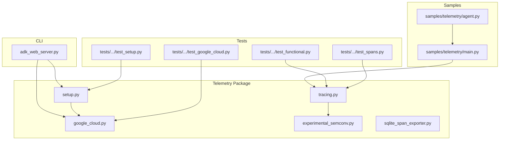
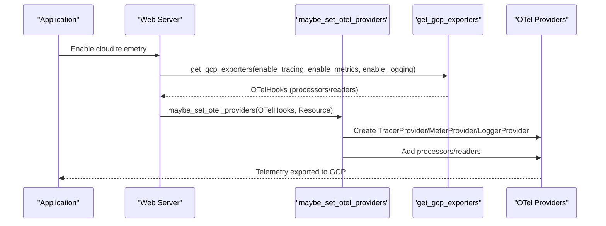
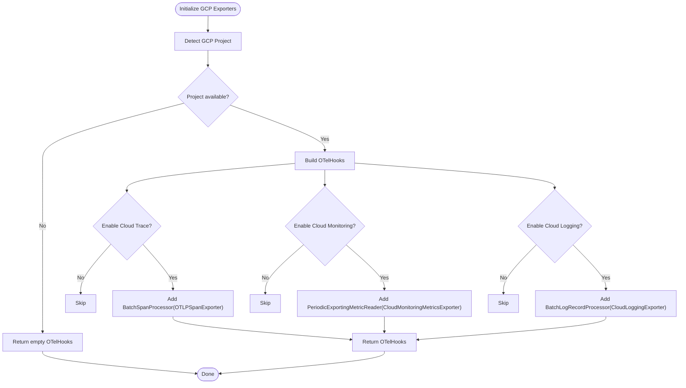
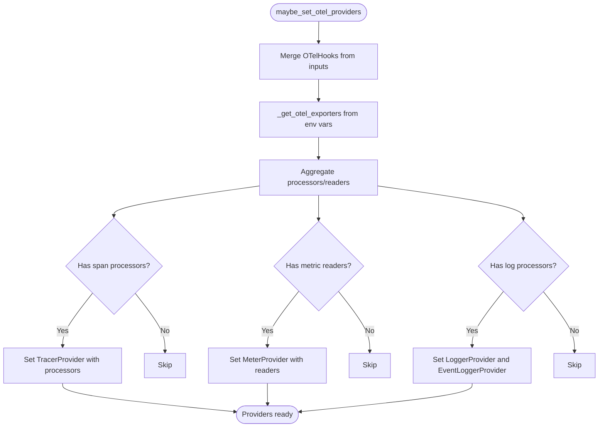
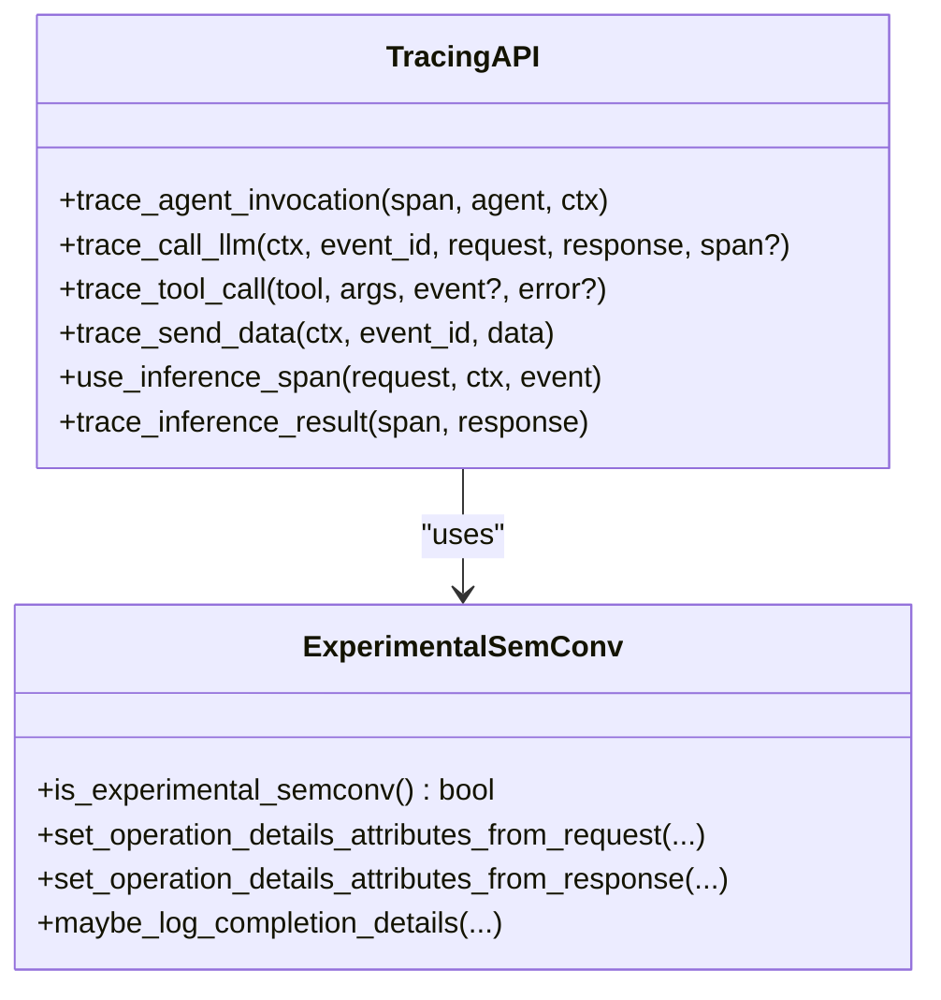
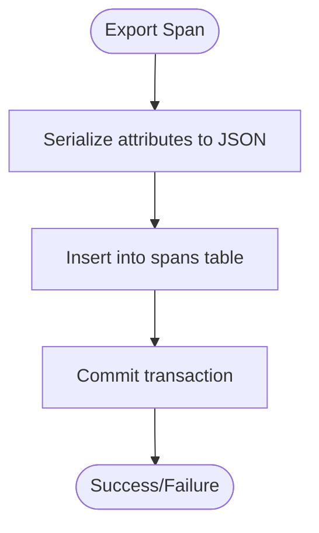
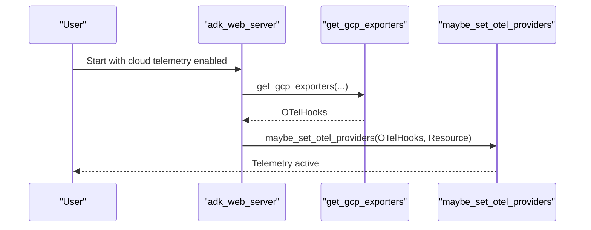
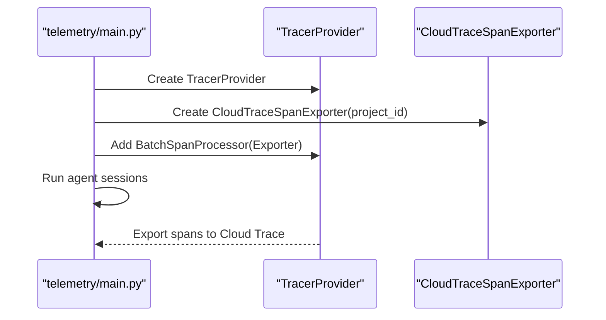
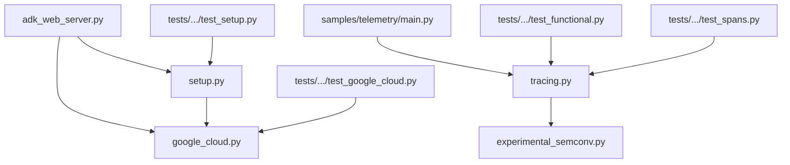

# Cloud Integration and Monitoring

<cite>
**Referenced Files in This Document**
- [google_cloud.py](file://src/google/adk/telemetry/google_cloud.py)
- [setup.py](file://src/google/adk/telemetry/setup.py)
- [tracing.py](file://src/google/adk/telemetry/tracing.py)
- [_experimental_semconv.py](file://src/google/adk/telemetry/_experimental_semconv.py)
- [sqlite_span_exporter.py](file://src/google/adk/telemetry/sqlite_span_exporter.py)
- [adk_web_server.py](file://src/google/adk/cli/adk_web_server.py)
- [main.py](file://contributing/samples/telemetry/main.py)
- [agent.py](file://contributing/samples/telemetry/agent.py)
- [test_google_cloud.py](file://tests/unittests/telemetry/test_google_cloud.py)
- [test_setup.py](file://tests/unittests/telemetry/test_setup.py)
- [test_functional.py](file://tests/unittests/telemetry/test_functional.py)
- [test_spans.py](file://tests/unittests/telemetry/test_spans.py)
</cite>

## Table of Contents
1. [Introduction](#introduction)
2. [Project Structure](#project-structure)
3. [Core Components](#core-components)
4. [Architecture Overview](#architecture-overview)
5. [Detailed Component Analysis](#detailed-component-analysis)
6. [Dependency Analysis](#dependency-analysis)
7. [Performance Considerations](#performance-considerations)
8. [Troubleshooting Guide](#troubleshooting-guide)
9. [Conclusion](#conclusion)
10. [Appendices](#appendices)

## Introduction
This document explains how the Agent Development Kit (ADK) integrates with Google Cloud's observability suite for cloud-native monitoring. It covers how ADK telemetry connects with Cloud Trace, Cloud Monitoring, and Cloud Logging, how to configure exports to Google Cloud, and how to leverage GCP-specific features for agent monitoring. It also details service names, resource attributes, labeling strategies, and practical examples for building dashboards, alerts, and performance metrics for agent deployments.

## Project Structure
The telemetry subsystem resides under the ADK package and consists of:
- Google Cloud exporters and resource detection
- OpenTelemetry provider setup and environment-based exporters
- Distributed tracing helpers and semantic conventions
- Local SQLite span exporter for development
- CLI integration for automatic telemetry setup
- Sample and test coverage demonstrating usage

**Diagram sources**
- [google_cloud.py](file://src/google/adk/telemetry/google_cloud.py#L44-L94)
- [setup.py](file://src/google/adk/telemetry/setup.py#L48-L123)
- [tracing.py](file://src/google/adk/telemetry/tracing.py#L95-L105)
- [_experimental_semconv.py](file://src/google/adk/telemetry/_experimental_semconv.py#L142-L147)
- [sqlite_span_exporter.py](file://src/google/adk/telemetry/sqlite_span_exporter.py#L76-L87)
- [adk_web_server.py](file://src/google/adk/cli/adk_web_server.py#L376-L392)
- [main.py](file://contributing/samples/telemetry/main.py#L104-L113)
- [test_google_cloud.py](file://tests/unittests/telemetry/test_google_cloud.py#L24-L60)
- [test_setup.py](file://tests/unittests/telemetry/test_setup.py#L29-L107)
- [test_functional.py](file://tests/unittests/telemetry/test_functional.py#L85-L134)
- [test_spans.py](file://tests/unittests/telemetry/test_spans.py#L111-L133)

**Section sources**
- [google_cloud.py](file://src/google/adk/telemetry/google_cloud.py#L44-L161)
- [setup.py](file://src/google/adk/telemetry/setup.py#L48-L173)
- [tracing.py](file://src/google/adk/telemetry/tracing.py#L95-L105)
- [adk_web_server.py](file://src/google/adk/cli/adk_web_server.py#L376-L392)

## Core Components
- Google Cloud exporters: Provides OTel hooks for Cloud Trace, Cloud Monitoring, and Cloud Logging using GCP credentials and project context.
- Provider setup: Centralized function to initialize OTel providers and attach exporters conditionally based on environment variables.
- Tracing helpers: High-level tracing APIs for agent invocation, tool execution, LLM calls, and data sending, with standardized attributes and semantic conventions.
- Experimental semantic conventions: Captures detailed input/output messages, tool definitions, and finish reasons for advanced observability.
- SQLite span exporter: Local development exporter for storing spans in a SQLite database for inspection and reloading traces.
- CLI integration: Automatic setup of GCP telemetry when enabled in the web server.

Key responsibilities:
- Export telemetry to Google Cloud when configured
- Attach standardized attributes for correlation and filtering
- Support both stable and experimental semantic conventions
- Allow fallback to local development storage

**Section sources**
- [google_cloud.py](file://src/google/adk/telemetry/google_cloud.py#L44-L161)
- [setup.py](file://src/google/adk/telemetry/setup.py#L48-L173)
- [tracing.py](file://src/google/adk/telemetry/tracing.py#L130-L404)
- [_experimental_semconv.py](file://src/google/adk/telemetry/_experimental_semconv.py#L425-L519)
- [sqlite_span_exporter.py](file://src/google/adk/telemetry/sqlite_span_exporter.py#L76-L235)
- [adk_web_server.py](file://src/google/adk/cli/adk_web_server.py#L376-L392)

## Architecture Overview
ADK integrates with Google Cloud observability through OTel hooks and providers. The flow below shows how telemetry is configured and exported to GCP services.

**Diagram sources**
- [adk_web_server.py](file://src/google/adk/cli/adk_web_server.py#L376-L392)
- [google_cloud.py](file://src/google/adk/telemetry/google_cloud.py#L44-L94)
- [setup.py](file://src/google/adk/telemetry/setup.py#L48-L123)

## Detailed Component Analysis

### Google Cloud Exporters and Resource Detection
- get_gcp_exporters: Creates OTel hooks for Cloud Trace, Cloud Monitoring, and Cloud Logging based on flags and GCP credentials. It validates project context and returns empty hooks if project cannot be determined.
- get_gcp_resource: Builds an OTel Resource merging explicit project ID, environment-detected attributes, and GCP platform detectors for monitored resources.

**Diagram sources**
- [google_cloud.py](file://src/google/adk/telemetry/google_cloud.py#L44-L94)
- [google_cloud.py](file://src/google/adk/telemetry/google_cloud.py#L133-L161)

**Section sources**
- [google_cloud.py](file://src/google/adk/telemetry/google_cloud.py#L44-L161)

### OTel Provider Setup and Environment-Based Exporters
- maybe_set_otel_providers: Sets up OTel providers only if none are globally configured. It aggregates processors/readers from all provided hooks and registers them. It also automatically detects and attaches generic OTLP exporters from environment variables.
- _get_otel_exporters: Reads OTEL_EXPORTER_OTLP_* environment variables and creates OTLP exporters accordingly.

**Diagram sources**
- [setup.py](file://src/google/adk/telemetry/setup.py#L48-L123)
- [setup.py](file://src/google/adk/telemetry/setup.py#L131-L173)

**Section sources**
- [setup.py](file://src/google/adk/telemetry/setup.py#L48-L173)

### Tracing Helpers and Semantic Conventions
- Tracer and logger initialization: Uses module name and version with schema URL for consistent identification.
- High-level tracing functions:
  - trace_agent_invocation: Sets agent invocation attributes aligned with semantic conventions.
  - trace_call_llm: Records LLM request/response attributes, token usage, and finish reasons.
  - trace_tool_call: Records tool execution attributes and sanitized tool response.
  - trace_send_data: Records data sent to the agent with optional content capture.
  - use_inference_span / trace_inference_result: Manages inference spans with experimental semantic conventions.
- Content capture controls: Environment variables govern whether prompt/response content is included in spans to balance observability and privacy.

**Diagram sources**
- [tracing.py](file://src/google/adk/telemetry/tracing.py#L130-L404)
- [tracing.py](file://src/google/adk/telemetry/tracing.py#L484-L527)
- [_experimental_semconv.py](file://src/google/adk/telemetry/_experimental_semconv.py#L425-L519)

**Section sources**
- [tracing.py](file://src/google/adk/telemetry/tracing.py#L95-L105)
- [tracing.py](file://src/google/adk/telemetry/tracing.py#L130-L404)
- [tracing.py](file://src/google/adk/telemetry/tracing.py#L484-L527)
- [_experimental_semconv.py](file://src/google/adk/telemetry/_experimental_semconv.py#L142-L147)

### Local Development Exporter (SQLite)
- SqliteSpanExporter: Stores spans locally in a SQLite database for development and debugging. Supports indexing by session and trace IDs, and can reconstruct full trace trees for a session.

**Diagram sources**
- [sqlite_span_exporter.py](file://src/google/adk/telemetry/sqlite_span_exporter.py#L128-L161)

**Section sources**
- [sqlite_span_exporter.py](file://src/google/adk/telemetry/sqlite_span_exporter.py#L76-L235)

### CLI Integration for Cloud Telemetry
- The web server automatically configures GCP telemetry when enabled, combining internal exporters with GCP exporters and resource detection.

**Diagram sources**
- [adk_web_server.py](file://src/google/adk/cli/adk_web_server.py#L376-L392)
- [google_cloud.py](file://src/google/adk/telemetry/google_cloud.py#L44-L94)
- [setup.py](file://src/google/adk/telemetry/setup.py#L48-L123)

**Section sources**
- [adk_web_server.py](file://src/google/adk/cli/adk_web_server.py#L376-L392)

### Practical Examples: Telemetry Sample and Tests
- Sample main demonstrates setting up Cloud Trace exporter with a TracerProvider and running agent sessions.
- Unit tests validate exporter selection, resource detection, provider setup, and span attribute recording.

**Diagram sources**
- [main.py](file://contributing/samples/telemetry/main.py#L104-L113)

**Section sources**
- [main.py](file://contributing/samples/telemetry/main.py#L104-L113)
- [test_google_cloud.py](file://tests/unittests/telemetry/test_google_cloud.py#L24-L60)
- [test_setup.py](file://tests/unittests/telemetry/test_setup.py#L29-L107)
- [test_functional.py](file://tests/unittests/telemetry/test_functional.py#L85-L134)
- [test_spans.py](file://tests/unittests/telemetry/test_spans.py#L111-L133)

## Dependency Analysis
The telemetry subsystem composes several OTel components and GCP exporters. The primary dependencies are:
- OTel SDK components for tracing, metrics, logging, and resource detection
- GCP exporters for Cloud Trace, Cloud Monitoring, and Cloud Logging
- Environment variables controlling exporter activation and content capture

**Diagram sources**
- [tracing.py](file://src/google/adk/telemetry/tracing.py#L67-L73)
- [setup.py](file://src/google/adk/telemetry/setup.py#L34-L38)
- [google_cloud.py](file://src/google/adk/telemetry/google_cloud.py#L28-L31)
- [adk_web_server.py](file://src/google/adk/cli/adk_web_server.py#L376-L392)
- [main.py](file://contributing/samples/telemetry/main.py#L26-L29)
- [test_google_cloud.py](file://tests/unittests/telemetry/test_google_cloud.py#L19-L21)
- [test_setup.py](file://tests/unittests/telemetry/test_setup.py#L18-L19)
- [test_functional.py](file://tests/unittests/telemetry/test_functional.py#L25-L28)
- [test_spans.py](file://tests/unittests/telemetry/test_spans.py#L38-L54)

**Section sources**
- [tracing.py](file://src/google/adk/telemetry/tracing.py#L67-L73)
- [setup.py](file://src/google/adk/telemetry/setup.py#L34-L38)
- [google_cloud.py](file://src/google/adk/telemetry/google_cloud.py#L28-L31)

## Performance Considerations
- Export batching: BatchSpanProcessor and PeriodicExportingMetricReader reduce network overhead and cost.
- Conditional content capture: Environment variables allow disabling content capture to minimize payload size and cost.
- Resource detection: GCP resource detectors add monitored resource attributes automatically when available, reducing manual configuration.
- Local development: SQLite exporter avoids network costs during development and supports trace reconstruction.

[No sources needed since this section provides general guidance]

## Troubleshooting Guide
Common issues and resolutions:
- Project ID not detected: If GCP project cannot be determined, exporters return empty hooks. Ensure proper authentication and project context.
- Provider already set: If OTel providers are set externally, ADK setup becomes a no-op. Configure providers centrally or avoid duplicate setup.
- Content capture disabled: If content capture is disabled, spans show placeholders. Adjust environment variables to include content for debugging.
- Instrumentation conflicts: When external instrumentation is present, ADK delegates inference span creation to the instrumentation library.

**Section sources**
- [google_cloud.py](file://src/google/adk/telemetry/google_cloud.py#L66-L71)
- [setup.py](file://src/google/adk/telemetry/setup.py#L90-L123)
- [tracing.py](file://src/google/adk/telemetry/tracing.py#L442-L447)
- [tracing.py](file://src/google/adk/telemetry/tracing.py#L557-L567)

## Conclusion
ADK provides a robust, extensible foundation for cloud-native observability on Google Cloud. By leveraging standardized semantic conventions, configurable exporters, and environment-driven setup, teams can monitor agent behavior, correlate traces with infrastructure metrics, and build actionable dashboards and alerts. The combination of Cloud Trace, Cloud Monitoring, and Cloud Logging enables comprehensive visibility while maintaining cost-conscious defaults.

[No sources needed since this section summarizes without analyzing specific files]

## Appendices

### Configuration Reference
- Environment variables for exporters:
  - OTEL_EXPORTER_OTLP_ENDPOINT
  - OTEL_EXPORTER_OTLP_TRACES_ENDPOINT
  - OTEL_EXPORTER_OTLP_METRICS_ENDPOINT
  - OTEL_EXPORTER_OTLP_LOGS_ENDPOINT
- Content capture controls:
  - ADK_CAPTURE_MESSAGE_CONTENT_IN_SPANS
  - OTEL_INSTRUMENTATION_GENAI_CAPTURE_MESSAGE_CONTENT
- GCP resource attributes:
  - gcp.project_id via environment or resource detection

**Section sources**
- [setup.py](file://src/google/adk/telemetry/setup.py#L55-L61)
- [tracing.py](file://src/google/adk/telemetry/tracing.py#L77-L82)
- [google_cloud.py](file://src/google/adk/telemetry/google_cloud.py#L133-L161)

### Best Practices for Cloud-Native Monitoring
- Use semantic conventions consistently across spans and logs for reliable correlation.
- Enable content capture selectively for debugging; disable in production to reduce cost.
- Leverage GCP resource detection to automatically annotate monitored resources.
- Combine Cloud Trace with Cloud Monitoring metrics for end-to-end visibility.
- Use Cloud Logging for structured logs emitted alongside spans.

[No sources needed since this section provides general guidance]