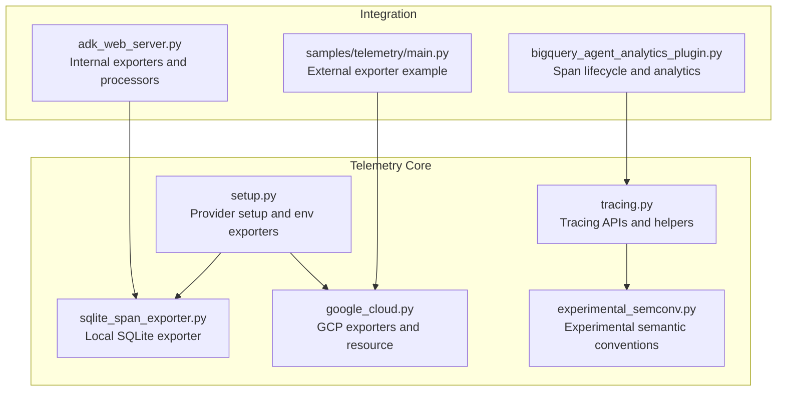
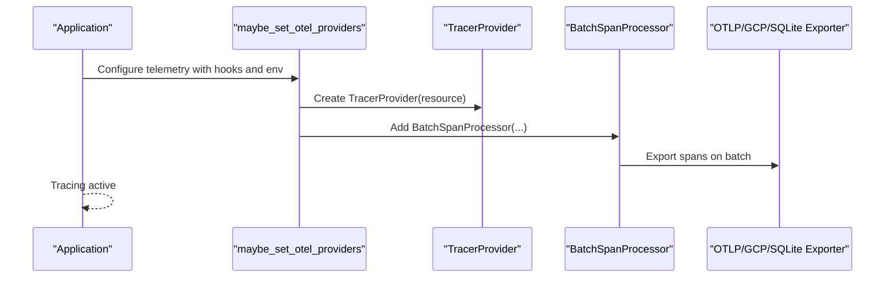
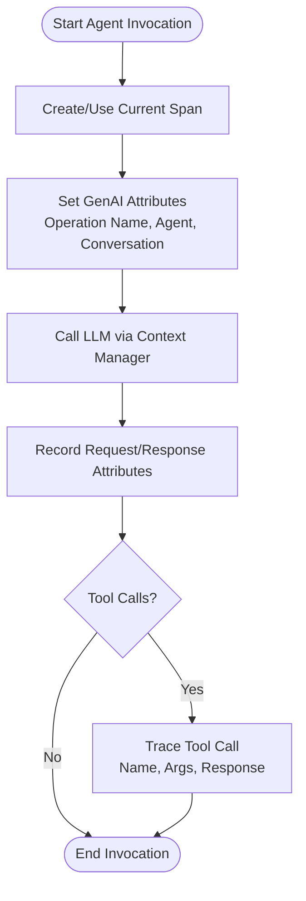
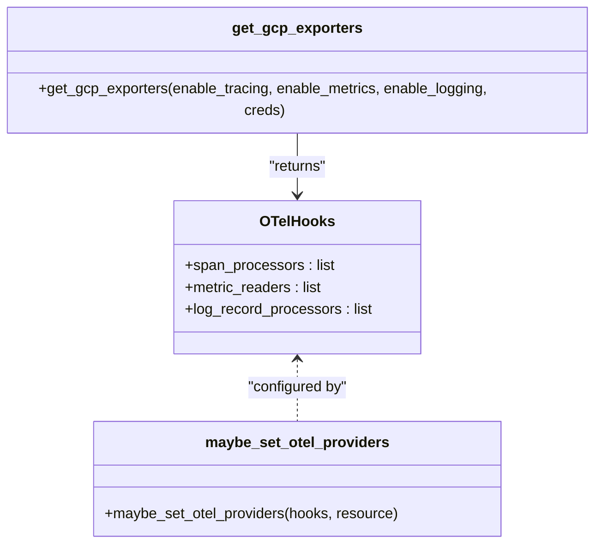
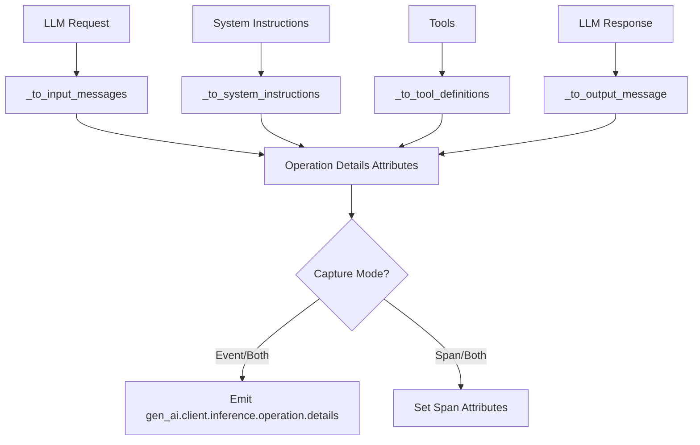
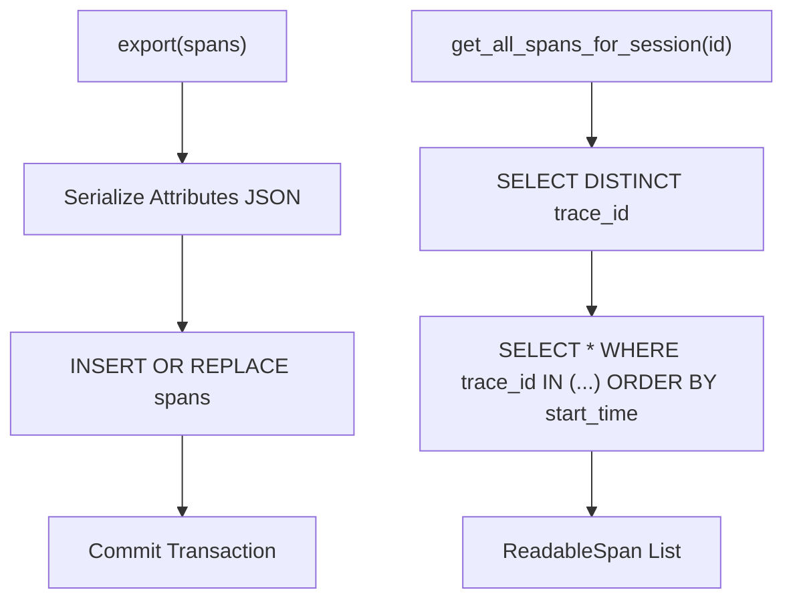
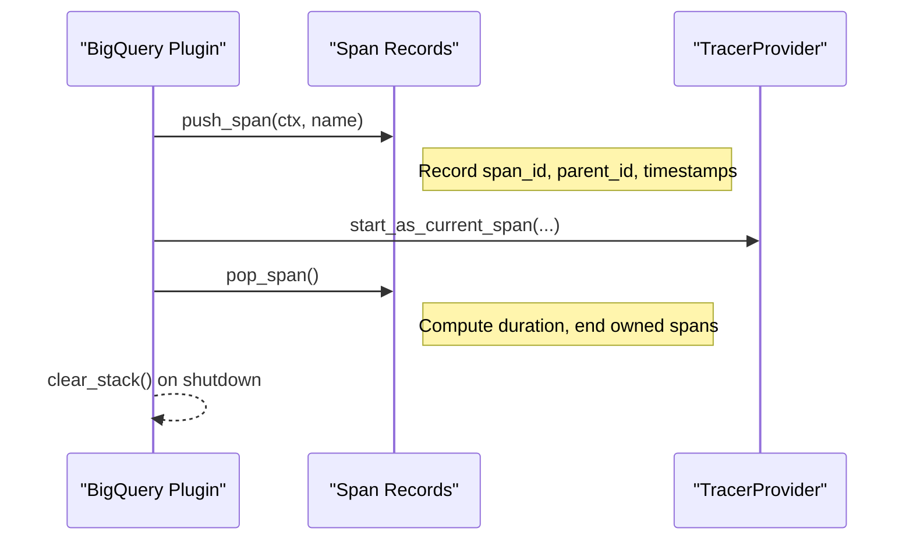
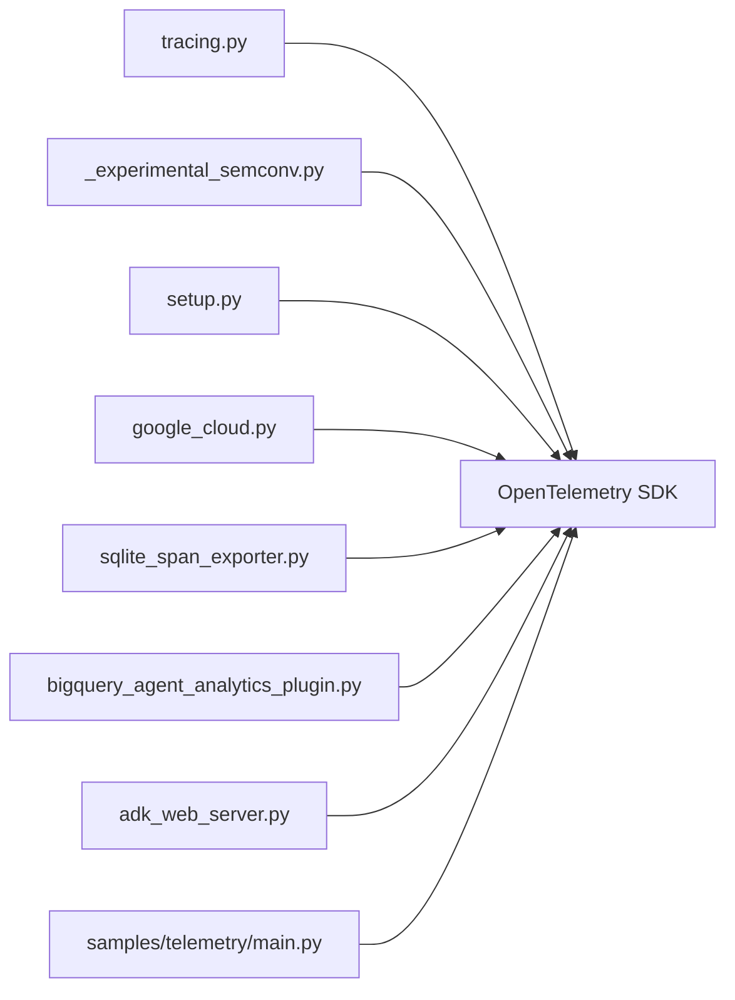

# Distributed Tracing System

<cite>
**Referenced Files in This Document**
- [tracing.py](file://src/google/adk/telemetry/tracing.py)
- [setup.py](file://src/google/adk/telemetry/setup.py)
- [google_cloud.py](file://src/google/adk/telemetry/google_cloud.py)
- [sqlite_span_exporter.py](file://src/google/adk/telemetry/sqlite_span_exporter.py)
- [_experimental_semconv.py](file://src/google/adk/telemetry/_experimental_semconv.py)
- [bigquery_agent_analytics_plugin.py](file://src/google/adk/plugins/bigquery_agent_analytics_plugin.py)
- [adk_web_server.py](file://src/google/adk/cli/adk_web_server.py)
- [main.py](file://contributing/samples/telemetry/main.py)
- [test_sqlite_span_exporter.py](file://tests/unittests/telemetry/test_sqlite_span_exporter.py)
</cite>

## Table of Contents
1. [Introduction](#introduction)
2. [Project Structure](#project-structure)
3. [Core Components](#core-components)
4. [Architecture Overview](#architecture-overview)
5. [Detailed Component Analysis](#detailed-component-analysis)
6. [Dependency Analysis](#dependency-analysis)
7. [Performance Considerations](#performance-considerations)
8. [Troubleshooting Guide](#troubleshooting-guide)
9. [Conclusion](#conclusion)
10. [Appendices](#appendices)

## Introduction
This document describes the distributed tracing system in the Agent Development Kit (ADK). It explains how spans are created, correlated, and exported; how span processors and batch processing operate; and how agent executions, tool calls, and external API requests are traced. It also covers integration with OpenTelemetry trace providers, configuration of custom span processors, tracing configuration for agent workflows, parent-child span relationships, context propagation, and best practices for multi-agent systems, performance monitoring, and debugging. Finally, it documents integration with tracing backends and visualization tools.

## Project Structure
The tracing system is centered around the telemetry module and integrates with OpenTelemetry SDKs for traces, logs, and metrics. Key elements include:
- Tracing APIs for agent invocation, tool execution, and LLM calls
- Provider setup and environment-driven exporters
- Experimental semantic conventions for richer operation details
- SQLite-backed exporter for local development
- Plugin-based analytics for BigQuery with span lifecycle management
- Web server integration for in-memory and API server-side exporters

**Diagram sources**
- [tracing.py](file://src/google/adk/telemetry/tracing.py#L1-L797)
- [_experimental_semconv.py](file://src/google/adk/telemetry/_experimental_semconv.py#L1-L519)
- [setup.py](file://src/google/adk/telemetry/setup.py#L1-L173)
- [google_cloud.py](file://src/google/adk/telemetry/google_cloud.py#L1-L161)
- [sqlite_span_exporter.py](file://src/google/adk/telemetry/sqlite_span_exporter.py#L1-L235)
- [adk_web_server.py](file://src/google/adk/cli/adk_web_server.py#L724-L764)
- [main.py](file://contributing/samples/telemetry/main.py#L1-L119)
- [bigquery_agent_analytics_plugin.py](file://src/google/adk/plugins/bigquery_agent_analytics_plugin.py#L1-L200)

**Section sources**
- [tracing.py](file://src/google/adk/telemetry/tracing.py#L1-L797)
- [setup.py](file://src/google/adk/telemetry/setup.py#L1-L173)
- [google_cloud.py](file://src/google/adk/telemetry/google_cloud.py#L1-L161)
- [sqlite_span_exporter.py](file://src/google/adk/telemetry/sqlite_span_exporter.py#L1-L235)
- [_experimental_semconv.py](file://src/google/adk/telemetry/_experimental_semconv.py#L1-L519)
- [adk_web_server.py](file://src/google/adk/cli/adk_web_server.py#L724-L764)
- [main.py](file://contributing/samples/telemetry/main.py#L1-L119)
- [bigquery_agent_analytics_plugin.py](file://src/google/adk/plugins/bigquery_agent_analytics_plugin.py#L1-L200)

## Core Components
- Tracing APIs:
  - Agent invocation, tool execution, and LLM call tracing functions
  - Context managers for inference spans with stable and experimental semantic conventions
- Provider setup:
  - Environment-driven OTLP exporters for traces, metrics, and logs
  - GCP-specific exporters and resource configuration
- Experimental semantic conventions:
  - Enhanced input/output messages, tool definitions, finish reasons, and token usage
- Local development exporter:
  - SQLite-backed span exporter with indexing and session-scoped queries
- Plugin analytics:
  - Span stack management, duration calculation, and first-token timing
- Web server integration:
  - Internal exporters and processor registration for UI and API server scenarios

**Section sources**
- [tracing.py](file://src/google/adk/telemetry/tracing.py#L130-L797)
- [setup.py](file://src/google/adk/telemetry/setup.py#L48-L173)
- [_experimental_semconv.py](file://src/google/adk/telemetry/_experimental_semconv.py#L142-L519)
- [sqlite_span_exporter.py](file://src/google/adk/telemetry/sqlite_span_exporter.py#L76-L235)
- [bigquery_agent_analytics_plugin.py](file://src/google/adk/plugins/bigquery_agent_analytics_plugin.py#L738-L859)
- [adk_web_server.py](file://src/google/adk/cli/adk_web_server.py#L724-L764)

## Architecture Overview
The tracing architecture combines:
- OpenTelemetry TracerProvider and SpanProcessor pipeline
- ADK tracing helpers that annotate spans with GenAI semantic attributes
- Optional integration with external instrumentation (e.g., GenAI SDK)
- Multiple exporters (OTLP, GCP, SQLite, in-memory) depending on environment and runtime

**Diagram sources**
- [setup.py](file://src/google/adk/telemetry/setup.py#L48-L123)

## Detailed Component Analysis

### Tracing APIs and Spans
- Agent invocation tracing sets GenAI attributes for operation name, agent description/name, and conversation/session identifiers.
- Tool execution tracing annotates spans with tool metadata, optional request/response content, and error types.
- LLM call tracing records model, config, tokens, finish reasons, and optional request/response payloads.
- Inference span context managers manage native spans and delegate to external instrumentation when available.
- Experimental semantic conventions capture detailed input messages, system instructions, tool definitions, and output messages/events.

**Diagram sources**
- [tracing.py](file://src/google/adk/telemetry/tracing.py#L130-L368)
- [tracing.py](file://src/google/adk/telemetry/tracing.py#L483-L527)
- [_experimental_semconv.py](file://src/google/adk/telemetry/_experimental_semconv.py#L432-L478)

**Section sources**
- [tracing.py](file://src/google/adk/telemetry/tracing.py#L130-L368)
- [tracing.py](file://src/google/adk/telemetry/tracing.py#L483-L797)
- [_experimental_semconv.py](file://src/google/adk/telemetry/_experimental_semconv.py#L425-L519)

### Provider Setup and Exporters
- Environment variables drive automatic OTLP exporters for traces, metrics, and logs.
- GCP exporters are available for Cloud Trace, Cloud Monitoring, and Cloud Logging when credentials and project ID are configured.
- SQLite exporter persists spans locally for development and supports session-scoped queries.

**Diagram sources**
- [setup.py](file://src/google/adk/telemetry/setup.py#L41-L123)
- [google_cloud.py](file://src/google/adk/telemetry/google_cloud.py#L44-L94)

**Section sources**
- [setup.py](file://src/google/adk/telemetry/setup.py#L48-L173)
- [google_cloud.py](file://src/google/adk/telemetry/google_cloud.py#L44-L161)

### Experimental Semantic Conventions
- Captures input messages, system instructions, tool definitions, and output messages.
- Supports content capturing modes and logs operation details as events or span attributes.
- Provides helpers to transform LLM request/response into structured parts and roles.

**Diagram sources**
- [_experimental_semconv.py](file://src/google/adk/telemetry/_experimental_semconv.py#L432-L478)
- [_experimental_semconv.py](file://src/google/adk/telemetry/_experimental_semconv.py#L480-L519)

**Section sources**
- [_experimental_semconv.py](file://src/google/adk/telemetry/_experimental_semconv.py#L142-L519)

### SQLite Span Exporter (Local Development)
- Stores spans in a local SQLite database with indices on session and trace IDs.
- Serializes/deserializes attributes safely, with fallbacks for non-serializable values.
- Retrieves full trace trees for a session using derived trace IDs.

**Diagram sources**
- [sqlite_span_exporter.py](file://src/google/adk/telemetry/sqlite_span_exporter.py#L128-L175)
- [sqlite_span_exporter.py](file://src/google/adk/telemetry/sqlite_span_exporter.py#L213-L235)

**Section sources**
- [sqlite_span_exporter.py](file://src/google/adk/telemetry/sqlite_span_exporter.py#L76-L235)
- [test_sqlite_span_exporter.py](file://tests/unittests/telemetry/test_sqlite_span_exporter.py#L129-L176)

### Plugin Analytics and Span Lifecycle
- Manages a stack of span records with push/pop semantics.
- Calculates durations using OTel span start_time or fallback timestamps.
- Records first-token timestamps and exposes helpers to query current span IDs and parents.

**Diagram sources**
- [bigquery_agent_analytics_plugin.py](file://src/google/adk/plugins/bigquery_agent_analytics_plugin.py#L738-L859)

**Section sources**
- [bigquery_agent_analytics_plugin.py](file://src/google/adk/plugins/bigquery_agent_analytics_plugin.py#L738-L859)

### Web Server Integration
- Registers internal exporters and processors for API server and UI scenarios.
- Integrates with in-memory exporters and custom span exporters for trace inspection.

**Section sources**
- [adk_web_server.py](file://src/google/adk/cli/adk_web_server.py#L724-L764)

### Practical Examples and Best Practices
- Adding custom spans for agent operations, tool execution timing, and external service calls:
  - Use the tracer to start spans around agent steps and tool calls.
  - Annotate spans with GenAI semantic attributes via provided helpers.
  - For LLM calls, wrap generation in the inference span context manager to capture detailed operation details.
- Multi-agent systems:
  - Maintain parent-child relationships by nesting spans; ensure each agent’s span is a child of the previous agent or invocation span.
  - Use session and invocation IDs consistently across spans to correlate end-to-end workflows.
- Performance monitoring and debugging:
  - Prefer batch processors for production; adjust batch sizes and timeouts based on throughput.
  - Use the SQLite exporter for local development and quick iteration.
  - Enable experimental semantic conventions for richer insights into inputs, outputs, and tool definitions.
- Backend integration:
  - Configure OTLP endpoints via environment variables for cloud backends.
  - For GCP, use the provided GCP exporters and resource configuration.

**Section sources**
- [tracing.py](file://src/google/adk/telemetry/tracing.py#L130-L368)
- [tracing.py](file://src/google/adk/telemetry/tracing.py#L483-L797)
- [setup.py](file://src/google/adk/telemetry/setup.py#L131-L173)
- [google_cloud.py](file://src/google/adk/telemetry/google_cloud.py#L44-L161)
- [sqlite_span_exporter.py](file://src/google/adk/telemetry/sqlite_span_exporter.py#L76-L235)
- [adk_web_server.py](file://src/google/adk/cli/adk_web_server.py#L724-L764)
- [main.py](file://contributing/samples/telemetry/main.py#L102-L119)

## Dependency Analysis
The tracing system depends on OpenTelemetry SDKs and optionally GCP exporters. It integrates with:
- TracerProvider and SpanProcessor for span lifecycle
- OTLP exporters for cloud backends
- SQLite exporter for local development
- Plugin analytics for span stack management

**Diagram sources**
- [tracing.py](file://src/google/adk/telemetry/tracing.py#L1-L797)
- [_experimental_semconv.py](file://src/google/adk/telemetry/_experimental_semconv.py#L1-L519)
- [setup.py](file://src/google/adk/telemetry/setup.py#L1-L173)
- [google_cloud.py](file://src/google/adk/telemetry/google_cloud.py#L1-L161)
- [sqlite_span_exporter.py](file://src/google/adk/telemetry/sqlite_span_exporter.py#L1-L235)
- [bigquery_agent_analytics_plugin.py](file://src/google/adk/plugins/bigquery_agent_analytics_plugin.py#L1-L200)
- [adk_web_server.py](file://src/google/adk/cli/adk_web_server.py#L724-L764)
- [main.py](file://contributing/samples/telemetry/main.py#L1-L119)

**Section sources**
- [tracing.py](file://src/google/adk/telemetry/tracing.py#L1-L797)
- [setup.py](file://src/google/adk/telemetry/setup.py#L1-L173)
- [google_cloud.py](file://src/google/adk/telemetry/google_cloud.py#L1-L161)
- [sqlite_span_exporter.py](file://src/google/adk/telemetry/sqlite_span_exporter.py#L1-L235)
- [bigquery_agent_analytics_plugin.py](file://src/google/adk/plugins/bigquery_agent_analytics_plugin.py#L1-L200)
- [adk_web_server.py](file://src/google/adk/cli/adk_web_server.py#L724-L764)
- [main.py](file://contributing/samples/telemetry/main.py#L1-L119)

## Performance Considerations
- Batch processing:
  - Use BatchSpanProcessor for efficient exports; tune batch size and timeout for throughput and latency trade-offs.
- Attribute serialization:
  - Avoid large or non-serializable attributes in spans; the SQLite exporter falls back gracefully but impacts performance.
- Content capture:
  - Disable prompt/response content capture in spans when not needed to reduce payload size and cost.
- Exporter selection:
  - Prefer OTLP exporters for cloud backends; use SQLite exporter only for local development.

[No sources needed since this section provides general guidance]

## Troubleshooting Guide
- Spans not exported:
  - Verify TracerProvider is set and span processors are registered.
  - Check environment variables for OTLP endpoints.
- GCP exporters not working:
  - Ensure GOOGLE_CLOUD_PROJECT is set and credentials are available.
  - Confirm resource detection includes project ID.
- SQLite exporter issues:
  - Validate database path and permissions.
  - Use session-scoped queries to retrieve full trace trees even if some spans lack session attributes.
- Plugin span stack anomalies:
  - Ensure push/pop semantics are balanced; use clear_stack on shutdown to prevent leaks.

**Section sources**
- [setup.py](file://src/google/adk/telemetry/setup.py#L48-L123)
- [google_cloud.py](file://src/google/adk/telemetry/google_cloud.py#L44-L161)
- [sqlite_span_exporter.py](file://src/google/adk/telemetry/sqlite_span_exporter.py#L76-L235)
- [bigquery_agent_analytics_plugin.py](file://src/google/adk/plugins/bigquery_agent_analytics_plugin.py#L738-L859)

## Conclusion
The ADK distributed tracing system leverages OpenTelemetry to provide rich, standardized visibility into agent workflows. It supports both stable and experimental semantic conventions, integrates seamlessly with cloud backends and local development tools, and offers flexible span processors and exporters. By following the best practices outlined here, teams can achieve robust observability for single and multi-agent systems, enabling effective performance monitoring and debugging.

[No sources needed since this section summarizes without analyzing specific files]

## Appendices

### Configuration Options
- Environment variables for OTLP exporters:
  - OTEL_EXPORTER_OTLP_ENDPOINT
  - OTEL_EXPORTER_OTLP_TRACES_ENDPOINT
  - OTEL_EXPORTER_OTLP_METRICS_ENDPOINT
  - OTEL_EXPORTER_OTLP_LOGS_ENDPOINT
- Content capture controls:
  - ADK_CAPTURE_MESSAGE_CONTENT_IN_SPANS
  - OTEL_INSTRUMENTATION_GENAI_CAPTURE_MESSAGE_CONTENT
- Experimental semantic conventions opt-in:
  - OTEL_SEMCONV_STABILITY_OPT_IN

**Section sources**
- [setup.py](file://src/google/adk/telemetry/setup.py#L131-L154)
- [tracing.py](file://src/google/adk/telemetry/tracing.py#L442-L446)
- [_experimental_semconv.py](file://src/google/adk/telemetry/_experimental_semconv.py#L52-L56)