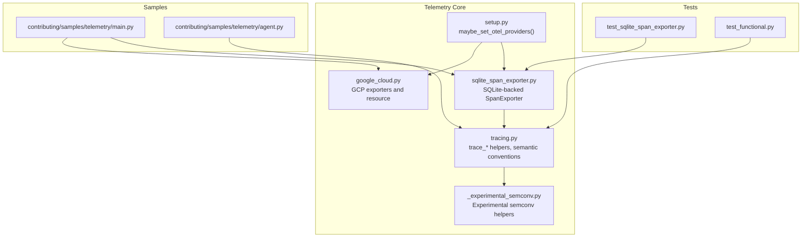
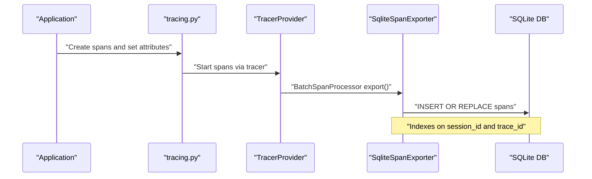
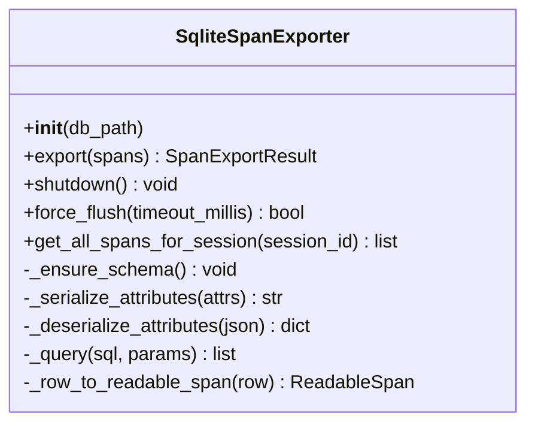
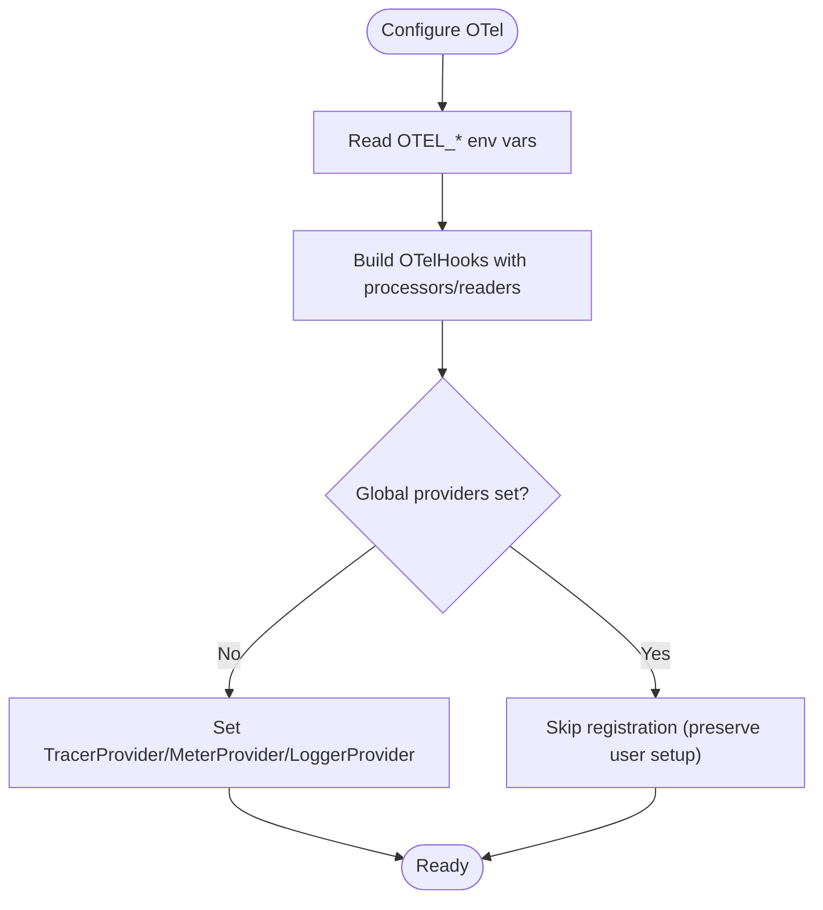
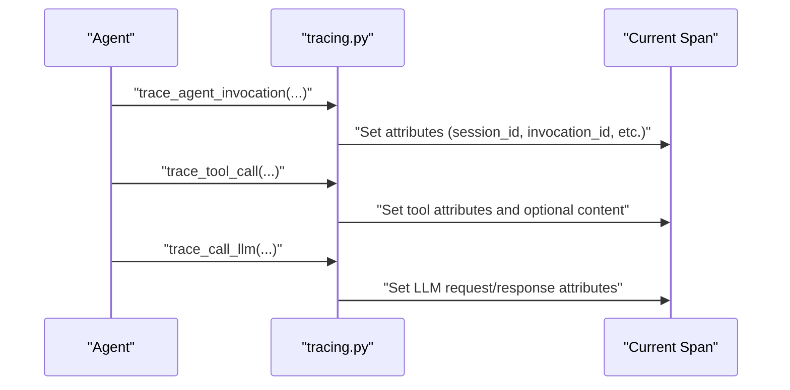
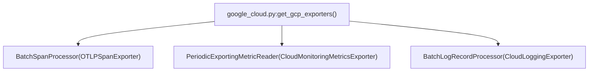
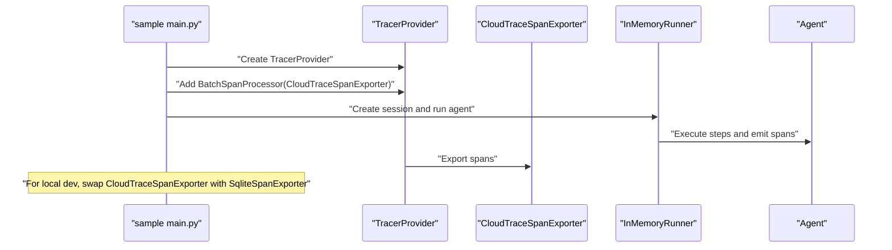
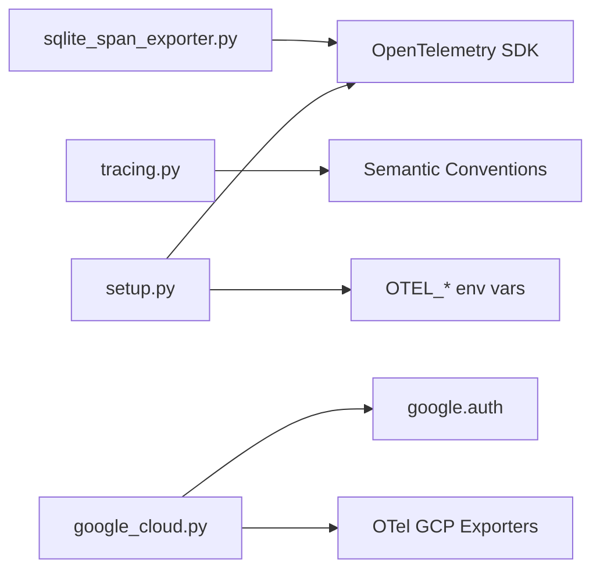

# Local Development and Debugging

<cite>
**Referenced Files in This Document**
- [sqlite_span_exporter.py](file://src/google/adk/telemetry/sqlite_span_exporter.py)
- [setup.py](file://src/google/adk/telemetry/setup.py)
- [tracing.py](file://src/google/adk/telemetry/tracing.py)
- [google_cloud.py](file://src/google/adk/telemetry/google_cloud.py)
- [_experimental_semconv.py](file://src/google/adk/telemetry/_experimental_semconv.py)
- [__init__.py](file://src/google/adk/telemetry/__init__.py)
- [test_sqlite_span_exporter.py](file://tests/unittests/telemetry/test_sqlite_span_exporter.py)
- [test_functional.py](file://tests/unittests/telemetry/test_functional.py)
- [main.py](file://contributing/samples/telemetry/main.py)
- [agent.py](file://contributing/samples/telemetry/agent.py)
- [cli_tools_click.py](file://src/google/adk/cli/cli_tools_click.py)
</cite>

## Table of Contents
1. [Introduction](#introduction)
2. [Project Structure](#project-structure)
3. [Core Components](#core-components)
4. [Architecture Overview](#architecture-overview)
5. [Detailed Component Analysis](#detailed-component-analysis)
6. [Dependency Analysis](#dependency-analysis)
7. [Performance Considerations](#performance-considerations)
8. [Troubleshooting Guide](#troubleshooting-guide)
9. [Conclusion](#conclusion)
10. [Appendices](#appendices)

## Introduction
This document explains how to develop and debug locally with telemetry in the Agent Development Kit (ADK). It focuses on the SQLite span exporter for offline tracing and debugging during local development, how to configure local telemetry collection without cloud dependencies, and how to analyze traces and correlate telemetry with application logs. It also covers practical examples for building a local observability stack, viewing trace data, and transitioning from local development to production monitoring.

## Project Structure
The telemetry subsystem relevant to local development and debugging includes:
- SQLite span exporter for persisting spans to a local database
- OpenTelemetry setup helpers for configuring providers and exporters
- Tracing utilities that attach session and invocation identifiers to spans
- Google Cloud exporters for production monitoring
- Tests validating SQLite exporter behavior and functional tracing
- Sample applications demonstrating local tracing setup

**Diagram sources**
- [sqlite_span_exporter.py](file://src/google/adk/telemetry/sqlite_span_exporter.py#L76-L235)
- [setup.py](file://src/google/adk/telemetry/setup.py#L48-L173)
- [tracing.py](file://src/google/adk/telemetry/tracing.py#L130-L797)
- [google_cloud.py](file://src/google/adk/telemetry/google_cloud.py#L44-L161)
- [_experimental_semconv.py](file://src/google/adk/telemetry/_experimental_semconv.py#L142-L519)
- [test_sqlite_span_exporter.py](file://tests/unittests/telemetry/test_sqlite_span_exporter.py#L67-L463)
- [test_functional.py](file://tests/unittests/telemetry/test_functional.py#L85-L200)
- [main.py](file://contributing/samples/telemetry/main.py#L34-L119)
- [agent.py](file://contributing/samples/telemetry/agent.py#L69-L111)

**Section sources**
- [sqlite_span_exporter.py](file://src/google/adk/telemetry/sqlite_span_exporter.py#L1-L235)
- [setup.py](file://src/google/adk/telemetry/setup.py#L1-L173)
- [tracing.py](file://src/google/adk/telemetry/tracing.py#L1-L797)
- [google_cloud.py](file://src/google/adk/telemetry/google_cloud.py#L1-L161)
- [_experimental_semconv.py](file://src/google/adk/telemetry/_experimental_semconv.py#L1-L519)
- [test_sqlite_span_exporter.py](file://tests/unittests/telemetry/test_sqlite_span_exporter.py#L1-L463)
- [test_functional.py](file://tests/unittests/telemetry/test_functional.py#L1-L220)
- [main.py](file://contributing/samples/telemetry/main.py#L1-L119)
- [agent.py](file://contributing/samples/telemetry/agent.py#L1-L111)

## Core Components
- SQLite span exporter: Stores OpenTelemetry spans in a local SQLite database with indexing for efficient session-based queries. It exports spans with session and invocation identifiers and supports retrieving full trace trees for a session.
- OpenTelemetry setup: Provides helpers to configure TracerProvider, MeterProvider, and LoggerProvider with optional exporters, including OTLP and GCP exporters.
- Tracing utilities: Attach session, invocation, and tool attributes to spans; handle LLM request/response capture; and integrate with experimental semantic conventions.
- Google Cloud exporters: Enable exporting to Cloud Trace, Cloud Monitoring, and Cloud Logging when running in production.
- Tests and samples: Demonstrate exporter behavior and local tracing setup.

**Section sources**
- [sqlite_span_exporter.py](file://src/google/adk/telemetry/sqlite_span_exporter.py#L76-L235)
- [setup.py](file://src/google/adk/telemetry/setup.py#L48-L173)
- [tracing.py](file://src/google/adk/telemetry/tracing.py#L130-L797)
- [google_cloud.py](file://src/google/adk/telemetry/google_cloud.py#L44-L161)
- [test_sqlite_span_exporter.py](file://tests/unittests/telemetry/test_sqlite_span_exporter.py#L67-L463)
- [main.py](file://contributing/samples/telemetry/main.py#L34-L119)

## Architecture Overview
The local development telemetry pipeline uses the SQLite span exporter to persist spans locally. During production, OTLP or GCP exporters can be enabled via environment variables or explicit configuration.

**Diagram sources**
- [sqlite_span_exporter.py](file://src/google/adk/telemetry/sqlite_span_exporter.py#L128-L160)
- [tracing.py](file://src/google/adk/telemetry/tracing.py#L130-L797)

## Detailed Component Analysis

### SQLite Span Exporter
The SQLite span exporter persists spans to a local database, enabling offline tracing and reloading traces across process restarts. It:
- Creates a spans table with indexes on session_id and trace_id
- Serializes span attributes to JSON
- Exports spans atomically with a lock
- Retrieves full trace trees for a session by resolving trace_ids associated with the session

Key behaviors validated by tests:
- Export success for single and batch spans
- Correct parent-child relationship reconstruction
- Fallback handling for non-serializable attributes
- Ordering by start_time
- Retrieval of full trace trees across multiple traces for a session

**Diagram sources**
- [sqlite_span_exporter.py](file://src/google/adk/telemetry/sqlite_span_exporter.py#L76-L235)

**Section sources**
- [sqlite_span_exporter.py](file://src/google/adk/telemetry/sqlite_span_exporter.py#L76-L235)
- [test_sqlite_span_exporter.py](file://tests/unittests/telemetry/test_sqlite_span_exporter.py#L67-L463)

### OpenTelemetry Setup and Providers
The setup module configures OTel providers and optionally registers exporters based on environment variables. It:
- Builds OTel hooks for span processors, metric readers, and log record processors
- Registers providers only if none are globally configured yet
- Supports generic OTLP exporters via environment variables
- Integrates with GCP exporters when enabled

**Diagram sources**
- [setup.py](file://src/google/adk/telemetry/setup.py#L48-L173)

**Section sources**
- [setup.py](file://src/google/adk/telemetry/setup.py#L48-L173)

### Tracing Utilities and Semantic Conventions
Tracing utilities attach session, invocation, and tool attributes to spans and integrate with semantic conventions:
- Sets session_id and invocation_id attributes on spans
- Records tool calls, merged tool calls, and LLM request/response metadata
- Supports experimental semantic conventions for richer operation details
- Controls content capture via environment variables

**Diagram sources**
- [tracing.py](file://src/google/adk/telemetry/tracing.py#L130-L368)
- [_experimental_semconv.py](file://src/google/adk/telemetry/_experimental_semconv.py#L425-L519)

**Section sources**
- [tracing.py](file://src/google/adk/telemetry/tracing.py#L130-L797)
- [_experimental_semconv.py](file://src/google/adk/telemetry/_experimental_semconv.py#L142-L519)

### Google Cloud Exporters
Google Cloud exporters enable production monitoring by exporting to Cloud Trace, Cloud Monitoring, and Cloud Logging. They:
- Construct authorized OTLP exporters for Cloud Trace
- Configure periodic metric readers for Cloud Monitoring
- Set up batch log record processors for Cloud Logging
- Build a resource with project and platform attributes

**Diagram sources**
- [google_cloud.py](file://src/google/adk/telemetry/google_cloud.py#L44-L161)

**Section sources**
- [google_cloud.py](file://src/google/adk/telemetry/google_cloud.py#L44-L161)

### Practical Examples: Local Telemetry Stack and Trace Viewing
- Local stack with SQLite exporter: The sample demonstrates creating a TracerProvider, adding a BatchSpanProcessor with a CloudTraceSpanExporter, and running agent interactions. For purely local development, replace the CloudTraceSpanExporter with the SQLite span exporter and run the app to persist spans to a local database.
- Viewing trace data: Use the SQLite exporter’s session-based retrieval to fetch full trace trees for a session and inspect spans in a SQLite viewer or script.
- Correlating telemetry with logs: The tracing utilities set session and invocation identifiers on spans, enabling correlation with application logs by filtering on session_id and invocation_id.

**Diagram sources**
- [main.py](file://contributing/samples/telemetry/main.py#L34-L119)
- [agent.py](file://contributing/samples/telemetry/agent.py#L69-L111)

**Section sources**
- [main.py](file://contributing/samples/telemetry/main.py#L34-L119)
- [agent.py](file://contributing/samples/telemetry/agent.py#L69-L111)

## Dependency Analysis
- SQLite span exporter depends on OpenTelemetry SDK types and uses JSON serialization for attributes.
- Tracing utilities depend on semantic conventions and environment variables to control content capture.
- Setup module composes OTel providers and conditionally registers exporters based on environment variables.
- Google Cloud exporters depend on Google Auth and OTel GCP exporters.

**Diagram sources**
- [sqlite_span_exporter.py](file://src/google/adk/telemetry/sqlite_span_exporter.py#L28-L34)
- [tracing.py](file://src/google/adk/telemetry/tracing.py#L40-L64)
- [setup.py](file://src/google/adk/telemetry/setup.py#L22-L38)
- [google_cloud.py](file://src/google/adk/telemetry/google_cloud.py#L23-L31)

**Section sources**
- [sqlite_span_exporter.py](file://src/google/adk/telemetry/sqlite_span_exporter.py#L1-L235)
- [tracing.py](file://src/google/adk/telemetry/tracing.py#L1-L797)
- [setup.py](file://src/google/adk/telemetry/setup.py#L1-L173)
- [google_cloud.py](file://src/google/adk/telemetry/google_cloud.py#L1-L161)

## Performance Considerations
- SQLite exporter uses INSERT OR REPLACE semantics and executes multiple inserts in a single transaction, minimizing overhead for batch exports.
- Indexes on session_id and trace_id optimize session-based queries and trace tree retrieval.
- Serialization of attributes to JSON is resilient to non-serializable types with fallbacks.
- The exporter exposes a force_flush method that returns immediately, suitable for local development where strict flushing is not required.

[No sources needed since this section provides general guidance]

## Troubleshooting Guide
Common issues and resolutions:
- Spans not appearing in local database: Ensure the SQLite span exporter is registered with a BatchSpanProcessor and that the db_path is writable. Confirm that spans include session_id or gen_ai.conversation.id attributes for session-based retrieval.
- Non-serializable attributes causing failures: The exporter falls back to a placeholder string for non-serializable values; verify that expected attributes are present in the stored JSON.
- Retrieving full trace trees: Use the session-based retrieval method to fetch all spans for a session; it resolves trace_ids associated with the session and returns ordered spans by start_time.
- Conflicts with existing providers: The setup helper checks for globally set providers and skips registration to avoid overriding user configuration.

**Section sources**
- [sqlite_span_exporter.py](file://src/google/adk/telemetry/sqlite_span_exporter.py#L107-L127)
- [sqlite_span_exporter.py](file://src/google/adk/telemetry/sqlite_span_exporter.py#L213-L235)
- [setup.py](file://src/google/adk/telemetry/setup.py#L90-L123)
- [test_sqlite_span_exporter.py](file://tests/unittests/telemetry/test_sqlite_span_exporter.py#L410-L429)

## Conclusion
The SQLite span exporter enables robust local development and debugging by persisting agent execution traces to a local database. Combined with tracing utilities that attach session and invocation identifiers, it supports offline trace analysis, performance profiling, and troubleshooting multi-agent interactions. For production, switch to OTLP or GCP exporters via environment variables or explicit configuration. The provided tests and samples demonstrate correct usage and expected behaviors.

[No sources needed since this section summarizes without analyzing specific files]

## Appendices

### Best Practices for Local Telemetry Collection
- Use session_id and invocation_id attributes consistently across spans for easy correlation.
- Prefer the SQLite exporter for local development to avoid cloud dependencies.
- Keep prompt/response content capture disabled in sensitive environments by setting the appropriate environment variable.
- Use session-based retrieval to analyze full trace trees for reproducible debugging.

**Section sources**
- [tracing.py](file://src/google/adk/telemetry/tracing.py#L442-L447)
- [sqlite_span_exporter.py](file://src/google/adk/telemetry/sqlite_span_exporter.py#L213-L235)

### Transitioning from Local to Production Monitoring
- Enable GCP exporters by setting environment variables or calling the GCP exporter builder.
- Use the setup helper to register providers and exporters; it respects existing global providers.
- For OTLP-based pipelines, configure OTEL_EXPORTER_OTLP_* environment variables to route telemetry to your collector.

**Section sources**
- [google_cloud.py](file://src/google/adk/telemetry/google_cloud.py#L44-L161)
- [setup.py](file://src/google/adk/telemetry/setup.py#L131-L173)

### Using the ADK Web UI for Local Debugging
- The ADK web server serves as a primary debugging interface and integrates with local telemetry for trace inspection.
- Use the web UI to run agents, inspect sessions, and correlate trace data with application logs.

**Section sources**
- [cli_tools_click.py](file://src/google/adk/cli/cli_tools_click.py#L1322-L1354)