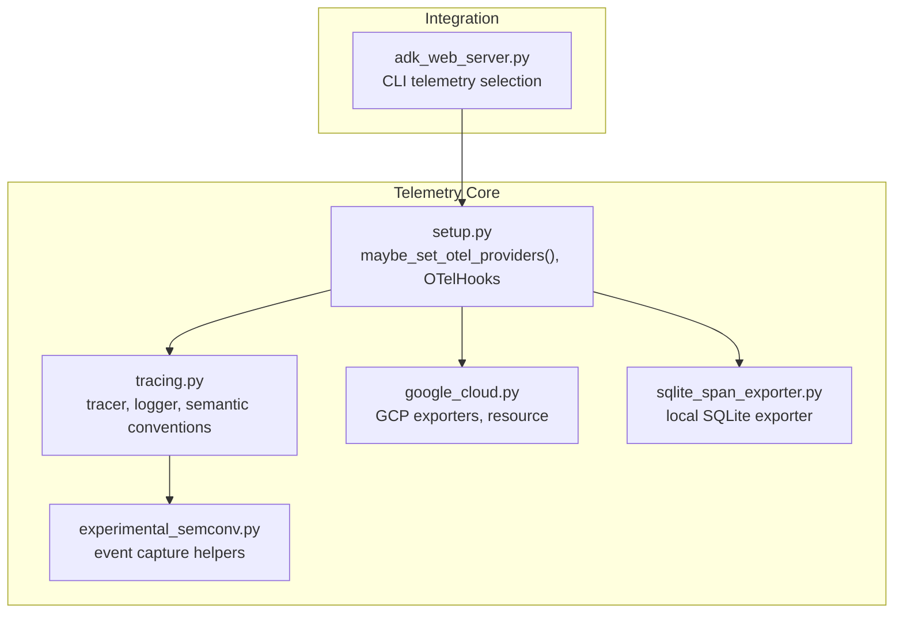
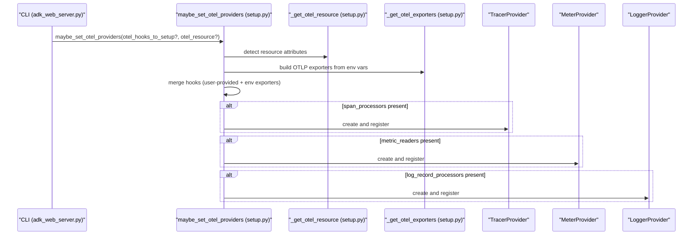
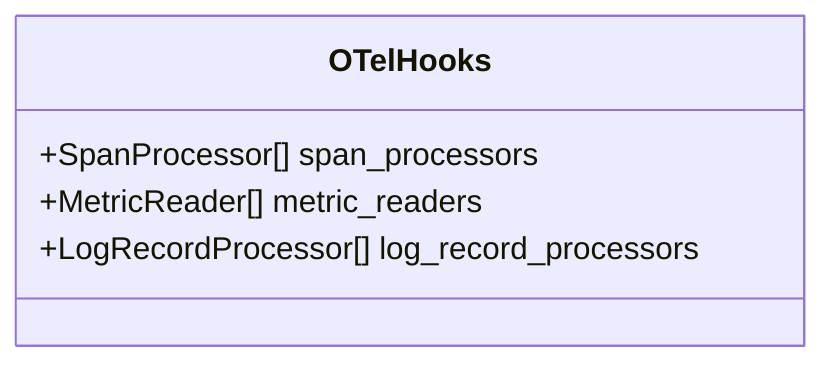
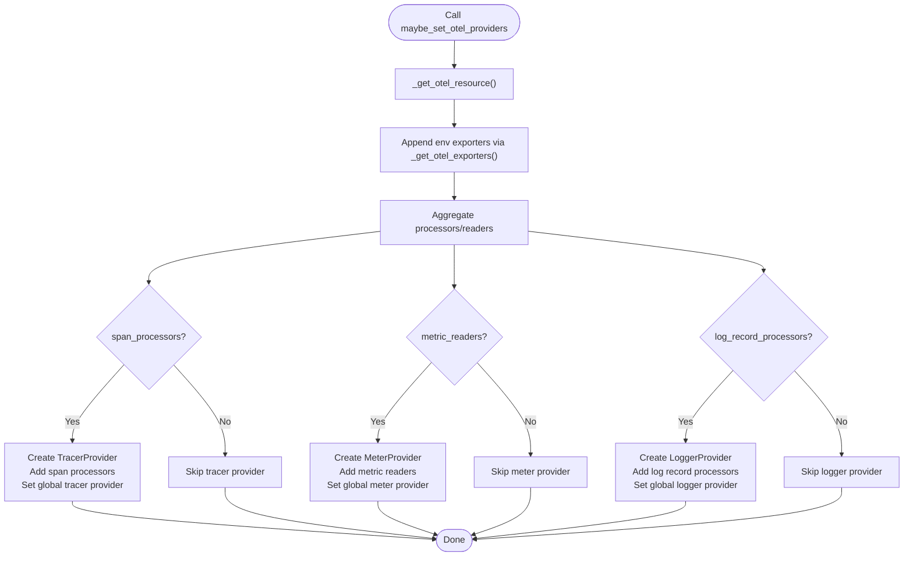
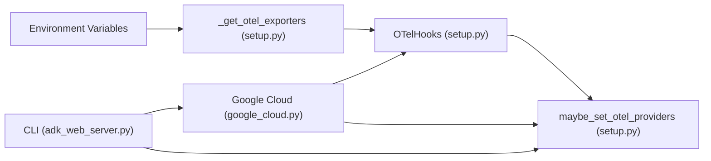

# Telemetry Setup and Configuration

<cite>
**Referenced Files in This Document**
- [setup.py](file://src/google/adk/telemetry/setup.py)
- [tracing.py](file://src/google/adk/telemetry/tracing.py)
- [_experimental_semconv.py](file://src/google/adk/telemetry/_experimental_semconv.py)
- [google_cloud.py](file://src/google/adk/telemetry/google_cloud.py)
- [sqlite_span_exporter.py](file://src/google/adk/telemetry/sqlite_span_exporter.py)
- [adk_web_server.py](file://src/google/adk/cli/adk_web_server.py)
- [test_setup.py](file://tests/unittests/telemetry/test_setup.py)
- [test_functional.py](file://tests/unittests/telemetry/test_functional.py)
- [test_google_cloud.py](file://tests/unittests/telemetry/test_google_cloud.py)
</cite>

## Table of Contents
1. [Introduction](#introduction)
2. [Project Structure](#project-structure)
3. [Core Components](#core-components)
4. [Architecture Overview](#architecture-overview)
5. [Detailed Component Analysis](#detailed-component-analysis)
6. [Dependency Analysis](#dependency-analysis)
7. [Performance Considerations](#performance-considerations)
8. [Troubleshooting Guide](#troubleshooting-guide)
9. [Conclusion](#conclusion)
10. [Appendices](#appendices)

## Introduction
This document explains how to set up and configure telemetry in the Agent Development Kit (ADK) using OpenTelemetry. It focuses on:
- The OTelHooks class and how to compose OpenTelemetry providers
- The maybe_set_otel_providers function and how it initializes tracer, meter, and logger providers without overriding existing ones
- Environment variable configuration for OTLP exporters
- Resource detection and configuration via OTEL_RESOURCE_ATTRIBUTES
- Practical examples for local development, cloud deployments, and production monitoring
- Common configuration issues and troubleshooting steps

## Project Structure
The telemetry subsystem resides under src/google/adk/telemetry and integrates with the CLI to initialize providers at startup. Key files:
- setup.py: Provider setup, OTelHooks, and environment-driven exporter configuration
- tracing.py: Tracer and logger utilities, semantic conventions, and instrumentation helpers
- _experimental_semconv.py: Experimental semantic conventions for richer event capture
- google_cloud.py: GCP-specific exporters and resource configuration
- sqlite_span_exporter.py: Local SQLite-backed span exporter for development
- adk_web_server.py: CLI integration that selects telemetry configuration modes
- Tests: Functional and unit tests validating behavior and environment-driven setup

**Diagram sources**
- [setup.py](file://src/google/adk/telemetry/setup.py#L41-L173)
- [tracing.py](file://src/google/adk/telemetry/tracing.py#L95-L105)
- [_experimental_semconv.py](file://src/google/adk/telemetry/_experimental_semconv.py#L142-L519)
- [google_cloud.py](file://src/google/adk/telemetry/google_cloud.py#L44-L161)
- [sqlite_span_exporter.py](file://src/google/adk/telemetry/sqlite_span_exporter.py#L76-L235)
- [adk_web_server.py](file://src/google/adk/cli/adk_web_server.py#L350-L433)

**Section sources**
- [setup.py](file://src/google/adk/telemetry/setup.py#L41-L173)
- [tracing.py](file://src/google/adk/telemetry/tracing.py#L95-L105)
- [google_cloud.py](file://src/google/adk/telemetry/google_cloud.py#L44-L161)
- [sqlite_span_exporter.py](file://src/google/adk/telemetry/sqlite_span_exporter.py#L76-L235)
- [adk_web_server.py](file://src/google/adk/cli/adk_web_server.py#L350-L433)

## Core Components
- OTelHooks: A dataclass to collect per-telemetry-type components (span processors, metric readers, log record processors) for composition into providers.
- maybe_set_otel_providers: The central function that:
  - Detects resource attributes from environment
  - Adds OTLP exporters based on environment variables
  - Builds and registers TracerProvider, MeterProvider, and LoggerProvider only when matching exporters are present
  - Does not override existing global providers
- Environment-driven exporters:
  - OTLP exporters are conditionally added when any of the following environment variables are set:
    - OTEL_EXPORTER_OTLP_ENDPOINT
    - OTEL_EXPORTER_OTLP_TRACES_ENDPOINT
    - OTEL_EXPORTER_OTLP_METRICS_ENDPOINT
    - OTEL_EXPORTER_OTLP_LOGS_ENDPOINT
- Resource detection:
  - Uses OTELResourceDetector to populate resource labels from environment variables such as OTEL_SERVICE_NAME and OTEL_RESOURCE_ATTRIBUTES
- GCP exporters:
  - get_gcp_exporters enables Cloud Trace, Cloud Monitoring, and Cloud Logging when credentials and project are available
  - get_gcp_resource merges project_id, environment resource attributes, and platform detectors
- Local development exporter:
  - SqliteSpanExporter persists spans to a local SQLite database for inspection across process restarts

**Section sources**
- [setup.py](file://src/google/adk/telemetry/setup.py#L41-L173)
- [google_cloud.py](file://src/google/adk/telemetry/google_cloud.py#L44-L161)
- [sqlite_span_exporter.py](file://src/google/adk/telemetry/sqlite_span_exporter.py#L76-L235)

## Architecture Overview
The CLI chooses a telemetry mode at startup and delegates to setup.py to initialize providers. The diagram below shows the flow for environment-variable-based configuration.

**Diagram sources**
- [adk_web_server.py](file://src/google/adk/cli/adk_web_server.py#L418-L433)
- [setup.py](file://src/google/adk/telemetry/setup.py#L48-L123)

## Detailed Component Analysis

### OTelHooks Class
OTelHooks aggregates the components needed to configure OpenTelemetry providers:
- span_processors: List of SpanProcessor instances (e.g., batch span processor wrapping OTLP exporter)
- metric_readers: List of MetricReader instances (e.g., periodic metric reader wrapping OTLP metric exporter)
- log_record_processors: List of LogRecordProcessor instances (e.g., batch log record processor wrapping OTLP log exporter)

Usage pattern:
- Build OTelHooks with desired processors/readers
- Pass to maybe_set_otel_providers to register them into providers
- Combine with environment-driven exporters via _get_otel_exporters

**Diagram sources**
- [setup.py](file://src/google/adk/telemetry/setup.py#L41-L46)

**Section sources**
- [setup.py](file://src/google/adk/telemetry/setup.py#L41-L46)

### maybe_set_otel_providers Function
Key behaviors:
- Accepts optional hooks and resource
- Detects resource attributes if none provided
- Appends environment-driven OTLP exporters via _get_otel_exporters
- Aggregates all span processors, metric readers, and log record processors
- Registers providers only if corresponding exporters are present
- Does not override existing global providers

**Diagram sources**
- [setup.py](file://src/google/adk/telemetry/setup.py#L48-L123)

**Section sources**
- [setup.py](file://src/google/adk/telemetry/setup.py#L48-L123)

### Environment Variable Configuration for OTLP Exporters
Supported variables:
- OTEL_EXPORTER_OTLP_ENDPOINT: Applies to traces, metrics, and logs when used alone
- OTEL_EXPORTER_OTLP_TRACES_ENDPOINT: Enables OTLP span exporter
- OTEL_EXPORTER_OTLP_METRICS_ENDPOINT: Enables OTLP metric exporter
- OTEL_EXPORTER_OTLP_LOGS_ENDPOINT: Enables OTLP log exporter

Behavior:
- Exporters are added only when the corresponding environment variable is set
- _get_otel_exporters checks each variable and returns OTelHooks with the appropriate components

Practical examples:
- Local development with a collector endpoint:
  - Set OTEL_EXPORTER_OTLP_ENDPOINT to your collector address
- Separate endpoints for each telemetry type:
  - Set OTEL_EXPORTER_OTLP_TRACES_ENDPOINT, OTEL_EXPORTER_OTLP_METRICS_ENDPOINT, and/or OTEL_EXPORTER_OTLP_LOGS_ENDPOINT individually

Validation:
- Tests confirm that enabling each endpoint variable results in the corresponding provider being initialized.

**Section sources**
- [setup.py](file://src/google/adk/telemetry/setup.py#L131-L173)
- [test_setup.py](file://tests/unittests/telemetry/test_setup.py#L29-L108)

### Resource Detection and Configuration
- Resource detection:
  - _get_otel_resource uses OTELResourceDetector to populate attributes from environment variables
  - Supports OTEL_SERVICE_NAME and OTEL_RESOURCE_ATTRIBUTES
- GCP resource:
  - get_gcp_resource merges project_id, environment resource attributes, and platform detectors (e.g., GCE/GKE/CloudRun)
  - If project_id is not available, warnings are logged and GCP exporters are not set up

Examples:
- Set OTEL_RESOURCE_ATTRIBUTES to include service metadata (e.g., service.name, service.version)
- For GCP deployments, ensure GOOGLE_APPLICATION_CREDENTIALS and project context are available

**Section sources**
- [setup.py](file://src/google/adk/telemetry/setup.py#L125-L128)
- [google_cloud.py](file://src/google/adk/telemetry/google_cloud.py#L133-L161)
- [test_google_cloud.py](file://tests/unittests/telemetry/test_google_cloud.py#L63-L92)

### GCP Exporters and Resource Configuration
- get_gcp_exporters:
  - Creates exporters for Cloud Trace, Cloud Monitoring, and Cloud Logging when enabled
  - Uses google.auth.default() to obtain credentials and project
  - Returns OTelHooks with the selected components
- get_gcp_resource:
  - Builds a Resource with gcp.project_id, environment attributes, and platform detectors
  - Allows OTEL_RESOURCE_ATTRIBUTES to override detected attributes

Integration:
- CLI selects GCP mode and calls _setup_gcp_telemetry, which builds OTelHooks and calls maybe_set_otel_providers with a GCP Resource

**Section sources**
- [google_cloud.py](file://src/google/adk/telemetry/google_cloud.py#L44-L161)
- [adk_web_server.py](file://src/google/adk/cli/adk_web_server.py#L376-L416)
- [test_google_cloud.py](file://tests/unittests/telemetry/test_google_cloud.py#L24-L61)

### Local Development Exporter (SQLite)
- SqliteSpanExporter writes spans to a local SQLite database for development and debugging
- Useful for inspecting traces across process restarts
- Provides helper methods to query spans by session or trace

Use cases:
- Running adk web locally with telemetry persisted to disk
- Debugging multi-session workflows without an external backend

**Section sources**
- [sqlite_span_exporter.py](file://src/google/adk/telemetry/sqlite_span_exporter.py#L76-L235)

### Tracing Utilities and Semantic Conventions
- Tracer and logger:
  - tracer is created with module name and version, using a specific schema URL
  - otel_logger emits structured events aligned with semantic conventions
- Experimental semantic conventions:
  - Helpers to capture detailed operation messages and tool definitions
  - Conditional emission based on environment flags
- Instrumentation:
  - Integration with opentelemetry-instrumentation-google-genai when available

**Section sources**
- [tracing.py](file://src/google/adk/telemetry/tracing.py#L95-L105)
- [_experimental_semconv.py](file://src/google/adk/telemetry/_experimental_semconv.py#L142-L519)
- [test_functional.py](file://tests/unittests/telemetry/test_functional.py#L175-L220)

## Dependency Analysis
The telemetry subsystem composes components from environment variables and optional GCP configuration into providers. The CLI orchestrates which mode to use.

**Diagram sources**
- [setup.py](file://src/google/adk/telemetry/setup.py#L131-L173)
- [google_cloud.py](file://src/google/adk/telemetry/google_cloud.py#L44-L161)
- [adk_web_server.py](file://src/google/adk/cli/adk_web_server.py#L350-L433)

**Section sources**
- [setup.py](file://src/google/adk/telemetry/setup.py#L48-L123)
- [google_cloud.py](file://src/google/adk/telemetry/google_cloud.py#L44-L161)
- [adk_web_server.py](file://src/google/adk/cli/adk_web_server.py#L350-L433)

## Performance Considerations
- Export batching:
  - BatchSpanProcessor, BatchLogRecordProcessor, and PeriodicExportingMetricReader are used to reduce network overhead
- Local development:
  - SQLite exporter avoids network traffic during development but introduces disk I/O; consider disabling or rotating the database in long-running sessions
- Resource detection:
  - Resource detection runs once at initialization; keep OTEL_RESOURCE_ATTRIBUTES minimal to avoid heavy computation
- Instrumentation:
  - Enabling experimental semantic conventions and detailed content capture increases payload sizes; adjust capture modes via environment flags

[No sources needed since this section provides general guidance]

## Troubleshooting Guide
Common issues and resolutions:
- Providers not being set:
  - Ensure at least one of the OTLP endpoint environment variables is set for the corresponding telemetry type
  - Verify that maybe_set_otel_providers is called after defining any custom hooks
- Existing providers overridden unexpectedly:
  - maybe_set_otel_providers does not override existing global providers; if providers are already set elsewhere, they remain unchanged
- GCP exporters not configured:
  - Confirm GOOGLE_APPLICATION_CREDENTIALS and project context are available
  - get_gcp_resource warns and skips setup if project_id cannot be determined
- Content capture and privacy:
  - Control prompt/response content capture via environment flags
  - Disable request/response content in spans using the ADK_CAPTURE_MESSAGE_CONTENT_IN_SPANS environment variable
- Instrumentation not emitting data:
  - Install and import the Google GenAI instrumentation package to enable SDK-side instrumentation
  - The CLI attempts to instrument automatically when available

Validation references:
- Tests demonstrate that enabling each endpoint variable results in the corresponding provider being initialized
- Functional tests verify instrumentation behavior and span attribute preservation

**Section sources**
- [test_setup.py](file://tests/unittests/telemetry/test_setup.py#L29-L108)
- [test_functional.py](file://tests/unittests/telemetry/test_functional.py#L175-L220)
- [google_cloud.py](file://src/google/adk/telemetry/google_cloud.py#L133-L161)

## Conclusion
ADK’s telemetry stack provides a flexible, environment-driven approach to configure OpenTelemetry across tracing, metrics, and logging. The OTelHooks class and maybe_set_otel_providers function enable composability and safe initialization without overriding existing configurations. With environment variables and GCP exporters, teams can quickly adapt telemetry for local development, cloud deployments, and production monitoring.

[No sources needed since this section summarizes without analyzing specific files]

## Appendices

### Practical Configuration Examples

- Local development with OTLP collector:
  - Set OTEL_EXPORTER_OTLP_ENDPOINT to your collector address
  - Optionally set OTEL_RESOURCE_ATTRIBUTES for service metadata
  - Start the CLI; telemetry is initialized automatically if environment variables are present

- Separate endpoints per telemetry type:
  - Set OTEL_EXPORTER_OTLP_TRACES_ENDPOINT for traces
  - Set OTEL_EXPORTER_OTLP_METRICS_ENDPOINT for metrics
  - Set OTEL_EXPORTER_OTLP_LOGS_ENDPOINT for logs

- GCP production monitoring:
  - Ensure GOOGLE_APPLICATION_CREDENTIALS points to a valid service account
  - Enable GCP telemetry mode in the CLI
  - Providers are configured for Cloud Trace, Cloud Monitoring, and Cloud Logging

- Local SQLite exporter:
  - Use SqliteSpanExporter for persistent local storage during development
  - Query spans by session or trace for debugging multi-run workflows

**Section sources**
- [setup.py](file://src/google/adk/telemetry/setup.py#L131-L173)
- [google_cloud.py](file://src/google/adk/telemetry/google_cloud.py#L44-L161)
- [sqlite_span_exporter.py](file://src/google/adk/telemetry/sqlite_span_exporter.py#L76-L235)
- [adk_web_server.py](file://src/google/adk/cli/adk_web_server.py#L350-L433)