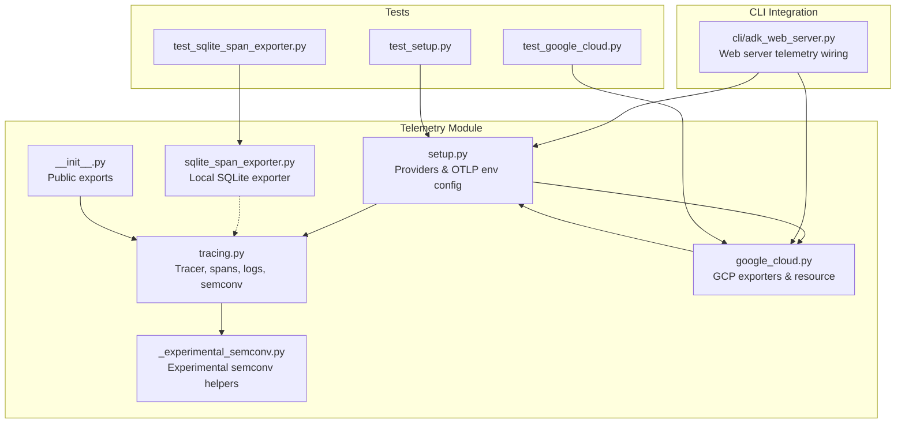
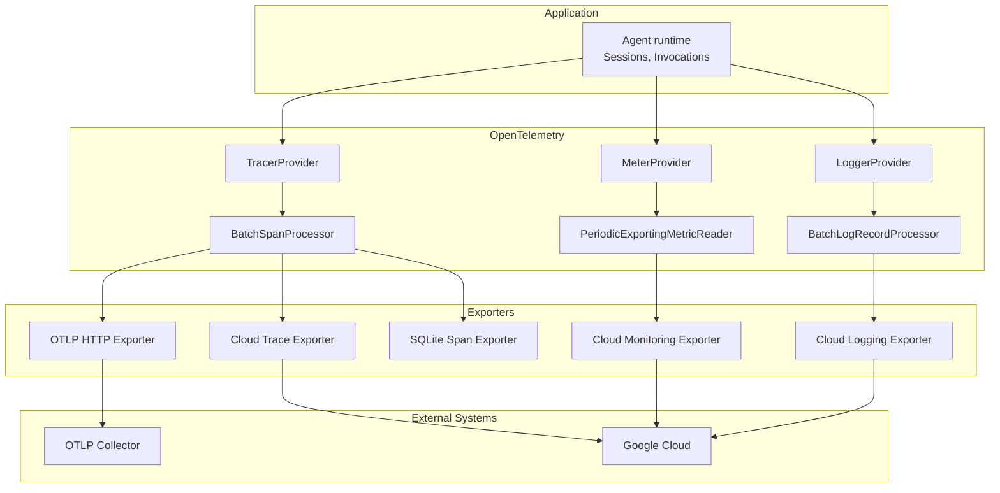
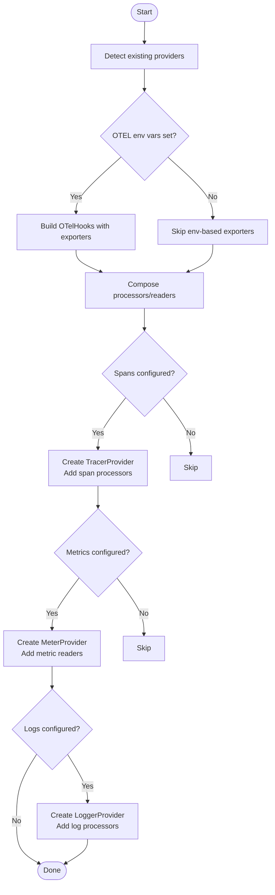
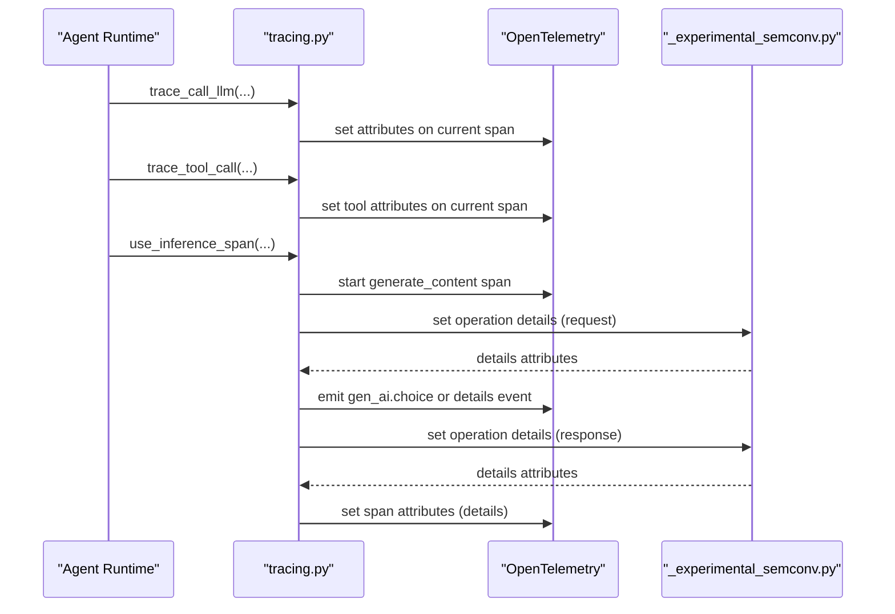
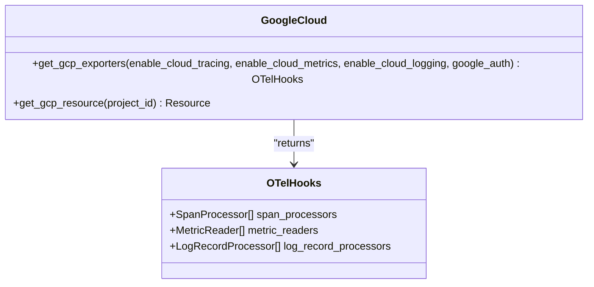
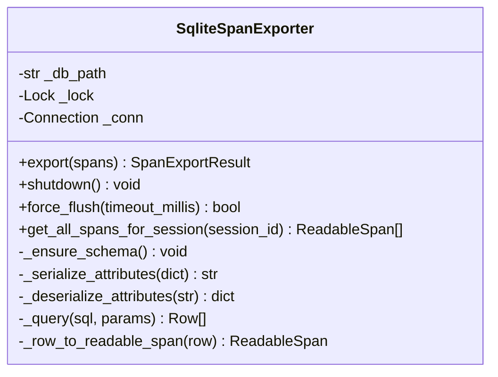
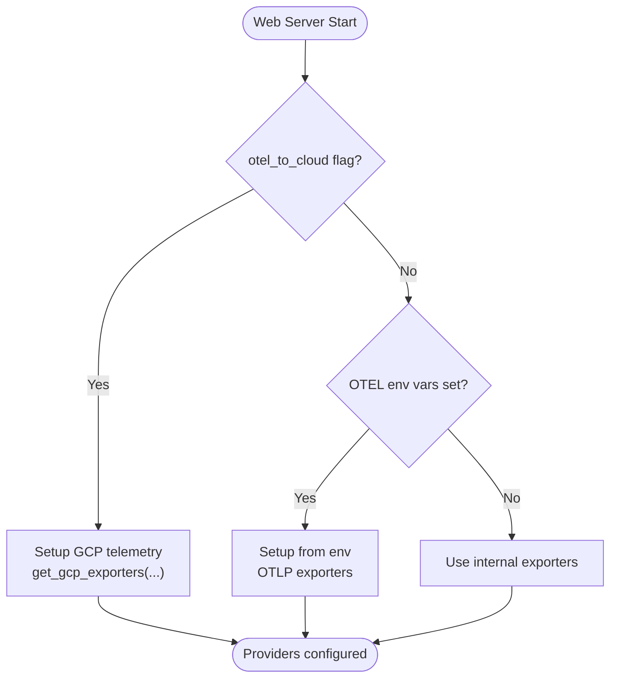
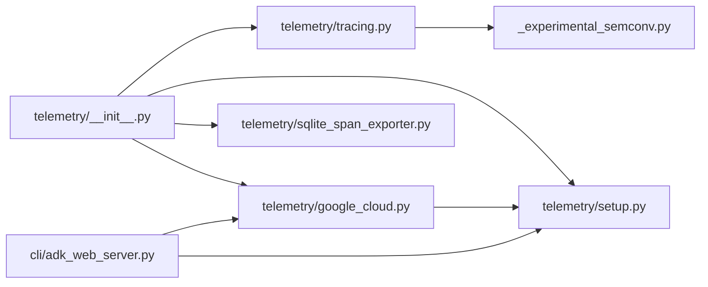

# Telemetry and Observability

<cite>
**Referenced Files in This Document**
- [telemetry/__init__.py](file://src/google/adk/telemetry/__init__.py)
- [telemetry/setup.py](file://src/google/adk/telemetry/setup.py)
- [telemetry/tracing.py](file://src/google/adk/telemetry/tracing.py)
- [telemetry/google_cloud.py](file://src/google/adk/telemetry/google_cloud.py)
- [telemetry/sqlite_span_exporter.py](file://src/google/adk/telemetry/sqlite_span_exporter.py)
- [telemetry/_experimental_semconv.py](file://src/google/adk/telemetry/_experimental_semconv.py)
- [cli/adk_web_server.py](file://src/google/adk/cli/adk_web_server.py)
- [tests/unittests/telemetry/test_setup.py](file://tests/unittests/telemetry/test_setup.py)
- [tests/unittests/telemetry/test_google_cloud.py](file://tests/unittests/telemetry/test_google_cloud.py)
- [tests/unittests/telemetry/test_sqlite_span_exporter.py](file://tests/unittests/telemetry/test_sqlite_span_exporter.py)
- [contributing/samples/telemetry/main.py](file://contributing/samples/telemetry/main.py)
</cite>

## Table of Contents
1. [Introduction](#introduction)
2. [Project Structure](#project-structure)
3. [Core Components](#core-components)
4. [Architecture Overview](#architecture-overview)
5. [Detailed Component Analysis](#detailed-component-analysis)
6. [Dependency Analysis](#dependency-analysis)
7. [Performance Considerations](#performance-considerations)
8. [Troubleshooting Guide](#troubleshooting-guide)
9. [Conclusion](#conclusion)
10. [Appendices](#appendices)

## Introduction
This document explains the telemetry and observability architecture in the Agent Development Kit (ADK). It covers OpenTelemetry integration for distributed tracing and metrics, Google Cloud integration for cloud-native observability, and a SQLite span exporter for local development. It also details tracing configuration, span correlation, performance monitoring, practical deployment examples, best practices, alerting strategies, and troubleshooting approaches.

## Project Structure
The telemetry module is organized around:
- Provider setup and environment-driven configuration
- Distributed tracing helpers and semantic conventions
- Google Cloud exporters and resource detection
- Local SQLite span exporter for development
- Tests validating setup, GCP exporters, and SQLite exporter behavior

**Diagram sources**
- [telemetry/setup.py](file://src/google/adk/telemetry/setup.py#L48-L123)
- [telemetry/tracing.py](file://src/google/adk/telemetry/tracing.py#L95-L105)
- [telemetry/google_cloud.py](file://src/google/adk/telemetry/google_cloud.py#L44-L94)
- [telemetry/sqlite_span_exporter.py](file://src/google/adk/telemetry/sqlite_span_exporter.py#L76-L170)
- [telemetry/_experimental_semconv.py](file://src/google/adk/telemetry/_experimental_semconv.py#L142-L147)
- [telemetry/__init__.py](file://src/google/adk/telemetry/__init__.py#L15-L27)
- [cli/adk_web_server.py](file://src/google/adk/cli/adk_web_server.py#L350-L392)
- [tests/unittests/telemetry/test_setup.py](file://tests/unittests/telemetry/test_setup.py#L29-L107)
- [tests/unittests/telemetry/test_google_cloud.py](file://tests/unittests/telemetry/test_google_cloud.py#L24-L60)
- [tests/unittests/telemetry/test_sqlite_span_exporter.py](file://tests/unittests/telemetry/test_sqlite_span_exporter.py#L67-L122)

**Section sources**
- [telemetry/__init__.py](file://src/google/adk/telemetry/__init__.py#L15-L27)
- [telemetry/setup.py](file://src/google/adk/telemetry/setup.py#L48-L123)
- [telemetry/tracing.py](file://src/google/adk/telemetry/tracing.py#L95-L105)
- [telemetry/google_cloud.py](file://src/google/adk/telemetry/google_cloud.py#L44-L94)
- [telemetry/sqlite_span_exporter.py](file://src/google/adk/telemetry/sqlite_span_exporter.py#L76-L170)
- [telemetry/_experimental_semconv.py](file://src/google/adk/telemetry/_experimental_semconv.py#L142-L147)
- [cli/adk_web_server.py](file://src/google/adk/cli/adk_web_server.py#L350-L392)
- [tests/unittests/telemetry/test_setup.py](file://tests/unittests/telemetry/test_setup.py#L29-L107)
- [tests/unittests/telemetry/test_google_cloud.py](file://tests/unittests/telemetry/test_google_cloud.py#L24-L60)
- [tests/unittests/telemetry/test_sqlite_span_exporter.py](file://tests/unittests/telemetry/test_sqlite_span_exporter.py#L67-L122)

## Core Components
- OpenTelemetry provider setup and environment-driven exporters
- Tracing helpers for agent invocations, tool calls, LLM calls, and data sends
- Experimental and stable semantic conventions for GenAI spans and logs
- Google Cloud exporters for traces, metrics, and logs
- SQLite span exporter for local development and testing
- CLI integration for automatic telemetry setup in web server

Key public exports:
- Tracing decorators and helpers: trace_call_llm, trace_tool_call, trace_send_data, trace_merged_tool_calls, tracer
- GCP exporter factory: get_gcp_exporters
- SQLite exporter: SqliteSpanExporter

**Section sources**
- [telemetry/__init__.py](file://src/google/adk/telemetry/__init__.py#L15-L27)
- [telemetry/tracing.py](file://src/google/adk/telemetry/tracing.py#L163-L282)
- [telemetry/google_cloud.py](file://src/google/adk/telemetry/google_cloud.py#L44-L94)
- [telemetry/sqlite_span_exporter.py](file://src/google/adk/telemetry/sqlite_span_exporter.py#L76-L170)

## Architecture Overview
ADK’s telemetry architecture integrates OpenTelemetry with optional Google Cloud exporters and a local SQLite exporter. Providers are configured via environment variables or programmatically. Tracing spans capture agent, tool, and LLM interactions with standardized attributes. Logs are emitted for GenAI messages and operation details. Metrics are exported via Cloud Monitoring when enabled.

**Diagram sources**
- [telemetry/setup.py](file://src/google/adk/telemetry/setup.py#L90-L123)
- [telemetry/google_cloud.py](file://src/google/adk/telemetry/google_cloud.py#L97-L130)
- [telemetry/sqlite_span_exporter.py](file://src/google/adk/telemetry/sqlite_span_exporter.py#L76-L170)

## Detailed Component Analysis

### OpenTelemetry Provider Setup and Environment Configuration
- maybe_set_otel_providers detects existing providers and registers OTLP exporters based on environment variables for traces, metrics, and logs.
- It composes SpanProcessor, MetricReader, and LogRecordProcessor lists from OTelHooks and sets providers if not already configured.
- Resource detection uses OTELResourceDetector and supports GCP resource attributes.

**Diagram sources**
- [telemetry/setup.py](file://src/google/adk/telemetry/setup.py#L48-L123)

**Section sources**
- [telemetry/setup.py](file://src/google/adk/telemetry/setup.py#L48-L123)
- [tests/unittests/telemetry/test_setup.py](file://tests/unittests/telemetry/test_setup.py#L29-L107)

### Distributed Tracing Helpers and Semantic Conventions
- Tracer and logger are created with the ADK schema URL and version.
- trace_call_llm, trace_tool_call, trace_send_data record structured attributes on the current span.
- use_inference_span and trace_inference_result manage GenAI inference spans with stable and experimental semantic conventions.
- Experimental semantic conventions emit operation details events and set span attributes based on content capture mode.

**Diagram sources**
- [telemetry/tracing.py](file://src/google/adk/telemetry/tracing.py#L284-L368)
- [telemetry/tracing.py](file://src/google/adk/telemetry/tracing.py#L483-L527)
- [telemetry/tracing.py](file://src/google/adk/telemetry/tracing.py#L736-L789)
- [telemetry/_experimental_semconv.py](file://src/google/adk/telemetry/_experimental_semconv.py#L432-L478)

**Section sources**
- [telemetry/tracing.py](file://src/google/adk/telemetry/tracing.py#L95-L105)
- [telemetry/tracing.py](file://src/google/adk/telemetry/tracing.py#L284-L368)
- [telemetry/tracing.py](file://src/google/adk/telemetry/tracing.py#L483-L527)
- [telemetry/tracing.py](file://src/google/adk/telemetry/tracing.py#L736-L789)
- [telemetry/_experimental_semconv.py](file://src/google/adk/telemetry/_experimental_semconv.py#L142-L147)
- [telemetry/_experimental_semconv.py](file://src/google/adk/telemetry/_experimental_semconv.py#L480-L519)

### Google Cloud Integration
- get_gcp_exporters returns OTelHooks with Cloud Trace, Cloud Monitoring, and Cloud Logging exporters when enabled.
- get_gcp_resource merges OTELResourceDetector with GCP resource detector and project ID.
- CLI integration wires GCP telemetry when enabled.

**Diagram sources**
- [telemetry/google_cloud.py](file://src/google/adk/telemetry/google_cloud.py#L44-L94)
- [telemetry/google_cloud.py](file://src/google/adk/telemetry/google_cloud.py#L133-L160)

**Section sources**
- [telemetry/google_cloud.py](file://src/google/adk/telemetry/google_cloud.py#L44-L94)
- [telemetry/google_cloud.py](file://src/google/adk/telemetry/google_cloud.py#L133-L160)
- [tests/unittests/telemetry/test_google_cloud.py](file://tests/unittests/telemetry/test_google_cloud.py#L24-L60)

### SQLite Span Exporter for Local Development
- SqliteSpanExporter writes spans to a local SQLite database with indexing for session and trace queries.
- Supports exporting spans, querying spans by session, and reconstructing ReadableSpan objects.
- Designed for local development and testing scenarios.

**Diagram sources**
- [telemetry/sqlite_span_exporter.py](file://src/google/adk/telemetry/sqlite_span_exporter.py#L76-L170)
- [telemetry/sqlite_span_exporter.py](file://src/google/adk/telemetry/sqlite_span_exporter.py#L171-L235)

**Section sources**
- [telemetry/sqlite_span_exporter.py](file://src/google/adk/telemetry/sqlite_span_exporter.py#L76-L170)
- [telemetry/sqlite_span_exporter.py](file://src/google/adk/telemetry/sqlite_span_exporter.py#L171-L235)
- [tests/unittests/telemetry/test_sqlite_span_exporter.py](file://tests/unittests/telemetry/test_sqlite_span_exporter.py#L67-L122)

### CLI Integration for Telemetry
- The web server selects between GCP telemetry, environment-based OTLP exporters, or internal exporters based on flags and environment checks.

**Diagram sources**
- [cli/adk_web_server.py](file://src/google/adk/cli/adk_web_server.py#L350-L392)
- [telemetry/setup.py](file://src/google/adk/telemetry/setup.py#L131-L154)

**Section sources**
- [cli/adk_web_server.py](file://src/google/adk/cli/adk_web_server.py#L350-L392)
- [telemetry/setup.py](file://src/google/adk/telemetry/setup.py#L131-L154)

## Dependency Analysis
- Public exports in telemetry/__init__.py expose tracing helpers and tracer.
- tracing.py depends on OpenTelemetry trace and logs APIs, semantic conventions, and experimental helpers.
- google_cloud.py depends on google.auth and GCP exporters; composes OTelHooks.
- sqlite_span_exporter.py depends on opentelemetry-sdk trace export and sqlite3.
- CLI integration depends on setup and google_cloud modules.

**Diagram sources**
- [telemetry/__init__.py](file://src/google/adk/telemetry/__init__.py#L15-L27)
- [telemetry/tracing.py](file://src/google/adk/telemetry/tracing.py#L95-L105)
- [telemetry/_experimental_semconv.py](file://src/google/adk/telemetry/_experimental_semconv.py#L142-L147)
- [telemetry/google_cloud.py](file://src/google/adk/telemetry/google_cloud.py#L44-L94)
- [telemetry/setup.py](file://src/google/adk/telemetry/setup.py#L48-L123)
- [cli/adk_web_server.py](file://src/google/adk/cli/adk_web_server.py#L350-L392)

**Section sources**
- [telemetry/__init__.py](file://src/google/adk/telemetry/__init__.py#L15-L27)
- [telemetry/tracing.py](file://src/google/adk/telemetry/tracing.py#L95-L105)
- [telemetry/_experimental_semconv.py](file://src/google/adk/telemetry/_experimental_semconv.py#L142-L147)
- [telemetry/google_cloud.py](file://src/google/adk/telemetry/google_cloud.py#L44-L94)
- [telemetry/setup.py](file://src/google/adk/telemetry/setup.py#L48-L123)
- [cli/adk_web_server.py](file://src/google/adk/cli/adk_web_server.py#L350-L392)

## Performance Considerations
- Prefer environment-based OTLP exporters for production to offload batching and retries to collectors.
- Use periodic metric readers with appropriate intervals for Cloud Monitoring.
- SQLite exporter is optimized for local development; avoid in high-throughput production scenarios.
- Control content capture in spans via environment variables to reduce payload sizes and cost.
- Indexes on session_id and trace_id in SQLite improve query performance for session-based trace retrieval.

[No sources needed since this section provides general guidance]

## Troubleshooting Guide
Common issues and remedies:
- No telemetry data exported
  - Verify OTEL env variables for OTLP endpoints are set when using environment-based setup.
  - Confirm providers are not overridden externally.
- GCP exporters not configured
  - Ensure GOOGLE_CLOUD_PROJECT is set and credentials are available; get_gcp_exporters requires a valid project ID.
  - Check warnings about missing GCP resource detector imports.
- SQLite exporter fails to write spans
  - Confirm database path is writable and accessible.
  - Inspect logs for serialization failures; non-serializable attributes fall back to placeholders.
- Spans missing session correlation
  - Ensure spans include gcp.vertex.agent.session_id or gen_ai.conversation.id attributes.
  - Use get_all_spans_for_session to retrieve full trace trees including parent and sibling spans without session IDs.

**Section sources**
- [telemetry/setup.py](file://src/google/adk/telemetry/setup.py#L131-L154)
- [telemetry/google_cloud.py](file://src/google/adk/telemetry/google_cloud.py#L66-L71)
- [telemetry/sqlite_span_exporter.py](file://src/google/adk/telemetry/sqlite_span_exporter.py#L158-L160)
- [tests/unittests/telemetry/test_sqlite_span_exporter.py](file://tests/unittests/telemetry/test_sqlite_span_exporter.py#L410-L429)

## Conclusion
ADK’s telemetry stack provides a flexible, environment-aware OpenTelemetry integration with optional Google Cloud exporters and a SQLite exporter for local development. Tracing helpers and semantic conventions standardize span attributes and logs for agent, tool, and LLM interactions. With proper configuration and environment variables, teams can achieve robust observability across cloud and local environments.

[No sources needed since this section summarizes without analyzing specific files]

## Appendices

### Practical Examples

- Enable environment-based OTLP exporters
  - Set OTEL_EXPORTER_OTLP_TRACES_ENDPOINT, OTEL_EXPORTER_OTLP_METRICS_ENDPOINT, or OTEL_EXPORTER_OTLP_LOGS_ENDPOINT.
  - Call maybe_set_otel_providers to configure providers automatically.

- Configure Google Cloud exporters
  - Provide GOOGLE_CLOUD_PROJECT and valid credentials.
  - Call get_gcp_exporters with enable_cloud_tracing/metrics/logging flags.
  - Merge returned OTelHooks into maybe_set_otel_providers.

- Use SQLite exporter for local development
  - Instantiate SqliteSpanExporter with a writable db_path.
  - Export spans and query by session using get_all_spans_for_session.

- Web server telemetry wiring
  - When otel_to_cloud is enabled, the CLI sets up GCP telemetry via get_gcp_exporters.
  - Otherwise, it falls back to environment-based OTLP exporters or internal exporters.

**Section sources**
- [telemetry/setup.py](file://src/google/adk/telemetry/setup.py#L48-L123)
- [telemetry/google_cloud.py](file://src/google/adk/telemetry/google_cloud.py#L44-L94)
- [telemetry/sqlite_span_exporter.py](file://src/google/adk/telemetry/sqlite_span_exporter.py#L76-L170)
- [cli/adk_web_server.py](file://src/google/adk/cli/adk_web_server.py#L350-L392)
- [contributing/samples/telemetry/main.py](file://contributing/samples/telemetry/main.py#L104-L118)

### Best Practices and Alerting Strategies
- Instrumentation scope
  - Focus on higher-level agent orchestration and tool execution; rely on external GenAI SDK instrumentation for model details.
- Attribute hygiene
  - Disable request/response content capture in spans via environment variables for privacy and cost control.
  - Use semantic conventions consistently across spans and logs.
- Alerting
  - Monitor span durations and error rates for agent invocations and tool calls.
  - Track LLM token usage and finish reasons to detect anomalies.
  - Alert on missing session IDs or failed span exports in local environments.

[No sources needed since this section provides general guidance]